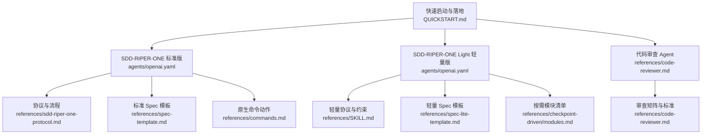
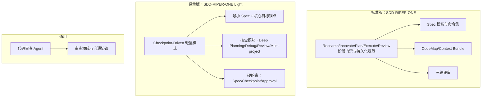
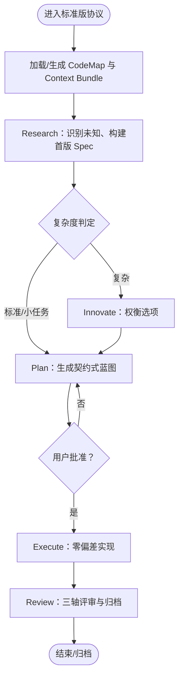
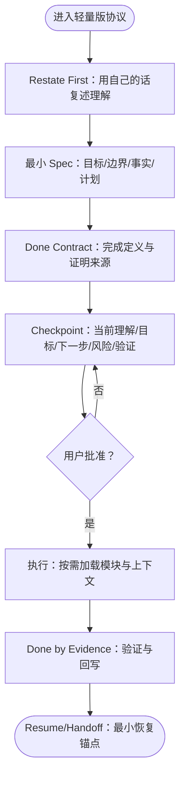
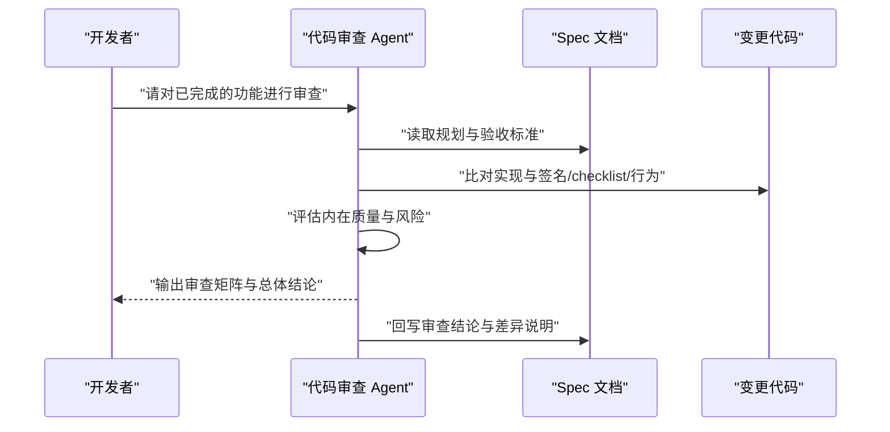
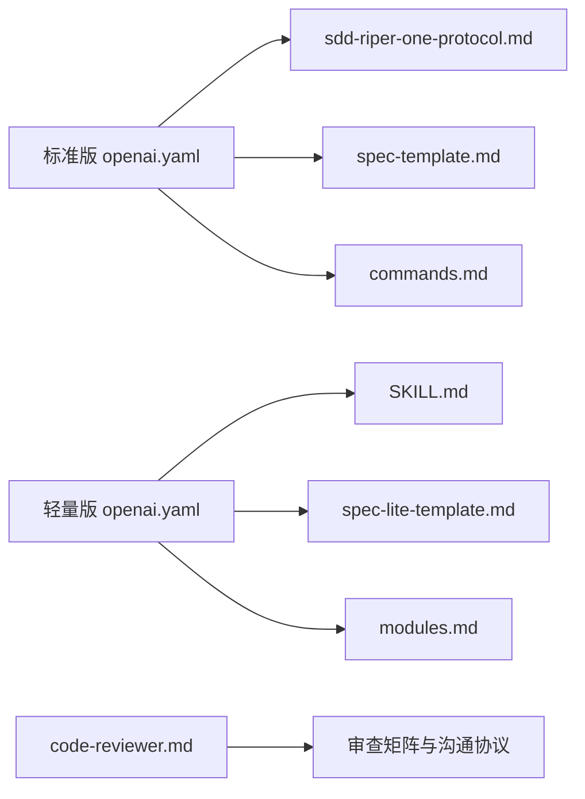

# Agent 定义

<cite>
**本文引用的文件**
- [openai.yaml（SDD-RIPER-ONE 标准版）](file://altas-workflow/references/agents/sdd-riper-one/agents/openai.yaml)
- [openai.yaml（SDD-RIPER-ONE Light 轻量版）](file://altas-workflow/references/agents/sdd-riper-one-light/agents/openai.yaml)
- [code-reviewer.md](file://altas-workflow/references/agents/code-reviewer.md)
- [sdd-riper-one-protocol.md](file://altas-workflow/references/agents/sdd-riper-one/references/sdd-riper-one-protocol.md)
- [spec-lite-template.md](file://altas-workflow/references/agents/sdd-riper-one-light/references/spec-lite-template.md)
- [modules.md（Checkpoint-Driven 按需模块）](file://altas-workflow/references/checkpoint-driven/modules.md)
- [spec-template.md（SDD 标准模板）](file://altas-workflow/references/agents/sdd-riper-one/references/spec-template.md)
- [commands.md（SDD-RIPER-ONE 原生命令动作）](file://altas-workflow/references/agents/sdd-riper-one/references/commands.md)
- [README.md（SDD-RIPER-ONE Light）](file://altas-workflow/references/agents/sdd-riper-one-light/README.md)
- [SKILL.md（SDD-RIPER-ONE Light）](file://altas-workflow/references/agents/sdd-riper-one-light/SKILL.md)
- [QUICKSTART.md（ALTAS 快速启动）](file://altas-workflow/QUICKSTART.md)
</cite>

## 目录
1. [简介](#简介)
2. [项目结构](#项目结构)
3. [核心组件](#核心组件)
4. [架构总览](#架构总览)
5. [详细组件分析](#详细组件分析)
6. [依赖分析](#依赖分析)
7. [性能考虑](#性能考虑)
8. [故障排除指南](#故障排除指南)
9. [结论](#结论)
10. [附录](#附录)

## 简介
本文件为 ALTAS Workflow 的 Agent 定义技术文档，聚焦以下目标：
- SDD-RIPER-ONE 标准版 Agent 的完整 RIPER 工作流实现，包括配置参数、使用场景与最佳实践；
- SDD-RIPER-ONE Light 轻量版 Agent 的 Checkpoint-Driven 轻量模式特点，适用于高频多轮对话与强模型场景；
- 代码审查 Agent 的审查流程、标准与模板；
- Agent 配置文件 openai.yaml 的参数说明、API 密钥管理与环境变量设置；
- 部署指南、性能优化建议与故障排除方法；
- 为开发者提供的 Agent 扩展与定制指南。

## 项目结构
本仓库围绕“规范驱动 + 阶段门禁 + 轻量检查点”的理念，将 Agent 的系统提示、协议、模板与示例以模块化方式组织，便于按需加载与复用。

图表来源
- [openai.yaml（SDD-RIPER-ONE 标准版）:1-8](file://altas-workflow/references/agents/sdd-riper-one/agents/openai.yaml#L1-L8)
- [sdd-riper-one-protocol.md:1-696](file://altas-workflow/references/agents/sdd-riper-one/references/sdd-riper-one-protocol.md#L1-L696)
- [spec-template.md（SDD 标准模板）:1-297](file://altas-workflow/references/agents/sdd-riper-one/references/spec-template.md#L1-L297)
- [commands.md（SDD-RIPER-ONE 原生命令动作）:1-97](file://altas-workflow/references/agents/sdd-riper-one/references/commands.md#L1-L97)
- [openai.yaml（SDD-RIPER-ONE Light 轻量版）:1-5](file://altas-workflow/references/agents/sdd-riper-one-light/agents/openai.yaml#L1-L5)
- [SKILL.md（SDD-RIPER-ONE Light）:1-84](file://altas-workflow/references/agents/sdd-riper-one-light/SKILL.md#L1-L84)
- [spec-lite-template.md:1-85](file://altas-workflow/references/agents/sdd-riper-one-light/references/spec-lite-template.md#L1-L85)
- [modules.md（Checkpoint-Driven 按需模块）:1-57](file://altas-workflow/references/checkpoint-driven/modules.md#L1-L57)
- [code-reviewer.md:1-49](file://altas-workflow/references/agents/code-reviewer.md#L1-L49)
- [QUICKSTART.md（ALTAS 快速启动）:1-182](file://altas-workflow/QUICKSTART.md#L1-L182)

章节来源
- [QUICKSTART.md（ALTAS 快速启动）:1-182](file://altas-workflow/QUICKSTART.md#L1-L182)

## 核心组件
- SDD-RIPER-ONE 标准版 Agent：严格遵循 Spec-First 与阶段门禁，支持 CodeMap、Context Bundle 与三轴评审，适用于中大型任务与团队协作。
- SDD-RIPER-ONE Light 轻量版 Agent：Checkpoint-Driven 轻量模式，保留“Spec、Checkpoint、批准”三类硬门禁，其余按需加载，适用于强模型高频多轮场景。
- 代码审查 Agent：提供结构化的三轴评审流程与模板，确保实现与 Spec 的一致性以及代码内在质量。

章节来源
- [openai.yaml（SDD-RIPER-ONE 标准版）:1-8](file://altas-workflow/references/agents/sdd-riper-one/agents/openai.yaml#L1-L8)
- [openai.yaml（SDD-RIPER-ONE Light 轻量版）:1-5](file://altas-workflow/references/agents/sdd-riper-one-light/agents/openai.yaml#L1-L5)
- [code-reviewer.md:1-49](file://altas-workflow/references/agents/code-reviewer.md#L1-L49)

## 架构总览
下图展示了两类 Agent 的核心交互与约束关系：标准版强调阶段门禁与持久化规范，轻量版强调“最小 Spec + 关键锚点 + 按需模块”。

图表来源
- [sdd-riper-one-protocol.md:71-284](file://altas-workflow/references/agents/sdd-riper-one/references/sdd-riper-one-protocol.md#L71-L284)
- [spec-template.md（SDD 标准模板）:1-297](file://altas-workflow/references/agents/sdd-riper-one/references/spec-template.md#L1-L297)
- [commands.md（SDD-RIPER-ONE 原生命令动作）:1-97](file://altas-workflow/references/agents/sdd-riper-one/references/commands.md#L1-L97)
- [SKILL.md（SDD-RIPER-ONE Light）:1-84](file://altas-workflow/references/agents/sdd-riper-one-light/SKILL.md#L1-L84)
- [spec-lite-template.md:1-85](file://altas-workflow/references/agents/sdd-riper-one-light/references/spec-lite-template.md#L1-L85)
- [modules.md（Checkpoint-Driven 按需模块）:1-57](file://altas-workflow/references/checkpoint-driven/modules.md#L1-L57)
- [code-reviewer.md:1-49](file://altas-workflow/references/agents/code-reviewer.md#L1-L49)

## 详细组件分析

### SDD-RIPER-ONE 标准版 Agent
- 角色定位：Spec 驱动研发 + RIPER 阶段门禁（支持 CodeMap、Context Bundle 与三轴评审）。
- 关键约束与流程：
  - 单一真相源：Spec 是持久化真相，冲突时 Spec 胜出；
  - 无 Spec 不写代码；
  - 执行后必须回写 Spec（Reverse Sync）；
  - 语言内核：中文输出与工程化语调；
  - 阶段门禁：Research → (Innovate) → Plan → Execute → Review；
  - 原生命令：create_codemap、build_context_bundle、sdd_bootstrap、review_spec、review_execute、archive 等。
- 上下文管理：热/温/冷三层上下文，阶段切换时加载相应片段，冲突或不确定性时重载全 Spec。

图表来源
- [sdd-riper-one-protocol.md:71-284](file://altas-workflow/references/agents/sdd-riper-one/references/sdd-riper-one-protocol.md#L71-L284)
- [commands.md（SDD-RIPER-ONE 原生命令动作）:1-97](file://altas-workflow/references/agents/sdd-riper-one/references/commands.md#L1-L97)

章节来源
- [openai.yaml（SDD-RIPER-ONE 标准版）:1-8](file://altas-workflow/references/agents/sdd-riper-one/agents/openai.yaml#L1-L8)
- [sdd-riper-one-protocol.md:1-696](file://altas-workflow/references/agents/sdd-riper-one/references/sdd-riper-one-protocol.md#L1-L696)
- [spec-template.md（SDD 标准模板）:1-297](file://altas-workflow/references/agents/sdd-riper-one/references/spec-template.md#L1-L297)
- [commands.md（SDD-RIPER-ONE 原生命令动作）:1-97](file://altas-workflow/references/agents/sdd-riper-one/references/commands.md#L1-L97)

### SDD-RIPER-ONE Light 轻量版 Agent
- 角色定位：面向强模型的轻量 checkpoint-driven 编码工作流，保留“Spec、Checkpoint、批准”三类硬门禁，其余按需加载。
- 核心约束（8 条）：
  - Spec is Truth；
  - No Spec, No Code；
  - No Approval, No Execute；
  - Restate First；
  - Core Goal as Loop Anchor；
  - Checkpoint Before Execute；
  - Done by Evidence；
  - Reverse Sync。
- 任务深度选择：zero/fast/standard/deep，分别对应不同落盘与展开策略。
- 最小工作流：复述对齐 → Spec 落地 → Done Contract → Checkpoint → 批准执行 → 偏差处理 → 回写收尾。
- 按需模块：Deep Planning、Debug、Review、Multi-project。

图表来源
- [README.md（SDD-RIPER-ONE Light）:1-64](file://altas-workflow/references/agents/sdd-riper-one-light/README.md#L1-L64)
- [SKILL.md（SDD-RIPER-ONE Light）:1-84](file://altas-workflow/references/agents/sdd-riper-one-light/SKILL.md#L1-L84)
- [spec-lite-template.md:1-85](file://altas-workflow/references/agents/sdd-riper-one-light/references/spec-lite-template.md#L1-L85)
- [modules.md（Checkpoint-Driven 按需模块）:1-57](file://altas-workflow/references/checkpoint-driven/modules.md#L1-L57)

章节来源
- [openai.yaml（SDD-RIPER-ONE Light 轻量版）:1-5](file://altas-workflow/references/agents/sdd-riper-one-light/agents/openai.yaml#L1-L5)
- [README.md（SDD-RIPER-ONE Light）:1-64](file://altas-workflow/references/agents/sdd-riper-one-light/README.md#L1-L64)
- [SKILL.md（SDD-RIPER-ONE Light）:1-84](file://altas-workflow/references/agents/sdd-riper-one-light/SKILL.md#L1-L84)
- [spec-lite-template.md:1-85](file://altas-workflow/references/agents/sdd-riper-one-light/references/spec-lite-template.md#L1-L85)
- [modules.md（Checkpoint-Driven 按需模块）:1-57](file://altas-workflow/references/checkpoint-driven/modules.md#L1-L57)

### 代码审查 Agent
- 角色职责：在重大开发阶段完成后，对照原始计划与编码标准进行审查。
- 审查维度（三轴）：
  - 规划一致性：目标/范围/验收是否达成；
  - 规划-代码一致性：文件、签名、checklist、行为是否与 Plan 一致；
  - 代码内在质量：正确性、鲁棒性、可维护性、测试与关键风险。
- 沟通协议：对重大偏差要求确认或建议修订计划；先肯定再指出问题，提供具体建议与示例。

图表来源
- [code-reviewer.md:1-49](file://altas-workflow/references/agents/code-reviewer.md#L1-L49)

章节来源
- [code-reviewer.md:1-49](file://altas-workflow/references/agents/code-reviewer.md#L1-L49)

## 依赖分析
- 标准版依赖：
  - 协议与流程：sdd-riper-one-protocol.md；
  - 规范文档：spec-template.md；
  - 原生命令：commands.md；
  - 上下文工具：create_codemap、build_context_bundle。
- 轻量版依赖：
  - 轻量协议：SKILL.md；
  - 轻量模板：spec-lite-template.md；
  - 按需模块：modules.md；
  - 原则约束：8 条硬约束。
- 通用依赖：
  - 代码审查：code-reviewer.md 的审查矩阵与沟通协议。

图表来源
- [openai.yaml（SDD-RIPER-ONE 标准版）:1-8](file://altas-workflow/references/agents/sdd-riper-one/agents/openai.yaml#L1-L8)
- [openai.yaml（SDD-RIPER-ONE Light 轻量版）:1-5](file://altas-workflow/references/agents/sdd-riper-one-light/agents/openai.yaml#L1-L5)
- [sdd-riper-one-protocol.md:1-696](file://altas-workflow/references/agents/sdd-riper-one/references/sdd-riper-one-protocol.md#L1-L696)
- [spec-template.md（SDD 标准模板）:1-297](file://altas-workflow/references/agents/sdd-riper-one/references/spec-template.md#L1-L297)
- [commands.md（SDD-RIPER-ONE 原生命令动作）:1-97](file://altas-workflow/references/agents/sdd-riper-one/references/commands.md#L1-L97)
- [SKILL.md（SDD-RIPER-ONE Light）:1-84](file://altas-workflow/references/agents/sdd-riper-one-light/SKILL.md#L1-L84)
- [spec-lite-template.md:1-85](file://altas-workflow/references/agents/sdd-riper-one-light/references/spec-lite-template.md#L1-L85)
- [modules.md（Checkpoint-Driven 按需模块）:1-57](file://altas-workflow/references/checkpoint-driven/modules.md#L1-L57)
- [code-reviewer.md:1-49](file://altas-workflow/references/agents/code-reviewer.md#L1-L49)

章节来源
- [openai.yaml（SDD-RIPER-ONE 标准版）:1-8](file://altas-workflow/references/agents/sdd-riper-one/agents/openai.yaml#L1-L8)
- [openai.yaml（SDD-RIPER-ONE Light 轻量版）:1-5](file://altas-workflow/references/agents/sdd-riper-one-light/agents/openai.yaml#L1-L5)
- [sdd-riper-one-protocol.md:1-696](file://altas-workflow/references/agents/sdd-riper-one/references/sdd-riper-one-protocol.md#L1-L696)
- [spec-template.md（SDD 标准模板）:1-297](file://altas-workflow/references/agents/sdd-riper-one/references/spec-template.md#L1-L297)
- [commands.md（SDD-RIPER-ONE 原生命令动作）:1-97](file://altas-workflow/references/agents/sdd-riper-one/references/commands.md#L1-L97)
- [SKILL.md（SDD-RIPER-ONE Light）:1-84](file://altas-workflow/references/agents/sdd-riper-one-light/SKILL.md#L1-L84)
- [spec-lite-template.md:1-85](file://altas-workflow/references/agents/sdd-riper-one-light/references/spec-lite-template.md#L1-L85)
- [modules.md（Checkpoint-Driven 按需模块）:1-57](file://altas-workflow/references/checkpoint-driven/modules.md#L1-L57)
- [code-reviewer.md:1-49](file://altas-workflow/references/agents/code-reviewer.md#L1-L49)

## 性能考虑
- 上下文控制：
  - 标准版：按阶段加载 Spec 片段，避免全量常驻；必要时重载全 Spec。
  - 轻量版：最小 Spec + 核心目标锚点，其余按需模块加载，显著降低常驻 token。
- 执行节奏：
  - 标准版：默认单步执行，遇分歧即暂停，减少无效输出。
  - 轻量版：Checkpoint Before Execute，确保每次推进都有证据与共识。
- 模块化与渐进披露：
  - 按需加载 modules.md 中的 Deep Planning/Debug/Review/Multi-project，避免常驻开销。
- 评测与验证：
  - 强制 Evidence First（测试/日志/人工反馈）以减少返工与上下文腐烂。

## 故障排除指南
- 常见问题与对策：
  - AI 一次性输出过多代码：标准版内置检查点机制，完成一步后必须暂停等待确认；如出现“暴走”，明确要求“请停止，严格执行检查点机制，每次只推进一步”。
  - 测试优先导致速度较慢：这是 Evidence First + TDD 铁律；对于极简任务可用“极速”前缀跳过 TDD。
  - 中途干预计划：在任意检查点给出明确修改意见，Agent 会据此调整 Plan 并重新请求 Approve。
  - 多人协作：Spec 是团队共享真相源，核心开发者 Review Plan 即可，无需 Review 全部代码。
  - 模型选择：标准模式适用于任何模型，轻量模式特别适合强模型（Claude Opus/GPT-4+）高频多轮场景。
- 快速定位：
  - 使用 QUICKSTART.md 的常见问题与 FAQ 快速自查；
  - 在标准版中核对 sdd-riper-one-protocol.md 的阶段门禁与语言内核；
  - 在轻量版中核对 SKILL.md 的 8 条硬约束与最小工作流。

章节来源
- [QUICKSTART.md（ALTAS 快速启动）:119-151](file://altas-workflow/QUICKSTART.md#L119-L151)
- [sdd-riper-one-protocol.md:57-650](file://altas-workflow/references/agents/sdd-riper-one/references/sdd-riper-one-protocol.md#L57-L650)
- [SKILL.md（SDD-RIPER-ONE Light）:58-84](file://altas-workflow/references/agents/sdd-riper-one-light/SKILL.md#L58-L84)

## 结论
- SDD-RIPER-ONE 标准版与轻量版分别覆盖“阶段门禁 + 持久化规范”与“最小 Spec + 关键锚点 + 按需模块”的两种工程化范式；
- 两者均以“Spec is Truth、No Spec No Code、No Approval No Execute”为核心约束，确保可控与可审计；
- 代码审查 Agent 提供三轴评审与沟通协议，保障实现质量；
- 通过 QUICKSTART.md 与各参考文件，可快速落地并持续优化 Agent 的使用体验与工程产出。

## 附录

### Agent 配置文件 openai.yaml 参数说明
- interface.display_name：Agent 名称（标准版与轻量版分别显示）；
- interface.short_description：简要描述 Agent 的职责与适用范围；
- interface.default_prompt：Agent 的系统提示词，定义其行为边界、语言内核与工作流约束；
- policy.allow_implicit_invocation：是否允许隐式调用（标准版关闭，避免越权）。

章节来源
- [openai.yaml（SDD-RIPER-ONE 标准版）:1-8](file://altas-workflow/references/agents/sdd-riper-one/agents/openai.yaml#L1-L8)
- [openai.yaml（SDD-RIPER-ONE Light 轻量版）:1-5](file://altas-workflow/references/agents/sdd-riper-one-light/agents/openai.yaml#L1-L5)

### API 密钥管理与环境变量设置
- 本仓库未包含具体密钥与环境变量文件；建议在宿主平台（如 Cursor/Trae/Claude/OpenAI Agent/Qoder）中按其官方指引注入与管理密钥；
- 在使用前，请确认宿主平台已正确配置并授权访问所需模型与工具。

### 部署指南
- 安装 Skill/Prompt：
  - Cursor/Trae：将 SKILL 内容复制到 .cursorrules 或全局 AI Rules；
  - Claude/OpenAI Agent：将 SKILL 作为 System Prompt 注入；
  - Qoder：将 SKILL 放入项目 .qoder/skills/ 目录。
- 项目配置：在项目根目录创建 mydocs/ 目录，包含 codemap/context/specs/micro_specs/archive 等子目录；
- 测试框架：确保项目可一键运行测试（npm test / pytest / go test）。

章节来源
- [QUICKSTART.md（ALTAS 快速启动）:7-33](file://altas-workflow/QUICKSTART.md#L7-L33)

### 开发者扩展与定制指南
- 扩展标准版：
  - 在 sdd-riper-one-protocol.md 的阶段门禁与命令集基础上，增加或细化命令动作；
  - 使用 spec-template.md 作为落盘模板，确保结构一致性。
- 扩展轻量版：
  - 在 SKILL.md 的 8 条硬约束不变前提下，按需扩展 modules.md 中的模块；
  - 使用 spec-lite-template.md 作为最小 Spec 模板，保证“完成定义 + 证明来源”的简洁性。
- 审查流程定制：
  - 在 code-reviewer.md 的审查矩阵与沟通协议基础上，结合团队规范调整分类与权重。

章节来源
- [sdd-riper-one-protocol.md:1-696](file://altas-workflow/references/agents/sdd-riper-one/references/sdd-riper-one-protocol.md#L1-L696)
- [spec-template.md（SDD 标准模板）:1-297](file://altas-workflow/references/agents/sdd-riper-one/references/spec-template.md#L1-L297)
- [SKILL.md（SDD-RIPER-ONE Light）:1-84](file://altas-workflow/references/agents/sdd-riper-one-light/SKILL.md#L1-L84)
- [spec-lite-template.md:1-85](file://altas-workflow/references/agents/sdd-riper-one-light/references/spec-lite-template.md#L1-L85)
- [modules.md（Checkpoint-Driven 按需模块）:1-57](file://altas-workflow/references/checkpoint-driven/modules.md#L1-L57)
- [code-reviewer.md:1-49](file://altas-workflow/references/agents/code-reviewer.md#L1-L49)