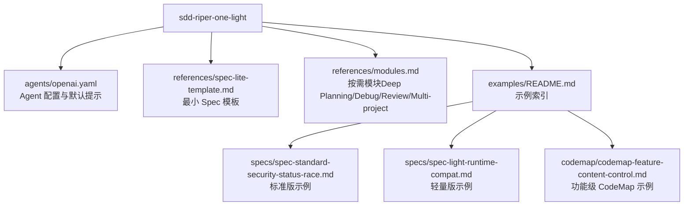
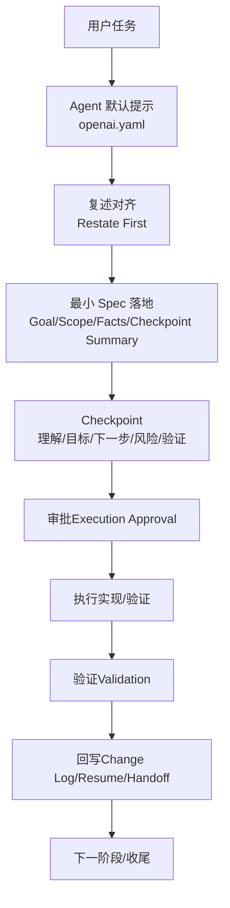
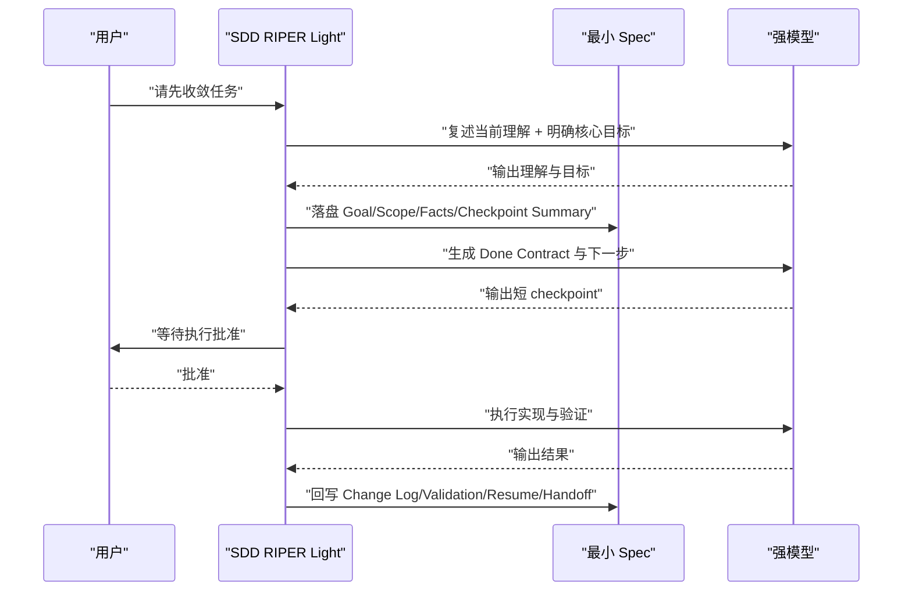
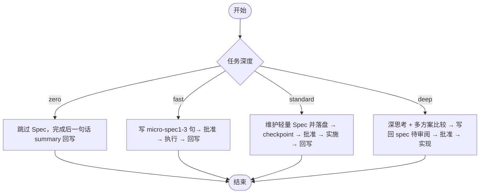
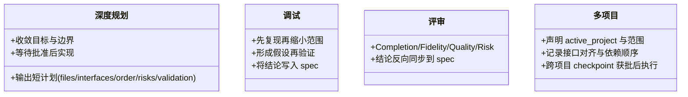
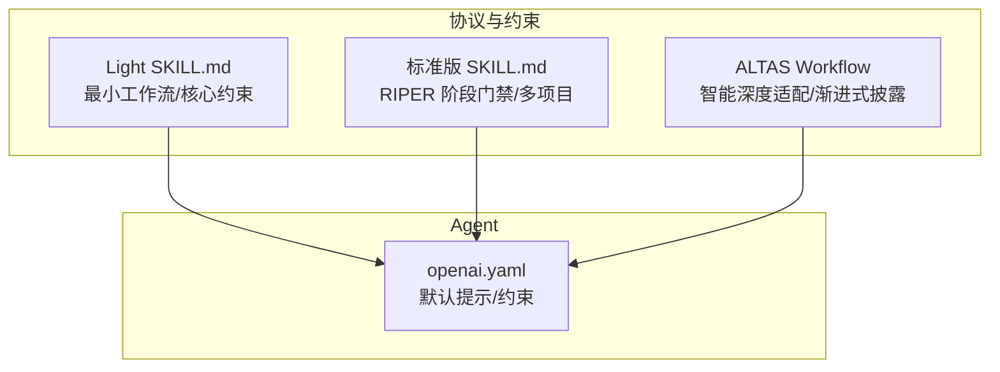

# SDD-RIPER-ONE Light 轻量版 Agent

<cite>
**本文引用的文件**
- [README.md](file://altas-workflow/references/agents/sdd-riper-one-light/README.md)
- [SKILL.md](file://altas-workflow/references/agents/sdd-riper-one-light/SKILL.md)
- [openai.yaml](file://altas-workflow/references/agents/sdd-riper-one-light/agents/openai.yaml)
- [examples/README.md](file://altas-workflow/references/agents/sdd-riper-one-light/examples/README.md)
- [spec-lite-template.md](file://altas-workflow/references/agents/sdd-riper-one-light/references/spec-lite-template.md)
- [modules.md](file://altas-workflow/references/agents/sdd-riper-one-light/references/modules.md)
- [spec-standard-security-status-race.md](file://altas-workflow/references/agents/sdd-riper-one-light/examples/specs/spec-standard-security-status-race.md)
- [spec-light-runtime-compat.md](file://altas-workflow/references/agents/sdd-riper-one-light/examples/specs/spec-light-runtime-compat.md)
- [codemap-feature-content-control.md](file://altas-workflow/references/agents/sdd-riper-one-light/examples/codemap/codemap-feature-content-control.md)
- [README.md](file://altas-workflow/references/agents/sdd-riper-one/README.md)
- [SKILL.md](file://altas-workflow/references/agents/sdd-riper-one/SKILL.md)
- [QUICKSTART.md](file://altas-workflow/QUICKSTART.md)
</cite>

## 目录
1. [简介](#简介)
2. [项目结构](#项目结构)
3. [核心组件](#核心组件)
4. [架构总览](#架构总览)
5. [详细组件分析](#详细组件分析)
6. [依赖分析](#依赖分析)
7. [性能考量](#性能考量)
8. [故障诊断指南](#故障诊断指南)
9. [结论](#结论)
10. [附录](#附录)

## 简介
SDD-RIPER-ONE Light 是面向强模型的轻量 checkpoint-driven 编码工作流，专为高频多轮对话与强模型场景设计。其核心思想是在保留“Spec、Checkpoint、审批”三类硬门禁的前提下，将其余流程交由强模型按需展开，从而在保证可控性的前提下显著降低常驻上下文开销，提升交互效率与稳定性。

- 一句话定位：保留 spec、checkpoint、审批三类硬门禁，其余让强模型自行处理——少废话，强控制。
- 适用模型：强模型（如 Claude Opus/GPT-5+），在高频多轮与大上下文任务中表现更佳。
- 常驻上下文：最小 spec + 核心目标锚点，其余按需加载，避免上下文膨胀。

**章节来源**
- [README.md:1-64](file://altas-workflow/references/agents/sdd-riper-one-light/README.md#L1-L64)

## 项目结构
SDD-RIPER-ONE Light 的文档与示例围绕“Agent 配置 + 最小 Spec 模板 + 按需模块 + 示例文档”组织，便于快速安装、理解与落地。

**图表来源**
- [openai.yaml:1-5](file://altas-workflow/references/agents/sdd-riper-one-light/agents/openai.yaml#L1-L5)
- [spec-lite-template.md:1-85](file://altas-workflow/references/agents/sdd-riper-one-light/references/spec-lite-template.md#L1-L85)
- [modules.md:1-57](file://altas-workflow/references/agents/sdd-riper-one-light/references/modules.md#L1-L57)
- [examples/README.md:1-16](file://altas-workflow/references/agents/sdd-riper-one-light/examples/README.md#L1-L16)
- [spec-standard-security-status-race.md:1-87](file://altas-workflow/references/agents/sdd-riper-one-light/examples/specs/spec-standard-security-status-race.md#L1-L87)
- [spec-light-runtime-compat.md:1-70](file://altas-workflow/references/agents/sdd-riper-one-light/examples/specs/spec-light-runtime-compat.md#L1-L70)
- [codemap-feature-content-control.md:1-136](file://altas-workflow/references/agents/sdd-riper-one-light/examples/codemap/codemap-feature-content-control.md#L1-L136)

**章节来源**
- [examples/README.md:1-16](file://altas-workflow/references/agents/sdd-riper-one-light/examples/README.md#L1-L16)

## 核心组件
- Agent 配置与默认提示：通过 openai.yaml 提供显示名称、简述与默认提示，确保模型在执行任务时遵循轻量 checkpoint-driven 的协议与约束。
- 最小 Spec 模板：spec-lite-template.md 定义了最小可落盘的 Spec 结构，强调“当前理解 + 核心目标 + 下一步 + 风险 + 验证”，并在 fast/standard/deep 任务中给出建议填充范围。
- 按需模块：modules.md 提供 Deep Planning、Debug、Review、Multi-project 四类模块，仅在命中场景时加载，避免常驻 token 消耗。
- 示例与参考：examples/README.md 提供标准版、轻量版 Spec 与功能级 CodeMap 的示例索引，便于对照学习与迁移。

**章节来源**
- [openai.yaml:1-5](file://altas-workflow/references/agents/sdd-riper-one-light/agents/openai.yaml#L1-L5)
- [spec-lite-template.md:1-85](file://altas-workflow/references/agents/sdd-riper-one-light/references/spec-lite-template.md#L1-L85)
- [modules.md:1-57](file://altas-workflow/references/agents/sdd-riper-one-light/references/modules.md#L1-L57)
- [examples/README.md:1-16](file://altas-workflow/references/agents/sdd-riper-one-light/examples/README.md#L1-L16)

## 架构总览
SDD-RIPER-ONE Light 的工作流以“最小 Spec + 核心目标锚点”为核心，配合 checkpoint-driven 的短周期推进与按需模块加载，形成“强模型主导、协议约束”的高效协作模式。

**图表来源**
- [openai.yaml:1-5](file://altas-workflow/references/agents/sdd-riper-one-light/agents/openai.yaml#L1-L5)
- [SKILL.md:48-57](file://altas-workflow/references/agents/sdd-riper-one-light/SKILL.md#L48-L57)
- [spec-lite-template.md:51-69](file://altas-workflow/references/agents/sdd-riper-one-light/references/spec-lite-template.md#L51-L69)

**章节来源**
- [SKILL.md:48-57](file://altas-workflow/references/agents/sdd-riper-one-light/SKILL.md#L48-L57)

## 详细组件分析

### Agent 配置与默认提示
- 显示名称与简述：明确 Agent 的定位与职责，便于在不同平台（如 Cursor/Trae/Claude/OpenAI Agent/Qoder）中统一注入。
- 默认提示：强调“先用自己的话复述理解 + 明确阶段性核心目标 + 建立/更新最小 Spec + 明确 Done Contract + 执行前短 checkpoint + 未获批准不执行 + 执行后回写”。

**图表来源**
- [openai.yaml:1-5](file://altas-workflow/references/agents/sdd-riper-one-light/agents/openai.yaml#L1-L5)
- [spec-lite-template.md:51-69](file://altas-workflow/references/agents/sdd-riper-one-light/references/spec-lite-template.md#L51-L69)

**章节来源**
- [openai.yaml:1-5](file://altas-workflow/references/agents/sdd-riper-one-light/agents/openai.yaml#L1-L5)

### 最小 Spec 模板与任务深度
- 任务深度分级：zero/fast/standard/deep，分别对应“跳过 Spec 直接执行”“micro-spec + 批准”“轻量 Spec 落地 + checkpoint”“深思考 + 多方案比较”。
- 最小 Spec 建议：fast 至少保留 Goal/Done Contract/Restated Understanding/Checkpoint Summary/Approval/Change Log/Validation/Resume/Handoff；standard 补齐全部区块；deep 在此基础上扩展但避免巨型 Spec。
- Done Contract：保持 1-3 行，优先写“完成定义 + 证明来源”，不写成长计划。
- 回写与恢复：执行前将 Execution Approval 置为 Pending，获批后改为 Approved；暂停/交接前更新 Resume/Handoff。

**图表来源**
- [README.md:44-52](file://altas-workflow/references/agents/sdd-riper-one-light/README.md#L44-L52)
- [spec-lite-template.md:71-85](file://altas-workflow/references/agents/sdd-riper-one-light/references/spec-lite-template.md#L71-L85)

**章节来源**
- [README.md:44-52](file://altas-workflow/references/agents/sdd-riper-one-light/README.md#L44-L52)
- [spec-lite-template.md:71-85](file://altas-workflow/references/agents/sdd-riper-one-light/references/spec-lite-template.md#L71-L85)

### 按需模块（Deep Planning/Debug/Review/Multi-project）
- Deep Planning：需求模糊、架构设计、跨模块重构、迁移、长链路任务。要点是收敛目标与边界，输出短计划（含 files/interfaces/order/risks/validation），先输出 summary/plan 后暂停等待批准。
- Debug：报错不稳定、根因未知、链路过长。要点是先复现再缩小范围、形成假设再验证，将根因假设、排查结论、拟议修法写入 spec，再请求执行批准。
- Review：用户要求评审、任务收尾、高风险改动、提交前。默认从 Completion/Fidelity/Quality/Risk 四点快速评估，输出保持短，并把结论反向同步到 spec。
- Multi-project：多仓/monorepo/前后端联动/跨子项目任务。要点是先声明 active_project 与改动范围，再决定是否进入 cross；跨项目时记录改了哪些项目、接口如何对齐、依赖顺序；切换项目或进入跨项目实现前回读相关 spec/codemap 区块；跨项目 checkpoint 获批后再执行。

**图表来源**
- [modules.md:5-57](file://altas-workflow/references/agents/sdd-riper-one-light/references/modules.md#L5-L57)

**章节来源**
- [modules.md:1-57](file://altas-workflow/references/agents/sdd-riper-one-light/references/modules.md#L1-L57)

### 示例与参考
- 标准版示例：展示如何沉淀目标、边界、事实、计划、验证与回写闭环，适合复杂任务与跨模块场景。
- 轻量版示例：展示强模型场景下如何用最小信息维持任务理解、核心目标与进度同步，适合高频多轮与强模型场景。
- 功能级 CodeMap 示例：展示如何快速定位入口、路由、关键链路、数据结构与风险点，便于按需加载与检索。

**章节来源**
- [spec-standard-security-status-race.md:1-87](file://altas-workflow/references/agents/sdd-riper-one-light/examples/specs/spec-standard-security-status-race.md#L1-L87)
- [spec-light-runtime-compat.md:1-70](file://altas-workflow/references/agents/sdd-riper-one-light/examples/specs/spec-light-runtime-compat.md#L1-L70)
- [codemap-feature-content-control.md:1-136](file://altas-workflow/references/agents/sdd-riper-one-light/examples/codemap/codemap-feature-content-control.md#L1-L136)

## 依赖分析
- Agent 与协议的关系：Agent 的默认提示与约束来自 SKILL.md 中的“最小工作流”与“核心约束”，确保执行流程与协议一致。
- 与标准版的差异：标准版（SDD-RIPER-ONE）强调完整的 RIPER 阶段门禁与多项目协作能力；Light 版强调 checkpoint-driven 与按需模块加载，适用于强模型高频多轮场景。
- 与 ALTAS Workflow 的关系：SDD-RIPER-ONE Light 属于 ALTAS Workflow 的独立 Agent，与 ALTAS 的“智能深度适配、进度可视化、渐进式披露、核心铁律”理念一致。

**图表来源**
- [SKILL.md](file://altas-workflow/references/agents/sdd-riper-one-light/SKILL.md)
- [README.md](file://altas-workflow/references/agents/sdd-riper-one/README.md)
- [QUICKSTART.md](file://altas-workflow/QUICKSTART.md)

**章节来源**
- [SKILL.md](file://altas-workflow/references/agents/sdd-riper-one-light/SKILL.md)
- [README.md](file://altas-workflow/references/agents/sdd-riper-one/README.md)
- [QUICKSTART.md](file://altas-workflow/QUICKSTART.md)

## 性能考量
- 减少常驻上下文：Light 版仅常驻最小 spec + 核心目标锚点，其余按需加载，显著降低 token 消耗与上下文膨胀风险。
- 强模型主导：在高频多轮与大上下文中，强模型具备更强的自我分解、补足计划与按需追溯能力，减少低价值常驻 token。
- 按需模块：仅在命中场景加载对应模块，避免不必要的 token 消耗。
- 输出风格：默认短输出，优先给出“当前理解 + 核心目标 + spec 摘要 + 下一步 + 必要风险”，不强制打印阶段状态机，减少冗余信息。

**章节来源**
- [SKILL.md:75-84](file://altas-workflow/references/agents/sdd-riper-one-light/SKILL.md#L75-L84)

## 故障诊断指南
- 何时暂停：当需求存在会改变实现方向的关键歧义、需要破坏性/高风险/不可逆操作、涉及架构级改动/公共接口变更/数据模型变更/迁移策略变更、跨项目修改范围不清、发现现有 spec 明显错误/过期/与代码现实冲突、尚未形成最小 spec 或尚未得到明确执行许可时，先暂停并说明原因。
- 偏差处理：若测试/日志/反馈暴露偏差，先基于证据重述核心目标是否变化，再决定继续或调整。
- 回写与收尾：回写 Change Log/Validation/Resume/Handoff，说明核心目标是否已由证据证明完成。
- 审批与执行：执行前将 Execution Approval 置为 Pending，获批后改为 Approved；未获批准前不执行代码修改。

**章节来源**
- [SKILL.md:58-68](file://altas-workflow/references/agents/sdd-riper-one-light/SKILL.md#L58-L68)
- [spec-lite-template.md:51-69](file://altas-workflow/references/agents/sdd-riper-one-light/references/spec-lite-template.md#L51-L69)

## 结论
SDD-RIPER-ONE Light 通过“最小 Spec + 核心目标锚点 + checkpoint-driven + 按需模块”的组合，在强模型高频多轮与大上下文场景下实现了高效、可控且可审计的编码协作。其核心约束与最小工作流确保了执行的确定性与可追溯性，同时通过渐进式披露与短输出风格显著降低了上下文成本，适合追求“少废话、强控制”的强模型应用场景。

## 附录

### 与标准版的功能差异对比
- 流程：标准版为完整 RIPER 阶段门禁；Light 版为 checkpoint-driven，按需展开。
- 适用模型：标准版适用于各类模型；Light 版特别适合强模型（Claude Opus/GPT-5+）。
- 常驻上下文：标准版为热/温/冷三层；Light 版为最小 spec + 核心目标锚点。
- 适用场景：标准版适用于中大型团队任务；Light 版适用于高频多轮、大上下文任务。

**章节来源**
- [README.md:9-17](file://altas-workflow/references/agents/sdd-riper-one-light/README.md#L9-L17)
- [README.md:1-64](file://altas-workflow/references/agents/sdd-riper-one-light/README.md#L1-L64)

### 部署与使用指南
- 安装：在技能宿主中安装 /path/to/sdd-riper-one-light。
- 环境要求：项目根目录创建 mydocs/（codemap/context/specs/micro_specs/archive），确保测试框架可用（npm test / pytest / go test）。
- 快速上手：使用模板引导 Agent 先收敛任务，要求输出“对任务的理解 + 本轮阶段性核心目标 + micro-spec/summary + Done Contract + 下一步动作 + 风险”，获批后再执行。
- 最佳实践：优先使用最小 Spec；在 fast/standard/deep 任务中按建议填充区块；执行前短 checkpoint；回写 Change Log/Validation/Resume/Handoff；跨项目时先声明范围并获得批准。

**章节来源**
- [README.md:59-64](file://altas-workflow/references/agents/sdd-riper-one-light/README.md#L59-L64)
- [QUICKSTART.md:7-33](file://altas-workflow/QUICKSTART.md#L7-L33)
- [README.md:29-42](file://altas-workflow/references/agents/sdd-riper-one-light/README.md#L29-L42)

### 实际使用案例
- 标准版示例：协作资源安全状态竞争修复，展示从问题现象到修复闭环的完整 Spec 写法与验证。
- 轻量版示例：低版本运行时的版本字段兼容读取，展示如何用最小修改修补运行时兼容问题。
- 功能级 CodeMap 示例：协作内容审核，展示如何用 CodeMap 组织复杂功能的入口、主链路、状态边界与风险点。

**章节来源**
- [spec-standard-security-status-race.md:1-87](file://altas-workflow/references/agents/sdd-riper-one-light/examples/specs/spec-standard-security-status-race.md#L1-L87)
- [spec-light-runtime-compat.md:1-70](file://altas-workflow/references/agents/sdd-riper-one-light/examples/specs/spec-light-runtime-compat.md#L1-L70)
- [codemap-feature-content-control.md:1-136](file://altas-workflow/references/agents/sdd-riper-one-light/examples/codemap/codemap-feature-content-control.md#L1-L136)