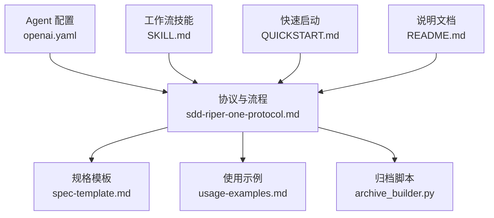
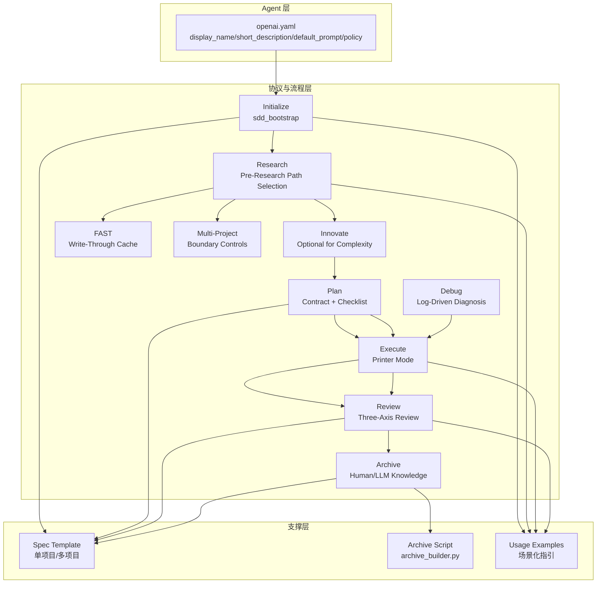
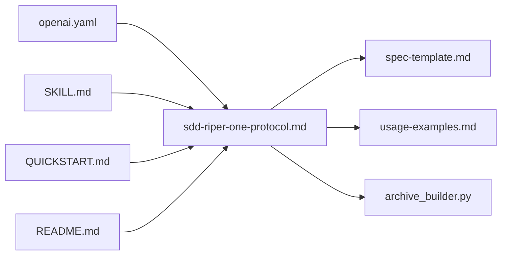

# SDD-RIPER-ONE 标准版 Agent

<cite>
**本文引用的文件**
- [openai.yaml](file://altas-workflow/references/agents/sdd-riper-one/agents/openai.yaml)
- [sdd-riper-one-protocol.md](file://altas-workflow/references/agents/sdd-riper-one/references/sdd-riper-one-protocol.md)
- [spec-template.md](file://altas-workflow/references/agents/sdd-riper-one/references/spec-template.md)
- [usage-examples.md](file://altas-workflow/references/agents/sdd-riper-one/references/usage-examples.md)
- [archive_builder.py](file://altas-workflow/references/agents/sdd-riper-one/scripts/archive_builder.py)
- [README.md](file://altas-workflow/references/agents/sdd-riper-one/README.md)
- [SKILL.md](file://altas-workflow/SKILL.md)
- [QUICKSTART.md](file://altas-workflow/QUICKSTART.md)
</cite>

## 目录
1. [简介](#简介)
2. [项目结构](#项目结构)
3. [核心组件](#核心组件)
4. [架构总览](#架构总览)
5. [详细组件分析](#详细组件分析)
6. [依赖分析](#依赖分析)
7. [性能考虑](#性能考虑)
8. [故障排除指南](#故障排除指南)
9. [结论](#结论)
10. [附录](#附录)

## 简介
SDD-RIPER-ONE 标准版 Agent 是面向“Spec 驱动研发 + RIPER 阶段门禁”的严格工作流代理，围绕 Initialize → Research → Innovate → Plan → Execute → Review 六阶段构建，辅以 Phase Gate、Hot Context、Approval Status、Reverse Sync 等高级特性，确保 AI 编码在可审计、可复核、可沉淀的工程化流程中进行。其核心目标是通过“No Spec No Code、No Approval No Execute、Spec is Truth、Reverse Sync”等规则，将“先写代码再写 Spec”的高风险模式转变为“先落盘 Spec 再执行”的低风险模式。

## 项目结构
SDD-RIPER-ONE 的实现与使用说明主要分布在以下位置：
- Agent 配置：agents/openai.yaml
- 协议与流程：references/sdd-riper-one-protocol.md
- 规格模板：references/spec-template.md
- 使用示例：references/usage-examples.md
- 归档脚本：scripts/archive_builder.py
- 快速说明：references/README.md
- 工作流技能：SKILL.md、QUICKSTART.md

图表来源
- [openai.yaml:1-8](file://altas-workflow/references/agents/sdd-riper-one/agents/openai.yaml#L1-L8)
- [sdd-riper-one-protocol.md:1-696](file://altas-workflow/references/agents/sdd-riper-one/references/sdd-riper-one-protocol.md#L1-L696)
- [spec-template.md:1-297](file://altas-workflow/references/agents/sdd-riper-one/references/spec-template.md#L1-L297)
- [usage-examples.md:1-454](file://altas-workflow/references/agents/sdd-riper-one/references/usage-examples.md#L1-L454)
- [archive_builder.py:1-505](file://altas-workflow/references/agents/sdd-riper-one/scripts/archive_builder.py#L1-L505)
- [SKILL.md:1-351](file://altas-workflow/SKILL.md#L1-L351)
- [QUICKSTART.md:1-182](file://altas-workflow/QUICKSTART.md#L1-L182)
- [README.md:1-69](file://altas-workflow/references/agents/sdd-riper-one/README.md#L1-L69)

章节来源
- [openai.yaml:1-8](file://altas-workflow/references/agents/sdd-riper-one/agents/openai.yaml#L1-L8)
- [sdd-riper-one-protocol.md:1-696](file://altas-workflow/references/agents/sdd-riper-one/references/sdd-riper-one-protocol.md#L1-L696)
- [spec-template.md:1-297](file://altas-workflow/references/agents/sdd-riper-one/references/spec-template.md#L1-L297)
- [usage-examples.md:1-454](file://altas-workflow/references/agents/sdd-riper-one/references/usage-examples.md#L1-L454)
- [archive_builder.py:1-505](file://altas-workflow/references/agents/sdd-riper-one/scripts/archive_builder.py#L1-L505)
- [README.md:1-69](file://altas-workflow/references/agents/sdd-riper-one/README.md#L1-L69)
- [SKILL.md:1-351](file://altas-workflow/SKILL.md#L1-L351)
- [QUICKSTART.md:1-182](file://altas-workflow/QUICKSTART.md#L1-L182)

## 核心组件
- Agent 配置：定义 display_name、short_description、default_prompt 等关键参数，以及策略 allow_implicit_invocation。
- 协议与流程：定义 RIPER 六阶段、Phase Gate、Hot/Warm/Cold Context、Approval Status、Reverse Sync、Multi-Project、Debug、Archive 等机制。
- 规格模板：提供单项目与多项目两种 Spec 结构，指导各阶段落盘。
- 使用示例：覆盖标准流、多项目流、Debug、Review、Archive 等典型场景。
- 归档脚本：自动化生成 human/llm 双视角归档文档，保留 Trace to Sources。

章节来源
- [openai.yaml:1-8](file://altas-workflow/references/agents/sdd-riper-one/agents/openai.yaml#L1-L8)
- [sdd-riper-one-protocol.md:1-696](file://altas-workflow/references/agents/sdd-riper-one/references/sdd-riper-one-protocol.md#L1-L696)
- [spec-template.md:1-297](file://altas-workflow/references/agents/sdd-riper-one/references/spec-template.md#L1-L297)
- [usage-examples.md:1-454](file://altas-workflow/references/agents/sdd-riper-one/references/usage-examples.md#L1-L454)
- [archive_builder.py:1-505](file://altas-workflow/references/agents/sdd-riper-one/scripts/archive_builder.py#L1-L505)

## 架构总览
SDD-RIPER-ONE 的整体架构以“Spec 中心论”为核心，通过严格的阶段门禁与上下文管理，确保每次改动都有据可依、可审可验。

图表来源
- [openai.yaml:1-8](file://altas-workflow/references/agents/sdd-riper-one/agents/openai.yaml#L1-L8)
- [sdd-riper-one-protocol.md:71-284](file://altas-workflow/references/agents/sdd-riper-one/references/sdd-riper-one-protocol.md#L71-L284)
- [spec-template.md:1-297](file://altas-workflow/references/agents/sdd-riper-one/references/spec-template.md#L1-L297)
- [usage-examples.md:1-454](file://altas-workflow/references/agents/sdd-riper-one/references/usage-examples.md#L1-L454)
- [archive_builder.py:1-505](file://altas-workflow/references/agents/sdd-riper-one/scripts/archive_builder.py#L1-L505)

## 详细组件分析

### Agent 配置参数详解
- display_name：Agent 的显示名称，用于界面识别与交互提示。
- short_description：简短描述，体现 Agent 的核心能力与约束。
- default_prompt：核心引导语，包含：
  - 严格 SDD-RIPER 模式
  - 核心规则：No Spec No Code、No Approval No Execute、Spec is Truth、Reverse Sync
  - Pre-Research 工具：create_codemap、build_context_bundle
  - 启动命令：sdd_bootstrap
  - 流程：Research → (Innovate) → Plan → Execute → Review
  - Hot Context：phase、approval status、goal、scope、active checklist、open questions、risks、next action、spec path
  - Hot Context 与 Spec 的优先级：Spec 胜出
  - 审批：必须显式“Plan Approved”
  - 上下文加载策略：阶段切换时加载 Warm Context；冲突/不确定性时重载完整 Spec；按需加载 Cold Context
- policy.allow_implicit_invocation：是否允许隐式调用（在本文件中为 false）。

章节来源
- [openai.yaml:1-8](file://altas-workflow/references/agents/sdd-riper-one/agents/openai.yaml#L1-L8)

### 核心规则与 Phase Gate
- No Spec No Code：未形成最小 Spec 前不得写代码（Size XS 豁免）。
- No Approval No Execute：Plan 阶段必须获得明确“Plan Approved”才可进入 Execute。
- Spec is Truth：Spec 与代码冲突时，以 Spec 为准；Bug 先修 Spec 再修代码（Reverse Sync）。
- Reverse Sync：执行中发现偏差→先更新 Spec→再修代码→重对齐核心目标。
- Phase Gate：每个阶段的“暂停点”（STOP-AND-WAIT），严格遵循 ACT → PERSIST → DISPLAY → BATCH CHECK → STOP 的顺序。
- Hot Context：每轮均携带 phase、approval status、goal、scope、active checklist 等关键上下文，确保可追踪与可审计。
- Approval Status：审批必须显式“Plan Approved”，不可推断或省略。
- Multi-Project：自动发现子项目，强制边界控制与跨项目契约记录，执行顺序按 Provider→Consumer 依赖排序。
- Debug：日志驱动的只读分析，先三角定位再建议修复，代码修改需进入 RIPER 或 FAST。
- Archive：任务结束后生成 human/llm 双视角归档，保留 Trace to Sources。

章节来源
- [sdd-riper-one-protocol.md:17-650](file://altas-workflow/references/agents/sdd-riper-one/references/sdd-riper-one-protocol.md#L17-L650)

### 规格模板与落盘规范
- 单项目模板：包含 Open Questions、Requirements、Context Sources、Codemap Used、Context Bundle Snapshot、Research Findings、Next Actions、Innovate、Plan、Execute Log、Review Verdict、Plan-Execution Diff、Archive Record 等章节。
- 多项目模板：在单项目基础上增加 Project Registry、Multi-Project Config、按项目分组的 File Changes/Signatures/Checklist、Contract Interfaces、Touched Projects 等。
- 落盘要求：每次更新 Spec 必须立即保存到磁盘，且不可仅在聊天中展示而不落盘。

章节来源
- [spec-template.md:1-297](file://altas-workflow/references/agents/sdd-riper-one/references/spec-template.md#L1-L297)

### 使用示例与最佳实践
- 标准流：create_codemap → build_context_bundle → sdd_bootstrap → Research → Innovate（可选）→ Plan → Plan Approved → Execute → Review → Archive。
- 多项目流：sdd_bootstrap: mode=multi_project → 自动发现 → 生成各项目 CodeMap → 按项目分组 Plan → Provider 先执行 → Consumer 后执行 → Review 三轴 + Touched Projects。
- Debug：DEBUG/排查/日志分析 → 读取日志+Spec+CodeMap → 三角定位 → 输出根因与建议 → 需修复时进入 RIPER 或 FAST。
- Review：REVIEW SPEC（建议性预审）与 REVIEW EXECUTE（三轴评审）分别在执行前后进行，确保质量闭环。
- Archive：ARCHIVE/归档/沉淀 → 生成 human/llm 双视角文档，保留 Source Index 与 Trace to Sources。

章节来源
- [usage-examples.md:1-454](file://altas-workflow/references/agents/sdd-riper-one/references/usage-examples.md#L1-L454)

### 归档脚本与知识沉淀
- 归档脚本支持：
  - kind：spec/codemap/mixed
  - audience：human/llm/both
  - mode：snapshot/thematic
  - topic：主题标题（可省略，自动推断）
  - 输出：human/llm 双文档，包含 Source Index 与 Trace to Sources
- 限制：默认不允许归档处于活跃状态的 Spec，除非显式允许。

章节来源
- [archive_builder.py:1-505](file://altas-workflow/references/agents/sdd-riper-one/scripts/archive_builder.py#L1-L505)

### 上下文装配策略（Hot/Warm/Cold）
- Hot Context：每轮携带 phase、approval status、goal、scope、active checklist 等，确保可追踪。
- Warm Context：阶段切换时加载（如 Research→Plan、Plan→Execute、Execute→Review），包含研究发现、Plan 文件/签名、验证结果等。
- Cold Context：冲突/不确定性时按需加载完整 Spec、历史 Research 详情、完整 CodeMap 等，避免上下文腐烂。

章节来源
- [sdd-riper-one-protocol.md:35-42](file://altas-workflow/references/agents/sdd-riper-one/references/sdd-riper-one-protocol.md#L35-L42)
- [SKILL.md:318-334](file://altas-workflow/SKILL.md#L318-L334)

### 多项目协议与边界控制
- 自动发现：扫描 workdir，通过 package.json/pom.xml/go.mod 等标记文件识别子项目。
- 边界控制：默认 local（仅改当前项目），跨项目需显式 CROSS/跨项目；执行前必须加载目标项目 CodeMap。
- 契约与顺序：Provider（接口/Schema 所有者）先 → Consumer（调用方）后；记录 Contract Interfaces 与 Touched Projects。

章节来源
- [sdd-riper-one-protocol.md:389-528](file://altas-workflow/references/agents/sdd-riper-one/references/sdd-riper-one-protocol.md#L389-L528)

### 执行策略与批量覆盖
- 默认策略：单步执行（1 个 Checklist 项 → 检查点），便于调试与定位。
- 批量覆盖：命令“全部/all/execute all/继续完成所有/一次性完成”可覆盖默认策略，但每完成一个逻辑文件仍需保存。
- 紧急停止：遇到逻辑冲突或缺失 Spec 细节时必须立即停止。

章节来源
- [sdd-riper-one-protocol.md:191-220](file://altas-workflow/references/agents/sdd-riper-one/references/sdd-riper-one-protocol.md#L191-L220)

### 三轴评审与质量门禁
- 轴1：Spec 质量与需求达成（Goal/In-Scope/Acceptance 是否完整清晰；需求是否达成）
- 轴2：Spec-代码一致性（文件、签名、Checklist、行为是否与 Plan 一致）
- 轴3：代码内在质量（正确性、鲁棒性、可维护性、测试、关键风险）
- 门禁：任一轴 FAIL → 返回上一阶段；Review 未通过则必须解决阻塞项方可关闭任务。

章节来源
- [sdd-riper-one-protocol.md:221-260](file://altas-workflow/references/agents/sdd-riper-one/references/sdd-riper-one-protocol.md#L221-L260)

### 初始化与退出协议
- 初始化：输出“SDD-RIPER-ONE 协议已加载”，默认 PRE-RESEARCH，随后进入 RESEARCH。
- 退出：EXIT SDD → 禁用所有 RIPER 约束，回到标准助手模式。

章节来源
- [sdd-riper-one-protocol.md:679-696](file://altas-workflow/references/agents/sdd-riper-one/references/sdd-riper-one-protocol.md#L679-L696)

## 依赖分析
SDD-RIPER-ONE 的依赖关系主要体现在“协议与流程”对“规格模板”“使用示例”“归档脚本”的引用与调用。

图表来源
- [openai.yaml:1-8](file://altas-workflow/references/agents/sdd-riper-one/agents/openai.yaml#L1-L8)
- [sdd-riper-one-protocol.md:1-696](file://altas-workflow/references/agents/sdd-riper-one/references/sdd-riper-one-protocol.md#L1-L696)
- [spec-template.md:1-297](file://altas-workflow/references/agents/sdd-riper-one/references/spec-template.md#L1-L297)
- [usage-examples.md:1-454](file://altas-workflow/references/agents/sdd-riper-one/references/usage-examples.md#L1-L454)
- [archive_builder.py:1-505](file://altas-workflow/references/agents/sdd-riper-one/scripts/archive_builder.py#L1-L505)
- [SKILL.md:1-351](file://altas-workflow/SKILL.md#L1-L351)
- [QUICKSTART.md:1-182](file://altas-workflow/QUICKSTART.md#L1-L182)
- [README.md:1-69](file://altas-workflow/references/agents/sdd-riper-one/README.md#L1-L69)

章节来源
- [openai.yaml:1-8](file://altas-workflow/references/agents/sdd-riper-one/agents/openai.yaml#L1-L8)
- [sdd-riper-one-protocol.md:1-696](file://altas-workflow/references/agents/sdd-riper-one/references/sdd-riper-one-protocol.md#L1-L696)
- [spec-template.md:1-297](file://altas-workflow/references/agents/sdd-riper-one/references/spec-template.md#L1-L297)
- [usage-examples.md:1-454](file://altas-workflow/references/agents/sdd-riper-one/references/usage-examples.md#L1-L454)
- [archive_builder.py:1-505](file://altas-workflow/references/agents/sdd-riper-one/scripts/archive_builder.py#L1-L505)
- [SKILL.md:1-351](file://altas-workflow/SKILL.md#L1-L351)
- [QUICKSTART.md:1-182](file://altas-workflow/QUICKSTART.md#L1-L182)
- [README.md:1-69](file://altas-workflow/references/agents/sdd-riper-one/README.md#L1-L69)

## 性能考虑
- 上下文管理：Hot Context 每轮携带关键信息，Warm Context 在阶段切换时加载，Cold Context 按需加载，避免上下文爆炸。
- 落盘频率：每次更新 Spec 必须立即保存，减少重复计算与回溯成本。
- 批量执行：在 Execute 阶段使用批量覆盖命令时，仍需在每个逻辑文件完成后保存，平衡效率与可审计性。
- 多项目边界：自动发现与边界控制减少无效扫描与跨项目误改，提高执行效率与安全性。
- 归档自动化：通过 archive_builder.py 生成双视角归档，降低重复劳动，提升知识复用效率。

## 故障排除指南
- 未进入 Execute：确认已进入 Plan 并获得“Plan Approved”。审批必须显式，不可省略或推断。
- 执行中发现偏差：立即停止，先更新 Spec（Reverse Sync），再修正代码，重新对齐核心目标。
- 上下文冲突/不确定：立即从磁盘重读完整 Spec，必要时加载完整 CodeMap 与历史 Research 详情。
- 多项目跨边界：必须显式 CROSS/跨项目，加载目标项目 CodeMap，记录 Contract Interfaces 与 Touched Projects。
- Debug 模式：只读分析，先三角定位再建议修复；需要代码修改时进入 RIPER 或 FAST。
- 归档失败：若目标 Spec 仍处于活跃状态，需显式确认或等待 Review 完成后再执行归档。

章节来源
- [sdd-riper-one-protocol.md:630-650](file://altas-workflow/references/agents/sdd-riper-one/references/sdd-riper-one-protocol.md#L630-L650)
- [usage-examples.md:336-454](file://altas-workflow/references/agents/sdd-riper-one/references/usage-examples.md#L336-L454)

## 结论
SDD-RIPER-ONE 标准版 Agent 通过严格的阶段门禁、Spec 中心论与上下文装配策略，将 AI 编码纳入可审计、可复核、可沉淀的工程化流程。其核心规则“No Spec No Code、No Approval No Execute、Spec is Truth、Reverse Sync”有效降低了“先写代码再写 Spec”的风险；Hot/Warm/Cold 上下文与 Multi-Project、Debug、Archive 等高级特性进一步提升了可追踪性、安全性与知识复用效率。结合使用示例与归档脚本，可在不同规模与复杂度的任务中稳定落地。

## 附录
- 快速启动：参考 README.md 与 QUICKSTART.md，了解命令与流程总览。
- 工作流技能：SKILL.md 提供触发词、规模评估、阶段执行指南与上下文装配策略。
- 协议与模板：sdd-riper-one-protocol.md 与 spec-template.md 提供详细流程与落盘规范。

章节来源
- [README.md:1-69](file://altas-workflow/references/agents/sdd-riper-one/README.md#L1-L69)
- [QUICKSTART.md:1-182](file://altas-workflow/QUICKSTART.md#L1-L182)
- [SKILL.md:1-351](file://altas-workflow/SKILL.md#L1-L351)
- [sdd-riper-one-protocol.md:1-696](file://altas-workflow/references/agents/sdd-riper-one/references/sdd-riper-one-protocol.md#L1-L696)
- [spec-template.md:1-297](file://altas-workflow/references/agents/sdd-riper-one/references/spec-template.md#L1-L297)