# pytest测试模式文档套件

<cite>
**本文档引用的文件**
- [pytest-patterns/SKILL.md](file://.agents/skills/pytest-patterns/SKILL.md)
- [pytest-patterns/README.md](file://.agents/skills/pytest-patterns/README.md)
- [pytest-patterns/EXAMPLES.md](file://.agents/skills/pytest-patterns/EXAMPLES.md)
- [pytest-patterns.md](file://altas-workflow/references/testing/pytest-patterns.md)
- [test-data-management.md](file://altas-workflow/references/testing/test-data-management.md)
- [ci-cd-integration.md](file://altas-workflow/references/testing/ci-cd-integration.md)
- [test-quality-metrics.md](file://altas-workflow/references/testing/test-quality-metrics.md)
- [test-scaffold-templates.md](file://altas-workflow/references/testing/test-scaffold-templates.md)
- [conftest.py](file://altas-workflow/references/testing/templates/conftest.py)
- [pytest_config.toml](file://altas-workflow/references/testing/templates/pytest_config.toml)
- [SKILL.md](file://altas-workflow/SKILL.md)
- [SKILL-entry-review.md](file://altas-workflow/SKILL-entry-review.md)
</cite>

## 更新摘要
**变更内容**
- 新增"工作流上下文映射"章节，建立测试模式与ALTAS工作流阶段的关联
- 增强测试模式的实用性和可操作性，提供阶段性的指导
- 完善测试脚手架模板和配置指南
- 添加BDD桥接和测试维护策略

## 目录
1. [简介](#简介)
2. [项目结构](#项目结构)
3. [核心组件](#核心组件)
4. [架构概览](#架构概览)
5. [详细组件分析](#详细组件分析)
6. [工作流上下文映射](#工作流上下文映射)
7. [依赖分析](#依赖分析)
8. [性能考虑](#性能考虑)
9. [故障排除指南](#故障排除指南)
10. [结论](#结论)
11. [附录](#附录)

## 简介

pytest测试模式文档套件是一个完整的Python测试框架知识体系，专注于pytest测试模式的设计、实现和最佳实践。该套件提供了从基础测试编写到高级测试模式的全方位指导，涵盖了测试夹具(Fixtures)、参数化测试、模拟(Mocking)、测试组织、覆盖率分析以及CI/CD集成等核心主题。

**更新** 新增工作流上下文映射章节，将测试模式与ALTAS工作流的不同阶段关联，提供从PLAN到REVIEW的完整测试指导。

该文档套件特别强调"测试模式"的概念，即将测试视为一种可复用的模式和方法论，而不仅仅是代码片段。通过系统化的模式识别和应用，开发者可以构建更加可靠、可维护的测试套件。

## 项目结构

文档套件采用多层次的组织结构，确保内容的系统性和可访问性：

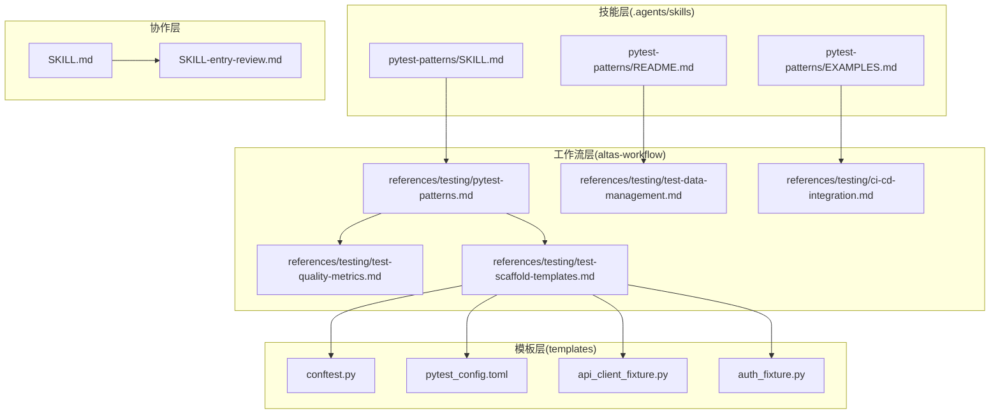

**图表来源**
- [.agents/skills/pytest-patterns/SKILL.md:1-800](file://.agents/skills/pytest-patterns/SKILL.md#L1-L800)
- [altas-workflow/references/testing/pytest-patterns.md:1-830](file://altas-workflow/references/testing/pytest-patterns.md#L1-L830)
- [altas-workflow/references/testing/test-scaffold-templates.md:1-81](file://altas-workflow/references/testing/test-scaffold-templates.md#L1-L81)

**章节来源**
- [.agents/skills/pytest-patterns/SKILL.md:1-800](file://.agents/skills/pytest-patterns/SKILL.md#L1-L800)
- [.agents/skills/pytest-patterns/README.md:1-708](file://.agents/skills/pytest-patterns/README.md#L1-L708)
- [altas-workflow/references/testing/pytest-patterns.md:1-830](file://altas-workflow/references/testing/pytest-patterns.md#L1-L830)

## 核心组件

### 测试模式识别系统

pytest测试模式文档套件的核心在于其独特的"模式识别"能力，能够将复杂的测试场景抽象为可复用的模式模板：

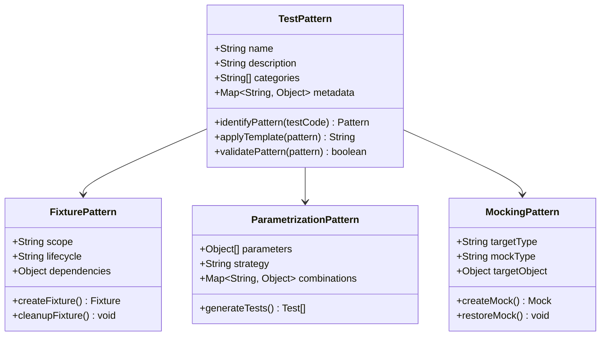

**图表来源**
- [.agents/skills/pytest-patterns/SKILL.md:64-194](file://.agents/skills/pytest-patterns/SKILL.md#L64-L194)
- [altas-workflow/references/testing/pytest-patterns.md:18-182](file://altas-workflow/references/testing/pytest-patterns.md#L18-L182)

### 测试数据管理模式

文档套件提供了完整的测试数据管理策略，包括工厂模式、数据隔离和并发处理：

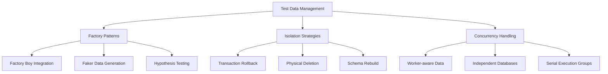

**图表来源**
- [altas-workflow/references/testing/test-data-management.md:43-642](file://altas-workflow/references/testing/test-data-management.md#L43-L642)

**章节来源**
- [.agents/skills/pytest-patterns/SKILL.md:64-800](file://.agents/skills/pytest-patterns/SKILL.md#L64-L800)
- [altas-workflow/references/testing/pytest-patterns.md:18-741](file://altas-workflow/references/testing/pytest-patterns.md#L18-L741)
- [altas-workflow/references/testing/test-data-management.md:1-769](file://altas-workflow/references/testing/test-data-management.md#L1-L769)

## 架构概览

### 测试模式分层架构

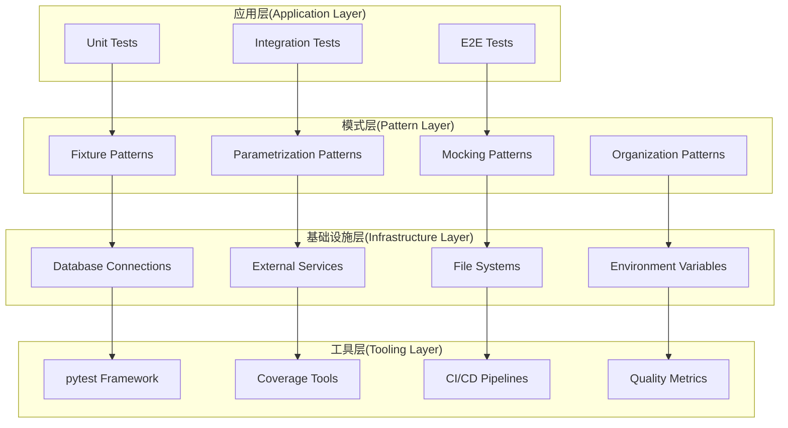

**图表来源**
- [.agents/skills/pytest-patterns/SKILL.md:27-52](file://.agents/skills/pytest-patterns/SKILL.md#L27-L52)
- [altas-workflow/references/testing/ci-cd-integration.md:8-15](file://altas-workflow/references/testing/ci-cd-integration.md#L8-L15)

### 测试生命周期流程

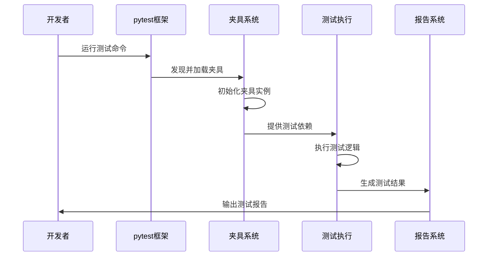

**图表来源**
- [.agents/skills/pytest-patterns/README.md:369-420](file://.agents/skills/pytest-patterns/README.md#L369-L420)
- [altas-workflow/references/testing/pytest-patterns.md:507-524](file://altas-workflow/references/testing/pytest-patterns.md#L507-L524)

## 详细组件分析

### 夹具模式(Fixture Patterns)

夹具是pytest的核心概念，提供了测试的基础设置和清理机制：

#### 基础夹具模式

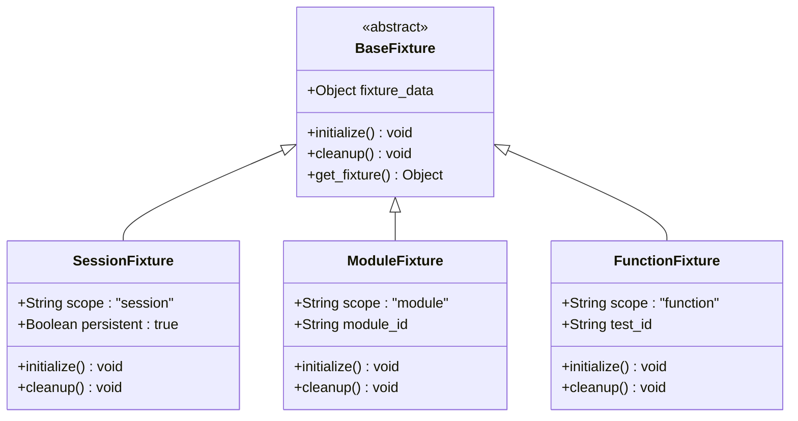

**图表来源**
- [.agents/skills/pytest-patterns/SKILL.md:85-118](file://.agents/skills/pytest-patterns/SKILL.md#L85-L118)
- [altas-workflow/references/testing/pytest-patterns.md:34-58](file://altas-workflow/references/testing/pytest-patterns.md#L34-L58)

#### 夹具依赖链模式

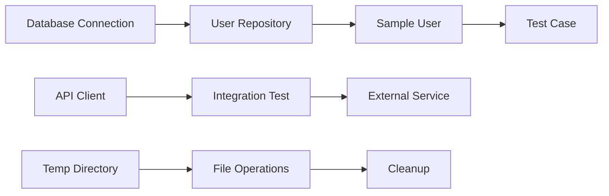

**图表来源**
- [.agents/skills/pytest-patterns/SKILL.md:120-147](file://.agents/skills/pytest-patterns/SKILL.md#L120-L147)
- [altas-workflow/references/testing/pytest-patterns.md:60-82](file://altas-workflow/references/testing/pytest-patterns.md#L60-L82)

**章节来源**
- [.agents/skills/pytest-patterns/SKILL.md:64-194](file://.agents/skills/pytest-patterns/SKILL.md#L64-L194)
- [altas-workflow/references/testing/pytest-patterns.md:18-182](file://altas-workflow/references/testing/pytest-patterns.md#L18-L182)

### 参数化测试模式

参数化测试允许使用不同的输入数据运行相同的测试逻辑：

#### 基础参数化模式

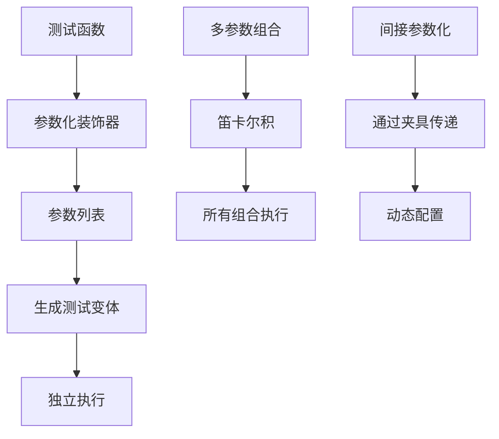

**图表来源**
- [.agents/skills/pytest-patterns/SKILL.md:195-291](file://.agents/skills/pytest-patterns/SKILL.md#L195-L291)
- [altas-workflow/references/testing/pytest-patterns.md:121-182](file://altas-workflow/references/testing/pytest-patterns.md#L121-L182)

#### 参数化夹具模式

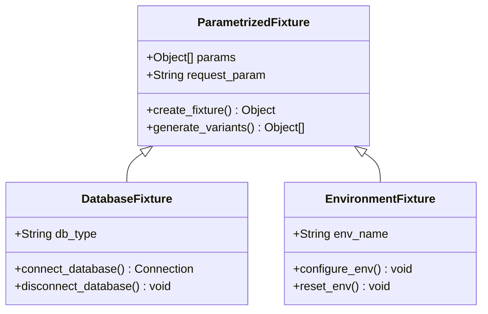

**图表来源**
- [.agents/skills/pytest-patterns/SKILL.md:243-291](file://.agents/skills/pytest-patterns/SKILL.md#L243-L291)
- [altas-workflow/references/testing/pytest-patterns.md:157-182](file://altas-workflow/references/testing/pytest-patterns.md#L157-L182)

**章节来源**
- [.agents/skills/pytest-patterns/SKILL.md:195-291](file://.agents/skills/pytest-patterns/SKILL.md#L195-L291)
- [altas-workflow/references/testing/pytest-patterns.md:121-182](file://altas-workflow/references/testing/pytest-patterns.md#L121-L182)

### 模拟和猴子补丁模式

模拟模式提供了隔离测试环境的能力，确保测试不依赖外部系统：

#### 猴子补丁模式

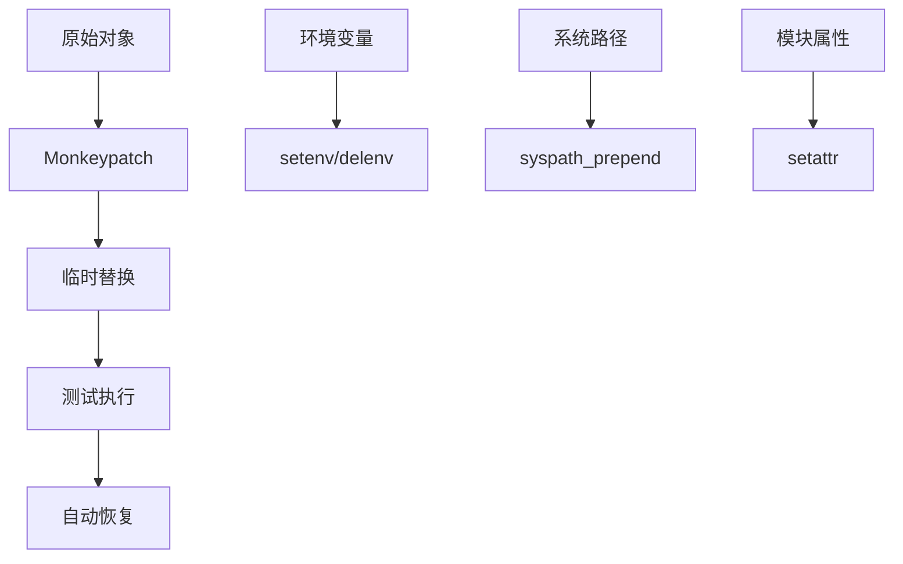

**图表来源**
- [.agents/skills/pytest-patterns/SKILL.md:292-313](file://.agents/skills/pytest-patterns/SKILL.md#L292-L313)
- [altas-workflow/references/testing/pytest-patterns.md:184-207](file://altas-workflow/references/testing/pytest-patterns.md#L184-L207)

#### unittest.mock模式

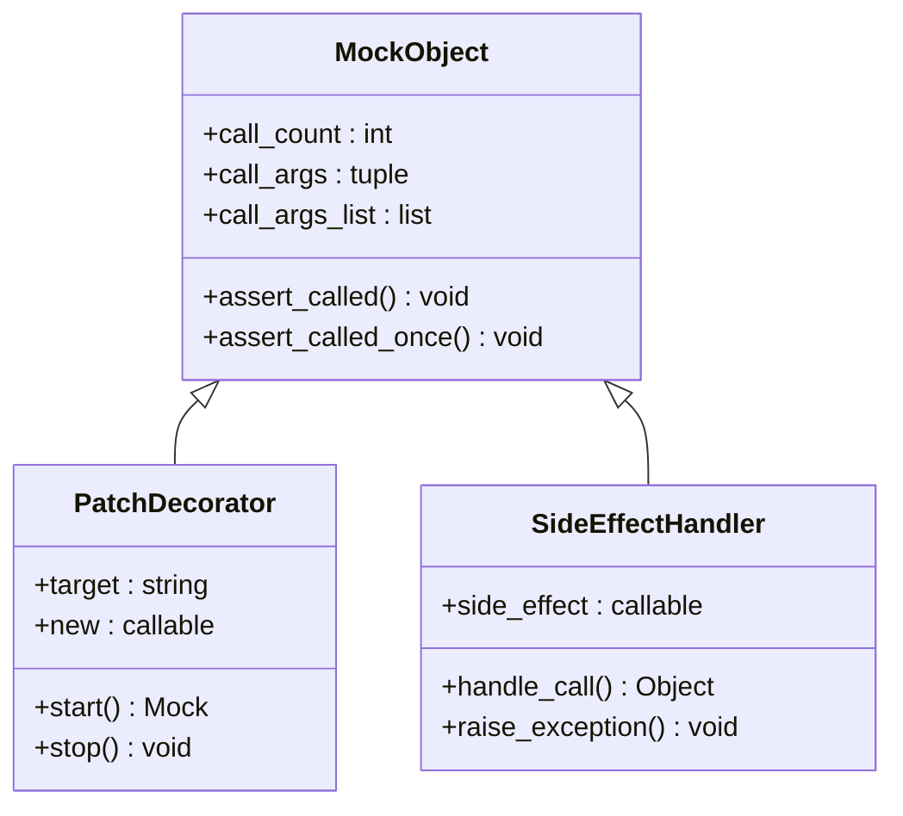

**图表来源**
- [.agents/skills/pytest-patterns/SKILL.md:340-391](file://.agents/skills/pytest-patterns/SKILL.md#L340-L391)
- [altas-workflow/references/testing/pytest-patterns.md:209-255](file://altas-workflow/references/testing/pytest-patterns.md#L209-L255)

**章节来源**
- [.agents/skills/pytest-patterns/SKILL.md:292-391](file://.agents/skills/pytest-patterns/SKILL.md#L292-L391)
- [altas-workflow/references/testing/pytest-patterns.md:184-255](file://altas-workflow/references/testing/pytest-patterns.md#L184-L255)

### 测试组织模式

测试组织模式确保大型测试套件的可维护性和可扩展性：

#### 目录结构模式

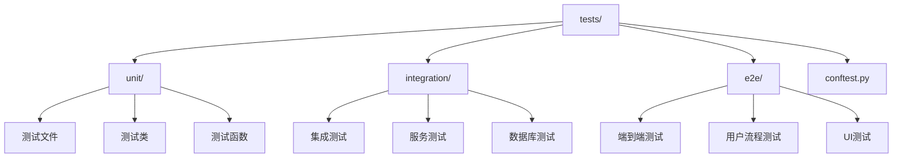

**图表来源**
- [.agents/skills/pytest-patterns/SKILL.md:413-441](file://.agents/skills/pytest-patterns/SKILL.md#L413-L441)
- [altas-workflow/references/testing/pytest-patterns.md:259-284](file://altas-workflow/references/testing/pytest-patterns.md#L259-L284)

#### 标记和过滤模式

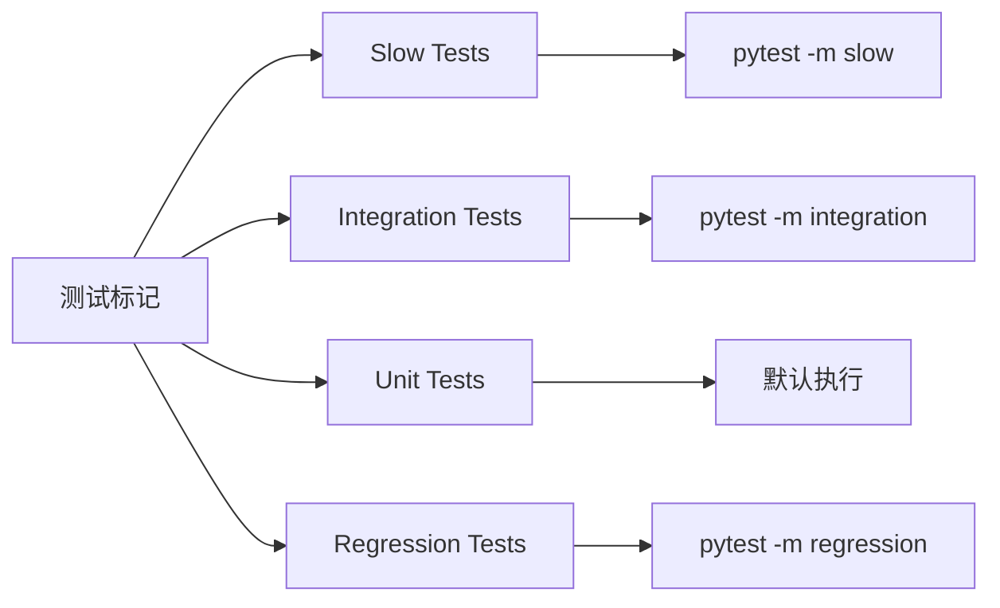

**图表来源**
- [.agents/skills/pytest-patterns/SKILL.md:474-522](file://.agents/skills/pytest-patterns/SKILL.md#L474-L522)
- [altas-workflow/references/testing/pytest-patterns.md:316-350](file://altas-workflow/references/testing/pytest-patterns.md#L316-L350)

**章节来源**
- [.agents/skills/pytest-patterns/SKILL.md:413-522](file://.agents/skills/pytest-patterns/SKILL.md#L413-L522)
- [altas-workflow/references/testing/pytest-patterns.md:259-350](file://altas-workflow/references/testing/pytest-patterns.md#L259-L350)

### 覆盖率分析模式

覆盖率分析模式帮助开发者了解测试的有效性和代码的测试程度：

#### 覆盖率配置模式

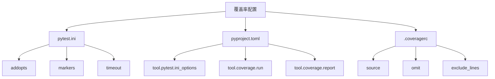

**图表来源**
- [.agents/skills/pytest-patterns/SKILL.md:625-700](file://.agents/skills/pytest-patterns/SKILL.md#L625-L700)
- [altas-workflow/references/testing/pytest-patterns.md:484-504](file://altas-workflow/references/testing/pytest-patterns.md#L484-L504)

#### 覆盖率报告模式

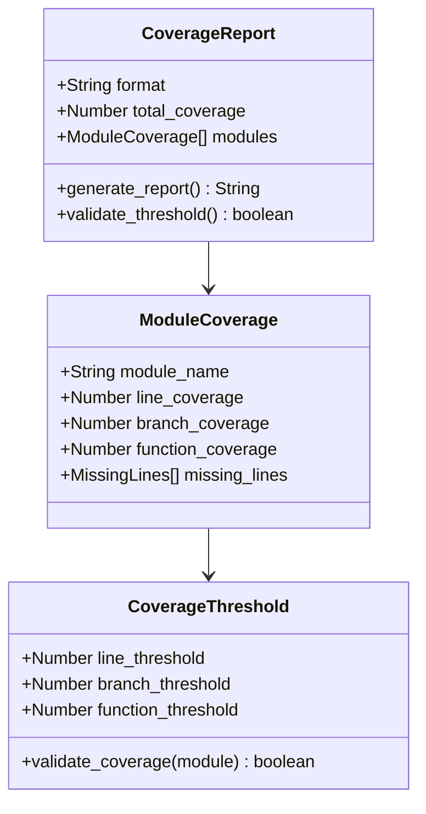

**图表来源**
- [.agents/skills/pytest-patterns/SKILL.md:557-583](file://.agents/skills/pytest-patterns/SKILL.md#L557-L583)
- [altas-workflow/references/testing/pytest-patterns.md:466-482](file://altas-workflow/references/testing/pytest-patterns.md#L466-L482)

**章节来源**
- [.agents/skills/pytest-patterns/SKILL.md:557-700](file://.agents/skills/pytest-patterns/SKILL.md#L557-L700)
- [altas-workflow/references/testing/pytest-patterns.md:466-504](file://altas-workflow/references/testing/pytest-patterns.md#L466-L504)

## 工作流上下文映射

**新增** 本章节建立了pytest测试模式与ALTAS工作流不同阶段的直接关联，为测试工程师提供阶段性的指导。

### ALTAS工作流阶段与测试模式映射

| ALTAS阶段 | 推荐使用的pytest模式 | 原因 |
|-----------|---------------------|------|
| PLAN（Test Strategy） | fixture scope设计、目录结构规划、marker注册 | 先设计后编码 |
| EXECUTE（RED） | `pytest.raises`、`@pytest.mark.xfail`、纯`assert` | 写预期失败的测试 |
| EXECUTE（GREEN） | 最简断言、单一用例、不追求parametrize | 最小实现通过测试 |
| EXECUTE（REFACTOR） | fixture提取、`@pytest.mark.parametrize`消除重复 | 测试代码重构 |
| TEST（补测） | `@pytest.mark.parametrize`边界覆盖、Hypothesis属性测试 | 系统化补测 |
| REVIEW | `--cov`、`--durations`、`--tb=short` | 质量验证 |

### 工作流阶段详细指导

#### PLAN阶段：测试策略设计
在PLAN阶段，测试工程师应该专注于测试策略的设计，包括：
- **Fixture Scope设计**：根据测试需求选择合适的fixture作用域（function/module/session）
- **目录结构规划**：建立清晰的测试组织结构，区分unit/integration/e2e测试
- **Marker注册**：定义测试标记系统，便于测试筛选和分类

#### EXECUTE阶段：测试编写与重构

**RED阶段**：编写预期失败的测试
- 使用`pytest.raises`测试异常情况
- 使用`@pytest.mark.xfail`标记已知失败的测试
- 使用纯`assert`进行基本断言验证

**GREEN阶段**：最小实现验证
- 编写最简单的测试用例验证基本功能
- 避免过度参数化和复杂的fixture设计
- 确保测试能够快速通过

**REFACTOR阶段**：测试代码重构
- 提取重复的fixture代码
- 使用`@pytest.mark.parametrize`消除测试重复
- 优化测试组织结构

#### TEST阶段：系统化补测
- 使用参数化测试覆盖边界条件
- 利用Hypothesis进行属性测试
- 建立完整的测试矩阵

#### REVIEW阶段：质量验证
- 使用覆盖率工具验证测试完整性
- 分析测试执行时间，识别性能问题
- 生成详细的测试报告

**章节来源**
- [altas-workflow/references/testing/pytest-patterns.md:9-18](file://altas-workflow/references/testing/pytest-patterns.md#L9-L18)
- [altas-workflow/SKILL-entry-review.md:824-853](file://altas-workflow/SKILL-entry-review.md#L824-L853)

### BDD桥接模式

对于使用BDD（Given/When/Then）风格的测试工程师，pytest提供了与Spec文档的无缝桥接：

#### Spec到BDD映射规则

| Spec字段 | BDD映射 |
|----------|---------|
| §1.2 In-Scope | Feature文件列表 |
| §1.4 Acceptance Criteria | Scenario |
| §4.4 P0/P1/P2 | Scenario标签`@P0`/`@P1`/`@P2` |
| §4.4 Mock Strategy | `@given`中的mock/stub设置 |
| §4.4 Test Data Strategy | `@given`中的factory/fixture |

**章节来源**
- [altas-workflow/references/testing/pytest-patterns.md:821-830](file://altas-workflow/references/testing/pytest-patterns.md#L821-L830)

## 依赖分析

### 测试工具生态系统

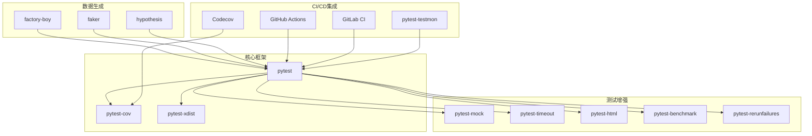

**图表来源**
- [.agents/skills/pytest-patterns/SKILL.md:496-513](file://.agents/skills/pytest-patterns/SKILL.md#L496-L513)
- [altas-workflow/references/testing/pytest-patterns.md:542-573](file://altas-workflow/references/testing/pytest-patterns.md#L542-L573)

### 测试数据依赖关系

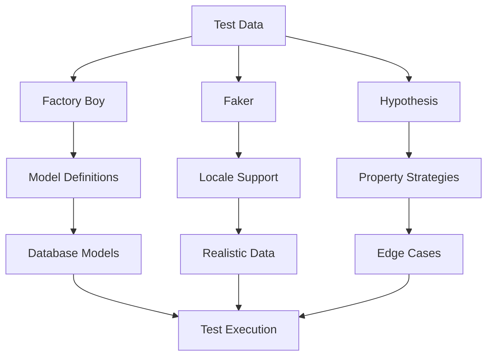

**图表来源**
- [altas-workflow/references/testing/test-data-management.md:43-252](file://altas-workflow/references/testing/test-data-management.md#L43-L252)

**章节来源**
- [.agents/skills/pytest-patterns/SKILL.md:496-513](file://.agents/skills/pytest-patterns/SKILL.md#L496-L513)
- [altas-workflow/references/testing/test-data-management.md:43-252](file://altas-workflow/references/testing/test-data-management.md#L43-L252)

## 性能考虑

### 测试执行优化策略

文档套件提供了全面的性能优化指导，涵盖并行执行、缓存策略和测试分片：

#### 并行执行模式

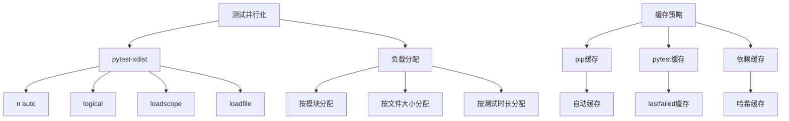

**图表来源**
- [altas-workflow/references/testing/ci-cd-integration.md:386-434](file://altas-workflow/references/testing/ci-cd-integration.md#L386-L434)
- [altas-workflow/references/testing/ci-cd-integration.md:435-505](file://altas-workflow/references/testing/ci-cd-integration.md#L435-L505)

#### 性能监控模式

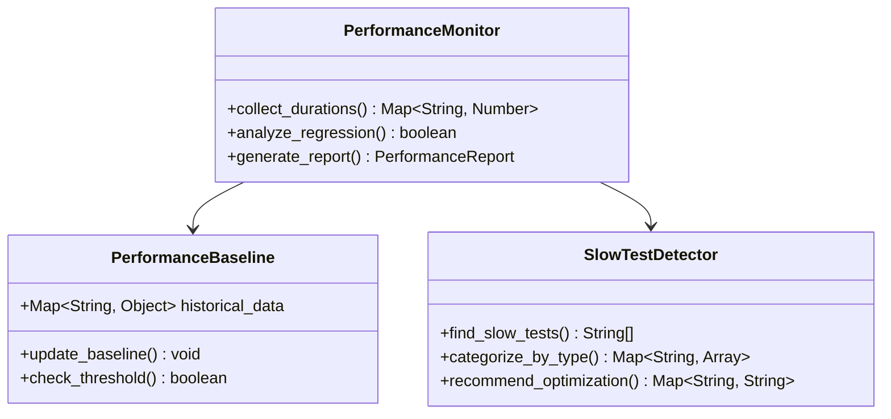

**图表来源**
- [altas-workflow/references/testing/test-quality-metrics.md:421-496](file://altas-workflow/references/testing/test-quality-metrics.md#L421-L496)

**章节来源**
- [altas-workflow/references/testing/ci-cd-integration.md:386-505](file://altas-workflow/references/testing/ci-cd-integration.md#L386-L505)
- [altas-workflow/references/testing/test-quality-metrics.md:385-496](file://altas-workflow/references/testing/test-quality-metrics.md#L385-L496)

## 故障排除指南

### 常见问题诊断

文档套件提供了系统的问题诊断和解决方法：

#### 测试发现和执行问题

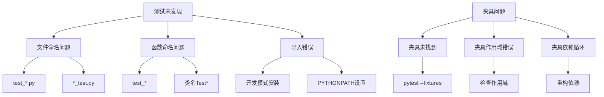

**图表来源**
- [.agents/skills/pytest-patterns/SKILL.md:599-633](file://.agents/skills/pytest-patterns/SKILL.md#L599-L633)
- [altas-workflow/references/testing/pytest-patterns.md:507-524](file://altas-workflow/references/testing/pytest-patterns.md#L507-L524)

#### 并发和数据隔离问题

```mermaid
flowchart LR
A[并发测试问题] --> B[共享状态]
A --> C[数据库竞争]
A --> D[文件系统冲突]
B --> B1[Worker ID]
B --> B2[独立资源]
B --> B3[序列化执行]
C --> C1[独立数据库]
C --> C2[连接池管理]
C --> C3[事务隔离]
D --> D1[临时目录]
D --> D2[文件锁]
D --> D3[路径隔离]
```

**图表来源**
- [altas-workflow/references/testing/test-data-management.md:581-642](file://altas-workflow/references/testing/test-data-management.md#L581-L642)

**章节来源**
- [.agents/skills/pytest-patterns/SKILL.md:599-633](file://.agents/skills/pytest-patterns/SKILL.md#L599-L633)
- [altas-workflow/references/testing/test-data-management.md:581-642](file://altas-workflow/references/testing/test-data-management.md#L581-L642)

## 结论

pytest测试模式文档套件提供了一个完整的测试工程化框架，通过模式识别和系统化的方法论，帮助开发者构建高质量的测试套件。该套件的核心价值在于：

1. **模式化思维**：将复杂的测试场景抽象为可复用的模式模板
2. **系统化组织**：从基础夹具到高级模式的完整知识体系
3. **工作流集成**：将测试模式与ALTAS工作流阶段紧密结合
4. **工程化实践**：结合CI/CD和质量度量的完整流程
5. **可扩展性**：支持从简单项目到复杂系统的各种需求

**更新** 新增的工作流上下文映射章节显著增强了文档的实用性，为测试工程师提供了从PLAN到REVIEW的完整指导，确保测试模式能够在正确的时机应用于正确的场景。

通过遵循文档套件中的模式和最佳实践，开发者可以显著提高测试的可靠性、可维护性和效率，最终构建更加健壮的软件系统。

## 附录

### 快速参考

#### 常用命令速查

```bash
pytest                          # 运行所有测试
pytest test_file.py            # 运行指定文件
pytest -k "pattern"            # 按模式过滤
pytest -m marker               # 按标记过滤
pytest -x                      # 首次失败停止
pytest --lf                    # 重跑上次失败
pytest -v                      # 详细输出
pytest -q                      # 安静输出
pytest --cov=pkg               # 覆盖率报告
pytest -n auto                 # 并行执行
```

#### 测试模式清单

- **夹具模式**：作用域控制、依赖管理、工厂模式
- **参数化模式**：数据驱动测试、组合测试、间接参数化
- **模拟模式**：猴子补丁、unittest.mock、副作用处理
- **组织模式**：目录结构、标记系统、测试分类
- **数据模式**：工厂模式、Faker集成、并发处理
- **质量模式**：覆盖率分析、性能监控、稳定性评估
- **工作流模式**：阶段映射、BDD桥接、测试维护

#### 工作流阶段指导

- **PLAN阶段**：设计测试策略，规划fixture和目录结构
- **EXECUTE阶段**：按阶段编写测试，RED使用预期失败，GREEN使用最简断言，REFACTOR提取重复代码
- **TEST阶段**：系统化补测，使用参数化和属性测试
- **REVIEW阶段**：质量验证，使用覆盖率和性能工具