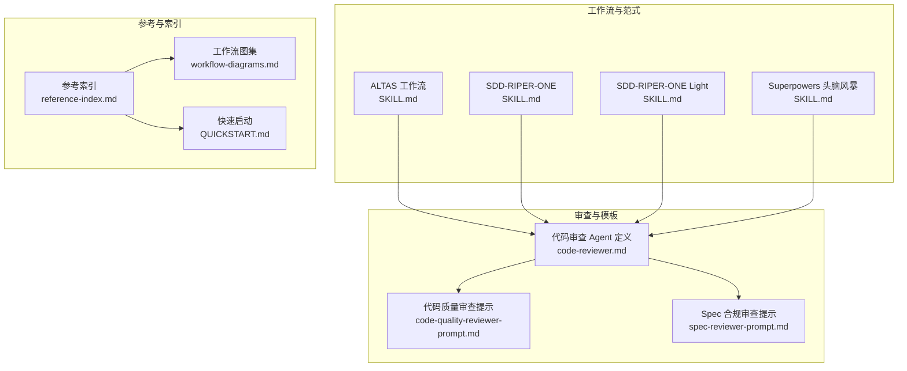
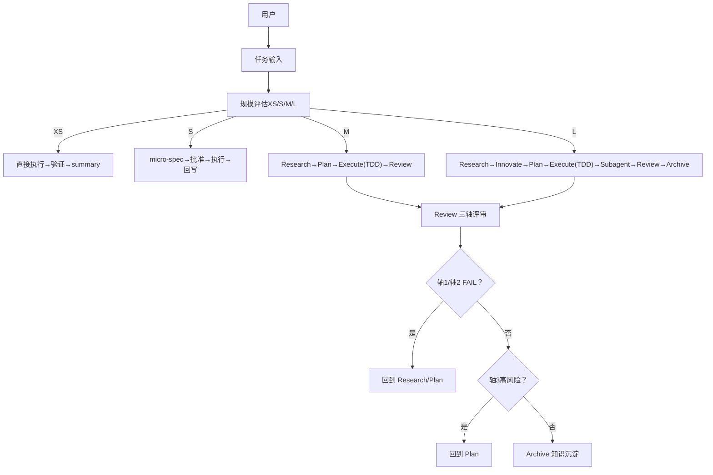
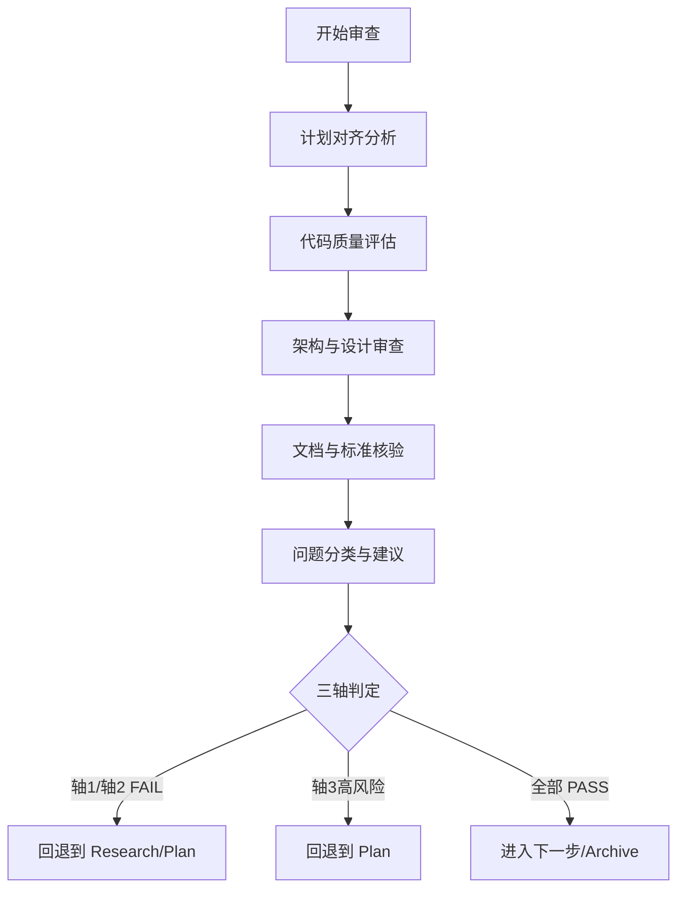
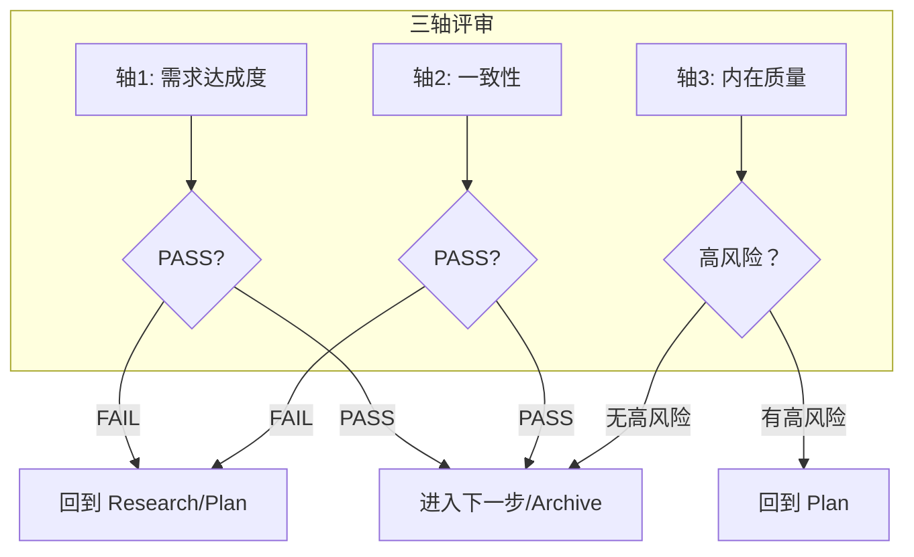
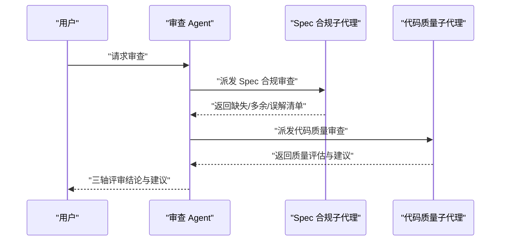
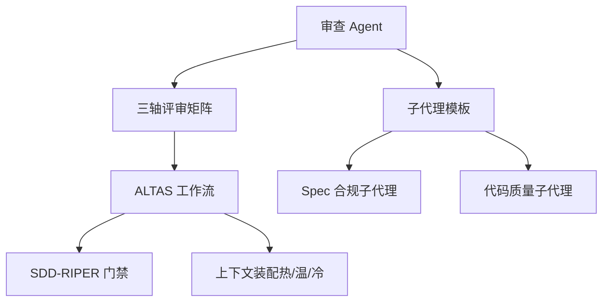

# 代码审查 Agent

<cite>
**本文引用的文件**
- [AGENTS.md](file://AGENTS.md)
- [code-reviewer.md](file://altas-workflow/references/agents/code-reviewer.md)
- [SKILL.md（ALTAS 工作流）](file://altas-workflow/SKILL.md)
- [SKILL.md（SDD-RIPER-ONE）](file://altas-workflow/references/agents/sdd-riper-one/SKILL.md)
- [SKILL.md（SDD-RIPER-ONE Light）](file://altas-workflow/references/agents/sdd-riper-one-light/SKILL.md)
- [SKILL.md（Superpowers：头脑风暴）](file://altas-workflow/references/superpowers/brainstorming/SKILL.md)
- [code-quality-reviewer-prompt.md](file://altas-workflow/references/superpowers/subagent-driven-development/code-quality-reviewer-prompt.md)
- [spec-reviewer-prompt.md](file://altas-workflow/references/superpowers/subagent-driven-development/spec-reviewer-prompt.md)
- [QUICKSTART.md](file://altas-workflow/QUICKSTART.md)
- [reference-index.md](file://altas-workflow/reference-index.md)
- [workflow-diagrams.md](file://altas-workflow/workflow-diagrams.md)
</cite>

## 目录
1. [简介](#简介)
2. [项目结构](#项目结构)
3. [核心组件](#核心组件)
4. [架构总览](#架构总览)
5. [组件详解](#组件详解)
6. [依赖关系分析](#依赖关系分析)
7. [性能考量](#性能考量)
8. [故障排查指南](#故障排查指南)
9. [结论](#结论)
10. [附录](#附录)

## 简介
本文件面向“代码审查 Agent”的使用者与维护者，系统化阐述基于 ALTAS 工作流的代码审查 Agent 的工作流程、标准与实践。文档围绕三轴评审体系（Spec-质量与需求达成、Spec-代码一致性、代码内在质量）展开，结合 Agent 的配置与使用方法、审查参数与模板选择、以及审查报告生成与归档沉淀，提供可操作的流程图、时序图与最佳实践建议，并给出常见问题与效率提升技巧。

## 项目结构
该仓库以“工作流 + 参考资料 + 协议/模板”为主，核心围绕 ALTAS 工作流 Skill 与 SDD-RIPER、Checkpoint-Driven、Superpowers 三大范式协同，形成“输入准备 → 研究对齐 → 方案对比（L）→ 规划 → 执行（TDD/Subagent）→ 三轴评审 → 知识沉淀”的闭环。

图表来源
- [SKILL.md（ALTAS 工作流）:1-351](file://altas-workflow/SKILL.md#L1-L351)
- [SKILL.md（SDD-RIPER-ONE）:1-208](file://altas-workflow/references/agents/sdd-riper-one/SKILL.md#L1-L208)
- [SKILL.md（SDD-RIPER-ONE Light）:1-84](file://altas-workflow/references/agents/sdd-riper-one-light/SKILL.md#L1-L84)
- [SKILL.md（Superpowers：头脑风暴）:1-165](file://altas-workflow/references/superpowers/brainstorming/SKILL.md#L1-L165)
- [code-reviewer.md:1-49](file://altas-workflow/references/agents/code-reviewer.md#L1-L49)
- [code-quality-reviewer-prompt.md:1-27](file://altas-workflow/references/superpowers/subagent-driven-development/code-quality-reviewer-prompt.md#L1-L27)
- [spec-reviewer-prompt.md:1-62](file://altas-workflow/references/superpowers/subagent-driven-development/spec-reviewer-prompt.md#L1-L62)
- [reference-index.md:1-210](file://altas-workflow/reference-index.md#L1-L210)
- [workflow-diagrams.md:1-338](file://altas-workflow/workflow-diagrams.md#L1-L338)

章节来源
- [reference-index.md:1-210](file://altas-workflow/reference-index.md#L1-L210)
- [workflow-diagrams.md:1-338](file://altas-workflow/workflow-diagrams.md#L1-L338)

## 核心组件
- 代码审查 Agent 定义：明确审查职责、范围与沟通协议，涵盖计划对齐、代码质量、架构设计、文档与标准、问题分类与建议、以及与编码 Agent 的交互流程。
- 三轴评审矩阵：以“Spec 质量与需求达成”“Spec-代码一致性”“代码内在质量”为三大维度，形成 PASS/FAIL/PARTIAL 的判定与回退门禁。
- 子代理（Subagent）审查模板：在通过 Spec 合规审查后，派发“代码质量审查子代理”，聚焦实现正确性、可维护性与测试质量。
- 工作流与上下文装配：ALTAS 提供“热/温/冷”上下文策略，确保审查阶段聚焦与可追溯；SDD-RIPER 强调“无 Spec 不编码、无批准不执行、Spec 是真相”。

章节来源
- [code-reviewer.md:1-49](file://altas-workflow/references/agents/code-reviewer.md#L1-L49)
- [SKILL.md（ALTAS 工作流）:194-218](file://altas-workflow/SKILL.md#L194-L218)
- [code-quality-reviewer-prompt.md:1-27](file://altas-workflow/references/superpowers/subagent-driven-development/code-quality-reviewer-prompt.md#L1-L27)
- [spec-reviewer-prompt.md:1-62](file://altas-workflow/references/superpowers/subagent-driven-development/spec-reviewer-prompt.md#L1-L62)
- [SKILL.md（SDD-RIPER-ONE）:37-71](file://altas-workflow/references/agents/sdd-riper-one/SKILL.md#L37-L71)

## 架构总览
下图展示了从任务输入到三轴评审与归档沉淀的整体流程，突出审查 Agent 在“Review”阶段的角色与前置条件。

图表来源
- [workflow-diagrams.md:45-67](file://altas-workflow/workflow-diagrams.md#L45-L67)
- [SKILL.md（ALTAS 工作流）:194-218](file://altas-workflow/SKILL.md#L194-L218)

章节来源
- [workflow-diagrams.md:1-338](file://altas-workflow/workflow-diagrams.md#L1-L338)
- [SKILL.md（ALTAS 工作流）:194-218](file://altas-workflow/SKILL.md#L194-L218)

## 组件详解

### 代码审查 Agent 的职责与流程
- 职责边界：对已完成的工作进行计划对齐分析、代码质量评估、架构与设计审查、文档与标准核验、问题分类与建议、以及与编码 Agent 的沟通协议。
- 审查范围：覆盖需求达成度、Spec-代码一致性、代码内在质量（正确性、鲁棒性、可维护性、测试）。
- 审查标准：采用三轴矩阵判定，失败或高风险时回退到 Research/Plan；通过后进入 Archive 或结束。

图表来源
- [code-reviewer.md:10-47](file://altas-workflow/references/agents/code-reviewer.md#L10-L47)

章节来源
- [code-reviewer.md:1-49](file://altas-workflow/references/agents/code-reviewer.md#L1-L49)

### 三轴评审体系
- 轴1：Spec 质量与需求达成（Goal/In-Scope/Acceptance 是否完整；需求是否达成）
- 轴2：Spec-代码一致性（文件、签名、Checklist、行为是否与 Plan 一致）
- 轴3：代码内在质量（正确性、鲁棒性、可维护性、测试、关键风险）

图表来源
- [SKILL.md（ALTAS 工作流）:196-207](file://altas-workflow/SKILL.md#L196-L207)

章节来源
- [SKILL.md（ALTAS 工作流）:194-218](file://altas-workflow/SKILL.md#L194-L218)

### 子代理审查模板与使用
- Spec 合规审查子代理：在执行完成后，独立核验实现与 Spec 的一致性，避免“实现者报告不可信”。审查要点包括缺失需求、多余工作、误解与误判。
- 代码质量审查子代理：在通过 Spec 合规审查后，聚焦实现的正确性、可测试性、可维护性与文件结构一致性。

图表来源
- [spec-reviewer-prompt.md:1-62](file://altas-workflow/references/superpowers/subagent-driven-development/spec-reviewer-prompt.md#L1-L62)
- [code-quality-reviewer-prompt.md:1-27](file://altas-workflow/references/superpowers/subagent-driven-development/code-quality-reviewer-prompt.md#L1-L27)

章节来源
- [spec-reviewer-prompt.md:1-62](file://altas-workflow/references/superpowers/subagent-driven-development/spec-reviewer-prompt.md#L1-L62)
- [code-quality-reviewer-prompt.md:1-27](file://altas-workflow/references/superpowers/subagent-driven-development/code-quality-reviewer-prompt.md#L1-L27)

### 审查参数与模板选择
- 审查参数：包括 WHAT_WAS_IMPLEMENTED、PLAN_OR_REQUIREMENTS、BASE_SHA、HEAD_SHA、DESCRIPTION 等，用于子代理定位与比对。
- 模板选择：优先使用“代码质量审查提示”作为子代理模板；在需要时结合“Spec 合规审查提示”进行交叉验证。
- 与工作流集成：审查应在 Review 阶段进行，且必须满足三轴判定；失败或高风险需回退到 Plan 或 Research。

章节来源
- [code-quality-reviewer-prompt.md:9-18](file://altas-workflow/references/superpowers/subagent-driven-development/code-quality-reviewer-prompt.md#L9-L18)
- [spec-reviewer-prompt.md:7-19](file://altas-workflow/references/superpowers/subagent-driven-development/spec-reviewer-prompt.md#L7-L19)
- [SKILL.md（ALTAS 工作流）:194-218](file://altas-workflow/SKILL.md#L194-L218)

### 审查报告生成与归档
- 报告要素：三轴矩阵、Overall Verdict、Plan-Execution Diff、问题分类（Critical/Important/Suggestions）、建议与示例。
- 归档沉淀：Review 通过后生成双视角归档（human/llm），附“Trace to Sources”，便于后续开发与知识传承。

章节来源
- [code-reviewer.md:36-47](file://altas-workflow/references/agents/code-reviewer.md#L36-L47)
- [SKILL.md（ALTAS 工作流）:210-218](file://altas-workflow/SKILL.md#L210-L218)

## 依赖关系分析
- 审查 Agent 依赖于：
  - ALTAS 工作流的“Review”阶段与三轴评审门禁；
  - SDD-RIPER 的“Spec 是真相”与“无批准不执行”门禁；
  - Superpowers 的“TDD 铁律”“完成前验证”“子代理驱动开发”等模块；
  - 子代理审查模板（Spec 合规、代码质量）。
- 依赖耦合与内聚：
  - 审查 Agent 与子代理之间为弱耦合（通过模板与参数传递）；
  - 与工作流强耦合（Review 阶段与门禁）；
  - 与上下文装配策略强耦合（热/温/冷上下文）。

图表来源
- [code-reviewer.md:1-49](file://altas-workflow/references/agents/code-reviewer.md#L1-L49)
- [SKILL.md（ALTAS 工作流）:194-218](file://altas-workflow/SKILL.md#L194-L218)
- [spec-reviewer-prompt.md:1-62](file://altas-workflow/references/superpowers/subagent-driven-development/spec-reviewer-prompt.md#L1-L62)
- [code-quality-reviewer-prompt.md:1-27](file://altas-workflow/references/superpowers/subagent-driven-development/code-quality-reviewer-prompt.md#L1-L27)
- [SKILL.md（SDD-RIPER-ONE）:10-18](file://altas-workflow/references/agents/sdd-riper-one/SKILL.md#L10-L18)

章节来源
- [reference-index.md:1-210](file://altas-workflow/reference-index.md#L1-L210)

## 性能考量
- 审查效率提升：
  - 使用子代理并行化：在 Size L 场景下，可同时派发 Spec 合规与代码质量子代理，缩短审查周期。
  - 按需加载：仅在命中场景加载对应参考文件，减少上下文开销。
  - 热/温/冷上下文策略：在 Review 阶段集中加载温上下文，必要时回读冷上下文，避免重复加载。
- 质量与速度平衡：
  - 对于 XS/S 规模，优先“直接执行→验证→summary”，避免过度审查。
  - 对于 M/L 规模，坚持三轴评审与归档沉淀，确保可追溯与可复用。

章节来源
- [SKILL.md（ALTAS 工作流）:318-334](file://altas-workflow/SKILL.md#L318-L334)
- [QUICKSTART.md:119-152](file://altas-workflow/QUICKSTART.md#L119-L152)

## 故障排查指南
- 常见问题
  - 审查 Agent 返回“通过”，但实现与 Spec 存在偏差：应启用“Spec 合规子代理”独立核验，避免“实现者报告不可信”。
  - 轴3出现高风险未解决：回退到 Plan，补充测试或修正实现后再进入 Review。
  - 上下文缺失或冲突：触发“全量回读”机制，从磁盘重读完整 Spec。
- 建议
  - 在 Review 前确保 Plan 已获得明确批准；
  - 对于跨模块/跨项目改动，先在 Plan 中明确 Contract Interfaces 与 Touched Projects；
  - 使用“Trace to Sources”为每个结论附证据来源，便于复盘与审计。

章节来源
- [SKILL.md（SDD-RIPER-ONE）:59-71](file://altas-workflow/references/agents/sdd-riper-one/SKILL.md#L59-L71)
- [code-reviewer.md:42-47](file://altas-workflow/references/agents/code-reviewer.md#L42-L47)

## 结论
代码审查 Agent 在 ALTAS 工作流中承担“三轴评审”的关键角色，通过与子代理协同、与工作流门禁绑定、以及严格的上下文装配策略，确保审查的准确性与可追溯性。实践中应优先保证 Spec-代码一致性与内在质量，再进行需求达成度评估；对于高风险问题，必须回退到 Plan 进行修正与再对齐。配合归档沉淀与 Trace to Sources，可显著提升团队知识复用与长期维护效率。

## 附录

### 审查 Agent 使用示例（概念性）
- 示例场景一：M 规模功能实现后的三轴评审
  - 准备：Review 前确保 Plan 已批准、执行阶段 TDD 已完成、子代理已回传初步结论。
  - 执行：三轴评审矩阵评分，若轴1/轴2 FAIL，回退到 Research/Plan；若轴3高风险，回退到 Plan。
  - 结果：全部 PASS 后进入 Archive。
- 示例场景二：L 规模架构重构后的两阶段 Review
  - 第一阶段：Spec 合规与代码质量子代理并行审查。
  - 第二阶段：综合两阶段结论，进行最终判定与归档。

章节来源
- [workflow-diagrams.md:291-337](file://altas-workflow/workflow-diagrams.md#L291-L337)
- [QUICKSTART.md:52-116](file://altas-workflow/QUICKSTART.md#L52-L116)