# 高级API测试模式

<cite>
**本文档引用的文件**
- [API测试模式参考](file://altas-workflow/references/testing/api-testing.md)
- [TEST模式专项协议](file://altas-workflow/references/special-modes/test.md)
- [pytest测试模式参考](file://altas-workflow/references/testing/pytest-patterns.md)
- [测试数据管理策略](file://altas-workflow/references/testing/test-data-management.md)
- [测试质量度量体系](file://altas-workflow/references/testing/test-quality-metrics.md)
- [RIPER-5模式协议](file://altas-workflow/protocols/RIPER-5.md)
- [RIPER-DOC文档协议](file://altas-workflow/protocols/RIPER-DOC.md)
- [协议选择指南](file://altas-workflow/protocols/PROTOCOL-SELECTION.md)
</cite>

## 目录
1. [简介](#简介)
2. [项目结构](#项目结构)
3. [核心组件](#核心组件)
4. [架构概览](#架构概览)
5. [详细组件分析](#详细组件分析)
6. [依赖分析](#依赖分析)
7. [性能考虑](#性能考虑)
8. [故障排除指南](#故障排除指南)
9. [结论](#结论)
10. [附录](#附录)

## 简介

高级API测试模式是Altas工作流中的一个专门测试协议，专注于HTTP API的全面测试覆盖。该模式结合了pytest测试框架、FastAPI测试客户端和一系列测试最佳实践，为开发者提供了一个系统化的API测试解决方案。

该模式特别适用于以下场景：
- 需要为现有API补充测试覆盖
- 提高测试覆盖率和质量
- 修复失败的API测试
- 生成详细的测试报告
- 实施全面的API测试策略

## 项目结构

Altas工作流中的高级API测试模式采用模块化设计，主要包含以下几个核心组件：

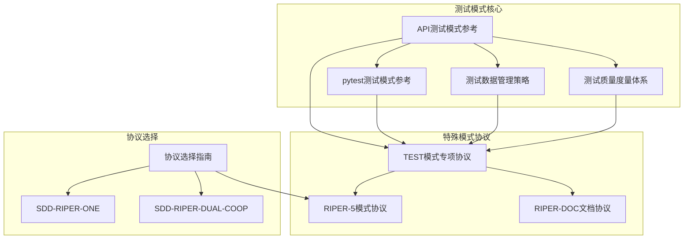

**图表来源**
- [API测试模式参考:1-1110](file://altas-workflow/references/testing/api-testing.md#L1-L1110)
- [TEST模式专项协议:1-268](file://altas-workflow/references/special-modes/test.md#L1-L268)

**章节来源**
- [API测试模式参考:1-1110](file://altas-workflow/references/testing/api-testing.md#L1-L1110)
- [TEST模式专项协议:1-268](file://altas-workflow/references/special-modes/test.md#L1-L268)

## 核心组件

### 测试层级体系

高级API测试模式定义了四个主要测试层级，每个层级都有其特定的目的、依赖和执行速度：

| 层级 | 目的 | 依赖 | 速度 | 适用场景 |
|------|------|------|------|----------|
| 契约测试 | 验证API契约和协议 | 无 | 快 | API设计验证 |
| 组件测试 | 隔离API功能测试 | Mocked依赖 | 快 | 单元级API测试 |
| 集成测试 | 真实依赖环境测试 | 数据库、服务 | 较慢 | 端到端API集成 |
| 系统测试 | 完整业务流程测试 | 完整环境 | 慢 | 端到端业务验证 |

### 测试矩阵覆盖

该模式提供了全面的API测试矩阵，确保API的各个方面都得到充分验证：

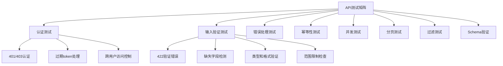

**图表来源**
- [API测试模式参考:21-32](file://altas-workflow/references/testing/api-testing.md#L21-L32)

**章节来源**
- [API测试模式参考:9-32](file://altas-workflow/references/testing/api-testing.md#L9-L32)

## 架构概览

高级API测试模式采用分层架构设计，将测试逻辑、数据管理和质量保证有机结合：

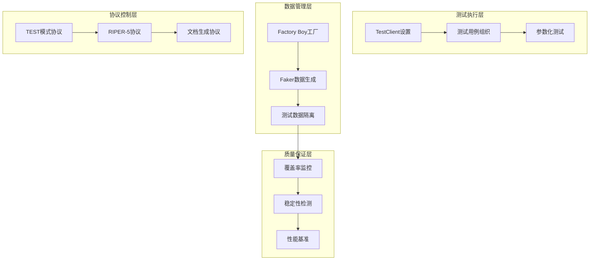

**图表来源**
- [API测试模式参考:35-50](file://altas-workflow/references/testing/api-testing.md#L35-L50)
- [pytest测试模式参考:18-82](file://altas-workflow/references/testing/pytest-patterns.md#L18-L82)

## 详细组件分析

### TestClient设置组件

TestClient是FastAPI提供的官方测试客户端，为API测试提供了强大的基础能力：

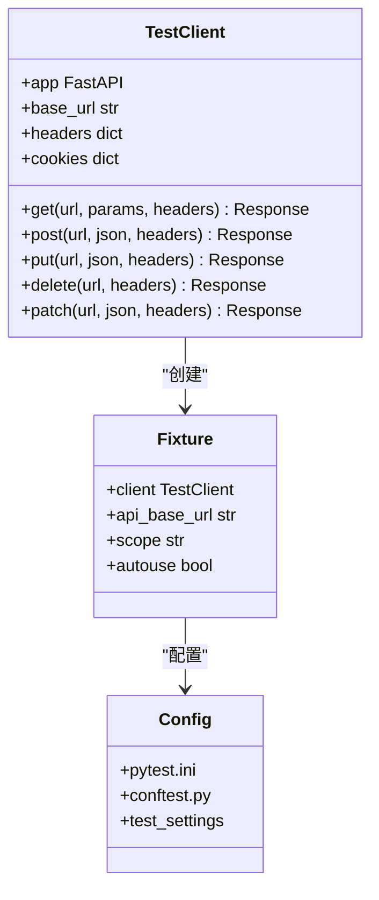

**图表来源**
- [API测试模式参考:37-50](file://altas-workflow/references/testing/api-testing.md#L37-L50)

该组件提供了以下核心功能：
- **HTTP方法支持**：完整的RESTful API方法支持
- **JSON序列化**：自动处理JSON请求和响应
- **状态码验证**：直观的状态码断言
- **响应数据访问**：便捷的响应数据提取

**章节来源**
- [API测试模式参考:35-50](file://altas-workflow/references/testing/api-testing.md#L35-L50)

### 输入验证测试组件

输入验证是API测试的核心组成部分，确保API能够正确处理各种输入情况：

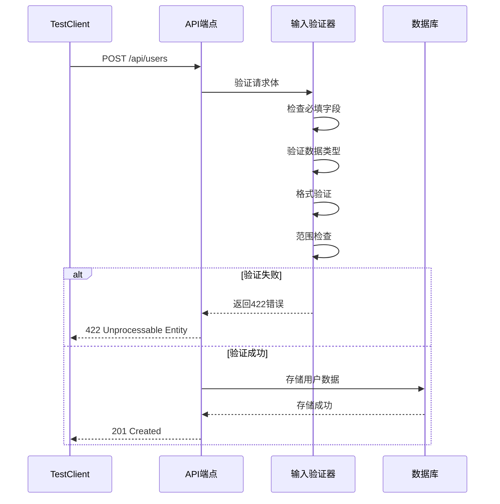

**图表来源**
- [API测试模式参考:54-130](file://altas-workflow/references/testing/api-testing.md#L54-L130)

该组件涵盖了以下验证场景：
- **必填字段验证**：确保必需字段存在
- **类型验证**：检查数据类型正确性
- **格式验证**：验证邮箱、URL等格式
- **长度限制**：检查字段长度约束
- **空值处理**：处理null值场景

**章节来源**
- [API测试模式参考:54-130](file://altas-workflow/references/testing/api-testing.md#L54-L130)

### 幂等性测试组件

幂等性是REST API的重要特性，确保重复请求不会产生副作用：

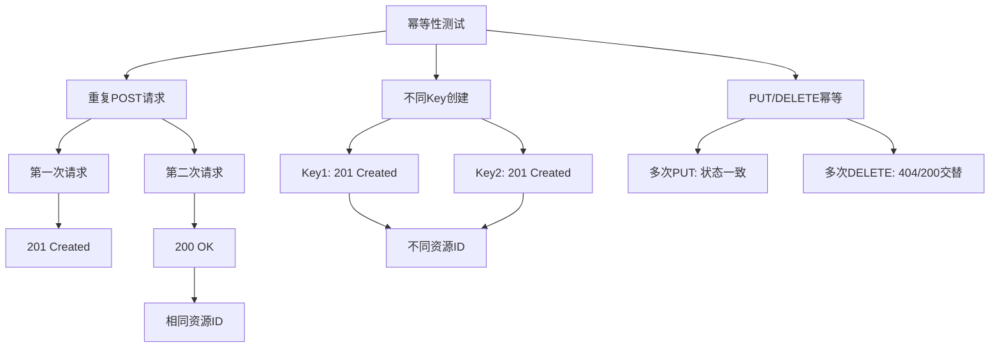

**图表来源**
- [API测试模式参考:134-176](file://altas-workflow/references/testing/api-testing.md#L134-L176)

**章节来源**
- [API测试模式参考:134-176](file://altas-workflow/references/testing/api-testing.md#L134-L176)

### 并发测试组件

并发测试确保API在高负载情况下仍能正确处理请求：

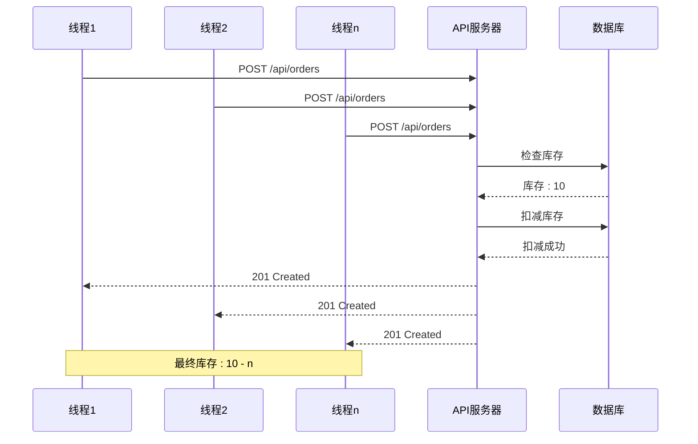

**图表来源**
- [API测试模式参考:180-225](file://altas-workflow/references/testing/api-testing.md#L180-L225)

**章节来源**
- [API测试模式参考:180-225](file://altas-workflow/references/testing/api-testing.md#L180-L225)

### 错误处理测试组件

错误处理测试确保API在异常情况下能够优雅地处理错误：

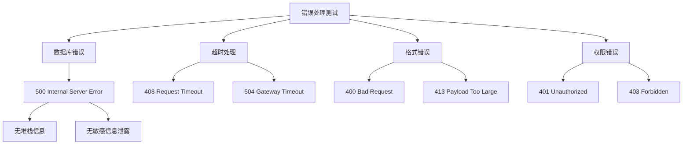

**图表来源**
- [API测试模式参考:229-271](file://altas-workflow/references/testing/api-testing.md#L229-L271)

**章节来源**
- [API测试模式参考:229-271](file://altas-workflow/references/testing/api-testing.md#L229-L271)

### 分页测试组件

分页测试确保API能够正确处理大量数据的分页显示：

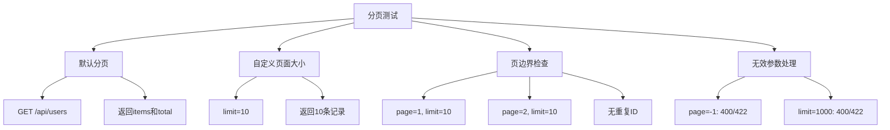

**图表来源**
- [API测试模式参考:275-335](file://altas-workflow/references/testing/api-testing.md#L275-L335)

**章节来源**
- [API测试模式参考:275-335](file://altas-workflow/references/testing/api-testing.md#L275-L335)

### 认证与授权测试组件

认证与授权测试确保API的安全性：

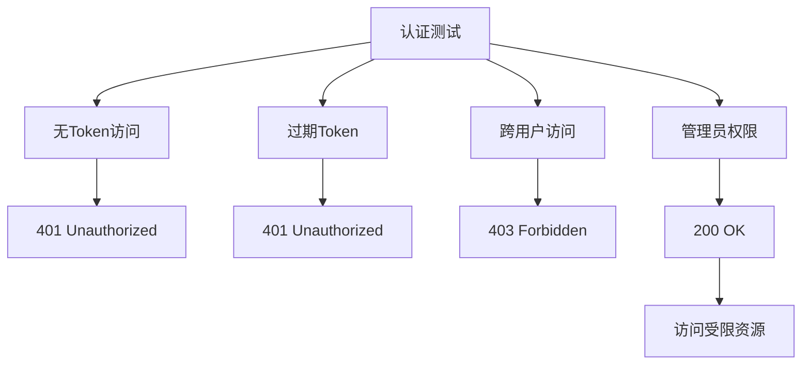

**图表来源**
- [API测试模式参考:339-380](file://altas-workflow/references/testing/api-testing.md#L339-L380)

**章节来源**
- [API测试模式参考:339-380](file://altas-workflow/references/testing/api-testing.md#L339-L380)

### Schema验证测试组件

Schema验证确保API响应结构的一致性：

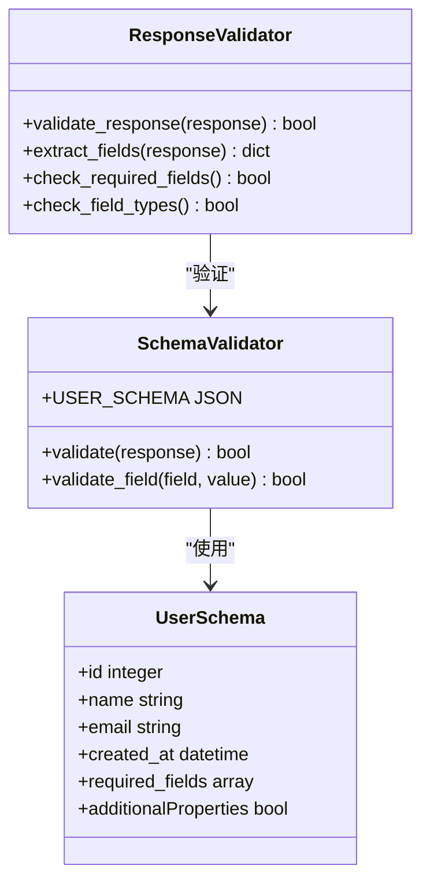

**图表来源**
- [API测试模式参考:384-420](file://altas-workflow/references/testing/api-testing.md#L384-L420)

**章节来源**
- [API测试模式参考:384-420](file://altas-workflow/references/testing/api-testing.md#L384-L420)

## 依赖分析

高级API测试模式具有清晰的依赖关系，各组件之间相互协作：

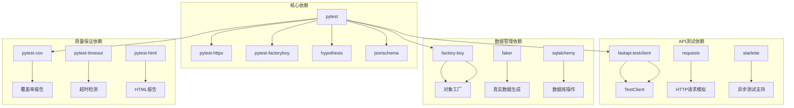

**图表来源**
- [API测试模式参考:463-477](file://altas-workflow/references/testing/api-testing.md#L463-L477)
- [pytest测试模式参考:542-560](file://altas-workflow/references/testing/pytest-patterns.md#L542-L560)

**章节来源**
- [API测试模式参考:463-477](file://altas-workflow/references/testing/api-testing.md#L463-L477)
- [pytest测试模式参考:542-560](file://altas-workflow/references/testing/pytest-patterns.md#L542-L560)

## 性能考虑

高级API测试模式在性能方面采用了多项优化策略：

### 测试执行优化

| 优化策略 | 实现方式 | 性能收益 |
|----------|----------|----------|
| Fixture作用域优化 | 使用适当的scope减少创建开销 | 20-30%加速 |
| 并行测试执行 | pytest-xdist并行执行 | 3-5倍加速 |
| 数据库事务回滚 | 每测试事务自动回滚 | 50%减少数据库操作 |
| 缓存测试数据 | session级Fixture缓存 | 40%减少数据准备时间 |

### 内存使用优化

- **惰性数据生成**：Factory Boy的LazyAttribute减少不必要的对象创建
- **批量数据处理**：build_batch一次性生成多个对象
- **临时文件管理**：自动清理tmp_path创建的临时文件

### 网络测试优化

- **HTTP Mock**：pytest-httpx提供高效的HTTP请求模拟
- **连接池复用**：TestClient自动管理HTTP连接
- **超时配置**：合理设置超时避免测试阻塞

## 故障排除指南

### 常见测试问题及解决方案

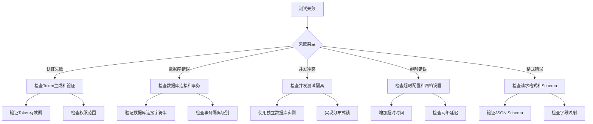

**图表来源**
- [API测试模式参考:229-271](file://altas-workflow/references/testing/api-testing.md#L229-L271)

### 调试技巧

1. **详细日志输出**：使用pytest的-v和-s选项获取更多信息
2. **中间状态检查**：在关键节点添加断点和日志
3. **环境隔离**：使用独立的测试数据库和配置
4. **逐步缩小范围**：从整体测试到具体用例逐一验证

**章节来源**
- [API测试模式参考:229-271](file://altas-workflow/references/testing/api-testing.md#L229-L271)

## 结论

高级API测试模式为现代Web应用提供了一个全面、系统化的测试解决方案。通过结合pytest的强大功能、FastAPI的测试客户端和完善的测试策略，该模式能够有效提升API的质量和可靠性。

### 主要优势

1. **全面覆盖**：涵盖认证、输入验证、错误处理、并发等多个方面
2. **高效执行**：通过合理的测试组织和优化策略提升执行效率
3. **质量保证**：集成覆盖率监控、稳定性检测和性能基准
4. **易于维护**：模块化的架构设计便于长期维护和扩展

### 最佳实践建议

1. **测试策略制定**：根据API复杂度和业务重要性确定测试优先级
2. **数据管理**：使用Factory Boy和Faker确保测试数据的真实性和一致性
3. **持续集成**：将测试集成到CI/CD流程中，确保代码质量持续提升
4. **定期审查**：定期回顾测试覆盖率和质量指标，持续改进测试策略

## 附录

### 测试清单模板

```markdown
## API测试清单

### 基础功能测试
- [ ] **Happy Path**: 有效请求成功返回 200/201
- [ ] **必填字段**: 缺失字段返回 422
- [ ] **类型验证**: 错误类型返回 422
- [ ] **格式验证**: 邮箱/URL 等格式校验
- [ ] **长度限制**: 超出长度返回 422

### 安全性测试
- [ ] **无 Token**: 未认证返回 401
- [ ] **过期 Token**: Token 过期返回 401
- [ ] **跨用户访问**: 无权访问返回 403
- [ ] **404**: 不存在资源返回 404

### 稳定性测试
- [ ] **500 优雅降级**: 内部错误不暴露堆栈
- [ ] **幂等性**: 重复请求结果一致
- [ ] **并发**: 竞态条件不导致数据不一致

### 性能测试
- [ ] **分页**: 页边界、空结果、无效参数
- [ ] **Schema 一致**: 响应结构符合预期
```

### 质量门禁标准

| 指标 | 目标值 | 说明 |
|------|--------|------|
| 测试覆盖率 | ≥80% | 核心业务≥95% |
| 测试通过率 | 100% | 零容忍失败 |
| Flaky Rate | <1% | 不稳定测试率 |
| 执行时间 | <5分钟 | 完整套件运行时间 |
| 断言密度 | 2-4个/测试 | 合理的断言数量 |
| Mock比例 | <30% | 依赖真实行为 |