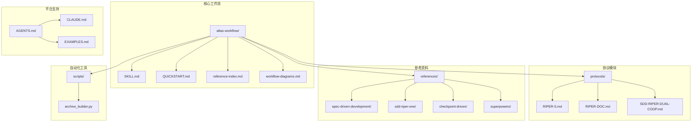
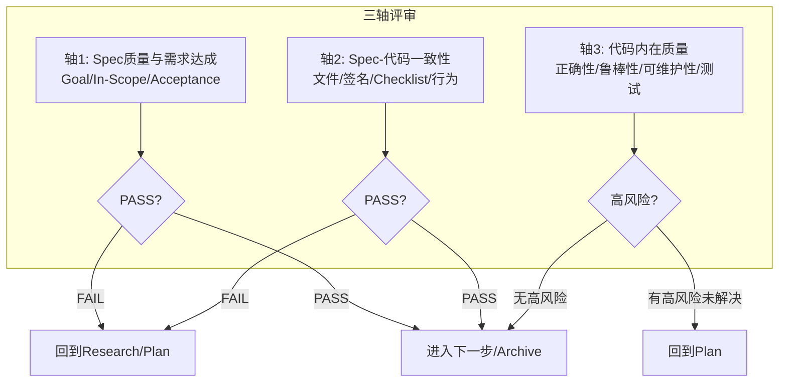
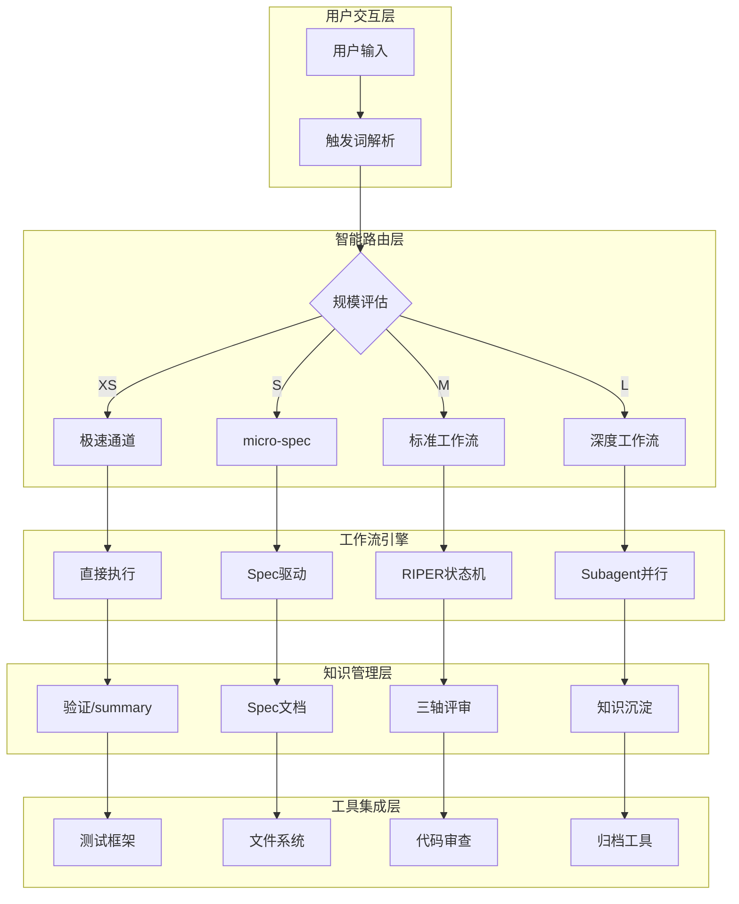
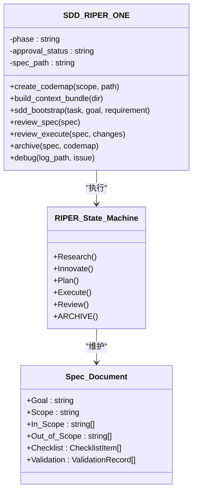
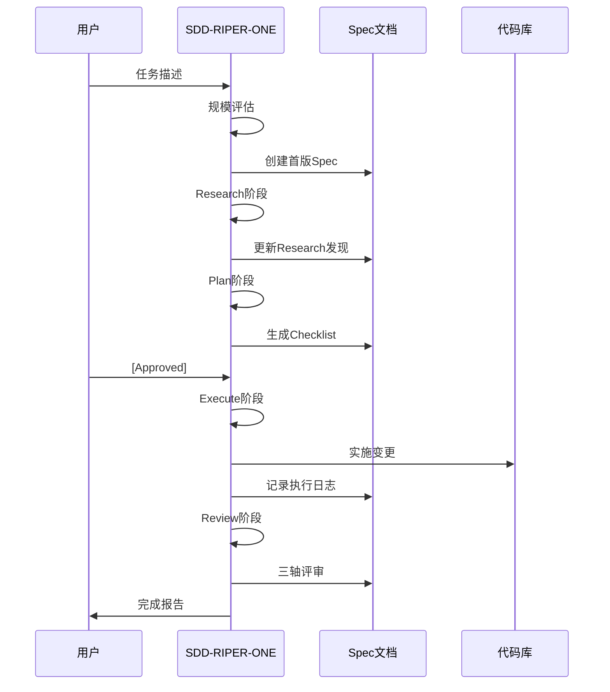
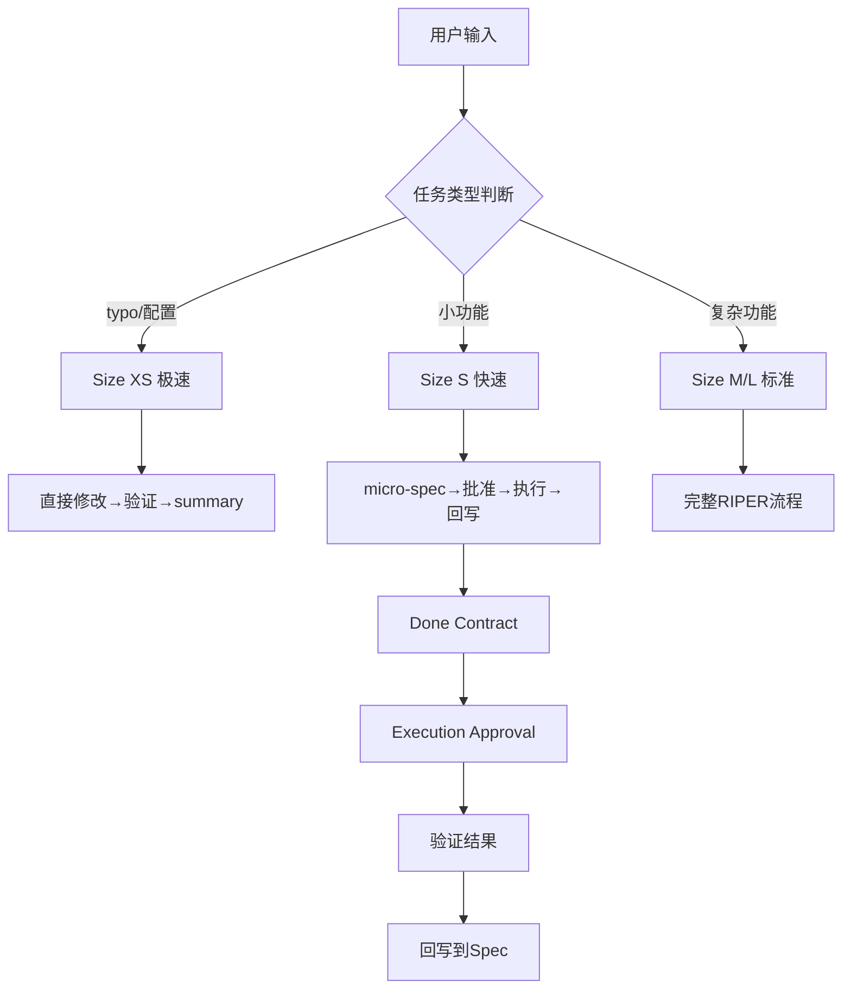
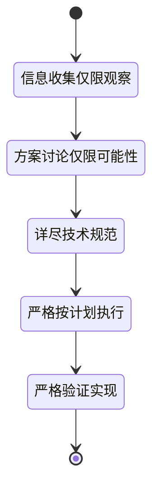
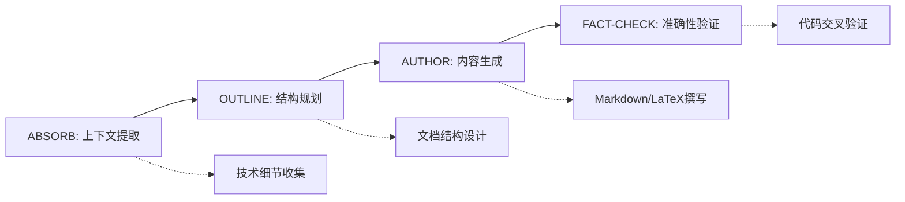
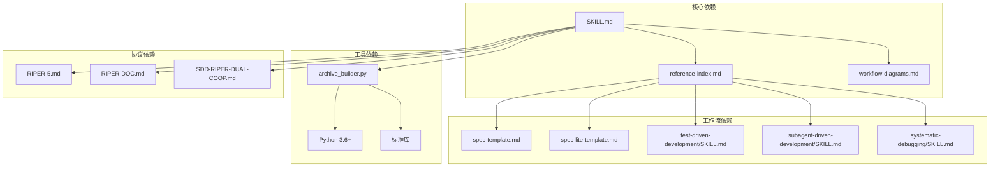
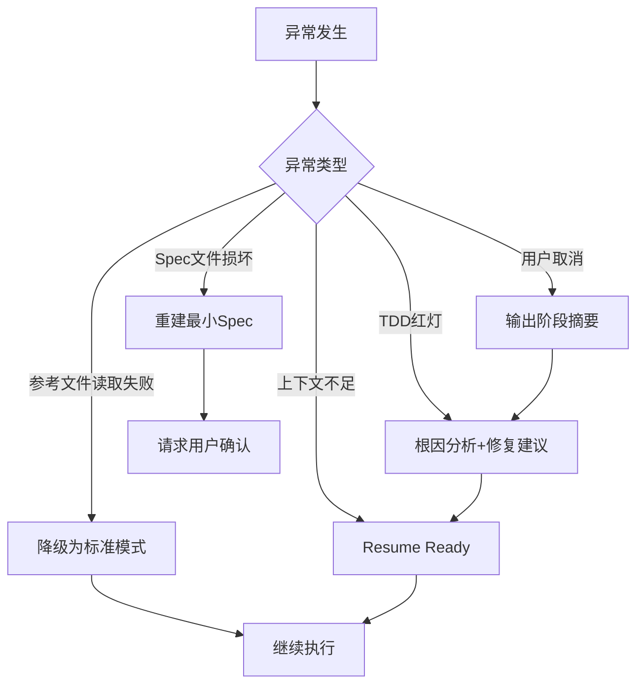

# Altas Workflow 核心

<cite>
**本文档引用的文件**
- [README.md](file://README.md)
- [QUICKSTART.md](file://altas-workflow/QUICKSTART.md)
- [SKILL.md](file://altas-workflow/SKILL.md)
- [reference-index.md](file://altas-workflow/reference-index.md)
- [workflow-diagrams.md](file://altas-workflow/workflow-diagrams.md)
- [RIPER-5.md](file://altas-workflow/protocols/RIPER-5.md)
- [RIPER-DOC.md](file://altas-workflow/protocols/RIPER-DOC.md)
- [SDD-RIPER-DUAL-COOP.md](file://altas-workflow/protocols/SDD-RIPER-DUAL-COOP.md)
- [archive_builder.py](file://altas-workflow/scripts/archive_builder.py)
- [sdd-riper-one/SKILL.md](file://altas-workflow/references/agents/sdd-riper-one/SKILL.md)
- [test-driven-development/SKILL.md](file://altas-workflow/references/superpowers/test-driven-development/SKILL.md)
- [systematic-debugging/SKILL.md](file://altas-workflow/references/superpowers/systematic-debugging/SKILL.md)
- [subagent-driven-development/SKILL.md](file://altas-workflow/references/superpowers/subagent-driven-development/SKILL.md)
- [spec-template.md](file://altas-workflow/references/spec-driven-development/spec-template.md)
- [spec-lite-template.md](file://altas-workflow/references/checkpoint-driven/spec-lite-template.md)
</cite>

## 目录
1. [简介](#简介)
2. [项目结构](#项目结构)
3. [核心组件](#核心组件)
4. [架构概览](#架构概览)
5. [详细组件分析](#详细组件分析)
6. [依赖分析](#依赖分析)
7. [性能考虑](#性能考虑)
8. [故障排除指南](#故障排除指南)
9. [结论](#结论)
10. [附录](#附录)

## 简介

Altas Workflow 是一套综合性 AI 原生研发工作流规范，融合了 SDD-RIPER、SDD-RIPER-Optimized (Checkpoint-Driven) 与 Superpowers 三大优秀工作流的精华。该项目致力于解决 AI 编程中的四大工程痛点：

- **上下文腐烂**：通过 CodeMap 索引 + 渐进式披露，按需加载参考资料
- **审查瘫痪**：4 级智能深度 (XS/S/M/L)，小任务不卡审批
- **代码不信任**：Spec 中心论 + 三轴评审，Spec is Truth
- **难以维护**：Archive 知识沉淀 + TDD 铁律，完成即资产

### 核心铁律

1. **No Spec, No Code** — 未形成最小 Spec 前不写代码 (Size XS 豁免)
2. **No Approval, No Execute** — Plan 阶段人类不点头，绝不写代码
3. **Spec is Truth** — Spec 与代码冲突时，代码是错的
4. **Reverse Sync** — 执行中发现偏差→先更新 Spec→再修代码
5. **Evidence First** — 完成由验证结果证明，非模型自宣布
6. **No Root Cause, No Fix** — Bug 修复前必须有根因分析，禁止盲改
7. **TDD Iron Law** — Size M/L: 无失败测试不写生产代码
8. **Resume Ready** — 长任务暂停前在 Spec 中留恢复锚点

## 项目结构

Altas Workflow 采用模块化设计，主要包含以下核心目录：



**图表来源**
- [README.md:48-82](file://README.md#L48-L82)
- [SKILL.md:1-11](file://altas-workflow/SKILL.md#L1-L11)

### 核心资产统计

| 类别 | 数量 | 说明 |
|------|------|------|
| **核心协议** | 1 个 | SKILL.md (ALTAS Workflow 主协议) |
| **专用协议** | 3 个 | RIPER-5 / RIPER-DOC / DUAL-COOP |
| **方法论** | 4 篇 | 从传统到大模型 / AI 原生范式 / 团队落地 / 手把手教程 |
| **参考资料** | 70 个 | Spec 驱动 (7) / Checkpoint (4) / Superpowers (37) / Agents (22) |
| **独立 Agent** | 2 个 | SDD-RIPER-ONE (标准版/轻量版) |
| **代码示例** | 1 个 | EXAMPLES.md (四大原则实战示例) |
| **自动化工具** | 1 个 | archive_builder.py (Archive 构建器) |

**章节来源**
- [README.md:84-95](file://README.md#L84-L95)
- [README.md:628-643](file://README.md#L628-L643)

## 核心组件

### 1. 智能深度适配系统

Altas Workflow 采用四级任务深度评估机制：

```mermaid
flowchart LR
A[接收任务] --> B{复杂度评估}
B --> |"typo/<10行"| C[Size XS 极速]
B --> |"1-2文件"| D[Size S 快速]
B --> |"3-10文件"| E[Size M 标准]
B --> |"跨模块/>500行"| F[Size L 深度]
C --> G[直接执行→验证→summary]
D --> H[micro-spec→批准→执行→回写]
E --> I[Research→Plan→Execute(TDD)→Review]
F --> J[Research→Innovate→Plan→Execute→Subagent→Review→Archive]
```

**图表来源**
- [README.md:237-245](file://README.md#L237-L245)
- [SKILL.md:84-92](file://altas-workflow/SKILL.md#L84-L92)

### 2. 进度可视化系统

每个步骤完成后，AI 必须输出标准化检查点：

```markdown
### 进度 [阶段 ▸ 步骤]
[已完成] ▸ **[当前]** ▸ [下一步] ▸ [后续...]

### 当前成果
- 刚完成了什么（具体产出）

### 预期产出
- 下一步将会产出什么

### 下一步操作
- **[继续/Approved]**: 同意，进入下一步
- **[修改]** + 意见：调整当前成果
- **[升级为 X]** / **[降级为 X]**: 调整规模
- **[加载参考：XXX]**: 查看某参考文档的详情
```

**章节来源**
- [README.md:286-306](file://README.md#L286-L306)
- [README.md:307-348](file://README.md#L307-L348)

### 3. 三轴评审机制

Altas Workflow 采用独特的三轴评审体系：



**图表来源**
- [SKILL.md:303-310](file://altas-workflow/SKILL.md#L303-L310)

**章节来源**
- [SKILL.md:301-316](file://altas-workflow/SKILL.md#L301-L316)

## 架构概览

Altas Workflow 采用分层架构设计，结合三种工作流的优势：



**图表来源**
- [workflow-diagrams.md:7-42](file://altas-workflow/workflow-diagrams.md#L7-L42)
- [SKILL.md:153-163](file://altas-workflow/SKILL.md#L153-L163)

### 触发词与模式映射

| 触发词 | 模式 | 规模 | 用途 |
|--------|------|------|------|
| `FAST`/`快速`/`>>` | 极速通道 | XS/S | 跳过 Research/Plan |
| `DEEP` | 深度模式 | L | 架构重构 |
| `DEBUG`/`排查` | 系统化调试 | - | 根因分析 |
| `MULTI`/`多项目` | 多项目协作 | L | 跨项目开发 |
| `DOC`/`写文档` | 文档专家 | - | 文档撰写 |
| `MAP`/`链路梳理` | 代码映射 | - | 功能级 CodeMap |
| `ARCHIVE`/`归档` | 知识沉淀 | - | 经验总结 |
| `REVIEW`/`代码审查` | 代码审查 | M/L | 三轴评审 |

**章节来源**
- [SKILL.md:112-129](file://altas-workflow/SKILL.md#L112-L129)
- [README.md:175-192](file://README.md#L175-L192)

## 详细组件分析

### 组件 A：SDD-RIPER-ONE 标准版

SDD-RIPER-ONE 是 Altas Workflow 的核心执行引擎，提供完整的 RIPER 状态机：



**图表来源**
- [sdd-riper-one/SKILL.md:6-26](file://altas-workflow/references/agents/sdd-riper-one/SKILL.md#L6-L26)
- [sdd-riper-one/SKILL.md:72-124](file://altas-workflow/references/agents/sdd-riper-one/SKILL.md#L72-L124)

#### 核心执行流程



**图表来源**
- [workflow-diagrams.md:291-338](file://altas-workflow/workflow-diagrams.md#L291-L338)

**章节来源**
- [sdd-riper-one/SKILL.md:28-36](file://altas-workflow/references/agents/sdd-riper-one/SKILL.md#L28-L36)
- [sdd-riper-one/SKILL.md:177-196](file://altas-workflow/references/agents/sdd-riper-one/SKILL.md#L177-L196)

### 组件 B：Checkpoint 驱动轻量模式

Checkpoint 驱动模式专为高频多轮交互设计，提供高效的 micro-spec 工作流：



**图表来源**
- [SKILL.md:86-92](file://altas-workflow/SKILL.md#L86-L92)
- [spec-lite-template.md:5-69](file://altas-workflow/references/checkpoint-driven/spec-lite-template.md#L5-L69)

#### 上下文装配策略

| 层级 | 加载时机 | 内容 |
|------|----------|------|
| **Hot** (每轮) | 所有对话 | phase, approval状态, Spec路径, Goal, Scope, 活跃Checklist |
| **Warm** (阶段切换) | Research→Plan / Plan→Execute / Execute→Review | 研究发现, Plan文件/签名, 验证结果 |
| **Cold** (按需) | 冲突/不确定时 | 完整ChangeLog, 历史Research详情, 完整CodeMap |

**章节来源**
- [SKILL.md:476-490](file://altas-workflow/SKILL.md#L476-L490)

### 组件 C：Superpowers 超级能力

Superpowers 模块提供了丰富的专业技能：


**图表来源**
- [test-driven-development/SKILL.md:47-69](file://altas-workflow/references/superpowers/test-driven-development/SKILL.md#L47-L69)
- [systematic-debugging/SKILL.md:46-87](file://altas-workflow/references/superpowers/systematic-debugging/SKILL.md#L46-L87)
- [subagent-driven-development/SKILL.md:40-85](file://altas-workflow/references/superpowers/subagent-driven-development/SKILL.md#L40-L85)

**章节来源**
- [test-driven-development/SKILL.md:31-46](file://altas-workflow/references/superpowers/test-driven-development/SKILL.md#L31-L46)
- [systematic-debugging/SKILL.md:16-23](file://altas-workflow/references/superpowers/systematic-debugging/SKILL.md#L16-L23)

### 组件 D：协议系统

Altas Workflow 支持多种专用协议：

#### RIPER-5 严格模式协议

RIPER-5 提供严格的五阶段门禁控制：



**图表来源**
- [RIPER-5.md:25-125](file://altas-workflow/protocols/RIPER-5.md#L25-L125)

#### RIPER-DOC 文档专家协议

文档专家协议提供四阶段文档创作流程：



**图表来源**
- [RIPER-DOC.md:9-60](file://altas-workflow/protocols/RIPER-DOC.md#L9-L60)

**章节来源**
- [RIPER-5.md:15-22](file://altas-workflow/protocols/RIPER-5.md#L15-L22)
- [RIPER-DOC.md:5-7](file://altas-workflow/protocols/RIPER-DOC.md#L5-L7)

## 依赖分析

### 模块耦合关系



**图表来源**
- [reference-index.md:16-81](file://altas-workflow/reference-index.md#L16-L81)
- [SKILL.md:425-455](file://altas-workflow/SKILL.md#L425-L455)

### 外部依赖

| 依赖类型 | 用途 | 版本要求 |
|----------|------|----------|
| **Python** | 归档构建器 | 3.6+ |
| **文件系统** | 产物存储 | 任意平台 |
| **测试框架** | TDD验证 | npm test / pytest / go test |
| **Git** | 版本控制 | 任意版本 |
| **IDE 工具** | 代码搜索 | SearchCodebase / Grep / Glob |

**章节来源**
- [archive_builder.py:1-8](file://altas-workflow/scripts/archive_builder.py#L1-L8)
- [QUICKSTART.md:30-33](file://altas-workflow/QUICKSTART.md#L30-L33)

## 性能考虑

### 上下文窗口优化

Altas Workflow 采用三层上下文装配策略：

1. **Hot 上下文**（每轮）：包含当前阶段状态和活跃任务
2. **Warm 上下文**（阶段切换）：包含跨阶段的重要信息
3. **Cold 上下文**（按需）：包含完整的历史记录

### 并行执行优化

对于支持并行的环境，Altas Workflow 可以：

- 同时执行多个子代理任务
- 自动进行两阶段审查（Spec 合规 → 代码质量）
- 使用 Git Worktree 进行隔离开发

### 资源消耗控制

- **内存使用**：通过渐进式披露避免一次性加载所有参考资料
- **计算资源**：根据任务复杂度动态选择工作流深度
- **存储空间**：提供产物生命周期管理策略

## 故障排除指南

### 常见问题与解决方案

| 问题类型 | 症状 | 解决方案 |
|----------|------|----------|
| **流程失控** | AI 一次性输出所有步骤 | 使用检查点机制，要求每次只推进一步 |
| **规格不符** | Plan 与实际实现不一致 | 使用 Reverse Sync 先更新 Spec 再修代码 |
| **测试失败** | TDD 红灯连续3次无法变绿 | 暂停执行，输出根因分析候选 |
| **上下文溢出** | 上下文窗口即将耗尽 | 执行 Resume Ready，输出恢复锚点 |
| **审查不通过** | 三轴评审失败 | 回到 Research/Plan 修正，不得绕过 |

### 异常恢复策略



**图表来源**
- [SKILL.md:182-197](file://altas-workflow/SKILL.md#L182-L197)

**章节来源**
- [SKILL.md:182-197](file://altas-workflow/SKILL.md#L182-L197)

## 结论

Altas Workflow 通过整合 SDD-RIPER、Checkpoint-Driven 和 Superpowers 三大工作流的优势，为企业级 AI 编程提供了完整的解决方案。其核心价值体现在：

### 主要优势

1. **工程化程度高**：通过严格的门禁机制和三轴评审，确保代码质量和可维护性
2. **适应性强**：支持四种不同的任务深度，从小型修改到架构重构
3. **知识管理完善**：通过 Spec、CodeMap、Archive 等产物实现知识沉淀
4. **工具链完整**：提供自动化脚本和多种协议支持

### 应用场景

- **日常功能迭代**：通过 Size M 工作流保证质量
- **紧急修复**：通过 Size XS 极速通道快速响应
- **架构重构**：通过 Size L 深度工作流确保系统稳定性
- **团队协作**：通过统一的协议和工具链提高协作效率

### 发展前景

Altas Workflow 代表了 AI 原生研发的发展方向，通过将人工智能与工程实践深度融合，为企业数字化转型提供了强有力的技术支撑。

## 附录

### 快速开始指南

1. **环境配置**
   - 安装 Skill/Prompt 到目标平台
   - 创建 `mydocs/` 目录结构
   - 配置测试框架

2. **基本使用**
   - 极速修改：`>> 任务描述`
   - 小任务：`FAST: 任务描述`
   - 标准开发：`sdd_bootstrap: task=..., goal=...`
   - 深度重构：`DEEP: 任务描述`

3. **高级功能**
   - 系统化调试：`DEBUG: 日志路径`
   - 多项目协作：`MULTI: 跨项目任务`
   - 文档专家：`DOC: 文档任务`
   - 知识沉淀：`ARCHIVE: 目标文件`

**章节来源**
- [QUICKSTART.md:7-33](file://altas-workflow/QUICKSTART.md#L7-L33)
- [QUICKSTART.md:36-49](file://altas-workflow/QUICKSTART.md#L36-L49)

### 参考资料索引

| 类别 | 文件 | 用途 |
|------|------|------|
| **核心协议** | `SKILL.md` | 主协议定义 |
| **工作流模板** | `spec-template.md` | 完整 Spec 模板 |
| | `spec-lite-template.md` | micro-spec 模板 |
| **执行技能** | `test-driven-development/SKILL.md` | TDD 铁律 |
| | `systematic-debugging/SKILL.md` | 系统化调试 |
| | `subagent-driven-development/SKILL.md` | Subagent 驱动 |
| **工具脚本** | `archive_builder.py` | 知识归档 |
| **专用协议** | `RIPER-5.md` | 严格模式 |
| | `RIPER-DOC.md` | 文档专家 |
| | `SDD-RIPER-DUAL-COOP.md` | 双模型协作 |

**章节来源**
- [reference-index.md:425-455](file://altas-workflow/reference-index.md#L425-L455)