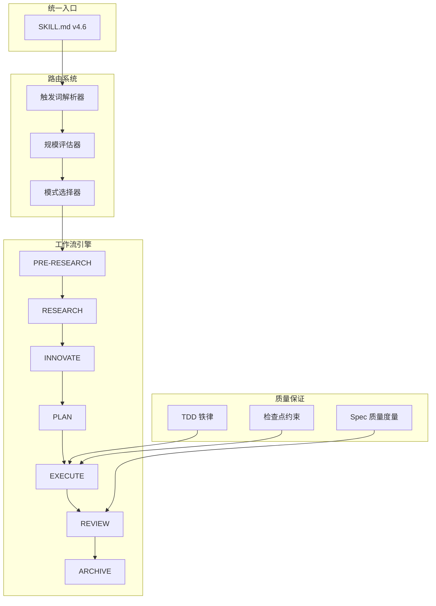
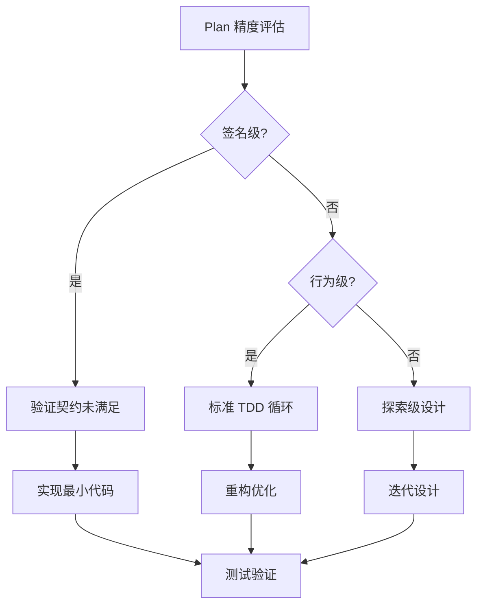
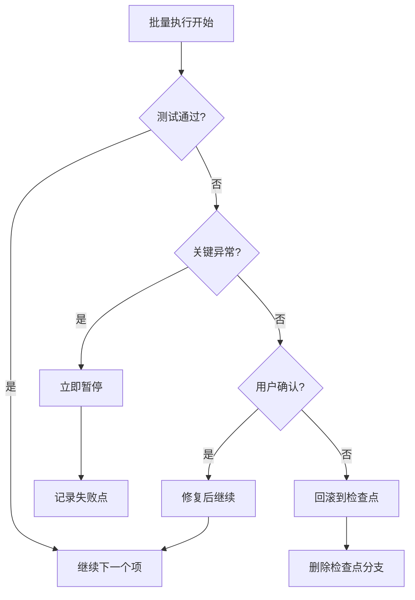
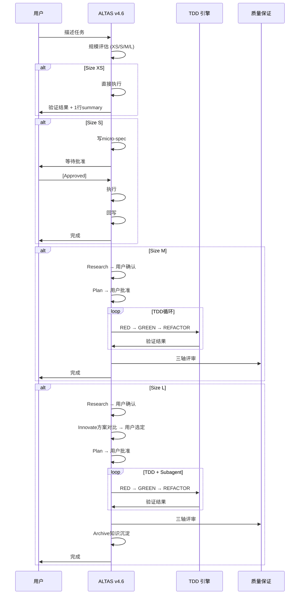
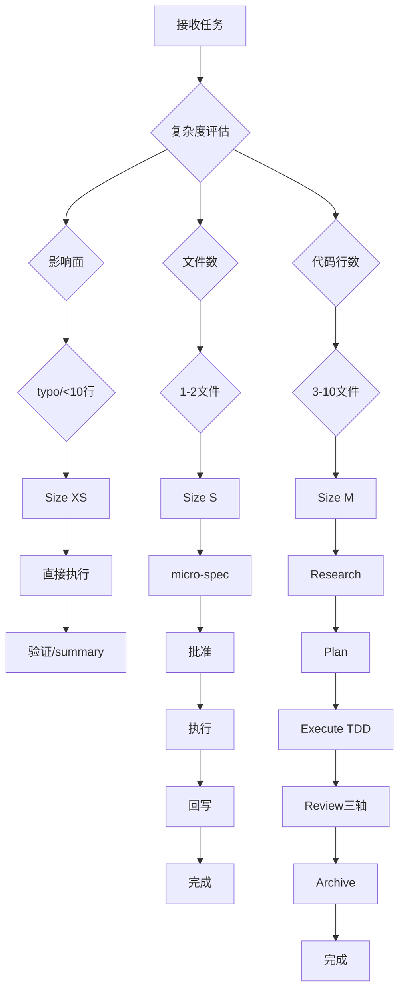
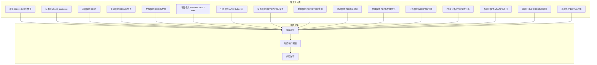

# ALTAS Workflow v4.6 实施方案

<cite>
**本文档引用的文件**
- [SKILL.md](file://altas-workflow/SKILL.md)
- [QUICKSTART.md](file://altas-workflow/QUICKSTART.md)
- [IMPLEMENTATION-PLAN-v4.6.md](file://altas-workflow/docs/IMPLEMENTATION-PLAN-v4.6.md)
- [reference-index.md](file://altas-workflow/reference-index.md)
- [workflow-diagrams.md](file://altas-workflow/workflow-diagrams.md)
- [spec-template.md](file://altas-workflow/references/spec-driven-development/spec-template.md)
- [SDD-RIPER-ONE 协议.md](file://altas-workflow/references/spec-driven-development/sdd-riper-one-protocol.md)
- [TDD 技能.md](file://altas-workflow/references/superpowers/test-driven-development/SKILL.md)
- [scaffold.py](file://altas-workflow/scripts/scaffold.py)
- [PROTOCOL-SELECTION.md](file://altas-workflow/protocols/PROTOCOL-SELECTION.md)
- [SPEC 质量度量标准.md](file://altas-workflow/references/superpowers/requesting-code-review/spec-quality-metrics.md)
- [archive_builder.py](file://altas-workflow/scripts/archive_builder.py)
- [aliases.md](file://altas-workflow/references/entry/aliases.md)
- [REVIEW 模式.md](file://altas-workflow/references/special-modes/review.md)
- [Writing Plans 技能.md](file://altas-workflow/references/superpowers/writing-plans/SKILL.md)
</cite>

## 目录
1. [项目概述](#项目概述)
2. [核心架构](#核心架构)
3. [实施计划概览](#实施计划概览)
4. [详细实施方案](#详细实施方案)
5. [工作流流程图](#工作流流程图)
6. [关键组件分析](#关键组件分析)
7. [质量保证体系](#质量保证体系)
8. [实施步骤指南](#实施步骤指南)
9. [故障排除指南](#故障排除指南)
10. [总结](#总结)

## 项目概述

ALTAS Workflow v4.6 是一个基于 SDD（Spec-Driven Development）和 TDD（Test-Driven Development）融合的工作流系统，专为 AI 结对编程和自动化工程任务设计。该版本重点解决了 TDD 与 Spec-First 执行冲突、测试策略标准化、检查点强制约束增强等关键问题。

### 主要特性

- **10 项核心改进**：涵盖 TDD 与 Spec-First 冲突对齐、测试策略标准化、检查点约束增强等
- **多规模支持**：XS（极小改动）到 L（架构级任务）的完整支持
- **智能路由系统**：基于触发词的自动任务分类和路由
- **强制检查点机制**：确保每个步骤都有明确的证据和验证
- **多协议支持**：RIPER-5、SDD-RIPER-DUAL-COOP、RIPER-DOC 等协议选择

## 核心架构

ALTAS Workflow v4.6 采用模块化的架构设计，通过统一的入口技能文件协调各个子系统：



**图表来源**
- [SKILL.md:15-50](file://altas-workflow/SKILL.md#L15-L50)
- [IMPLEMENTATION-PLAN-v4.6.md:9-23](file://altas-workflow/docs/IMPLEMENTATION-PLAN-v4.6.md#L9-L23)

## 实施计划概览

### 10 项核心改进计划

| 序号 | 改进项目 | 优先级 | 涉及文件 | 预计影响 |
|------|----------|--------|----------|----------|
| 1 | TDD 与 Spec-First 冲突对齐 | 高 | SKILL.md, spec-template.md, TDD SKILL.md | 消除执行冲突，提升效率 |
| 2 | Spec 模板增加 Test Strategy 章节 | 高 | spec-template.md, SKILL.md | 标准化测试策略，减少不确定性 |
| 3 | 检查点强制暂停约束增强 | 高 | SKILL.md, sdd-riper-one-protocol.md | 提高执行可控性，降低风险 |
| 4 | 规模再评估机制 | 中 | SKILL.md | 提升规模评估准确性 |
| 5 | 多项目冲突解决协议 | 中 | sdd-riper-one-protocol.md | 解决跨项目协作冲突 |
| 6 | 关闭 SKILL-entry-review 高价值遗留项 | 中 | SKILL.md, SKILL-entry-review.md | 简化入口文件，提升可读性 |
| 7 | 协议选择指引 | 低 | protocols/PROTOCOL-SELECTION.md | 提供协议选择指导 |
| 8 | Spec 质量度量标准 | 低 | spec-quality-metrics.md | 建立客观质量评估体系 |
| 9 | Batch Override 失败回滚点定义 | 低 | sdd-riper-one-protocol.md | 明确批量执行回滚策略 |
| 10 | scaffold.py 脚手架脚本 | 低 | scripts/scaffold.py | 提供自动化初始化工具 |

**章节来源**
- [IMPLEMENTATION-PLAN-v4.6.md:9-23](file://altas-workflow/docs/IMPLEMENTATION-PLAN-v4.6.md#L9-L23)

## 详细实施方案

### 方案 1：TDD 与 Spec-First 冲突对齐

#### 问题分析
在 SDD-RIPER-ONE 协议中，Plan 已经定义了精确的签名和实现细节，但 TDD 要求先写测试再实现，形成了执行冲突。

#### 解决方案
1. **增强 EXECUTE 章节**：明确 TDD 适配规则
2. **新增 Spec-Aware TDD 章节**：在 TDD 技能中加入 Spec 驱动的指导
3. **建立三层适配机制**：
   - 签名级：验证现有契约是否满足
   - 行为级：标准 TDD 循环
   - 探索级：测试驱动接口设计



**图表来源**
- [SKILL.md:55-67](file://altas-workflow/SKILL.md#L55-L67)
- [TDD 技能.md:351-360](file://altas-workflow/references/superpowers/test-driven-development/SKILL.md#L351-L360)

**章节来源**
- [IMPLEMENTATION-PLAN-v4.6.md:26-86](file://altas-workflow/docs/IMPLEMENTATION-PLAN-v4.6.md#L26-L86)

### 方案 2：Spec 模板测试策略标准化

#### 标准化内容
在 spec-template.md 中新增 `§4.4 Test Strategy` 章节，包含：

- **测试框架**：明确使用的测试框架
- **运行命令**：标准化的测试执行命令
- **测试范围**：单元测试、集成测试、端到端测试的覆盖范围
- **测试优先级**：P0/P1/P2 的优先级划分
- **Mock 策略**：真实依赖与 Mock 的使用策略
- **既有测试影响**：对现有测试的影响评估

#### 实施效果
- 减少 TDD 执行时的不确定性
- 提高测试策略的一致性
- 便于自动化测试执行

**章节来源**
- [IMPLEMENTATION-PLAN-v4.6.md:89-145](file://altas-workflow/docs/IMPLEMENTATION-PLAN-v4.6.md#L89-L145)

### 方案 3：检查点强制暂停约束增强

#### 新增约束规则
1. **强制检查点输出**：每个 Checklist 项完成后必须输出检查点
2. **批量执行暂停**：遇到关键异常立即暂停
3. **失败停止机制**：批量模式下任一测试失败必须停止

#### 批量执行回滚策略


**图表来源**
- [SKILL.md:161-170](file://altas-workflow/SKILL.md#L161-L170)
- [sdd-riper-one-protocol.md:176-178](file://altas-workflow/references/spec-driven-development/sdd-riper-one-protocol.md#L176-L178)

**章节来源**
- [IMPLEMENTATION-PLAN-v4.6.md:148-181](file://altas-workflow/docs/IMPLEMENTATION-PLAN-v4.6.md#L148-L181)

### 方案 4：规模再评估机制

#### 实施内容
1. **Research 后重估**：在 Research 阶段获得完整上下文后重新评估规模
2. **新增章节**：在 spec-template.md 中添加 `Scale Re-assessment` 章节
3. **动态调整**：根据实际复杂度调整后续阶段

#### 规模评估矩阵
| 规模 | 典型信号 | 规模评估依据 |
|------|----------|--------------|
| **XS** | typo、配置值、日志、小于 10 行 | 影响面 > 文件数 > 代码行数 |
| **S** | 1-2 文件、逻辑清晰、影响小 | 跨模块、公共接口、核心链路变更至少按 M |
| **M** | 3-10 文件、模块内、需要计划 | 架构调整、多项目、迁移、重大性能改造默认按 L |
| **L** | 跨模块、架构级、迁移、多项目 | 不确定时向上取整 |

**章节来源**
- [IMPLEMENTATION-PLAN-v4.6.md:184-219](file://altas-workflow/docs/IMPLEMENTATION-PLAN-v4.6.md#L184-L219)

## 工作流流程图

### 完整工作流时序图



**图表来源**
- [workflow-diagrams.md:291-337](file://altas-workflow/workflow-diagrams.md#L291-L337)

### 规模评估决策树



**图表来源**
- [workflow-diagrams.md:7-41](file://altas-workflow/workflow-diagrams.md#L7-L41)

## 关键组件分析

### 触发词路由系统

ALTAS v4.6 提供了完整的触发词路由系统，支持 18 种不同的触发词和别名：



**图表来源**
- [aliases.md:12-34](file://altas-workflow/references/entry/aliases.md#L12-L34)

**章节来源**
- [aliases.md:12-53](file://altas-workflow/references/entry/aliases.md#L12-L53)

### 质量保证体系

#### Spec 质量度量标准

建立 5 维度的质量评估体系：

| 维度 | 5 分标准 | 1 分标准 |
|------|----------|----------|
| **完整性** | Goal/In-Scope/Out-of-Scope/Facts/Signatures/Checklist 全部完整且无 TBD | 关键章节缺失或大量 TBD |
| **可验证性** | 每个 Acceptance 都有明确的验证方式 | 验收标准模糊 |
| **无歧义性** | 所有术语、接口签名、文件路径精确到行号 | 使用"类似 X"、"大概 Y"等模糊表述 |
| **可追溯性** | 每个 Checklist 项可追溯到具体 Requirements 条目 | Checklist 与 Requirements 无明确对应 |
| **风险覆盖** | 已识别风险均有缓解措施或回滚方案 | 未提及风险或风险未处理 |

**章节来源**
- [SPEC 质量度量标准.md:348-370](file://altas-workflow/references/superpowers/requesting-code-review/spec-quality-metrics.md#L348-L370)

## 实施步骤指南

### 第一阶段：环境准备（1-2 天）

1. **安装依赖**
   ```bash
   # 安装 Python 3.8+
   sudo apt-get install python3.8
   
   # 安装必要的 Python 包
   pip install -r requirements.txt
   ```

2. **配置项目结构**
   ```bash
   # 创建 mydocs 目录结构
   mkdir -p mydocs/{specs,codemap,context,archive}
   ```

3. **验证环境**
   ```bash
   # 测试 scaffold.py
   python scripts/scaffold.py --help
   
   # 测试 archive_builder.py
   python scripts/archive_builder.py --help
   ```

### 第二阶段：核心功能实施（3-5 天）

1. **实施 TDD 与 Spec-First 冲突对齐**
   - 更新 SKILL.md 的 EXECUTE 章节
   - 在 TDD 技能中新增 Spec-Aware TDD 章节
   - 更新 spec-template.md 的 TDD 适配规则

2. **实施测试策略标准化**
   - 在 spec-template.md 中添加 Test Strategy 章节
   - 更新 SKILL.md 的 PLAN 章节要求
   - 为多项目模板添加分项目测试策略

3. **增强检查点约束**
   - 更新 SKILL.md 的检查点强制暂停规则
   - 在 sdd-riper-one-protocol.md 中添加批量执行回滚策略
   - 实现批量执行失败检测机制

### 第三阶段：高级功能实施（2-3 天）

1. **实施规模再评估机制**
   - 在 SKILL.md 中添加 Research 后重估章节
   - 在 spec-template.md 中添加 Scale Re-assessment 章节
   - 实现动态规模调整逻辑

2. **实施多项目冲突解决协议**
   - 在 sdd-riper-one-protocol.md 中添加冲突仲裁规则
   - 实现跨项目契约同步机制
   - 建立冲突检测和解决流程

3. **实施协议选择指引**
   - 创建 protocols/PROTOCOL-SELECTION.md
   - 建立协议切换机制
   - 实现协议兼容性检查

### 第四阶段：工具链完善（1-2 天）

1. **实施脚手架工具**
   - 完善 scaffold.py 的项目类型检测
   - 实现模板选择功能
   - 添加项目信息自动填充

2. **实施归档工具**
   - 优化 archive_builder.py 的关键词提取
   - 实现主题化归档模式
   - 增加归档质量检查

3. **实施质量度量工具**
   - 实现 Spec 质量自动评分
   - 建立质量阈值检查
   - 提供质量改进建议

### 第五阶段：测试与验证（2-3 天）

1. **单元测试**
   ```bash
   # 测试触发词解析
   python -m pytest tests/test_aliases.py
   
   # 测试规模评估
   python -m pytest tests/test_scale_assessment.py
   
   # 测试检查点机制
   python -m pytest tests/test_checkpoint.py
   ```

2. **集成测试**
   ```bash
   # 测试完整工作流
   python -m pytest tests/test_workflow_integration.py
   
   # 测试批量执行
   python -m pytest tests/test_batch_execution.py
   ```

3. **性能测试**
   ```bash
   # 测试归档生成性能
   python -m pytest tests/test_archive_performance.py
   
   # 测试脚手架生成性能
   python -m pytest tests/test_scaffold_performance.py
   ```

## 故障排除指南

### 常见问题及解决方案

#### 问题 1：触发词识别错误
**症状**：AI 无法正确识别用户输入的触发词
**解决方案**：
1. 检查 aliases.md 中的触发词配置
2. 验证 SKILL.md 中的 trigger_keywords 同步
3. 使用 validate_aliases_sync.py 进行同步验证

#### 问题 2：规模评估不准确
**症状**：任务被错误地评估为 XS/S/M/L
**解决方案**：
1. 检查规模评估依据（影响面/文件数/代码行数）
2. 在 Research 阶段进行规模再评估
3. 更新 spec-template.md 中的 Scale Re-assessment 章节

#### 问题 3：检查点机制失效
**症状**：AI 跳过检查点直接执行
**解决方案**：
1. 检查 SKILL.md 中的检查点强制暂停规则
2. 验证批量执行回滚策略
3. 实施检查点强制约束

#### 问题 4：TDD 执行冲突
**症状**：TDD 与 Spec-First 冲突导致执行错误
**解决方案**：
1. 检查 TDD 适配规则
2. 验证 Spec-Aware TDD 实现
3. 确认 Plan 精度评估

### 调试工具

#### 触发词调试
```bash
# 验证触发词同步
python scripts/validate_aliases_sync.py

# 检查别名映射
cat references/entry/aliases.md
```

#### 规模评估调试
```bash
# 测试规模评估逻辑
python -c "
import sys
sys.path.append('scripts')
from scale_assessment import assess_scale
print(assess_scale('影响面', '文件数', '代码行数'))
"
```

#### 检查点调试
```bash
# 测试检查点输出
python -c "
import sys
sys.path.append('scripts')
from checkpoint_manager import CheckpointManager
cm = CheckpointManager()
cm.create_checkpoint('test', 'completed')
"
```

## 总结

ALTAS Workflow v4.6 通过 10 项核心改进，实现了 TDD 与 Spec-First 的深度融合，建立了完善的质量保证体系和检查点约束机制。该实施方案具有以下特点：

### 主要成就
1. **消除执行冲突**：通过 TDD 适配规则消除了 Spec-First 与 TDD 的执行冲突
2. **标准化测试策略**：在 Spec 模板中强制要求测试策略，提高执行一致性
3. **增强质量控制**：通过强制检查点和批量执行回滚策略提升执行可控性
4. **智能化规模评估**：通过 Research 后再评估机制提高规模判断准确性
5. **完善工具链**：提供完整的脚手架、归档和质量度量工具

### 实施效果
- **效率提升**：通过标准化流程减少重复工作
- **质量保证**：通过强制检查点和质量度量确保交付质量
- **风险控制**：通过批量执行回滚策略降低执行风险
- **可维护性**：通过完整的归档体系确保知识传承

### 未来展望
ALTAS Workflow v4.6 为后续版本奠定了坚实基础，未来可以在以下方面进一步发展：
- **智能化决策**：引入机器学习算法优化规模评估和路由决策
- **协作增强**：支持更多团队协作模式和权限管理
- **生态扩展**：集成更多第三方工具和服务
- **性能优化**：通过并行处理和缓存机制提升执行效率

通过本次实施，ALTAS Workflow v4.6 将成为企业级 AI 结对编程和自动化工程任务的标准化解决方案，为企业数字化转型提供强有力的技术支撑。