# API测试参考文档

<cite>
**本文档引用的文件**
- [altas-workflow/SKILL.md](file://altas-workflow/SKILL.md)
- [altas-workflow/README.md](file://altas-workflow/README.md)
- [altas-workflow/QUICKSTART.md](file://altas-workflow/QUICKSTART.md)
- [altas-workflow/reference-index.md](file://altas-workflow/reference-index.md)
- [altas-workflow/references/testing/api-testing.md](file://altas-workflow/references/testing/api-testing.md)
- [altas-workflow/references/testing/pytest-patterns.md](file://altas-workflow/references/testing/pytest-patterns.md)
- [altas-workflow/references/testing/test-data-management.md](file://altas-workflow/references/testing/test-data-management.md)
- [altas-workflow/references/testing/ci-cd-integration.md](file://altas-workflow/references/testing/ci-cd-integration.md)
- [altas-workflow/references/testing/test-quality-metrics.md](file://altas-workflow/references/testing/test-quality-metrics.md)
</cite>

## 目录
1. [简介](#简介)
2. [项目结构](#项目结构)
3. [核心组件](#核心组件)
4. [架构概览](#架构概览)
5. [详细组件分析](#详细组件分析)
6. [依赖分析](#依赖分析)
7. [性能考虑](#性能考虑)
8. [故障排除指南](#故障排除指南)
9. [结论](#结论)

## 简介

ALTAS Workflow是一个综合性的人工智能原生开发工作流规范，专门针对API测试提供了完整的参考框架。该文档基于ALTAS工作流的核心原则，结合先进的API测试技能，为企业级API测试提供标准化的指导方案。

### 核心理念

ALTAS工作流强调以下核心理念：
- **契约优先**：从消费者视角测试API，而非实现细节
- **渐进式披露**：按需加载测试参考材料
- **证据驱动**：通过测试结果证明API质量
- **智能深度适配**：根据API复杂度选择合适的测试策略

## 项目结构

ALTAS工作流采用模块化设计，API测试相关的核心文件分布如下：

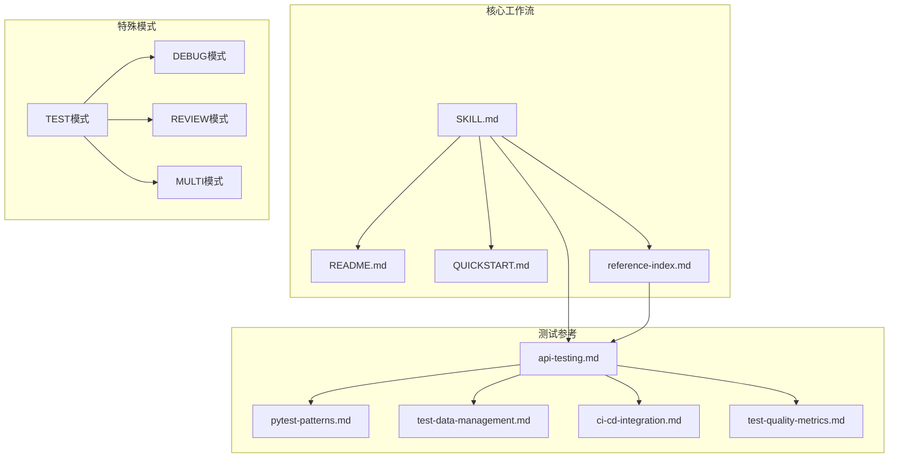

**图表来源**
- [altas-workflow/SKILL.md:1-577](file://altas-workflow/SKILL.md#L1-L577)
- [altas-workflow/reference-index.md:1-308](file://altas-workflow/reference-index.md#L1-L308)

**章节来源**
- [altas-workflow/SKILL.md:1-577](file://altas-workflow/SKILL.md#L1-L577)
- [altas-workflow/README.md:1-313](file://altas-workflow/README.md#L1-L313)

## 核心组件

### API测试工作流

ALTAS工作流为API测试提供了完整的生命周期管理：

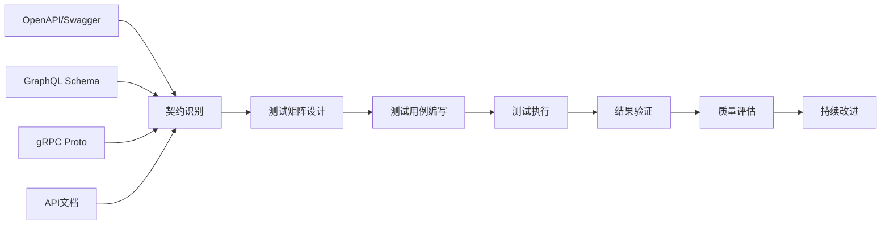

**图表来源**
- [altas-workflow/references/testing/api-testing.md:1-800](file://altas-workflow/references/testing/api-testing.md#L1-L800)

### 测试层次架构

ALTAS定义了四个级别的测试层次，适用于不同复杂度的API：

| 层级 | 目的 | 依赖 | 速度 | 适用场景 |
|------|------|------|------|----------|
| 契约 | 提供者-消费者协议 | 无 | 快 | API契约验证 |
| 组件 | API隔离测试 | Mocked | 快 | 单元测试 |
| 集成 | 真实依赖 | 数据库、服务 | 较慢 | 端到端测试 |
| E2E | 用户旅程测试 | 完整环境 | 较慢 | 系统级测试 |

**章节来源**
- [altas-workflow/references/testing/api-testing.md:13-21](file://altas-workflow/references/testing/api-testing.md#L13-L21)

## 架构概览

### API测试架构

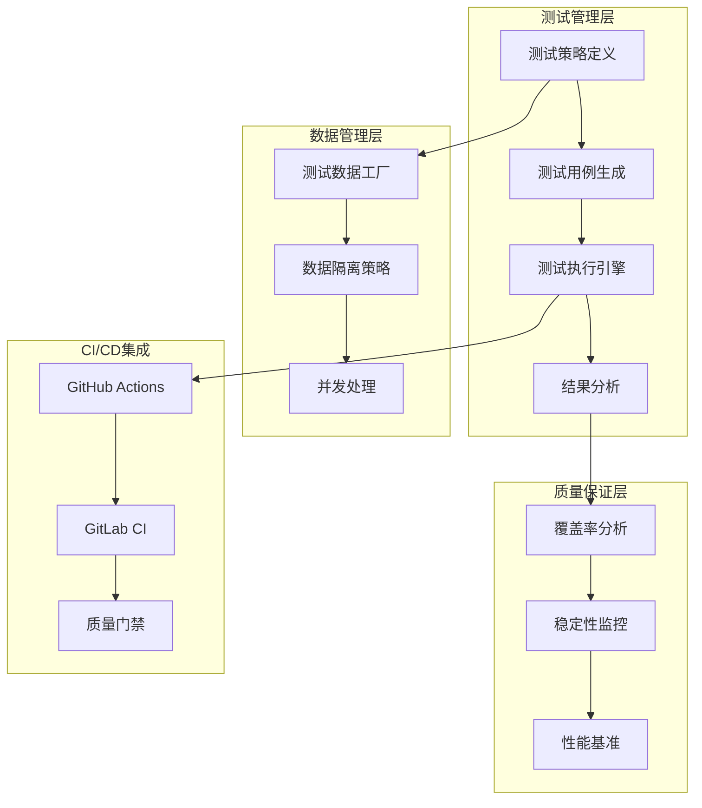

**图表来源**
- [altas-workflow/references/testing/test-data-management.md:18-41](file://altas-workflow/references/testing/test-data-management.md#L18-L41)
- [altas-workflow/references/testing/ci-cd-integration.md:18-301](file://altas-workflow/references/testing/ci-cd-integration.md#L18-L301)

### 测试数据管理架构

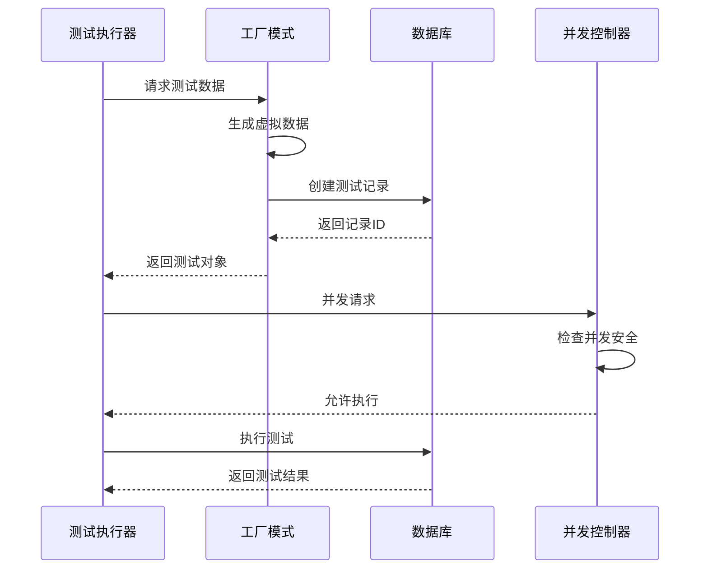

**图表来源**
- [altas-workflow/references/testing/test-data-management.md:581-642](file://altas-workflow/references/testing/test-data-management.md#L581-L642)

**章节来源**
- [altas-workflow/references/testing/test-data-management.md:1-769](file://altas-workflow/references/testing/test-data-management.md#L1-L769)

## 详细组件分析

### 契约驱动测试

#### 契约识别优先级

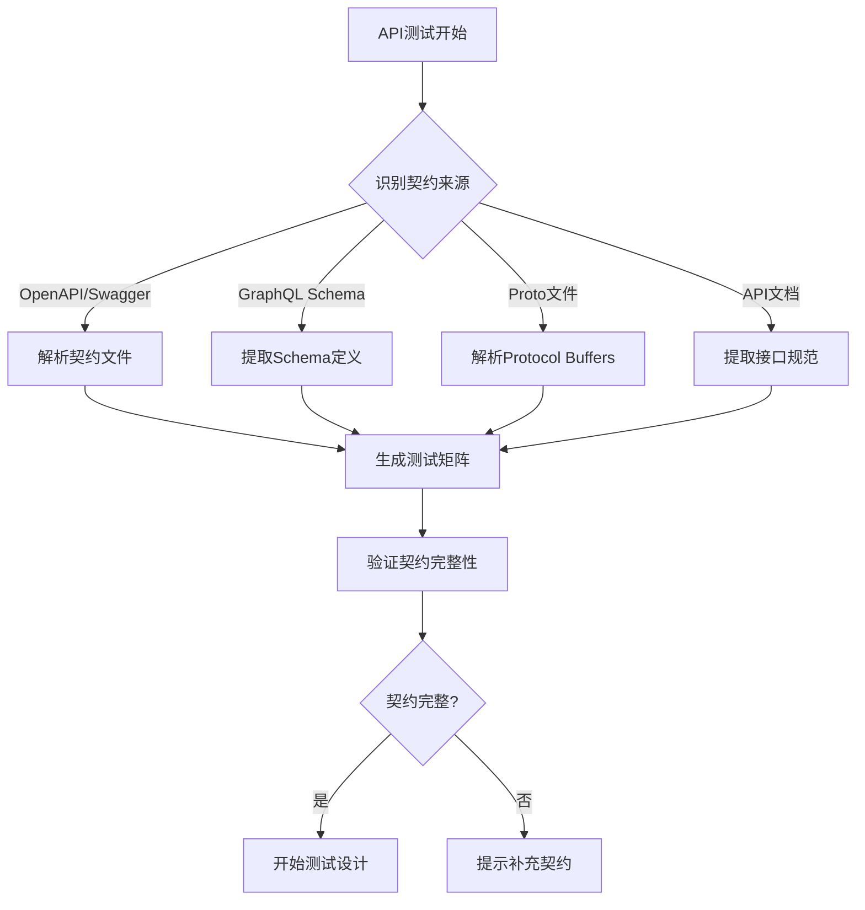

**图表来源**
- [altas-workflow/references/testing/api-testing.md:35-65](file://altas-workflow/references/testing/api-testing.md#L35-L65)

#### 测试矩阵模板

| 合同项目 | 来源 | 正常路径 | 验证 | 认证 | 幂等性 | 错误路径 | Schema |
|----------|------|--------|------|------|--------|----------|--------|
| `POST /orders` | `openapi.yaml#/paths/~1orders/post` | `201 create order` | `422 missing field` | `401/403` | `same Idempotency-Key` | `409/500` | `response schema matches` |
| `mutation createUser` | `schema.graphql#Mutation.createUser` | `returns created user` | `invalid email rejected` | `role required` | `N/A` | `domain error surfaced` | `selection set matches schema` |
| `GetUser` | `user.proto#rpc GetUser` | `OK returns user` | `INVALID_ARGUMENT` | `UNAUTHENTICATED` | `N/A` | `NOT_FOUND` | `protobuf fields match` |

**章节来源**
- [altas-workflow/references/testing/api-testing.md:66-75](file://altas-workflow/references/testing/api-testing.md#L66-L75)

### 测试用例设计

#### 输入验证测试

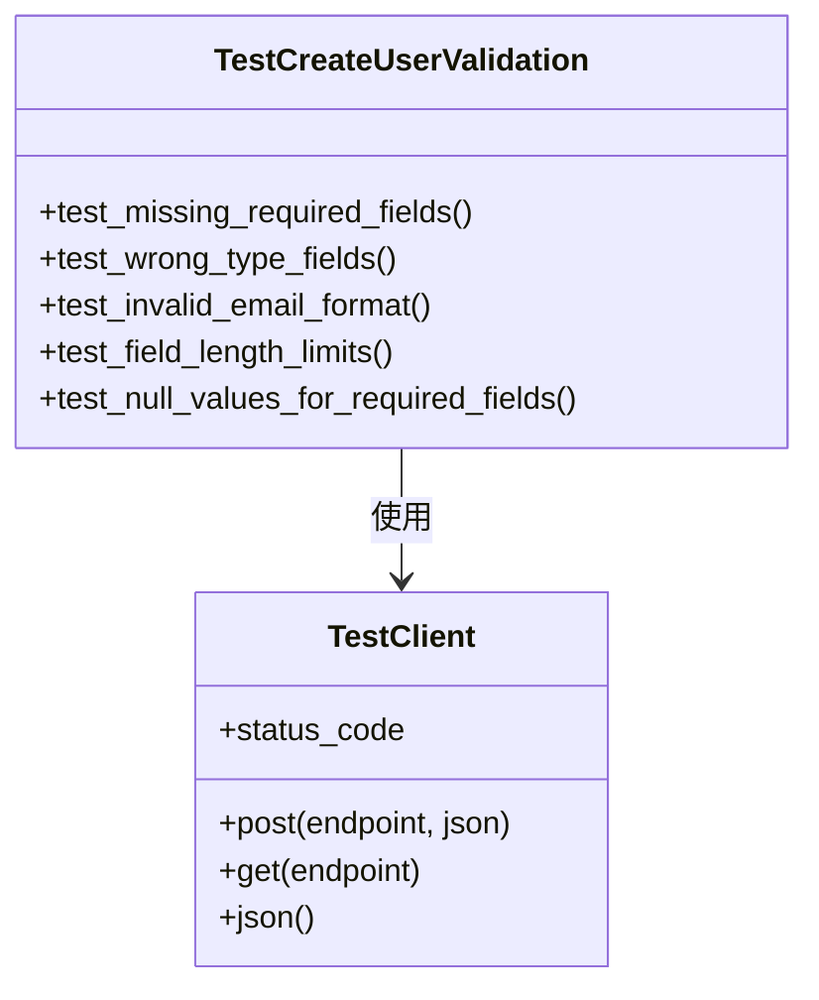

**图表来源**
- [altas-workflow/references/testing/api-testing.md:97-174](file://altas-workflow/references/testing/api-testing.md#L97-L174)

#### 并发测试策略

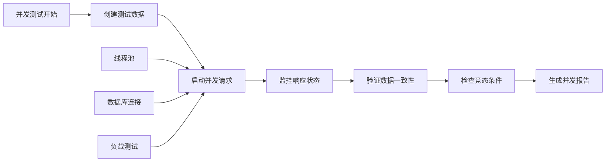

**图表来源**
- [altas-workflow/references/testing/api-testing.md:223-269](file://altas-workflow/references/testing/api-testing.md#L223-L269)

**章节来源**
- [altas-workflow/references/testing/api-testing.md:1-800](file://altas-workflow/references/testing/api-testing.md#L1-L800)

### 测试数据管理

#### 工厂模式应用

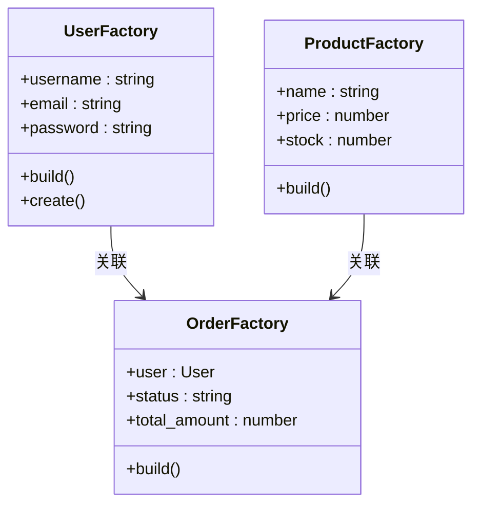

**图表来源**
- [altas-workflow/references/testing/test-data-management.md:61-121](file://altas-workflow/references/testing/test-data-management.md#L61-L121)

#### 数据隔离策略

| 策略 | 适用场景 | 优点 | 缺点 |
|------|----------|------|------|
| 事务回滚 | Integration测试 | 快速、可靠 | 无法测试真实提交 |
| 物理删除 | 无法回滚场景 | 测试真实行为 | 需要清理逻辑 |
| Schema重建 | E2E测试 | 最干净环境 | 启动较慢 |
| 并发安全 | 并发测试 | 避免冲突 | 复杂度较高 |

**章节来源**
- [altas-workflow/references/testing/test-data-management.md:362-462](file://altas-workflow/references/testing/test-data-management.md#L362-L462)

### CI/CD集成

#### GitHub Actions模板

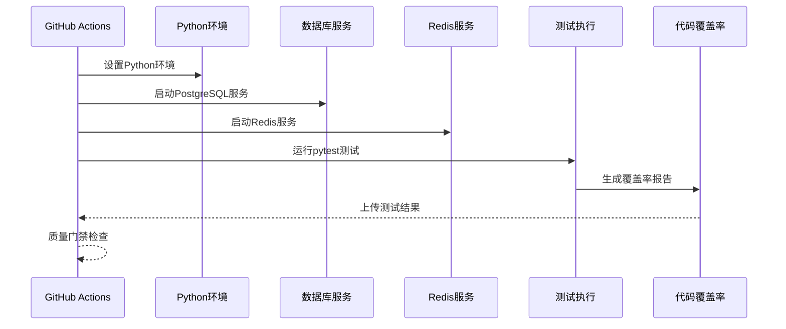

**图表来源**
- [altas-workflow/references/testing/ci-cd-integration.md:18-146](file://altas-workflow/references/testing/ci-cd-integration.md#L18-L146)

#### 质量门禁配置

| 指标 | 目标值 | 工具 | 重要性 |
|------|--------|------|--------|
| 测试覆盖率 | ≥80% | pytest-cov | ⭐⭐⭐⭐⭐ |
| 测试通过率 | 100% | pytest | ⭐⭐⭐⭐⭐ |
| Flaky Rate | <1% | pytest-rerunfailures | ⭐⭐⭐⭐ |
| 执行时间 | <5min | pytest --durations | ⭐⭐⭐ |
| 断言密度 | 2-4个/测试 | 自定义分析 | ⭐⭐⭐⭐ |
| Mock比例 | <30% | 自定义分析 | ⭐⭐⭐⭐ |

**章节来源**
- [altas-workflow/references/testing/ci-cd-integration.md:1-800](file://altas-workflow/references/testing/ci-cd-integration.md#L1-L800)
- [altas-workflow/references/testing/test-quality-metrics.md:18-46](file://altas-workflow/references/testing/test-quality-metrics.md#L18-L46)

## 依赖分析

### 测试工具链

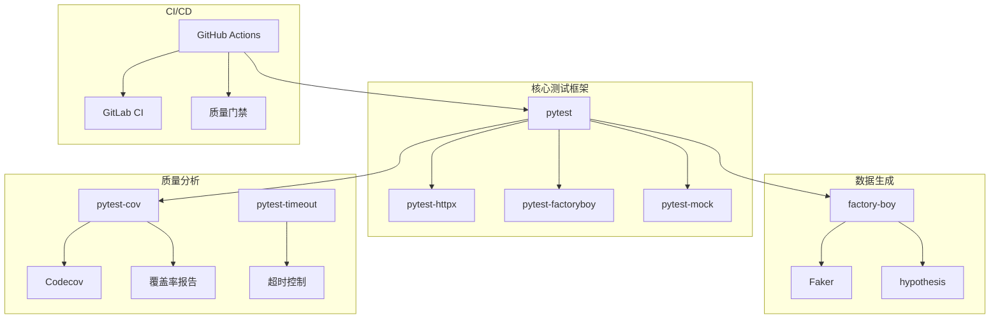

**图表来源**
- [altas-workflow/references/testing/pytest-patterns.md:542-560](file://altas-workflow/references/testing/pytest-patterns.md#L542-L560)

### 工作流依赖关系

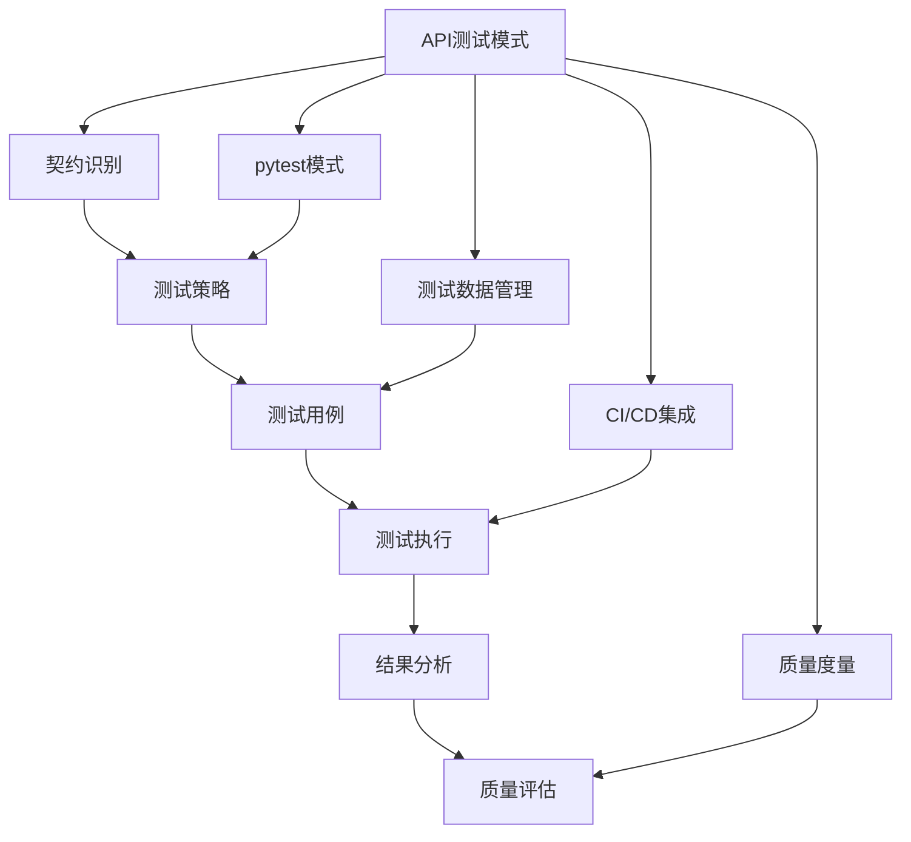

**图表来源**
- [altas-workflow/SKILL.md:484-497](file://altas-workflow/SKILL.md#L484-L497)

**章节来源**
- [altas-workflow/reference-index.md:1-308](file://altas-workflow/reference-index.md#L1-L308)

## 性能考虑

### 测试执行优化

1. **并行化执行**
   - 使用pytest-xdist进行多进程测试
   - 按测试时长智能分片
   - 并发安全的数据管理

2. **缓存策略**
   - pip依赖缓存
   - pytest测试缓存
   - 依赖安装缓存

3. **超时控制**
   - 单个测试超时设置
   - 整体套件超时控制
   - 动态超时调整

### 性能监控

- **执行时间基线**：建立测试执行时间历史记录
- **性能回归检测**：自动检测测试性能下降
- **资源使用监控**：数据库连接、内存使用等

## 故障排除指南

### 常见问题诊断

#### 测试不稳定问题

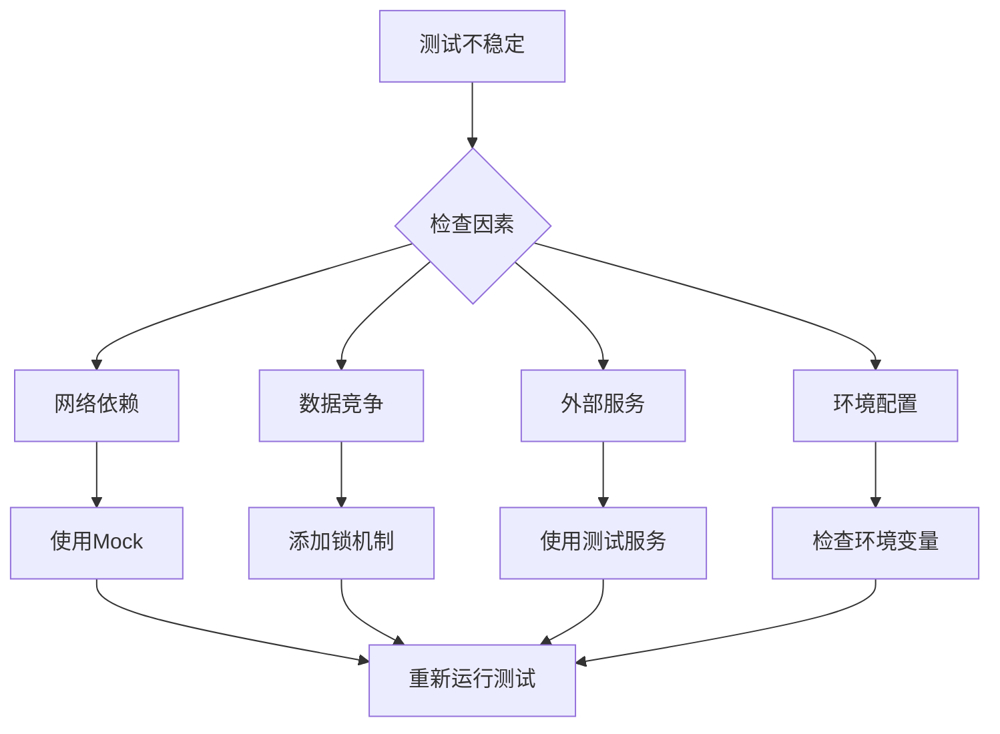

#### 覆盖率不足问题

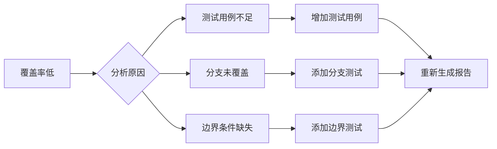

### 质量门禁检查

| 门禁类型 | 检查内容 | 处理方式 |
|----------|----------|----------|
| 覆盖率门禁 | 行覆盖率、分支覆盖率 | 修复代码或增加测试 |
| 通过率门禁 | 测试失败数量 | 修复测试或代码 |
| Flaky门禁 | 不稳定测试检测 | 修复测试稳定性 |
| 性能门禁 | 测试执行时间 | 优化测试或代码 |

**章节来源**
- [altas-workflow/references/testing/test-quality-metrics.md:49-496](file://altas-workflow/references/testing/test-quality-metrics.md#L49-L496)

## 结论

ALTAS工作流为API测试提供了完整的解决方案，通过契约驱动、数据管理和CI/CD集成的有机结合，实现了高质量的API测试实践。该框架的核心优势包括：

1. **标准化流程**：从契约识别到质量评估的完整测试生命周期
2. **智能适配**：根据不同复杂度选择合适的测试策略
3. **自动化程度高**：完善的CI/CD集成和质量门禁
4. **可扩展性强**：模块化设计支持各种测试场景

通过遵循ALTAS工作流的指导原则和最佳实践，企业可以建立高效、可靠的API测试体系，确保API质量和稳定性。