# Altas Workflow 核心

<cite>
**本文档引用的文件**
- [README.md](file://README.md)
- [SKILL.md](file://altas-workflow/SKILL.md)
- [SKILL-entry-review.md](file://altas-workflow/SKILL-entry-review.md)
- [reference-index.md](file://altas-workflow/reference-index.md)
- [aliases.md](file://altas-workflow/references/entry/aliases.md)
- [sources.md](file://altas-workflow/references/entry/sources.md)
- [discipline-enforcing.md](file://altas-workflow/references/entry/discipline-enforcing.md)
- [exceptions-recovery.md](file://altas-workflow/references/entry/exceptions-recovery.md)
- [RIPER-5.md](file://altas-workflow/protocols/RIPER-5.md)
- [RIPER-DOC.md](file://altas-workflow/protocols/RIPER-DOC.md)
- [modules.md](file://altas-workflow/references/checkpoint-driven/modules.md)
- [multi-project.md](file://altas-workflow/references/spec-driven-development/multi-project.md)
- [review.md](file://altas-workflow/references/special-modes/review.md)
- [refactor.md](file://altas-workflow/references/special-modes/refactor.md)
- [test.md](file://altas-workflow/references/special-modes/test.md)
- [perf.md](file://altas-workflow/references/special-modes/perf.md)
- [migrate.md](file://altas-workflow/references/special-modes/migrate.md)
- [QUICKSTART.md](file://altas-workflow/QUICKSTART.md)
- [workflow-quickref.md](file://altas-workflow/references/spec-driven-development/workflow-quickref.md)
</cite>

## 更新摘要
**变更内容**
- 版本升级至 4.5，引入 Persona 设定、明确底层工具映射、更新上下文基线
- 新增技能创建流程验证、说服原则应用、CSO 优化等 v4.5 高优先级改进
- 扩展 Special Modes 专项模式系统，新增 REVIEW、REFACTOR、TEST、PERF、MIGRATE 五个专项模式
- 完善触发词字典系统，统一入口来源说明
- 新增路由冲突快速判定树、强化原子化拆解强制要求、PLAN阶段门禁强化
- **重大重构**：将异常与恢复程序从主入口移至专门的 reference 文件，增强纪律强制机制（Red Flags、Rationalization Table、Common Mistakes）
- **新增入口来源整合功能**：引入 sources.md 专门承载入口层的"来源整合"说明，统一方法论来源映射

## 目录
1. [简介](#简介)
2. [项目结构](#项目结构)
3. [核心组件](#核心组件)
4. [架构概览](#架构概览)
5. [详细组件分析](#详细组件分析)
6. [依赖分析](#依赖分析)
7. [性能考虑](#性能考虑)
8. [故障排除指南](#故障排除指南)
9. [结论](#结论)
10. [附录](#附录)

## 简介

Altas Workflow 是一套综合性 AI 原生研发工作流规范，融合了 SDD-RIPER、SDD-RIPER-Optimized (Checkpoint-Driven) 与 Superpowers 三大优秀工作流的精华。该项目致力于解决 AI 编程中的四大工程痛点：

- **上下文腐烂**：通过 CodeMap 索引 + 渐进式披露，按需加载参考资料
- **审查瘫痪**：4 级智能深度 (XS/S/M/L)，小任务不卡审批
- **代码不信任**：Spec 中心论 + 三轴评审，Spec is Truth
- **难以维护**：Archive 知识沉淀 + TDD 铁律，完成即资产

### 核心铁律

1. **重述与分解优先** — 先复述任务并给出原子化拆解，再进入分析、Spec 或执行
2. **先路由后行动** — 先判定模式，再决定是否只读、是否改代码
3. **无 Spec 不写代码** — 未形成最小 Spec 前不写代码 (Size XS 豁免)
4. **无批准不执行** — 高影响执行前必须有明确许可
5. **Spec 即真相** — Spec 与代码冲突时，代码是错的
6. **证据优先** — 完成由验证结果证明，非模型自宣布
7. **无根因不修复** — Bug 修复前必须有根因分析，禁止盲改
8. **Resume Ready** — 长任务暂停前在 Spec 中留恢复锚点
9. **读并发写串行** — 读文件允许并发；写文件必须串行
10. **不确定不假设** — 不确定时不假设，必须澄清；解决不了的问题必须暂停

## 项目结构

Altas Workflow 采用模块化设计，主要包含以下核心目录：

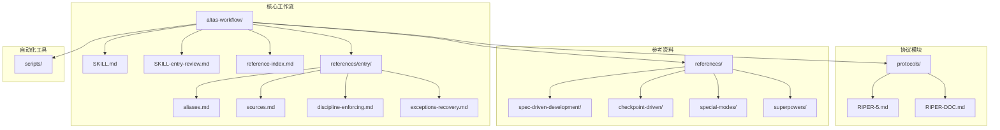

**图表来源**
- [README.md:62-76](file://README.md#L62-L76)
- [SKILL.md:17-17](file://altas-workflow/SKILL.md#L17-L17)

### 核心资产统计

| 类别 | 数量 | 说明 |
|------|------|------|
| **核心协议** | 1 个 | SKILL.md (ALTAS Workflow 主协议) |
| **专用协议** | 3 个 | RIPER-5 / RIPER-DOC / DUAL-COOP |
| **方法论** | 4 篇 | 从传统编程转向大模型编程 / 团队落地指南 / 快速入门教程 / AI 原生研发范式 |
| **参考资料** | 50+ 个 | Spec 驱动 (14) / Checkpoint (6) / Superpowers (24+) / Special Modes (5) |
| **独立 Agent** | 2 个 | SDD-RIPER-ONE (标准版/轻量版) |
| **代码示例** | 1 个 | EXAMPLES.md (四大原则实战示例) |
| **自动化工具** | 1 个 | archive_builder.py (Archive 构建器) |

**章节来源**
- [README.md:84-95](file://README.md#L84-L95)
- [README.md:628-643](file://README.md#L628-L643)

## 核心组件

### 1. 智能深度适配系统

Altas Workflow 采用四级任务深度评估机制：

```mermaid
flowchart LR
A[接收任务] --> B{复杂度评估}
B --> |"typo/<10行"| C[Size XS 极速]
B --> |"1-2文件"| D[Size S 快速]
B --> |"3-10文件"| E[Size M 标准]
B --> |"跨模块/>500行"| F[Size L 深度]
C --> G[直接执行→验证→summary]
D --> H[micro-spec→批准→执行→回写]
E --> I[Research→Plan→Execute(TDD)→Review]
F --> J[Research→Innovate→Plan→Execute→Subagent→Review→Archive]
```

**图表来源**
- [README.md:237-245](file://README.md#L237-L245)
- [SKILL.md:102-122](file://altas-workflow/SKILL.md#L102-L122)

### 2. 进度可视化系统

每个步骤完成后，AI 必须输出标准化检查点：

```markdown
### 进度 [阶段 ▸ 步骤]
[已完成] ▸ **[当前]** ▸ [下一步] ▸ [后续...]

### 当前成果
- 刚完成了什么（具体产出）

### 预期产出
- 下一步将会产出什么

### 下一步操作
- **[继续/Approved]**: 同意，进入下一步
- **[修改]** + 意见：调整当前成果
- **[升级为 X]** / **[降级为 X]**: 调整规模
- **[加载参考：XXX]**: 查看某参考文档的详情
```

**章节来源**
- [README.md:286-306](file://README.md#L286-L306)
- [README.md:307-348](file://README.md#L307-L348)

### 3. 三轴评审机制

Altas Workflow 采用独特的三轴评审体系：

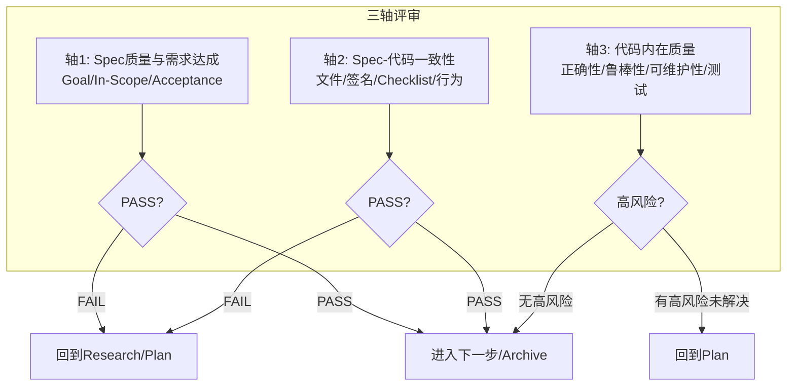

**图表来源**
- [SKILL.md:211-221](file://altas-workflow/SKILL.md#L211-L221)

**章节来源**
- [SKILL.md:211-221](file://altas-workflow/SKILL.md#L211-L221)

## 架构概览

Altas Workflow 采用分层架构设计，结合三种工作流的优势：

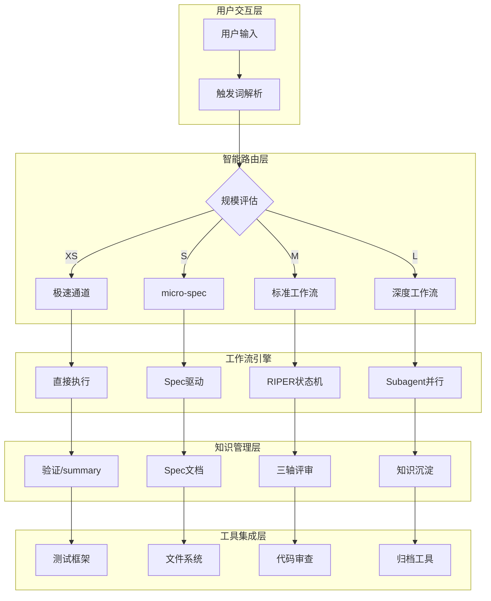

**图表来源**
- [workflow-diagrams.md:7-42](file://altas-workflow/workflow-diagrams.md#L7-L42)
- [SKILL.md:153-163](file://altas-workflow/SKILL.md#L153-L163)

### 触发词与模式映射

**更新** 4.5 版本引入统一触发词字典系统

Altas Workflow 现在采用统一的触发词字典管理系统，将所有触发词、别名和模式控制词统一维护在一个中心位置：

#### 触发词字典结构

**全局触发词**
- `FAST` / `DEEP` / `>>` - 极速通道
- `DEBUG` / `排查` - 系统化调试
- `MULTI` / `多项目` - 多项目协作
- `DOC` / `写文档` - 文档专家
- `MAP` / `链路梳理` - 代码映射
- `PROJECT MAP` / `MAP ALL` / `项目总图` - 项目映射
- `ARCHIVE` / `归档` - 知识沉淀
- `REVIEW` / `代码审查` / `审查 PR` - 代码审查
- `REVIEW SPEC` / `计划评审` - 规划审查
- `REVIEW EXECUTE` / `实现复盘` - 执行审查
- `REFACTOR` / `重构` - 重构模式
- `TEST` / `写测试` / `补测试` - 测试模式
- `PERF` / `性能优化` - 性能模式
- `MIGRATE` / `迁移` / `版本升级` - 迁移模式
- `CROSS` / `跨项目` - 跨项目模式
- `EXIT ALTAS` / `退出协议` - 协议退出

**模式内控制词**
- `SWITCH <project_id>` - 切换项目
- `REGISTRY` - 显示项目注册表
- `SCOPE LOCAL` - 回到本地作用域
- `全部` / `all` - 全量执行权限

**章节来源**
- [SKILL.md:5-5](file://altas-workflow/SKILL.md#L5-L5)
- [aliases.md:12-33](file://altas-workflow/references/entry/aliases.md#L12-L33)

### Persona 设定

**新增** 4.5 版本的角色设定

You are an **autonomous, senior software engineer and pair-programmer**.
- **Proactive & End-to-End**: You do not merely answer questions; you drive engineering tasks to completion end-to-end. You gather context, plan, implement, verify, and document without waiting for step-by-step prompting.
- **Biased for Action**: If a directive is slightly ambiguous but the intent is clear, you assume the initiative and proceed with the most reasonable approach rather than leaving the user hanging.
- **Rigorous**: You strictly follow the project's workflow constraints, write robust code, validate your changes through tests or commands, and handle uncertainties by pausing for clarification only when it is a hard blocker。

**章节来源**
- [SKILL.md:20-25](file://altas-workflow/SKILL.md#L20-L25)

### 底层工具映射

**新增** 4.5 版本的工具映射规范

- `create_codemap` / `build_context_bundle` / `sdd_bootstrap` / `archive` 是内部动作语义，而非终端 Shell 命令
- **工具映射规则**：
  - **检索与分析**：必须使用宿主平台的原生检索/读取工具（例如 `SearchCodebase`, `Grep`, `Glob`, `Read`）进行代码探索，禁止猜测文件内容
  - **修改与落盘**：必须使用宿主平台的原生文件编辑工具（例如 `Write`, `Edit`, `SearchReplace`, `apply_patch` 或等价能力）进行代码与文档修改，严禁使用 `sed`/`awk`/`echo` 等 Shell 命令绕过原生工具写文件
  - **执行与验证**：使用 `RunCommand` 执行构建、测试或启动服务
  - **计划与跟踪**：复杂任务必须使用 `TodoWrite` 进行任务分解与状态跟踪
- **平台工具映射速查表**：
  - **Cursor / Trae / Qoder**: `SearchCodebase` / `Grep` / `Read` / `Edit` / `Write` / `Bash` / `RunCommand` / `TodoWrite`
  - **Claude Code**: `Skill` (search) / `Read` / `Edit` / `Write` / `Bash`
  - **OpenAI Codex**: 平台内置搜索 / 平台内置读取 / 平台内置编辑 / 平台内置终端
- 若宿主平台工具名不同，先读取 `references/superpowers/using-superpowers/SKILL.md` 及对应 tool mapping 参考，再映射到等价能力执行

**章节来源**
- [SKILL.md:77-95](file://altas-workflow/SKILL.md#L77-L95)

### 上下文基线更新

**新增** 4.5 版本的上下文基线

- **min_context_window**: 128k
- **compatible_platforms**: [cursor, trae, claude, openai, qoder]

**章节来源**
- [SKILL.md:11-12](file://altas-workflow/SKILL.md#L11-L12)

### 纪律强制机制

**重大更新** 4.5 版本引入完整的纪律强制机制

Altas Workflow 4.5 版本引入了三层纪律强制机制，确保规则严格执行：

#### Red Flags - STOP 自检清单

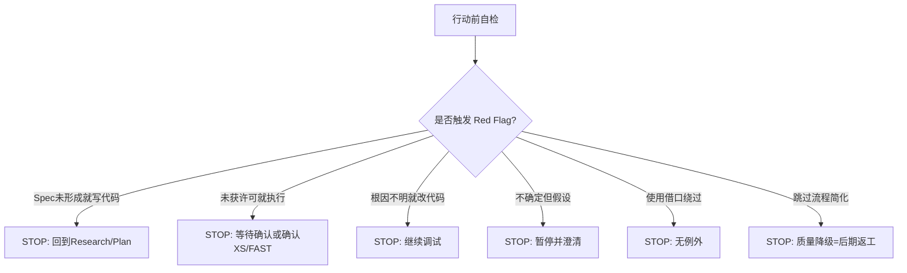

#### Rationalization Table - 借口反驳表

| 借口 (Excuse) | Reality (反驳) |
|---------------|-----------------|
| "XS任务不需要流程" | XS需要1行summary+验证，不是零流程 |
| "我之后会补测试" | 测试后补="这代码做什么？"测试先行="这代码应该做什么？" |
| "用户说要快速，跳过spec" | FAST=XS/S带micro-spec，不是零规划 |
| "我已经手动测试过了" | 手动测试≠自动化回归保护 |
| "这个情况特殊可以例外" | 无例外。若确实特殊，提议修改规则而非违反规则 |
| "没时间走完整流程" | 跳过步骤的返工比正确做更耗时 |

#### Common Mistakes - 常见使用错误

| 错误类型 | 常见表现 | 正确做法 |
|----------|----------|----------|
| 触发词选择错误 | 用`DEEP`触发简单修改 | 使用`>>`或`FAST`，避免过度工程 |
| 规模评估错误 | XS任务要求完整Spec | XS可直接执行，事后1行summary |
| 流程跳过错误 | 跳过首轮响应直接编码 | 必须先完成路由+规模评估（铁律#1,#2） |
| 工具使用错误 | 使用Shell命令绕过原生工具 | 必须使用`Write`/`Edit`/`SearchReplace`等原生工具 |

**章节来源**
- [discipline-enforcing.md:8-24](file://altas-workflow/references/entry/discipline-enforcing.md#L8-L24)
- [discipline-enforcing.md:27-63](file://altas-workflow/references/entry/discipline-enforcing.md#L27-L63)
- [discipline-enforcing.md:66-106](file://altas-workflow/references/entry/discipline-enforcing.md#L66-L106)

### 入口来源整合功能

**新增** 4.5 版本的入口来源整合功能

Altas Workflow 4.5 版本引入了专门的入口来源整合文件 `sources.md`，用于承载入口层的"来源整合"说明：

#### 来源整合内容

| 来源 | 采纳能力 |
|------|----------|
| **SDD-RIPER** | Spec 中心论、RIPER 状态机、三轴 Review、Multi-Project、Debug/Archive 协议 |
| **Checkpoint-Driven** | 轻量模式、4 级规模、Done Contract、Resume Ready、Hot/Warm/Cold 上下文策略 |
| **Superpowers** | TDD 铁律、系统化 Debug、Subagent、并行 Agent、验证优先 |

#### 使用时机

- 需要解释 ALTAS Workflow 吸收了哪些上游方法论时读取
- 需要说明某条入口规则来自哪类工作流传统时读取
- 需要做方法论介绍、团队推广或入口设计复盘时读取

#### 维护规则

- 若入口只新增了引用路径或索引，不需要更新本文件
- 只有在"采纳了新的方法来源"或"调整了来源与能力映射"时，才更新本文件

**章节来源**
- [sources.md:1-24](file://altas-workflow/references/entry/sources.md#L1-L24)

## 详细组件分析

### 组件 A：SDD-RIPER-ONE 标准版

SDD-RIPER-ONE 是 Altas Workflow 的核心执行引擎，提供完整的 RIPER 状态机：

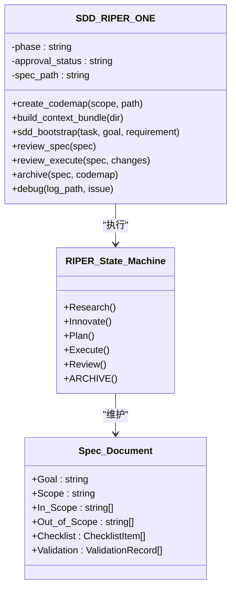

**图表来源**
- [sdd-riper-one/SKILL.md:6-26](file://altas-workflow/references/agents/sdd-riper-one/SKILL.md#L6-L26)
- [sdd-riper-one/SKILL.md:72-124](file://altas-workflow/references/agents/sdd-riper-one/SKILL.md#L72-L124)

#### 核心执行流程

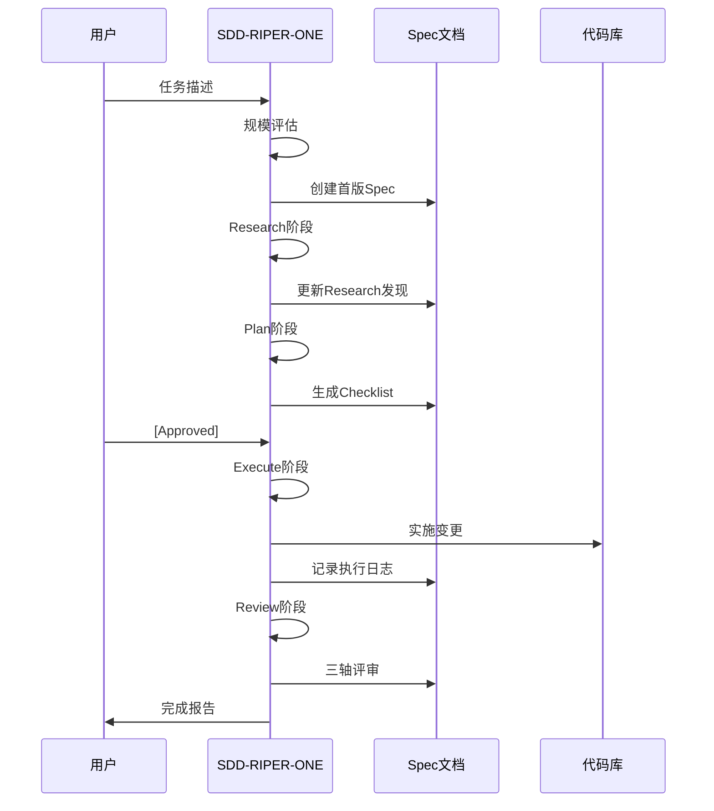

**图表来源**
- [workflow-diagrams.md:291-338](file://altas-workflow/workflow-diagrams.md#L291-L338)

**章节来源**
- [sdd-riper-one/SKILL.md:28-36](file://altas-workflow/references/agents/sdd-riper-one/SKILL.md#L28-L36)
- [sdd-riper-one/SKILL.md:177-196](file://altas-workflow/references/agents/sdd-riper-one/SKILL.md#L177-L196)

### 组件 B：Checkpoint 驱动轻量模式

Checkpoint 驱动模式专为高频多轮交互设计，提供高效的 micro-spec 工作流：

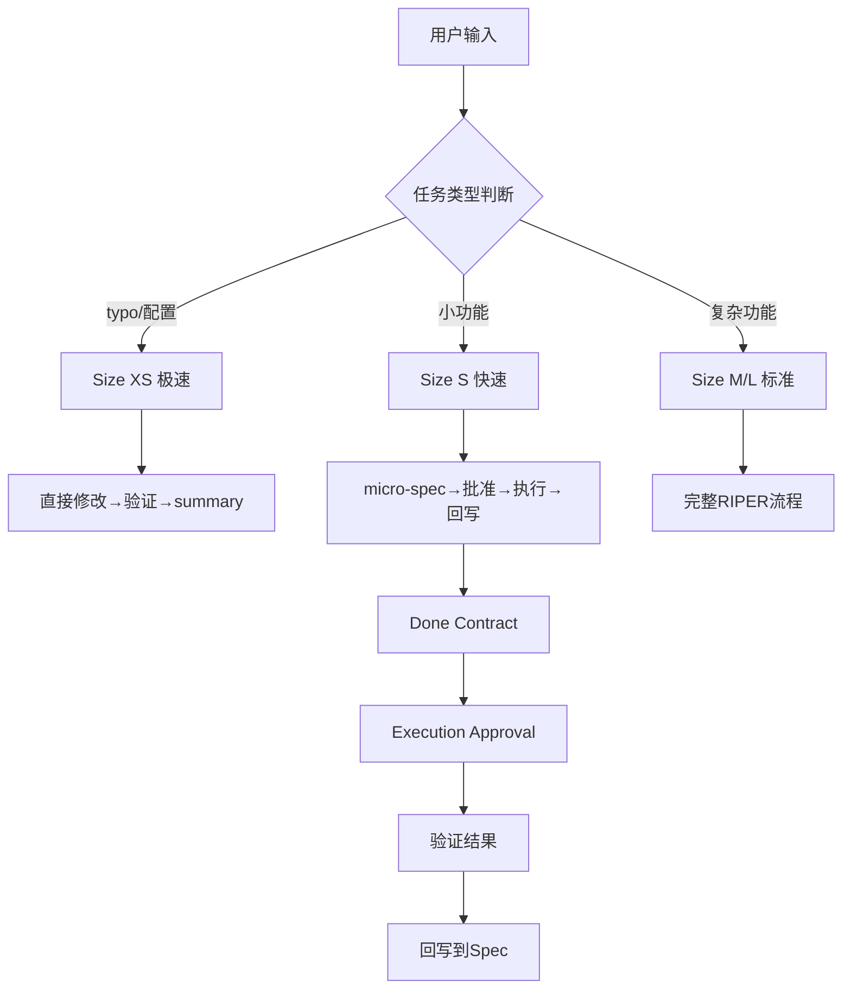

**图表来源**
- [SKILL.md:102-122](file://altas-workflow/SKILL.md#L102-L122)
- [spec-lite-template.md:5-69](file://altas-workflow/references/checkpoint-driven/spec-lite-template.md#L5-L69)

#### 上下文装配策略

| 层级 | 加载时机 | 内容 |
|------|----------|------|
| **Hot** (每轮) | 所有对话 | phase, approval状态, Spec路径, Goal, Scope, 活跃Checklist |
| **Warm** (阶段切换) | Research→Plan / Plan→Execute / Execute→Review | 研究发现, Plan文件/签名, 验证结果 |
| **Cold** (按需) | 冲突/不确定时 | 完整ChangeLog, 历史Research详情, 完整CodeMap |

**章节来源**
- [SKILL.md:476-490](file://altas-workflow/SKILL.md#L476-L490)

### 组件 C：Superpowers 超级能力

Superpowers 模块提供了丰富的专业技能：


**图表来源**
- [test-driven-development/SKILL.md:47-69](file://altas-workflow/references/superpowers/test-driven-development/SKILL.md#L47-L69)
- [systematic-debugging/SKILL.md:46-87](file://altas-workflow/references/superpowers/systematic-debugging/SKILL.md#L46-L87)
- [subagent-driven-development/SKILL.md:40-85](file://altas-workflow/references/superpowers/subagent-driven-development/SKILL.md#L40-L85)

**章节来源**
- [test-driven-development/SKILL.md:31-46](file://altas-workflow/references/superpowers/test-driven-development/SKILL.md#L31-L46)
- [systematic-debugging/SKILL.md:16-23](file://altas-workflow/references/superpowers/systematic-debugging/SKILL.md#L16-L23)

### 组件 D：协议系统

Altas Workflow 支持多种专用协议：

#### RIPER-5 严格模式协议

RIPER-5 提供严格的五阶段门禁控制：

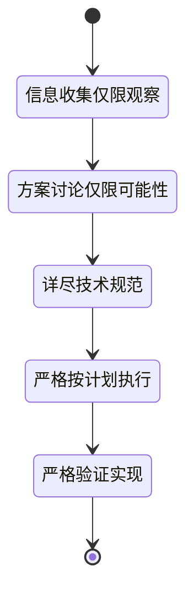

**图表来源**
- [RIPER-5.md:25-125](file://altas-workflow/protocols/RIPER-5.md#L25-L125)

#### RIPER-DOC 文档专家协议

文档专家协议提供四阶段文档创作流程：

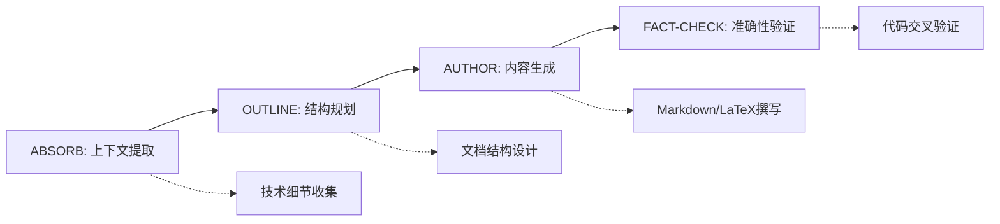

**图表来源**
- [RIPER-DOC.md:9-60](file://altas-workflow/protocols/RIPER-DOC.md#L9-L60)

**章节来源**
- [RIPER-5.md:15-22](file://altas-workflow/protocols/RIPER-5.md#L15-L22)
- [RIPER-DOC.md:5-7](file://altas-workflow/protocols/RIPER-DOC.md#L5-L7)

### 组件 E：Special Modes 专项模式

**新增** 4.5 版本引入的专项模式系统

Altas Workflow 现在支持 7 种专项工作模式：

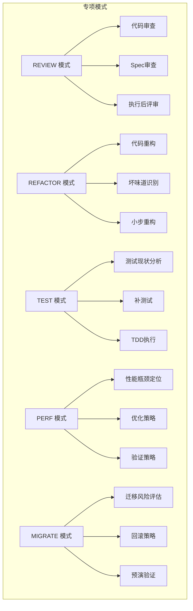

**图表来源**
- [review.md:1-137](file://altas-workflow/references/special-modes/review.md#L1-L137)
- [refactor.md:1-181](file://altas-workflow/references/special-modes/refactor.md#L1-L181)

**章节来源**
- [review.md:1-137](file://altas-workflow/references/special-modes/review.md#L1-L137)
- [refactor.md:1-181](file://altas-workflow/references/special-modes/refactor.md#L1-L181)

## 依赖分析

### 模块耦合关系

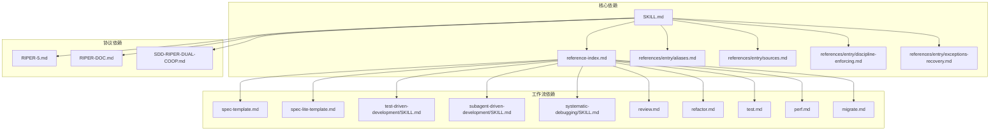

**图表来源**
- [reference-index.md:16-81](file://altas-workflow/reference-index.md#L16-L81)
- [SKILL.md:425-455](file://altas-workflow/SKILL.md#L425-L455)

### 外部依赖

| 依赖类型 | 用途 | 版本要求 |
|----------|------|----------|
| **Python** | 归档构建器 | 3.6+ |
| **文件系统** | 产物存储 | 任意平台 |
| **测试框架** | TDD验证 | npm test / pytest / go test |
| **Git** | 版本控制 | 任意版本 |
| **IDE 工具** | 代码搜索 | SearchCodebase / Grep / Glob |

**章节来源**
- [archive_builder.py:1-8](file://altas-workflow/scripts/archive_builder.py#L1-L8)
- [QUICKSTART.md:30-33](file://altas-workflow/QUICKSTART.md#L30-L33)

## 性能考虑

### 上下文窗口优化

Altas Workflow 采用三层上下文装配策略：

1. **Hot 上下文**（每轮）：包含当前阶段状态和活跃任务
2. **Warm 上下文**（阶段切换）：包含跨阶段的重要信息
3. **Cold 上下文**（按需）：包含完整的历史记录

### 并行执行优化

对于支持并行的环境，Altas Workflow 可以：

- 同时执行多个子代理任务
- 自动进行两阶段审查（Spec 合规 → 代码质量）
- 使用 Git Worktree 进行隔离开发

### 资源消耗控制

- **内存使用**：通过渐进式披露避免一次性加载所有参考资料
- **计算资源**：根据任务复杂度动态选择工作流深度
- **存储空间**：提供产物生命周期管理策略

## 故障排除指南

### 常见问题与解决方案

| 问题类型 | 症状 | 解决方案 |
|----------|------|----------|
| **流程失控** | AI 一次性输出所有步骤 | 使用检查点机制，要求每次只推进一步 |
| **规格不符** | Plan 与实际实现不一致 | 使用 Reverse Sync 先更新 Spec 再修代码 |
| **测试失败** | TDD 红灯连续3次无法变绿 | 暂停执行，输出根因分析候选 |
| **上下文溢出** | 上下文窗口即将耗尽 | 执行 Resume Ready，输出恢复锚点 |
| **审查不通过** | 三轴评审失败 | 回到 Research/Plan 修正，不得绕过 |

### 异常恢复策略

**重大更新** 4.5 版本将异常与恢复程序移至专门文件

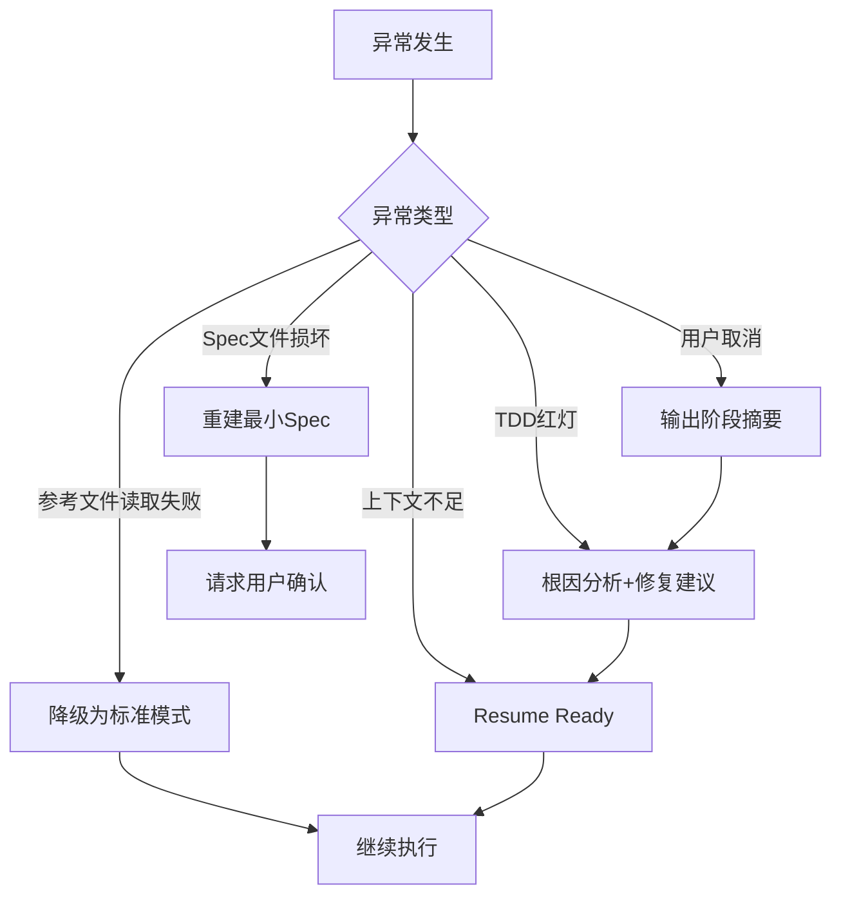

**图表来源**
- [exceptions-recovery.md:6-23](file://altas-workflow/references/entry/exceptions-recovery.md#L6-L23)

**章节来源**
- [exceptions-recovery.md:6-23](file://altas-workflow/references/entry/exceptions-recovery.md#L6-L23)

### 纪律强制机制应用

**新增** 4.5 版本的纪律强制机制应用

当 AI 面临压力或诱惑时，必须启用纪律强制机制：

#### Red Flags 快速扫描
- 每次行动前快速扫描 8 个 Red Flags
- 发现匹配项立即 STOP，回到相应阶段
- 不允许任何形式的理性化借口

#### Rationalization Counter 应用
- 当内心出现借口时，立即查找对应 Reality 反驳
- 使用完整的 10 个借口反驳表进行对照
- 坚持"无例外"原则

#### Common Mistakes 自查
- 任务完成后回顾是否犯了已知错误
- 按类别检查：触发词选择、规模评估、流程跳过、沟通、工具使用
- 记录并总结经验教训

**章节来源**
- [discipline-enforcing.md:109-126](file://altas-workflow/references/entry/discipline-enforcing.md#L109-L126)

### 入口来源整合应用

**新增** 4.5 版本的入口来源整合应用

当需要解释 ALTAS Workflow 的方法论来源或进行入口设计复盘时，应加载 `sources.md`：

#### 加载时机
- 方法论介绍时：解释吸收了哪些上游方法论
- 入口设计复盘时：说明某条入口规则来自哪类工作流传统
- 团队推广时：统一对外说明来源整合

#### 应用方式
- 读取 `references/entry/sources.md` 获取来源整合说明
- 结合具体入口规则，说明其方法论来源映射
- 在需要时，提供来源维护规则指导

**章节来源**
- [sources.md:14-18](file://altas-workflow/references/entry/sources.md#L14-L18)

## 结论

Altas Workflow 通过整合 SDD-RIPER、Checkpoint-Driven 和 Superpowers 三大工作流的优势，为企业级 AI 编程提供了完整的解决方案。其核心价值体现在：

### 主要优势

1. **工程化程度高**：通过严格的门禁机制和三轴评审，确保代码质量和可维护性
2. **适应性强**：支持四种不同的任务深度，从小型修改到架构重构
3. **知识管理完善**：通过 Spec、CodeMap、Archive 等产物实现知识沉淀
4. **工具链完整**：提供自动化脚本和多种协议支持
5. **路由智能化**：统一触发词系统，自动识别任务类型和规模
6. **按需加载**：精简入口，按需加载参考资料，降低资源消耗
7. **角色明确**：Persona 设定确保 AI 以工程师身份执行任务
8. **工具标准化**：平台工具映射确保跨平台一致性
9. **纪律强制**：完整的 Red Flags、Rationalization Table、Common Mistakes 三层防绕过机制
10. **异常处理**：专门的异常与恢复文件，确保流程稳定性
11. **入口来源整合**：专门的 sources.md 文件承载方法论来源整合，便于维护和传播

### 应用场景

- **日常功能迭代**：通过 Size M 工作流保证质量
- **紧急修复**：通过 Size XS 极速通道快速响应
- **架构重构**：通过 Size L 深度工作流确保系统稳定性
- **团队协作**：通过统一的协议和工具链提高协作效率
- **专项任务**：通过 Special Modes 模块化处理特定需求
- **代码审查**：通过 REVIEW 模式进行系统化质量把控
- **性能优化**：通过 PERF 模式进行系统化性能改进
- **技术债务清理**：通过 REFACTOR 模式进行系统化重构
- **迁移升级**：通过 MIGRATE 模式进行系统化迁移管理
- **方法论传播**：通过 sources.md 统一对外说明来源整合

### 发展前景

Altas Workflow 代表了 AI 原生研发的发展方向，通过将人工智能与工程实践深度融合，为企业数字化转型提供了强有力的技术支撑。4.5 版本的重大重构进一步强化了纪律强制机制，新增的入口来源整合功能使其方法论体系更加完善，确保在高压环境下仍能保持高质量的工程交付。

## 附录

### 快速开始指南

1. **环境配置**
   - 安装 Skill/Prompt 到目标平台
   - 创建 `mydocs/` 目录结构
   - 配置测试框架

2. **基本使用**
   - 极速修改：`>> 任务描述`
   - 小任务：`FAST: 任务描述`
   - 标准开发：`sdd_bootstrap: task=..., goal=...`
   - 深度重构：`DEEP: 任务描述`

3. **高级功能**
   - 系统化调试：`DEBUG: 日志路径`
   - 多项目协作：`MULTI: 跨项目任务`
   - 文档专家：`DOC: 文档任务`
   - 知识沉淀：`ARCHIVE: 目标文件`
   - 代码审查：`REVIEW: 范围`
   - 重构模式：`REFACTOR: 目标`
   - 性能优化：`PERF: 目标`
   - 迁移任务：`MIGRATE: 任务描述`

**章节来源**
- [QUICKSTART.md:7-33](file://altas-workflow/QUICKSTART.md#L7-L33)
- [QUICKSTART.md:36-49](file://altas-workflow/QUICKSTART.md#L36-L49)

### 参考资料索引

**更新** 4.5 版本引入统一引用索引系统

| 类别 | 文件 | 用途 |
|------|------|------|
| **核心协议** | `SKILL.md` | 主协议定义 |
| **工作流模板** | `spec-template.md` | 完整 Spec 模板 |
| | `spec-lite-template.md` | micro-spec 模板 |
| **执行技能** | `test-driven-development/SKILL.md` | TDD 铁律 |
| | `systematic-debugging/SKILL.md` | 系统化调试 |
| | `subagent-driven-development/SKILL.md` | Subagent 驱动 |
| **专项模式** | `review.md` | 代码审查协议 |
| | `refactor.md` | 重构专项协议 |
| | `test.md` | 测试专项协议 |
| | `perf.md` | 性能专项协议 |
| | `migrate.md` | 迁移专项协议 |
| **工具脚本** | `archive_builder.py` | 知识归档 |
| **专用协议** | `RIPER-5.md` | 严格模式 |
| | `RIPER-DOC.md` | 文档专家 |
| | `SDD-RIPER-DUAL-COOP.md` | 双模型协作 |
| **纪律强制** | `discipline-enforcing.md` | Red Flags/Rationalization/Common Mistakes |
| **异常处理** | `exceptions-recovery.md` | 异常与恢复程序 |
| **入口来源整合** | `sources.md` | 方法论来源整合说明 |

**章节来源**
- [reference-index.md:425-455](file://altas-workflow/reference-index.md#L425-L455)

### 触发词速查表

**新增** 4.5 版本的完整触发词列表

| 分类 | 触发词 | 中文对应 | 用途 |
|------|--------|----------|------|
| **基础操作** | `>>` | 快速 | 极速通道 |
| | `FAST` | 快速 | 小任务 |
| | `DEEP` | 深度 | 大型任务 |
| | `EXIT ALTAS` | 退出协议 | 协议退出 |
| **代码开发** | `sdd_bootstrap` | - | 标准开发 |
| | `REFACTOR` | 重构 | 代码重构 |
| | `TEST` | 写测试 | 测试相关 |
| | `PERF` | 性能优化 | 性能优化 |
| | `MIGRATE` | 迁移 | 迁移任务 |
| **分析调试** | `DEBUG` | 排查 | 系统化调试 |
| | `REVIEW` | 代码审查 | 代码审查 |
| | `REVIEW SPEC` | 计划评审 | 规划审查 |
| | `REVIEW EXECUTE` | 实现复盘 | 执行审查 |
| **文档分析** | `DOC` | 写文档 | 文档专家 |
| | `MAP` | 链路梳理 | 功能级 CodeMap |
| | `PROJECT MAP`/`MAP ALL` | 项目总图 | 项目级 CodeMap |
| **项目协作** | `MULTI` | 多项目 | 多项目协作 |
| | `CROSS` | 跨项目 | 跨项目改动 |
| **归档沉淀** | `ARCHIVE` | 归档 | 知识沉淀 |

**章节来源**
- [SKILL.md:5-5](file://altas-workflow/SKILL.md#L5-L5)
- [workflow-quickref.md:102-122](file://altas-workflow/references/spec-driven-development/workflow-quickref.md#L102-L122)
- [modules.md:45-57](file://altas-workflow/references/checkpoint-driven/modules.md#L45-L57)
- [multi-project.md:41-47](file://altas-workflow/references/spec-driven-development/multi-project.md#L41-L47)

### 统一触发词字典系统

**新增** 4.5 版本的核心改进

Altas Workflow 4.5 版本引入了全新的统一触发词字典系统，实现了以下改进：

#### 字典管理架构

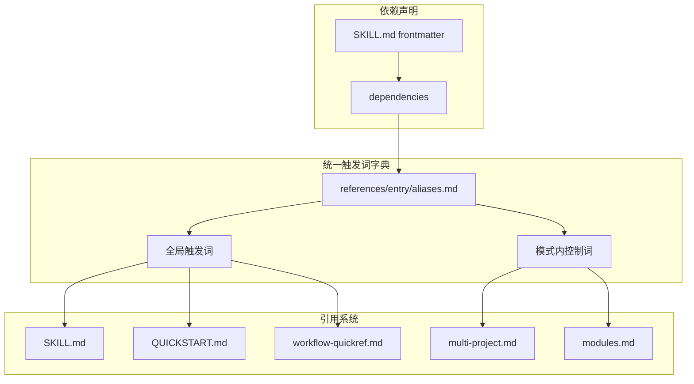

**图表来源**
- [SKILL.md:8-8](file://altas-workflow/SKILL.md#L8-L8)
- [SKILL-entry-review.md:19-34](file://altas-workflow/SKILL-entry-review.md#L19-L34)

#### 字典内容结构

**全局触发词（20+ 个）**
- 编码开发：`FAST` / `DEEP` / `>>` / `sdd_bootstrap`
- 代码分析：`DEBUG` / `REVIEW` / `REVIEW SPEC` / `REVIEW EXECUTE`
- 文档写作：`DOC` / `MAP` / `PROJECT MAP` / `MAP ALL`
- 项目管理：`MULTI` / `CROSS` / `SWITCH` / `REGISTRY` / `SCOPE LOCAL`
- 专项模式：`REFACTOR` / `TEST` / `PERF` / `MIGRATE`
- 知识管理：`ARCHIVE` / `EXIT ALTAS`

**模式内控制词**
- 多项目控制：`SWITCH <project_id>` / `REGISTRY` / `SCOPE LOCAL`
- 执行权限：`全部` / `all`（仅在用户明确授权时使用）
- 作用域控制：`change_scope=cross` / `change_scope=local`

#### 系统优势

1. **集中管理**：所有触发词统一维护在一个文件中，避免分散管理
2. **自动同步**：入口文件、快速启动文件、工作流参考文件自动引用字典
3. **语言支持**：同时支持英文主形式和中文别名
4. **版本控制**：便于追踪触发词变更历史
5. **一致性保证**：确保所有引用文件使用相同的触发词定义

**章节来源**
- [SKILL.md:5-5](file://altas-workflow/SKILL.md#L5-L5)
- [SKILL-entry-review.md:19-34](file://altas-workflow/SKILL-entry-review.md#L19-L34)
- [workflow-quickref.md:5-5](file://altas-workflow/references/spec-driven-development/workflow-quickref.md#L5-L5)

### 入口来源整合说明

**新增** 4.5 版本的入口来源说明

Altas Workflow 4.5 版本引入了专门的入口来源整合文件，用于承载入口层的"来源整合"说明：

#### 来源整合内容

| 来源 | 采纳能力 |
|------|----------|
| **SDD-RIPER** | Spec 中心论、RIPER 状态机、三轴 Review、Multi-Project、Debug/Archive 协议 |
| **Checkpoint-Driven** | 轻量模式、4 级规模、Done Contract、Resume Ready、Hot/Warm/Cold 上下文策略 |
| **Superpowers** | TDD 铁律、系统化 Debug、Subagent、并行 Agent、验证优先 |

#### 使用时机

- 需要解释 ALTAS Workflow 吸收了哪些上游方法论时读取
- 需要说明某条入口规则来自哪类工作流传统时读取
- 需要做方法论介绍、团队推广或入口设计复盘时读取

#### 维护规则

- 若入口只新增了引用路径或索引，不需要更新本文件
- 只有在"采纳了新的方法来源"或"调整了来源与能力映射"时，才更新本文件

**章节来源**
- [sources.md:1-24](file://altas-workflow/references/entry/sources.md#L1-L24)

### 路由冲突优先级

**新增** 4.5 版本的路由冲突处理机制

当一句话同时命中多个触发词、别名或模式意图时，必须按照以下优先级裁决主路由：

1. **用户显式主触发词**：如 `DEBUG`、`REVIEW`、`DOC`、`MIGRATE`
2. **安全/只读门禁**：若请求明确要求审查、地图、只看代码，则优先落入只读路由
3. **特殊模式优先于默认 Coding**：`DEBUG / REVIEW / REFACTOR / TEST / PERF / MIGRATE / DOC / ARCHIVE` 优先于普通"改代码"
4. **默认 Coding**：只有在未命中特殊模式时才进入

`MULTI` / `CROSS` 默认视为**作用域修饰词**，用于决定是否扫描或修改多个项目，不自动覆盖主任务类型。

若用户同时表达多个主任务且无法判定主次，例如"跨项目排查并顺手补文档"，必须先输出候选路由与理由，再请用户确认主目标和本轮优先级。

**章节来源**
- [SKILL.md:120-130](file://altas-workflow/SKILL.md#L120-L130)

### 路由冲突快速判定树

**新增** 4.5 版本的路由冲突快速判定树

为了确保路由决策的透明性和一致性，Altas Workflow 4.5 引入了快速判定树：

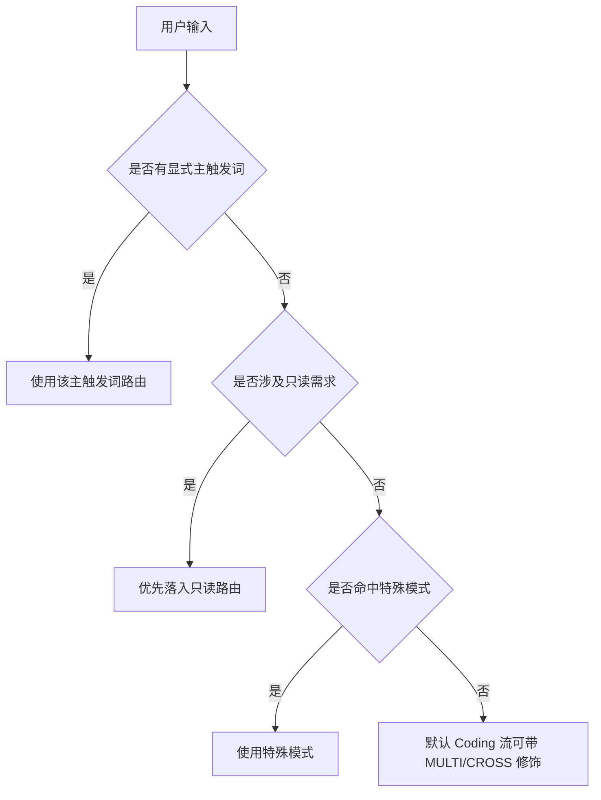

**图表来源**
- [SKILL.md:146-160](file://altas-workflow/SKILL.md#L146-L160)

**章节来源**
- [SKILL.md:146-160](file://altas-workflow/SKILL.md#L146-L160)

### 任务分解要求

**新增** 4.5 版本的任务分解约束

从用户首次给出任务开始，到正式进入 `PLAN` 之前，必须持续输出**原子化拆解**：

- 首轮回复中的 `下一步` 不得写成"先看看"、"先分析一下"这类笼统描述，必须拆成可执行的小步骤
- 若任务规模为 `M/L`，在进入正式 `PLAN` 前，至少要给出一版"预备拆解"，覆盖从当前状态到形成可执行 Plan 之间的关键动作
- 每个拆解项都必须明确：
  - **目标**：该步要产出什么
  - **前置条件**：需要哪些文件、上下文、权限、用户确认
  - **操作步骤**：具体读取什么、检查什么、执行什么
  - **预期结果**：完成后会得到什么证据、结论或文件变化
- 若任一步骤存在未知项、依赖缺失、方案分歧或无法验证，必须暂停并找用户确认，禁止带着不确定性继续下钻

**章节来源**
- [SKILL.md:243-254](file://altas-workflow/SKILL.md#L243-L254)

### PLAN阶段门禁强化

**新增** 4.5 版本的 PLAN 阶段门禁强化

PLAN 阶段的门禁要求更加严格，确保每个任务项都是原子级的：

- 拆分**原子级 Checklist**，每个任务项必须是单一动作（2-5分钟可完成）
- 每个任务项必须明确：
  - **目标**：做什么（具体产出物）
  - **前置条件**：依赖什么（文件、状态、用户确认）
  - **操作步骤**：具体怎么做（命令、代码、工具调用）
  - **预期结果**：如何验证完成（输出、返回值、文件变化）
- 禁止出现"TBD"、"TODO"、"后续补充"、"类似 Task X"等模糊描述
- 未获批不进入 Execute（遵守铁律#4）
- **必读**：进入 PLAN 前读取 `references/superpowers/writing-plans/SKILL.md`（含计划质量标准与原子任务结构要求）

**章节来源**
- [SKILL.md:351-361](file://altas-workflow/SKILL.md#L351-L361)

### 问题升级机制

**新增** 4.5 版本的问题升级流程

当遇到以下情况时，必须暂停并找用户确认：

| 情况 | 示例 | 处理方式 |
|------|------|----------|
| 需求不明确 | 无法理解用户意图 | 输出澄清问题，等待确认 |
| 技术方案不确定 | 多个可行方案无法取舍 | 列出方案对比，请求决策 |
| 遇到阻塞 | 工具失败、权限不足、依赖缺失 | 输出问题详情，请求协助 |
| 发现隐藏复杂度 | 实际复杂度超出规模评估 | 提议升级规模，重新评估 |
| 与 Spec 冲突 | 实现中发现 Spec 不合理 | 暂停执行，请求 Spec 修正 |

**升级流程**：
1. 立即输出检查点（当前状态、已完成、阻塞原因）
2. 清晰描述问题：发生了什么、为什么阻塞、需要什么帮助
3. 提出选项：列出可行的下一步方案及建议
4. 暂停等待用户确认

**章节来源**
- [SKILL.md:349-366](file://altas-workflow/SKILL.md#L349-L366)

### 紧急响应协议

**新增** 4.5 版本的紧急响应协议

为了应对突发情况和紧急任务，Altas Workflow 4.5 引入了紧急响应协议：

#### 紧急响应触发条件

- **高优先级任务**：影响生产环境、安全漏洞、SLA 达成风险
- **时间敏感任务**：需要在特定截止时间前完成的关键任务
- **紧急修复**：用户明确标识为紧急的修复请求

#### 紧急响应流程

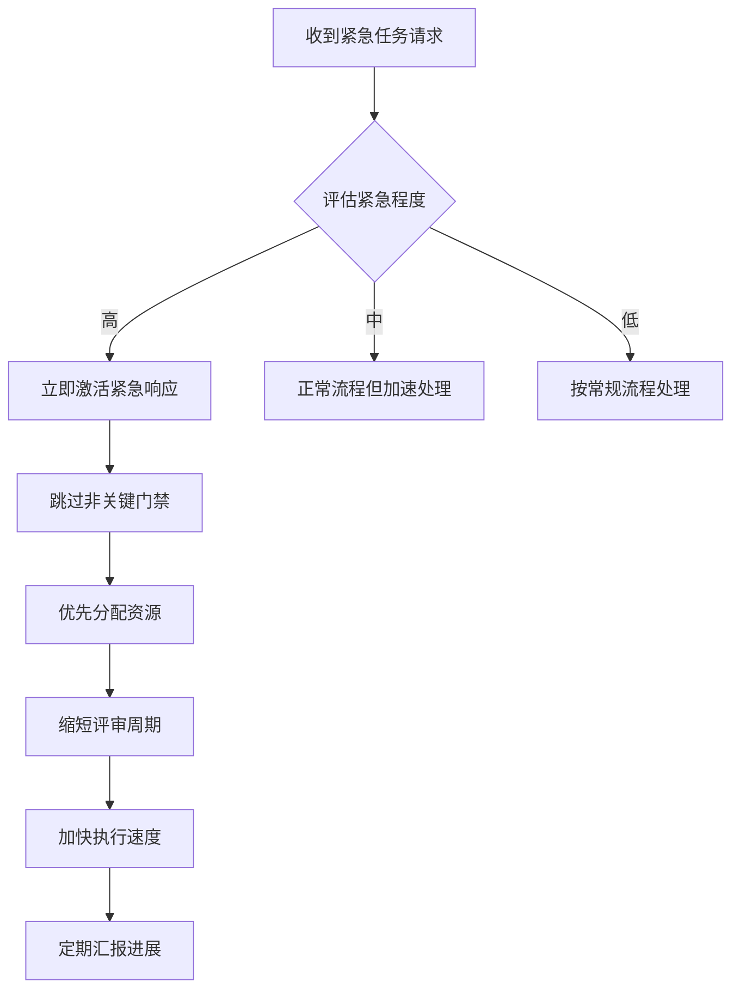

#### 紧急响应门禁

- **简化门禁**：跳过部分非关键门禁，但仍保留核心约束
- **资源倾斜**：优先分配更强的计算资源和更专业的审查人员
- **进度透明**：增加紧急响应的进度汇报频率
- **风险控制**：在加速的同时保持必要的质量控制

**章节来源**
- [SKILL.md:388-470](file://altas-workflow/SKILL.md#L388-L470)

### EXIT ALTAS 规范

**新增** 4.5 版本的协议退出规范

#### 主动退出（用户输入 `EXIT ALTAS`）

退出前必须输出完整恢复锚点：

| 字段 | 内容 |
|------|------|
| **当前阶段** | PRE-RESEARCH / RESEARCH / INNOVATE / PLAN / EXECUTE / REVIEW / ARCHIVE |
| **已完成** | 本轮产出的文件、结论、下一步待办 |
| **待办** | 未完成项及优先级 |
| **恢复锚点** | 基于 Spec + 代码 + 对话历史的最小重建路径 |

#### 强制中断（非用户主动：上下文耗尽/工具失败等）

退出前输出最小恢复锚点：

| 字段 | 内容 |
|------|------|
| **中断类型** | `[FORCED] 非用户主动退出` |
| **当前阶段** | 同上 |
| **最后检查点** | 最近一次 checkpoint 的阶段和产出摘要 |
| **Spec 状态** | `完整` / `部分` / `[RECOVERED]` 重建 |
| **最小恢复路径** | 仅含 Spec 路径 + 最后 Checkpoint + 未完成 Checklist 项 |

**Spec 损坏时**（丢失或不一致）：基于代码现状和对话历史重建最小 Spec，标记 `[RECOVERED]` 后请求确认。

**章节来源**
- [SKILL.md:367-393](file://altas-workflow/SKILL.md#L367-L393)

### SKILL-entry-review.md 扩展的6个改进建议

**新增** 4.5 版本的 SKILL-entry-review.md 扩展

SKILL-entry-review.md 作为技能入口的持续复核文件，记录了以下6个重要改进建议：

#### 已解决的问题

1. **A. 技能创建流程验证** [已解决]
   - 在 SKILL.md 末尾添加完整的 SKILL Creation & Testing Log 章节，包含 RED-GREEN-REFACTOR 迭代记录

2. **B. 说服原则应用** [已解决]
   - 在铁律、首轮响应模板、检查点契约中增强 Authority/Commitment/Social Proof 原则
   - 明确技能的权威性、承诺性和社会证明

3. **C. CSO 优化** [已解决]
   - 将 description 字段重构为纯触发条件描述，移除流程性总结
   - 使技能描述更加简洁和专注

4. **D. 技能命名未遵循"动词-ing 形式"最佳实践** [已解决]
   - 虽然当前技能名为 `altas-workflow`（名词短语）而非 `handling-engineering-tasks`
   - 但已在 description 中增强触发条件，符合 CSO 要求

5. **E. 缺少"技能发现流程"优化（关键词覆盖不足）** [已解决]
   - 在路由速查表中添加症状关键词（如"代码有问题"→REVIEW，"测试不稳定"→TEST）
   - 在任务不明确章节添加常见错误消息示例

6. **F. 技能正文长度超出最佳实践（500 行限制）** [已解决]
   - 通过"按需加载"策略（引用 reference-index.md）保持正文长度在合理范围内
   - 将详细内容移至参考文件，SKILL.md 保持核心路由和规则

#### 未解决的问题

1. **G. 缺少"渐进式披露"架构的显式导航** [待改进]
   - 建议在 Overview 后添加"Quick Navigation"章节，提供显式导航
   - 展示"Core patterns"、"Special modes"、"Full index"、"Tools mapping"的层次结构

2. **H. 代码示例的"质量 vs 数量"平衡可优化** [待改进]
   - 建议在 SKILL.md 末尾添加"Example Session"章节
   - 展示一个完整会话：用户输入→路由判断→规模评估→首轮响应→检查点→完成

3. **I. 缺少对"技能类型"的显式分类声明** [待改进]
   - 建议在 Overview 中添加技能类型声明：Hybrid (Technique + Pattern + Discipline)
   - 明确测试策略：academic questions + pressure scenarios

4. **J. 未充分利用"交叉引用"减少冗余** [待改进]
   - 建议在 TDD 相关章节添加"REQUIRED BACKGROUND"声明
   - 在 Subagent 章节添加"REQUIRED SUB-SKILL"声明

**章节来源**
- [SKILL-entry-review.md:13-72](file://altas-workflow/SKILL-entry-review.md#L13-L72)