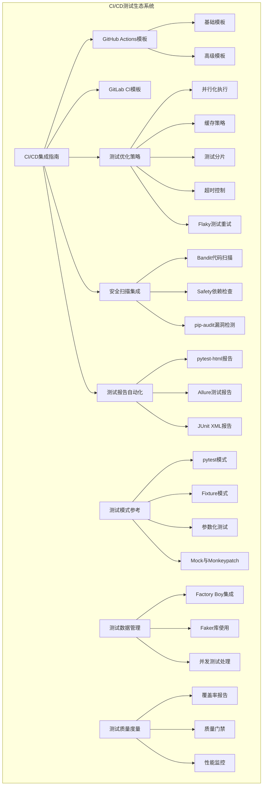
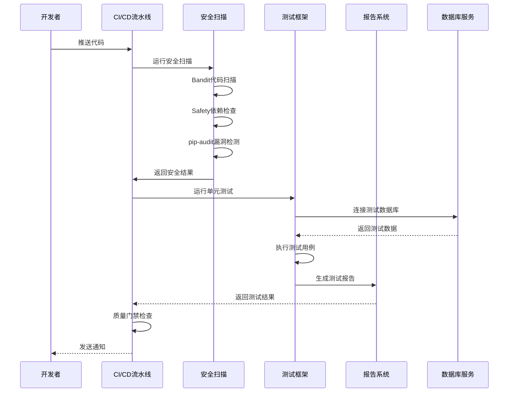
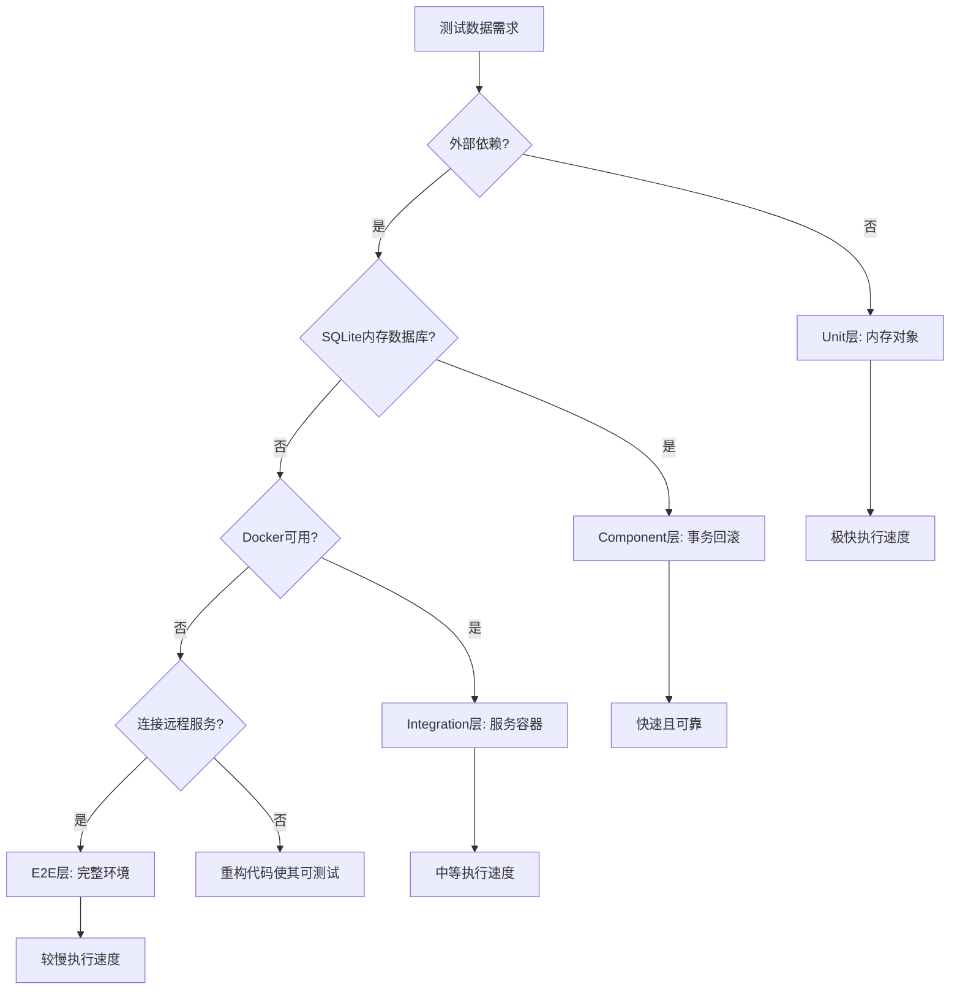
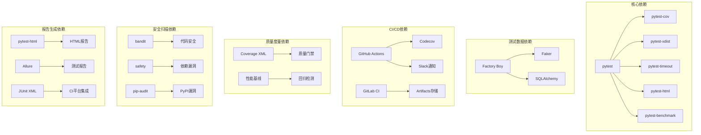

# CI/CD集成测试参考

<cite>
**本文档引用的文件**
- [ci-cd-integration.md](file://altas-workflow/references/testing/ci-cd-integration.md)
- [pytest-patterns.md](file://altas-workflow/references/testing/pytest-patterns.md)
- [test-data-management.md](file://altas-workflow/references/testing/test-data-management.md)
- [test-quality-metrics.md](file://altas-workflow/references/testing/test-quality-metrics.md)
- [SKILL.md](file://altas-workflow/SKILL.md)
- [reference-index.md](file://altas-workflow/reference-index.md)
- [PROTOCOL-SELECTION.md](file://altas-workflow/protocols/PROTOCOL-SELECTION.md)
- [RIPER-5.md](file://altas-workflow/protocols/RIPER-5.md)
- [SDD-RIPER-DUAL-COOP.md](file://altas-workflow/protocols/SDD-RIPER-DUAL-COOP.md)
</cite>

## 更新摘要
**变更内容**
- 新增安全扫描集成章节，包含Bandit、Safety、pip-audit工具的完整配置和使用指南
- 扩展测试报告生成功能，详细介绍pytest-html、Allure、JUnit XML三种报告格式
- 增强质量门禁检查机制，完善安全漏洞检测和阻塞策略
- 丰富测试报告自动化功能，支持企业级CI平台集成

## 目录
1. [简介](#简介)
2. [项目结构](#项目结构)
3. [核心组件](#核心组件)
4. [架构概览](#架构概览)
5. [详细组件分析](#详细组件分析)
6. [依赖关系分析](#依赖关系分析)
7. [性能考虑](#性能考虑)
8. [故障排除指南](#故障排除指南)
9. [结论](#结论)

## 简介

本文件提供了Altas工作流中的CI/CD集成测试参考指南。该指南基于完整的测试生态系统，包括GitHub Actions和GitLab CI模板、pytest测试模式、测试数据管理和质量度量体系。文档旨在帮助开发者和测试工程师建立可靠的持续集成/持续部署测试流程。

**更新** 本次更新大幅增强了安全扫描和测试报告生成功能，为CI/CD流水线增加了企业级的安全保障和报告自动化能力。

## 项目结构

Altas工作流的CI/CD测试体系采用模块化设计，主要包含以下核心组件：



**图表来源**
- [ci-cd-integration.md:1-1459](file://altas-workflow/references/testing/ci-cd-integration.md#L1-L1459)
- [pytest-patterns.md:1-1006](file://altas-workflow/references/testing/pytest-patterns.md#L1-L1006)
- [test-data-management.md:1-769](file://altas-workflow/references/testing/test-data-management.md#L1-L769)
- [test-quality-metrics.md:1-900](file://altas-workflow/references/testing/test-quality-metrics.md#L1-L900)

## 核心组件

### CI/CD流水线模板

系统提供两种主要的CI/CD流水线模板：

#### GitHub Actions模板
- **基础模板**：适用于大多数项目，包含Python版本矩阵、服务容器和完整的测试流程
- **高级模板**：包含并行化执行、缓存优化和分层测试策略

#### GitLab CI模板
- **多阶段流水线**：包含代码检查、测试和报告生成阶段
- **服务集成**：支持PostgreSQL和Redis服务容器

**章节来源**
- [ci-cd-integration.md:18-380](file://altas-workflow/references/testing/ci-cd-integration.md#L18-L380)

### 测试框架配置

#### pytest配置
- **并行化配置**：支持自动检测CPU核心数和按模块分配worker
- **缓存策略**：启用pytest缓存和依赖安装缓存
- **测试分片**：支持按测试时长和文件大小进行分片

#### 覆盖率配置
- **多格式报告**：支持XML、HTML和终端报告
- **门禁检查**：自动检查覆盖率阈值
- **配置管理**：支持按模块和文件的差异化配置

**章节来源**
- [ci-cd-integration.md:384-757](file://altas-workflow/references/testing/ci-cd-integration.md#L384-L757)

### 安全扫描集成

**新增** 系统集成了多层次的安全扫描机制，确保代码质量和依赖安全：

#### Python安全扫描工具
| 工具 | 扫描内容 | 安装 | 运行 |
|------|---------|------|------|
| `bandit` | 代码安全问题 | `pip install bandit` | `bandit -r src/` |
| `safety` | 依赖漏洞 | `pip install safety` | `safety check` |
| `pip-audit` | PyPI漏洞数据库 | `pip install pip-audit` | `pip-audit` |

#### GitHub Actions安全扫描
```yaml
# .github/workflows/security.yml
name: Security Scan

on:
  push:
    branches: [main]
  pull_request:
    branches: [main]

jobs:
  security:
    runs-on: ubuntu-latest
    steps:
      - uses: actions/checkout@v4

      - name: Setup Python
        uses: actions/setup-python@v5
        with:
          python-version: '3.11'

      - name: Install dependencies
        run: pip install bandit safety pip-audit

      - name: Run bandit (code security)
        run: bandit -r src/ -f json -o bandit-report.json || true

      - name: Run safety (dependency vulns)
        run: safety check --json --output safety-report.json || true

      - name: Run pip-audit
        run: pip-audit --format json --output pip-audit-report.json || true

      - name: Upload security reports
        if: always()
        uses: actions/upload-artifact@v3
        with:
          name: security-reports
          path: '*-report.json'

      - name: Check for high severity
        run: |
          pip-audit --desc --vuln-filter "severity:high,critical"
          if [ $? -ne 0 ]; then
            echo "High/critical severity vulnerabilities found"
            exit 1
          fi
```

#### 安全扫描CI集成策略
| 阶段 | 工具 | 失败条件 | 动作 |
|------|------|---------|------|
| PR | bandit | 高危漏洞 | 阻塞合并 |
| PR | safety | 已知漏洞 | 警告（不阻塞） |
| Main | pip-audit | 高/严重漏洞 | 阻塞合并 |
| Release | trivy/snyk | 任何漏洞 | 阻塞发布 |

**章节来源**
- [ci-cd-integration.md:1240-1311](file://altas-workflow/references/testing/ci-cd-integration.md#L1240-L1311)

### 测试报告自动化

**新增** 系统支持多种测试报告格式，满足不同CI平台和企业需求：

#### pytest-html HTML报告
```bash
pip install pytest-html

pytest tests/ --html=report.html --self-contained-html
```

```yaml
# GitHub Actions
- name: Run tests
  run: pytest --html=report.html --self-contained-html

- name: Upload HTML report
  if: always()
  uses: actions/upload-artifact@v3
  with:
    name: test-report
    path: report.html
```

#### Allure报告
```bash
pip install allure-pytest

pytest tests/ --alluredir=allure-results
allure generate allure-results -o allure-report --clean
```

```yaml
# GitHub Actions
- name: Run tests with Allure
  run: pytest --alluredir=allure-results

- name: Generate Allure report
  run: |
  docker run -p 5050:5050 -v $(pwd)/allure-results:/allure-results frankescobar/allure-docker-api generate

- name: Deploy report
  uses: peaceiris/actions-gh-pages@v3
  with:
    publish_dir: ./allure-report
```

#### JUnit XML（GitHub Checks / GitLab Test Reports）
```bash
pytest tests/ --junitxml=junit.xml
```

```yaml
# GitHub Checks
- name: Publish test results
  uses: dorny/test-reporter@v1
  if: always()
  with:
    name: Pytest Results
    path: junit.xml
    reporter: java-junit

# GitLab Test Reports
test:
  script: pytest --junitxml=report.xml
  artifacts:
    reports:
      junit: report.xml
```

#### 测试报告对比趋势
```yaml
# 使用 pytest-benchmark + 历史对比
- name: Run benchmarks
  run: pytest tests/performance/ --benchmark-json=benchmark.json

- name: Compare with baseline
  run: |
  python -c "
  import json
  with open('benchmark.json') as f:
      data = json.load(f)
  with open('baseline.json') as b:
      baseline = json.load(b)
  
  for bench in data['benchmarks']:
      name = bench['name']
      current = bench['stats']['mean']
      base = baseline.get(name, {}).get('mean', current)
      change = (current - base) / base * 100
      print(f'{name}: {change:+.1f}%')
      if change > 10:
          print(f'REGRESSION: {name} degraded by {change:.1f}%')
          exit(1)
  "
```

**章节来源**
- [ci-cd-integration.md:1314-1453](file://altas-workflow/references/testing/ci-cd-integration.md#L1314-L1453)

## 架构概览

CI/CD测试架构采用分层设计，确保测试的可靠性、可维护性和可扩展性：



**图表来源**
- [ci-cd-integration.md:22-145](file://altas-workflow/references/testing/ci-cd-integration.md#L22-L145)
- [ci-cd-integration.md:149-300](file://altas-workflow/references/testing/ci-cd-integration.md#L149-L300)

## 详细组件分析

### 测试数据管理策略

测试数据管理采用分层架构，确保测试的独立性和可重复性：



**图表来源**
- [test-data-management.md:27-40](file://altas-workflow/references/testing/test-data-management.md#L27-L40)

#### Factory Boy集成
- **声明式定义**：数据结构清晰可见
- **链式创建**：复杂关联对象一行创建
- **惰性求值**：按需生成值，节省资源
- **批量生成**：支持批量创建测试数据集

#### Faker库使用
- **真实感数据**：使用Faker生成真实数据
- **多语言支持**：支持多种语言环境
- **自定义Provider**：可扩展测试专用数据生成器

**章节来源**
- [test-data-management.md:43-769](file://altas-workflow/references/testing/test-data-management.md#L43-L769)

### 测试质量度量体系

测试质量度量体系包含多个层次的指标：

#### 一级指标（必须监控）
| 指标 | 定义 | 工具 | 目标值 | 权重 |
|------|------|------|--------|------|
| 测试覆盖率 | 被测代码行数 / 总代码行数 | pytest-cov | ≥80% (核心≥95%) | ⭐⭐⭐⭐⭐ |
| 测试通过率 | 通过测试数 / 总测试数 | pytest | =100% (0 failures) | ⭐⭐⭐⭐⭐ |
| Flaky Rate | 不稳定测试次数 / 总运行次数 | pytest-rerunfailures | <1% | ⭐⭐⭐⭐ |
| 测试执行时间 | 完整套件运行时间 | pytest --durations | <5min (单元<2min) | ⭐⭐⭐ |

#### 二级指标（建议监控）
| 指标 | 定义 | 工具 | 目标值 | 权重 |
|------|------|------|--------|------|
| 断言密度 | 断言数量 / 测试函数数量 | 自定义分析 | 2-4 个/测试 | ⭐⭐⭐⭐ |
| Mock 比例 | 使用 Mock 的测试 / 总测试数 | 自定义分析 | <30% | ⭐⭐⭐⭐ |
| 测试复杂度 | 单个测试平均圈复杂度 | radon | <10 | ⭐⭐⭐ |
| 代码-测试比 | 测试代码行数 / 生产代码行数 | cloc | 1:1 - 2:1 | ⭐⭐⭐ |

**章节来源**
- [test-quality-metrics.md:18-46](file://altas-workflow/references/testing/test-quality-metrics.md#L18-L46)
- [test-quality-metrics.md:29-46](file://altas-workflow/references/testing/test-quality-metrics.md#L29-L46)

### pytest测试模式

#### Fixture模式
- **基本Fixture**：提供测试数据和资源
- **作用域管理**：支持function、class、module、session作用域
- **依赖链**：支持Fixture间的依赖关系
- **工厂模式**：按需创建测试对象

#### 参数化测试
- **基本参数化**：支持简单参数组合
- **带ID的参数化**：便于测试结果追踪
- **多参数组合**：支持复杂的参数组合场景
- **参数化Fixture**：结合Fixture的参数化能力

**章节来源**
- [pytest-patterns.md:18-180](file://altas-workflow/references/testing/pytest-patterns.md#L18-L180)

### 并发测试处理

并发测试面临的主要挑战和解决方案：

#### 并发冲突问题
- **共享状态**：多个worker同时写入相同数据
- **数据库锁**：并发操作导致的锁竞争
- **资源竞争**：文件系统和网络资源的竞争

#### 解决方案
- **Worker-aware数据**：为不同worker生成唯一标识
- **独立数据库**：为每个worker创建独立数据库
- **顺序执行**：标记关键测试为串行执行

**章节来源**
- [test-data-management.md:581-642](file://altas-workflow/references/testing/test-data-management.md#L581-L642)

## 依赖关系分析

CI/CD测试体系的依赖关系呈现层次化结构：



**图表来源**
- [ci-cd-integration.md:542-560](file://altas-workflow/references/testing/ci-cd-integration.md#L542-L560)
- [pytest-patterns.md:542-560](file://altas-workflow/references/testing/pytest-patterns.md#L542-L560)

**章节来源**
- [reference-index.md:158-167](file://altas-workflow/reference-index.md#L158-L167)

## 性能考虑

### 测试执行优化

#### 并行化策略
- **自动检测**：自动检测CPU核心数进行并行化
- **负载均衡**：按模块或文件大小分配worker
- **最大进程限制**：防止过度并行导致的资源争用

#### 缓存优化
- **pip缓存**：缓存依赖包下载
- **pytest缓存**：缓存测试结果和配置
- **依赖安装缓存**：细粒度的依赖缓存策略

#### 测试分片
- **时长分片**：按测试执行时间进行分片
- **自动分片**：基于历史数据的智能分片
- **手动分片**：灵活的手动分片策略

### 资源管理

#### 服务容器
- **PostgreSQL容器**：支持测试数据库服务
- **Redis容器**：支持缓存和消息队列服务
- **健康检查**：确保服务容器正常运行

#### 超时控制
- **单个测试超时**：防止个别测试拖慢整体执行
- **整体套件超时**：控制测试执行的总时间
- **动态超时**：根据测试复杂度动态调整超时时间

**章节来源**
- [ci-cd-integration.md:580-757](file://altas-workflow/references/testing/ci-cd-integration.md#L580-L757)

## 故障排除指南

### 常见问题诊断

#### 测试失败分析
- **根因分析**：区分产品缺陷、测试缺陷和环境缺陷
- **失败归因**：建立系统的失败原因分类
- **修复策略**：针对不同类型失败制定修复策略

#### Flaky测试处理
- **检测机制**：基于最近多次运行结果的检测
- **重试策略**：合理设置重试次数和延迟
- **标记处理**：使用@pytest.mark.flaky标记不稳定测试

#### 性能回归检测
- **基线建立**：建立测试执行时间基线
- **回归检测**：自动检测性能回退
- **趋势分析**：分析性能指标的历史趋势

### 质量门禁检查

#### 覆盖率门禁
- **阈值检查**：自动检查覆盖率是否达到阈值
- **模块级检查**：支持按模块的差异化覆盖率要求
- **失败处理**：覆盖率不足时的处理策略

#### 通过率门禁
- **严格模式**：PR合并前的严格通过率要求
- **宽松模式**：开发分支的相对宽松要求
- **回归测试门禁**：仅回归测试的特殊要求

#### 安全扫描门禁
**新增** 安全扫描集成后的质量门禁检查：
- **Bandit门禁**：高危代码安全问题阻塞PR合并
- **Safety门禁**：已知依赖漏洞警告或阻塞
- **pip-audit门禁**：高/严重漏洞阻塞主分支合并
- **漏洞等级过滤**：支持按严重级别过滤和处理

**章节来源**
- [test-quality-metrics.md:295-496](file://altas-workflow/references/testing/test-quality-metrics.md#L295-L496)
- [ci-cd-integration.md:1294-1311](file://altas-workflow/references/testing/ci-cd-integration.md#L1294-L1311)

## 结论

Altas工作流的CI/CD集成测试体系提供了完整的测试解决方案，具有以下特点：

### 核心优势
- **模块化设计**：各个组件独立且可替换
- **层次化架构**：从单元测试到E2E测试的完整覆盖
- **自动化程度高**：从测试执行到报告生成的全流程自动化
- **质量保障**：多维度的质量度量和门禁检查
- **安全保障**：多层次的安全扫描确保代码和依赖安全
- **报告标准化**：支持多种报告格式满足不同CI平台需求

### 最佳实践建议
1. **分层测试策略**：根据测试类型选择合适的测试层级
2. **数据管理规范**：遵循测试数据的独立性和可重复性原则
3. **质量度量监控**：建立持续的质量监控和改进机制
4. **性能优化**：合理使用并行化和缓存策略提升测试效率
5. **安全扫描集成**：将安全检查纳入CI/CD流水线的必备环节
6. **报告标准化**：统一测试报告格式提高团队协作效率

### 未来发展方向
- **智能化测试**：利用AI技术提升测试用例生成和执行效率
- **云原生测试**：更好地支持容器化和微服务架构的测试需求
- **持续改进**：基于历史数据和趋势分析持续优化测试策略
- **安全自动化**：进一步完善安全扫描和漏洞修复的自动化流程

通过遵循本指南，开发团队可以建立高效、可靠、安全的CI/CD测试流程，确保软件质量和交付效率。