# E2E 测试框架参考指南

<cite>
**本文档引用的文件**
- [e2e-testing.md](file://altas-workflow/references/testing/e2e-testing.md)
- [conftest.py](file://altas-workflow/references/testing/templates/conftest.py)
- [api_client_fixture.py](file://altas-workflow/references/testing/templates/api_client_fixture.py)
- [auth_fixture.py](file://altas-workflow/references/testing/templates/auth_fixture.py)
- [db_rollback_fixture.py](file://altas-workflow/references/testing/templates/db_rollback_fixture.py)
</cite>

## 目录
1. [简介](#简介)
2. [项目结构](#项目结构)
3. [核心组件](#核心组件)
4. [架构概览](#架构概览)
5. [详细组件分析](#详细组件分析)
6. [依赖分析](#依赖分析)
7. [性能考虑](#性能考虑)
8. [故障排除指南](#故障排除指南)
9. [结论](#结论)
10. [附录](#附录)

## 简介

本指南为基于 Playwright 和 pytest 的 E2E 测试框架提供了完整的参考文档。该框架专注于现代 Web 应用的端到端测试，结合了浏览器自动化、API 测试和数据库管理的最佳实践。

E2E 测试作为测试金字塔的顶端，验证真实的用户流程，涵盖前端、后端、数据库和外部依赖的完整链路。该框架特别适用于需要复杂用户交互和跨系统集成验证的场景。

## 项目结构

该项目采用模块化的测试框架结构，主要包含以下核心目录和文件：

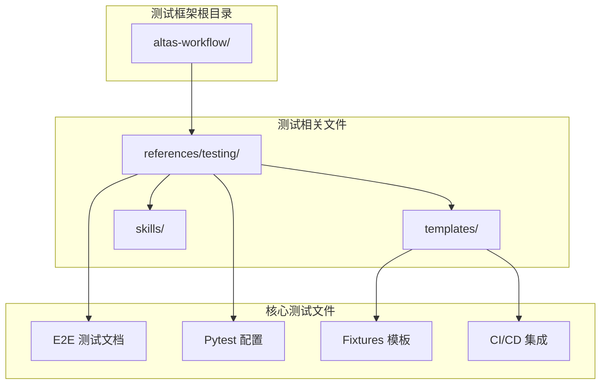

**图表来源**
- [e2e-testing.md:1-508](file://altas-workflow/references/testing/e2e-testing.md#L1-L508)
- [conftest.py:1-67](file://altas-workflow/references/testing/templates/conftest.py#L1-L67)

**章节来源**
- [e2e-testing.md:1-508](file://altas-workflow/references/testing/e2e-testing.md#L1-L508)
- [conftest.py:1-67](file://altas-workflow/references/testing/templates/conftest.py#L1-L67)

## 核心组件

### 测试工具选型

框架支持多种测试工具，每种都有其特定的应用场景：

| 工具 | 适用场景 | 优点 | 缺点 |
|------|----------|------|------|
| Playwright | 现代 Web 应用、多浏览器支持 | 自动等待、支持多浏览器、录制回放 | 生态相对新 |
| Cypress | 前端为主的 E2E 测试 | 实时重载、时间旅行调试 | 浏览器支持有限 |
| pytest + Selenium | Python 后端项目 | 复用 pytest 生态 | 需要额外配置 |

### 测试标记系统

框架定义了完整的测试标记体系，用于区分不同类型的测试：

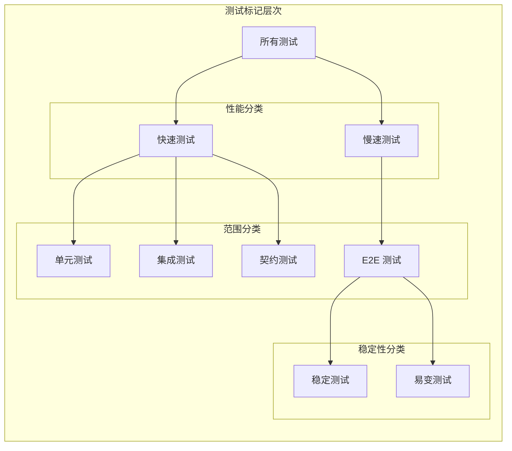

**图表来源**
- [conftest.py:15-21](file://altas-workflow/references/testing/templates/conftest.py#L15-L21)

**章节来源**
- [e2e-testing.md:42-61](file://altas-workflow/references/testing/e2e-testing.md#L42-L61)
- [conftest.py:15-21](file://altas-workflow/references/testing/templates/conftest.py#L15-L21)

## 架构概览

### 测试金字塔架构

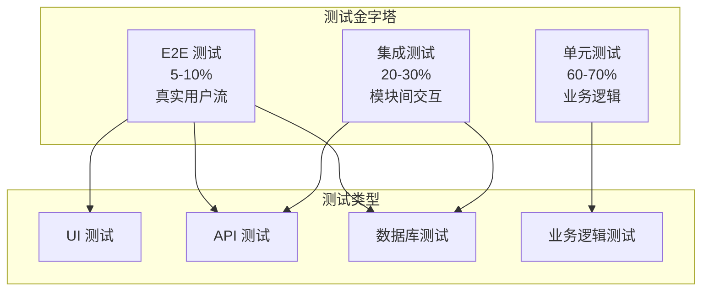

**图表来源**
- [e2e-testing.md:13-27](file://altas-workflow/references/testing/e2e-testing.md#L13-L27)

### 环境架构

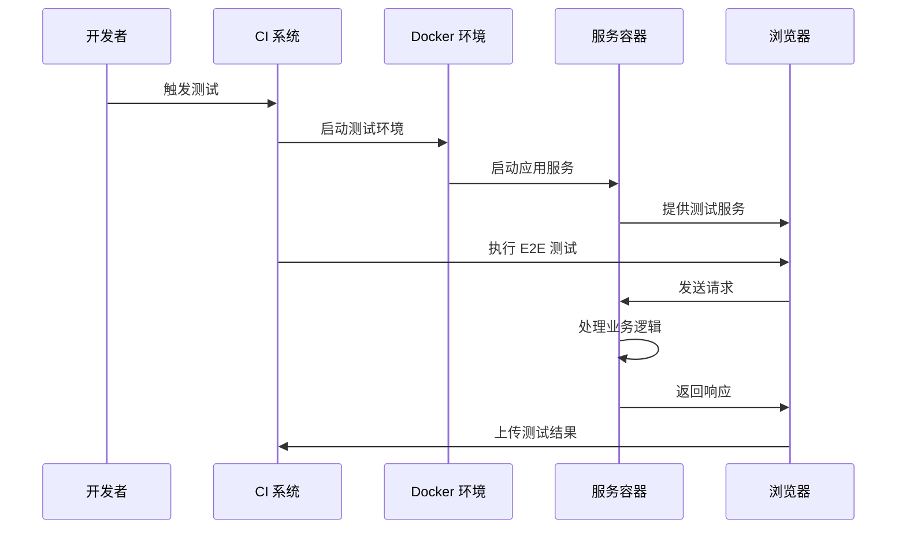

**图表来源**
- [e2e-testing.md:99-142](file://altas-workflow/references/testing/e2e-testing.md#L99-L142)

**章节来源**
- [e2e-testing.md:64-142](file://altas-workflow/references/testing/e2e-testing.md#L64-L142)

## 详细组件分析

### API 客户端模板

APIClient 类提供了统一的 API 访问接口，简化了测试代码的编写：

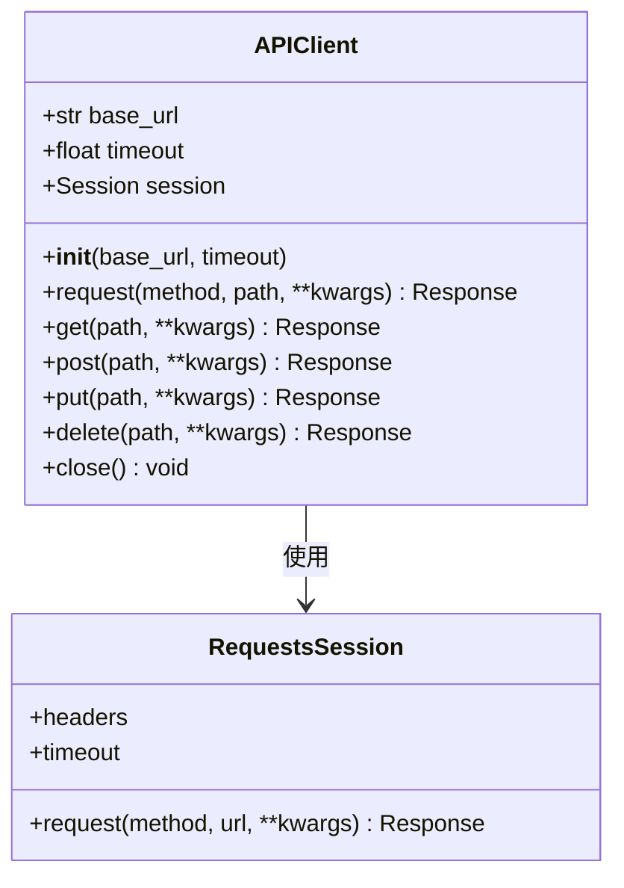

**图表来源**
- [api_client_fixture.py:14-56](file://altas-workflow/references/testing/templates/api_client_fixture.py#L14-L56)

#### 关键特性

- **统一配置**：集中管理基础 URL 和超时设置
- **标准化请求**：提供简洁的 HTTP 方法包装
- **会话管理**：复用连接池提高性能
- **自动清理**：测试结束后自动关闭会话

**章节来源**
- [api_client_fixture.py:1-57](file://altas-workflow/references/testing/templates/api_client_fixture.py#L1-L57)

### 认证夹具模板

认证系统提供了灵活的身份验证机制，支持多种用户角色：

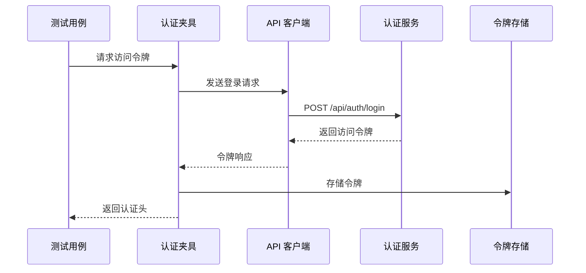

**图表来源**
- [auth_fixture.py:20-36](file://altas-workflow/references/testing/templates/auth_fixture.py#L20-L36)

#### 支持的角色类型

| 角色 | 权限范围 | 使用场景 |
|------|----------|----------|
| 普通用户 | 基本功能访问 | 用户注册、登录、个人资料 |
| 管理员 | 系统管理权限 | 用户管理、系统配置 |
| 测试账户 | 专用测试权限 | 自动化测试、数据管理 |

**章节来源**
- [auth_fixture.py:1-51](file://altas-workflow/references/testing/templates/auth_fixture.py#L1-L51)

### 数据库回滚夹具

数据库回滚机制确保测试间的隔离性和可重复性：

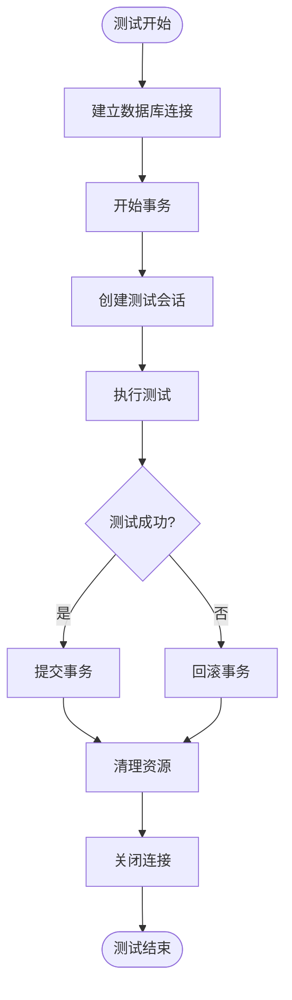

**图表来源**
- [db_rollback_fixture.py:23-36](file://altas-workflow/references/testing/templates/db_rollback_fixture.py#L23-L36)

#### 回滚机制优势

- **测试隔离**：每个测试都在独立的事务环境中运行
- **数据一致性**：测试失败时自动清理产生的数据
- **性能优化**：避免重复的数据准备和清理工作
- **确定性结果**：确保测试环境的一致性

**章节来源**
- [db_rollback_fixture.py:1-43](file://altas-workflow/references/testing/templates/db_rollback_fixture.py#L1-L43)

### 配置夹具模板

核心配置夹具提供了测试环境的基础设置：

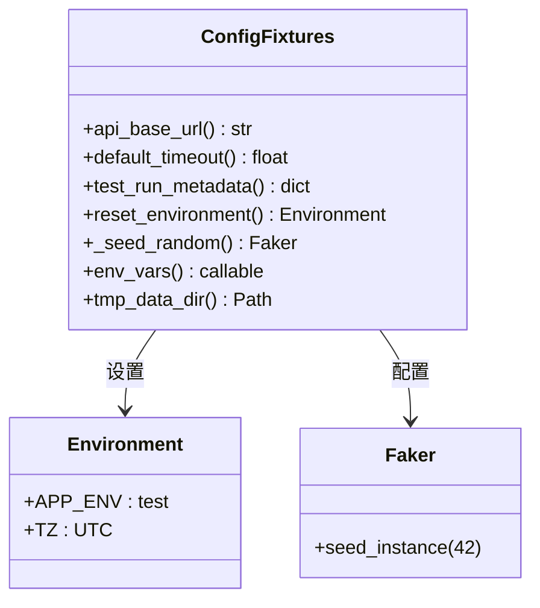

**图表来源**
- [conftest.py:24-66](file://altas-workflow/references/testing/templates/conftest.py#L24-L66)

**章节来源**
- [conftest.py:1-67](file://altas-workflow/references/testing/templates/conftest.py#L1-L67)

## 依赖分析

### 测试工具依赖关系

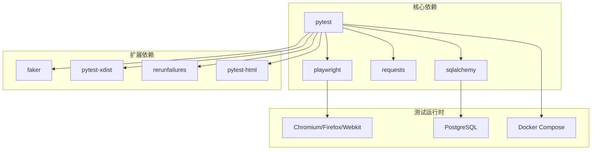

**图表来源**
- [e2e-testing.md:496-508](file://altas-workflow/references/testing/e2e-testing.md#L496-L508)

### 插件生态系统

| 插件名称 | 功能描述 | 版本要求 | 使用场景 |
|----------|----------|----------|----------|
| pytest-playwright | Playwright 集成 | >= 0.1.0 | 浏览器自动化测试 |
| pytest-xdist | 并行执行 | >= 2.0.0 | 测试加速和并行 |
| pytest-rerunfailures | 失败重试 | >= 9.0.0 | 提高测试稳定性 |
| pytest-html | HTML 报告 | >= 3.0.0 | 生成可视化报告 |

**章节来源**
- [e2e-testing.md:496-508](file://altas-workflow/references/testing/e2e-testing.md#L496-L508)

## 性能考虑

### 测试执行优化

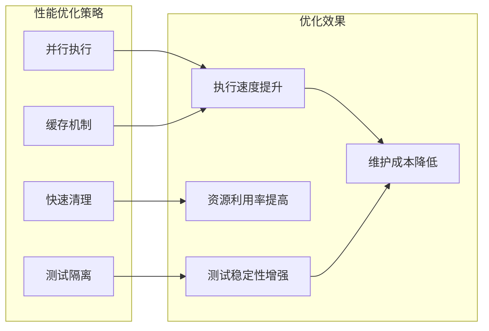

### 内存管理最佳实践

- **及时清理**：测试结束后立即释放资源
- **连接池复用**：避免频繁创建销毁连接
- **会话管理**：合理使用 HTTP 会话
- **数据库事务**：使用短生命周期事务

## 故障排除指南

### 常见问题诊断

| 问题类型 | 症状表现 | 解决方案 | 预防措施 |
|----------|----------|----------|----------|
| 环境配置错误 | 测试无法启动 | 检查环境变量和依赖安装 | 使用 Docker 环境 |
| 浏览器兼容性 | 页面渲染异常 | 更新浏览器驱动版本 | 定期更新 Playwright |
| 数据竞争 | 测试结果不稳定 | 实施数据库事务隔离 | 使用回滚夹具 |
| 超时错误 | 请求超时 | 增加超时时间和重试次数 | 优化网络配置 |

### 调试工具使用

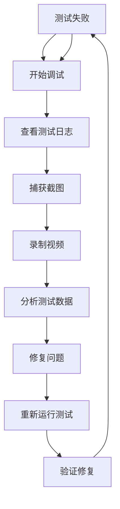

**章节来源**
- [e2e-testing.md:255-280](file://altas-workflow/references/testing/e2e-testing.md#L255-L280)

## 结论

本 E2E 测试框架提供了完整的端到端测试解决方案，结合了现代测试工具的最佳实践。通过合理的架构设计、完善的夹具系统和优化的执行策略，该框架能够有效支撑复杂 Web 应用的测试需求。

关键优势包括：
- **模块化设计**：清晰的组件分离和职责划分
- **环境隔离**：可靠的测试环境管理和数据清理
- **性能优化**：并行执行和资源复用机制
- **稳定性保障**：重试机制和监控告警系统

建议在实际项目中根据具体需求调整配置参数，持续优化测试策略以获得最佳的测试效果。

## 附录

### 快速开始指南

1. **环境准备**：安装 Python 3.8+ 和依赖包
2. **浏览器安装**：运行 Playwright 浏览器安装命令
3. **配置设置**：设置必要的环境变量
4. **测试编写**：基于提供的模板编写测试用例
5. **执行测试**：使用 pytest 运行测试套件

### 最佳实践清单

- 使用 Page Object 模式组织测试代码
- 实施智能等待而非硬编码延时
- 保持测试数据的独立性和可预测性
- 定期审查和重构测试用例
- 建立完善的监控和告警机制