# 性能/负载测试方法论

<cite>
**本文档引用的文件**
- [性能测试参考](file://altas-workflow/references/testing/performance-testing.md)
- [性能模式协议](file://altas-workflow/references/special-modes/perf.md)
- [测试报告模板](file://altas-workflow/references/testing/templates/test_report.md)
- [CI/CD 集成指南](file://altas-workflow/references/testing/ci-cd-integration.md)
- [E2E 测试模式参考](file://altas-workflow/references/testing/e2e-testing.md)
</cite>

## 目录
1. [引言](#引言)
2. [项目结构](#项目结构)
3. [核心组件](#核心组件)
4. [架构概览](#架构概览)
5. [详细组件分析](#详细组件分析)
6. [依赖关系分析](#依赖关系分析)
7. [性能考虑](#性能考虑)
8. [故障排除指南](#故障排除指南)
9. [结论](#结论)

## 引言

本文件基于 Altas 项目的测试工作流，系统性阐述了性能/负载测试的方法论和最佳实践。该方法论强调自动化、可重复性和回归检测，涵盖了从单元级性能基准到系统级压力测试的完整测试金字塔，并提供了与 CI/CD 流水线的深度集成方案。

## 项目结构

Altas 项目采用分层测试架构，主要包含以下测试相关文件：

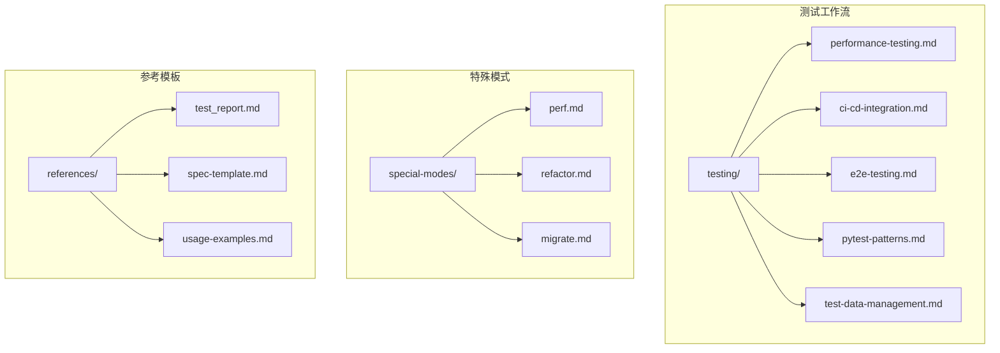

**图表来源**
- [性能测试参考:1-412](file://altas-workflow/references/testing/performance-testing.md#L1-L412)
- [性能模式协议:1-234](file://altas-workflow/references/special-modes/perf.md#L1-L234)

**章节来源**
- [性能测试参考:1-412](file://altas-workflow/references/testing/performance-testing.md#L1-L412)
- [性能模式协议:1-234](file://altas-workflow/references/special-modes/perf.md#L1-L234)

## 核心组件

### 测试金字塔层级

项目实现了完整的测试金字塔，从底层到顶层依次为：

| 测试层级 | 工具选择 | 适用场景 | 典型耗时 |
|---------|---------|---------|---------|
| **单元级性能基准** | `pytest-benchmark` | 单个函数/方法的性能基线 | < 100ms |
| **API 级负载测试** | `locust` / `k6` | 接口并发、吞吐量、响应时间 | 1-10 min |
| **系统级压力测试** | `locust` + `docker` | 全系统负载、资源消耗 | 10-30 min |

### 性能测试工具对比

| 工具 | 语言 | 协议支持 | 学习曲线 | CI 集成 | 报告 |
|------|------|---------|---------|---------|------|
| `pytest-benchmark` | Python | 进程内 | 低 | ✅ 原生 | JSON/CSV |
| `locust` | Python | HTTP/WS | 中 | ✅ 好 | Web UI/JSON |
| `k6` | JavaScript | HTTP/WS/gRPC | 中 | ✅ 好 | JSON/HTML |
| `wrk` | C | HTTP | 低 | ⚠️ 需包装 | 终端输出 |

**章节来源**
- [性能测试参考:17-35](file://altas-workflow/references/testing/performance-testing.md#L17-L35)

## 架构概览

### 性能测试流水线架构

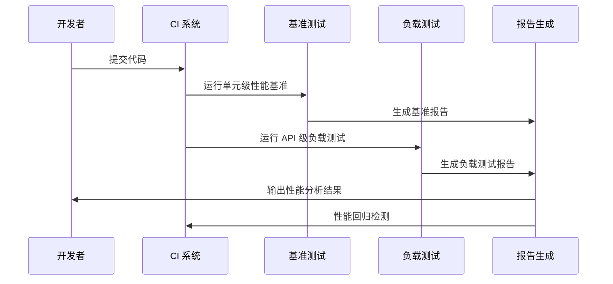

**图表来源**
- [性能测试参考:327-384](file://altas-workflow/references/testing/performance-testing.md#L327-L384)
- [CI/CD 集成指南:18-145](file://altas-workflow/references/testing/ci-cd-integration.md#L18-L145)

### 性能优化流程

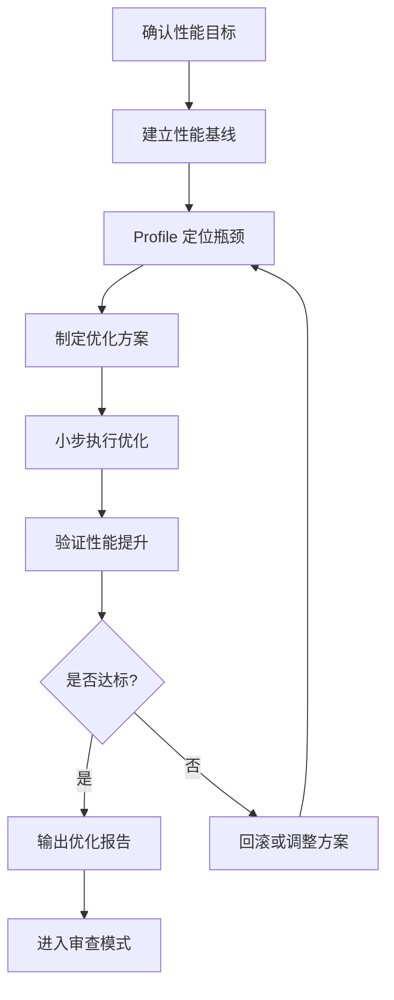

**图表来源**
- [性能模式协议:33-184](file://altas-workflow/references/special-modes/perf.md#L33-L184)

## 详细组件分析

### 单元级性能基准测试

#### pytest-benchmark 基础实现

单元级性能基准测试使用 pytest-benchmark 插件，能够精确测量单个函数或方法的性能表现：

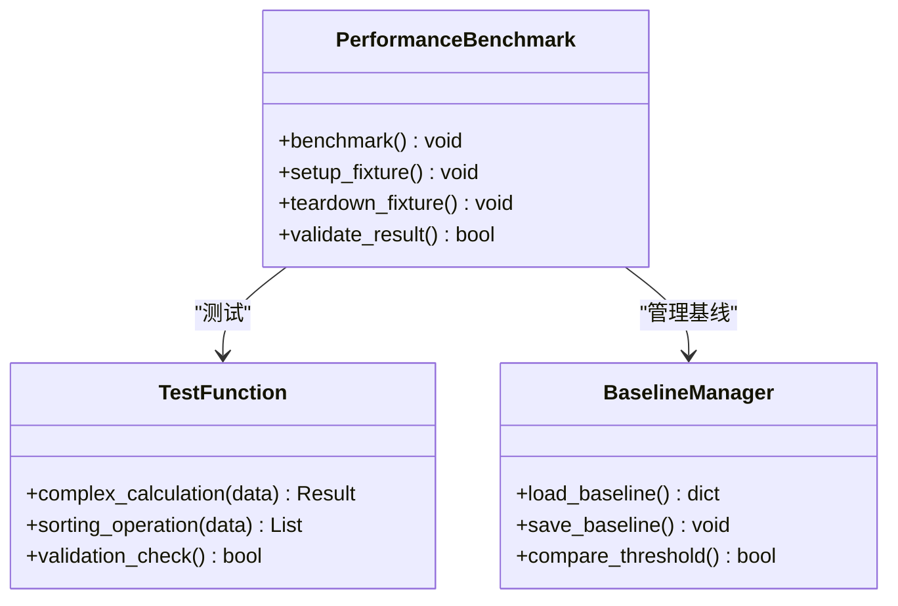

**图表来源**
- [性能测试参考:46-102](file://altas-workflow/references/testing/performance-testing.md#L46-L102)

#### 基线管理策略

基线管理采用 JSON 文件存储，支持版本化管理和自动比较：

| 基线操作 | 命令 | 功能描述 |
|---------|------|---------|
| 保存基线 | `--benchmark-save=baseline` | 保存当前测试结果为基线 |
| 自动保存 | `--benchmark-autosave` | 自动保存基线文件 |
| 比较基线 | `--benchmark-compare=0001` | 与指定基线进行对比 |
| 导出结果 | `--benchmark-json=benchmark.json` | 导出 JSON 格式结果 |

**章节来源**
- [性能测试参考:64-102](file://altas-workflow/references/testing/performance-testing.md#L64-L102)

### API 级负载测试

#### Locust 负载测试实现

Locust 提供了强大的分布式负载测试能力，支持多种并发场景：

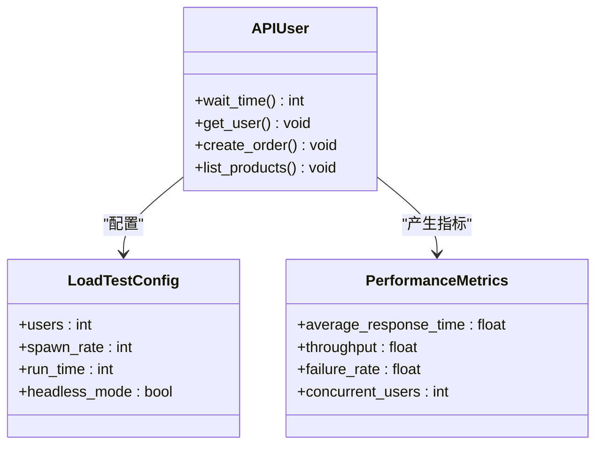

**图表来源**
- [性能测试参考:114-181](file://altas-workflow/references/testing/performance-testing.md#L114-L181)

#### k6 跨语言负载测试

k6 提供了更灵活的跨语言测试能力，特别适合微服务架构：

| 测试阶段 | 配置参数 | 目标值 |
|---------|---------|-------|
| 热身阶段 | `duration: '30s'` | 20 并发用户 |
| 负载阶段 | `duration: '2m'` | 100 并发用户 |
| 冷却阶段 | `duration: '30s'` | 0 并发用户 |

**章节来源**
- [性能测试参考:182-214](file://altas-workflow/references/testing/performance-testing.md#L182-L214)

### 性能回归检测策略

#### 基线建立与阈值设定

性能回归检测采用多维度阈值策略：

| 指标类型 | 警告阈值 | 严重阈值 | 检测逻辑 |
|---------|---------|---------|---------|
| P95 响应时间 | +20% vs 基线 | +50% vs 基线 | 时间序列对比 |
| 失败率 | > 0.5% | > 2% | 绝对值比较 |
| 内存使用 | +15% vs 基线 | +30% vs 基线 | 百分比变化 |
| CPU 使用 | +20% vs 基线 | +40% vs 基线 | 百分比变化 |

#### CI 集成实现

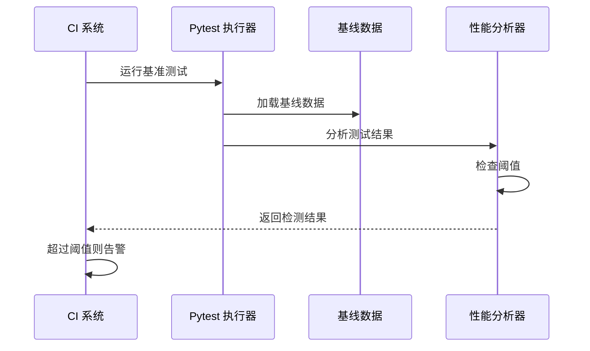

**图表来源**
- [性能测试参考:237-269](file://altas-workflow/references/testing/performance-testing.md#L237-L269)

**章节来源**
- [性能测试参考:217-269](file://altas-workflow/references/testing/performance-testing.md#L217-L269)

### 性能测试数据与隔离

#### 测试数据准备策略

性能测试采用专用数据集，避免与其他测试相互影响：

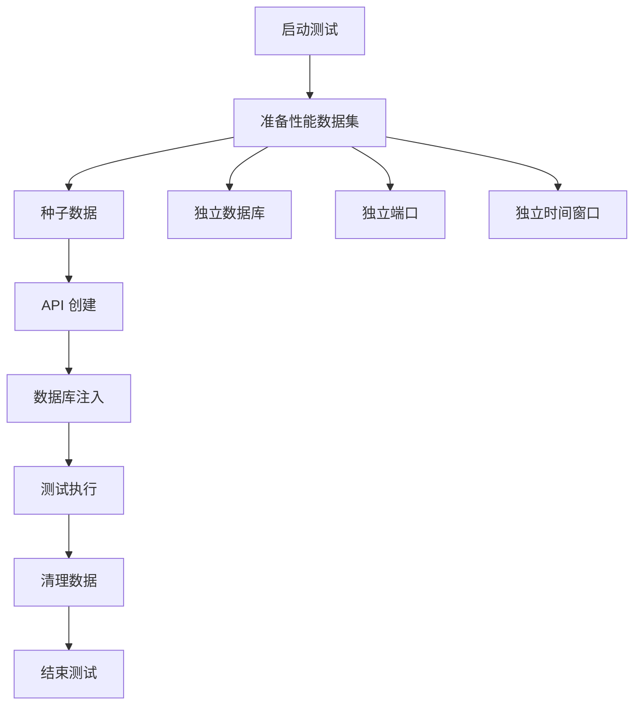

**图表来源**
- [性能测试参考:274-292](file://altas-workflow/references/testing/performance-testing.md#L274-L292)

**章节来源**
- [性能测试参考:272-292](file://altas-workflow/references/testing/performance-testing.md#L272-L292)

### 性能测试报告标准化

#### 报告模板结构

标准化的性能测试报告包含以下关键要素：

| 报告部分 | 内容要点 | 输出格式 |
|---------|---------|---------|
| 基本信息 | 测试日期、环境、并发用户 | 文本描述 |
| 结果摘要 | P50/P95/P99 响应时间、吞吐量、失败率 | 表格对比 |
| 详细结果 | 原始测试数据、统计指标 | JSON/CSV |
| 结论 | 性能状态、改进建议 | 文本分析 |

**章节来源**
- [性能测试参考:295-324](file://altas-workflow/references/testing/performance-testing.md#L295-L324)

## 依赖关系分析

### 测试工具依赖矩阵

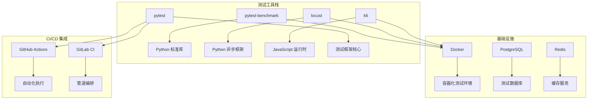

**图表来源**
- [CI/CD 集成指南:18-145](file://altas-workflow/references/testing/ci-cd-integration.md#L18-L145)
- [性能测试参考:327-384](file://altas-workflow/references/testing/performance-testing.md#L327-L384)

### 性能测试生命周期

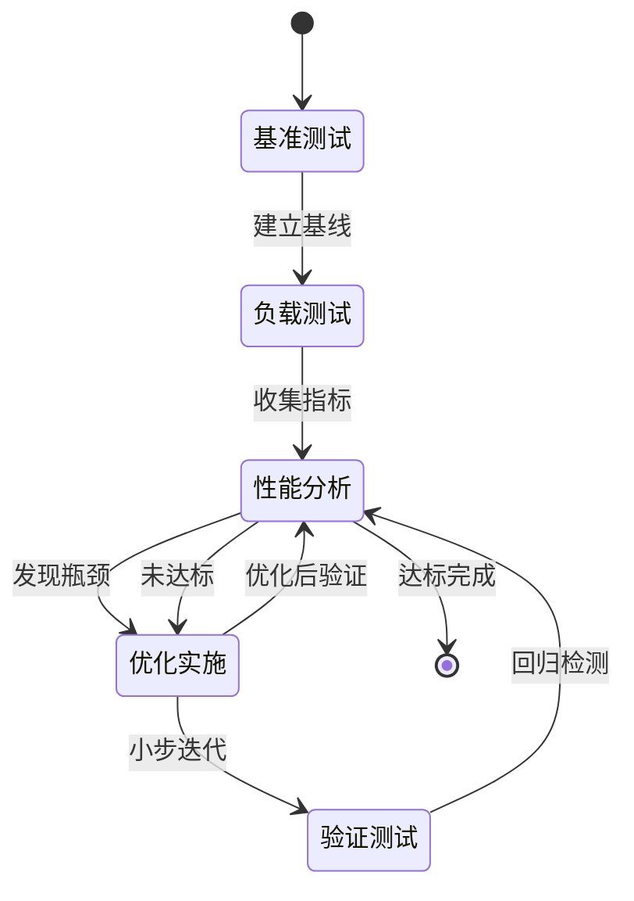

**图表来源**
- [性能模式协议:129-145](file://altas-workflow/references/special-modes/perf.md#L129-L145)

**章节来源**
- [CI/CD 集成指南:1-800](file://altas-workflow/references/testing/ci-cd-integration.md#L1-L800)
- [性能模式协议:1-234](file://altas-workflow/references/special-modes/perf.md#L1-L234)

## 性能考虑

### 测试执行优化

#### 并行化策略

项目采用多层次的并行化策略来优化测试执行效率：

| 并行化级别 | 实现方式 | 性能收益 |
|-----------|---------|---------|
| 测试级别 | pytest-xdist | 2-4x 加速 |
| 数据级别 | 独立数据库连接 | 无冲突执行 |
| 环境级别 | Docker 容器隔离 | 资源独立 |
| CI 级别 | 多作业并行 | 端到端缩短 |

#### 缓存策略

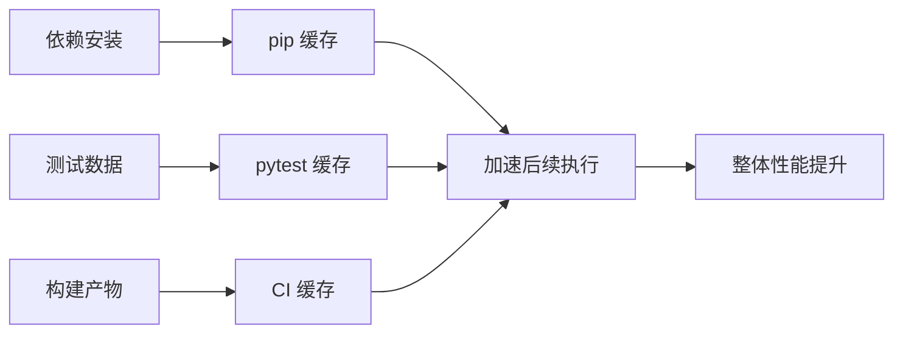

**章节来源**
- [CI/CD 集成指南:384-505](file://altas-workflow/references/testing/ci-cd-integration.md#L384-L505)

### 资源管理

#### 性能测试资源配置

| 资源类型 | 配置策略 | 监控指标 |
|---------|---------|---------|
| CPU 资源 | 限制并发用户数 | 使用率、响应时间 |
| 内存资源 | 设置最大堆大小 | 内存占用、GC 次数 |
| 网络资源 | 控制请求频率 | 吞吐量、延迟 |
| 存储资源 | 独立测试数据库 | I/O 延迟、连接数 |

## 故障排除指南

### 常见性能问题诊断

#### 基准测试异常

| 问题类型 | 诊断方法 | 解决方案 |
|---------|---------|---------|
| 结果不稳定 | 检查硬件环境一致性 | 使用固定配置服务器 |
| 基线偏差 | 验证测试数据完整性 | 重新生成测试数据集 |
| 工具兼容性 | 检查依赖版本 | 更新到兼容版本 |
| 内存泄漏 | 监控进程内存使用 | 优化测试代码 |

#### 负载测试失败

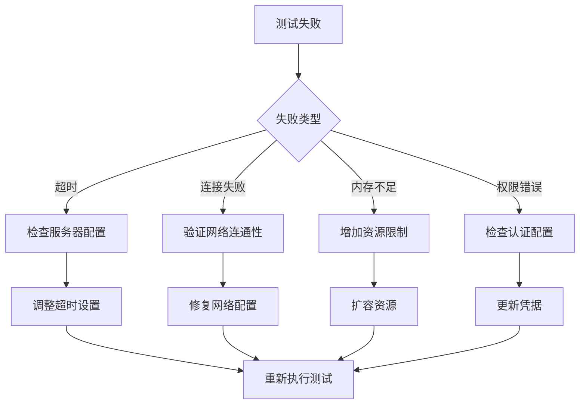

**图表来源**
- [性能测试参考:151-181](file://altas-workflow/references/testing/performance-testing.md#L151-L181)

**章节来源**
- [性能测试参考:106-181](file://altas-workflow/references/testing/performance-testing.md#L106-L181)

### CI/CD 集成问题

#### 性能测试作业失败

| 失败场景 | 检查点 | 处理步骤 |
|---------|---------|---------|
| 依赖安装失败 | 检查网络连接 | 使用代理或离线包 |
| 服务启动超时 | 验证健康检查 | 增加等待时间 |
| 内存不足 | 监控资源使用 | 调整容器资源限制 |
| 报告生成失败 | 检查磁盘空间 | 清理临时文件 |

**章节来源**
- [CI/CD 集成指南:384-800](file://altas-workflow/references/testing/ci-cd-integration.md#L384-L800)

## 结论

Altas 项目的性能/负载测试方法论建立了完整的测试体系，通过自动化、可重复性和回归检测确保了软件性能的持续改进。该方法论的核心优势包括：

1. **分层测试策略**：从单元级到系统级的完整覆盖
2. **自动化执行**：CI/CD 流水线深度集成
3. **标准化报告**：统一的性能指标和评估标准
4. **持续优化**：基于基线的持续性能改进循环

通过遵循这套方法论，团队可以建立可靠的性能测试体系，及时发现和解决性能问题，确保系统的高性能运行。