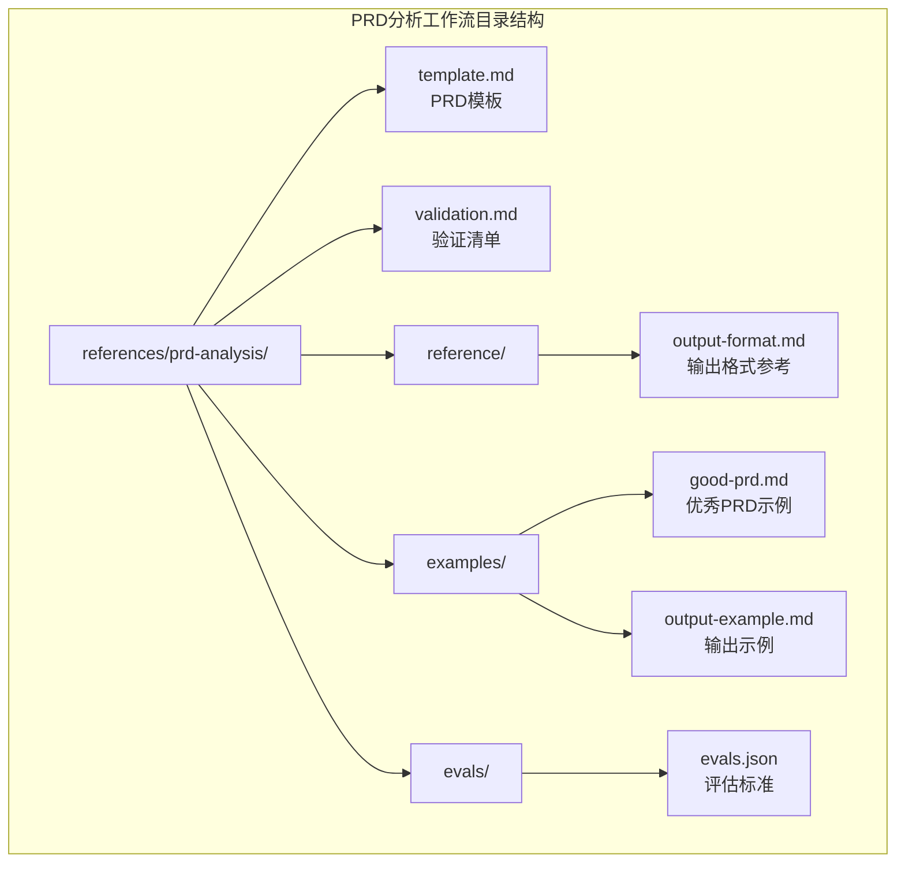
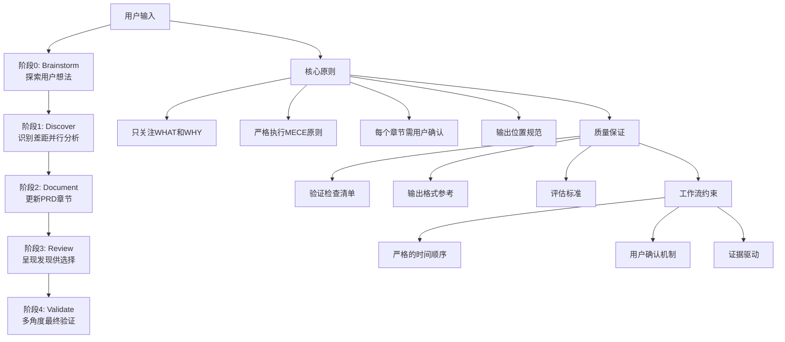
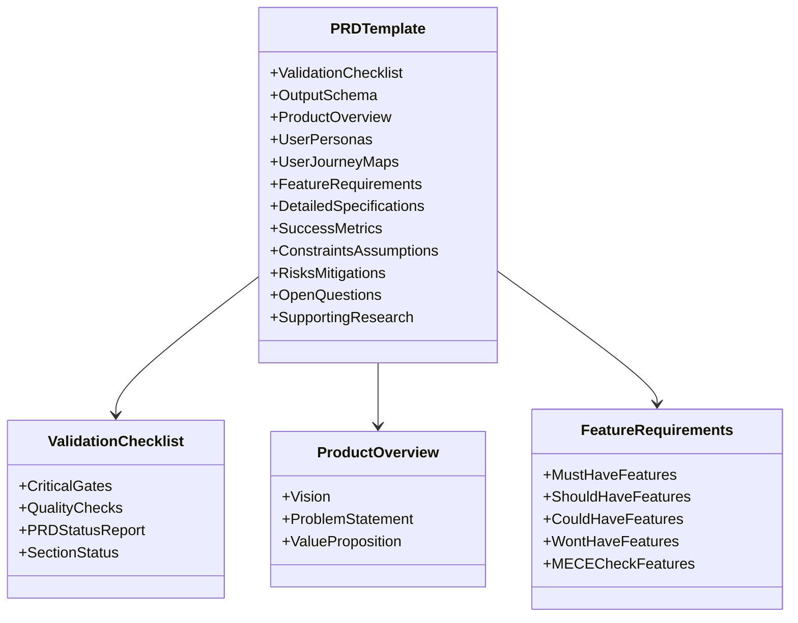
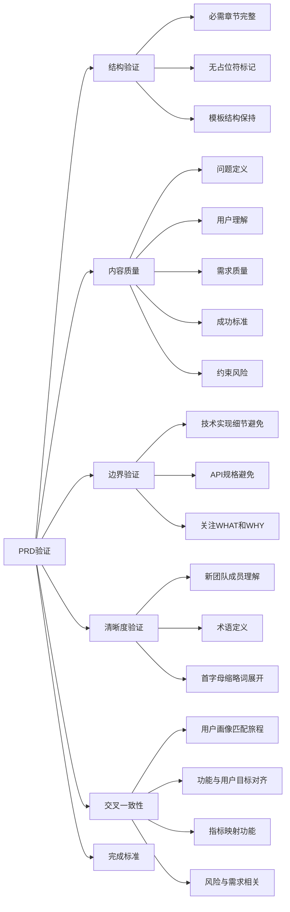
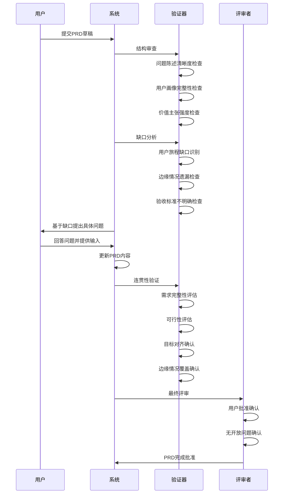
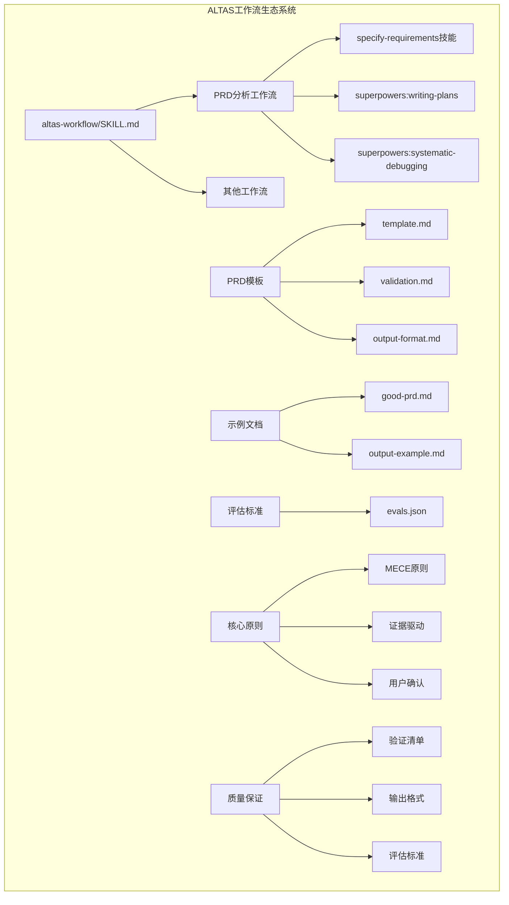
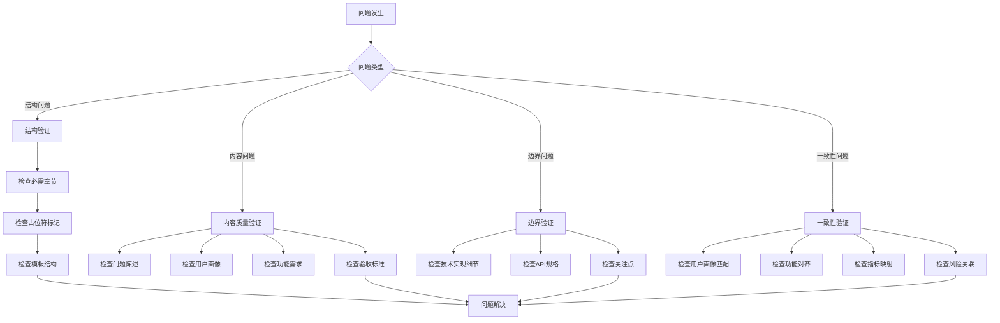

# PRD分析工作流

<cite>
**本文档引用的文件**
- [altas-workflow/SKILL.md](file://altas-workflow/SKILL.md)
- [prd-analysis/template.md](file://altas-workflow/references/prd-analysis/template.md)
- [prd-analysis/reference/output-format.md](file://altas-workflow/references/prd-analysis/reference/output-format.md)
- [prd-analysis/validation.md](file://altas-workflow/references/prd-analysis/validation.md)
- [prd-analysis/examples/good-prd.md](file://altas-workflow/references/prd-analysis/examples/good-prd.md)
- [prd-analysis/examples/output-example.md](file://altas-workflow/references/prd-analysis/examples/output-example.md)
- [prd-analysis/evals/evals.json](file://altas-workflow/references/prd-analysis/evals/evals.json)
</cite>

## 目录
1. [简介](#简介)
2. [项目结构](#项目结构)
3. [核心组件](#核心组件)
4. [架构概览](#架构概览)
5. [详细组件分析](#详细组件分析)
6. [依赖关系分析](#依赖关系分析)
7. [性能考虑](#性能考虑)
8. [故障排除指南](#故障排除指南)
9. [结论](#结论)

## 简介

PRD分析工作流是ALTAS Workflow生态系统中的一个专门技能，用于指导用户完成产品需求文档（PRD）的分析、创建和验证过程。该工作流采用结构化的RIPER方法论（Research → Innovate → Plan → Execute → Review），确保PRD文档的质量和完整性。

该工作流专注于"WHAT"（构建什么）和"Why"（为什么重要），严格避免涉及"How"（技术实现细节）。它通过严格的MECE原则（互斥且穷尽）验证用户画像、旅程、功能和验收标准，确保PRD文档的逻辑性和完整性。

## 项目结构

PRD分析工作流位于ALTAS项目的`altas-workflow/references/prd-analysis/`目录下，包含以下关键组件：

**图表来源**
- [altas-workflow/SKILL.md:498-517](file://altas-workflow/SKILL.md#L498-L517)

**章节来源**
- [altas-workflow/SKILL.md:27-31](file://altas-workflow/SKILL.md#L27-L31)

## 核心组件

### PRD模板系统

PRD模板提供了完整的文档结构框架，包含220行的标准模板内容。该模板采用Markdown格式，确保文档的一致性和可读性。

**关键特性：**
- **验证检查清单**：包含关键质量门禁（Critical Gates）和质量检查（Quality Checks）
- **输出模式**：定义了PRD状态报告的数据结构
- **完整章节结构**：涵盖产品概述、用户画像、用户旅程、功能需求等核心部分

### 验证清单系统

验证清单提供了PRD质量评估的标准化框架，包含70行的详细检查标准。

**验证维度：**
- **结构验证**：确保所有必需章节完整且无占位符
- **内容质量**：问题定义、用户理解、需求质量、成功标准
- **边界验证**：避免技术实现细节和技术规格
- **清晰度验证**：确保新团队成员能够理解
- **交叉一致性**：各章节间的逻辑一致性检查

### 输出格式参考

输出格式参考文档提供了PRD输出的多角度验证框架，包含37行的指导原则。

**验证框架：**
- **多角度最终验证**：上下文审查、缺口分析、用户输入、连贯性验证
- **结构审查**：问题陈述清晰度、用户画像完整性、价值主张强度
- **缺口识别**：用户旅程缺口、遗漏的边缘情况、不明确的验收标准
- **一致性确认**：需求完整性、可行性评估、目标对齐、边缘情况覆盖

**章节来源**
- [prd-analysis/template.md:1-220](file://altas-workflow/references/prd-analysis/template.md#L1-L220)
- [prd-analysis/validation.md:1-70](file://altas-workflow/references/prd-analysis/validation.md#L1-L70)
- [prd-analysis/reference/output-format.md:1-37](file://altas-workflow/references/prd-analysis/reference/output-format.md#L1-L37)

## 架构概览

PRD分析工作流采用分层架构设计，通过严格的阶段划分确保文档质量：

**图表来源**
- [altas-workflow/SKILL.md:498-511](file://altas-workflow/SKILL.md#L498-L511)

### 核心工作流阶段

每个阶段都有明确的目标、输出和质量标准：

**阶段0：Brainstorm（头脑风暴）**
- 探询用户想法，明确问题、用户、约束、成功标准、范围边界
- 通过开放式讨论收集需求信息

**阶段1：Discover（发现）**
- 识别已知与模板需求差距
- 并行启动市场分析、用户调研、需求澄清
- 系统性地收集相关信息

**阶段2：Document（文档化）**
- 更新PRD对应章节
- 替换`[NEEDS CLARIFICATION]`标记
- 基于发现的信息完善文档内容

**阶段3：Review（评审）**
- 呈现所有发现（含冲突信息）
- 用户选择：批准/澄清/重新发现
- 确保用户对内容的认可

**阶段4：Validate（验证）**
- 运行验证清单
- 多角度最终验证
- 确保PRD达到发布标准

**章节来源**
- [altas-workflow/SKILL.md:498-511](file://altas-workflow/SKILL.md#L498-L511)

## 详细组件分析

### PRD模板结构分析

PRD模板采用了层次化的结构设计，确保文档的逻辑性和完整性：

**图表来源**
- [prd-analysis/template.md:9-56](file://altas-workflow/references/prd-analysis/template.md#L9-L56)
- [prd-analysis/template.md:59-220](file://altas-workflow/references/prd-analysis/template.md#L59-L220)

#### 关键数据结构

**PRD状态报告结构：**
- `specId`：规范标识符（NNN-name格式）
- `title`：功能标题
- `status`：文档就绪状态（DRAFT/IN_REVIEW/COMPLETE）
- `sections`：每个PRD部分的状态
- `clarificationsRemaining`：剩余的`[NEEDS CLARIFICATION]`标记数量

**章节状态结构：**
- `name`：章节名称
- `status`：当前状态（COMPLETE/NEEDS_CLARIFICATION/IN_PROGRESS）
- `detail`：需要澄清的内容或进行中的详情

### 验证清单深度分析

验证清单提供了多层次的质量保证框架：

**图表来源**
- [prd-analysis/validation.md:5-69](file://altas-workflow/references/prd-analysis/validation.md#L5-L69)

#### 内容质量维度详解

**问题定义质量：**
- 问题陈述必须具体且可测量
- 必须基于证据（数据、用户研究、市场分析）而非假设
- 逻辑叙述必须合理（背景→问题→解决方案）

**用户理解质量：**
- 每个用户画像必须包含人口统计信息、目标、痛点
- 每个用户必须至少有一个用户旅程
- 用户旅程必须涵盖主要路径和错误/恢复路径

**需求质量：**
- 必须涵盖所有MoSCoW分类（Must/Should/Could/Won't）
- 每个功能必须有用户故事
- 每个功能必须有可测试的验收标准
- 无功能冗余和相互矛盾

**章节来源**
- [prd-analysis/validation.md:11-62](file://altas-workflow/references/prd-analysis/validation.md#L11-L62)

### 输出格式参考分析

输出格式参考文档提供了PRD输出的多角度验证框架：

**图表来源**
- [prd-analysis/reference/output-format.md:7-37](file://altas-workflow/references/prd-analysis/reference/output-format.md#L7-L37)

#### 多角度验证框架

**上下文审查：**
- 问题陈述清晰度检查
- 用户画像完整性验证
- 价值主张强度评估

**缺口分析：**
- 用户旅程缺口识别
- 边缘情况遗漏检测
- 验收标准不明确识别
- 章节间矛盾发现

**用户输入：**
- 基于缺口制定具体问题
- 探索替代场景
- 验证优先级权衡
- 确认成功标准

**连贯性验证：**
- 需求完整性确认
- 可行性评估
- 目标对齐验证
- 边缘情况覆盖确认

**章节来源**
- [prd-analysis/reference/output-format.md:1-37](file://altas-workflow/references/prd-analysis/reference/output-format.md#L1-L37)

### 评估标准分析

评估标准JSON文件定义了PRD工作的质量期望：

```mermaid
graph TB
A[评估标准] --> B[场景1<br/>实时通知系统]
A --> C[场景2<br/>CLI工具]
A --> D[场景3<br/>上下文不足]
A --> E[场景4<br/>继续现有PRD]
B --> B1[调用头脑风暴技能]
B --> B2[输出到requirements.md]
B --> B3[遵循模板结构]
B --> B4[无占位符标记]
B --> B5[定义2个不同用户画像]
B --> B6[MECE原则应用]
B --> B7[定义用户旅程]
B --> B8[MoSCoW优先级]
B --> B9[每个功能有验收标准]
B --> B10[无技术实现细节]
B --> B11[章节间确认]
B --> B12[运行验证清单]
C --> C1[用户画像反映实际用户]
C --> C2[用户旅程描述CLI调用模式]
C --> C3[验收标准可通过CLI输出验证]
C --> C4[无UI特定语言]
C --> C5[功能地址错误处理]
D --> D1[调用头脑风暴探索意图]
D --> D2[询问澄清问题]
D --> D3[不假设范围]
D --> D4[等待用户响应]
E --> E1[从spec目录读取现有PRD]
E --> E2[识别占位符标记]
E --> E3[通过发现和用户交互解决]
E --> E4[不重写已完成部分]
E --> E5[替换所有标记]
```

**图表来源**
- [prd-analysis/evals/evals.json:1-64](file://altas-workflow/references/prd-analysis/evals/evals.json#L1-L64)

#### 评估场景详解

**场景1：实时通知系统**
- 要求调用头脑风暴技能探索需求
- 输出必须遵循模板结构
- 确保无占位符标记
- 定义至少2个不同用户画像
- 应用MECE原则
- 定义用户旅程
- 使用MoSCoW优先级
- 每个功能都有验收标准
- 避免技术实现细节
- 在章节间确认后继续
- 运行验证清单

**场景2：CLI工具**
- 用户画像反映实际用户（DevOps工程师、DBA）
- 用户旅程描述CLI调用模式
- 验收标准可通过命令行输出、退出码和日志文件验证
- 无UI特定语言
- 功能地址错误处理、幂等性和恢复

**场景3：上下文不足**
- 调用头脑风暴探索用户意图
- 询问关于目标用户、规模和关键功能的澄清问题
- 不假设范围
- 等待用户响应后再继续

**场景4：继续现有PRD**
- 从spec目录读取现有PRD
- 识别3个占位符标记
- 通过发现和用户交互解决每个标记
- 不重写已完成部分
- 替换所有标记

**章节来源**
- [prd-analysis/evals/evals.json:1-64](file://altas-workflow/references/prd-analysis/evals/evals.json#L1-L64)

## 依赖关系分析

PRD分析工作流与其他ALTAS组件存在紧密的依赖关系：

**图表来源**
- [altas-workflow/SKILL.md:57-57](file://altas-workflow/SKILL.md#L57-L57)

### 核心依赖关系

**技能依赖：**
- `specify-requirements`：PRD分析的核心技能
- `superpowers:writing-plans`：计划编写能力
- `superpowers:systematic-debugging`：系统性调试能力

**文档依赖：**
- `template.md`：PRD模板基础
- `validation.md`：验证标准
- `output-format.md`：输出格式规范

**示例依赖：**
- `good-prd.md`：优秀PRD示例
- `output-example.md`：输出示例

**评估依赖：**
- `evals.json`：质量评估标准

### 质量保证机制

PRD分析工作流通过多层次的质量保证机制确保文档质量：

**证据驱动验证：**
- 所有结论必须有证据支持
- 通过测试、日志、构建、运行结果或代码证据证明
- 不依赖自我宣称

**用户确认机制：**
- 每个章节完成后需用户确认
- 用户选择批准、澄清或重新发现
- 确保用户对内容的认可

**MECE原则应用：**
- 用户画像互斥且穷尽
- 用户旅程互斥且穷尽
- 功能互斥且穷尽
- 验收标准互斥且穷尽

**章节来源**
- [altas-workflow/SKILL.md:86-89](file://altas-workflow/SKILL.md#L86-L89)
- [altas-workflow/SKILL.md:506-509](file://altas-workflow/SKILL.md#L506-L509)

## 性能考虑

PRD分析工作流在设计时充分考虑了性能和效率因素：

### 时间效率优化

**并行分析能力：**
- 阶段1中市场分析、用户调研、需求澄清可以并行进行
- 减少整体分析时间
- 提高信息收集效率

**渐进式验证：**
- 每个阶段完成后进行验证
- 及早发现问题，避免后期大量返工
- 降低整体开发成本

### 质量效率平衡

**MECE原则的应用：**
- 通过严格的互斥和穷尽原则减少重复工作
- 避免功能重叠和遗漏
- 提高需求分析的准确性

**用户确认机制：**
- 每个章节的用户确认确保需求的准确性
- 减少后期需求变更的风险
- 提高开发效率

### 资源优化策略

**模板化设计：**
- 标准化的PRD模板减少模板设计时间
- 统一的验证标准提高验证效率
- 规范化的输出格式便于管理

**评估标准指导：**
- 明确的评估标准指导工作流程
- 减少不确定性带来的额外工作
- 提高工作质量的一致性

## 故障排除指南

### 常见问题及解决方案

**问题1：PRD文档包含技术实现细节**
- **症状**：文档中出现数据库设计、API规格、代码示例
- **原因**：违反了"关注WHAT和WHY，而非HOW"的原则
- **解决方案**：严格按照边界验证清单检查，删除技术实现细节

**问题2：用户画像重叠或不完整**
- **症状**：两个用户画像描述相同角色或动机
- **原因**：未严格执行MECE原则
- **解决方案**：重新定义用户画像，确保互斥且穷尽

**问题3：验收标准不明确或不可测试**
- **症状**：验收标准模糊或无法验证
- **原因**：缺乏具体的、可验证的条件
- **解决方案**：使用Gherkin格式（Given/When/Then）定义明确的验收标准

**问题4：PRD包含占位符标记**
- **症状**：文档中仍有`[NEEDS CLARIFICATION]`标记
- **原因**：未完成所有必要信息的收集
- **解决方案**：通过发现阶段收集必要信息，替换所有占位符

### 质量检查清单

**结构完整性检查：**
- [ ] 所有必需章节完整
- [ ] 无占位符标记
- [ ] 模板结构保持

**内容质量检查：**
- [ ] 问题陈述具体且可测量
- [ ] 用户画像完整且互斥
- [ ] 功能需求使用MoSCoW分类
- [ ] 每个功能有可测试的验收标准

**边界控制检查：**
- [ ] 无技术实现细节
- [ ] 无API规格
- [ ] 专注WHAT和WHY

**章节一致性检查：**
- [ ] 用户画像与用户旅程匹配
- [ ] 功能与用户目标对齐
- [ ] 指标映射到功能
- [ ] 风险与需求相关

**章节来源**
- [prd-analysis/validation.md:1-70](file://altas-workflow/references/prd-analysis/validation.md#L1-L70)

### 验证流程

当遇到问题时，按照以下流程进行验证：

## 结论

PRD分析工作流是一个高度结构化和标准化的需求分析框架，通过严格的RIPER方法论和质量保证机制，确保PRD文档的质量和完整性。该工作流的核心优势包括：

**系统性方法论：**
- 采用RIPER五阶段方法论，确保需求分析的全面性
- 每个阶段都有明确的目标和输出
- 严格的用户确认机制保证需求准确性

**质量保证体系：**
- 多层次的验证清单确保文档质量
- MECE原则确保需求的互斥性和穷尽性
- 证据驱动的方法确保结论的可靠性

**实用性强：**
- 标准化的模板和格式便于使用
- 清晰的评估标准指导工作流程
- 完善的示例和最佳实践提供参考

**持续改进：**
- 基于评估标准不断优化工作流程
- 通过用户反馈持续改进质量标准
- 适应不同类型的项目需求

该工作流为产品需求文档的创建提供了科学、系统的方法论指导，有助于提高需求分析的质量和效率，为后续的技术规格制定和开发实施奠定坚实基础。