# pytest测试模式参考

<cite>
**本文档引用的文件**
- [pytest-patterns.md](file://altas-workflow/references/testing/pytest-patterns.md)
- [conftest.py](file://altas-workflow/references/testing/templates/conftest.py)
- [factories.py](file://altas-workflow/references/testing/templates/factories.py)
- [api_client_fixture.py](file://altas-workflow/references/testing/templates/api_client_fixture.py)
- [auth_fixture.py](file://altas-workflow/references/testing/templates/auth_fixture.py)
- [db_rollback_fixture.py](file://altas-workflow/references/testing/templates/db_rollback_fixture.py)
- [pytest_config.toml](file://altas-workflow/references/testing/templates/pytest_config.toml)
- [api_test_matrix.md](file://altas-workflow/references/testing/templates/api_test_matrix.md)
- [test-data-management.md](file://altas-workflow/references/testing/test-data-management.md)
- [test-scaffold-templates.md](file://altas-workflow/references/testing/test-scaffold-templates.md)
</cite>

## 更新摘要
**变更内容**
- 新增AI/ML集成测试章节，涵盖非确定性测试策略、LLM API Mock策略、Prompt测试模式和成本限制测试
- 新增跨平台测试章节，包括跨平台标记、路径分隔符差异、行尾符差异和文件系统权限差异处理
- 增强夹具管理策略，补充测试数据隔离策略、并发测试数据处理和性能优化技巧
- 完善测试模板系统，新增数据库回滚夹具、测试配置模板和API测试矩阵模板
- 扩展测试脚手架模板，提供从契约文件展开测试计划的完整工作流

## 目录
1. [简介](#简介)
2. [项目结构](#项目结构)
3. [核心组件](#核心组件)
4. [架构概览](#架构概览)
5. [详细组件分析](#详细组件分析)
6. [AI/ML集成测试](#aiml集成测试)
7. [跨平台测试](#跨平台测试)
8. [增强夹具管理策略](#增强夹具管理策略)
9. [依赖分析](#依赖分析)
10. [性能考虑](#性能考虑)
11. [故障排除指南](#故障排除指南)
12. [结论](#结论)

## 简介

本文件是pytest测试模式的综合参考文档，基于Altas工作流中的测试基础设施构建。该文档提供了完整的pytest测试开发指南，包括测试模式、fixture设计、参数化测试、mock技术、测试组织结构等核心主题。

pytest作为Python生态系统中最流行的测试框架之一，提供了强大的测试发现、执行和报告功能。在Altas工作流中，pytest被广泛应用于单元测试、集成测试和端到端测试场景。

**更新** 新增了AI/ML集成测试和跨平台测试两大核心领域，以及增强的夹具管理策略，为现代软件测试提供了更全面的指导。

## 项目结构

Altas工作流中的测试基础设施采用模块化设计，主要包含以下核心组件：

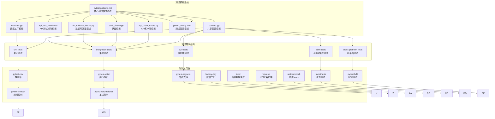

**图表来源**
- [pytest-patterns.md:261-284](file://altas-workflow/references/testing/pytest-patterns.md#L261-L284)
- [conftest.py:15-49](file://altas-workflow/references/testing/templates/conftest.py#L15-L49)
- [factories.py:1-50](file://altas-workflow/references/testing/templates/factories.py#L1-L50)
- [api_client_fixture.py:1-57](file://altas-workflow/references/testing/templates/api_client_fixture.py#L1-L57)
- [auth_fixture.py:1-51](file://altas-workflow/references/testing/templates/auth_fixture.py#L1-L51)
- [db_rollback_fixture.py:1-43](file://altas-workflow/references/testing/templates/db_rollback_fixture.py#L1-L43)
- [pytest_config.toml:1-73](file://altas-workflow/references/testing/templates/pytest_config.toml#L1-L73)
- [api_test_matrix.md:1-29](file://altas-workflow/references/testing/templates/api_test_matrix.md#L1-L29)

**章节来源**
- [pytest-patterns.md:261-284](file://altas-workflow/references/testing/pytest-patterns.md#L261-L284)
- [conftest.py:15-49](file://altas-workflow/references/testing/templates/conftest.py#L15-L49)

## 核心组件

### 测试模式基础

pytest测试遵循AAA（Arrange-Act-Assert）模式，强调测试的可读性和可维护性。核心原则包括：

1. **单一职责原则**：每个测试只验证一个具体的行为
2. **独立性**：测试之间不依赖执行顺序
3. **纯断言**：使用标准的assert语句而非特殊断言方法
4. **明确的命名**：测试名称应清晰描述预期行为

### Fixture系统

Fixture是pytest的核心概念，提供测试所需的依赖注入机制。支持多种作用域级别：

| 作用域 | 创建频率 | 适用场景 |
|--------|----------|----------|
| function | 每个测试函数 | 需要隔离状态的测试 |
| class | 每个测试类 | 类内共享资源 |
| module | 每个测试模块 | 模块级配置 |
| session | 整个测试会话 | 数据库连接、API客户端 |

**更新** 新增了测试运行元数据和环境重置机制，确保测试的确定性和可重复性。

**章节来源**
- [pytest-patterns.md:9-15](file://altas-workflow/references/testing/pytest-patterns.md#L9-L15)
- [pytest-patterns.md:34-58](file://altas-workflow/references/testing/pytest-patterns.md#L34-L58)
- [conftest.py:34-49](file://altas-workflow/references/testing/templates/conftest.py#L34-L49)

## 架构概览

Altas工作流的测试架构采用分层设计，确保测试的可扩展性和可维护性：

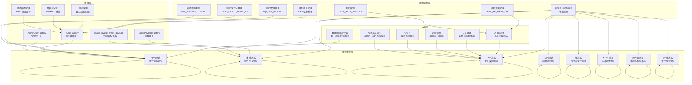

**图表来源**
- [conftest.py:15-49](file://altas-workflow/references/testing/templates/conftest.py#L15-L49)
- [factories.py:16-50](file://altas-workflow/references/testing/templates/factories.py#L16-L50)
- [api_client_fixture.py:14-57](file://altas-workflow/references/testing/templates/api_client_fixture.py#L14-L57)
- [auth_fixture.py:10-51](file://altas-workflow/references/testing/templates/auth_fixture.py#L10-L51)
- [db_rollback_fixture.py:15-43](file://altas-workflow/references/testing/templates/db_rollback_fixture.py#L15-L43)

## 详细组件分析

### 共享配置模板 (conftest.py)

共享配置模板提供了测试运行的基础设置，包括标记注册、环境变量管理和自动重置机制。

#### 标记系统设计

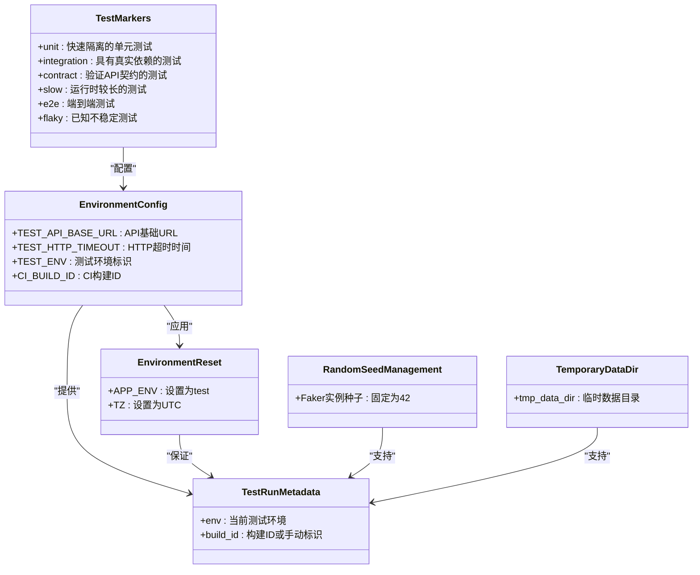

**图表来源**
- [conftest.py:15-49](file://altas-workflow/references/testing/templates/conftest.py#L15-L49)

#### 自动环境重置机制

共享配置模板实现了自动环境重置功能，确保测试的确定性和可重复性：

- **环境变量标准化**：统一设置APP_ENV为test，TZ为UTC
- **会话级fixture**：在整个测试会话期间保持一致的配置
- **自动清理**：测试完成后自动恢复原始环境状态
- **测试元数据暴露**：为日志记录和报告提供运行时信息
- **随机种子管理**：固定Faker实例种子确保测试可重复性

**更新** 新增了测试运行元数据功能，支持日志记录、报告增强和追踪头信息。

**章节来源**
- [conftest.py:15-49](file://altas-workflow/references/testing/templates/conftest.py#L15-L49)

### 数据工厂模板 (factories.py)

数据工厂模板基于factory_boy和Faker库，提供灵活的测试数据生成机制。

#### 工厂继承体系

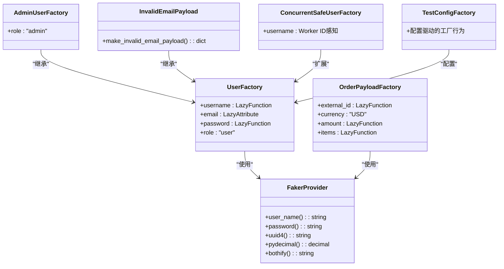

**图表来源**
- [factories.py:16-50](file://altas-workflow/references/testing/templates/factories.py#L16-L50)

#### 高级工厂模式

数据工厂支持多种高级模式：

- **继承模式**：通过继承基础工厂创建特化工厂
- **惰性属性**：使用LazyAttribute延迟计算复杂属性
- **复合数据**：生成包含多个子对象的复杂数据结构
- **无效数据构造**：专门生成边界条件和异常输入
- **并发安全**：Worker ID感知的工厂模式
- **配置驱动**：基于YAML配置的工厂行为定制

**更新** 新增了DictFactory模式，更适合API和服务测试场景。

**章节来源**
- [factories.py:16-50](file://altas-workflow/references/testing/templates/factories.py#L16-L50)

### API客户端模板 (api_client_fixture.py)

API客户端模板提供了HTTP客户端的封装，简化了API测试的编写。

#### HTTP客户端架构

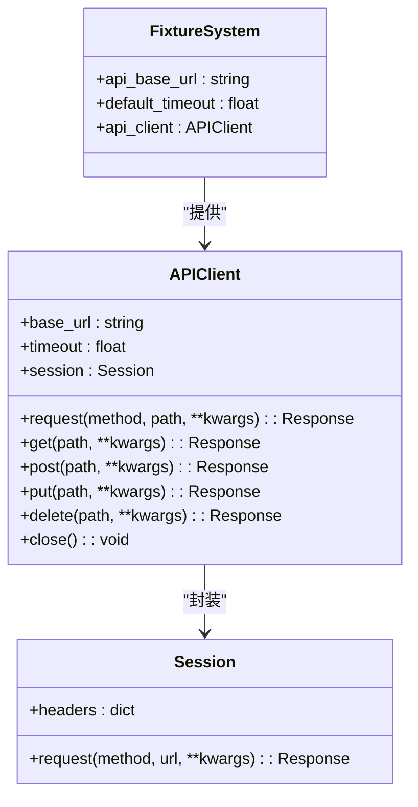

**图表来源**
- [api_client_fixture.py:14-57](file://altas-workflow/references/testing/templates/api_client_fixture.py#L14-L57)

#### 请求处理流程

API客户端实现了标准化的请求处理流程：

1. **URL规范化**：自动去除base_url末尾的斜杠
2. **头部设置**：统一设置Accept和Content-Type头部
3. **超时控制**：支持全局和单次请求的超时配置
4. **会话管理**：自动管理HTTP会话状态

**更新** 新增了完整的HTTP方法封装，包括GET、POST、PUT、DELETE等常用操作。

**章节来源**
- [api_client_fixture.py:14-57](file://altas-workflow/references/testing/templates/api_client_fixture.py#L14-L57)

### 认证模板 (auth_fixture.py)

认证模板提供了API测试中的认证机制，支持多种认证场景。

#### 认证流程序列

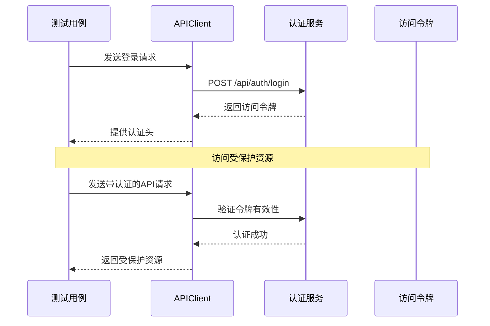

**图表来源**
- [auth_fixture.py:19-37](file://altas-workflow/references/testing/templates/auth_fixture.py#L19-L37)

#### 多角色认证支持

认证模板支持多角色认证场景：

- **标准用户认证**：使用TEST_USERNAME和TEST_PASSWORD环境变量
- **管理员认证**：提供独立的管理员凭据和权限头
- **令牌管理**：自动处理访问令牌的获取和更新
- **会话保持**：通过认证头在后续请求中保持会话状态

**更新** 新增了管理员认证头生成，支持权限矩阵测试场景。

**章节来源**
- [auth_fixture.py:10-51](file://altas-workflow/references/testing/templates/auth_fixture.py#L10-L51)

### 数据库回滚模板 (db_rollback_fixture.py)

数据库回滚模板提供了SQLAlchemy集成测试的事务回滚机制，确保测试数据的隔离性和可重复性。

#### 事务回滚架构

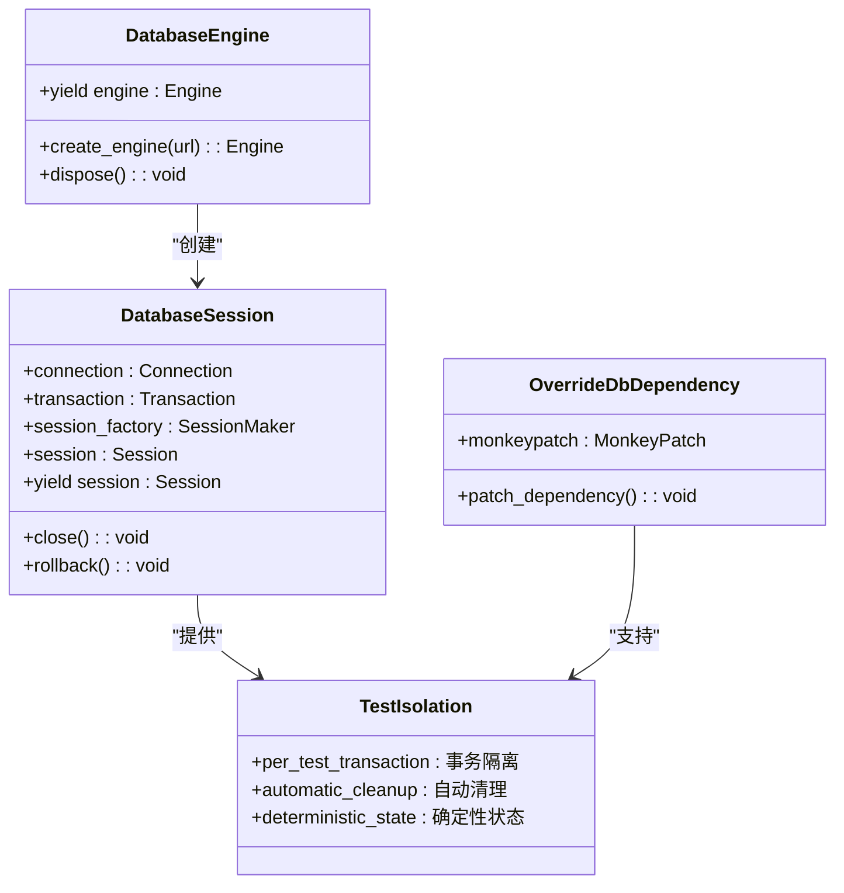

**图表来源**
- [db_rollback_fixture.py:15-43](file://altas-workflow/references/testing/templates/db_rollback_fixture.py#L15-L43)

#### 测试隔离策略

数据库回滚模板实现了三种级别的测试隔离策略：

1. **每测试事务**：每个测试包裹在独立事务中，测试结束后自动回滚
2. **自动清理**：测试完成后自动关闭连接和会话
3. **依赖注入**：通过monkeypatch替换框架的数据库依赖

**更新** 新增了依赖注入支持，允许测试框架无缝集成。

**章节来源**
- [db_rollback_fixture.py:15-43](file://altas-workflow/references/testing/templates/db_rollback_fixture.py#L15-L43)

### 测试配置模板 (pytest_config.toml)

测试配置模板提供了pytest的完整配置选项，支持各种测试场景的需求。

#### 配置选项体系

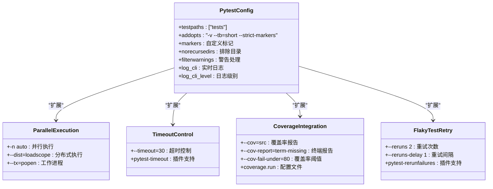

**图表来源**
- [pytest_config.toml:1-73](file://altas-workflow/references/testing/templates/pytest_config.toml#L1-L73)

#### 配置扩展选项

测试配置模板支持多种扩展配置：

- **并行执行**：使用pytest-xdist实现多进程并行测试
- **超时控制**：使用pytest-timeout防止无限等待
- **覆盖率集成**：使用pytest-cov生成覆盖率报告
- **不稳定测试重试**：使用pytest-rerunfailures处理间歇性失败

**更新** 新增了完整的配置扩展选项说明。

**章节来源**
- [pytest_config.toml:1-73](file://altas-workflow/references/testing/templates/pytest_config.toml#L1-L73)

### API测试矩阵模板 (api_test_matrix.md)

API测试矩阵模板提供了从契约文件展开测试计划的系统化方法。

#### 测试矩阵结构

```mermaid
classDiagram
class ContractSource {
+OpenAPI : YAML文件
+GraphQL : Schema文件
+gRPC : Proto文件
+Protocol : 协议类型
}
class TestMatrix {
| Contract Item | Source Ref | Priority | Happy Path | Validation | Auth | Idempotency | Error Path | Schema | Data / Fixture | Status | Notes |
|---------------|------------|----------|------------|------------|------|-------------|------------|--------|----------------|--------|-------|
| POST /orders | openapi.yaml | P0 | 201 create order | 422 invalid payload | 401/403 | same Key returns same result | 409 inventory conflict | response schema matches contract | order factory + auth fixture | planned | |
| GET /orders/{id} | openapi.yaml | P0 | 200 returns order | 404 nonexistent id | 401/403 | N/A | 500 masked internal error | response fields match contract | seeded order | planned | |
}
class PriorityMatrix {
+P0 : 关键功能
+P1 : 重要功能
+P2 : 次要功能
}
class TestCoverage {
+Happy Path : 正常流程
+Validation : 输入验证
+Auth : 认证授权
+Idempotency : 幂等性
+Error Path : 错误处理
+Schema : 响应模式
}
ContractSource --> TestMatrix : "提供契约"
PriorityMatrix --> TestMatrix : "优先级"
TestCoverage --> TestMatrix : "覆盖维度"
```

**图表来源**
- [api_test_matrix.md:14-29](file://altas-workflow/references/testing/templates/api_test_matrix.md#L14-L29)

#### 测试覆盖维度

API测试矩阵涵盖了全面的测试覆盖维度：

- **正常路径测试**：验证标准业务流程
- **输入验证测试**：测试边界条件和异常输入
- **认证授权测试**：验证权限控制机制
- **幂等性测试**：确保重复请求的一致性
- **错误路径测试**：验证错误处理和降级机制
- **响应模式测试**：验证数据结构和格式

**更新** 新增了完整的测试矩阵模板，支持从契约文件自动展开测试计划。

**章节来源**
- [api_test_matrix.md:14-29](file://altas-workflow/references/testing/templates/api_test_matrix.md#L14-L29)

## AI/ML集成测试

随着AI/ML技术在软件开发中的广泛应用，传统的测试方法已无法满足非确定性输出和复杂交互的需求。pytest测试模式扩展了AI/ML集成测试能力。

### 非确定性测试策略

AI/ML模型的输出具有一定的随机性，需要采用特殊的测试策略来验证其行为的一致性。

#### 输出格式验证

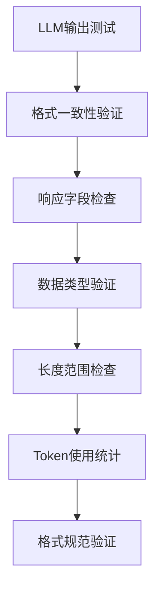

**图表来源**
- [pytest-patterns.md:839-858](file://altas-workflow/references/testing/pytest-patterns.md#L839-L858)

#### Token成本控制

AI/ML API通常按Token数量收费，需要在测试中验证成本控制机制：

- **总Token限制**：确保总使用量不超过预算
- **完成Token限制**：验证生成内容的长度控制
- **成本效益测试**：平衡输出质量和成本

**更新** 新增了完整的AI/ML集成测试策略，包括非确定性处理和成本控制。

**章节来源**
- [pytest-patterns.md:833-922](file://altas-workflow/references/testing/pytest-patterns.md#L833-L922)

### LLM API Mock策略

为了提高测试速度和稳定性，需要对LLM API进行有效的Mock处理。

#### Mock响应设计

```mermaid
classDiagram
class MockLLMResponse {
+choices : [{"message" : {"content" : "Mocked response"}}]
+usage : {"total_tokens" : 50}
+model : "gpt-3.5-turbo"
+created : timestamp
}
class TestScenario {
+test_chat_with_mock_llm : 使用Mock测试业务逻辑
+test_summarization_with_mock : 测试摘要功能
+test_translation_with_mock : 测试翻译功能
}
class MockStrategy {
+unittest.mock.patch : 替换API调用
+MagicMock : 模拟响应对象
+side_effect : 控制响应行为
}
MockLLMResponse --> TestScenario : "提供数据"
MockStrategy --> TestScenario : "实现Mock"
```

**图表来源**
- [pytest-patterns.md:862-884](file://altas-workflow/references/testing/pytest-patterns.md#L862-L884)

#### Prompt模板测试

AI/ML应用中的Prompt模板质量直接影响模型输出效果，需要专门的测试策略：

- **模板完整性**：验证模板包含必要的上下文信息
- **参数占位符**：确保输入参数正确插入
- **安全检查**：防止系统指令泄露
- **格式验证**：确保输出格式符合预期

**更新** 新增了LLM API Mock策略和Prompt模板测试模式。

**章节来源**
- [pytest-patterns.md:860-907](file://altas-workflow/references/testing/pytest-patterns.md#L860-L907)

### 成本限制测试

AI/ML API的成本控制是生产环境中必须考虑的重要因素。

#### 成本监控机制

```mermaid
sequenceDiagram
participant Test as 测试用例
participant Client as API客户端
participant LLM : LLM服务
participant CostTracker : 成本跟踪器
Test->>Client : 发送长文本请求
Client->>LLM : 调用LLM API
LLM-->>Client : 返回响应和使用统计
Client->>CostTracker : 记录Token使用
CostTracker-->>Test : 验证成本限制
Note over Test,CostTracker : 成本控制验证
```

**图表来源**
- [pytest-patterns.md:911-922](file://altas-workflow/references/testing/pytest-patterns.md#L911-L922)

#### 成本优化测试

- **批量处理测试**：验证批量请求的成本效益
- **缓存机制测试**：确保重复请求的缓存命中
- **超时控制测试**：防止长时间运行的昂贵操作
- **降级策略测试**：验证低质量响应的成本控制

**更新** 新增了完整的成本限制测试策略，确保AI/ML应用的经济性。

**章节来源**
- [pytest-patterns.md:909-922](file://altas-workflow/references/testing/pytest-patterns.md#L909-L922)

## 跨平台测试

现代软件应用需要在多种操作系统和环境中运行，跨平台测试成为确保软件质量的关键环节。

### 跨平台标记系统

pytest提供了灵活的跨平台测试标记机制，可以根据操作系统特性选择性执行测试。

#### 平台特定测试

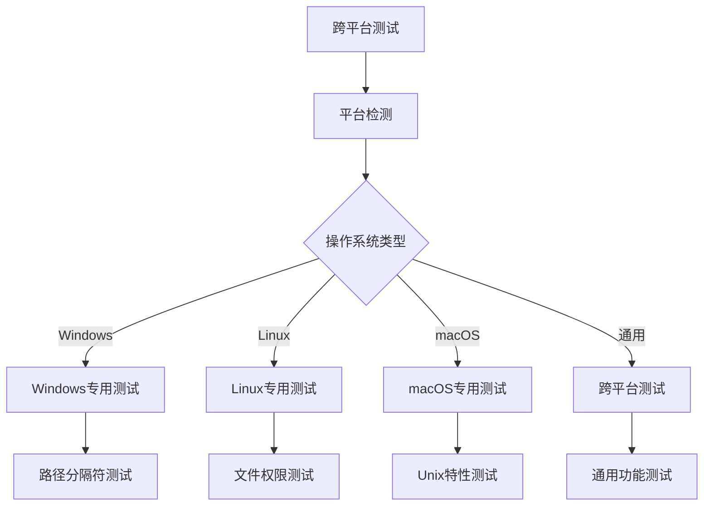

**图表来源**
- [pytest-patterns.md:932-947](file://altas-workflow/references/testing/pytest-patterns.md#L932-L947)

#### 平台差异处理

不同操作系统在文件系统、网络协议、进程管理等方面存在差异，需要针对性的测试策略：

- **路径分隔符**：使用`os.path.sep`或`pathlib`处理跨平台路径
- **行尾符**：使用`newline=None`处理不同操作系统的行尾符
- **文件权限**：Windows和Unix系统权限模型差异较大
- **环境变量**：不同平台的环境变量处理方式不同

**更新** 新增了完整的跨平台测试策略，包括标记系统和差异处理。

**章节来源**
- [pytest-patterns.md:926-1000](file://altas-workflow/references/testing/pytest-patterns.md#L926-L1000)

### 路径分隔符差异

文件路径处理是跨平台测试中最常见的问题之一。

#### 路径处理策略

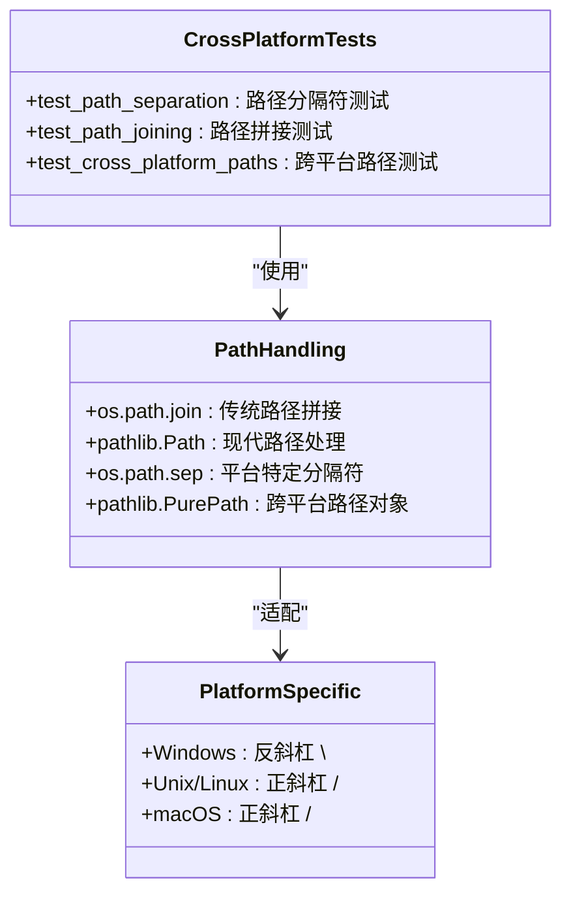

**图表来源**
- [pytest-patterns.md:949-958](file://altas-workflow/references/testing/pytest-patterns.md#L949-L958)

#### 路径处理最佳实践

- **使用pathlib**：优先使用`pathlib.Path`替代`os.path`函数
- **避免硬编码分隔符**：不要假设特定的操作系统分隔符
- **相对路径优先**：尽量使用相对路径避免绝对路径问题
- **测试路径行为**：验证路径处理函数在不同平台上的行为

**更新** 新增了路径分隔符差异处理和最佳实践指导。

**章节来源**
- [pytest-patterns.md:949-958](file://altas-workflow/references/testing/pytest-patterns.md#L949-L958)

### 行尾符差异

不同操作系统的文本文件使用不同的行尾符，这在跨平台测试中需要特别注意。

#### 行尾符处理

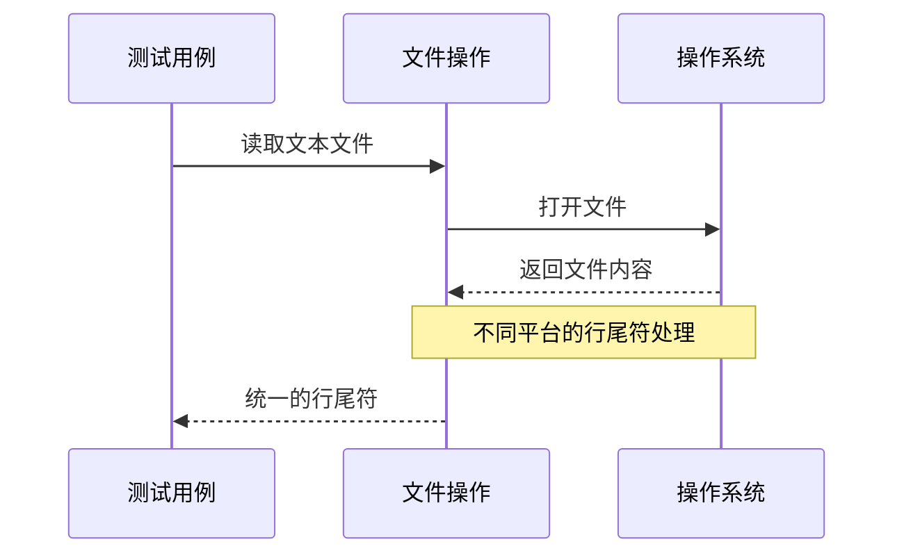

**图表来源**
- [pytest-patterns.md:960-969](file://altas-workflow/references/testing/pytest-patterns.md#L960-L969)

#### 行尾符测试策略

- **通用换行符**：使用`newline=None`参数处理不同行尾符
- **内容验证**：验证文件内容的逻辑正确性而非物理格式
- **平台特定测试**：为不同平台编写专门的行尾符测试
- **工具链兼容性**：确保测试工具链在不同平台上的兼容性

**更新** 新增了行尾符差异处理和测试策略。

**章节来源**
- [pytest-patterns.md:960-969](file://altas-workflow/references/testing/pytest-patterns.md#L960-L969)

### 文件系统权限差异

Unix和Windows系统在文件权限处理上存在根本差异，需要在跨平台测试中特别考虑。

#### 权限处理策略

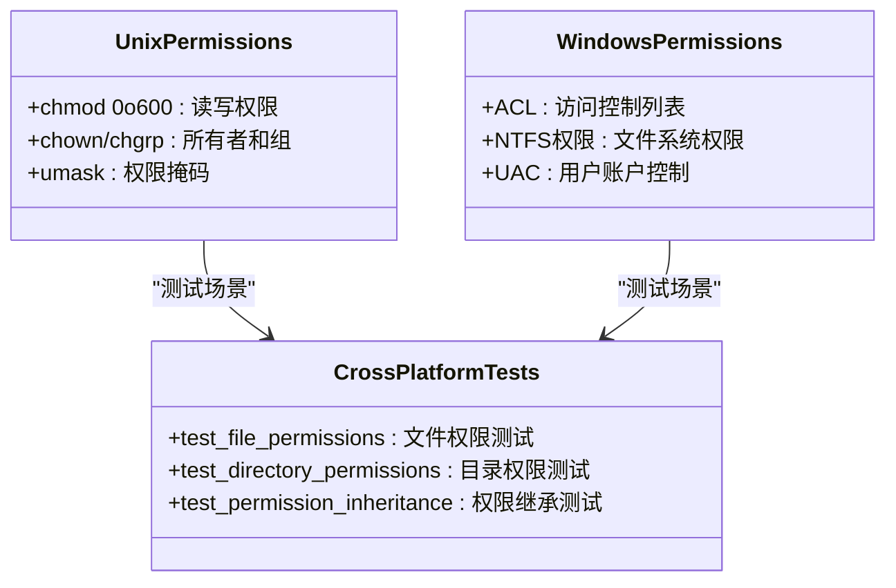

**图表来源**
- [pytest-patterns.md:971-983](file://altas-workflow/references/testing/pytest-patterns.md#L971-L983)

#### 权限测试最佳实践

- **跳过不支持的测试**：对不支持的平台跳过相关测试
- **权限模拟**：在Windows上模拟Unix权限行为
- **功能测试优先**：优先测试功能而非权限细节
- **平台检测**：使用`sys.platform`检测操作系统类型

**更新** 新增了文件系统权限差异处理和测试策略。

**章节来源**
- [pytest-patterns.md:971-983](file://altas-workflow/references/testing/pytest-patterns.md#L971-L983)

### 环境变量差异

不同操作系统对环境变量的处理方式存在差异，需要在跨平台测试中统一处理。

#### 环境变量处理

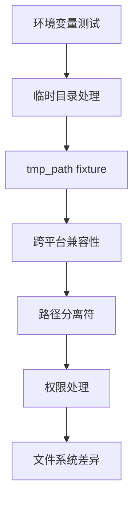

**图表来源**
- [pytest-patterns.md:985-1000](file://altas-workflow/references/testing/pytest-patterns.md#L985-L1000)

#### 环境变量测试策略

- **使用pytest内置fixture**：优先使用`tmp_path`等跨平台兼容的fixture
- **避免硬编码路径**：不要假设特定操作系统的环境变量
- **平台检测**：使用`sys.platform`进行平台特定的环境变量处理
- **配置文件**：使用配置文件替代环境变量以提高可移植性

**更新** 新增了环境变量差异处理和测试策略。

**章节来源**
- [pytest-patterns.md:985-1000](file://altas-workflow/references/testing/pytest-patterns.md#L985-L1000)

## 增强夹具管理策略

现代软件测试需要更精细的夹具管理策略，以支持复杂的测试场景和数据隔离需求。

### 测试数据隔离策略

测试数据隔离是确保测试独立性和可重复性的关键。Altas工作流提供了三种主要的隔离策略。

#### 事务回滚策略

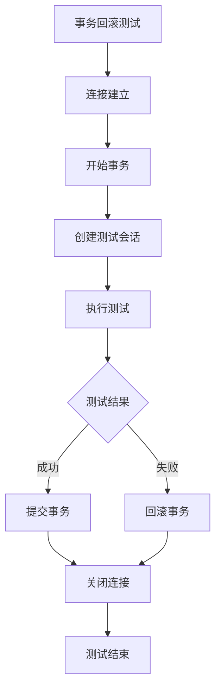

**图表来源**
- [test-data-management.md:366-407](file://altas-workflow/references/testing/test-data-management.md#L366-L407)

#### 物理删除策略

对于需要测试真实提交行为的场景，使用物理删除策略：

- **测试后清理**：在测试结束后删除所有测试数据
- **依赖顺序处理**：按照外键依赖顺序删除相关表
- **批量删除**：使用批量操作提高清理效率
- **条件删除**：支持选择性清理特定类型的测试数据

#### Schema重建策略

E2E测试通常需要完全干净的数据库环境：

- **会话级重建**：在测试会话开始时重建数据库Schema
- **测试前截断**：在每个测试开始前截断所有表
- **外键顺序处理**：按照正确的外键依赖顺序截断表
- **数据一致性**：确保重建过程中的数据一致性

**更新** 新增了完整的测试数据隔离策略，支持从单元测试到E2E测试的全场景覆盖。

**章节来源**
- [test-data-management.md:362-462](file://altas-workflow/references/testing/test-data-management.md#L362-L462)

### 并发测试数据处理

使用pytest-xdist进行并行测试时，需要特殊的并发安全处理机制。

#### 并发冲突解决方案

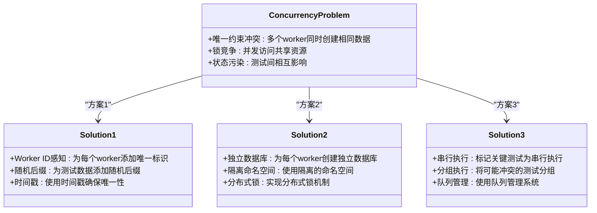

**图表来源**
- [test-data-management.md:588-642](file://altas-workflow/references/testing/test-data-management.md#L588-L642)

#### 并发安全工厂

为了解决并发测试中的数据冲突问题，需要使用并发安全的工厂模式：

- **Worker ID感知**：工厂生成的数据包含worker标识
- **随机化策略**：使用随机数确保数据唯一性
- **时间戳机制**：结合时间戳生成唯一标识
- **分布式ID**：使用分布式ID生成器确保全局唯一性

**更新** 新增了并发测试数据处理策略，支持大规模并行测试场景。

**章节来源**
- [test-data-management.md:581-642](file://altas-workflow/references/testing/test-data-management.md#L581-L642)

### 性能优化技巧

高效的测试执行需要在数据生成和测试隔离方面进行性能优化。

#### 惰性加载优化

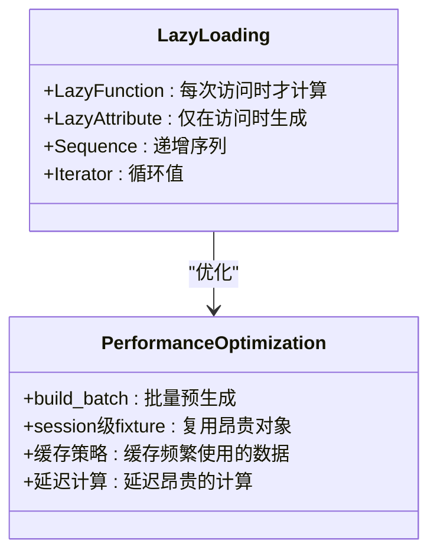

**图表来源**
- [test-data-management.md:649-678](file://altas-workflow/references/testing/test-data-management.md#L649-L678)

#### 批量操作优化

- **批量预生成**：使用`build_batch`预生成大量测试数据
- **会话级复用**：将昂贵的对象存储在session级fixture中
- **缓存机制**：缓存频繁使用的测试数据和配置
- **延迟计算**：只在真正需要时才执行昂贵的计算操作

**更新** 新增了性能优化技巧，包括惰性加载和批量操作策略。

**章节来源**
- [test-data-management.md:645-692](file://altas-workflow/references/testing/test-data-management.md#L645-L692)

## 依赖分析

### 测试工具链依赖

pytest测试模式依赖于多个第三方库，形成完整的测试生态系统：

```mermaid
graph TB
subgraph "核心测试框架"
A[pytest<br/>测试运行器]
B[pytest-cov<br/>覆盖率报告]
C[pytest-xdist<br/>并行执行]
D[pytest-asyncio<br/>异步支持]
E[pytest-mock<br/>增强Mock]
F[pytest-html<br/>HTML报告]
G[pytest-benchmark<br/>性能基准]
H[hypothesis<br/>属性测试]
I[pytest-bdd<br/>BDD测试]
J[pytest-timeout<br/>超时控制]
K[pytest-rerunfailures<br/>重试机制]
end
subgraph "数据生成"
L[factory-boy<br/>数据工厂]
M[Faker<br/>真实数据生成]
N[factory.DictFactory<br/>字典工厂]
O[pytest-factoryboy<br/>工厂集成]
end
subgraph "HTTP客户端"
P[requests<br/>HTTP请求]
Q[httpx<br/>现代HTTP客户端]
R[APIClient<br/>封装客户端]
S[httpretty<br/>HTTP Mock]
T[mockito<br/>HTTP Mock]
end
subgraph "数据库集成"
U[SQLAlchemy<br/>ORM框架]
V[pytest-postgresql<br/>PostgreSQL支持]
W[pytest-mock<br/>数据库Mock]
X[pytest-docker<br/>Docker集成]
end
subgraph "AI/ML支持"
Y[openai<br/>OpenAI API]
Z[huggingface_hub<br/>Hugging Face]
AA[transformers<br/>Transformer模型]
BB[langchain<br/>LangChain框架]
CC[llama-cpp-python<br/>本地LLM]
end
A --> B
A --> C
A --> D
A --> E
A --> F
A --> G
A --> H
A --> I
A --> J
A --> K
A --> L
A --> P
A --> U
A --> Y
B --> L
C --> U
D --> A
E --> A
F --> A
G --> A
H --> A
I --> A
J --> A
K --> A
L --> M
L --> N
L --> O
P --> Q
P --> R
P --> S
P --> T
U --> V
U --> W
U --> X
Y --> Z
Y --> AA
Y --> BB
Y --> CC
```

**图表来源**
- [pytest-patterns.md:542-560](file://altas-workflow/references/testing/pytest-patterns.md#L542-L560)

### 模块间依赖关系

各测试模板模块之间存在清晰的依赖层次：

- **pytest-patterns.md**：作为核心参考文档，指导其他模板的使用
- **conftest.py**：提供基础配置，被其他模板依赖
- **factories.py**：依赖Faker库，为测试提供数据
- **api_client_fixture.py**：依赖requests库，提供HTTP客户端
- **auth_fixture.py**：依赖api_client_fixture.py，提供认证能力
- **db_rollback_fixture.py**：依赖SQLAlchemy，提供数据库隔离
- **pytest_config.toml**：提供pytest配置，被pytest运行器使用
- **api_test_matrix.md**：提供测试计划模板，指导测试设计

**更新** 新增了AI/ML和跨平台测试相关的依赖关系分析。

**章节来源**
- [pytest-patterns.md:542-560](file://altas-workflow/references/testing/pytest-patterns.md#L542-L560)

## 性能考虑

### 测试执行优化

pytest测试模式在性能方面提供了多种优化策略：

1. **并行执行**：使用pytest-xdist插件实现多进程并行测试
2. **智能缓存**：利用pytest的测试发现缓存减少重复扫描
3. **选择性执行**：通过标记系统精确控制测试执行范围
4. **资源复用**：合理使用不同作用域的fixture避免重复创建
5. **惰性加载**：使用LazyAttribute延迟计算昂贵的测试数据
6. **批量操作**：使用build_batch预生成大量测试数据

### 内存管理

- **会话管理**：API客户端使用requests.Session进行连接复用
- **数据库连接**：使用适当的连接池配置避免连接泄漏
- **文件处理**：临时文件使用with语句确保及时清理
- **环境重置**：自动重置确保测试间的内存隔离
- **并发安全**：Worker ID感知的工厂模式避免数据竞争

**更新** 新增了AI/ML和跨平台测试场景下的性能考虑。

## 故障排除指南

### 常见问题诊断

#### 测试失败排查

```mermaid
flowchart TD
A[测试失败] --> B{检查类型}
B --> |断言失败| C[查看断言信息]
B --> |异常抛出| D[捕获异常详情]
B --> |性能问题| E[分析执行时间]
B --> |环境问题| F[检查环境变量]
B --> |平台差异| G[验证操作系统兼容性]
B --> |AI/ML问题| H[检查模型输出]
C --> I[检查输入数据]
D --> J[查看堆栈跟踪]
E --> K[识别瓶颈]
F --> L[验证配置]
G --> M[检查平台标记]
H --> N[验证模型行为]
I --> O[修复测试逻辑]
J --> P[修正被测代码]
K --> Q[优化算法实现]
L --> R[调整环境设置]
M --> S[修正平台特定代码]
N --> T[调整模型参数]
O --> U[重新运行测试]
P --> U
Q --> U
R --> U
S --> U
T --> U
```

#### 环境配置问题

- **API地址错误**：检查TEST_API_BASE_URL环境变量
- **认证失败**：验证测试凭据的有效性
- **超时问题**：调整TEST_HTTP_TIMEOUT设置
- **时区差异**：确保APP_ENV和TZ设置正确
- **认证头缺失**：确认access_token和auth_headers正确设置
- **平台不兼容**：检查sys.platform判断逻辑
- **AI/ML模型问题**：验证模型API密钥和配额

**更新** 新增了AI/ML和跨平台相关的故障排除指南。

**章节来源**
- [conftest.py:23-49](file://altas-workflow/references/testing/templates/conftest.py#L23-L49)

### 调试技巧

- **详细输出**：使用-v参数获取详细的测试执行信息
- **失败重跑**：使用--lf参数重跑上次失败的测试
- **调试器集成**：使用--pdb在失败时自动进入调试模式
- **覆盖率分析**：使用--cov参数分析测试覆盖情况
- **标记过滤**：使用-m参数按标记类型筛选测试
- **平台特定调试**：使用--runxfail处理跨平台测试
- **AI/ML调试**：使用--tb=long获取详细的模型错误信息

## 结论

pytest测试模式参考文档为Altas工作流提供了完整的测试开发指南。通过模块化的模板设计和最佳实践指导，开发者可以快速建立高质量的测试体系。

**更新** 新增的AI/ML集成测试、跨平台测试和增强夹具管理策略显著提升了测试开发效率和质量：

### 主要优势

1. **标准化流程**：AAA模式确保测试的可读性和一致性
2. **灵活配置**：多层fixture系统适应不同测试需求
3. **自动化程度高**：自动环境重置和资源管理减少样板代码
4. **扩展性强**：支持多种测试场景和工具集成
5. **生产就绪**：完整的认证、数据生成和API客户端模板
6. **AI/ML友好**：专门的非确定性测试和成本控制策略
7. **跨平台兼容**：全面的平台差异处理和测试策略
8. **性能优化**：高效的并发处理和数据隔离机制

### 关键改进

- **共享配置模板**：提供统一的测试环境配置和标记系统
- **数据工厂模板**：基于factory_boy和Faker的灵活数据生成
- **API客户端模板**：封装HTTP客户端，简化API测试
- **认证模板**：支持多角色认证场景的测试
- **数据库回滚模板**：提供事务隔离的集成测试支持
- **测试配置模板**：完整的pytest配置选项和扩展
- **API测试矩阵模板**：从契约文件展开测试计划
- **AI/ML集成测试**：非确定性输出和成本控制测试
- **跨平台测试**：多操作系统兼容性测试策略
- **增强夹具管理**：测试数据隔离和并发处理

### 建议实践

- 优先使用共享配置模板作为测试起点
- 根据测试类型选择合适的fixture作用域
- 利用数据工厂生成多样化的测试数据
- 建立完善的标记系统便于测试分类和筛选
- 定期审查测试覆盖率和执行性能
- 使用认证模板确保测试安全性
- 利用测试元数据提升报告质量
- 采用AI/ML专用测试策略验证模型行为
- 实施跨平台测试确保多环境兼容性
- 使用增强夹具管理策略提高测试效率
- 结合测试脚手架模板快速启动新项目
- 定期更新测试模板以适应新的测试需求

这个更新后的测试模板系统为Altas工作流提供了企业级的测试基础设施，支持从简单单元测试到复杂AI/ML应用和跨平台部署的全方位需求。通过引入AI/ML集成测试、跨平台测试和增强夹具管理策略，开发者可以更好地应对现代软件开发中的各种挑战，确保软件质量和可靠性。