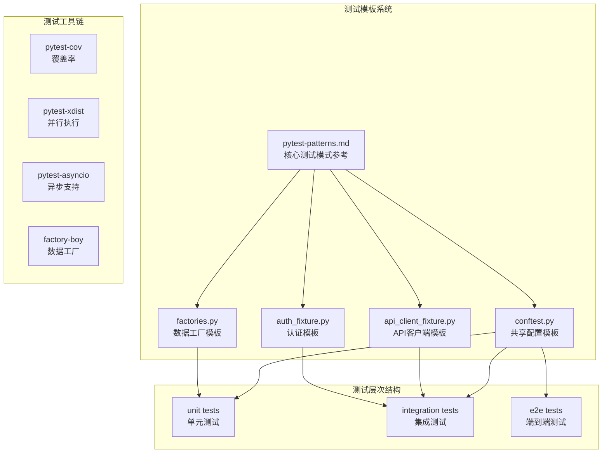
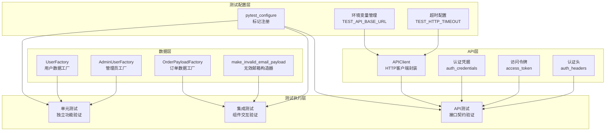
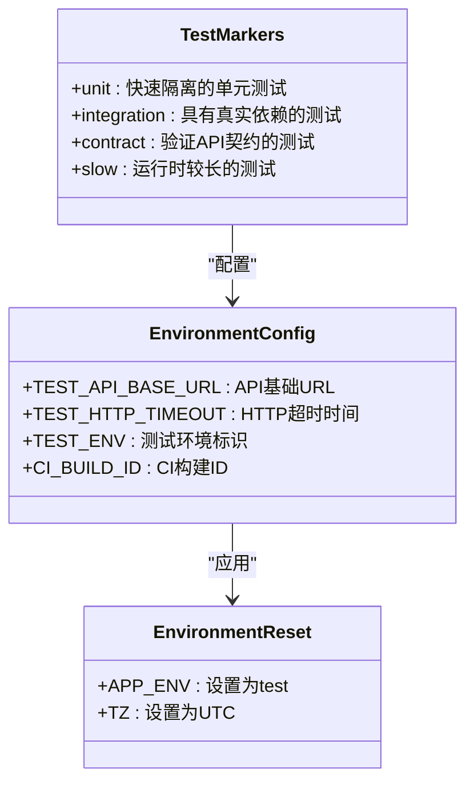
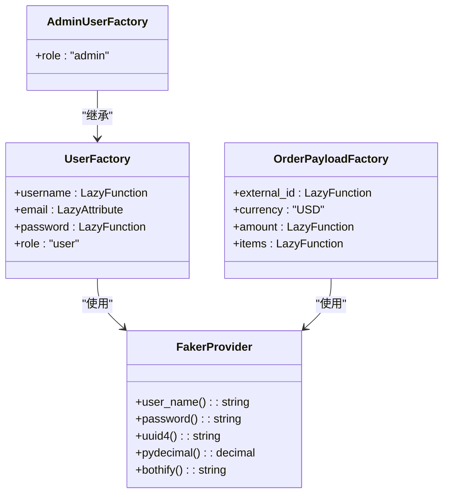
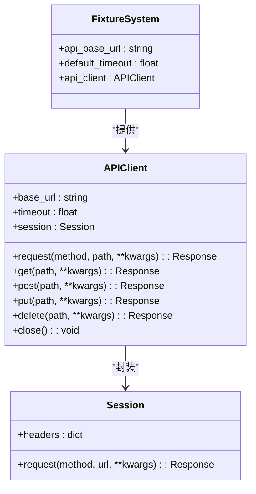
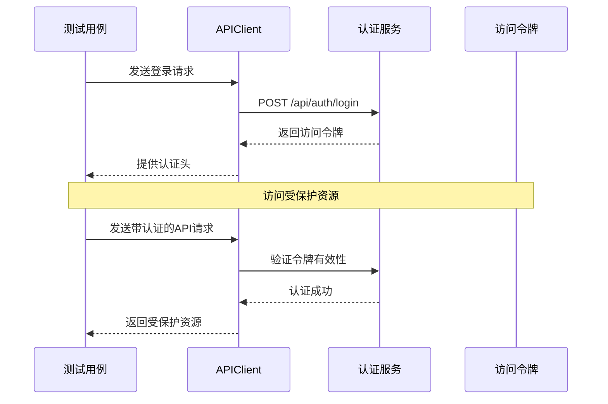
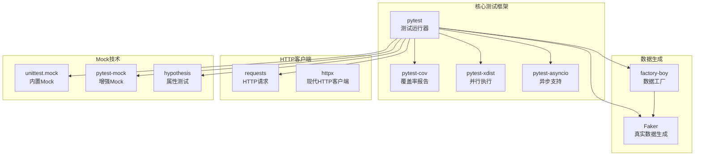
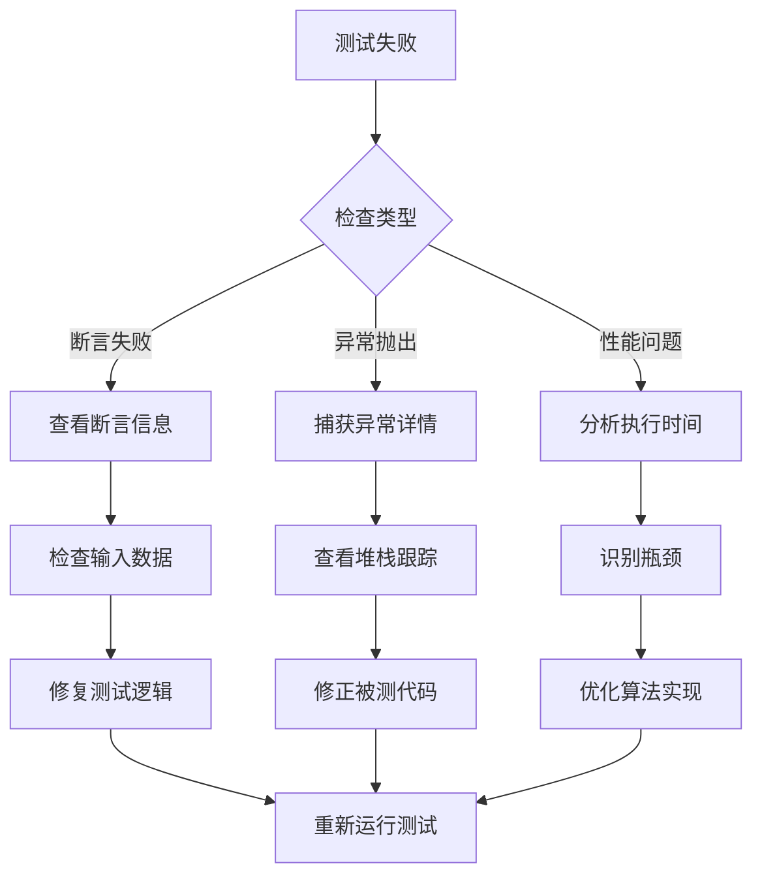

# pytest测试模式参考

<cite>
**本文档引用的文件**
- [pytest-patterns.md](file://altas-workflow/references/testing/pytest-patterns.md)
- [conftest.py](file://altas-workflow/references/testing/templates/conftest.py)
- [factories.py](file://altas-workflow/references/testing/templates/factories.py)
- [api_client_fixture.py](file://altas-workflow/references/testing/templates/api_client_fixture.py)
- [auth_fixture.py](file://altas-workflow/references/testing/templates/auth_fixture.py)
</cite>

## 目录
1. [简介](#简介)
2. [项目结构](#项目结构)
3. [核心组件](#核心组件)
4. [架构概览](#架构概览)
5. [详细组件分析](#详细组件分析)
6. [依赖分析](#依赖分析)
7. [性能考虑](#性能考虑)
8. [故障排除指南](#故障排除指南)
9. [结论](#结论)

## 简介

本文件是pytest测试模式的综合参考文档，基于Altas工作流中的测试基础设施构建。该文档提供了完整的pytest测试开发指南，包括测试模式、fixture设计、参数化测试、mock技术、测试组织结构等核心主题。

pytest作为Python生态系统中最流行的测试框架之一，提供了强大的测试发现、执行和报告功能。在Altas工作流中，pytest被广泛应用于单元测试、集成测试和端到端测试场景。

## 项目结构

Altas工作流中的测试基础设施采用模块化设计，主要包含以下核心组件：

**图表来源**
- [pytest-patterns.md:1-741](file://altas-workflow/references/testing/pytest-patterns.md#L1-L741)
- [conftest.py:1-49](file://altas-workflow/references/testing/templates/conftest.py#L1-L49)

**章节来源**
- [pytest-patterns.md:261-284](file://altas-workflow/references/testing/pytest-patterns.md#L261-L284)
- [conftest.py:15-49](file://altas-workflow/references/testing/templates/conftest.py#L15-L49)

## 核心组件

### 测试模式基础

pytest测试遵循AAA（Arrange-Act-Assert）模式，强调测试的可读性和可维护性。核心原则包括：

1. **单一职责原则**：每个测试只验证一个具体的行为
2. **独立性**：测试之间不依赖执行顺序
3. **纯断言**：使用标准的assert语句而非特殊断言方法
4. **明确的命名**：测试名称应清晰描述预期行为

### Fixture系统

Fixture是pytest的核心概念，提供测试所需的依赖注入机制。支持多种作用域级别：

| 作用域 | 创建频率 | 适用场景 |
|--------|----------|----------|
| function | 每个测试函数 | 需要隔离状态的测试 |
| class | 每个测试类 | 类内共享资源 |
| module | 每个测试模块 | 模块级配置 |
| session | 整个测试会话 | 数据库连接、API客户端 |

**章节来源**
- [pytest-patterns.md:9-15](file://altas-workflow/references/testing/pytest-patterns.md#L9-L15)
- [pytest-patterns.md:34-58](file://altas-workflow/references/testing/pytest-patterns.md#L34-L58)

## 架构概览

Altas工作流的测试架构采用分层设计，确保测试的可扩展性和可维护性：

**图表来源**
- [conftest.py:15-49](file://altas-workflow/references/testing/templates/conftest.py#L15-L49)
- [factories.py:16-50](file://altas-workflow/references/testing/templates/factories.py#L16-L50)
- [api_client_fixture.py:14-57](file://altas-workflow/references/testing/templates/api_client_fixture.py#L14-L57)
- [auth_fixture.py:10-51](file://altas-workflow/references/testing/templates/auth_fixture.py#L10-L51)

## 详细组件分析

### 共享配置模板 (conftest.py)

共享配置模板提供了测试运行的基础设置，包括标记注册、环境变量管理和自动重置机制。

#### 标记系统设计

**图表来源**
- [conftest.py:15-49](file://altas-workflow/references/testing/templates/conftest.py#L15-L49)

#### 自动环境重置机制

共享配置模板实现了自动环境重置功能，确保测试的确定性和可重复性：

- **环境变量标准化**：统一设置APP_ENV为test，TZ为UTC
- **会话级fixture**：在整个测试会话期间保持一致的配置
- **自动清理**：测试完成后自动恢复原始环境状态

**章节来源**
- [conftest.py:15-49](file://altas-workflow/references/testing/templates/conftest.py#L15-L49)

### 数据工厂模板 (factories.py)

数据工厂模板基于factory_boy和Faker库，提供灵活的测试数据生成机制。

#### 工厂继承体系

**图表来源**
- [factories.py:16-50](file://altas-workflow/references/testing/templates/factories.py#L16-L50)

#### 高级工厂模式

数据工厂支持多种高级模式：

- **继承模式**：通过继承基础工厂创建特化工厂
- **惰性属性**：使用LazyAttribute延迟计算复杂属性
- **复合数据**：生成包含多个子对象的复杂数据结构
- **无效数据构造**：专门生成边界条件和异常输入

**章节来源**
- [factories.py:16-50](file://altas-workflow/references/testing/templates/factories.py#L16-L50)

### API客户端模板 (api_client_fixture.py)

API客户端模板提供了HTTP客户端的封装，简化了API测试的编写。

#### HTTP客户端架构

**图表来源**
- [api_client_fixture.py:14-57](file://altas-workflow/references/testing/templates/api_client_fixture.py#L14-L57)

#### 请求处理流程

API客户端实现了标准化的请求处理流程：

1. **URL规范化**：自动去除base_url末尾的斜杠
2. **头部设置**：统一设置Accept和Content-Type头部
3. **超时控制**：支持全局和单次请求的超时配置
4. **会话管理**：自动管理HTTP会话状态

**章节来源**
- [api_client_fixture.py:14-57](file://altas-workflow/references/testing/templates/api_client_fixture.py#L14-L57)

### 认证模板 (auth_fixture.py)

认证模板提供了API测试中的认证机制，支持多种认证场景。

#### 认证流程序列

**图表来源**
- [auth_fixture.py:19-37](file://altas-workflow/references/testing/templates/auth_fixture.py#L19-L37)

#### 多角色认证支持

认证模板支持多角色认证场景：

- **标准用户认证**：使用TEST_USERNAME和TEST_PASSWORD环境变量
- **管理员认证**：提供独立的管理员凭据和权限头
- **令牌管理**：自动处理访问令牌的获取和更新
- **会话保持**：通过认证头在后续请求中保持会话状态

**章节来源**
- [auth_fixture.py:10-51](file://altas-workflow/references/testing/templates/auth_fixture.py#L10-L51)

## 依赖分析

### 测试工具链依赖

pytest测试模式依赖于多个第三方库，形成完整的测试生态系统：

**图表来源**
- [pytest-patterns.md:542-560](file://altas-workflow/references/testing/pytest-patterns.md#L542-L560)

### 模块间依赖关系

各测试模板模块之间存在清晰的依赖层次：

- **pytest-patterns.md**：作为核心参考文档，指导其他模板的使用
- **conftest.py**：提供基础配置，被其他模板依赖
- **factories.py**：依赖Faker库，为测试提供数据
- **api_client_fixture.py**：依赖requests库，提供HTTP客户端
- **auth_fixture.py**：依赖api_client_fixture.py，提供认证能力

**章节来源**
- [pytest-patterns.md:542-560](file://altas-workflow/references/testing/pytest-patterns.md#L542-L560)

## 性能考虑

### 测试执行优化

pytest测试模式在性能方面提供了多种优化策略：

1. **并行执行**：使用pytest-xdist插件实现多进程并行测试
2. **智能缓存**：利用pytest的测试发现缓存减少重复扫描
3. **选择性执行**：通过标记系统精确控制测试执行范围
4. **资源复用**：合理使用不同作用域的fixture避免重复创建

### 内存管理

- **会话管理**：API客户端使用requests.Session进行连接复用
- **数据库连接**：使用适当的连接池配置避免连接泄漏
- **文件处理**：临时文件使用with语句确保及时清理

## 故障排除指南

### 常见问题诊断

#### 测试失败排查

#### 环境配置问题

- **API地址错误**：检查TEST_API_BASE_URL环境变量
- **认证失败**：验证测试凭据的有效性
- **超时问题**：调整TEST_HTTP_TIMEOUT设置
- **时区差异**：确保APP_ENV和TZ设置正确

**章节来源**
- [conftest.py:23-49](file://altas-workflow/references/testing/templates/conftest.py#L23-L49)

### 调试技巧

- **详细输出**：使用-v参数获取详细的测试执行信息
- **失败重跑**：使用--lf参数重跑上次失败的测试
- **调试器集成**：使用--pdb在失败时自动进入调试模式
- **覆盖率分析**：使用--cov参数分析测试覆盖情况

## 结论

pytest测试模式参考文档为Altas工作流提供了完整的测试开发指南。通过模块化的模板设计和最佳实践指导，开发者可以快速建立高质量的测试体系。

关键优势包括：

1. **标准化流程**：AAA模式确保测试的可读性和一致性
2. **灵活配置**：多层fixture系统适应不同测试需求
3. **自动化程度高**：自动环境重置和资源管理减少样板代码
4. **扩展性强**：支持多种测试场景和工具集成

建议在实际项目中：
- 优先使用共享配置模板作为测试起点
- 根据测试类型选择合适的fixture作用域
- 利用数据工厂生成多样化的测试数据
- 建立完善的标记系统便于测试分类和筛选
- 定期审查测试覆盖率和执行性能