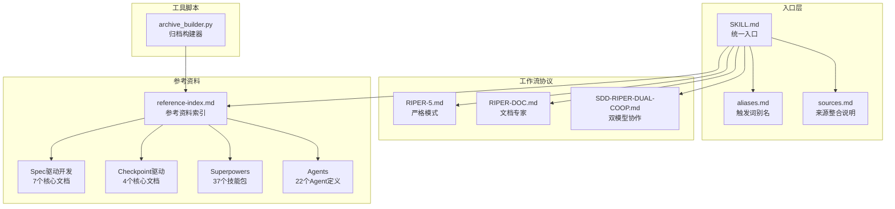
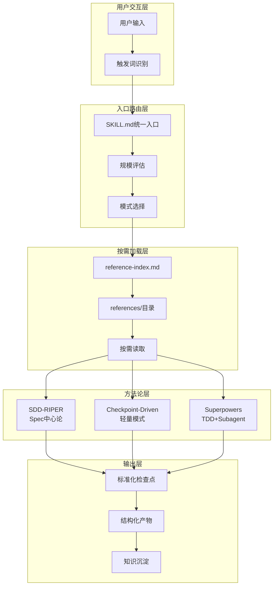
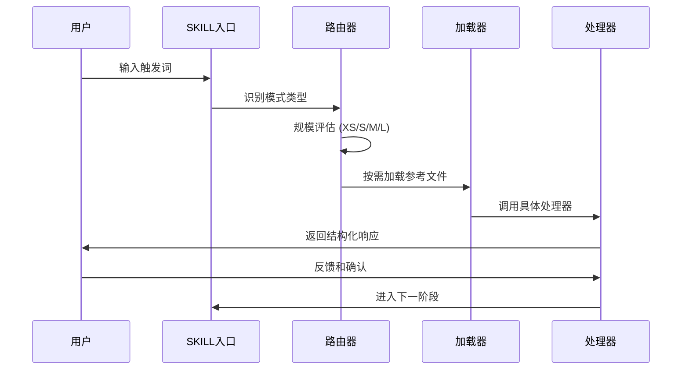
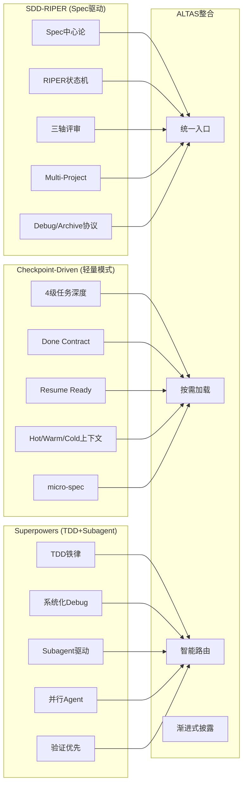
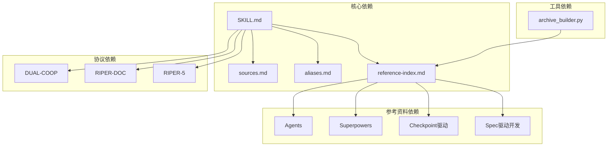

# 入口来源整合

<cite>
**本文档引用的文件**
- [README.md](file://README.md)
- [SKILL.md](file://altas-workflow/SKILL.md)
- [reference-index.md](file://altas-workflow/reference-index.md)
- [sources.md](file://altas-workflow/references/entry/sources.md)
- [aliases.md](file://altas-workflow/references/entry/aliases.md)
- [QUICKSTART.md](file://altas-workflow/QUICKSTART.md)
- [workflow-diagrams.md](file://altas-workflow/workflow-diagrams.md)
- [RIPER-5.md](file://altas-workflow/protocols/RIPER-5.md)
- [RIPER-DOC.md](file://altas-workflow/protocols/RIPER-DOC.md)
- [SDD-RIPER-DUAL-COOP.md](file://altas-workflow/protocols/SDD-RIPER-DUAL-COOP.md)
- [archive_builder.py](file://altas-workflow/scripts/archive_builder.py)
</cite>

## 更新摘要
**变更内容**
- 新增入口来源整合文档 (references/entry/sources.md) 的详细说明
- 改进触发词系统的维护和使用约定
- 统一参考索引结构，增强方法论来源整合说明
- 更新入口层架构图，反映新的来源整合机制

## 目录
1. [简介](#简介)
2. [项目结构](#项目结构)
3. [核心组件](#核心组件)
4. [架构概览](#架构概览)
5. [详细组件分析](#详细组件分析)
6. [依赖关系分析](#依赖关系分析)
7. [性能考虑](#性能考虑)
8. [故障排除指南](#故障排除指南)
9. [结论](#结论)

## 简介

ALTAS Workflow 是一套综合性 AI 原生研发工作流规范，专门设计用于整合和协调多种不同的工作流方法论。该项目的核心价值在于其"入口来源整合"能力，即将 SDD-RIPER、SDD-RIPER-Optimized (Checkpoint-Driven) 和 Superpowers 三大优秀工作流的精华有机融合，形成一个统一的工程工作流入口。

该工作流规范旨在解决 AI 编程中的四大工程痛点：上下文腐烂、审查瘫痪、代码不信任和难以维护。通过标准化的入口层设计，ALTAS 能够根据任务特征自动选择最适合的工作流模式，同时保持各方法论的独特优势。

**更新** 新增了专门的入口来源整合文档，明确了三大方法论的采纳能力和使用时机，增强了方法论来源的透明度和可追溯性。

## 项目结构

ALTAS Workflow 采用模块化的目录结构，主要包含以下几个核心部分：

**图表来源**
- [README.md:48-82](file://README.md#L48-L82)
- [SKILL.md:15-30](file://altas-workflow/SKILL.md#L15-L30)

**章节来源**
- [README.md:48-82](file://README.md#L48-L82)
- [QUICKSTART.md:19-30](file://altas-workflow/QUICKSTART.md#L19-L30)

## 核心组件

### 统一入口层 (SKILL.md)

SKILL.md 作为 ALTAS Workflow 的统一入口，承担着三个核心职责：

1. **识别路由**：判断任务属于 Coding / Debug / Doc / Map / Archive / Review / Refactor / Test / Perf / Migrate / Multi 中的哪一类
2. **评估规模**：确定 XS / S / M / L 四级任务深度
3. **按需加载**：通过 reference-index.md 和 references/ 目录实现渐进式披露

该入口层的设计理念是"入口瘦身 + 索引统一"，将复杂的规则和模板下沉到按需加载的参考资料中。

**更新** 入口层现在通过专门的 sources.md 文档承载方法论来源整合说明，实现了更好的职责分离和维护性。

### 触发词别名系统

aliases.md 提供了完整的触发词词典，包括：
- 全局触发词：`>>`、`FAST`、`DEEP`、`DEBUG`、`MULTI` 等
- 模式内控制词：`SWITCH`、`REGISTRY`、`SCOPE LOCAL` 等
- 别名映射：如 `快速` → `FAST`、`项目总图` → `PROJECT MAP`

**更新** 触发词系统现在具有更严格的维护规则，确保别名的一致性和可追溯性。新增了"模式内控制词"类别，区分全局入口触发词和模式内控制词。

### 来源整合说明

sources.md 专门承载 ALTAS 入口层的"来源整合"说明，明确记录了三大方法论的采纳能力和使用时机。

**更新** 新增的 sources.md 文档提供了清晰的方法论来源映射，包括：
- SDD-RIPER 的 Spec 中心论、RIPER 状态机、三轴 Review、Multi-Project、Debug/Archive 协议
- Checkpoint-Driven 的轻量模式、4 级规模、Done Contract、Resume Ready、Hot/Warm/Cold 上下文策略  
- Superpowers 的 TDD 铁律、系统化 Debug、Subagent、并行 Agent、验证优先

**章节来源**
- [SKILL.md:15-30](file://altas-workflow/SKILL.md#L15-L30)
- [aliases.md:12-33](file://altas-workflow/references/entry/aliases.md#L12-L33)
- [sources.md:6-24](file://altas-workflow/references/entry/sources.md#L6-L24)

## 架构概览

ALTAS Workflow 的整体架构体现了"统一入口 + 按需加载 + 多源整合"的设计思想：

**图表来源**
- [SKILL.md:21-29](file://altas-workflow/SKILL.md#L21-L29)
- [reference-index.md:8-18](file://altas-workflow/reference-index.md#L8-L18)

**更新** 架构图现在更好地反映了新的入口来源整合机制，入口层通过 sources.md 文档明确方法论来源，实现了更好的解耦和可维护性。

## 详细组件分析

### 触发词路由机制

ALTAS 的触发词路由机制体现了高度的智能化和灵活性：

**图表来源**
- [SKILL.md:82-106](file://altas-workflow/SKILL.md#L82-L106)
- [reference-index.md:30-36](file://altas-workflow/reference-index.md#L30-L36)

### 规模评估算法

ALTAS 的规模评估遵循"影响面 > 文件数 > 代码行数"的优先级原则：

| 规模 | 评估标准 | 典型场景 | 处理流程 |
|------|----------|----------|----------|
| **XS** | typo、配置值、日志、<10行 | 极小改动 | 直接执行 → 验证 → summary |
| **S** | 1-2文件、逻辑清晰、影响小 | micro-spec (1-3句) | micro-spec → 批准 → 执行 → 回写 |
| **M** | 3-10文件、模块内、需要计划 | 轻量Spec落盘 | Research → Plan → Execute(TDD) → Review |
| **L** | 跨模块、架构级、迁移、多项目 | 完整Spec + Innovate + Archive | Research → Innovate → Plan → Execute → Review → Archive |

### 方法论来源整合

ALTAS 成功整合了三大工作流的核心优势：

**图表来源**
- [README.md:401-416](file://README.md#L401-L416)
- [sources.md:8-12](file://altas-workflow/references/entry/sources.md#L8-L12)

**更新** 方法论来源整合现在通过专门的 sources.md 文档进行统一管理，提供了更清晰的来源映射和使用时机说明。

### 参考资料索引系统

reference-index.md 提供了完整的参考资料索引，支持三种加载模式：

1. **最快路径**：直接从"按特殊模式索引"或"按工作流阶段索引"定位
2. **完整扫描**：从"按来源分类索引"了解全貌
3. **规模规划**：从"按规模等级索引"确认所需文件

**更新** 参考资料索引系统现在包含了新增的特殊模式索引，如 REVIEW、REFACTOR、TEST、PERF、MIGRATE 等模式的详细说明。

这种设计确保了 AI Agent 可以根据实际需要按需加载参考资料，避免上下文污染。

**章节来源**
- [reference-index.md:6-20](file://altas-workflow/reference-index.md#L6-L20)
- [reference-index.md:22-171](file://altas-workflow/reference-index.md#L22-L171)

## 依赖关系分析

ALTAS Workflow 的依赖关系体现了清晰的层次化设计：

**图表来源**
- [SKILL.md:6-12](file://altas-workflow/SKILL.md#L6-L12)
- [reference-index.md:173-237](file://altas-workflow/reference-index.md#L173-L237)

### 耦合度分析

ALTAS 的设计实现了良好的内聚性和低耦合性：

- **入口层**与**方法论层**通过接口契约松耦合
- **参考资料**与**处理逻辑**通过索引机制解耦
- **不同规模**通过统一的路由机制协调

**更新** 新增的 sources.md 文档进一步降低了入口层与方法论层的耦合度，通过专门的来源整合文件实现了更好的职责分离。

### 循环依赖检测

经过分析，ALTAS Workflow 不存在循环依赖：
- 入口层只依赖索引和别名文件
- 协议层相互独立
- 参考资料层通过索引间接关联

**章节来源**
- [SKILL.md:15-30](file://altas-workflow/SKILL.md#L15-L30)
- [reference-index.md:173-237](file://altas-workflow/reference-index.md#L173-L237)

## 性能考虑

### 上下文装配策略

ALTAS 采用了三层上下文装配策略：

1. **Hot Context**：每轮对话的即时上下文
2. **Warm Context**：阶段切换时的持久上下文  
3. **Cold Context**：按需加载的历史上下文

**更新** 新增的 sources.md 文档通过按需加载机制，进一步优化了上下文装配策略，减少了不必要的上下文加载。

这种分层策略有效平衡了性能和准确性。

### 渐进式披露优化

通过按需加载机制，ALTAS 能够：
- 减少初始加载时间
- 降低内存占用
- 避免上下文污染
- 提高处理效率

**更新** 渐进式披露现在包括了对 sources.md 和 aliases.md 等入口相关文档的按需加载，进一步提升了性能。

### 并行处理能力

对于支持并行的平台，ALTAS 可以：
- 并行读取多个文件
- 并行执行多个 Agent
- 并行生成多个输出

**更新** 并行处理现在也适用于入口相关文档的加载，如同时读取多个触发词别名文件。

**章节来源**
- [workflow-diagrams.md:241-257](file://altas-workflow/workflow-diagrams.md#L241-L257)
- [reference-index.md:6-18](file://altas-workflow/reference-index.md#L6-L18)

## 故障排除指南

### 常见问题及解决方案

| 问题类型 | 症状 | 解决方案 |
|----------|------|----------|
| 触发词识别失败 | AI无法理解用户输入 | 检查 aliases.md 中的触发词映射 |
| 规模评估错误 | AI选择了不合适的处理流程 | 手动指定 `>>`、`FAST`、`DEEP` 或 `CROSS` |
| 参考资料加载失败 | AI找不到相关文档 | 检查 reference-index.md 中的路径配置 |
| 上下文溢出 | AI无法处理大量信息 | 启用 Resume Ready，将状态写回 Spec |
| 并行执行冲突 | 多个 Agent 同时修改同一文件 | 遵循"读并发、写串行"原则 |
| 方法论来源不一致 | 不同入口文档显示不同的方法论来源 | 检查 sources.md 中的来源整合说明 |

**更新** 新增了方法论来源不一致的问题及解决方案，指向 sources.md 文档进行核对。

### 异常处理机制

ALTAS 提供了完善的异常处理：
- **EXIT ALTAS 规范**：退出前输出当前阶段、已完成、待办和恢复锚点
- **能力降级**：在工具缺失时自动降级为简化流程
- **逆向同步**：发现偏差时先更新 Spec 再修代码

**章节来源**
- [SKILL.md:241-275](file://altas-workflow/SKILL.md#L241-L275)
- [README.md:539-607](file://README.md#L539-L607)

## 结论

ALTAS Workflow 的"入口来源整合"设计成功地将三种优秀的 AI 工作流方法论有机融合，形成了一个既统一又灵活的工程工作流体系。其核心价值体现在：

1. **统一性**：通过 SKILL.md 提供单一入口，简化了用户的操作复杂度
2. **灵活性**：通过按需加载机制，支持不同规模和场景的需求
3. **可扩展性**：通过模块化设计，便于添加新的方法论和工具
4. **实用性**：通过渐进式披露和智能路由，提高了实际使用效率
5. **可维护性**：通过专门的 sources.md 文档，实现了方法论来源的统一管理和维护

**更新** 新增的入口来源整合文档显著提升了系统的可维护性和透明度，为未来的持续改进和发展奠定了更加坚实的基础。

这种设计不仅解决了 AI 编程中的四大工程痛点，更为未来的持续改进和发展提供了清晰的路径。通过持续的版本迭代和社区贡献，ALTAS Workflow 有望成为 AI 原生研发的标准工作流规范。