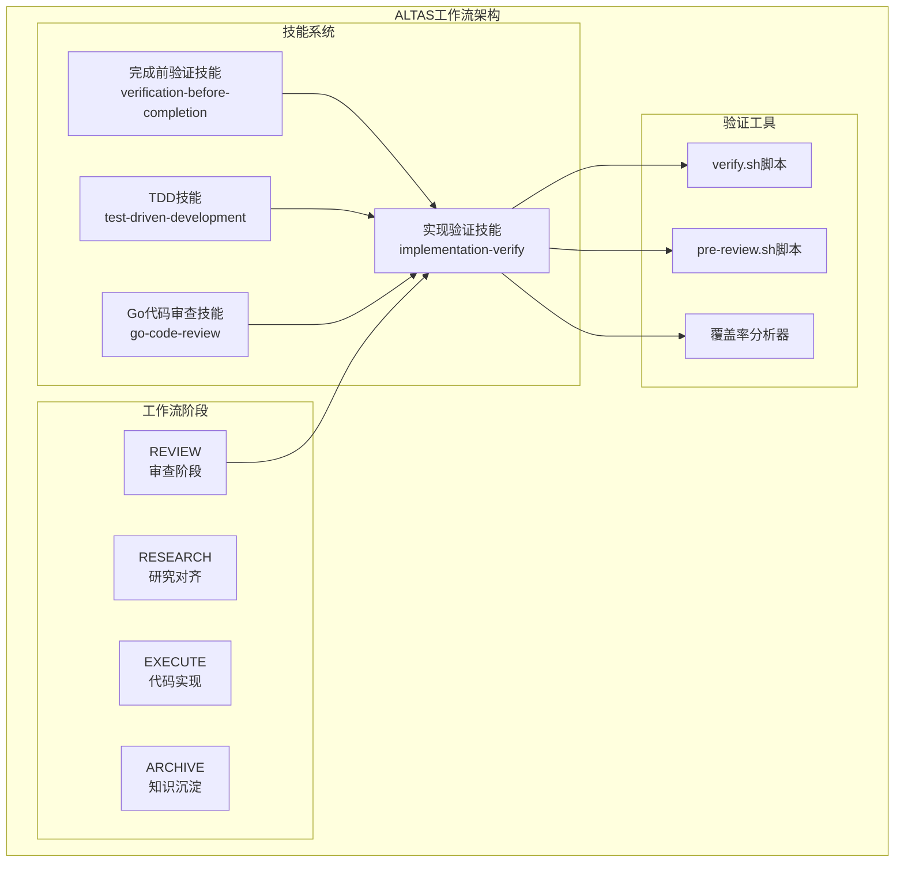
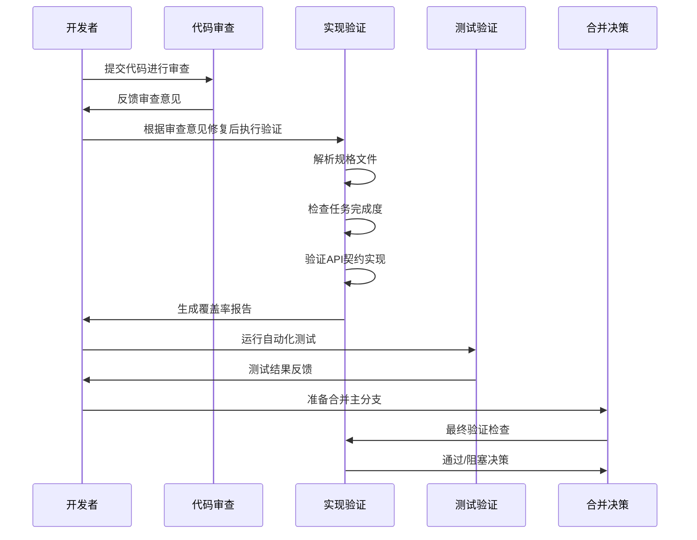
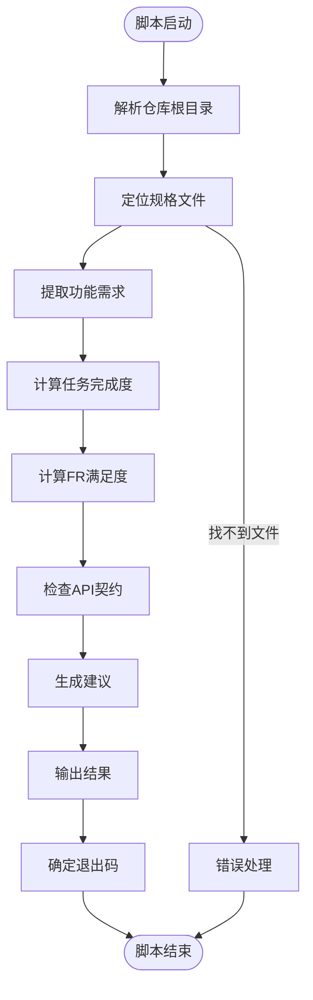
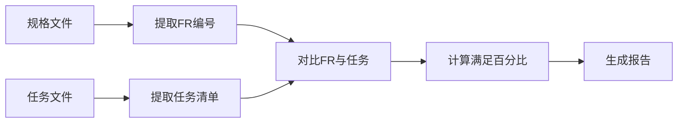
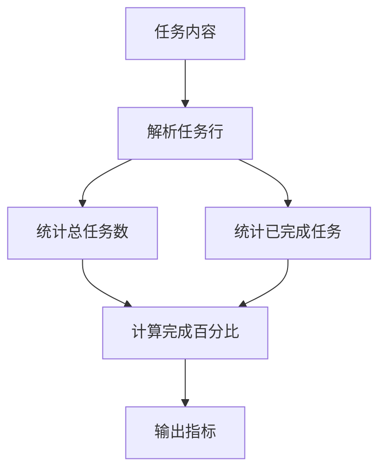
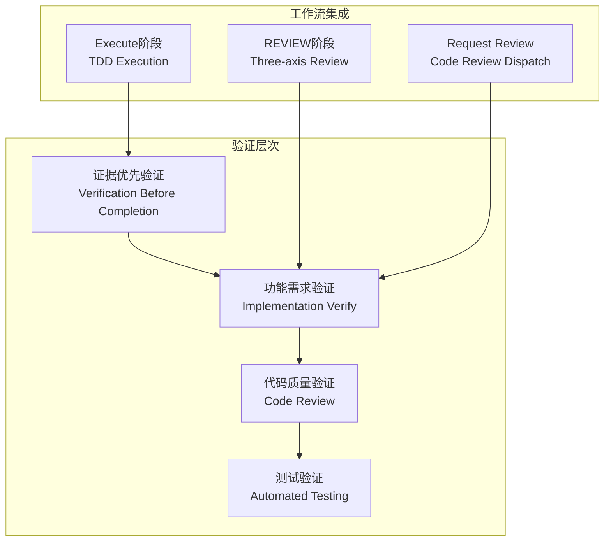
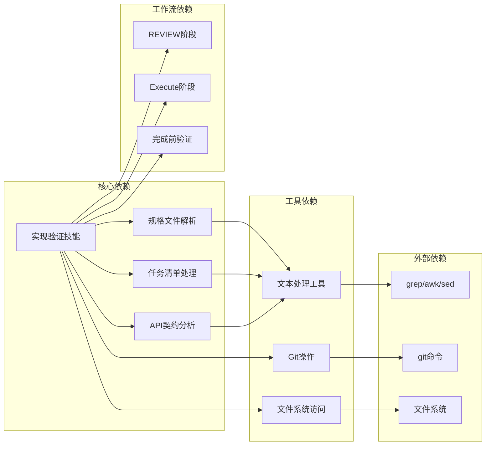

# 实现验证技能

<cite>
**本文档引用的文件**
- [implementation-verify/SKILL.md](file://altas-workflow/references/superpowers/implementation-verify/SKILL.md)
- [verify.sh](file://altas-workflow/references/superpowers/implementation-verify/scripts/verify.sh)
- [verification-before-completion/SKILL.md](file://altas-workflow/references/superpowers/verification-before-completion/SKILL.md)
- [test-driven-development/SKILL.md](file://altas-workflow/references/superpowers/test-driven-development/SKILL.md)
- [QUICKSTART.md](file://altas-workflow/QUICKSTART.md)
- [reference-index.md](file://altas-workflow/reference-index.md)
</cite>

## 目录
1. [简介](#简介)
2. [项目结构](#项目结构)
3. [核心组件](#核心组件)
4. [架构概览](#架构概览)
5. [详细组件分析](#详细组件分析)
6. [依赖分析](#依赖分析)
7. [性能考虑](#性能考虑)
8. [故障排除指南](#故障排除指南)
9. [结论](#结论)

## 简介

实现验证技能是ALTAS工作流中的关键质量保证组件，专门用于验证代码实现是否完全满足PRD（产品需求文档）和规格说明书的要求。该技能通过自动化检查任务完成度、功能需求满足度和API契约实现情况，确保交付的代码不仅质量优良，更重要的是正确实现了既定的功能需求。

实现验证技能的核心价值在于它填补了代码审查和需求验证之间的关键空白：代码审查关注代码质量和最佳实践，而实现验证专注于确认功能需求的完整性和准确性。

## 项目结构

ALTAS工作流采用模块化的技能架构，实现验证技能位于超级技能（Superpowers）类别下，与测试驱动开发、系统化调试等其他质量保证技能协同工作。

**图表来源**
- [implementation-verify/SKILL.md:1-218](file://altas-workflow/references/superpowers/implementation-verify/SKILL.md#L1-L218)
- [reference-index.md:84-93](file://altas-workflow/reference-index.md#L84-L93)

**章节来源**
- [implementation-verify/SKILL.md:1-218](file://altas-workflow/references/superpowers/implementation-verify/SKILL.md#L1-L218)
- [reference-index.md:1-304](file://altas-workflow/reference-index.md#L1-L304)

## 核心组件

实现验证技能由多个相互关联的组件构成，每个组件都有特定的职责和验证重点：

### 1. 验证脚本引擎

verify.sh是实现验证的核心执行引擎，负责自动化分析和报告生成。该脚本采用模块化设计，每个验证步骤都是独立的功能模块。

### 2. 覆盖率计算引擎

系统提供三种维度的覆盖率计算：
- **功能需求覆盖率（FR Fulfillment）**：基于FR编号的规格需求满足度
- **任务完成覆盖率（Task Completion）**：基于任务清单的完成度统计
- **API契约覆盖率（Contract Implementation）**：基于API契约定义的实现验证

### 3. 智能文件解析器

自动识别和解析项目中的关键文档文件，包括规格说明书、任务清单和API契约文件。

### 4. 建议行动生成器

基于验证结果自动生成具体的改进措施和后续步骤建议。

**章节来源**
- [verify.sh:141-158](file://altas-workflow/references/superpowers/implementation-verify/scripts/verify.sh#L141-L158)
- [implementation-verify/SKILL.md:32-40](file://altas-workflow/references/superpowers/implementation-verify/SKILL.md#L32-L40)

## 架构概览

实现验证技能在整个ALTAS工作流中扮演着质量门禁的关键角色，与代码审查和测试验证形成完整的质量保证体系。

**图表来源**
- [implementation-verify/SKILL.md:111-137](file://altas-workflow/references/superpowers/implementation-verify/SKILL.md#L111-L137)
- [QUICKSTART.md:487-557](file://altas-workflow/QUICKSTART.md#L487-L557)

## 详细组件分析

### 验证脚本架构分析

实现验证脚本采用函数式编程风格，每个功能都封装在独立的函数模块中，便于维护和扩展。

**图表来源**
- [verify.sh:408-429](file://altas-workflow/references/superpowers/implementation-verify/scripts/verify.sh#L408-L429)

#### 核心验证流程

验证过程遵循严格的顺序执行原则，确保每个步骤都建立在前一步骤成功的基础上：

1. **环境初始化**：设置颜色输出和错误处理
2. **文件定位**：自动搜索规格文件和任务清单
3. **数据提取**：解析功能需求和任务状态
4. **交叉验证**：对比规格要求和实际实现
5. **结果汇总**：生成覆盖率报告和建议清单

#### 数据结构设计

脚本使用声明式的数据结构来跟踪验证状态：

- **覆盖率指标**：使用整数变量跟踪总数和完成数
- **错误收集**：使用数组收集未实现的需求列表
- **建议生成**：使用数组存储改进建议

**章节来源**
- [verify.sh:127-136](file://altas-workflow/references/superpowers/implementation-verify/scripts/verify.sh#L127-L136)
- [verify.sh:141-213](file://altas-workflow/references/superpowers/implementation-verify/scripts/verify.sh#L141-L213)

### 覆盖率计算算法

实现验证技能提供了三种不同类型的覆盖率计算算法，每种算法针对特定的验证场景进行了优化。

#### 功能需求覆盖率算法

该算法专门用于验证规格说明书中的功能需求是否得到满足：

**图表来源**
- [verify.sh:183-213](file://altas-workflow/references/superpowers/implementation-verify/scripts/verify.sh#L183-L213)

#### 任务完成度算法

该算法通过解析任务清单中的完成标记来计算任务完成度：

**图表来源**
- [verify.sh:164-177](file://altas-workflow/references/superpowers/implementation-verify/scripts/verify.sh#L164-L177)

#### API契约覆盖率算法

该算法用于验证API契约的实现情况，通过解析契约文件中的端点定义来检查实现覆盖率：

**章节来源**
- [verify.sh:219-253](file://altas-workflow/references/superpowers/implementation-verify/scripts/verify.sh#L219-L253)

### 集成验证策略

实现验证技能与ALTAS工作流的其他质量保证组件形成了完整的验证生态系统。

**图表来源**
- [implementation-verify/SKILL.md:109-137](file://altas-workflow/references/superpowers/implementation-verify/SKILL.md#L109-L137)
- [verification-before-completion/SKILL.md:16-38](file://altas-workflow/references/superpowers/verification-before-completion/SKILL.md#L16-L38)

**章节来源**
- [implementation-verify/SKILL.md:109-137](file://altas-workflow/references/superpowers/implementation-verify/SKILL.md#L109-L137)
- [verification-before-completion/SKILL.md:16-38](file://altas-workflow/references/superpowers/verification-before-completion/SKILL.md#L16-L38)

## 依赖分析

实现验证技能与其他ALTAS组件之间存在紧密的依赖关系，形成了一个有机的质量保证生态系统。

**图表来源**
- [implementation-verify/SKILL.md:159-167](file://altas-workflow/references/superpowers/implementation-verify/SKILL.md#L159-L167)
- [verify.sh:38-53](file://altas-workflow/references/superpowers/implementation-verify/scripts/verify.sh#L38-L53)

### 外部工具依赖

实现验证技能依赖于一系列标准Unix工具来执行文件处理和文本分析任务：

- **文件搜索工具**：find命令用于定位规格文件
- **文本处理工具**：grep、awk、sed用于提取和处理文本内容
- **系统工具**：git命令用于获取分支信息和仓库元数据

### 内部组件依赖

技能内部各组件之间存在明确的依赖层次：

1. **基础解析组件**：文件定位和内容提取
2. **验证计算组件**：覆盖率计算和结果生成
3. **报告输出组件**：格式化输出和状态报告

**章节来源**
- [verify.sh:38-96](file://altas-workflow/references/superpowers/implementation-verify/scripts/verify.sh#L38-L96)
- [reference-index.md:269-295](file://altas-workflow/reference-index.md#L269-L295)

## 性能考虑

实现验证技能在设计时充分考虑了性能优化，特别是在处理大型项目和复杂规格文件时的效率问题。

### 时间复杂度分析

- **文件搜索**：O(n) - n为文件系统中的文件数量
- **文本解析**：O(m) - m为文件内容的字符数
- **覆盖率计算**：O(k) - k为规格需求的数量
- **整体复杂度**：O(n+m+k)

### 内存使用优化

脚本采用流式处理策略，避免将整个文件内容加载到内存中：

- **逐行处理**：使用while循环逐行读取文件内容
- **增量计算**：实时更新计数器，避免二次遍历
- **数组管理**：合理控制数组大小，及时清理不需要的数据

### 并行处理能力

虽然当前版本采用串行处理，但架构设计支持未来的并行优化：

- **独立验证模块**：每个验证步骤都是独立的函数
- **无状态设计**：函数间没有共享状态依赖
- **批处理支持**：可以轻松扩展为批量处理多个项目

## 故障排除指南

实现验证技能在实际使用中可能会遇到各种常见问题，以下是详细的故障排除指南：

### 文件定位问题

**问题现象**：脚本无法找到规格文件或任务清单

**可能原因**：
- 项目根目录识别失败
- 规格文件命名不符合约定
- 文件路径不在预期位置

**解决方案**：
1. 手动指定特征目录参数
2. 检查文件命名是否符合FR编号格式
3. 验证文件路径是否在搜索范围内

### 验证结果异常

**问题现象**：覆盖率计算结果与预期不符

**可能原因**：
- 任务清单格式不正确
- 规格文件中FR编号格式不规范
- API契约文件格式不符合预期

**解决方案**：
1. 检查任务清单的Markdown格式
2. 验证FR编号的一致性和完整性
3. 确认API契约文件的端点定义格式

### 性能问题

**问题现象**：脚本执行时间过长

**优化建议**：
1. 减少不必要的文件搜索范围
2. 使用更精确的文件过滤条件
3. 考虑缓存已解析的内容

**章节来源**
- [verify.sh:102-121](file://altas-workflow/references/superpowers/implementation-verify/scripts/verify.sh#L102-L121)
- [verify.sh:294-319](file://altas-workflow/references/superpowers/implementation-verify/scripts/verify.sh#L294-L319)

## 结论

实现验证技能作为ALTAS工作流中的关键质量保证组件，通过自动化的方式确保代码实现与规格需求的高度一致性。该技能不仅提供了全面的覆盖率分析，更重要的是建立了从需求到实现的完整验证闭环。

### 核心价值总结

1. **需求完整性保障**：确保所有规格需求都得到实现
2. **质量门禁功能**：在合并前提供最后一道质量检查
3. **自动化程度高**：减少人工验证的工作量和主观性
4. **集成性强**：与TDD、代码审查等其他质量保证活动无缝集成

### 未来发展方向

1. **智能分析增强**：引入机器学习算法识别潜在的需求遗漏
2. **可视化报告**：提供更直观的覆盖率可视化界面
3. **持续集成集成**：更好地与CI/CD流水线集成
4. **多语言支持**：扩展对更多编程语言和框架的支持

实现验证技能代表了现代软件开发质量保证的最佳实践，通过标准化的流程和自动化工具，显著提升了软件交付的质量和可靠性。