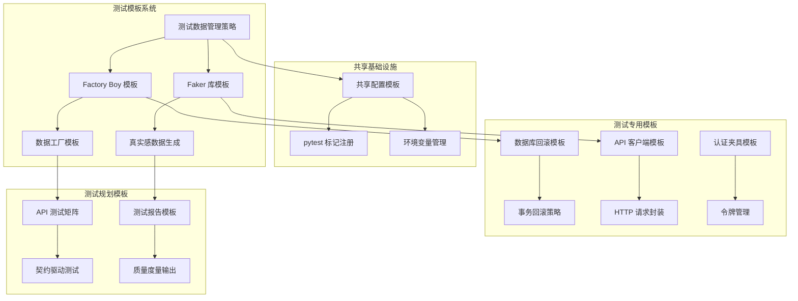
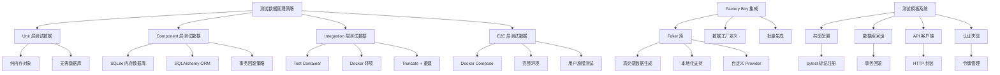
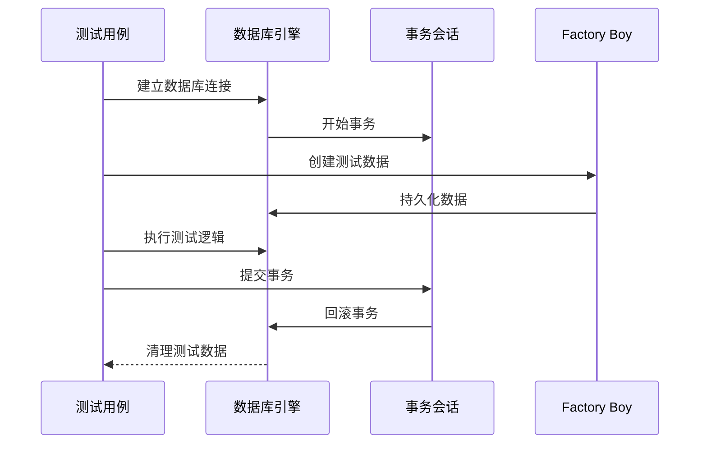
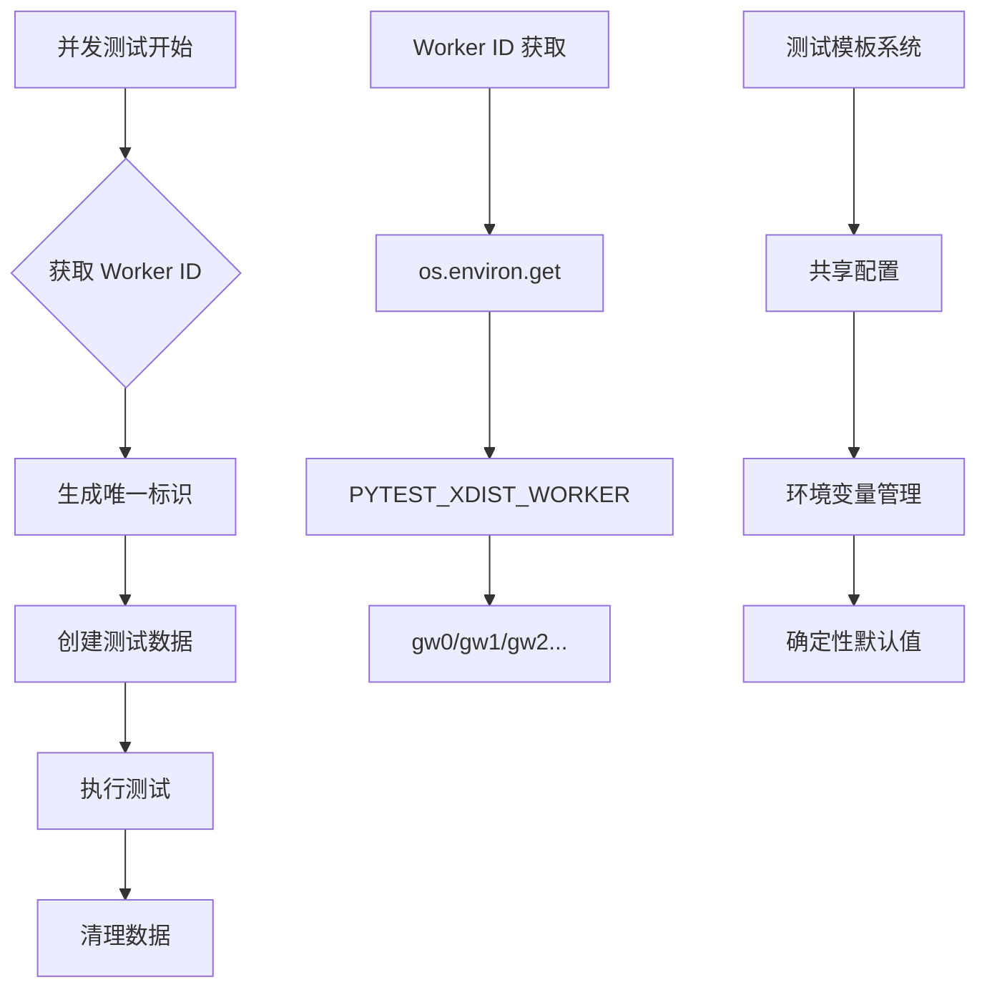
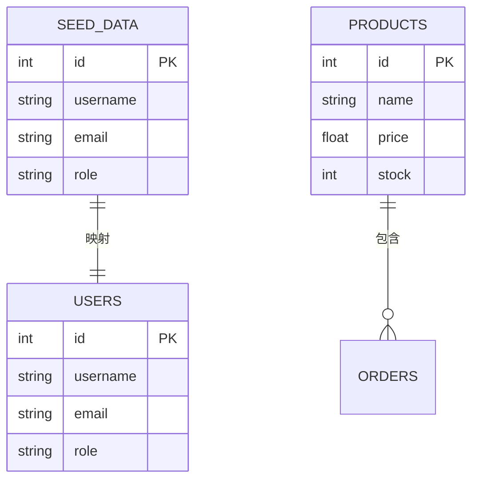
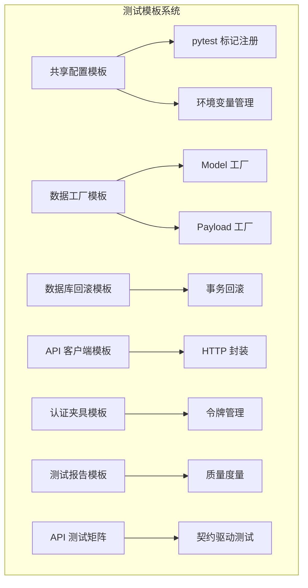
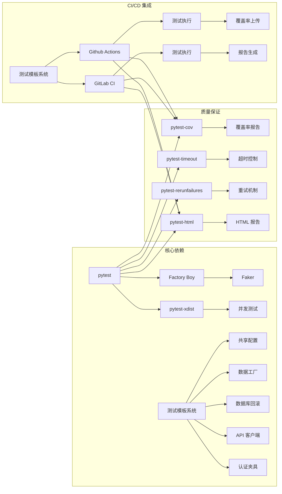
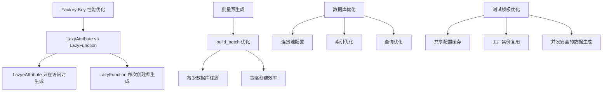
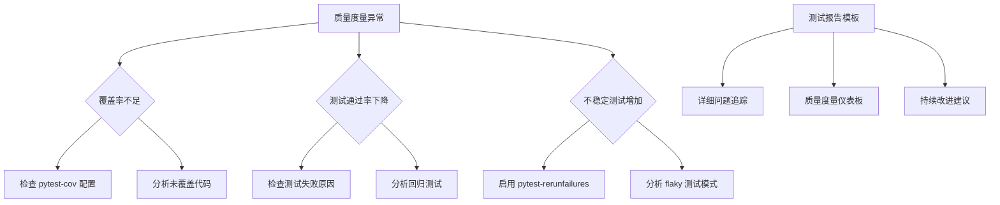

# 测试数据管理参考

<cite>
**本文档引用的文件**
- [测试数据管理策略](file://altas-workflow/references/testing/test-data-management.md)
- [pytest 测试模式参考](file://altas-workflow/references/testing/pytest-patterns.md)
- [测试质量度量体系](file://altas-workflow/references/testing/test-quality-metrics.md)
- [CI/CD 测试集成指南](file://altas-workflow/references/testing/ci-cd-integration.md)
- [pytest 脚手架模板](file://altas-workflow/references/testing/test-scaffold-templates.md)
- [RIPER-5 严格操作协议](file://altas-workflow/protocols/RIPER-5.md)
- [RIPER-DOC 文档协议](file://altas-workflow/protocols/RIPER-DOC.md)
- [SDD-RIPER 双模型协作协议](file://altas-workflow/protocols/SDD-RIPER-DUAL-COOP.md)
- [协议选择指南](file://altas-workflow/protocols/PROTOCOL-SELECTION.md)
- [测试模板：数据工厂](file://altas-workflow/references/testing/templates/factories.py)
- [测试模板：共享配置](file://altas-workflow/references/testing/templates/conftest.py)
- [测试模板：数据库回滚](file://altas-workflow/references/testing/templates/db_rollback_fixture.py)
- [测试模板：API 客户端](file://altas-workflow/references/testing/templates/api_client_fixture.py)
- [测试模板：认证夹具](file://altas-workflow/references/testing/templates/auth_fixture.py)
- [测试模板：API 测试矩阵](file://altas-workflow/references/testing/templates/api_test_matrix.md)
- [测试模板：测试报告](file://altas-workflow/references/testing/templates/test_report.md)
</cite>

## 更新摘要
**变更内容**
- 新增测试模板系统对测试数据管理策略的影响分析
- 更新 Factory Boy 和 Faker 库的集成使用模式
- 添加新的数据工厂模板应用指南
- 扩展测试模板系统的架构图和组件分析
- 增强并发测试数据处理和性能优化策略

## 目录
1. [简介](#简介)
2. [项目结构](#项目结构)
3. [核心组件](#核心组件)
4. [架构概览](#架构概览)
5. [详细组件分析](#详细组件分析)
6. [测试模板系统](#测试模板系统)
7. [依赖分析](#依赖分析)
8. [性能考虑](#性能考虑)
9. [故障排除指南](#故障排除指南)
10. [结论](#结论)
11. [附录](#附录)

## 简介

本参考文档基于 ALTAS 工作流中的测试数据管理策略，提供了系统化的测试数据管理最佳实践和实施指南。该文档整合了 pytest 测试框架、Factory Boy 数据工厂、Faker 库以及 CI/CD 集成等核心技术，旨在帮助开发团队建立高质量、可维护的测试数据管理体系。

**更新** 新增的测试模板系统显著增强了测试数据管理的标准化程度，特别是 Factory Boy 和 Faker 库的集成使用，为不同层级的测试提供了统一的数据工厂模板和最佳实践。

测试数据管理是软件测试工程中的关键环节，直接影响测试的可靠性、可重复性和维护效率。本参考文档特别强调了数据独立性、可重复性、真实性、最小化和自清理等核心原则，为不同层级的测试（单元测试、集成测试、端到端测试）提供了相应的数据管理策略。

## 项目结构

ALTAS 工作流采用模块化的设计理念，将测试相关的知识和工具分布在不同的文件和目录中，形成了完整的测试模板生态系统：



**图表来源**
- [测试数据管理策略:1-769](file://altas-workflow/references/testing/test-data-management.md#L1-L769)
- [测试模板：数据工厂:1-50](file://altas-workflow/references/testing/templates/factories.py#L1-L50)
- [测试模板：共享配置:1-49](file://altas-workflow/references/testing/templates/conftest.py#L1-L49)

项目结构体现了从理论指导到实践应用的完整闭环，每个组件都有明确的职责分工和相互依赖关系。新增的测试模板系统为传统的测试数据管理策略提供了标准化的实现框架。

**章节来源**
- [测试数据管理策略:1-769](file://altas-workflow/references/testing/test-data-management.md#L1-L769)
- [测试模板：数据工厂:1-50](file://altas-workflow/references/testing/templates/factories.py#L1-L50)
- [测试模板：共享配置:1-49](file://altas-workflow/references/testing/templates/conftest.py#L1-L49)

## 核心组件

### 测试数据层次架构

ALTAS 工作流定义了四个层次的测试数据管理策略，每个层次都有其特定的应用场景和性能特征：

| 层级 | 数据来源 | 隔离策略 | 适用场景 | 速度 |
|------|---------|----------|----------|------|
| **Unit** | 纯内存对象 | 无需 DB | 函数/方法级测试 | ⚡ 极快 |
| **Component** | SQLite 内存 / Mock | 每测试事务回滚 | 单模块集成测试 | 🚀 快 |
| **Integration** | Test Container (Docker) | 每测试类 truncate + 重建 | 跨服务交互 | 🐢 中等 |
| **E2E** | Docker Compose 环境 | 完整环境重建 | 用户旅程测试 | 🐌 较慢 |

### Factory Boy 集成

**更新** 新增的测试模板系统提供了两种 Factory Boy 的使用模式：

#### 传统工厂模式（Model 工厂）
基于 `factory.Factory`，适用于 ORM 模型的测试数据生成：

```python
class UserFactory(factory.Factory):
    class Meta:
        model = User
    
    username = factory.LazyFunction(fake.user_name)
    email = factory.LazyFunction(fake.email)
    role = "user"
```

#### 字典工厂模式（Payload 工厂）
基于 `factory.DictFactory`，适用于 API 和服务测试的请求负载生成：

```python
class UserFactory(factory.DictFactory):
    """Simple payload factory for API and service tests."""
    
    username = factory.LazyFunction(lambda: fake.user_name())
    email = factory.LazyAttribute(lambda obj: f"{obj['username']}@example.com")
    password = factory.LazyFunction(lambda: fake.password(length=16))
    role = "user"
```

**章节来源**
- [测试数据管理策略:43-121](file://altas-workflow/references/testing/test-data-management.md#L43-L121)
- [测试模板：数据工厂:16-27](file://altas-workflow/references/testing/templates/factories.py#L16-L27)

## 架构概览

测试数据管理的整体架构采用了分层设计和策略模式，结合新增的测试模板系统，确保不同层级的测试需求得到恰当满足：



**图表来源**
- [测试数据管理策略:18-40](file://altas-workflow/references/testing/test-data-management.md#L18-L40)
- [测试数据管理策略:43-360](file://altas-workflow/references/testing/test-data-management.md#L43-L360)
- [测试模板：共享配置:15-21](file://altas-workflow/references/testing/templates/conftest.py#L15-L21)

## 详细组件分析

### 测试数据隔离策略

测试数据隔离是确保测试独立性和可重复性的关键。文档提供了三种主要的隔离策略，结合新的测试模板系统：

#### 事务回滚策略（推荐用于 Integration 测试）

**更新** 新的数据库回滚模板提供了标准化的实现：



**图表来源**
- [测试数据管理策略:364-407](file://altas-workflow/references/testing/test-data-management.md#L364-L407)
- [测试模板：数据库回滚:23-36](file://altas-workflow/references/testing/templates/db_rollback_fixture.py#L23-L36)

#### 物理删除策略

适用于无法使用事务回滚的场景，通过自动清理机制确保测试环境的纯净。

#### Schema 重建策略

主要用于 E2E 测试，通过完整的数据库重建确保测试环境的一致性。

**章节来源**
- [测试数据管理策略:362-462](file://altas-workflow/references/testing/test-data-management.md#L362-L462)
- [测试模板：数据库回滚:15-21](file://altas-workflow/references/testing/templates/db_rollback_fixture.py#L15-L21)

### 并发测试数据处理

并发测试是现代测试框架面临的重要挑战，文档提供了三种解决方案，结合新的测试模板系统：

#### Worker-aware 数据生成

**更新** 新的测试模板系统提供了标准化的并发处理模式：



**图表来源**
- [测试数据管理策略:595-611](file://altas-workflow/references/testing/test-data-management.md#L595-L611)
- [测试模板：共享配置:43-49](file://altas-workflow/references/testing/templates/conftest.py#L43-L49)

#### 独立数据库 per Worker

为每个测试 worker 创建独立的数据库实例，完全隔离测试数据。

#### 顺序执行关键测试

对于存在竞态条件的测试，使用 `xdist_group` 标记确保串行执行。

**章节来源**
- [测试数据管理策略:581-642](file://altas-workflow/references/testing/test-data-management.md#L581-L642)
- [测试模板：共享配置:15-21](file://altas-workflow/references/testing/templates/conftest.py#L15-L21)

### 测试数据版本管理

#### Seed 数据与迁移同步



#### 敏感数据脱敏规则

实现了基于正则表达式的敏感数据自动脱敏机制，确保测试数据符合隐私保护要求。

**章节来源**
- [测试数据管理策略:465-578](file://altas-workflow/references/testing/test-data-management.md#L465-L578)

## 测试模板系统

**新增** 测试模板系统是本次更新的核心内容，提供了标准化的测试基础设施和最佳实践。

### 模板系统架构



**图表来源**
- [测试模板：共享配置:15-49](file://altas-workflow/references/testing/templates/conftest.py#L15-L49)
- [测试模板：数据工厂:16-49](file://altas-workflow/references/testing/templates/factories.py#L16-L49)
- [测试模板：数据库回滚:15-43](file://altas-workflow/references/testing/templates/db_rollback_fixture.py#L15-L43)

### 共享配置模板

**更新** 新增的共享配置模板提供了标准化的 pytest 设置：

- **pytest 标记注册**：统一的测试标记系统（unit、integration、contract、slow）
- **环境变量管理**：集中化的环境配置和默认值
- **运行元数据**：测试执行的上下文信息

### 数据工厂模板

**更新** 新增的数据工厂模板提供了两种工厂模式：

#### Model 工厂模式
适用于 ORM 模型的测试数据生成，继承自 `factory.Factory`：

```python
class UserFactory(factory.Factory):
    """用户工厂 - ORM 模型"""
    class Meta:
        model = User
    
    username = factory.LazyFunction(fake.user_name)
    email = factory.LazyFunction(fake.email)
    role = "user"
```

#### Payload 工厂模式
适用于 API 和服务测试的请求负载生成，继承自 `factory.DictFactory`：

```python
class UserFactory(factory.DictFactory):
    """用户工厂 - 请求负载"""
    username = factory.LazyFunction(lambda: fake.user_name())
    email = factory.LazyAttribute(lambda obj: f"{obj['username']}@example.com")
    password = factory.LazyFunction(lambda: fake.password(length=16))
    role = "user"
```

**章节来源**
- [测试模板：数据工厂:16-49](file://altas-workflow/references/testing/templates/factories.py#L16-L49)

### 数据库回滚模板

**更新** 新增的数据库回滚模板提供了标准化的集成测试数据库处理：

- **事务包装**：每个测试都在独立事务中执行
- **自动清理**：测试结束后自动回滚事务
- **依赖注入**：替换应用程序的数据库依赖

### API 客户端模板

**更新** 新增的 API 客户端模板提供了标准化的 HTTP 测试客户端：

- **统一接口**：简化 HTTP 请求的测试代码
- **默认配置**：集中化的请求头和超时设置
- **生命周期管理**：自动的客户端创建和销毁

### 认证夹具模板

**更新** 新增的认证夹具模板提供了标准化的 API 认证测试：

- **凭据管理**：测试专用的认证凭据
- **令牌获取**：自动化的访问令牌获取
- **头部封装**：标准化的认证头部设置

**章节来源**
- [测试模板：API 客户端:14-57](file://altas-workflow/references/testing/templates/api_client_fixture.py#L14-L57)
- [测试模板：认证夹具:10-51](file://altas-workflow/references/testing/templates/auth_fixture.py#L10-L51)

### 测试报告模板

**更新** 新增的测试报告模板提供了标准化的测试结果输出格式：

- **质量度量**：覆盖率、通过率、不稳定测试等指标
- **失败归因**：详细的失败原因分析和分类
- **持续改进建议**：基于测试结果的质量门禁建议

**章节来源**
- [测试模板：测试报告:1-59](file://altas-workflow/references/testing/templates/test_report.md#L1-L59)

## 依赖分析

### 核心依赖关系

测试数据管理系统依赖于多个关键组件，形成了紧密的依赖关系，结合新的测试模板系统：



**图表来源**
- [测试数据管理策略:765-769](file://altas-workflow/references/testing/test-data-management.md#L765-L769)
- [测试模板：共享配置:15-21](file://altas-workflow/references/testing/templates/conftest.py#L15-L21)

### 协议依赖

ALTAS 工作流提供了多种协议来支持不同的测试场景，结合测试模板系统：

| 协议类型 | 主要功能 | 适用场景 | 模板支持 |
|----------|----------|----------|----------|
| **RIPER-5** | 严格操作协议 | 需要手动审批的测试流程 | ✅ 支持标记和质量度量 |
| **RIPER-DOC** | 文档协议 | 测试文档编写和审核 | ✅ 支持测试报告模板 |
| **SDD-RIPER** | 双模型协作 | 复杂测试系统的开发 | ✅ 支持多层测试数据管理 |
| **默认协议** | 标准工作流 | 日常测试活动 | ✅ 完整模板系统支持 |

**章节来源**
- [RIPER-5 严格操作协议:1-187](file://altas-workflow/protocols/RIPER-5.md#L1-L187)
- [RIPER-DOC 文档协议:1-66](file://altas-workflow/protocols/RIPER-DOC.md#L1-L66)
- [SDD-RIPER 双模型协作协议:1-210](file://altas-workflow/protocols/SDD-RIPER-DUAL-COOP.md#L1-L210)
- [协议选择指南:1-26](file://altas-workflow/protocols/PROTOCOL-SELECTION.md#L1-L26)

## 性能考虑

### 性能优化技巧

#### 惰性加载优化

**更新** 新的测试模板系统增强了性能优化能力：



**图表来源**
- [测试数据管理策略:645-692](file://altas-workflow/references/testing/test-data-management.md#L645-L692)
- [测试模板：数据工厂:16-27](file://altas-workflow/references/testing/templates/factories.py#L16-L27)

#### 并发执行优化

针对 pytest-xdist 的并发执行，提供了专门的优化策略，结合新的测试模板系统：
- 使用 `loadscope` 分配策略避免共享状态竞争
- 实现 worker-aware 的数据生成避免冲突
- 配置适当的超时和重试机制
- 利用共享配置模板确保环境一致性

**章节来源**
- [测试数据管理策略:645-692](file://altas-workflow/references/testing/test-data-management.md#L645-L692)
- [测试模板：共享配置:43-49](file://altas-workflow/references/testing/templates/conftest.py#L43-L49)

## 故障排除指南

### 常见问题诊断

#### 测试数据相关问题

**更新** 新增的测试模板系统提供了更好的问题诊断能力：

| 问题类型 | 症状 | 诊断步骤 | 解决方案 | 模板支持 |
|----------|------|----------|----------|----------|
| **数据污染** | 测试间相互影响 | 检查隔离策略配置 | 实施事务回滚或物理清理 | ✅ 数据库回滚模板 |
| **并发冲突** | 随机失败 | 分析 Worker ID 和数据生成 | 使用 worker-aware 标识 | ✅ 共享配置模板 |
| **性能瓶颈** | 测试执行缓慢 | 分析测试时长分布 | 实施批量预生成和惰性加载 | ✅ 数据工厂模板 |
| **内存泄漏** | 长时间运行后内存增长 | 检查资源清理 | 实现自动清理机制 | ✅ API 客户端模板 |

#### 质量度量问题



**图表来源**
- [测试质量度量体系:295-383](file://altas-workflow/references/testing/test-quality-metrics.md#L295-L383)
- [测试模板：测试报告:27-36](file://altas-workflow/references/testing/templates/test_report.md#L27-L36)

**章节来源**
- [测试质量度量体系:1-900](file://altas-workflow/references/testing/test-quality-metrics.md#L1-L900)

## 结论

ALTAS 工作流提供的测试数据管理参考文档建立了一个完整的测试数据管理体系，结合新增的测试模板系统，进一步提升了测试数据管理的标准化和自动化水平。该体系的核心价值在于：

1. **系统性**：从测试数据的生成、管理到质量保证形成了完整的闭环
2. **可扩展性**：支持从简单单元测试到复杂端到端测试的各种场景
3. **可维护性**：通过标准化的模板和最佳实践降低了维护成本
4. **可观察性**：完善的质量度量和监控机制确保了测试效果的可视化
5. **标准化**：新增的测试模板系统提供了统一的基础设施和最佳实践

**更新** 新增的测试模板系统特别强调了以下改进：
- **标准化的数据工厂**：统一的 Factory Boy 和 Faker 集成模式
- **增强的并发处理**：worker-aware 的数据生成和环境管理
- **完善的测试基础设施**：数据库回滚、API 客户端、认证夹具等模板
- **结构化的测试报告**：标准化的质量度量和问题追踪

通过遵循本文档的指导原则和实施策略，开发团队可以建立高质量、可维护的测试数据管理体系，显著提升软件测试的效率和可靠性。

## 附录

### 快速参考

#### 核心命令

```bash
# 基础测试执行
pytest tests/

# 带覆盖率的测试
pytest --cov=src tests/

# 并发测试执行
pytest -n auto --dist=loadscope tests/

# 超时控制
pytest --timeout=30 tests/

# 重试机制
pytest --reruns 3 --reruns-delay 2 tests/

# 使用测试模板
pytest --html=reports/report.html tests/
```

#### 配置文件示例

```ini
# pytest.ini
[tool.pytest.ini_options]
addopts = 
    -v
    --tb=short
    --strict-markers
    -n auto
    --dist=loadscope
    --timeout=30
    --html=reports/report.html
    --self-contained-html
```

#### 测试模板使用指南

**更新** 新增的测试模板系统使用指南：

1. **复制共享配置**：将 `conftest.py` 复制到项目 `tests/` 目录
2. **配置数据工厂**：根据项目需求调整 `factories.py` 中的工厂定义
3. **设置数据库回滚**：修改 `db_rollback_fixture.py` 中的数据库连接配置
4. **配置 API 客户端**：调整 `api_client_fixture.py` 中的 API 端点和超时设置
5. **使用认证夹具**：在需要认证的测试中使用 `auth_fixture.py` 中的夹具

**章节来源**
- [CI/CD 测试集成指南:384-660](file://altas-workflow/references/testing/ci-cd-integration.md#L384-L660)
- [pytest 测试模式参考:507-560](file://altas-workflow/references/testing/pytest-patterns.md#L507-L560)
- [测试模板：共享配置:15-49](file://altas-workflow/references/testing/templates/conftest.py#L15-L49)
- [测试模板：数据工厂:1-50](file://altas-workflow/references/testing/templates/factories.py#L1-L50)
- [测试模板：数据库回滚:12-43](file://altas-workflow/references/testing/templates/db_rollback_fixture.py#L12-L43)
- [测试模板：API 客户端:14-57](file://altas-workflow/references/testing/templates/api_client_fixture.py#L14-L57)
- [测试模板：认证夹具:10-51](file://altas-workflow/references/testing/templates/auth_fixture.py#L10-L51)