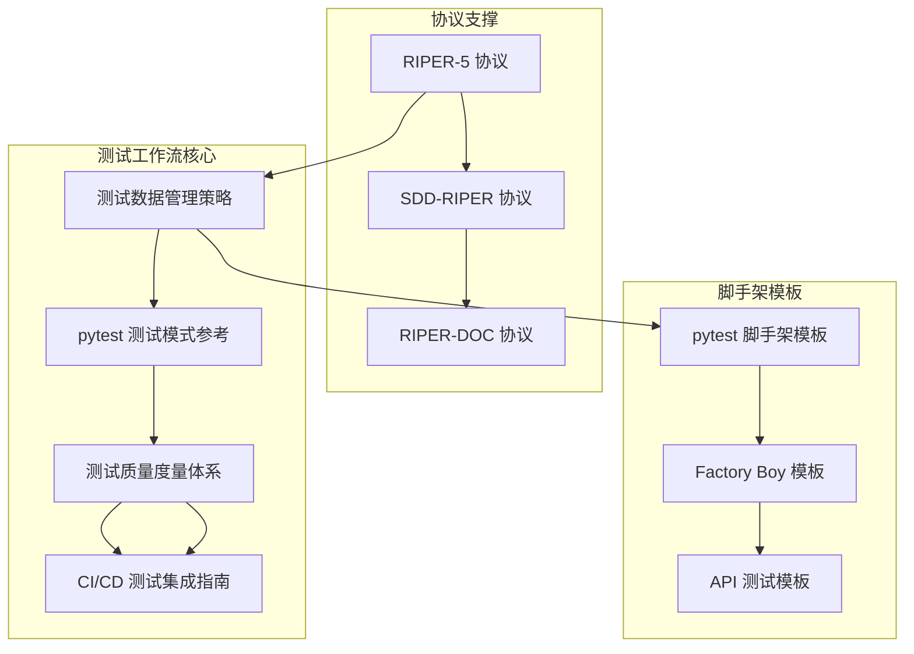
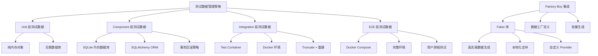
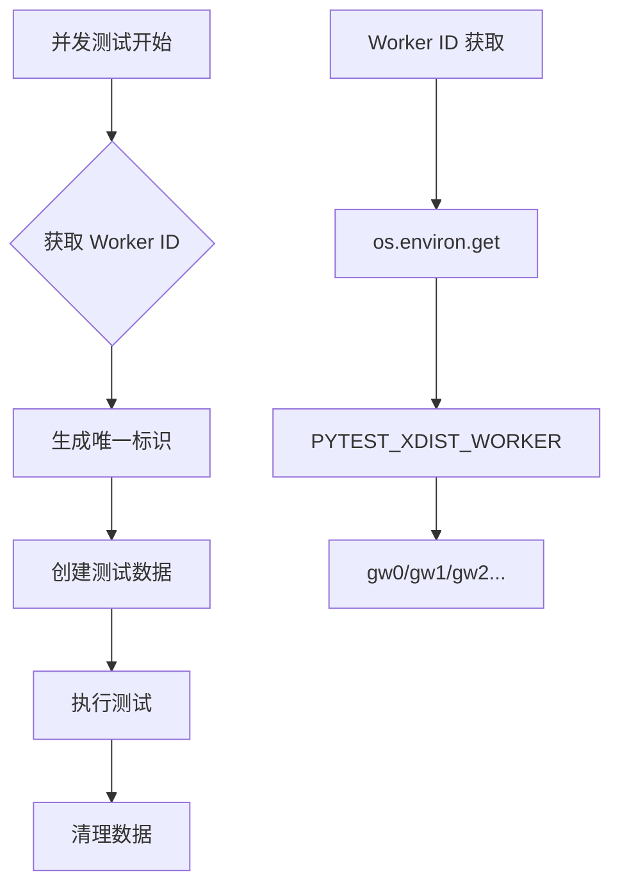
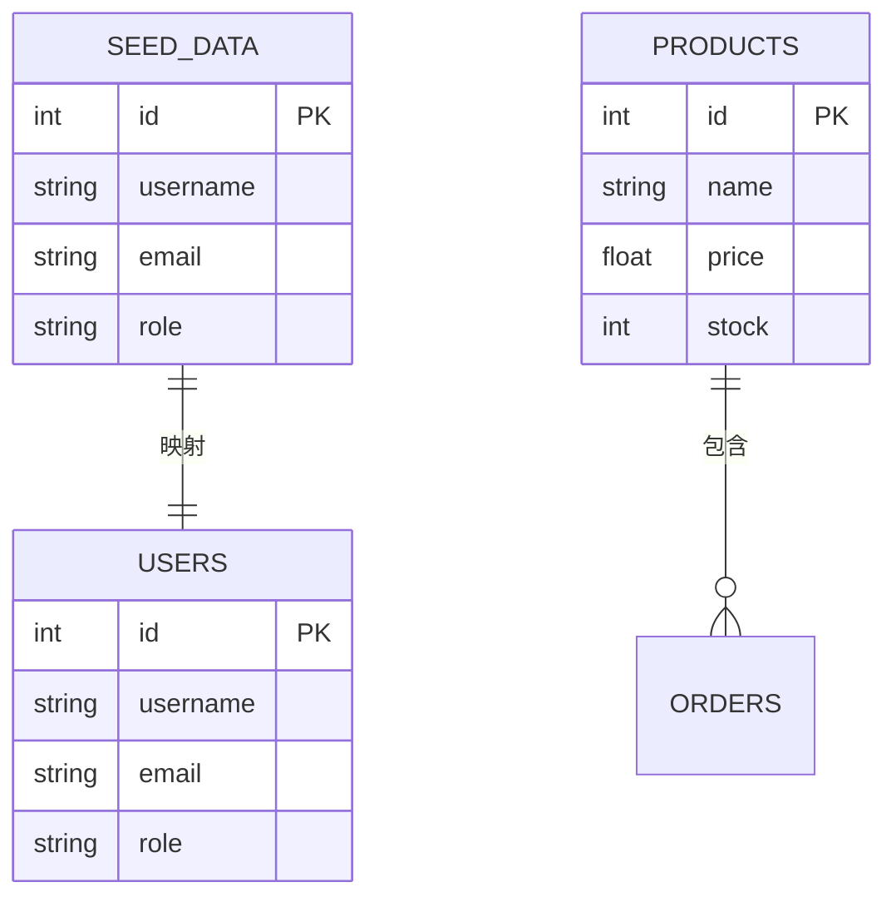
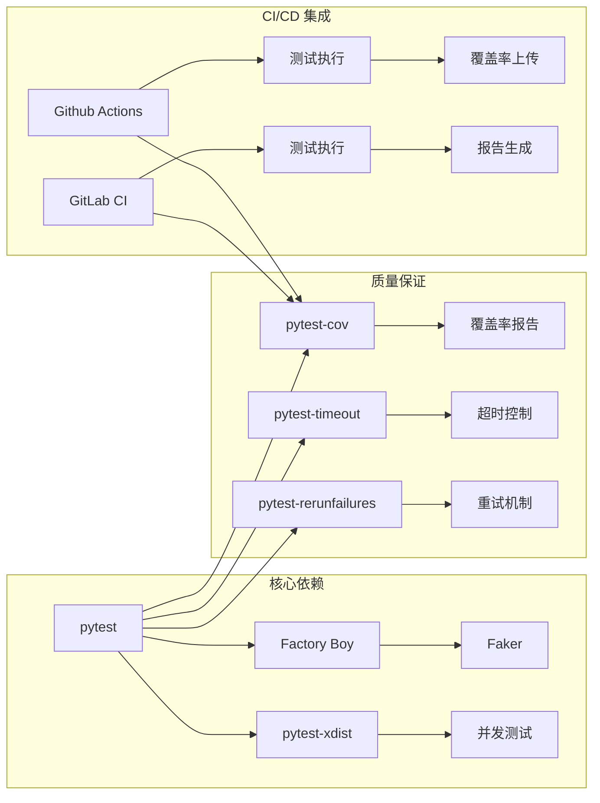
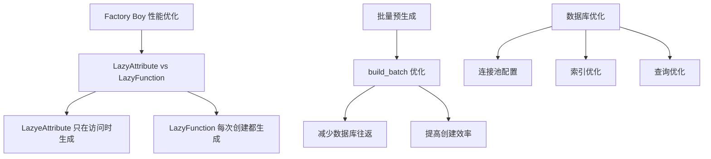
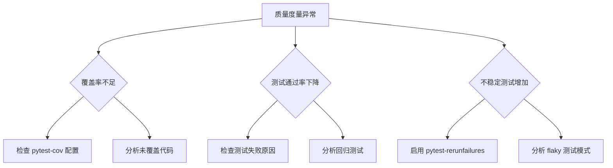

# 测试数据管理参考

<cite>
**本文档引用的文件**
- [测试数据管理策略](file://altas-workflow/references/testing/test-data-management.md)
- [pytest 测试模式参考](file://altas-workflow/references/testing/pytest-patterns.md)
- [测试质量度量体系](file://altas-workflow/references/testing/test-quality-metrics.md)
- [CI/CD 测试集成指南](file://altas-workflow/references/testing/ci-cd-integration.md)
- [pytest 脚手架模板](file://altas-workflow/references/testing/test-scaffold-templates.md)
- [RIPER-5 严格操作协议](file://altas-workflow/protocols/RIPER-5.md)
- [RIPER-DOC 文档协议](file://altas-workflow/protocols/RIPER-DOC.md)
- [SDD-RIPER 双模型协作协议](file://altas-workflow/protocols/SDD-RIPER-DUAL-COOP.md)
- [协议选择指南](file://altas-workflow/protocols/PROTOCOL-SELECTION.md)
</cite>

## 目录
1. [简介](#简介)
2. [项目结构](#项目结构)
3. [核心组件](#核心组件)
4. [架构概览](#架构概览)
5. [详细组件分析](#详细组件分析)
6. [依赖分析](#依赖分析)
7. [性能考虑](#性能考虑)
8. [故障排除指南](#故障排除指南)
9. [结论](#结论)
10. [附录](#附录)

## 简介

本参考文档基于 ALTAS 工作流中的测试数据管理策略，提供了系统化的测试数据管理最佳实践和实施指南。该文档整合了 pytest 测试框架、Factory Boy 数据工厂、Faker 库以及 CI/CD 集成等核心技术，旨在帮助开发团队建立高质量、可维护的测试数据管理体系。

测试数据管理是软件测试工程中的关键环节，直接影响测试的可靠性、可重复性和维护效率。本参考文档特别强调了数据独立性、可重复性、真实性、最小化和自清理等核心原则，为不同层级的测试（单元测试、集成测试、端到端测试）提供了相应的数据管理策略。

## 项目结构

ALTAS 工作流采用模块化的设计理念，将测试相关的知识和工具分布在不同的文件和目录中：



**图表来源**
- [测试数据管理策略:1-769](file://altas-workflow/references/testing/test-data-management.md#L1-L769)
- [pytest 测试模式参考:1-741](file://altas-workflow/references/testing/pytest-patterns.md#L1-L741)
- [测试质量度量体系:1-900](file://altas-workflow/references/testing/test-quality-metrics.md#L1-L900)

项目结构体现了从理论指导到实践应用的完整闭环，每个组件都有明确的职责分工和相互依赖关系。

**章节来源**
- [测试数据管理策略:1-769](file://altas-workflow/references/testing/test-data-management.md#L1-L769)
- [pytest 测试模式参考:1-741](file://altas-workflow/references/testing/pytest-patterns.md#L1-L741)

## 核心组件

### 测试数据层次架构

ALTAS 工作流定义了四个层次的测试数据管理策略，每个层次都有其特定的应用场景和性能特征：

| 层级 | 数据来源 | 隔离策略 | 适用场景 | 速度 |
|------|---------|----------|----------|------|
| **Unit** | 纯内存对象 | 无需 DB | 函数/方法级测试 | ⚡ 极快 |
| **Component** | SQLite 内存 / Mock | 每测试事务回滚 | 单模块集成测试 | 🚀 快 |
| **Integration** | Test Container (Docker) | 每测试类 truncate + 重建 | 跨服务交互 | 🐢 中等 |
| **E2E** | Docker Compose 环境 | 完整环境重建 | 用户旅程测试 | 🐌 较慢 |

### Factory Boy 集成

Factory Boy 提供了声明式的测试数据创建方式，具有以下优势：
- **声明式定义**：数据结构一目了然
- **链式创建**：复杂关联对象一行搞定
- **惰性求值**：只在访问时生成值，节省资源
- **可覆盖**：特定测试可灵活修改字段
- **批量生成**：批量创建测试数据集

**章节来源**
- [测试数据管理策略:18-40](file://altas-workflow/references/testing/test-data-management.md#L18-L40)
- [测试数据管理策略:43-121](file://altas-workflow/references/testing/test-data-management.md#L43-L121)

## 架构概览

测试数据管理的整体架构采用了分层设计和策略模式，确保不同层级的测试需求得到恰当满足：



**图表来源**
- [测试数据管理策略:18-40](file://altas-workflow/references/testing/test-data-management.md#L18-L40)
- [测试数据管理策略:43-360](file://altas-workflow/references/testing/test-data-management.md#L43-L360)

## 详细组件分析

### 测试数据隔离策略

测试数据隔离是确保测试独立性和可重复性的关键。文档提供了三种主要的隔离策略：

#### 事务回滚策略（推荐用于 Integration 测试）


**图表来源**
- [测试数据管理策略:364-407](file://altas-workflow/references/testing/test-data-management.md#L364-L407)

#### 物理删除策略

适用于无法使用事务回滚的场景，通过自动清理机制确保测试环境的纯净。

#### Schema 重建策略

主要用于 E2E 测试，通过完整的数据库重建确保测试环境的一致性。

**章节来源**
- [测试数据管理策略:362-462](file://altas-workflow/references/testing/test-data-management.md#L362-L462)

### 并发测试数据处理

并发测试是现代测试框架面临的重要挑战，文档提供了三种解决方案：

#### Worker-aware 数据生成



**图表来源**
- [测试数据管理策略:595-611](file://altas-workflow/references/testing/test-data-management.md#L595-L611)

#### 独立数据库 per Worker

为每个测试 worker 创建独立的数据库实例，完全隔离测试数据。

#### 顺序执行关键测试

对于存在竞态条件的测试，使用 `xdist_group` 标记确保串行执行。

**章节来源**
- [测试数据管理策略:581-642](file://altas-workflow/references/testing/test-data-management.md#L581-L642)

### 测试数据版本管理

#### Seed 数据与迁移同步



**图表来源**
- [测试数据管理策略:467-498](file://altas-workflow/references/testing/test-data-management.md#L467-L498)

#### 敏感数据脱敏规则

实现了基于正则表达式的敏感数据自动脱敏机制，确保测试数据符合隐私保护要求。

**章节来源**
- [测试数据管理策略:465-578](file://altas-workflow/references/testing/test-data-management.md#L465-L578)

## 依赖分析

### 核心依赖关系

测试数据管理系统依赖于多个关键组件，形成了紧密的依赖关系：



**图表来源**
- [测试数据管理策略:765-769](file://altas-workflow/references/testing/test-data-management.md#L765-L769)
- [pytest 测试模式参考:542-560](file://altas-workflow/references/testing/pytest-patterns.md#L542-L560)
- [CI/CD 测试集成指南:1-800](file://altas-workflow/references/testing/ci-cd-integration.md#L1-L800)

### 协议依赖

ALTAS 工作流提供了多种协议来支持不同的测试场景：

| 协议类型 | 主要功能 | 适用场景 |
|----------|----------|----------|
| **RIPER-5** | 严格操作协议 | 需要手动审批的测试流程 |
| **RIPER-DOC** | 文档协议 | 测试文档编写和审核 |
| **SDD-RIPER** | 双模型协作 | 复杂测试系统的开发 |
| **默认协议** | 标准工作流 | 日常测试活动 |

**章节来源**
- [RIPER-5 严格操作协议:1-187](file://altas-workflow/protocols/RIPER-5.md#L1-L187)
- [RIPER-DOC 文档协议:1-66](file://altas-workflow/protocols/RIPER-DOC.md#L1-L66)
- [SDD-RIPER 双模型协作协议:1-210](file://altas-workflow/protocols/SDD-RIPER-DUAL-COOP.md#L1-L210)
- [协议选择指南:1-26](file://altas-workflow/protocols/PROTOCOL-SELECTION.md#L1-L26)

## 性能考虑

### 性能优化技巧

#### 惰性加载优化



**图表来源**
- [测试数据管理策略:645-692](file://altas-workflow/references/testing/test-data-management.md#L645-L692)

#### 并发执行优化

针对 pytest-xdist 的并发执行，提供了专门的优化策略：
- 使用 `loadscope` 分配策略避免共享状态竞争
- 实现 worker-aware 的数据生成避免冲突
- 配置适当的超时和重试机制

**章节来源**
- [测试数据管理策略:645-692](file://altas-workflow/references/testing/test-data-management.md#L645-L692)

## 故障排除指南

### 常见问题诊断

#### 测试数据相关问题

| 问题类型 | 症状 | 诊断步骤 | 解决方案 |
|----------|------|----------|----------|
| **数据污染** | 测试间相互影响 | 检查隔离策略配置 | 实施事务回滚或物理清理 |
| **并发冲突** | 随机失败 | 分析 Worker ID 和数据生成 | 使用 worker-aware 标识 |
| **性能瓶颈** | 测试执行缓慢 | 分析测试时长分布 | 实施批量预生成和惰性加载 |
| **内存泄漏** | 长时间运行后内存增长 | 检查资源清理 | 实现自动清理机制 |

#### 质量度量问题



**图表来源**
- [测试质量度量体系:295-383](file://altas-workflow/references/testing/test-quality-metrics.md#L295-L383)

**章节来源**
- [测试质量度量体系:1-900](file://altas-workflow/references/testing/test-quality-metrics.md#L1-L900)

## 结论

ALTAS 工作流提供的测试数据管理参考文档建立了一个完整的测试数据管理体系，涵盖了从基础概念到高级应用的各个方面。该体系的核心价值在于：

1. **系统性**：从测试数据的生成、管理到质量保证形成了完整的闭环
2. **可扩展性**：支持从简单单元测试到复杂端到端测试的各种场景
3. **可维护性**：通过标准化的模板和最佳实践降低了维护成本
4. **可观察性**：完善的质量度量和监控机制确保了测试效果的可视化

通过遵循本文档的指导原则和实施策略，开发团队可以建立高质量、可维护的测试数据管理体系，显著提升软件测试的效率和可靠性。

## 附录

### 快速参考

#### 核心命令

```bash
# 基础测试执行
pytest tests/

# 带覆盖率的测试
pytest --cov=src tests/

# 并发测试执行
pytest -n auto --dist=loadscope tests/

# 超时控制
pytest --timeout=30 tests/

# 重试机制
pytest --reruns 3 --reruns-delay 2 tests/
```

#### 配置文件示例

```ini
# pytest.ini
[tool.pytest.ini_options]
addopts = 
    -v
    --tb=short
    --strict-markers
    -n auto
    --dist=loadscope
    --timeout=30
```

**章节来源**
- [CI/CD 测试集成指南:384-660](file://altas-workflow/references/testing/ci-cd-integration.md#L384-L660)
- [pytest 测试模式参考:507-560](file://altas-workflow/references/testing/pytest-patterns.md#L507-L560)