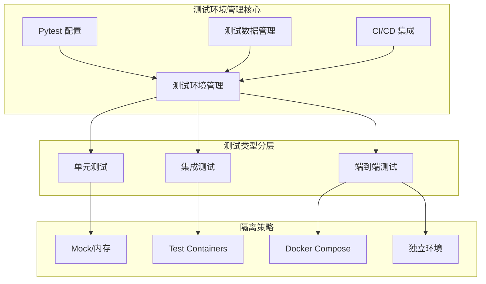
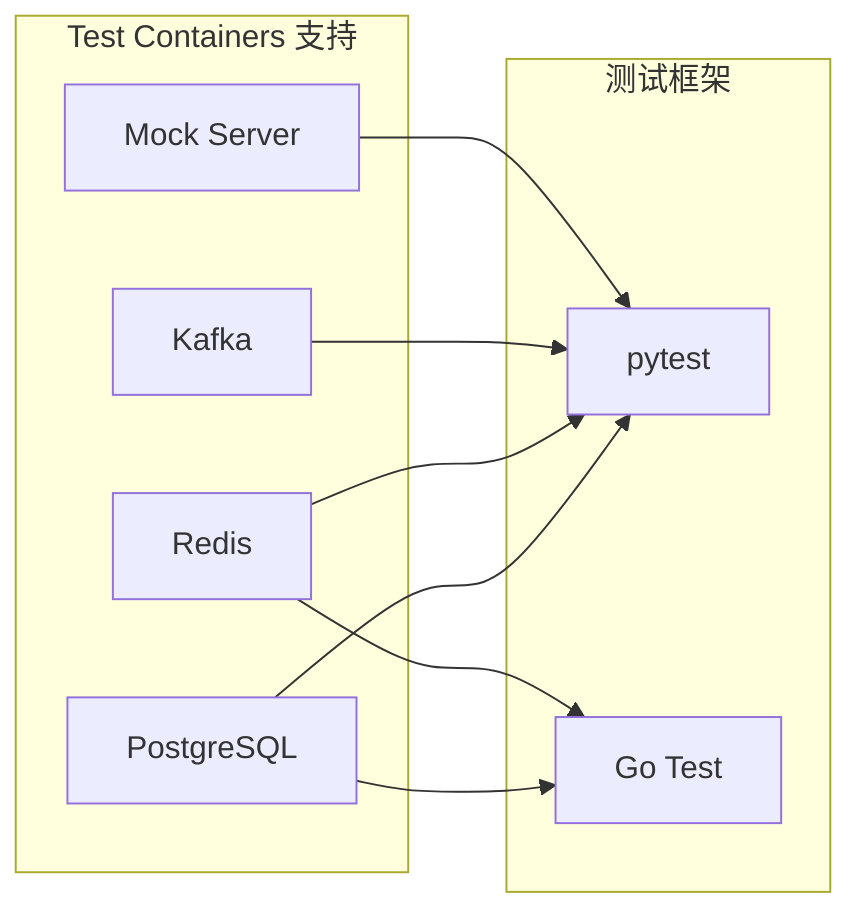
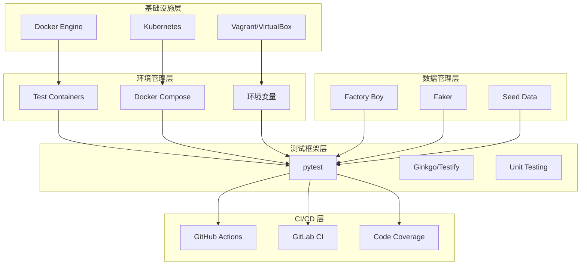
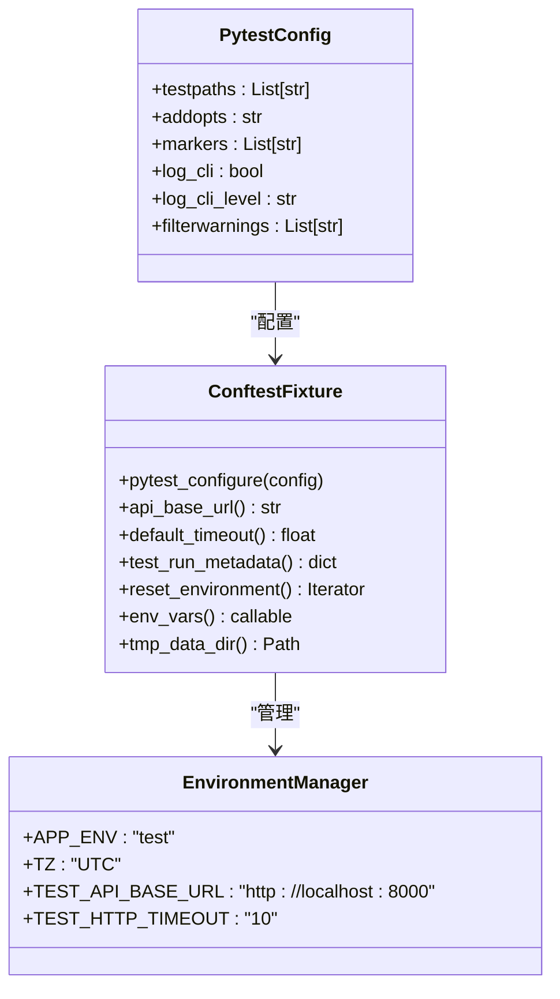
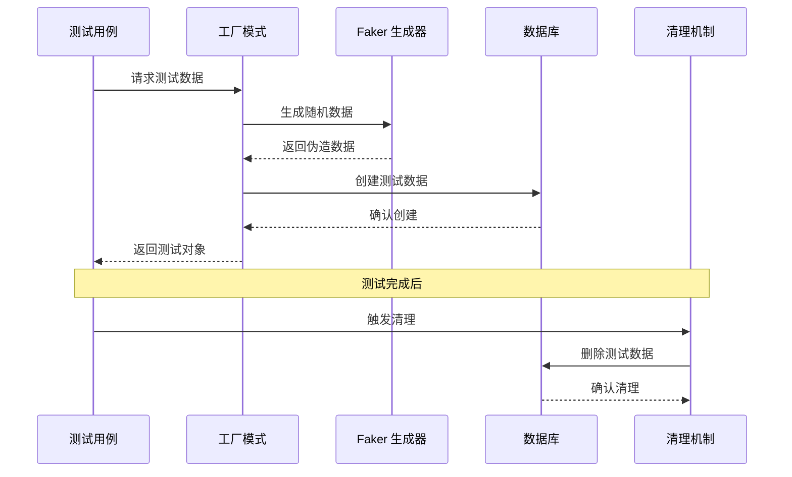
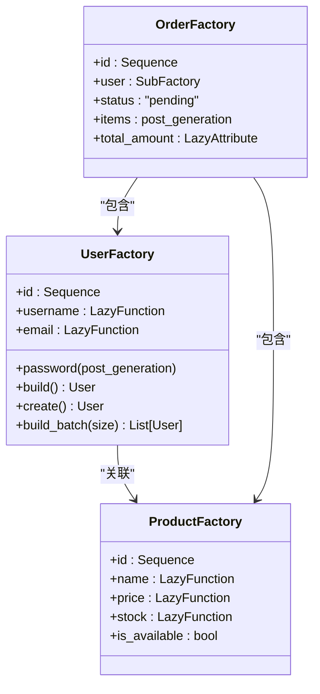
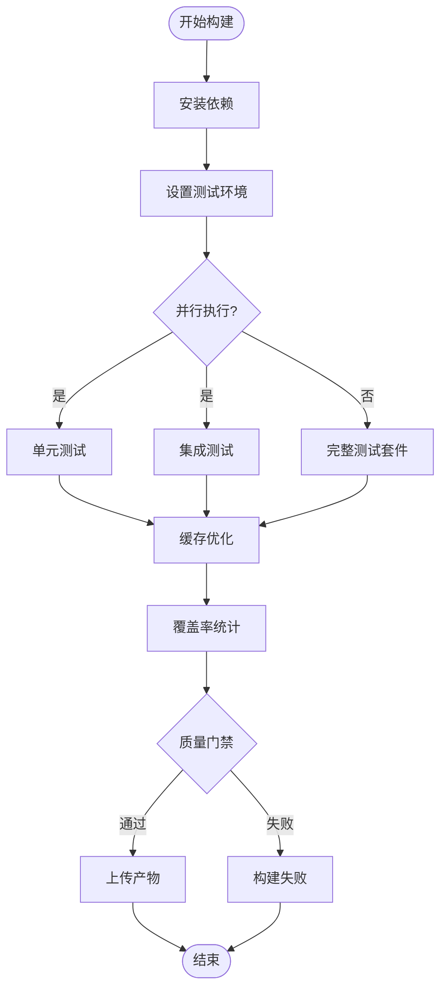
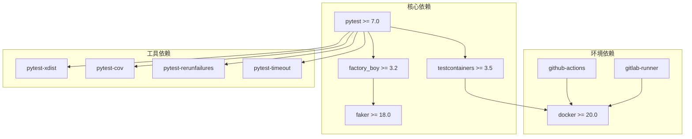
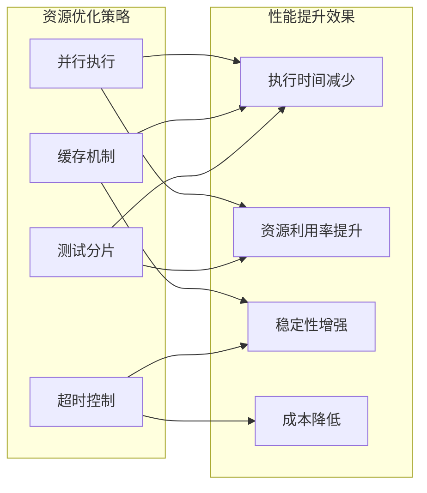

# 测试环境管理指南

<cite>
**本文档引用的文件**
- [测试环境管理](file://altas-workflow/references/testing/test-environment.md)
- [Pytest 配置模板](file://altas-workflow/references/testing/templates/pytest_config.toml)
- [Pytest 共享引导模板](file://altas-workflow/references/testing/templates/conftest.py)
- [CI/CD 测试集成指南](file://altas-workflow/references/testing/ci-cd-integration.md)
- [测试数据管理策略](file://altas-workflow/references/testing/test-data-management.md)
</cite>

## 目录
1. [简介](#简介)
2. [项目结构](#项目结构)
3. [核心组件](#核心组件)
4. [架构概览](#架构概览)
5. [详细组件分析](#详细组件分析)
6. [依赖关系分析](#依赖关系分析)
7. [性能考虑](#性能考虑)
8. [故障排除指南](#故障排除指南)
9. [结论](#结论)

## 简介

本指南提供了完整的测试环境管理系统，涵盖从本地开发到持续集成的全生命周期测试环境管理。该系统基于"环境即代码"的理念，通过容器化、自动化和标准化的方法，确保测试环境的一致性、隔离性和可重复性。

系统采用分层隔离策略，根据不同测试类型的依赖需求提供相应的环境配置方案，包括单元测试、集成测试和端到端测试的完整解决方案。

## 项目结构

测试环境管理系统的组织结构如下：

**图表来源**
- [测试环境管理:1-420](file://altas-workflow/references/testing/test-environment.md#L1-L420)
- [测试数据管理策略:1-769](file://altas-workflow/references/testing/test-data-management.md#L1-L769)

**章节来源**
- [测试环境管理:1-420](file://altas-workflow/references/testing/test-environment.md#L1-L420)
- [测试数据管理策略:1-769](file://altas-workflow/references/testing/test-data-management.md#L1-L769)

## 核心组件

### 测试环境隔离策略

系统采用四层隔离架构，确保不同测试级别的环境需求得到满足：

| 隔离层级 | 适用场景 | 隔离方式 | 性能特征 |
|---------|---------|---------|---------|
| Level 0 | 纯函数测试 | Mock/内存替代 | ⚡ 极快 |
| Level 1 | 单元测试 | SQLite 内存数据库 | 🚀 快速 |
| Level 2 | 集成测试 | Test Containers | 🐢 中等 |
| Level 3 | 端到端测试 | Docker Compose | 🐌 较慢 |

### Test Containers 集成

系统支持多种数据库和中间件的容器化测试环境：

**图表来源**
- [测试环境管理:42-162](file://altas-workflow/references/testing/test-environment.md#L42-L162)

**章节来源**
- [测试环境管理:17-414](file://altas-workflow/references/testing/test-environment.md#L17-L414)

## 架构概览

测试环境管理系统的整体架构采用分层设计，从底层基础设施到上层应用测试形成完整的测试生态系统：

**图表来源**
- [测试环境管理:166-420](file://altas-workflow/references/testing/test-environment.md#L166-L420)
- [CI/CD 测试集成指南:1-800](file://altas-workflow/references/testing/ci-cd-integration.md#L1-L800)

## 详细组件分析

### Pytest 配置管理系统

Pytest 配置系统提供了完整的测试环境初始化和管理功能：

**图表来源**
- [Pytest 配置模板:1-73](file://altas-workflow/references/testing/templates/pytest_config.toml#L1-L73)
- [Pytest 共享引导模板:1-67](file://altas-workflow/references/testing/templates/conftest.py#L1-L67)

#### 配置项详解

系统提供多种配置选项以满足不同的测试需求：

| 配置类别 | 选项名称 | 默认值 | 用途说明 |
|---------|---------|-------|---------|
| 基础配置 | testpaths | ["tests"] | 测试文件搜索路径 |
| 基础配置 | addopts | "-v --tb=short --strict-markers" | 命令行参数 |
| 标记配置 | markers | unit/integration/e2e/flaky | 测试分类标记 |
| 日志配置 | log_cli | true | 控制台日志输出 |
| 日志配置 | log_cli_level | "WARNING" | 日志级别过滤 |

**章节来源**
- [Pytest 配置模板:21-73](file://altas-workflow/references/testing/templates/pytest_config.toml#L21-L73)
- [Pytest 共享引导模板:15-67](file://altas-workflow/references/testing/templates/conftest.py#L15-L67)

### 测试数据管理策略

测试数据管理系统采用工厂模式和数据隔离策略，确保测试数据的独立性和可重复性：

**图表来源**
- [测试数据管理策略:62-179](file://altas-workflow/references/testing/test-data-management.md#L62-L179)

#### 数据工厂模式

系统使用 Factory Boy 库实现声明式的测试数据创建：

**图表来源**
- [测试数据管理策略:62-121](file://altas-workflow/references/testing/test-data-management.md#L62-L121)

**章节来源**
- [测试数据管理策略:43-179](file://altas-workflow/references/testing/test-data-management.md#L43-L179)

### CI/CD 集成架构

CI/CD 测试集成提供了完整的持续测试流程，包括并行执行、缓存优化和质量门禁：

**图表来源**
- [CI/CD 测试集成指南:18-300](file://altas-workflow/references/testing/ci-cd-integration.md#L18-L300)

#### 并行执行策略

系统支持多种并行执行模式以优化测试性能：

| 并行策略 | 适用场景 | 配置示例 |
|---------|---------|---------|
| auto | 通用场景 | `pytest -n auto` |
| logical | CPU 密集型 | `pytest -n logical` |
| loadscope | 有共享状态 | `pytest -n 4 --dist=loadscope` |
| loadfile | 文件大小差异大 | `pytest -n 4 --dist=loadfile` |

**章节来源**
- [CI/CD 测试集成指南:384-434](file://altas-workflow/references/testing/ci-cd-integration.md#L384-L434)

## 依赖关系分析

测试环境管理系统各组件之间的依赖关系如下：

**图表来源**
- [测试环境管理:44-48](file://altas-workflow/references/testing/test-environment.md#L44-L48)
- [Pytest 配置模板:35-72](file://altas-workflow/references/testing/templates/pytest_config.toml#L35-L72)

**章节来源**
- [测试环境管理:406-420](file://altas-workflow/references/testing/test-environment.md#L406-L420)
- [Pytest 配置模板:1-73](file://altas-workflow/references/testing/templates/pytest_config.toml#L1-L73)

## 性能考虑

### 测试执行优化

系统提供了多层次的性能优化策略：

1. **并行执行优化**
   - 使用 pytest-xdist 实现多进程并行
   - 支持负载均衡分配策略
   - 提供 worker 级别的资源隔离

2. **缓存策略优化**
   - pip 依赖缓存
   - pytest 缓存机制
   - 测试数据预生成缓存

3. **测试分片优化**
   - 基于执行时间的智能分片
   - 动态负载均衡
   - 失败重试机制

### 资源管理优化

**章节来源**
- [CI/CD 测试集成指南:384-658](file://altas-workflow/references/testing/ci-cd-integration.md#L384-L658)

## 故障排除指南

### 常见问题诊断

| 问题类型 | 症状表现 | 诊断步骤 | 解决方案 |
|---------|---------|---------|---------|
| 环境隔离失败 | 测试间相互影响 | 检查 fixture 作用域 | 使用正确的作用域级别 |
| 容器启动超时 | Test Containers 无法启动 | 检查 Docker 状态 | 增加超时时间或重启 Docker |
| 数据竞争 | 并发测试失败 | 检查并发控制 | 使用 worker_id 或独立数据库 |
| 覆盖率异常 | 覆盖率统计不准确 | 检查配置文件 | 验证 pytest-cov 配置 |

### 环境配置检查清单

- [ ] Docker 服务正常运行
- [ ] Test Containers 镜像可用
- [ ] 环境变量正确设置
- [ ] 端口未被占用
- [ ] 权限配置正确
- [ ] 网络连接正常

**章节来源**
- [测试环境管理:236-286](file://altas-workflow/references/testing/test-environment.md#L236-L286)

## 结论

测试环境管理系统通过标准化的配置、自动化的管理和完善的监控机制，为现代软件开发提供了可靠的测试基础设施。系统的核心优势包括：

1. **一致性保证** - 通过"环境即代码"确保本地和 CI 环境的一致性
2. **隔离性保障** - 多层次隔离策略防止测试间的相互影响
3. **可扩展性** - 支持从单元测试到端到端测试的完整覆盖
4. **性能优化** - 多种优化策略确保测试执行效率
5. **可靠性** - 完善的故障排除和监控机制

该系统为团队提供了从开发到生产的完整测试解决方案，显著提升了软件质量和开发效率。