# 测试质量度量参考

<cite>
**本文档引用的文件**
- [测试质量度量.md](file://altas-workflow/references/testing/test-quality-metrics.md)
- [pytest模式参考.md](file://altas-workflow/references/testing/pytest-patterns.md)
- [测试数据管理策略.md](file://altas-workflow/references/testing/test-data-management.md)
- [CI/CD集成指南.md](file://altas-workflow/references/testing/ci-cd-integration.md)
- [测试脚手架模板.md](file://altas-workflow/references/testing/test-scaffold-templates.md)
- [测试任务压力场景.md](file://altas-workflow/references/testing/test-task-pressure-scenarios.md)
- [conftest.py模板](file://altas-workflow/references/testing/templates/conftest.py)
- [factories.py模板](file://altas-workflow/references/testing/templates/factories.py)
- [api_client_fixture.py模板](file://altas-workflow/references/testing/templates/api_client_fixture.py)
- [auth_fixture.py模板](file://altas-workflow/references/testing/templates/auth_fixture.py)
- [db_rollback_fixture.py模板](file://altas-workflow/references/testing/templates/db_rollback_fixture.py)
- [test_report.md模板](file://altas-workflow/references/testing/templates/test_report.md)
- [api_test_matrix.md模板](file://altas-workflow/references/testing/templates/api_test_matrix.md)
</cite>

## 更新摘要
**所做更改**
- 新增测试模板系统章节，详细介绍7种标准化测试模板
- 新增API测试矩阵模板和测试报告模板的详细说明
- 新增测试任务压力场景章节，提供5种压力测试场景
- 更新核心组件分析，增加模板系统和压力场景相关内容
- 完善依赖关系分析，体现新模板系统的集成
- 增强故障排除指南，包含模板使用和压力场景应对

## 目录
1. [简介](#简介)
2. [项目结构](#项目结构)
3. [核心组件](#核心组件)
4. [架构概览](#架构概览)
5. [详细组件分析](#详细组件分析)
6. [依赖关系分析](#依赖关系分析)
7. [性能考虑](#性能考虑)
8. [故障排除指南](#故障排除指南)
9. [结论](#结论)

## 简介

本参考文档基于Altas项目的测试质量度量体系，提供了完整的测试质量监控、评估和改进建议。该体系涵盖了从基础测试覆盖率到高级质量指标的全方位监控，包括自动化检查、质量门禁和持续改进机制。

**更新** 新增测试模板系统和压力场景验证机制，提供标准化的测试基础设施和质量保障流程。

测试质量度量体系采用分层设计理念，包含一级指标（必须监控）、二级指标（建议监控）和三级指标（高级优化），为不同成熟度的项目提供渐进式的质量提升路径。

## 项目结构

该项目采用模块化组织方式，主要包含以下核心模块：

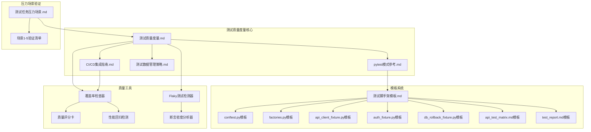

**图表来源**
- [测试质量度量.md:1-900](file-as-test-quality-metrics.md#L1-L900)
- [测试脚手架模板.md:1-81](file://altas-workflow/references/testing/test-scaffold-templates.md#L1-L81)
- [测试任务压力场景.md:1-149](file://altas-workflow/references/testing/test-task-pressure-scenarios.md#L1-L149)

**章节来源**
- [测试质量度量.md:1-900](file://altas-workflow/references/testing/test-quality-metrics.md#L1-L900)
- [测试脚手架模板.md:1-81](file://altas-workflow/references/testing/test-scaffold-templates.md#L1-L81)
- [测试任务压力场景.md:1-149](file://altas-workflow/references/testing/test-task-pressure-scenarios.md#L1-L149)

## 核心组件

### 一级质量指标体系

测试质量度量体系建立了完整的指标监控框架，包含四个必须监控的一级指标：

| 指标名称 | 目标值 | 权重 | 工具/方法 |
|---------|--------|------|-----------|
| 测试覆盖率 | ≥80% (核心≥95%) | ⭐⭐⭐⭐⭐ | pytest-cov |
| 测试通过率 | =100% (0 failures) | ⭐⭐⭐⭐⭐ | pytest |
| Flaky Rate | <1% | ⭐⭐⭐⭐ | pytest-rerunfailures |
| 测试执行时间 | <5min (单元<2min) | ⭐⭐⭐ | pytest --durations |

### 二级质量指标

为建议监控的质量指标，提供更深入的质量洞察：

| 指标名称 | 目标值 | 权重 | 工具/方法 |
|---------|--------|------|-----------|
| 断言密度 | 2-4 个/测试 | ⭐⭐⭐⭐ | 自定义分析 |
| Mock 比例 | <30% | ⭐⭐⭐⭐ | 自定义分析 |
| 测试复杂度 | <10 | ⭐⭐⭐ | radon |
| 代码-测试比 | 1:1 - 2:1 | ⭐⭐⭐ | cloc |

### 三级高级指标

面向高级优化的质量指标：

| 指标名称 | 目标值 | 权重 | 工具/方法 |
|---------|--------|------|-----------|
| 缺陷检出率 | >70% | ⭐⭐⭐ | Jira + CI 数据 |
| MTTD | <24h | ⭐⭐⭐ | Git blame + CI |
| 回归防护度 | >90% | ⭐⭐⭐ | 自定义追踪 |
| 测试维护成本 | <20% | ⭐⭐ | Git diff 分析 |

### 测试模板系统

**新增** 标准化的测试模板系统，提供7种核心模板以支撑完整的测试基础设施：

| 模板类型 | 文件名 | 适用场景 | 核心功能 |
|----------|--------|----------|----------|
| 基础共享fixture | conftest.py | pytest项目起步 | 统一marker、基础配置、共享fixture |
| 测试数据工厂 | factories.py | 需要faker/factory-boy管理测试数据 | 用户、订单等业务实体工厂 |
| API客户端fixture | api_client_fixture.py | HTTP API测试 | 统一请求入口、会话管理 |
| 鉴权fixture | auth_fixture.py | 鉴权、角色、用户上下文 | 登录、令牌获取、权限头 |
| 数据库回滚fixture | db_rollback_fixture.py | 数据库集成测试 | 事务回滚、数据隔离 |
| API测试矩阵 | api_test_matrix.md | 从契约展开测试计划 | 结构化测试矩阵、优先级管理 |
| 测试报告模板 | test_report.md | 输出测试结果、质量门禁 | 标准化报告格式、失败归因 |

### 测试压力场景验证

**新增** 5种压力场景验证清单，确保测试策略在各种挑战情况下的有效性：

| 场景编号 | 压力类型 | 关键挑战 | 预期行为 | 失败信号 |
|----------|----------|----------|----------|----------|
| 场景1 | 时间压力 | 用户催促直接补用例 | 先产出策略再实现 | 直接开始写代码 |
| 场景2 | 数字压力 | 只要求覆盖率达标 | 同时关注关键路径 | 仅堆砌无效测试 |
| 场景3 | 信息压力 | API文档缺失 | 明确风险声明 | 直接假设接口契约 |
| 场景4 | 环境压力 | CI/本地差异 | 先失败归因再修复 | 直接修改业务代码 |
| 场景5 | 成果压力 | 已有实现跳过流程 | 保持测试设计纪律 | 绕过策略和矩阵 |

**章节来源**
- [测试质量度量.md:18-46](file://altas-workflow/references/testing/test-quality-metrics.md#L18-L46)
- [测试脚手架模板.md:24-35](file://altas-workflow/references/testing/test-scaffold-templates.md#L24-L35)
- [测试任务压力场景.md:8-17](file://altas-workflow/references/testing/test-task-pressure-scenarios.md#L8-L17)

## 架构概览

测试质量度量体系采用分层架构设计，确保各个组件之间的松耦合和高内聚：

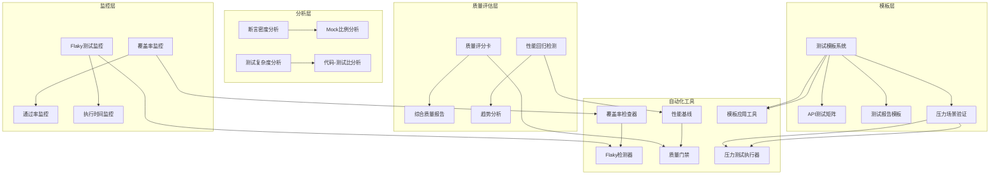

**图表来源**
- [测试质量度量.md:616-750](file://altas-workflow/references/testing/test-quality-metrics.md#L616-L750)
- [测试脚手架模板.md:1-81](file://altas-workflow/references/testing/test-scaffold-templates.md#L1-L81)
- [测试任务压力场景.md:1-149](file://altas-workflow/references/testing/test-task-pressure-scenarios.md#L1-L149)

### 质量门禁流程

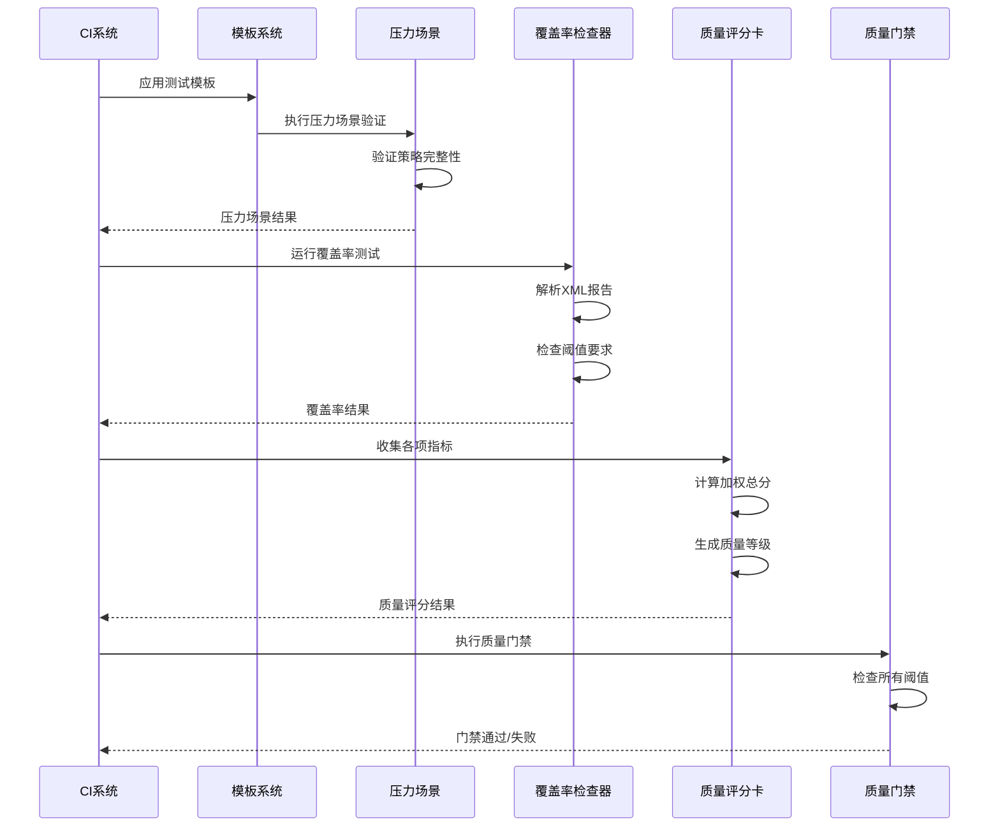

**图表来源**
- [测试质量度量.md:752-800](file://altas-workflow/references/testing/test-quality-metrics.md#L752-L800)
- [测试脚手架模板.md:75-81](file://altas-workflow/references/testing/test-scaffold-templates.md#L75-L81)

**章节来源**
- [测试质量度量.md:616-800](file://altas-workflow/references/testing/test-quality-metrics.md#L616-L800)
- [测试脚手架模板.md:75-81](file://altas-workflow/references/testing/test-scaffold-templates.md#L75-L81)

## 详细组件分析

### 覆盖率监控系统

覆盖率监控是测试质量度量的核心组件，提供了多层次的覆盖率分析能力。

#### 分层覆盖率配置

系统支持针对不同模块设置差异化覆盖率目标：

```yaml
coverage_thresholds:
  global:
    line: 80          # 全局行覆盖率
    branch: 75        # 分支覆盖率
    function: 85      # 函数覆盖率
  
  critical_modules:   # 核心业务逻辑
    - pattern: "src/core/**"
      line: 95
      branch: 90
      function: 98
  
  normal_modules:     # 一般业务逻辑
    - pattern: "src/services/**"
      line: 80
      branch: 75
      function: 85
  
  utility_modules:    # 工具类
    - pattern: "src/utils/**"
      line: 70
      branch: 65
      function: 75
  
  excluded:           # 排除项
    - "*/migrations/*"
    - "*/__init__.py"
    - "tests/*"
```

#### 自动化覆盖率检查器

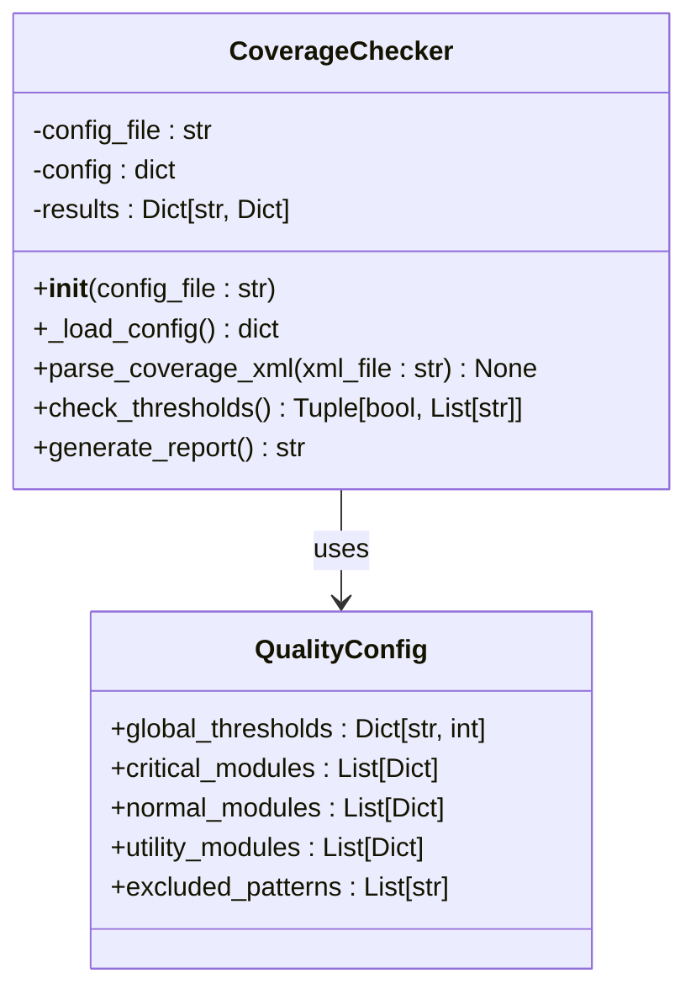

**图表来源**
- [测试质量度量.md:136-241](file://altas-workflow/references/testing/test-quality-metrics.md#L136-L241)

覆盖率检查器具备以下核心功能：
- **配置加载**：支持从YAML文件加载覆盖率配置
- **XML解析**：解析pytest-cov生成的覆盖率XML报告
- **阈值检查**：验证是否满足预设的覆盖率阈值
- **报告生成**：生成详细的Markdown格式报告

**章节来源**
- [测试质量度量.md:51-133](file://altas-workflow/references/testing/test-quality-metrics.md#L51-L133)

### Flaky测试检测系统

Flaky测试检测系统专门用于识别和处理不稳定测试，确保测试结果的可靠性。

#### 检测机制

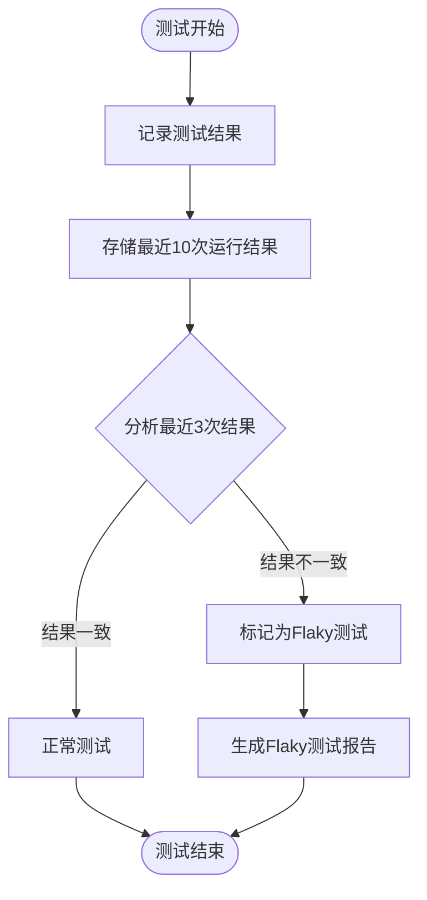

**图表来源**
- [测试质量度量.md:309-362](file://altas-workflow/references/testing/test-quality-metrics.md#L309-L362)

#### 处理策略

系统提供多种处理Flaky测试的策略：

| 策略类型 | 适用场景 | 实现方式 |
|---------|----------|----------|
| 重试机制 | 网络超时等临时性失败 | `@pytest.mark.flaky(reruns=3)` |
| 标记忽略 | 已知的预期失败 | `@pytest.mark.xfail(strict=False)` |
| 临时跳过 | 需要修复的问题 | 使用skip标记 |
| 持续监控 | 新出现的不稳定测试 | 自动检测和报告

**章节来源**
- [测试质量度量.md:295-383](file://altas-workflow/references/testing/test-quality-metrics.md#L295-L383)

### 性能回归检测系统

性能回归检测系统用于监控测试执行时间的变化，防止性能退化。

#### 基线管理系统

```mermaid
classDiagram
class PerformanceBaseline {
-baseline_file : Path
+collect_durations() dict
+update_baseline(durations : dict) None
+check_regression(threshold_percent : float) bool
}
class DurationCollector {
+collect_current_durations() dict
+parse_pytest_output(output : str) dict
}
PerformanceBaseline --> DurationCollector : uses
note for PerformanceBaseline : "维护历史性能基线\n检测回归并发出警告"
```

**图表来源**
- [测试质量度量.md:424-495](file://altas-workflow/references/testing/test-quality-metrics.md#L424-L495)

基线管理系统的功能包括：
- **历史数据收集**：自动收集测试执行时间历史
- **基线更新**：定期更新性能基线数据
- **回归检测**：比较当前性能与历史基线
- **阈值报警**：超过预设阈值时发出警告

**章节来源**
- [测试质量度量.md:386-495](file://altas-workflow/references/testing/test-quality-metrics.md#L386-L495)

### 质量评分卡系统

质量评分卡系统提供综合性的测试质量评估，支持多维度的量化分析。

#### 评分算法

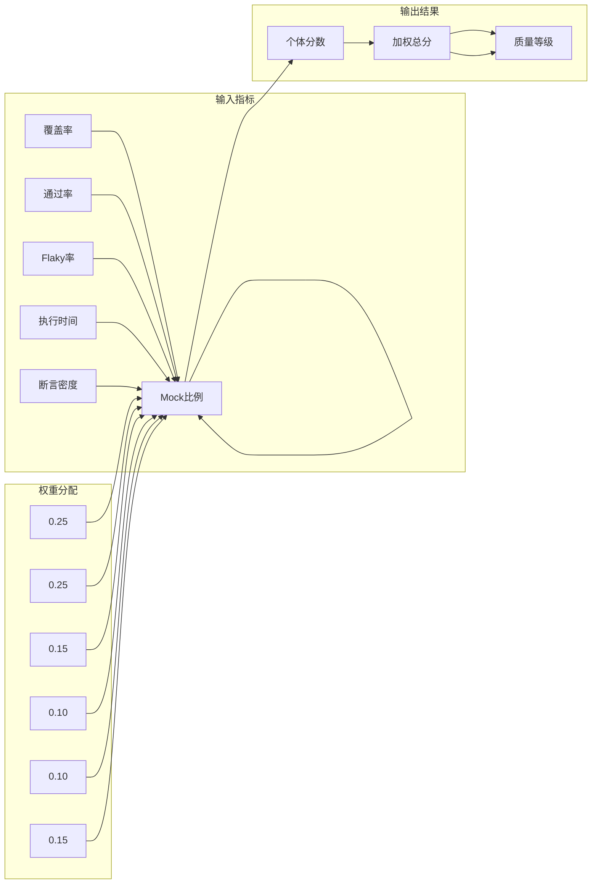

**图表来源**
- [测试质量度量.md:621-730](file://altas-workflow/references/testing/test-quality-metrics.md#L621-L730)

评分卡系统的特点：
- **加权计算**：根据不同指标的重要性分配权重
- **标准化评分**：将各指标转换为0-100分制
- **等级划分**：提供A+到D的等级评估
- **详细报告**：生成包含各指标贡献度的报告

**章节来源**
- [测试质量度量.md:616-750](file://altas-workflow/references/testing/test-quality-metrics.md#L616-L750)

### 测试模板系统

**新增** 标准化的测试模板系统，提供完整的测试基础设施模板集合。

#### 模板系统架构

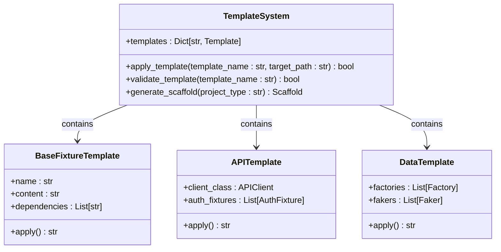

**图表来源**
- [测试脚手架模板.md:24-35](file://altas-workflow/references/testing/test-scaffold-templates.md#L24-L35)

模板系统的核心特性：
- **标准化**：提供统一的模板格式和命名规范
- **可扩展**：支持自定义模板和模板组合
- **可复用**：跨项目复用，减少重复工作
- **可审查**：模板经过质量审查，确保最佳实践

#### 模板应用流程

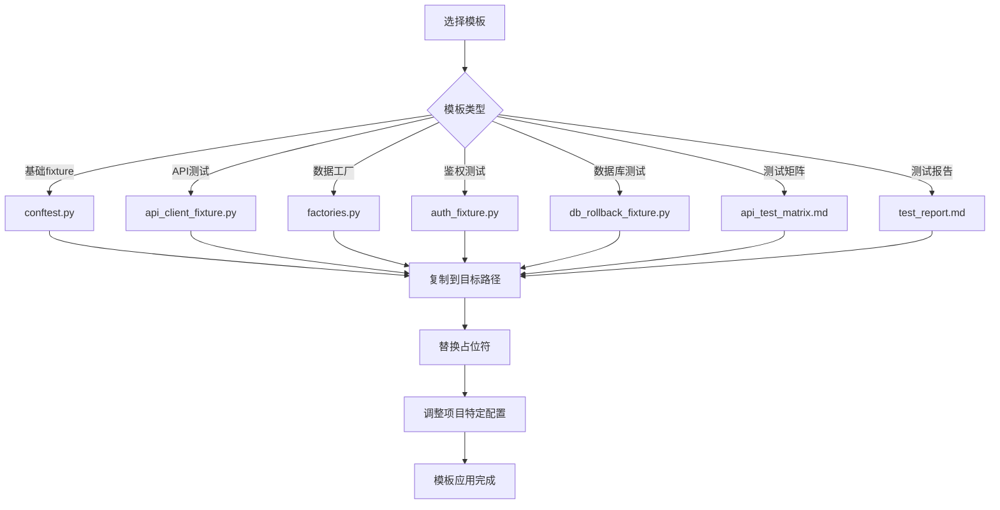

**图表来源**
- [测试脚手架模板.md:61-72](file://altas-workflow/references/testing/test-scaffold-templates.md#L61-L72)

**章节来源**
- [测试脚手架模板.md:1-81](file://altas-workflow/references/testing/test-scaffold-templates.md#L1-L81)

### 测试压力场景验证

**新增** 系统化的压力场景验证机制，确保测试策略在各种挑战情况下的有效性。

#### 压力场景执行流程

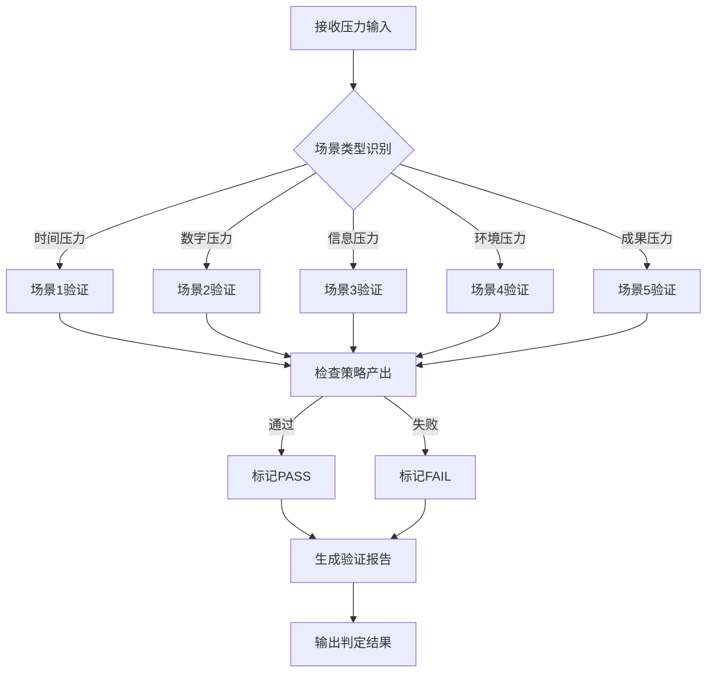

**图表来源**
- [测试任务压力场景.md:8-17](file://altas-workflow/references/testing/test-task-pressure-scenarios.md#L8-L17)

压力场景验证的关键要素：
- **结构化记录**：输入压力、预期行为、失败信号、判定标准
- **自动化执行**：可重复的压力场景测试
- **客观判定**：基于明确标准的PASS/FAIL判定
- **持续改进**：通过压力场景发现流程弱点

**章节来源**
- [测试任务压力场景.md:1-149](file://altas-workflow/references/testing/test-task-pressure-scenarios.md#L1-L149)

## 依赖关系分析

测试质量度量体系具有清晰的依赖关系，确保各个组件能够协同工作：

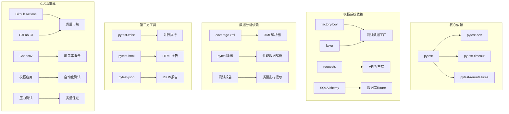

**图表来源**
- [测试质量度量.md:542-547](file://altas-workflow/references/testing/test-quality-metrics.md#L542-L547)
- [CI/CD集成指南.md:1-800](file://altas-workflow/references/testing/ci-cd-integration.md#L1-L800)
- [测试脚手架模板.md:3-4](file://altas-workflow/references/testing/test-scaffold-templates.md#L3-L4)

### 模块间协作

各个模块之间通过标准化接口进行协作：

| 模块 | 主要职责 | 依赖关系 | 输出接口 |
|------|----------|----------|----------|
| 覆盖率监控 | 收集和分析覆盖率数据 | pytest-cov, XML解析 | 覆盖率报告 |
| Flaky检测 | 识别不稳定测试 | pytest, JSON存储 | Flaky测试列表 |
| 性能监控 | 跟踪执行时间变化 | pytest, 历史数据 | 性能回归报告 |
| 质量评分 | 综合评估测试质量 | 各监控模块 | 质量等级和报告 |
| 模板系统 | 提供标准化测试基础设施 | factory-boy, requests, SQLAlchemy | 可复用模板 |
| 压力场景 | 验证测试策略有效性 | 各测试模块 | 压力测试报告 |

**章节来源**
- [测试质量度量.md:1-900](file://altas-workflow/references/testing/test-quality-metrics.md#L1-L900)
- [CI/CD集成指南.md:1-800](file://altas-workflow/references/testing/ci-cd-integration.md#L1-L800)
- [测试脚手架模板.md:1-81](file://altas-workflow/references/testing/test-scaffold-templates.md#L1-L81)

## 性能考虑

测试质量度量体系在设计时充分考虑了性能优化，确保在大规模测试场景下的高效运行。

### 并行执行优化

系统支持多种并行执行策略：

| 策略 | 适用场景 | 性能特点 |
|------|----------|----------|
| `auto` | 通用场景 | 自动检测CPU核心数，平衡性能和稳定性 |
| `logical` | CPU密集型 | 基于逻辑核心分配，减少上下文切换 |
| `loadscope` | 有共享状态 | 按模块分配worker，减少竞争 |
| `loadfile` | 文件大小差异大 | 按文件大小分配，提高负载均衡 |

### 缓存策略

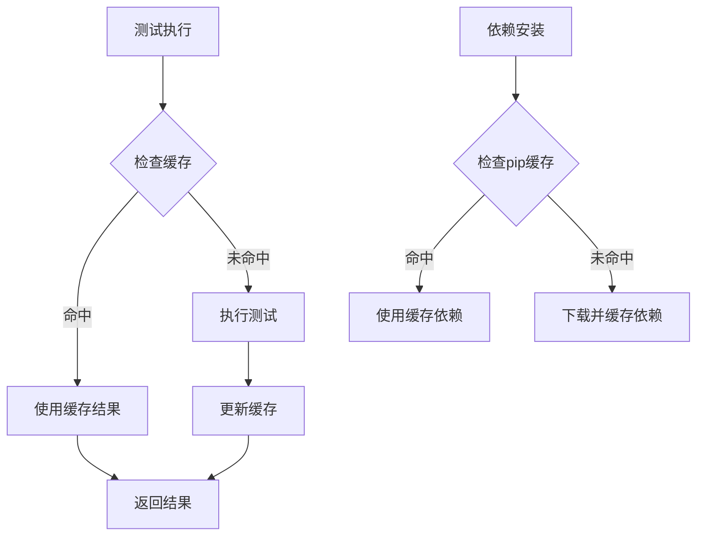

**图表来源**
- [CI/CD集成指南.md:435-483](file://altas-workflow/references/testing/ci-cd-integration.md#L435-L483)

### 内存管理

系统采用多种内存管理策略：
- **惰性加载**：Factory Boy的LazyAttribute实现按需生成数据
- **事务回滚**：数据库测试使用事务回滚避免数据累积
- **临时文件**：使用tmp_path确保临时数据的自动清理
- **模板缓存**：测试模板的编译和缓存机制

### 模板系统性能优化

**新增** 模板系统的性能优化策略：
- **模板预编译**：首次使用时编译模板，后续直接复用
- **增量应用**：只应用变更的模板部分
- **并行模板**：支持多个模板的并行应用
- **模板缓存**：缓存模板解析结果，减少重复计算

## 故障排除指南

### 常见问题诊断

#### 覆盖率检查失败

**问题症状**：覆盖率低于阈值要求

**诊断步骤**：
1. 检查`.coveragerc`配置文件
2. 验证排除模式是否正确
3. 确认测试文件是否被正确发现
4. 检查代码是否实际被执行

**解决方案**：
- 调整覆盖率阈值配置
- 添加缺失的测试用例
- 优化代码结构以提高可测试性

#### Flaky测试识别

**问题症状**：测试结果不稳定，时好时坏

**诊断方法**：
1. 检查测试间的依赖关系
2. 分析外部依赖的稳定性
3. 识别随机性因素
4. 验证测试环境的一致性

**处理策略**：
- 使用重试机制处理临时性失败
- 标记已知问题为xfail
- 重构测试以消除不确定性

#### 性能回归检测

**问题症状**：测试执行时间显著增加

**分析步骤**：
1. 比较当前执行时间与历史基线
2. 识别最慢的测试用例
3. 分析性能瓶颈所在
4. 评估代码变更的影响

**优化建议**：
- 重构性能热点代码
- 减少不必要的数据库操作
- 优化测试数据准备过程

#### 模板应用问题

**问题症状**：测试模板无法正确应用

**诊断步骤**：
1. 检查模板文件完整性
2. 验证目标路径存在性
3. 确认文件权限设置
4. 检查模板依赖项

**解决方案**：
- 重新下载模板文件
- 创建目标目录结构
- 调整文件权限
- 安装缺失的依赖包

#### 压力场景验证失败

**问题症状**：压力场景测试无法通过

**诊断方法**：
1. 检查压力输入格式
2. 验证预期行为实现
3. 分析失败信号识别
4. 确认判定标准应用

**处理策略**：
- 修正压力输入格式
- 完善预期行为实现
- 优化失败信号检测
- 明确判定标准

### 调试工具和技巧

#### pytest调试选项

```bash
# 详细输出模式
pytest -v --tb=long

# 失败时进入调试器
pytest --pdb

# 收集测试发现信息
pytest --collect-only

# 显示最慢的N个测试
pytest --durations=N
```

#### 日志和监控

系统支持多种日志级别和监控选项：
- **详细日志**：`-v`选项提供详细的测试执行信息
- **性能日志**：`--durations`显示测试执行时间
- **覆盖率日志**：`--cov-report=term-missing`显示未覆盖代码
- **错误日志**：`--tb=short`或`--tb=long`提供错误堆栈信息
- **模板日志**：`--log-cli-level=DEBUG`显示模板应用详情

**章节来源**
- [pytest模式参考.md:507-524](file://altas-workflow/references/testing/pytest-patterns.md#L507-L524)
- [测试质量度量.md:274-291](file://altas-workflow/references/testing/test-quality-metrics.md#L274-L291)

## 结论

Altas项目的测试质量度量体系提供了一个全面、可扩展的质量监控框架。该体系通过分层指标设计、自动化工具集成和持续改进机制，为不同成熟度的项目提供了渐进式的质量提升路径。

**更新** 新增的测试模板系统和压力场景验证机制进一步增强了体系的实用性和可靠性。

### 主要优势

1. **全面性**：涵盖从基础覆盖率到高级质量指标的全方位监控
2. **标准化**：通过模板系统提供统一的测试基础设施
3. **压力测试**：通过压力场景验证确保测试策略的有效性
4. **自动化**：所有检查和报告过程都实现了自动化
5. **可扩展性**：支持自定义配置和扩展新的指标
6. **实用性**：提供具体的改进建议和最佳实践指导
7. **集成性**：与CI/CD流程无缝集成，支持质量门禁

### 实施建议

1. **循序渐进**：从一级指标开始，逐步引入二级和三级指标
2. **模板应用**：优先使用标准化测试模板，确保一致性
3. **压力测试**：定期执行压力场景验证，发现流程弱点
4. **定制配置**：根据项目特点调整阈值和权重设置
5. **持续改进**：定期回顾和优化质量指标体系
6. **团队培训**：确保团队成员理解并遵循质量标准
7. **工具集成**：将质量度量工具集成到开发和发布流程中

通过实施这套测试质量度量体系，项目可以显著提升测试质量和软件可靠性，为持续交付高质量的软件产品奠定坚实基础。