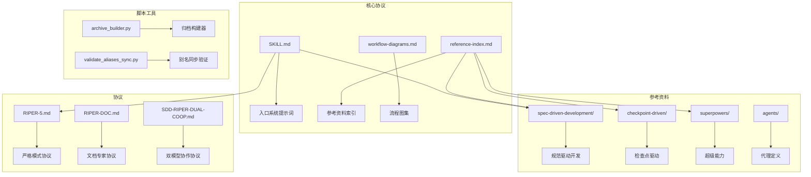
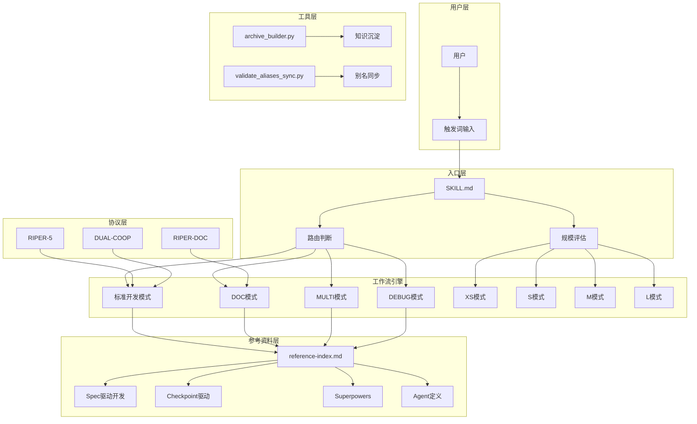
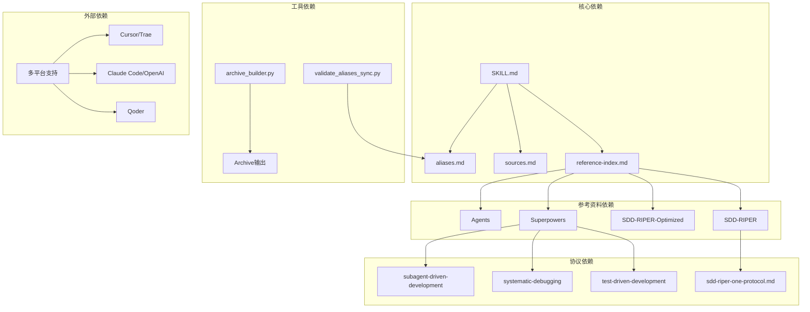

# Altas Workflow Entry Review

<cite>
**本文档引用的文件**
- [SKILL-entry-review.md](file://altas-workflow/SKILL-entry-review.md)
- [SKILL.md](file://altas-workflow/SKILL.md)
- [reference-index.md](file://altas-workflow/reference-index.md)
- [workflow-diagrams.md](file://altas-workflow/workflow-diagrams.md)
- [README.md](file://README.md)
- [sources.md](file://altas-workflow/references/entry/sources.md)
- [aliases.md](file://altas-workflow/references/entry/aliases.md)
- [archive_builder.py](file://altas-workflow/scripts/archive_builder.py)
- [RIPER-5.md](file://altas-workflow/protocols/RIPER-5.md)
- [RIPER-DOC.md](file://altas-workflow/protocols/RIPER-DOC.md)
- [writing-skills/SKILL.md](file://altas-workflow/references/superpowers/writing-skills/SKILL.md)
- [anthropic-best-practices.md](file://altas-workflow/references/superpowers/writing-skills/anthropic-best-practices.md)
- [persuasion-principles.md](file://altas-workflow/references/superpowers/writing-skills/persuasion-principles.md)
- [testing-skills-with-subagents.md](file://altas-workflow/references/superpowers/writing-skills/testing-skills-with-subagents.md)
- [sdd-riper-one-protocol.md](file://altas-workflow/references/spec-driven-development/sdd-riper-one-protocol.md)
- [modules.md](file://altas-workflow/references/checkpoint-driven/modules.md)
</cite>

## 更新摘要
**变更内容**
- 基于 Applied Changes，SKILL-entry-review.md 进行了重大增强
- 增加了 v4.6 版本的 discipline-enforcing skill 完整性检查
- 新增 Red Flags 自检机制、Rationalization Table 和 Common Mistakes 章节
- 与 writing-skills.md 标准的对标分析更加深入
- 完善了防绕过机制的评估体系

## 目录
1. [简介](#简介)
2. [项目结构概览](#项目结构概览)
3. [核心组件分析](#核心组件分析)
4. [架构概览](#架构概览)
5. [详细组件分析](#详细组件分析)
6. [依赖关系分析](#依赖关系分析)
7. [性能考虑](#性能考虑)
8. [故障排除指南](#故障排除指南)
9. [结论](#结论)

## 简介

Altas Workflow是一个综合性的AI原生研发工作流规范，融合了SDD-RIPER、SDD-RIPER-Optimized (Checkpoint-Driven)与Superpowers三大优秀工作流的精华。该项目旨在解决AI编程中的四大工程痛点：上下文腐烂、审查瘫痪、代码不信任和难以维护。通过渐进式披露、智能深度适配和标准化检查点机制，Altas提供了一套完整的AI工作流解决方案。

**更新** 本次更新重点关注 v4.6 版本的 discipline-enforcing skill 完整性检查，包括 Red Flags 自检机制、Rationalization Table 和 Common Mistakes 章节的新增内容，以及与 writing-skills.md 标准的深度对标分析。

## 项目结构概览

项目采用模块化的目录结构，主要包含以下几个核心部分：

**图表来源**
- [README.md:48-82](file://README.md#L48-L82)
- [SKILL.md:1-13](file://altas-workflow/SKILL.md#L1-L13)

**章节来源**
- [README.md:46-82](file://README.md#L46-L82)
- [altas-workflow/](file://altas-workflow/)

## 核心组件分析

### 主入口系统提示词 (SKILL.md)

SKILL.md是Altas Workflow的核心系统提示词，定义了AI代理的行为准则和工作流程。该文件具有以下关键特征：

#### 核心特性
- **版本管理**：当前版本4.5，包含Persona设定和角色定义
- **渐进式披露**：通过frontmatter声明依赖关系，实现按需加载
- **多平台兼容**：支持Cursor、Trae、Claude、OpenAI等平台
- **智能深度适配**：支持XS/S/M/L四个级别的任务深度

#### 触发词系统
系统支持多种触发词和别名，包括：
- 极速通道：`>>`、`FAST`、`快速`
- 标准启动：`sdd_bootstrap`
- 深度模式：`DEEP`
- 调试模式：`DEBUG`、`排查`
- 文档模式：`DOC`、`写文档`

**更新** v4.6 版本新增了完整的 discipline-enforcing skill 防绕过机制，包括 Red Flags 自检清单、Rationalization Table 和 Common Mistakes 章节。

**章节来源**
- [SKILL.md:1-432](file://altas-workflow/SKILL.md#L1-L432)
- [aliases.md:12-33](file://altas-workflow/references/entry/aliases.md#L12-L33)

### 参考资料索引系统

reference-index.md提供了完整的参考资料索引，实现了按需加载机制：

#### 按工作流阶段索引
- **PRE-RESEARCH**：输入准备阶段
- **RESEARCH**：研究对齐阶段  
- **INNOVATE**：方案对比阶段
- **PLAN**：详细规划阶段
- **EXECUTE**：执行实现阶段
- **REVIEW**：审查阶段
- **ARCHIVE**：知识沉淀阶段

#### 按特殊模式索引
- **DEBUG模式**：系统化调试
- **MULTI模式**：多项目协作
- **DOC模式**：文档专家
- **REVIEW模式**：代码审查
- **REFACTOR模式**：重构
- **TEST模式**：测试
- **PERF模式**：性能优化
- **MIGRATE模式**：迁移

**章节来源**
- [reference-index.md:40-171](file://altas-workflow/reference-index.md#L40-L171)

### 工作流流程图集

workflow-diagrams.md包含了11种不同类型的流程图，涵盖了整个工作流的各个方面：

#### 主要流程图类型
1. **架构总览图**：展示四个级别任务的总体流程
2. **阶段流程图**：Size M/L标准流程
3. **铁律与门禁图**：8条核心铁律的约束关系
4. **Review三轴评审图**：三轴评审的决策流程
5. **Size L工作流甘特图**：大型任务的时间规划
6. **TDD执行循环图**：测试驱动开发的循环过程
7. **特殊模式总览图**：各种特殊模式的工作流
8. **参考资料索引图**：参考资料的思维导图
9. **上下文装配层级图**：上下文的三层装配机制
10. **触发词与模式映射图**：触发词与工作流模式的映射关系
11. **完整工作流时序图**：完整的端到端工作流时序

**章节来源**
- [workflow-diagrams.md:7-337](file://altas-workflow/workflow-diagrams.md#L7-L337)

## 架构概览

Altas Workflow采用了分层架构设计，通过渐进式披露机制实现高效的资源利用：

**图表来源**
- [SKILL.md:27-432](file://altas-workflow/SKILL.md#L27-L432)
- [reference-index.md:1-275](file://altas-workflow/reference-index.md#L1-L275)

## 详细组件分析

### 触发词与路由系统

触发词系统是Altas Workflow的入口机制，通过统一的别名管理实现：

#### 触发词分类
- **极速通道**：`>>`、`FAST`、`快速` - 适用于XS/S级别的快速修改
- **标准启动**：`sdd_bootstrap` - 启动RIPER标准流程
- **深度模式**：`DEEP` - 适用于L级别的深度开发
- **调试模式**：`DEBUG`、`排查` - 适用于问题排查和根因分析
- **文档模式**：`DOC`、`写文档` - 适用于文档撰写和整理
- **地图模式**：`MAP`、`PROJECT MAP` - 适用于代码地图生成
- **审查模式**：`REVIEW`、`代码审查` - 适用于代码审查流程
- **重构模式**：`REFACTOR`、`重构` - 适用于代码重构
- **测试模式**：`TEST`、`写测试` - 适用于测试开发
- **性能模式**：`PERF`、`性能优化` - 适用于性能优化
- **迁移模式**：`MIGRATE`、`迁移` - 适用于系统迁移
- **多项目模式**：`MULTI`、`多项目` - 适用于多项目协作
- **跨项目模式**：`CROSS`、`跨项目` - 适用于跨项目修改
- **退出协议**：`EXIT ALTAS`、`退出协议` - 适用于协议退出

**章节来源**
- [aliases.md:12-52](file://altas-workflow/references/entry/aliases.md#L12-L52)

### 规模评估机制

Altas Workflow采用四级任务深度评估机制：

#### 规模级别定义
- **XS (极速)**：typo、配置值、小于10行的修改，直接执行→验证→summary
- **S (快速)**：1-2文件、逻辑清晰的修改，micro-spec→批准→执行→回写
- **M (标准)**：3-10文件、模块内的开发，Research→Plan→Execute(TDD)→Review
- **L (深度)**：跨模块、架构级的重构，Research→Innovate→Plan→Execute→Review→Archive

#### 评估标准
- **影响面** > 文件数 > 代码行数
- 跨模块、公共接口、核心链路、数据模型变更至少按M级别处理
- 架构调整、多项目、迁移、重大性能改造默认按L级别处理

**章节来源**
- [SKILL.md:188-204](file://altas-workflow/SKILL.md#L188-L204)
- [README.md:239-244](file://README.md#L239-L244)

### 核心铁律系统

Altas Workflow定义了10条不可违背的核心铁律：

#### 铁律清单
1. **YOU MUST Restate & Decompose First**：先复述任务，并给出从当前到下一阶段的原子化拆解，再进入分析、Spec 或执行。
2. **YOU MUST Route Before Action**：先判定模式，再决定是否只读、是否改代码。
3. **YOU MUST Never Write Code Before Spec**：未形成最小 Spec 前不写代码；`XS` 可豁免为事后 summary。
4. **YOU MUST Never Execute Without Approval**：高影响执行前必须有明确许可；`XS`、`FAST` 或用户明确要求直接执行时视为已授权。
5. **YOU MUST Treat Spec as Truth**：发现目标、计划或行为偏差时，先修 Spec 再修代码。
6. **YOU MUST Prove with Evidence**：完成由测试、日志、构建、运行结果或代码证据证明，不靠自宣布。
7. **YOU MUST Never Fix Without Root Cause**：`DEBUG` 或 Bugfix 任务在根因未清楚前禁止盲改。
8. **YOU MUST Always Leave Resume Point**：长任务、中断或上下文紧张时，必须留下恢复锚点。
9. **YOU MUST Read Concurrent, Write Serial**：读文件允许并发；写文件必须串行，不得并发写入同一文件。
10. **YOU MUST Never Assume on Uncertainty**：不确定时不假设，必须澄清；解决不了的问题必须暂停并找用户确认，禁止跳过。

**更新** v4.6 版本新增了完整的 Red Flags 自检机制，包含8个即时自检清单，映射到具体铁律。

**章节来源**
- [SKILL.md:63-81](file://altas-workflow/SKILL.md#L63-L81)
- [README.md:269-281](file://README.md#L269-L281)

### 检查点机制

检查点机制是Altas Workflow的质量保证系统：

#### 检查点触发时机
- 阶段转换时（Research → Plan → Execute → Review）
- M/L规模每完成一个Plan中的任务项
- 遇到异常、不确定性或解决不了的问题
- 用户要求查看进度
- 上下文将满需要Resume Ready

#### 检查点输出要求
- **XS**：1行summary：做了什么 + 如何验证
- **S**：短checkpoint：当前理解/核心目标/下一步
- **M/L**：完整检查点，逐步推进

**章节来源**
- [SKILL.md:320-360](file://altas-workflow/SKILL.md#L320-L360)

### 专用协议系统

Altas Workflow支持三种专用协议：

#### RIPER-5 严格模式协议
- **模式1：RESEARCH**：信息收集阶段，仅允许读取文件和提问
- **模式2：INNOVATE**：头脑风暴阶段，讨论潜在方案
- **模式3：PLAN**：创建详尽的技术规范，必须转换为编号的顺序清单
- **模式4：EXECUTE**：严格按照计划实现，不允许任何偏差
- **模式5：REVIEW**：严格验证实现与计划的一致性

#### RIPER-DOC 文档专家协议
- **模式1：ABSORB**：上下文提取，理解参数、返回类型和逻辑流程
- **模式2：OUTLINE**：结构规划，提出文档的大纲
- **模式3：AUTHOR**：内容生成，编写实际的文档
- **模式4：FACT-CHECK**：准确性验证，交叉引用生成的文本与实际代码

#### 双模型协作协议
- 支持多模型协作的高级工作流
- 适用于复杂的架构设计和系统集成

**章节来源**
- [RIPER-5.md:25-126](file://altas-workflow/protocols/RIPER-5.md#L25-L126)
- [RIPER-DOC.md:9-60](file://altas-workflow/protocols/RIPER-DOC.md#L9-L60)

### discipline-enforcing Skill 完整性检查

**更新** v4.6 版本新增了完整的 discipline-enforcing skill 防绕过机制：

#### Red Flags 自检机制
包含8个即时自检清单，映射到具体铁律：
- Spec 未形成就写代码？
- 未获许可就执行？
- 根因不明就改代码？
- 不确定但假设而非澄清？
- "这次情况特殊可例外"？
- 想跳过流程因为"时间紧"？

#### Rationalization Table（合理化借口反驳表）
包含10个常见借口及 Reality 反驳，有效防止绕过规则：
- "这次情况特殊可例外" → 无例外
- "时间紧所以跳过流程" → 流程简化 = 后期返工
- "手动验证更快" → 需要证据证明
- "这是特殊情况" → 没有例外

#### Common Mistakes 章节
包含10个使用错误及纠正方法，覆盖非运行时异常场景：
- 触发词选择错误
- 规模评估错误
- 流程跳过
- 沟通问题
- 工具使用错误

**章节来源**
- [SKILL-entry-review.md:367-433](file://altas-workflow/SKILL-entry-review.md#L367-L433)

## 依赖关系分析

Altas Workflow的依赖关系体现了模块化设计的优势：

**图表来源**
- [SKILL.md:1-13](file://altas-workflow/SKILL.md#L1-L13)
- [reference-index.md:174-237](file://altas-workflow/reference-index.md#L174-L237)

### 交叉引用机制

Altas Workflow实现了完善的交叉引用机制，避免重复和冗余：

#### 前置依赖声明
- **REQUIRED BACKGROUND**：明确声明所需的前置技能
- **REQUIRED SUB-SKILL**：明确声明所需的子技能
- **交叉引用**：使用`superpowers:skill-name`格式引用其他技能

#### 依赖管理
- 所有依赖关系都在SKILL.md中明确声明
- 通过reference-index.md实现按需加载
- 通过validate_aliases_sync.py确保别名同步

**章节来源**
- [SKILL.md:38-43](file://altas-workflow/SKILL.md#L38-L43)
- [aliases.md:45-52](file://altas-workflow/references/entry/aliases.md#L45-L52)

## 性能考虑

Altas Workflow在设计时充分考虑了性能优化：

### 渐进式披露优化
- **按需加载**：只在命中场景时加载对应文件
- **上下文窗口管理**：避免不必要的token消耗
- **文件组织**：将重型参考材料分离到独立文件

### 平台适配优化
- **多平台兼容**：支持7个主流AI平台
- **工具映射**：提供平台特定的工具映射表
- **上下文基线**：针对不同平台优化上下文窗口

### 资源管理优化
- **脚本化工具**：使用Python脚本处理复杂任务
- **归档机制**：自动生成知识沉淀文档
- **别名同步**：自动化验证触发词一致性

## 故障排除指南

### 常见问题及解决方案

#### 触发词不生效
**问题**：用户输入的触发词无法激活相应模式
**解决方案**：
1. 检查触发词是否在aliases.md中定义
2. 验证SKILL.md的trigger_keywords是否同步更新
3. 使用validate_aliases_sync.py验证同步状态

#### 规模评估错误
**问题**：任务被错误地评估为XS/S/M/L级别
**解决方案**：
1. 检查任务的影响面、文件数量和代码行数
2. 参考README.md中的规模评估速查表
3. 使用自动升降级机制调整任务级别

#### 检查点机制失效
**问题**：AI在执行过程中跳过检查点
**解决方案**：
1. 确保检查点机制正确配置
2. 验证STOP-AND-WAIT协议是否正常工作
3. 检查用户是否正确批准了每个检查点

#### 协议冲突
**问题**：不同协议之间产生冲突
**解决方案**：
1. 明确协议的优先级顺序
2. 使用EXIT ALTAS协议退出当前协议
3. 重新启动合适的协议

#### discipline-enforcing 防绕过机制失效
**问题**：Agent仍然尝试绕过规则
**解决方案**：
1. 检查 Red Flags 自检机制是否正确触发
2. 验证 Rationalization Table 是否包含相应的反驳
3. 确认 Common Mistakes 章节是否被正确引用
4. 使用 writing-skills.md 标准进行压力测试

**章节来源**
- [README.md:537-606](file://README.md#L537-L606)

## 结论

Altas Workflow是一个设计精良的AI原生研发工作流系统，具有以下显著特点：

### 核心优势
1. **模块化设计**：通过渐进式披露实现高效的资源利用
2. **多平台兼容**：支持7个主流AI平台，提供统一的工作流体验
3. **智能深度适配**：四级任务深度评估，适应不同复杂度的任务
4. **严格的约束机制**：10条核心铁律确保代码质量和项目稳定性
5. **完善的工具链**：包含归档、验证、同步等全套工具
6. **防绕过机制**：v4.6 版本新增完整的 discipline-enforcing skill 检查体系

### 技术创新
1. **交叉引用机制**：避免重复和冗余，提高文档质量
2. **检查点驱动**：确保每个步骤都有明确的进展和验证
3. **协议化设计**：通过专用协议处理特殊场景
4. **自动化工具**：通过脚本化工具提高效率
5. **防绕过机制**：通过 Red Flags、Rationalization Table 和 Common Mistakes 有效防止规则绕过

### 发展前景
Altas Workflow代表了AI原生研发的发展方向，通过标准化的工作流和严格的约束机制，为AI编程提供了可靠的基础设施。随着AI技术的不断发展，该系统将继续演进，为开发者提供更好的工具和体验。

**更新** v4.6 版本的 discipline-enforcing skill 完整性检查标志着该系统在规则执行和防绕过方面达到了新的高度，为AI原生研发提供了更加可靠和稳健的基础设施。