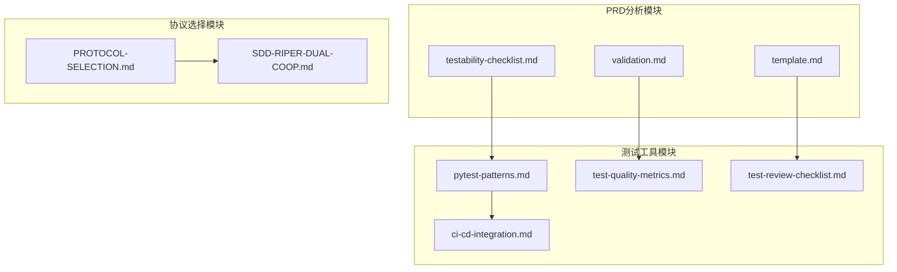
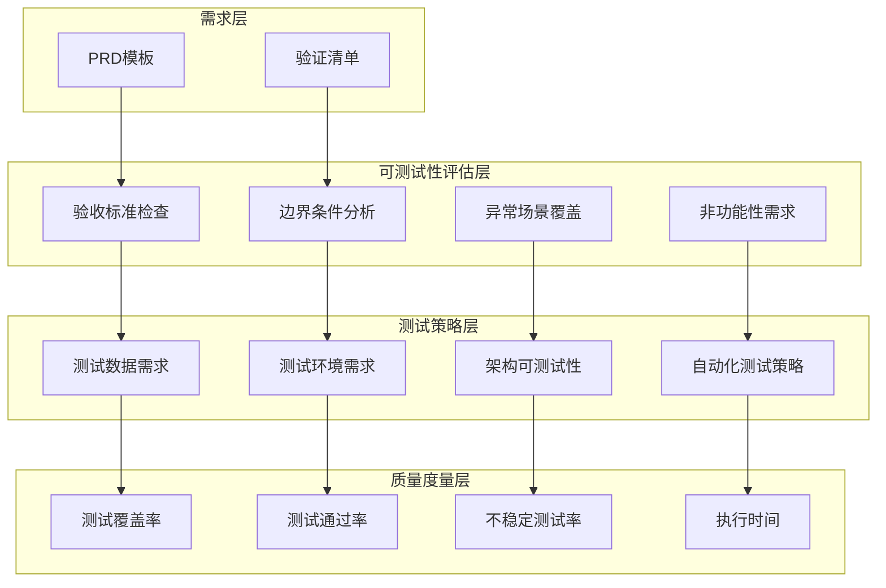
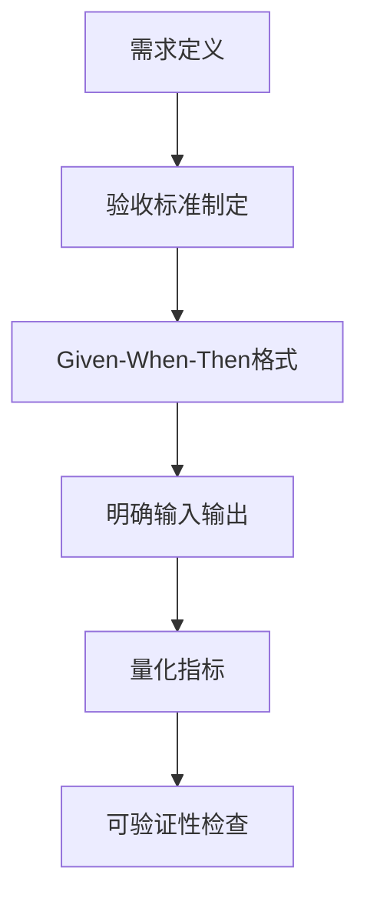
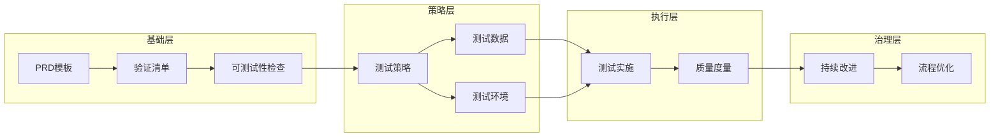
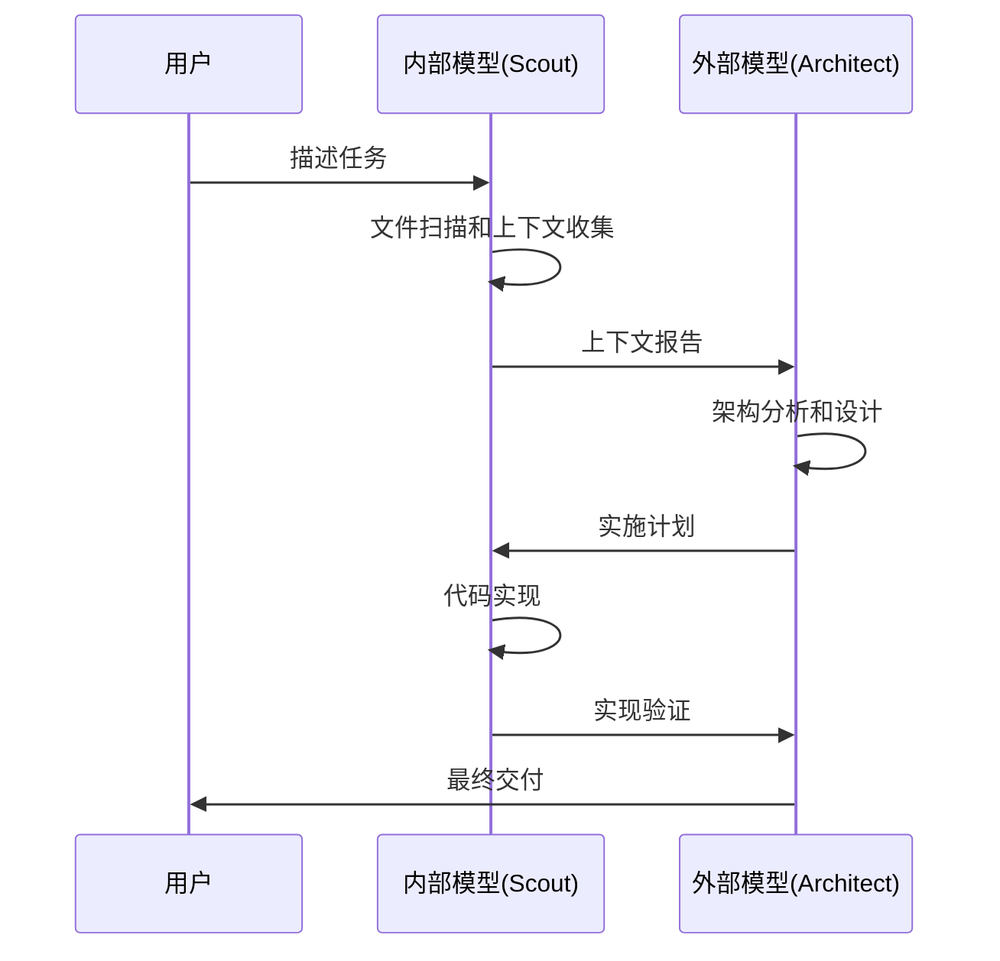

# PRD可测试性检查清单

<cite>
**本文档引用的文件**
- [testability-checklist.md](file://altas-workflow/references/prd-analysis/testability-checklist.md)
- [validation.md](file://altas-workflow/references/prd-analysis/validation.md)
- [template.md](file://altas-workflow/references/prd-analysis/template.md)
- [pytest-patterns.md](file://altas-workflow/references/testing/pytest-patterns.md)
- [test-quality-metrics.md](file://altas-workflow/references/testing/test-quality-metrics.md)
- [test-review-checklist.md](file://altas-workflow/references/testing/test-review-checklist.md)
- [ci-cd-integration.md](file://altas-workflow/references/testing/ci-cd-integration.md)
- [PROTOCOL-SELECTION.md](file://altas-workflow/protocols/PROTOCOL-SELECTION.md)
- [SDD-RIPER-DUAL-COOP.md](file://altas-workflow/protocols/SDD-RIPER-DUAL-COOP.md)
</cite>

## 目录
1. [简介](#简介)
2. [项目结构](#项目结构)
3. [核心组件](#核心组件)
4. [架构概览](#架构概览)
5. [详细组件分析](#详细组件分析)
6. [依赖关系分析](#依赖关系分析)
7. [性能考虑](#性能考虑)
8. [故障排除指南](#故障排除指南)
9. [结论](#结论)
10. [附录](#附录)

## 简介

PRD可测试性检查清单是一个系统化的质量保证框架，旨在确保产品需求文档在设计阶段就具备良好的可测试性特征。该清单基于Altas工作流中的最佳实践，涵盖了从需求定义到测试实施的全生命周期。

该框架的核心理念是"测试左移"，即在需求阶段就识别和解决可测试性问题，避免在开发后期才发现设计缺陷。通过建立标准化的检查清单和评审流程，可以显著降低软件开发成本，提高产品质量。

## 项目结构

Altas工作流采用模块化设计，将PRD可测试性检查与其他测试相关工具有机整合：

**图表来源**
- [testability-checklist.md:1-374](file://altas-workflow/references/prd-analysis/testability-checklist.md#L1-L374)
- [pytest-patterns.md:1-1006](file://altas-workflow/references/testing/pytest-patterns.md#L1-L1006)

**章节来源**
- [testability-checklist.md:1-374](file://altas-workflow/references/prd-analysis/testability-checklist.md#L1-L374)
- [PROTOCOL-SELECTION.md:1-26](file://altas-workflow/protocols/PROTOCOL-SELECTION.md#L1-L26)

## 核心组件

### 可测试性四大原则

系统基于四个核心原则构建可测试性评估框架：

1. **可观察性 (Observability)**: 能够验证需求是否被满足
2. **可控制性 (Controllability)**: 能够设置测试所需的输入和状态
3. **可隔离性 (Isolation)**: 能够独立于其他需求进行测试
4. **可自动化性 (Automatability)**: 能够编写自动化测试脚本

### 评审时机矩阵

| 阶段 | 评审内容 | 参与角色 |
|------|----------|----------|
| **PRD Draft** | 需求完整性、边界条件 | 测试工程师 + 产品经理 |
| **PRD Review** | 验收标准、测试数据需求 | 测试工程师 + 开发 + 产品 |
| **设计评审** | 架构可测试性、测试钩子 | 测试工程师 + 架构师 |
| **开发启动前** | 测试计划、环境需求 | 测试工程师 + 开发 |

**章节来源**
- [testability-checklist.md:22-30](file://altas-workflow/references/prd-analysis/testability-checklist.md#L22-L30)

## 架构概览

系统采用分层架构设计，确保各组件间的松耦合和高内聚：

**图表来源**
- [testability-checklist.md:33-227](file://altas-workflow/references/prd-analysis/testability-checklist.md#L33-L227)
- [test-quality-metrics.md:18-46](file://altas-workflow/references/testing/test-quality-metrics.md#L18-L46)

## 详细组件分析

### 功能需求可测试性

#### 验收标准设计

验收标准必须遵循Given-When-Then格式，确保测试的可执行性：

**图表来源**
- [testability-checklist.md:37-62](file://altas-workflow/references/prd-analysis/testability-checklist.md#L37-L62)

关键要素包括：
- 明确的前置条件描述
- 具体的操作步骤
- 可观测的结果状态
- 量化的成功标准

#### 边界条件定义

系统提供完整的边界条件检查清单：

| 边界类型 | 检查要点 | 示例场景 |
|----------|----------|----------|
| 数值范围 | 最小值、最大值、边界值 | 金额0.01元 vs 999,999,999.99元 |
| 字符串长度 | 空字符串、最大长度、超长 | 用户名3字符 vs 20字符 |
| 集合大小 | 空集合、单元素、最大容量 | 订单项1个 vs 1000个 |
| 时间边界 | 开始时间、结束时间、时区切换 | 23:59:59 vs 00:00:00 |

**章节来源**
- [testability-checklist.md:64-80](file://altas-workflow/references/prd-analysis/testability-checklist.md#L64-L80)

#### 异常场景覆盖

异常场景检查涵盖以下关键领域：

- **无效输入处理**: 格式错误、类型不匹配、范围超限
- **依赖服务不可用**: 降级策略、熔断机制、重试逻辑
- **并发冲突处理**: 锁机制、事务隔离、冲突解决
- **资源耗尽应对**: 内存管理、连接池限制、磁盘空间

**章节来源**
- [testability-checklist.md:82-88](file://altas-workflow/references/prd-analysis/testability-checklist.md#L82-L88)

### 非功能性需求可测试性

#### 性能需求指标

性能测试需要明确以下指标：

| 指标类别 | 具体指标 | 测试方法 |
|----------|----------|----------|
| 响应时间 | P50/P95/P99延迟 | 压力测试、负载测试 |
| 吞吐量 | QPS/TPS | 并发测试、基准测试 |
| 并发用户数 | 支持的最大并发 | 稳定性测试 |
| 数据规模 | 测试数据量 | 大数据量测试 |
| 环境规格 | 测试环境配置 | 环境一致性验证 |

**章节来源**
- [testability-checklist.md:93-108](file://altas-workflow/references/prd-analysis/testability-checklist.md#L93-L108)

#### 安全需求测试

安全测试重点关注：

- **认证机制**: OAuth2、JWT、API Key的有效性
- **权限控制**: RBAC、ABAC的正确实现
- **数据保护**: 敏感信息加密、传输安全
- **安全扫描**: OWASP Top 10的防护验证
- **审计日志**: 安全事件的完整记录

#### 兼容性测试

兼容性验证包括：

- **浏览器支持**: Chrome、Firefox、Safari版本范围
- **移动端适配**: iOS、Android系统版本
- **API版本**: 向后兼容性保证
- **数据库版本**: 兼容性测试
- **第三方依赖**: 版本兼容性验证

**章节来源**
- [testability-checklist.md:118-125](file://altas-workflow/references/prd-analysis/testability-checklist.md#L118-L125)

### 测试数据需求分析

#### 数据类型规划

测试数据需求检查清单：

- **数据类型识别**: 用户数据、订单数据、支付数据等
- **数据脱敏策略**: 生产数据的隐私保护
- **多语言支持**: 国际化测试数据
- **大数据集准备**: 性能测试专用数据

#### 数据准备策略

- **现有工厂检查**: 是否存在UserFactory等测试数据工厂
- **新工厂创建**: 需要的Factory/Fixture定义
- **数据清理机制**: 每个测试后的数据回滚策略
- **数据共享控制**: 只读数据与可变数据的区分

**章节来源**
- [testability-checklist.md:128-151](file://altas-workflow/references/prd-analysis/testability-checklist.md#L128-L151)

### 测试环境需求设计

#### 依赖服务管理

测试环境需要考虑的外部服务：

- **数据库服务**: 真实但隔离的测试数据库
- **缓存服务**: 内存实现或测试容器
- **消息队列**: 内存实现或测试容器
- **文件存储**: 临时目录或内存实现

#### 测试替身策略

| 依赖类型 | 推荐策略 | 实现方式 |
|----------|----------|----------|
| 数据库 | Test Container / SQLite | 真实但隔离 |
| 缓存 | 内存实现 | 快速重置 |
| 消息队列 | 内存实现 | 验证消息内容 |
| 第三方API | Mock Server | 避免外部依赖 |
| 文件存储 | 临时目录 | 测试后清理 |

**章节来源**
- [testability-checklist.md:155-173](file://altas-workflow/references/prd-analysis/testability-checklist.md#L155-L173)

### 架构可测试性设计

#### 测试钩子机制

架构层面的可测试性支持：

- **测试专用API**: 仅在测试环境中可用的接口
- **数据注入机制**: 独立的测试数据准备接口
- **时间控制能力**: 冻结时间的测试支持
- **事件模拟接口**: 外部事件的模拟能力

#### 依赖注入设计

- **可注入依赖**: 关键依赖的可替换性
- **配置外部化**: 测试环境的灵活配置
- **避免硬编码**: 难以测试的代码信号

**章节来源**
- [testability-checklist.md:176-206](file://altas-workflow/references/prd-analysis/testability-checklist.md#L176-L206)

### 自动化测试策略

#### 测试层级分配

测试策略的层次化设计：

| 需求类型 | 单元测试 | 集成测试 | E2E测试 | 说明 |
|----------|----------|----------|----------|------|
| 纯计算逻辑 | ✅ 必须 | ❌ 不需要 | ❌ 不需要 | 快速、隔离 |
| 数据库操作 | ⚠️ Mock | ✅ 必须 | ❌ 不需要 | 验证SQL正确性 |
| API接口 | ❌ 不需要 | ✅ 必须 | ⚠️ 关键路径 | 验证契约 |
| 用户流程 | ❌ 不需要 | ❌ 不需要 | ✅ 必须 | 验证完整链路 |
| 第三方集成 | ❌ 不需要 | ✅ 必须 | ❌ 不需要 | 验证适配器 |

#### 测试优先级管理

- **P0**: 核心业务流程（必须100%覆盖）
- **P1**: 重要功能路径（目标90%覆盖）
- **P2**: 边界条件和异常路径（目标80%覆盖）
- **P3**: 其他场景（根据时间决定）

**章节来源**
- [testability-checklist.md:209-227](file://altas-workflow/references/prd-analysis/testability-checklist.md#L209-L227)

## 依赖关系分析

系统各组件间的依赖关系呈现明显的层次化特征：

**图表来源**
- [validation.md:1-70](file://altas-workflow/references/prd-analysis/validation.md#L1-L70)
- [pytest-patterns.md:9-18](file://altas-workflow/references/testing/pytest-patterns.md#L9-L18)

**章节来源**
- [validation.md:1-70](file://altas-workflow/references/prd-analysis/validation.md#L1-L70)
- [template.md:1-220](file://altas-workflow/references/prd-analysis/template.md#L1-L220)

## 性能考虑

### 测试效率优化

系统在设计时充分考虑了性能因素：

1. **早期介入**: 在PRD Draft阶段就参与，避免后期返工
2. **自动化程度**: 提供可执行的检查清单，减少人工判断误差
3. **工具集成**: 与pytest生态系统无缝集成
4. **可扩展性**: 支持不同项目的定制化需求

### 质量度量指标

系统建立了完善的质量度量体系：

| 指标类别 | 目标值 | 权重 | 重要性 |
|----------|--------|------|--------|
| 测试覆盖率 | ≥80% | ⭐⭐⭐⭐⭐ | 核心指标 |
| 测试通过率 | =100% | ⭐⭐⭐⭐⭐ | 质量门禁 |
| 不稳定测试率 | <1% | ⭐⭐⭐⭐ | 稳定性保障 |
| 测试执行时间 | <5min | ⭐⭐⭐ | 效率指标 |

**章节来源**
- [test-quality-metrics.md:18-46](file://altas-workflow/references/testing/test-quality-metrics.md#L18-L46)

## 故障排除指南

### 常见问题诊断

#### 需求模糊问题

**症状**: "系统应该很快"、"用户体验应该良好"

**解决方案**:
1. 要求提供量化指标
2. 参考竞品或行业标准
3. 使用用户调研数据支撑

#### 外部系统依赖问题

**症状**: 需要调用银行API、政府接口等

**解决方案**:
1. 要求提供Sandbox环境
2. 使用Mock Server（Prism、WireMock）
3. 录制真实响应使用VCR模式

#### 数据隐私限制问题

**症状**: 涉及PII、金融数据、医疗数据

**解决方案**:
1. 数据脱敏工具
2. 合成数据生成（Faker +业务规则）
3. 子集采样（只取1%数据）

#### 时间敏感逻辑问题

**症状**: 限时优惠、定时任务、过期逻辑

**解决方案**:
1. 要求提供时间控制机制
2. 使用freezegun等时间冻结工具
3. 抽象时间获取接口（便于Mock）

**章节来源**
- [testability-checklist.md:309-346](file://altas-workflow/references/prd-analysis/testability-checklist.md#L309-L346)

### 工具推荐

系统提供了完整的工具生态：

| 用途 | 工具 | 说明 |
|------|------|------|
| PRD协作 | Notion / Confluence | 文档评审和评论 |
| 验收标准 | Gherkin / Cucumber | BDD格式 |
| API契约 | OpenAPI / Swagger | 接口定义 |
| Mock服务器 | Prism / WireMock | 模拟外部服务 |
| 测试数据 | Factory Boy / Faker | 数据生成 |
| 时间控制 | freezegun / time-machine | 冻结时间 |

**章节来源**
- [testability-checklist.md:349-359](file://altas-workflow/references/prd-analysis/testability-checklist.md#L349-L359)

## 结论

PRD可测试性检查清单代表了现代软件开发中质量保证的最佳实践。通过系统化的检查清单、标准化的评审流程和完善的工具支持，该框架能够有效提升软件产品的可测试性和整体质量。

### 主要优势

1. **预防性质量保证**: 在需求阶段就识别和解决问题
2. **标准化流程**: 提供可执行的检查清单和评审标准
3. **工具链完整**: 与pytest生态系统深度集成
4. **可扩展性强**: 支持不同项目和团队的定制化需求

### 实施建议

1. **早期参与**: 在PRD Draft阶段就参与评审
2. **持续改进**: 基于项目经验不断优化检查清单
3. **团队培训**: 确保团队成员理解并掌握检查标准
4. **工具集成**: 将检查清单与CI/CD流程相结合

## 附录

### 协议选择指南

Altas工作流提供了多种协议选择，适用于不同的项目场景：

| 场景 | 推荐协议 | 说明 |
|------|----------|------|
| **默认工作流** | SDD-RIPER-ONE | 适用于大多数工程任务，自适应阶段切换 |
| **用户完全自主控制** | RIPER-5 | 每个模式切换需要用户显式信号 |
| **双模型协作** | SDD-RIPER-DUAL-COOP | 强模型规划 + 弱模型执行 |
| **纯文档撰写** | RIPER-DOC | 文档结构化整理场景 |

**章节来源**
- [PROTOCOL-SELECTION.md:1-26](file://altas-workflow/protocols/PROTOCOL-SELECTION.md#L1-L26)

### 双模型协作协议

SDD-RIPER-DUAL-COOP协议特别适用于复杂的项目场景：

**图表来源**
- [SDD-RIPER-DUAL-COOP.md:78-153](file://altas-workflow/protocols/SDD-RIPER-DUAL-COOP.md#L78-L153)

**章节来源**
- [SDD-RIPER-DUAL-COOP.md:1-210](file://altas-workflow/protocols/SDD-RIPER-DUAL-COOP.md#L1-L210)