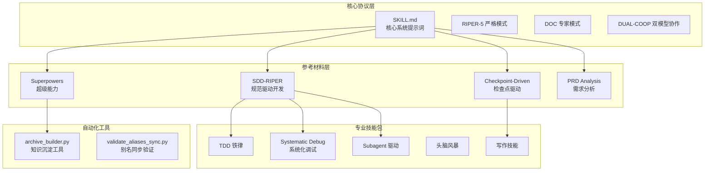
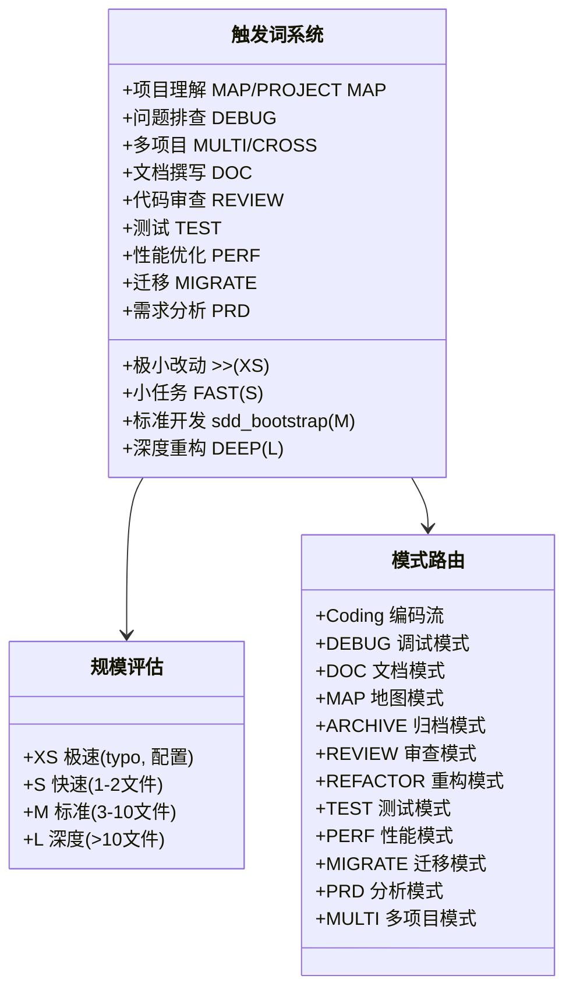
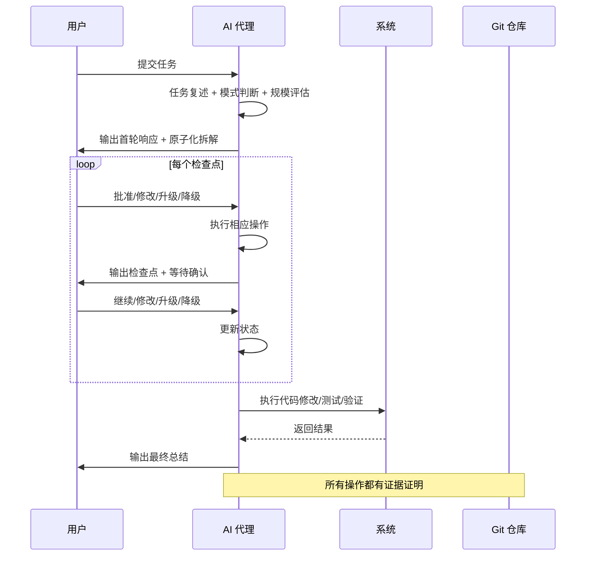
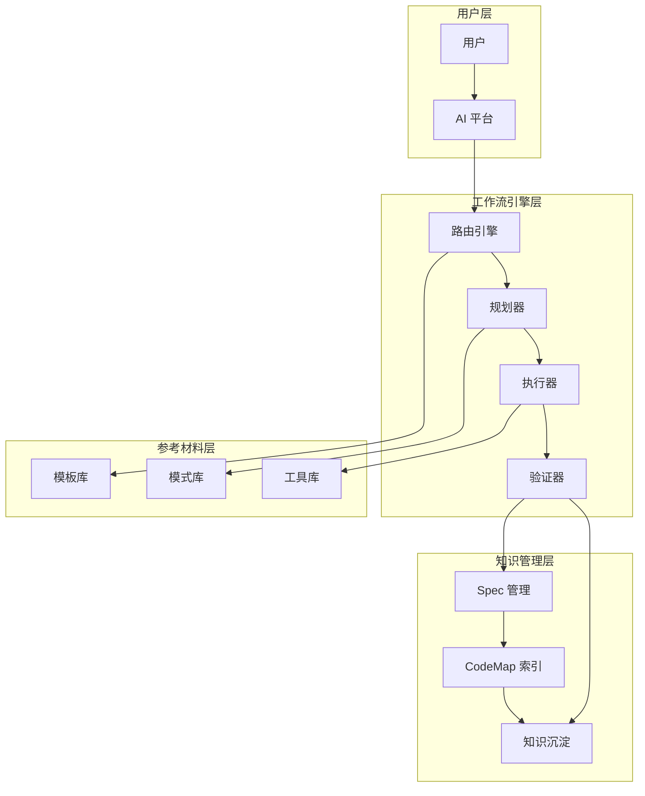
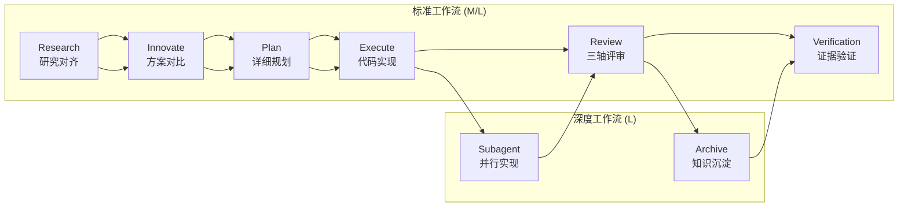
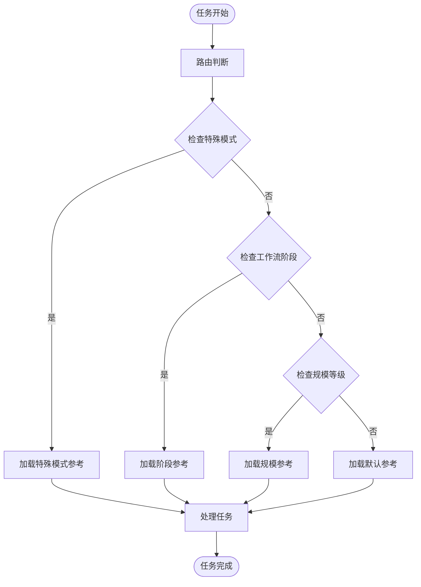
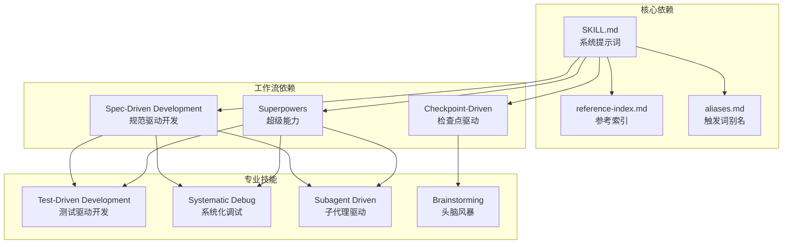
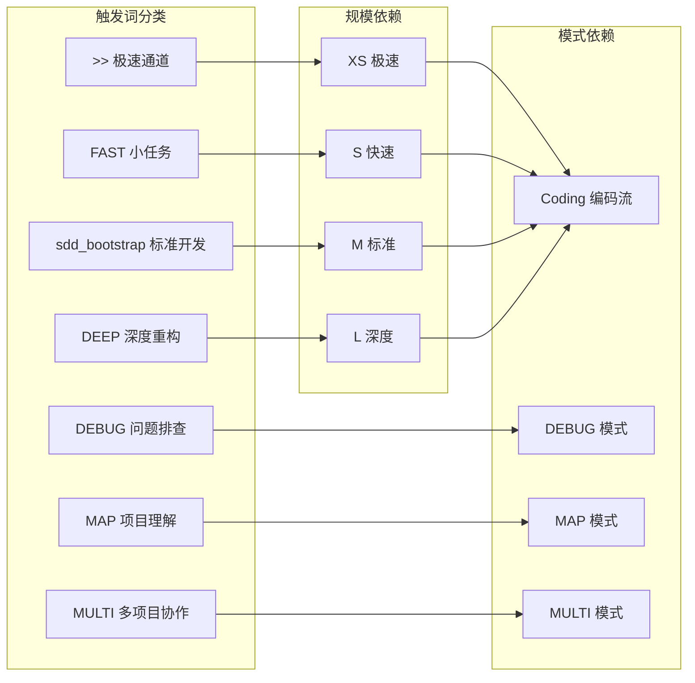
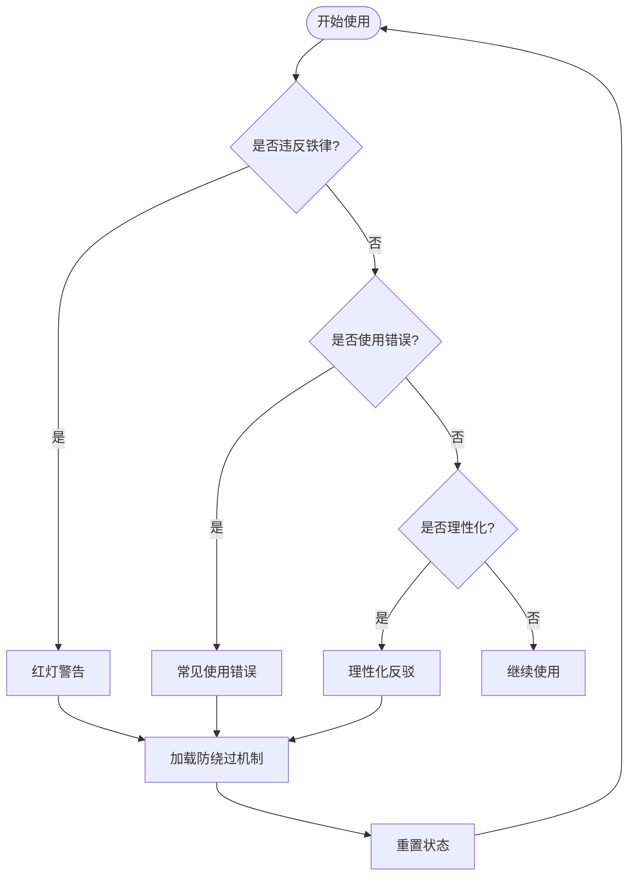

# ALTAS Workflow 快速启动方案

<cite>
**本文档引用的文件**
- [QUICKSTART.md](file://altas-workflow/QUICKSTART.md)
- [README.md](file://README_EN.md)
- [SKILL.md](file://altas-workflow/SKILL.md)
- [reference-index.md](file://altas-workflow/reference-index.md)
- [aliases.md](file://altas-workflow/references/entry/aliases.md)
- [test-driven-development/SKILL.md](file://altas-workflow/references/superpowers/test-driven-development/SKILL.md)
- [systematic-debugging/SKILL.md](file://altas-workflow/references/superpowers/systematic-debugging/SKILL.md)
- [test.md](file://altas-workflow/references/special-modes/test.md)
- [RIPER-5.md](file://altas-workflow/protocols/RIPER-5.md)
- [spec-template.md](file://altas-workflow/references/spec-driven-development/spec-template.md)
- [spec-lite-template.md](file://altas-workflow/references/checkpoint-driven/spec-lite-template.md)
</cite>

## 目录
1. [简介](#简介)
2. [项目结构](#项目结构)
3. [核心组件](#核心组件)
4. [架构概览](#架构概览)
5. [详细组件分析](#详细组件分析)
6. [依赖关系分析](#依赖关系分析)
7. [性能考虑](#性能考虑)
8. [故障排除指南](#故障排除指南)
9. [结论](#结论)

## 简介

ALTAS Workflow 是一个融合了三种优秀工作流的综合性 AI 原生开发工作流规范：Spec-Driven Development (SDD-RIPER)、Checkpoint-Driven (SDD-RIPER-Optimized) 和 Superpowers。该项目旨在解决 AI 编程中的四大工程痛点：上下文衰减、审查瘫痪、代码不信任和难以维护。

### 核心使命

ALTAS Workflow 专注于解决四个主要工程痛点：

| 痛点 | ALTAS 解决方案 |
|------|-----------|
| **上下文衰减** | CodeMap 索引 + 渐进式披露，按需加载参考材料 |
| **审查瘫痪** | 四级智能深度 (XS/S/M/L)，小任务不卡在审批 |
| **代码不信任** | 以 Spec 为中心 + 三轴评审，Spec 就是真相 |
| **难以维护** | 知识沉淀 + TDD 铁律，完成即资产 |

### 核心铁律

1. **没有 Spec，不写代码** - 在形成最小 Spec 前不写代码 (XS 除外)
2. **没有批准，不执行** - 未获得人类确认前不写代码
3. **Spec 就是真相** - 当 Spec 与代码冲突时，代码是错误的
4. **逆向同步** - 执行中发现偏差 → 先更新 Spec → 再修复代码
5. **证据第一** - 以验证结果证明完成，而非模型自我声明
6. **无根因，不修复** - 必须有根因分析才能修复 Bug，禁止盲目修复
7. **TDD 铁律** - 规模 M/L：没有失败测试不写生产代码
8. **可恢复** - 长任务暂停前在 Spec 中留下恢复锚点

## 项目结构

ALTAS Workflow 采用模块化的项目结构，包含核心协议、参考材料、专业技能包和自动化工具。

**图表来源**
- [README.md: 48-85:48-85](file://README_EN.md#L48-L85)
- [reference-index.md: 199-311:199-311](file://altas-workflow/reference-index.md#L199-L311)

### 核心资产统计

| 类别 | 数量 | 描述 |
|------|------|------|
| **核心协议** | 1 | SKILL.md (ALTAS Workflow 主协议) |
| **专用协议** | 3 | RIPER-5 / RIPER-DOC / DUAL-COOP |
| **方法论** | 4 | 范式转换 / AI 原生范式 / 团队推广 / 入门教程 |
| **参考材料** | 79 | SDD (7) / Checkpoint (4) / Superpowers (37) / Agents (22) / Entry (4) / Special-Modes (5) |
| **独立代理** | 2 | SDD-RIPER-ONE (标准/轻量) |
| **代码示例** | 1 | EXAMPLES.md (四原则实践示例) |
| **自动化工具** | 1 | archive_builder.py (知识沉淀工具) |

**章节来源**
- [README.md: 87-98:87-98](file://README_EN.md#L87-L98)

## 核心组件

### 触发词系统

ALTAS Workflow 提供了丰富的触发词系统，支持不同类型的工程任务：

**图表来源**
- [aliases.md: 12-34:12-34](file://altas-workflow/references/entry/aliases.md#L12-L34)
- [SKILL.md: 149-175:149-175](file://altas-workflow/SKILL.md#L149-L175)

### 四级智能深度适应

ALTAS Workflow 采用四级智能深度适应机制，根据任务复杂度自动调整工作流复杂度：

| 规模 | 触发条件 | 规模要求 | 工作流 | 典型场景 |
|------|----------|----------|--------|----------|
| **XS (极速)** | typo, 配置值, <10行 | 跳过，事后 1行总结 | 直接执行→验证→总结 | 改配置, 修 typo, 日志 |
| **S (快速)** | 1-2文件, 清晰逻辑 | micro-spec (1-3句) | micro-spec→批准→执行→回写 | 加参数, 简单函数 |
| **M (标准)** | 3-10文件, 模块内 | 轻量 Spec 落盘 | Research→Plan→Execute(TDD)→Review | 新接口, 模块重构 |
| **L (深度)** | 跨模块, >500行, 架构级 | 完整 Spec + Innovate + Archive | Research→Innovate→Plan→Execute→Subagent→Review→Archive | 架构拆分, 跨团队转型 |

**章节来源**
- [README.md: 240-248:240-248](file://README_EN.md#L240-L248)
- [SKILL.md: 203-242:203-242](file://altas-workflow/SKILL.md#L203-L242)

### 检查点机制

ALTAS Workflow 实施了严格的检查点机制，确保每个步骤都有明确的输出和确认：

**图表来源**
- [SKILL.md: 343-432:343-432](file://altas-workflow/SKILL.md#L343-L432)

**章节来源**
- [SKILL.md: 343-432:343-432](file://altas-workflow/SKILL.md#L343-L432)

## 架构概览

ALTAS Workflow 采用分层架构设计，从底层的检查点机制到顶层的智能深度适应，形成了完整的工程工作流体系。

**图表来源**
- [README.md: 198-235:198-235](file://README_EN.md#L198-L235)
- [SKILL.md: 40-61:40-61](file://altas-workflow/SKILL.md#L40-L61)

### 工作流阶段

ALTAS Workflow 定义了标准化的工作流阶段，确保每个任务都有明确的推进路径：

**图表来源**
- [README.md: 200-235:200-235](file://README_EN.md#L200-L235)

**章节来源**
- [README.md: 198-235:198-235](file://README_EN.md#L198-L235)

## 详细组件分析

### 触发词详细使用指南

#### 极速通道 (>>)

**适用场景**：任务一眼能看出改哪、改什么，预计改动不超过 5 行代码。

**典型示例**：
- 将配置文件中的常量值从 3 改为 5
- 修复 README 中的拼写错误
- 删除废弃的配置项

**AI 行为**：
1. 识别为 Size XS (极速)
2. 直接修改代码
3. 运行最小必要验证
4. 输出 1 行结果总结

#### 小任务 (FAST)

**适用场景**：任务需要改几处代码、加一些逻辑，但不需要大规模重构，预计改动在 1~3 个文件内。

**典型示例**：
- 为用户登录接口添加登录失败次数限制
- 在函数中增加参数校验
- 修复定位明确的小问题

**AI 行为**：
1. 识别为 Size S (小任务)
2. 生成 micro-spec
3. 在检查点等你确认
4. 执行实现并验证
5. 回写总结

#### 标准开发 (sdd_bootstrap)

**适用场景**：需要新增一个完整功能、接口或模块，涉及多个文件，需要明确 Research/Plan/Execute/Review 流程。

**典型示例**：
- 实现用户个人资料编辑功能
- 为 API 添加限流能力
- 重构订单模块的状态流转逻辑

**AI 行为**：
1. 自动评估规模，通常为 Size M
2. 先做 Research，理解现有实现和依赖
3. 输出 Plan 和 Checklist，等你批准
4. 进入 Execute，默认按 TDD 推进
5. 完成后做 Review

#### 深度重构 (DEEP)

**适用场景**：需要大规模重构、架构调整、数据库迁移、跨模块改造，需要多方案对比、风险识别、分阶段实施。

**典型示例**：
- 重构认证模块拆分为独立微服务
- 将单体应用拆分为多个微服务
- 重构前端架构从 jQuery 迁移到 React

**AI 行为**：
1. 识别为 Size L (深度)
2. 生成 codemap，梳理现状和依赖
3. 给出多种方案和风险对比
4. 输出原子化计划与分阶段实施方案
5. 按 TDD + Review 推进

#### 问题排查 (DEBUG)

**适用场景**：线上报错排查、日志分析、性能异常定位、用户反馈问题。

**典型示例**：
- 支付成功但订单状态未更新
- 服务启动后 5 分钟内崩溃
- 接口响应时间超过 10 秒

**AI 行为**：
1. 进入 Debug 模式（默认只读分析）
2. 结合日志、代码、Spec 做根因定位
3. 输出症状、预期行为、根因候选、建议修复
4. 如需落地修复，再切换到 FAST 或 sdd_bootstrap

#### 项目理解 (MAP/PROJECT MAP)

**适用场景**：刚接手项目、不确定改动入口在哪、想先拿到模块结构和依赖关系。

**典型示例**：
- 梳理 API 模块的入口文件、核心服务、数据流
- 分析中间件模块的依赖关系
- 了解数据库模型层的表关系

**AI 行为**：
1. 只读分析指定范围
2. 输出模块结构、依赖关系、关键入口
3. 不修改任何代码

#### 多项目协作 (MULTI/CROSS)

**适用场景**：前后端联动、跨仓库接口联调、一个任务必须同时改多个项目。

**典型示例**：
- 前后端联动实现用户个人主页功能
- 统一前后端的错误码规范
- 实现跨项目的用户认证 SSO

**AI 行为**：
1. 自动扫描工作区并识别多个项目
2. 输出 Project Registry 等你确认
3. 按项目拆分计划与执行顺序
4. 记录接口契约和联动影响

**章节来源**
- [QUICKSTART.md: 129-290:129-290](file://altas-workflow/QUICKSTART.md#L129-L290)

### 参考资料加载机制

ALTAS Workflow 采用渐进式披露机制，只在命中场景时按需加载对应文件：

**图表来源**
- [reference-index.md: 6-18:6-18](file://altas-workflow/reference-index.md#L6-L18)

**章节来源**
- [reference-index.md: 6-18:6-18](file://altas-workflow/reference-index.md#L6-L18)

### 规模评估快速参考

| 信号 | 推荐规模 | 触发词 |
|------|----------|--------|
| "改个 typo" | XS | `>>` |
| "加个配置项" | XS | `>>` |
| "改个按钮文案" | XS/S | `>>` 或 `FAST:` |
| "给这个接口加个参数" | S | `FAST:` |
| "给这个函数加错误处理" | S | `FAST:` |
| "新增一个 CRUD 接口" | M | `sdd_bootstrap:` |
| "重构这个模块" | M/L | `sdd_bootstrap:` 或 `DEEP:` |
| "跨模块改数据模型" | L | `DEEP:` |
| "架构级重构" | L | `DEEP:` |
| "前后端联动" | L (MULTI) | `MULTI:` |

**章节来源**
- [QUICKSTART.md: 750-764:750-764](file://altas-workflow/QUICKSTART.md#L750-L764)

## 依赖关系分析

### 核心依赖关系

**图表来源**
- [SKILL.md: 1-13:1-13](file://altas-workflow/SKILL.md#L1-L13)
- [reference-index.md: 199-274:199-274](file://altas-workflow/reference-index.md#L199-L274)

### 触发词依赖关系

**图表来源**
- [aliases.md: 12-34:12-34](file://altas-workflow/references/entry/aliases.md#L12-L34)
- [SKILL.md: 149-175:149-175](file://altas-workflow/SKILL.md#L149-L175)

**章节来源**
- [aliases.md: 12-34:12-34](file://altas-workflow/references/entry/aliases.md#L12-L34)
- [SKILL.md: 149-175:149-175](file://altas-workflow/SKILL.md#L149-L175)

## 性能考虑

### 检查点机制的性能优势

ALTAS Workflow 的检查点机制在保证质量的同时，也带来了显著的性能优势：

1. **渐进式披露**：只在需要时加载参考材料，避免上下文污染
2. **原子化任务**：每个检查点都是单一动作，便于并行执行
3. **证据驱动**：以测试结果证明完成，减少返工
4. **智能深度适应**：根据任务复杂度自动调整工作流复杂度

### 规模评估的性能优化

| 规模 | 任务数量 | 预估时间 | 复杂度 |
|------|----------|----------|--------|
| **XS** | 1-2 个原子任务 | 5-15 分钟 | 极低 |
| **S** | 3-5 个原子任务 | 30-60 分钟 | 低 |
| **M** | 5-15 个原子任务 | 2-4 小时 | 中等 |
| **L** | 15+ 个原子任务 | 8-24 小时 | 高 |

### 工具链性能

ALTAS Workflow 支持多种 AI 平台，针对不同平台进行了性能优化：

| 平台 | 安装方式 | 性能特点 |
|------|----------|----------|
| **Cursor / Trae** | 复制 SKILL.md 内容到 `.cursorrules` | 高性能，支持原生工具 |
| **Claude / OpenAI Agent** | 注入 SKILL.md 作为系统提示 | 标准性能，支持多轮对话 |
| **Qoder** | 放置 SKILL.md 在项目 `.qoder/skills/` 目录 | 中等性能，支持插件 |

**章节来源**
- [README.md: 117-124:117-124](file://README_EN.md#L117-L124)

## 故障排除指南

### 常见问题解答

**Q: AI 一次性输出太多代码，跑完所有步骤怎么办？**

A: ALTAS 内置检查点机制，AI 完成一步后**必须**暂停等确认。如果 AI 暴走，回复："请停止，严格执行检查点机制，每次只推进一步。"

**Q: 为什么 AI 总是先写测试？太慢了。**

A: 这是 Evidence First + TDD 铁律。没有失败测试，AI 生成的代码可能没被执行过。如果任务极简，用 `>>` 触发 XS 模式跳过 TDD。

**Q: 如何中途干预 AI 的计划？**

A: 在任意检查点回复 `[修改] 请不要使用 Redis，改为内存缓存`，AI 会根据反馈调整 Plan 后重新请求 Approve。

**Q: mydocs/ 下太多 md 文件，要提交 Git 吗？**

A: 强烈建议提交。Spec 和 Archive 是项目的唯一真相源，防止上下文腐烂，帮助新人接手。

**Q: 如何选择 XS/S/M/L？**

A: ALTAS 会自动评估。你也可以强制指定：`>>`=XS, `FAST`=S, 默认=M, `DEEP`=L。执行中可随时 `[升级为M]` 或 `[降级为S]`。

**Q: 参考资料 (references/) 太多，AI 每次都要全部读取吗？**

A: 不需要。ALTAS 采用渐进式披露，只在命中场景时按需读取对应文件。SKILL.md 中的参考索引表明确了每个文件的调用时机。

### 使用错误与防绕过

ALTAS Workflow 提供了完整的使用错误识别和防绕过机制：

**图表来源**
- [SKILL.md: 558-567:558-567](file://altas-workflow/SKILL.md#L558-L567)

**章节来源**
- [SKILL.md: 558-567:558-567](file://altas-workflow/SKILL.md#L558-L567)

### 特殊模式处理

对于特殊模式（DEBUG/REVIEW/REFACTOR/TEST/PERF/MIGRATE），ALTAS Workflow 提供了专门的处理机制：

| 模式 | 处理方式 | 特殊要求 |
|------|----------|----------|
| **DEBUG** | 系统化根因分析 → 诊断报告 | 必须先分析后修复 |
| **REVIEW** | 三轴评审：需求达成/Spec-Code 一致/代码质量 | 必须通过评审 |
| **REFACTOR** | CodeMap → 规划 → 执行 → 验证 | 保持功能不变 |
| **TEST** | 测试现状分析 → 策略制定 → 补测 → 验证 → 报告 | 质量门禁 |
| **PERF** | 基线建立 → 瓶颈定位 → 优化 → 验证 | 性能目标 |
| **MIGRATE** | 风险评估 → 回滚方案 → 预演 → 执行 | 安全迁移 |

**章节来源**
- [test.md: 7-16:7-16](file://altas-workflow/references/special-modes/test.md#L7-L16)

## 结论

ALTAS Workflow 作为一个成熟的 AI 原生开发工作流规范，通过以下核心特性实现了工程效率的显著提升：

### 核心优势

1. **智能深度适应**：四级任务深度自动评估，确保工作流复杂度与任务规模匹配
2. **检查点机制**：严格的阶段性验证，确保每个步骤都有明确证据
3. **渐进式披露**：按需加载参考材料，避免上下文污染
4. **证据驱动**：以测试结果证明完成，而非模型自我声明
5. **Spec 为中心**：所有决策都以 Spec 为权威依据

### 适用场景

ALTAS Workflow 适用于各种规模的工程任务：

- **日常功能迭代**：使用标准开发模式 (sdd_bootstrap)
- **紧急修复**：使用极速通道 (>>)
- **架构重构**：使用深度模式 (DEEP)
- **问题排查**：使用调试模式 (DEBUG)
- **多项目协作**：使用多项目模式 (MULTI)
- **测试补充**：使用测试模式 (TEST)

### 最佳实践

1. **明确任务描述**：在触发词后提供清晰的目标、范围、限制条件
2. **提供参考资料**：将重要的 Spec、日志、接口文档明确列出
3. **遵循检查点机制**：在每个检查点等待确认后再继续
4. **保持 Spec 更新**：及时更新 Spec 以反映最新进展
5. **重视证据验证**：以测试结果和运行结果作为完成证明

ALTAS Workflow 代表了 AI 原生开发的未来方向，通过将人类的工程智慧与 AI 的强大能力有机结合，实现了工程质量和效率的双重提升。