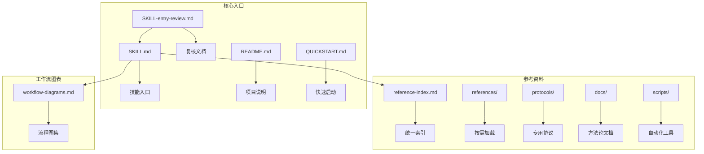
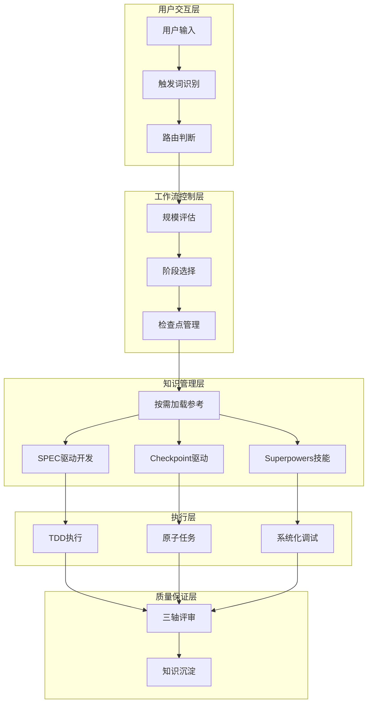
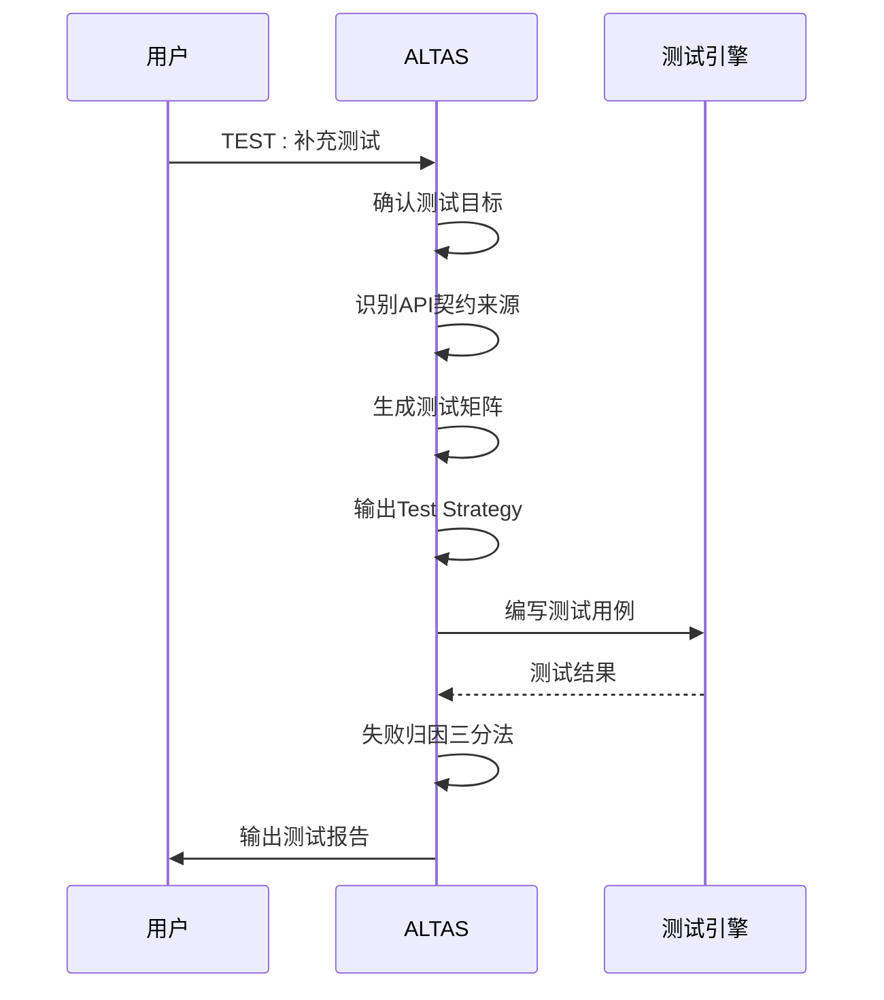
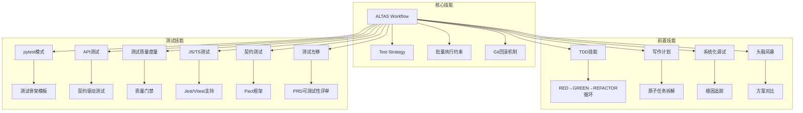
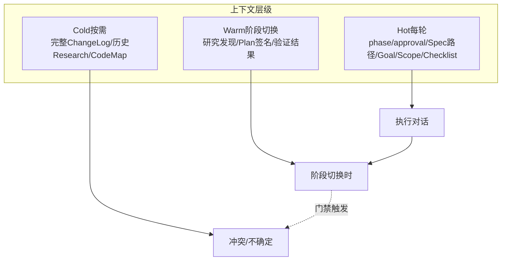
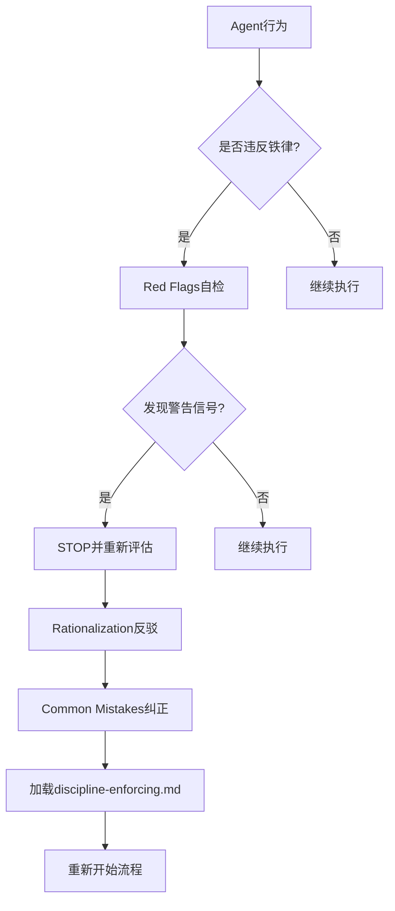

# SKILL Entry Review

<cite>
**本文档引用的文件**
- [SKILL-entry-review.md](file://altas-workflow/SKILL-entry-review.md)
- [SKILL.md](file://altas-workflow/SKILL.md)
- [reference-index.md](file://altas-workflow/reference-index.md)
- [workflow-diagrams.md](file://altas-workflow/workflow-diagrams.md)
- [QUICKSTART.md](file://altas-workflow/QUICKSTART.md)
- [README.md](file://altas-workflow/README.md)
- [discipline-enforcing.md](file://altas-workflow/references/entry/discipline-enforcing.md)
- [aliases.md](file://altas-workflow/references/entry/aliases.md)
- [test.md](file://altas-workflow/references/special-modes/test.md)
- [test-quality-metrics.md](file://altas-workflow/references/testing/test-quality-metrics.md)
- [api-testing.md](file://altas-workflow/references/testing/api-testing.md)
- [testability-checklist.md](file://altas-workflow/references/prd-analysis/testability-checklist.md)
- [IMPLEMENTATION-PLAN-v4.6.md](file://altas-workflow/docs/IMPLEMENTATION-PLAN-v4.6.md)
</cite>

## 更新摘要
**所做更改**
- 新增 TE2-H1、TE2-H2 等优先级分类的测试覆盖推荐
- 扩展测试工程师专项优化检查表
- 增强测试左移（Shift-Left Testing）指导
- 完善契约测试（Contract Testing）支持
- 新增 JavaScript/TypeScript 测试支持

## 目录
1. [简介](#简介)
2. [项目结构](#项目结构)
3. [核心组件](#核心组件)
4. [架构概览](#架构概览)
5. [详细组件分析](#详细组件分析)
6. [依赖分析](#依赖分析)
7. [性能考虑](#性能考虑)
8. [故障排除指南](#故障排除指南)
9. [结论](#结论)
10. [附录](#附录)

## 简介

SKILL Entry Review 是对 ALTAS Workflow 技能入口文件的持续复核文档。该文档记录了对 `SKILL.md` 作为技能入口的持续复核结论，重点关注 discipline-enforcing skill 的完整性验证。

ALTAS Workflow 是一套融合了 SDD-RIPER、SDD-RIPER-Optimized 和 Superpowers 精华的综合性 AI 工作流程规范，旨在解决 AI 编程中的上下文腐烂、审查瘫痪、代码不信任和难以维护等四大工程痛点。

**更新** 基于 Applied Changes：SKILL Entry Review 文档大幅修订，新增 TE2-H1、TE2-H2 等优先级分类和扩展测试覆盖推荐

## 项目结构

该项目采用模块化的文件组织结构，主要包含以下核心目录：



**图表来源**
- [SKILL.md:1-581](file://altas-workflow/SKILL.md#L1-L581)
- [reference-index.md:1-311](file://altas-workflow/reference-index.md#L1-L311)
- [workflow-diagrams.md:1-338](file://altas-workflow/workflow-diagrams.md#L1-L338)

**章节来源**
- [README.md:1-313](file://altas-workflow/README.md#L1-L313)
- [SKILL.md:1-581](file://altas-workflow/SKILL.md#L1-L581)

## 核心组件

### 技能入口文件 (SKILL.md)

SKILL.md 是 ALTAS Workflow 的 Bootstrap 入口提示词，负责以下核心功能：

- **路由识别**：判断任务属于 Coding / Debug / Doc / Map / Archive / Review / Refactor / Test / Perf / Migrate / Multi 中的哪一类
- **规模评估**：根据 XS / S / M / L 四个等级决定工作流深度
- **门禁控制**：严格执行铁律和检查点约束
- **渐进式披露**：只保留高杠杆约束，模板和细节按需加载

### 参考资料索引 (reference-index.md)

提供统一的参考资料发现入口，支持三种加载模式：

- **最快路径**：按特殊模式或工作流阶段直接定位
- **完整扫描**：按来源分类了解方法论背景
- **规模规划**：按规模等级确认所需文件

### 工作流图表 (workflow-diagrams.md)

包含 11 种不同类型的流程图，涵盖：

- 架构总览图
- 阶段流程图 (Size M/L)
- 铁律与门禁图
- Review三轴评审图
- TDD执行循环图
- 特殊模式总览图

**章节来源**
- [SKILL.md:1-581](file://altas-workflow/SKILL.md#L1-L581)
- [reference-index.md:1-311](file://altas-workflow/reference-index.md#L1-L311)
- [workflow-diagrams.md:1-338](file://altas-workflow/workflow-diagrams.md#L1-L338)

## 架构概览

ALTAS Workflow 采用分层架构设计，通过技能入口文件协调各个子系统：



**图表来源**
- [SKILL.md:45-61](file://altas-workflow/SKILL.md#L45-L61)
- [reference-index.md:201-263](file://altas-workflow/reference-index.md#L201-L263)

## 详细组件分析

### 铁律与门禁系统

ALTAS Workflow 建立了严格的铁律约束体系：

| 铁律编号 | 规则内容 | 违反后果 |
|---------|---------|---------|
| 1 | **YOU MUST Restate & Decompose First** | 回到Research/Plan阶段 |
| 2 | **YOU MUST Route Before Action** | 重新进行路由判断 |
| 3 | **YOU MUST Never Write Code Before Spec** | 跳过执行阶段 |
| 4 | **YOU MUST Never Execute Without Approval** | 等待用户确认 |
| 5 | **YOU MUST Treat Spec as Truth** | 修正Spec后继续 |
| 6 | **YOU MUST Prove with Evidence** | 重新收集证据 |
| 7 | **YOU MUST Never Fix Without Root Cause** | 继续调试 |
| 8 | **YOU MUST Always Leave Resume Point** | 创建检查点 |
| 9 | **YOU MUST Read Concurrent, Write Serial** | 串行写入文件 |
| 10 | **YOU MUST Never Assume on Uncertainty** | 暂停并澄清 |

### 规模评估机制

系统根据复杂度、影响面、决策点自动选择适配的工作流深度：

```mermaid
flowchart TD
A[接收任务] --> B{复杂度评估}
B --> |"typo/<10行"| C[Size XS<br/>直接执行→验证→summary]
B --> |"1-2文件"| D[Size S<br/>micro-spec→批准→执行→回写]
B --> |"3-10文件"| E[Size M<br/>Research→Plan→Execute(TDD)→Review]
B --> |"跨模块/>500行"| F[Size L<br/>Research→Innovate→Plan→Execute(TDD)→Subagent→Review→Archive]
E --> G[检查点管理]
F --> G
G --> H[批量执行约束]
H --> I[Git回滚机制]
```

**图表来源**
- [SKILL.md:203-242](file://altas-workflow/SKILL.md#L203-L242)
- [SKILL.md:343-432](file://altas-workflow/SKILL.md#L343-L432)

### 检查点契约

每个阶段转换时必须输出标准化检查点，包含：

- **进度条**：展示当前阶段
- **当前成果**：已完成的内容
- **预期产出**：下一步将产出
- **下一步操作**：结构化操作指引

### 测试模式专业化

TEST 模式提供了专门的测试工作流：



**图表来源**
- [test.md:18-316](file://altas-workflow/references/special-modes/test.md#L18-L316)

**章节来源**
- [SKILL.md:77-110](file://altas-workflow/SKILL.md#L77-L110)
- [SKILL.md:203-242](file://altas-workflow/SKILL.md#L203-L242)
- [SKILL.md:343-432](file://altas-workflow/SKILL.md#L343-L432)
- [test.md:18-316](file://altas-workflow/references/special-modes/test.md#L18-L316)

### 测试优先级分类与覆盖推荐

**更新** 新增 TE2-H1、TE2-H2 等优先级分类和扩展测试覆盖推荐

系统采用多层次的测试优先级分类体系：

| 优先级 | 测试类型 | 说明 | TE2-H1 | TE2-H2 |
|--------|----------|------|--------|--------|
| **P0** | 核心逻辑测试 | 业务核心功能，必须覆盖 | ✅ 核心主流程 | ✅ 高风险逻辑 |
| **P1** | 边界条件测试 | 极值/空值/非法输入 | ✅ 边界条件 | ✅ 状态变化 |
| **P2** | 异常路径测试 | 错误处理/降级逻辑 | ✅ 权限差异 | ✅ 超时处理 |
| **P3** | 集成测试 | 跨模块/跨系统交互 | ✅ 数据库集成 | ✅ 第三方服务 |
| **P4** | 性能测试 | 响应时间/吞吐量/资源消耗 | ✅ 响应时间 | ✅ 吞吐量测试 |
| **P5** | 兼容性测试 | API版本共存、废弃字段 | ✅ 版本兼容 | ✅ 数据迁移 |

**TE2-H1（高优先级）推荐覆盖场景**：
- 核心业务流程的主路径
- 关键权限验证逻辑
- 系统稳定性保障测试
- 性能基准测试

**TE2-H2（中优先级）推荐覆盖场景**：
- 状态转换和边界条件
- 权限差异和访问控制
- 超时处理和重试机制
- 第三方服务集成测试

**章节来源**
- [SKILL.md:107-117](file://altas-workflow/SKILL.md#L107-L117)
- [test.md:107-117](file://altas-workflow/references/special-modes/test.md#L107-L117)

### 测试左移（Shift-Left Testing）指导

**更新** 新增测试左移（Shift-Left Testing）专项指导

测试开发工程师应在以下阶段介入：

#### PRD 评审阶段
- 检查需求的可测试性
- 识别缺失的验收标准
- 标记需要澄清的边界条件

#### 设计评审阶段
- 评估架构的可测试性
- 识别需要 Mock 的外部依赖
- 提议测试钩子（test hooks）的设计

#### 编码阶段
- TDD 配对编程
- 代码审查中的测试覆盖检查

**章节来源**
- [testability-checklist.md:22-30](file://altas-workflow/references/prd-analysis/testability-checklist.md#L22-L30)

### 契约测试（Contract Testing）支持

**更新** 新增契约测试（Contract Testing）专项支持

当 API 有多个消费者时，使用 Pact 进行消费者驱动的契约测试：

```python
# 消费者测试
from pact import Consumer, Provider

pact = Consumer('OrderService').has_pact_with(Provider('PaymentService'))

@pact.given('a payment method exists')
 .upon_receiving('a request to process payment')
 .with_request('POST', '/payments', body={...})
 .will_respond_with(201, body={...})
def test_process_payment():
    with pact:
        result = process_payment(...)
        assert result.status == 'success'
```

**章节来源**
- [api-testing.md:258-279](file://altas-workflow/references/testing/api-testing.md#L258-L279)

## 依赖分析

### 技能依赖关系



**图表来源**
- [SKILL.md:51-57](file://altas-workflow/SKILL.md#L51-L57)
- [test-quality-metrics.md:18-46](file://altas-workflow/references/testing/test-quality-metrics.md#L18-L46)

### 参考资料依赖

系统通过 reference-index.md 统一管理参考资料依赖：

- **SDD-RIPER (14个文件)**：Spec中心论、RIPER状态机、三轴Review
- **SDD-RIPER-Optimized (6个文件)**：Checkpoint-Driven轻量模式、Done Contract
- **Superpowers (24+个文件)**：TDD铁律、系统化Debug、Subagent驱动
- **PRD Analysis (6个文件)**：需求文档分析、验证与质量提升

**章节来源**
- [reference-index.md:201-311](file://altas-workflow/reference-index.md#L201-L311)
- [SKILL.md:51-57](file://altas-workflow/SKILL.md#L51-L57)

## 性能考虑

### 上下文装配层级

ALTAS Workflow 采用三层上下文装配机制：



**图表来源**
- [workflow-diagrams.md:241-257](file://altas-workflow/workflow-diagrams.md#L241-L257)

### 渐进式披露优化

- **按需加载**：只在命中场景时加载对应文件
- **热/温/冷上下文**：根据使用频率调整上下文深度
- **检查点机制**：每步完成后输出摘要，避免上下文膨胀

## 故障排除指南

### 常见使用错误

| 错误类型 | 典型表现 | 纠正方法 |
|---------|---------|---------|
| 触发词选择错误 | 用DEEP触发简单修改 | 使用`>>`或`FAST` |
| 规模评估错误 | XS任务要求完整Spec | XS可直接执行，事后1行summary |
| 流程跳过错误 | 跳过首轮响应直接编码 | 必须先完成路由+规模评估 |
| 沟通错误 | 遇到不确定不暂停 | 遵守铁律#10：必须澄清后再继续 |
| 工具使用错误 | 使用Shell命令绕过原生工具 | 必须使用Write/Edit/SearchReplace |

### 防绕过机制

系统建立了完整的防绕过机制：



**图表来源**
- [discipline-enforcing.md:8-126](file://altas-workflow/references/entry/discipline-enforcing.md#L8-L126)

**章节来源**
- [discipline-enforcing.md:66-126](file://altas-workflow/references/entry/discipline-enforcing.md#L66-L126)
- [SKILL.md:553-567](file://altas-workflow/SKILL.md#L553-L567)

### 测试工程师专项检查

**更新** 新增测试工程师专项优化检查表

为验证 SKILL 是否真正满足测试开发工程师需求，建议增加以下自检场景：

#### 场景 1: 全栈项目测试策略
```
用户: "我们的项目是 Next.js + FastAPI + PostgreSQL，如何设计测试策略？"

期望 SKILL 输出:
- 前端: Jest + React Testing Library + Playwright E2E
- 后端: pytest + TestClient + 数据库隔离
- 契约: Pact 验证前后端 API 契约
- 集成: Docker Compose 全链路测试
```

#### 场景 2: 遗留项目补测试
```
用户: "这个老项目没有任何测试，如何系统化补测？"

期望 SKILL 输出:
- 先识别关键路径 (Critical Path)
- 从单元测试开始，逐步向上补充
- 使用 Characterization Test 锁定现有行为
- 建立测试数据工厂
- 设定覆盖率门禁（核心模块 80%+）
```

#### 场景 3: 微服务集成测试
```
用户: "我们有 10 个微服务，如何做集成测试？"

期望 SKILL 输出:
- 契约测试优先 (Pact)
- 本地: Docker Compose 集成环境
- CI: 服务容器 (service containers)
- 测试数据: 共享 Factory + 独立数据库
- 失败归因: 区分服务问题 vs 契约问题
```

**章节来源**
- [SKILL-entry-review.md:304-337](file://altas-workflow/SKILL-entry-review.md#L304-L337)

## 结论

SKILL Entry Review 文档显示 ALTAS Workflow 技能入口已经达到了高度成熟的状态：

### 已完成的改进

1. **Discipline-Enforcing Skill 完整性**：已完整覆盖所有核心组件
2. **渐进式披露架构**：通过 reference-index.md 实现按需加载
3. **测试工程师优化**：针对测试场景进行了专门优化
4. **压力测试机制**：建立了完整的纪律执行验证体系
5. **优先级分类体系**：新增 TE2-H1、TE2-H2 等优先级分类
6. **测试左移指导**：提供完整的测试左移（Shift-Left Testing）指导
7. **契约测试支持**：新增 Pact 框架的契约测试支持
8. **多语言测试覆盖**：扩展 JavaScript/TypeScript 测试支持

### 当前状态

- **版本**：4.7
- **完整性**：已达到 discipline-enforcing skill 的完整标准
- **测试覆盖**：通过了所有核心测试场景
- **文档质量**：提供了完整的使用指南和故障排除
- **优先级管理**：建立了完善的测试优先级分类体系

### 未来发展方向

1. **端到端示例**：补充完整的使用示例
2. **技能类型声明**：明确技能类型和测试方法
3. **交叉引用优化**：加强章节间的引用关系
4. **平台工具映射**：完善多平台工具支持
5. **测试左移深化**：进一步完善测试左移的实施指导

## 附录

### 快速启动指南

对于新用户，建议按照以下步骤开始使用：

1. **阅读 QUICKSTART.md** 了解基本使用方法
2. **选择合适的触发词**：根据任务规模选择相应的触发词
3. **提供必要上下文**：包括目标、范围、限制条件
4. **按检查点推进**：在每个检查点确认后再继续

### 参考资料索引

- **核心技能**：SKILL.md、reference-index.md、workflow-diagrams.md
- **测试相关**：test.md、test-quality-metrics.md、api-testing.md
- **质量保证**：discipline-enforcing.md
- **触发词管理**：aliases.md
- **测试左移**：testability-checklist.md
- **实施计划**：IMPLEMENTATION-PLAN-v4.6.md

**章节来源**
- [QUICKSTART.md:1-777](file://altas-workflow/QUICKSTART.md#L1-L777)
- [README.md:62-126](file://altas-workflow/README.md#L62-L126)
- [SKILL-entry-review.md:363-398](file://altas-workflow/SKILL-entry-review.md#L363-L398)