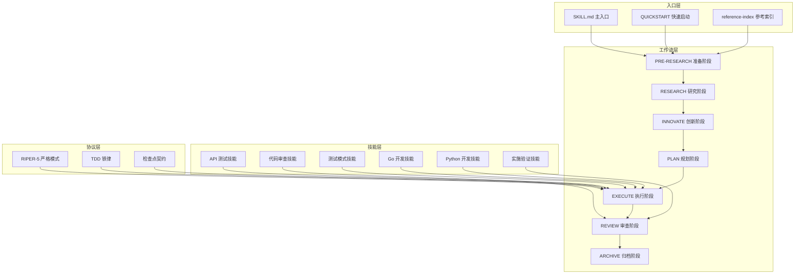
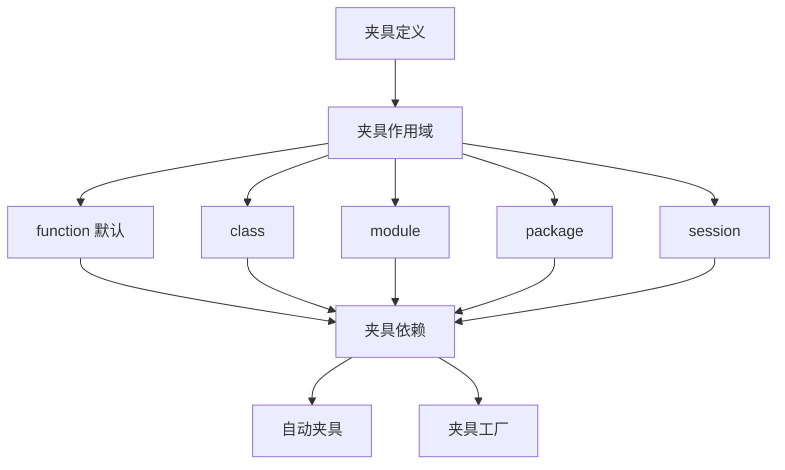
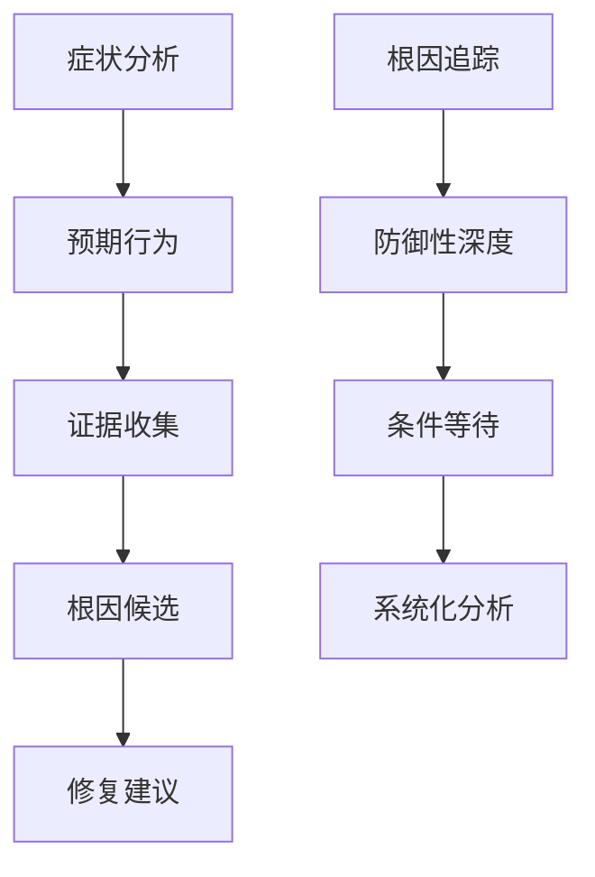
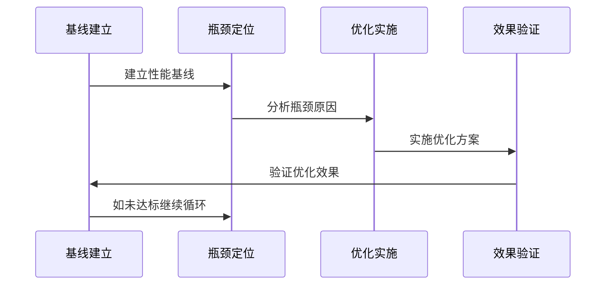
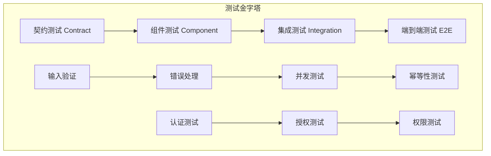
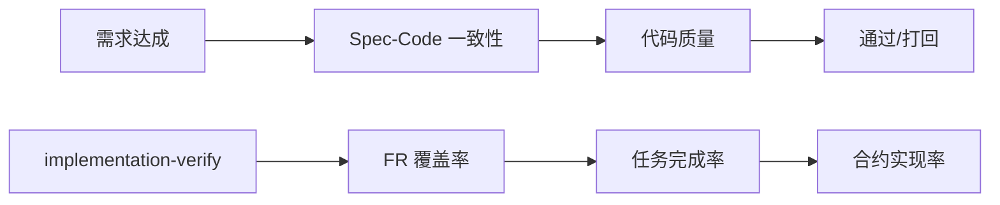
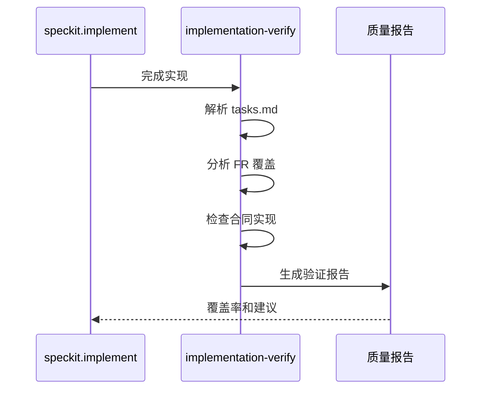
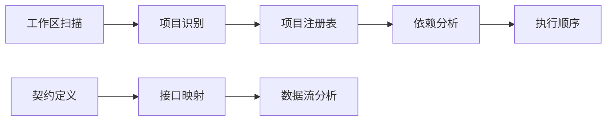

# ALTAS 工作流技能文档

<cite>
**本文档引用的文件**
- [altas-workflow/SKILL.md](file://altas-workflow/SKILL.md)
- [.agents/skills/advanced-api-testing/SKILL.md](file://.agents/skills/advanced-api-testing/SKILL.md)
- [.agents/skills/go-code-review/SKILL.md](file://.agents/skills/go-code-review/SKILL.md)
- [.agents/skills/implementation-verify/SKILL.md](file://.agents/skills/implementation-verify/SKILL.md)
- [.agents/skills/python-code-review/SKILL.md](file://.agents/skills/python-code-review/SKILL.md)
- [.agents/skills/pytest-patterns/SKILL.md](file://.agents/skills/pytest-patterns/SKILL.md)
- [.agents/skills/specify-requirements/SKILL.md](file://.agents/skills/specify-requirements/SKILL.md)
- [altas-workflow/reference-index.md](file://altas-workflow/reference-index.md)
- [altas-workflow/QUICKSTART.md](file://altas-workflow/QUICKSTART.md)
- [altas-workflow/README.md](file://altas-workflow/README.md)
- [altas-workflow/protocols/RIPER-5.md](file://altas-workflow/protocols/RIPER-5.md)
- [.agents/skills/go-code-review/assets/review-template.md](file://.agents/skills/go-code-review/assets/review-template.md)
- [.agents/skills/go-code-review/references/WEB-SERVER.md](file://.agents/skills/go-code-review/references/WEB-SERVER.md)
- [altas-workflow/references/testing/pytest-patterns.md](file://altas-workflow/references/testing/pytest-patterns.md)
- [altas-workflow/references/testing/test-scaffold-templates.md](file://altas-workflow/references/testing/test-scaffold-templates.md)
- [altas-workflow/references/testing/test-data-management.md](file://altas-workflow/references/testing/test-data-management.md)
- [altas-workflow/references/testing/test-quality-metrics.md](file://altas-workflow/references/testing/test-quality-metrics.md)
</cite>

## 更新摘要
**变更内容**
- 更新至版本 4.7，新增测试工程师专项优化
- 新增测试快速导航路径和多语言测试支持引用
- 增强测试策略和质量保证体系
- 完善测试数据管理和质量度量标准

## 目录
1. [项目概述](#项目概述)
2. [核心架构](#核心架构)
3. [技能体系](#技能体系)
4. [工作流模式](#工作流模式)
5. [测试策略](#测试策略)
6. [代码审查](#代码审查)
7. [质量保证](#质量保证)
8. [实施验证](#实施验证)
9. [性能优化](#性能优化)
10. [故障排查](#故障排查)
11. [多项目协作](#多项目协作)
12. [最佳实践](#最佳实践)

## 项目概述

ALTAS Workflow 是一套融合 SDD-RIPER、SDD-RIPER-Optimized 与 Superpowers 精华的综合性 AI 工作流程规范。该项目旨在解决 AI 编程中的四大工程痛点：上下文腐烂、审查瘫痪、代码不信任和难以维护。

### 核心特性

- **智能规模评估**：根据复杂度、影响面、决策点自动选择适配的工作流深度
- **渐进式披露**：研究阶段只谈逻辑约束，规划阶段只谈接口签名与 Checklist
- **流程可视化**：每步完成后输出标准化检查点
- **快速启动**：5分钟武装你的 AI Agent

### 架构支柱

1. **Spec is Truth**：代码是消耗品，Spec 才是资产
2. **No Approval, No Execute**：审代码前置为审计划
3. **Evidence First**：完成由验证结果证明，非模型自宣布
4. **No Fixes Without Root Cause**：系统化调试，禁止盲改
5. **TDD Iron Law**：M/L 规模先写失败测试再写生产代码
6. **Reverse Sync**：Bug 先修 Spec 再修代码

**章节来源**
- [altas-workflow/README.md:1-313](file://altas-workflow/README.md#L1-L313)
- [altas-workflow/SKILL.md:1-581](file://altas-workflow/SKILL.md#L1-L581)

## 核心架构

ALTAS Workflow 采用分层架构设计，通过技能系统实现功能模块化：



**图表来源**
- [altas-workflow/SKILL.md:40-581](file://altas-workflow/SKILL.md#L40-L581)
- [altas-workflow/reference-index.md:1-342](file://altas-workflow/reference-index.md#L1-L342)

### 规模评估体系

| 规模 | 典型信号 | Spec 要求 | 默认流转 |
|------|----------|-----------|----------|
| **XS** | typo、配置值、日志、小于 10 行 | 跳过，事后 1 行 summary | 直接执行 → 验证 → summary |
| **S** | 1-2 文件、逻辑清晰、影响小 | micro-spec（1-3 句） | micro-spec → 批准 → 执行 → 回写 |
| **M** | 3-10 文件、模块内、需要计划 | 轻量 Spec 落盘 | Research → Plan → Execute(TDD) → Review |
| **L** | 跨模块、架构级、迁移、多项目 | 完整 Spec + Innovate + Archive | Research → Innovate → Plan → Execute(TDD) → Review → Archive |

**章节来源**
- [altas-workflow/SKILL.md:203-242](file://altas-workflow/SKILL.md#L203-L242)

## 技能体系

### API 测试技能

Advanced API Testing Patterns 提供了全面的 API 测试策略，涵盖幂等性、输入验证、错误处理、并发测试等多个维度。

#### 核心测试层次

| 层级 | 目的 | 依赖 | 速度 |
|------|------|------|------|
| Contract | 供应商-消费者协议 | 无 | 快速 |
| Component | API 独立测试 | Mocked | 快速 |
| Integration | 真实依赖测试 | 数据库、服务 | 较慢 |

#### 测试场景覆盖

- **认证测试**：401/403 处理、过期令牌、跨用户访问
- **输入验证**：422 验证、缺失字段、错误类型、范围限制
- **错误处理**：500 优雅处理、数据库关闭、超时
- **幂等性**：重复请求保护、相同幂等密钥
- **并发性**：竞态条件、并行请求
- **分页测试**：页面边界、空结果、过滤器

**章节来源**
- [.agents/skills/advanced-api-testing/SKILL.md:10-607](file://.agents/skills/advanced-api-testing/SKILL.md#L10-L607)

### Go 代码审查技能

Go Code Review 提供了系统的 Go 语言代码审查流程，基于社区风格标准和最佳实践。

#### 审查流程

1. 运行 `gofmt -d .` 和 `go vet ./...` 捕捉机械问题
2. 按文件检查类别，标记具体行引用和规则名称
3. 重新阅读差异验证真实性
4. 总结按严重程度分组的发现结果

#### 格式化检查清单

- [ ] **gofmt**：代码使用 `gofmt` 或 `goimports` 格式化
- [ ] **注释句子**：注释为完整的句子，以被描述的名称开头，以句号结尾
- [ ] **包注释**：包注释位于包声明旁，无空行
- [ ] **命名结果参数**：仅在澄清含义时使用（如多个相同类型的返回值）

**章节来源**
- [.agents/skills/go-code-review/SKILL.md:13-184](file://.agents/skills/go-code-review/SKILL.md#L13-L184)

### Python 代码审查技能

Python Code Review 专注于 Python 代码的质量评估，涵盖类型安全、异步模式、错误处理等方面。

#### 快速参考

| 问题类型 | 参考文件 |
|----------|----------|
| 缩进、行长、空白、命名 | references/pep8-style.md |
| 缺失/错误的类型提示、Any 使用 | references/type-safety.md |
| 异步中的阻塞调用、缺少 await | references/async-patterns.md |
| 裸露的 except、缺少上下文、日志记录 | references/error-handling.md |
| 可变默认参数、print 语句 | references/common-mistakes.md |

**章节来源**
- [.agents/skills/python-code-review/SKILL.md:8-88](file://.agents/skills/python-code-review/SKILL.md#L8-L88)

### 测试模式技能

Pytest Patterns 提供了全面的 Python 测试框架使用指南，涵盖夹具、参数化、模拟和测试组织。

#### 夹具系统



**图表来源**
- [.agents/skills/pytest-patterns/SKILL.md:64-194](file://.agents/skills/pytest-patterns/SKILL.md#L64-L194)

#### 参数化测试

- 基础参数化：使用 `@pytest.mark.parametrize` 运行相同测试的不同输入
- 多参数：组合多个参数生成测试矩阵
- 间接参数化：通过夹具接收参数值
- 参数化标记：结合 `pytest.mark` 使用

**章节来源**
- [.agents/skills/pytest-patterns/SKILL.md:195-291](file://.agents/skills/pytest-patterns/SKILL.md#L195-L291)

### 实施验证技能

Implementation Verify 自动验证实现与规范的一致性，确保要求得到满足。

#### 核心验证指标

| 指标 | 公式 | 解释 |
|------|------|------|
| FR 覆盖率 | 已实现的 FR / 总 FR | 需求覆盖程度 |
| 任务完成率 | 已完成任务 / 总任务 | 工作进度 |
| 合同覆盖率 | 已实现端点 / 总端点 | API 完整性 |

#### 退出代码

| 代码 | 状态 | 含义 |
|------|------|------|
| 0 | 完成 | 100% 覆盖 |
| 1 | 部分 | >80% 覆盖 |
| 2 | 低 | <80% 覆盖 |
| 3 | 错误 | 缺少必需文件 |

**章节来源**
- [.agents/skills/implementation-verify/SKILL.md:54-93](file://.agents/skills/implementation-verify/SKILL.md#L54-L93)

### 需求规格技能

Specify Requirements 专注于产品需求文档的创建和验证，确保 WHAT 和 WHY 的清晰定义。

#### PRD 关注领域

- **WHAT**：需要构建的功能、能力
- **WHY**：解决问题、价值主张
- **WHO**：使用者、旅程
- **WHEN**：成功标准、验收标准

#### MECE 原则

所有 PRD 结构化枚举必须满足相互排斥、完全穷尽的要求：

| 章节 | 相互排斥 | 完全穷尽 |
|------|----------|----------|
| **用户画像** | 每个角色代表独特的用户类型 | 所有相关用户类型都被代表 |
| **用户旅程** | 每个旅程描述独特的系统路径 | 所有主要和次要路径都被映射 |
| **功能需求** | 每个用户故事捕获单一、独特的能力 | 所有解决 stated 问题所需的功能都在 |
| **验收标准** | 每个标准测试独特的条件 | 所有功能的快乐路径、错误路径和边缘情况都被覆盖 |

**章节来源**
- [.agents/skills/specify-requirements/SKILL.md:26-128](file://.agents/skills/specify-requirements/SKILL.md#L26-L128)

## 工作流模式

### DEBUG 模式

DEBUG 模式采用系统化调试四阶段法，专注于问题根因定位而非直接修复。

#### 调试四阶段



**图表来源**
- [altas-workflow/protocols/RIPER-5.md:27-125](file://altas-workflow/protocols/RIPER-5.md#L27-L125)

### MULTI 模式

MULTI 模式支持跨项目协作，自动发现多个项目并生成项目注册表。

#### 多项目协作流程

1. 自动扫描工作区识别多个项目
2. 输出项目注册表等待确认
3. 生成双项目 CodeMap
4. 按项目分组制定计划
5. 按依赖顺序执行
6. 记录契约接口

**章节来源**
- [altas-workflow/reference-index.md:128-134](file://altas-workflow/reference-index.md#L128-L134)

### PERF 模式

PERF 模式专注于性能优化，采用基线测量、瓶颈定位、优化实施和验证确认的循环。

#### 性能优化循环



**章节来源**
- [altas-workflow/reference-index.md:171-178](file://altas-workflow/reference-index.md#L171-L178)

## 测试策略

### API 测试金字塔

ALTAS 采用分层测试策略，从契约测试到组件测试再到集成测试：



**图表来源**
- [.agents/skills/advanced-api-testing/SKILL.md:25-42](file://.agents/skills/advanced-api-testing/SKILL.md#L25-L42)

### 测试数据管理

对于复杂的测试数据场景，包括批量数据、关联对象和并发测试，需要专门的数据管理策略：

- **批量数据**：使用工厂模式生成测试数据
- **关联对象**：建立数据依赖关系映射
- **并发场景**：使用隔离的数据环境
- **清理策略**：测试后自动清理残留数据

**章节来源**
- [altas-workflow/SKILL.md:491-492](file://altas-workflow/SKILL.md#L491-L492)

### 测试工程师专项优化

**版本 4.7 新增**：测试工程师专项优化，提供更完善的测试支持

#### 测试快速导航路径

| 任务类型 | 快速路径 | 适用场景 |
|----------|----------|----------|
| 起测试环境 | `test-scaffold-templates.md` → `pytest-patterns.md` | 快速搭建测试基座 |
| 写 API 测试 | `api-testing.md` → `pytest-patterns.md` → `test-data-management.md` | API 测试开发 |
| 写 E2E 测试 | `e2e-testing.md` → `pytest-patterns.md` → `api-testing.md` | 端到端测试 |
| 写性能测试 | `performance-testing.md` → `pytest-patterns.md` → `ci-cd-integration.md` | 性能测试 |
| 优化 CI 测试 | `ci-cd-integration.md` → `test-quality-metrics.md` → `test-maintenance.md` | CI 测试优化 |
| 维护测试套件 | `test-maintenance.md` → `test-review-checklist.md` → `test-quality-metrics.md` | 测试维护 |
| 补测试覆盖率 | `pytest-patterns.md` → `test-task-pressure-scenarios.md` → `test-data-management.md` | 覆盖率提升 |

#### 多语言测试支持

**新增**：支持多语言测试开发，包括：

- **中文测试**：完整的中文测试用例和断言
- **国际化测试**：支持多语言环境下的测试场景
- **本地化测试**：针对不同地区和文化背景的测试策略
- **多语言数据生成**：使用 Faker 库生成多语言测试数据

**章节来源**
- [altas-workflow/SKILL.md:17-18](file://altas-workflow/SKILL.md#L17-L18)
- [altas-workflow/reference-index.md:189-201](file://altas-workflow/reference-index.md#L189-L201)

### 测试质量度量体系

**新增**：完善的测试质量度量体系，包括：

#### 核心质量指标

| 指标 | 定义 | 工具 | 目标值 | 权重 |
|------|------|------|--------|------|
| **测试覆盖率** | 被测代码行数 / 总代码行数 | pytest-cov | ≥80% (核心≥95%) | ⭐⭐⭐⭐⭐ |
| **测试通过率** | 通过测试数 / 总测试数 | pytest | =100% (0 failures) | ⭐⭐⭐⭐⭐ |
| **Flaky Rate** | 不稳定测试次数 / 总运行次数 | pytest-rerunfailures | <1% | ⭐⭐⭐⭐ |
| **测试执行时间** | 完整套件运行时间 | pytest --durations | <5min (单元<2min) | ⭐⭐⭐ |

#### 质量门禁配置

**新增**：CI/CD 质量门禁配置，确保测试质量：

```yaml
# .github/workflows/quality-gate.yml
name: Quality Gate

on:
  pull_request:
    branches: [main]

jobs:
  quality-check:
    runs-on: ubuntu-latest
    steps:
    - uses: actions/checkout@v4
    
    - uses: actions/setup-python@v5
      with:
        python-version: '3.11'
    
    - name: Install dependencies
      run: pip install pytest-cov pytest-timeout
    
    - name: Run tests with all checks
      run: |
        pytest tests/ \
          --cov=src \
          --cov-fail-under=80 \
          --cov-report=xml \
          --timeout=300 \
          --tb=short \
          -q
    
    - name: Check quality metrics
      run: python scripts/quality_scorecard.py
    
    - name: Generate quality badge
      if: always()
      uses: schneegans/dynamic-badges-action@v1
      with:
        auth: ${{ secrets.GITHUB_TOKEN }}
        gistID: your-gist-id
        filename: test-quality.svg
        label: Test Quality
        message: ${{ steps.score.outputs.grade }}
        color: ${{ steps.score.outputs.color }}
```

**章节来源**
- [altas-workflow/references/testing/test-quality-metrics.md:1-900](file://altas-workflow/references/testing/test-quality-metrics.md#L1-L900)

## 代码审查

### 三轴评审标准

ALTAS 采用三轴评审确保代码质量：

1. **需求达成**：对照 spec.md/requirements.md 中的 FR-XXX 需求
2. **Spec-Code 一致性**：使用 implementation-verify 自动化验证
3. **代码质量**：go-code-review / python-code-review

#### 评审流程



**图表来源**
- [altas-workflow/SKILL.md:512-525](file://altas-workflow/SKILL.md#L512-L525)

### 审查模板

Go 代码审查使用标准化模板确保审查质量：

- **摘要**：变更的简要描述
- **发现**：Must Fix、Should Fix、Nits 三个级别的问题分类
- **自动化检查**：gofmt、go vet、golangci-lint 检查
- **应用技能**：列出使用的 Go 相关技能

**章节来源**
- [.agents/skills/go-code-review/assets/review-template.md:1-24](file://.agents/skills/go-code-review/assets/review-template.md#L1-L24)

## 质量保证

### 质量门禁

ALTAS 为不同规模的任务设置相应的质量门禁：

| 规模 | 覆盖率要求 | 通过率要求 | flaky 容忍度 | 时间预算 |
|------|------------|------------|--------------|----------|
| **XS** | 无要求 | 无要求 | 无要求 | 无要求 |
| **S** | 无要求 | 无要求 | 无要求 | 无要求 |
| **M** | ≥80% | ≥95% | ≤5% | 标准工作日 |
| **L** | 100% | 100% | 0% | 项目里程碑 |

### 测试质量度量

对于测试质量的量化评估，包括：

- **覆盖率**：代码行覆盖率、分支覆盖率
- **通过率**：测试用例通过比例
- **flaky 风险**：不稳定测试用例识别
- **慢测试**：性能异常的测试用例
- **Mock 比例**：隔离依赖的比例

**章节来源**
- [altas-workflow/reference-index.md:165-170](file://altas-workflow/reference-index.md#L165-L170)

## 实施验证

### 验证流程

实施验证确保实现与规范完全一致：



**图表来源**
- [.agents/skills/implementation-verify/SKILL.md:18-44](file://.agents/skills/implementation-verify/SKILL.md#L18-L44)

### 建议行动

针对低覆盖率情况，提供具体的改进措施：

1. **审查未实现需求**：检查未完成的需求列表
2. **解决阻塞任务**：识别和解决阻碍进展的问题
3. **正确标记完成**：确保任务完成在 tasks.md 中正确标记
4. **重新执行实现**：对剩余工作重新执行 speckit.implement
5. **再次验证**：运行 implementation-verify 验证进展

**章节来源**
- [.agents/skills/implementation-verify/SKILL.md:84-93](file://.agents/skills/implementation-verify/SKILL.md#L84-L93)

## 性能优化

### 性能基准

性能优化采用科学的方法论：

1. **建立基线**：测量当前性能指标
2. **定位瓶颈**：分析性能热点和限制因素
3. **制定方案**：设计针对性的优化策略
4. **验证效果**：确认优化目标的达成

#### 性能指标监控

- **响应时间**：端到端请求处理时间
- **吞吐量**：单位时间内处理的请求数
- **资源利用率**：CPU、内存、网络使用率
- **并发能力**：同时处理的用户数或请求数

**章节来源**
- [altas-workflow/reference-index.md:241-248](file://altas-workflow/reference-index.md#L241-L248)

## 故障排查

### 系统化调试

DEBUG 模式提供系统化的故障排查方法：

#### 调试四阶段法

1. **症状分析**：收集和分析故障现象
2. **预期行为**：确定正确的系统行为
3. **证据收集**：收集相关日志、配置、代码
4. **根因候选**：提出可能的故障原因
5. **修复建议**：提供针对性的解决方案

#### 防御性深度

- **多层防御**：建立多层次的检测和防护
- **条件等待**：处理异步和条件等待问题
- **根因追踪**：深入分析问题的根本原因

**章节来源**
- [altas-workflow/reference-index.md:194-202](file://altas-workflow/reference-index.md#L194-L202)

## 多项目协作

### 项目发现与协调

MULTI 模式自动发现和协调多个项目：

#### 项目注册表



**图表来源**
- [altas-workflow/SKILL.md:168-174](file://altas-workflow/SKILL.md#L168-L174)

### 跨项目接口管理

- **契约识别**：自动识别项目间的接口契约
- **数据流映射**：分析跨项目的依赖关系
- **版本兼容性**：确保接口版本的向后兼容
- **变更影响分析**：评估接口变更的影响范围

**章节来源**
- [altas-workflow/SKILL.md:270-290](file://altas-workflow/SKILL.md#L270-L290)

## 最佳实践

### 工作流执行原则

1. **Spec 优先**：在编写代码前先形成 Spec
2. **证据驱动**：所有结论必须有可验证的证据
3. **检查点契约**：每个阶段完成后必须输出检查点
4. **批量执行约束**：批量执行前必须创建 Git 检查点

### 技能应用指导

#### 何时使用特定技能

- **API 测试**：测试 REST 或 GraphQL API，验证 API 合同和模式
- **Go 代码审查**：审查 Go 代码或检查代码与社区风格标准的一致性
- **Python 代码审查**：审查 Python 代码的类型安全、异步模式和错误处理
- **测试模式**：为 Python 应用程序编写可靠的测试套件
- **实施验证**：验证实现与规范的一致性
- **需求规格**：创建和验证产品需求文档

#### 工具映射

ALTAS 提供了平台无关的工具映射：

| 能力 | Cursor/Trae | Claude Code | OpenAI Codex |
|------|-------------|-------------|-------------|
| 代码检索 | SearchCodebase/Grep | Skill(search) | 平台内置搜索 |
| 读取文件 | Read/Glob | Read/Glob | 平台内置读取 |
| 编辑文件 | Edit/Write | Edit/Write | 平台内置编辑 |
| 执行命令 | Bash/RunCommand | Bash | 平台内置终端 |
| 任务跟踪 | TodoWrite | TodoWrite | 文本 Checklist |

**章节来源**
- [altas-workflow/SKILL.md:113-132](file://altas-workflow/SKILL.md#L113-L132)

### 质量保证清单

#### 代码质量检查

- **格式化**：遵循项目约定的代码格式
- **命名规范**：使用清晰、有意义的标识符
- **注释完整性**：关键逻辑和复杂算法的注释
- **错误处理**：适当的错误处理和异常传播
- **测试覆盖**：关键功能的单元测试和集成测试

#### 性能考虑

- **算法效率**：选择合适的时间和空间复杂度
- **资源管理**：正确管理内存、连接和其他资源
- **并发安全**：在多线程环境下的数据一致性
- **可扩展性**：设计支持水平扩展的架构

#### 测试质量检查

**新增**：测试质量检查清单，确保测试代码质量：

- **测试覆盖率**：核心功能覆盖率≥80%，关键路径≥95%
- **测试稳定性**：Flaky Rate < 1%，无预期失败
- **测试性能**：单个测试执行时间<100ms，套件时间<5min
- **测试可维护性**：断言密度2-4个/测试，Mock 比例<30%
- **测试可读性**：测试命名清晰，断言明确，数据真实

**章节来源**
- [altas-workflow/QUICKSTART.md:714-777](file://altas-workflow/QUICKSTART.md#L714-L777)
- [altas-workflow/references/testing/test-quality-metrics.md:1-900](file://altas-workflow/references/testing/test-quality-metrics.md#L1-L900)