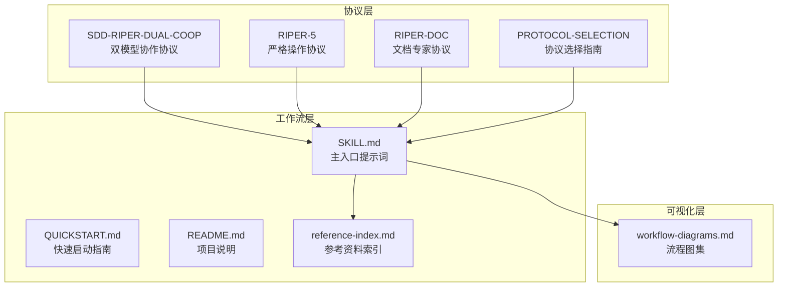
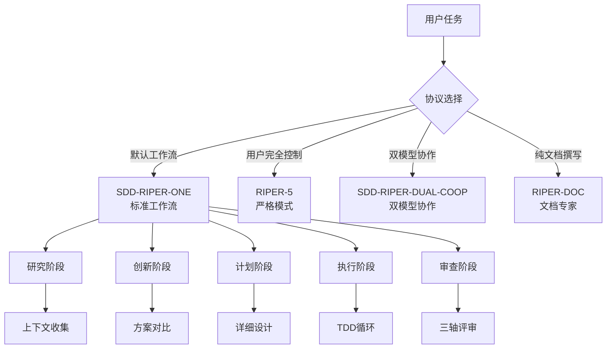
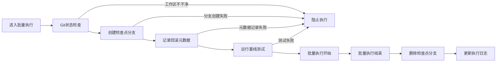
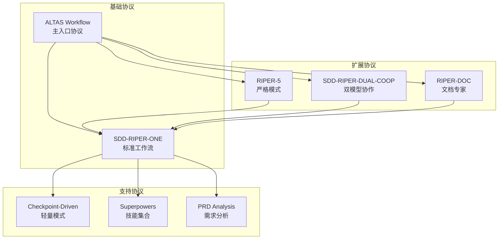

# Sdd Riper One Protocol

<cite>
**本文档引用的文件**
- [SDD-RIPER-DUAL-COOP.md](file://altas-workflow/protocols/SDD-RIPER-DUAL-COOP.md)
- [RIPER-5.md](file://altas-workflow/protocols/RIPER-5.md)
- [RIPER-DOC.md](file://altas-workflow/protocols/RIPER-DOC.md)
- [PROTOCOL-SELECTION.md](file://altas-workflow/protocols/PROTOCOL-SELECTION.md)
- [SKILL.md](file://altas-workflow/SKILL.md)
- [QUICKSTART.md](file://altas-workflow/QUICKSTART.md)
- [README.md](file://altas-workflow/README.md)
- [reference-index.md](file://altas-workflow/reference-index.md)
- [workflow-diagrams.md](file://altas-workflow/workflow-diagrams.md)
</cite>

## 目录
1. [简介](#简介)
2. [项目结构](#项目结构)
3. [核心组件](#核心组件)
4. [架构概览](#架构概览)
5. [详细组件分析](#详细组件分析)
6. [依赖关系分析](#依赖关系分析)
7. [性能考虑](#性能考虑)
8. [故障排除指南](#故障排除指南)
9. [结论](#结论)

## 简介

Sdd Riper One Protocol 是一个基于 Spec-Driven Development (SDD) 的工程化工作流程协议，旨在解决 AI 编程中的上下文腐烂、审查瘫痪、代码不信任和难以维护等四大工程痛点。该协议通过严格的阶段划分、检查点约束和证据驱动验证，确保代码质量和可维护性。

协议的核心理念包括：
- **Spec is Truth**: 代码是消耗品，Spec才是资产
- **No Approval, No Execute**: 审代码前置为审计划
- **Evidence First**: 完成由验证结果证明，非模型自宣布
- **No Fixes Without Root Cause**: 系统化调试，禁止盲改
- **TDD Iron Law**: M/L规模先写失败测试再写生产代码
- **Reverse Sync**: Bug先修Spec再修代码

## 项目结构

该项目采用模块化设计，包含多个层次的协议和参考文件：

**图表来源**
- [SDD-RIPER-DUAL-COOP.md:1-210](file://altas-workflow/protocols/SDD-RIPER-DUAL-COOP.md#L1-L210)
- [SKILL.md:1-543](file://altas-workflow/SKILL.md#L1-L543)
- [README.md:1-313](file://altas-workflow/README.md#L1-L313)

**章节来源**
- [README.md:74-93](file://altas-workflow/README.md#L74-L93)
- [reference-index.md:1-304](file://altas-workflow/reference-index.md#L1-L304)

## 核心组件

### 双模型协作协议 (SDD-RIPER-DUAL-COOP)

该协议定义了双模型协作环境下的角色分工和工作流程：

#### 角色定义

**外部模型 (架构师/指挥官)**
- 能力：人类级推理、策略制定、规范编写、大局观思考
- 局限：无法直接看到代码库，必须依赖内部模型的上下文报告
- 责任：分析上下文报告、维护规范文件、从不直接编写应用代码

**内部模型 (执行者/侦察兵)**
- 能力：高速编码、直接文件I/O、终端使用、上下文收集
- 局限：推理能力较弱，容易产生幻觉
- 责任：侦察阶段收集事实，执行阶段严格遵循规范

#### 核心法则

1. **单一真相源**: 聊天历史是短暂的，规范是持久的
2. **无规范无代码**: 在相关规范章节定义之前禁止编写应用代码
3. **基于事实的规划**: 规范必须建立在侦察阶段提供的真实文件路径和签名基础上
4. **即时持久化**: 生成或修改规范内容后必须立即保存

**章节来源**
- [SDD-RIPER-DUAL-COOP.md:5-30](file://altas-workflow/protocols/SDD-RIPER-DUAL-COOP.md#L5-L30)
- [SDD-RIPER-DUAL-COOP.md:32-40](file://altas-workflow/protocols/SDD-RIPER-DUAL-COOP.md#L32-L40)

### 严格操作协议 (RIPER-5)

RIPER-5协议提供了更加严格的控制机制：

#### 模式声明要求

每个响应都必须以当前模式声明开始，格式为 `[MODE: MODE_NAME]`，这是严格的操作要求。

#### 模式定义

协议包含五个严格定义的模式：

1. **研究模式 (RESEARCH)**: 仅限信息收集
2. **创新模式 (INNOVATE)**: 讨论潜在方案
3. **计划模式 (PLAN)**: 创建详尽的技术规范
4. **执行模式 (EXECUTE)**: 严格按计划实现
5. **审查模式 (REVIEW)**: 严格验证实现

**章节来源**
- [RIPER-5.md:15-25](file://altas-workflow/protocols/RIPER-5.md#L15-L25)
- [RIPER-5.md:25-125](file://altas-workflow/protocols/RIPER-5.md#L25-L125)

### 文档专家协议 (RIPER-DOC)

专门用于文档撰写的协议，包含四个有序的模式：

1. **吸收模式 (ABSORB)**: 提取上下文和技术细节
2. **大纲模式 (OUTLINE)**: 规划文档结构
3. **作者模式 (AUTHOR)**: 生成文档内容
4. **事实核查模式 (FACT-CHECK)**: 验证准确性

**章节来源**
- [RIPER-DOC.md:9-42](file://altas-workflow/protocols/RIPER-DOC.md#L9-L42)

## 架构概览

协议采用分层架构设计，通过协议选择机制实现灵活的工作流切换：

**图表来源**
- [PROTOCOL-SELECTION.md:3-17](file://altas-workflow/protocols/PROTOCOL-SELECTION.md#L3-L17)
- [workflow-diagrams.md:45-67](file://altas-workflow/workflow-diagrams.md#L45-L67)

**章节来源**
- [PROTOCOL-SELECTION.md:12-26](file://altas-workflow/protocols/PROTOCOL-SELECTION.md#L12-L26)
- [workflow-diagrams.md:1-338](file://altas-workflow/workflow-diagrams.md#L1-L338)

## 详细组件分析

### 规模评估机制

协议实现了智能的规模评估系统，根据复杂度、影响面和决策点自动选择适配的工作流深度：

| 规模 | 规模信号 | 规范要求 | 默认流转 |
|------|----------|----------|----------|
| **XS 极速** | typo、配置值、日志、小于 10 行 | 跳过，事后1行summary | 直接执行→验证→summary |
| **S 快速** | 1-2 文件、逻辑清晰、影响小 | micro-spec（1-3句） | micro-spec→批准→执行→回写 |
| **M 标准** | 3-10 文件、模块内、需要计划 | 轻量Spec落盘 | Research→Plan→Execute(TDD)→Review |
| **L 深度** | 跨模块、架构级、迁移、多项目 | 完整Spec+Innovate+Archive | Research→Innovate→Plan→Execute(TDD)→Subagent→Review→Archive |

#### 规模判定优先级

1. **影响面 > 文件数 > 代码行数**
2. 跨模块、公共接口、核心链路、数据模型变更至少按 `M`
3. 架构调整、多项目、迁移、重大性能改造默认按 `L`
4. 不确定时向上取整

**章节来源**
- [README.md:11-21](file://altas-workflow/README.md#L11-L21)
- [README.md:203-232](file://altas-workflow/README.md#L203-L232)

### 检查点契约

协议建立了严格的检查点机制，确保每个阶段都有明确的输出和验证：

#### 检查点触发时机

- 阶段转换时（Research → Plan → Execute → Review）
- M/L规模每完成一个Plan中的任务项
- 遇到异常、不确定性或解决不了的问题
- 用户要求查看进度
- 上下文将满需要Resume Ready

#### 检查点输出要求

| 规模 | 输出要求 |
|------|----------|
| **XS** | 1行summary：做了什么 + 如何验证 |
| **S** | 短checkpoint：当前理解/核心目标/下一步 |
| **M/L** | 完整检查点，逐步推进 |

**章节来源**
- [README.md:343-393](file://altas-workflow/README.md#L343-L393)

### 批量执行约束

协议对批量执行设置了严格的Git回滚约束：

**图表来源**
- [README.md:394-427](file://altas-workflow/README.md#L394-L427)

**章节来源**
- [README.md:394-427](file://altas-workflow/README.md#L394-L427)

## 依赖关系分析

协议之间存在清晰的依赖关系和选择机制：

**图表来源**
- [PROTOCOL-SELECTION.md:12-17](file://altas-workflow/protocols/PROTOCOL-SELECTION.md#L12-L17)
- [reference-index.md:192-223](file://altas-workflow/reference-index.md#L192-L223)

**章节来源**
- [PROTOCOL-SELECTION.md:12-17](file://altas-workflow/protocols/PROTOCOL-SELECTION.md#L12-L17)
- [reference-index.md:192-223](file://altas-workflow/reference-index.md#L192-L223)

## 性能考虑

协议在设计时充分考虑了性能优化：

### 渐进式披露机制

- Research只谈逻辑约束，Plan只谈接口签名与Checklist，Execute才写代码
- 复杂细节写入磁盘Spec，对话中只呈现摘要和高危风险
- 参考文档按需加载，不常驻上下文

### 并行执行支持

协议支持并行Agent派遣和子agent驱动开发，特别是在L规模任务中：

- 多独立故障并行派遣
- 子agent并行实现
- 两阶段Review机制

### 上下文管理

协议实现了Hot/Warm/Cold上下文装配层级：

- Hot每轮/phase/approval/Spec路径/Goal/Scope/Checklist
- Warm阶段切换/研究发现/Plan签名/验证结果
- Cold按需/完整ChangeLog/历史Research/CodeMap

**章节来源**
- [README.md:29-34](file://altas-workflow/README.md#L29-L34)
- [README.md:241-257](file://altas-workflow/README.md#L241-L257)

## 故障排除指南

### 常见使用错误

协议提供了完整的使用错误预防机制：

#### 红色警戒清单

| 红色警戒 | → **停止** | 铁律 |
|----------|------------|------|
| 规范未形成就写代码？ | 回到Research/Plan | #3 |
| 未获许可就执行？ | 等待确认或确认XS/FAST | #4 |
| 根因不明就改代码？ | 继续调试 | #7 |
| 不确定但假设而非澄清？ | 暂停并问用户 | #10 |
| "这次情况特殊可例外"？ | 无例外 | #1-#10 |
| 想跳过流程因为"时间紧"？ | 流程简化=后期返工 | #3,#6 |

#### 防绕过机制

协议包含8个红色警戒+10个借口中途反驳+10个使用错误的完整防绕过机制。

### 异常处理

协议提供了完善的异常处理和恢复机制：

- 遇到问题升级、不确定、需要退出或能力降级时，加载异常恢复文件
- 核心原则：不确定时暂停并找用户确认，禁止擅自决策或跳过
- 提供批量执行失败时的回滚选项

**章节来源**
- [README.md:96-110](file://altas-workflow/README.md#L96-L110)
- [README.md:519-531](file://altas-workflow/README.md#L519-L531)

## 结论

Sdd Riper One Protocol通过其严谨的设计和全面的功能，为AI工程化开发提供了一个可靠的框架。协议的核心优势包括：

1. **严格的约束机制**: 通过铁律和检查点确保代码质量
2. **灵活的工作流**: 支持多种协议模式，适应不同场景需求
3. **智能规模评估**: 自动选择适配的工作流深度
4. **完善的文档体系**: 从需求分析到知识沉淀的全流程覆盖
5. **强大的异常处理**: 提供完整的故障排除和恢复机制

该协议特别适合需要高质量代码输出和严格质量控制的工程场景，为团队协作和知识传承提供了坚实的基础。