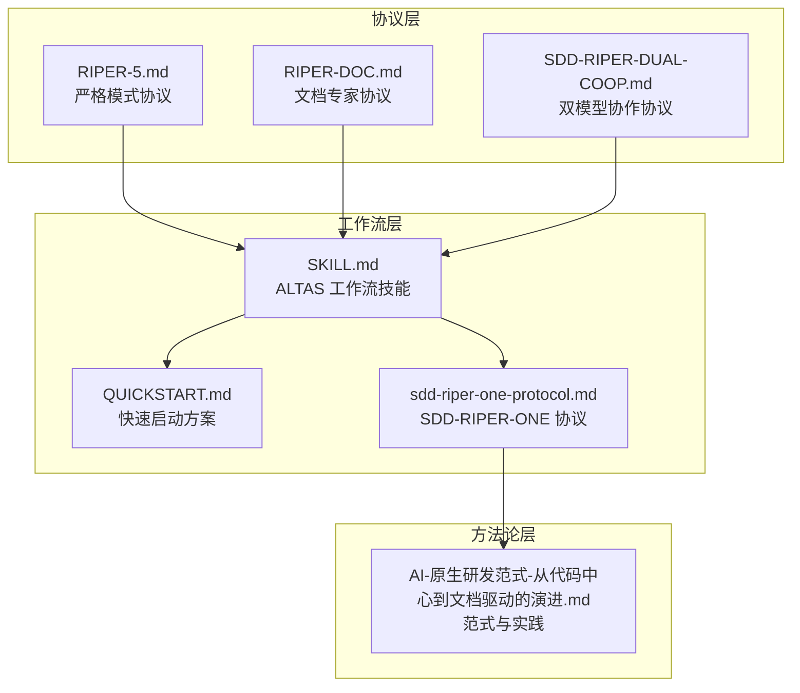
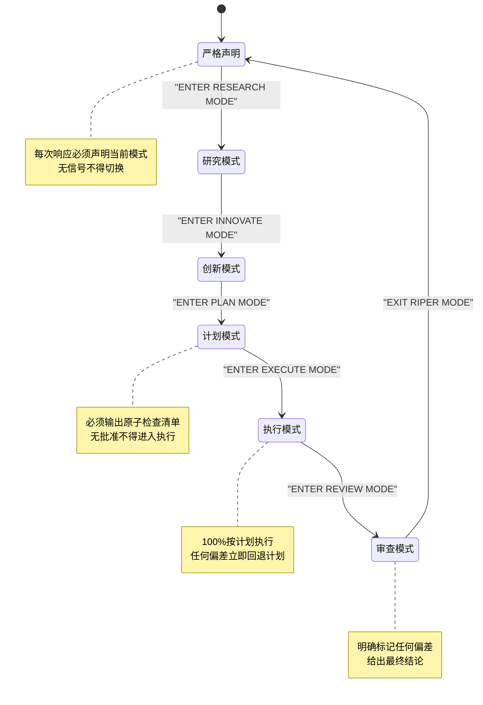
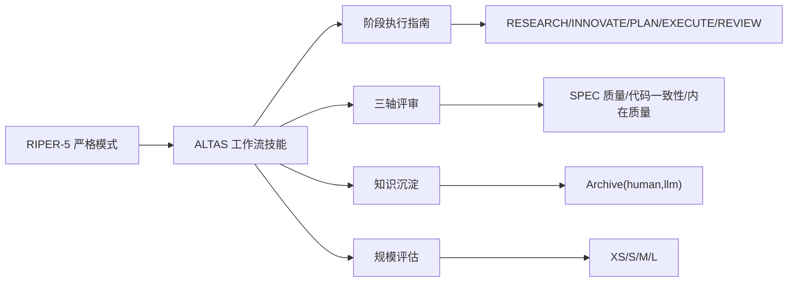

# RIPER-5 严格模式协议

<cite>
**本文引用的文件**
- [RIPER-5.md](file://altas-workflow/protocols/RIPER-5.md)
- [RIPER-DOC.md](file://altas-workflow/protocols/RIPER-DOC.md)
- [SDD-RIPER-DUAL-COOP.md](file://altas-workflow/protocols/SDD-RIPER-DUAL-COOP.md)
- [SKILL.md](file://altas-workflow/SKILL.md)
- [QUICKSTART.md](file://altas-workflow/QUICKSTART.md)
- [sdd-riper-one-protocol.md](file://altas-workflow/references/spec-driven-development/sdd-riper-one-protocol.md)
- [AI-原生研发范式-从代码中心到文档驱动的演进.md](file://altas-workflow/docs/AI-原生研发范式-从代码中心到文档驱动的演进.md)
</cite>

## 目录
1. [简介](#简介)
2. [项目结构](#项目结构)
3. [核心组件](#核心组件)
4. [架构总览](#架构总览)
5. [详细组件分析](#详细组件分析)
6. [依赖分析](#依赖分析)
7. [性能考虑](#性能考虑)
8. [故障排除指南](#故障排除指南)
9. [结论](#结论)
10. [附录](#附录)

## 简介
本文件系统化梳理并解读 RIPER-5 严格模式协议，围绕其五大严格模式（RESEARCH、INNOVATE、PLAN、EXECUTE、REVIEW）的设计理念、权限边界与执行要求展开，阐明模式间的转换条件与信号机制，给出高风险项目的应用范式、实施步骤与最佳实践，并提供模式切换指令格式、检查清单模板与偏差检测流程，帮助用户建立严谨、可审计、可复用的工程化协作范式。

## 项目结构
RIPER-5 协议位于工作流仓库的 protocols 子目录，配套有技能与快速入门文档、参考协议与方法论文档，形成“协议定义—工作流—方法论”的三层结构，便于在不同规模与复杂度的任务中灵活落地。

图表来源
- [RIPER-5.md:1-187](file://altas-workflow/protocols/RIPER-5.md#L1-L187)
- [RIPER-DOC.md:1-66](file://altas-workflow/protocols/RIPER-DOC.md#L1-L66)
- [SDD-RIPER-DUAL-COOP.md:1-210](file://altas-workflow/protocols/SDD-RIPER-DUAL-COOP.md#L1-L210)
- [SKILL.md:1-351](file://altas-workflow/SKILL.md#L1-L351)
- [QUICKSTART.md:1-182](file://altas-workflow/QUICKSTART.md#L1-L182)
- [sdd-riper-one-protocol.md:1-696](file://altas-workflow/references/spec-driven-development/sdd-riper-one-protocol.md#L1-L696)
- [AI-原生研发范式-从代码中心到文档驱动的演进.md:1-1165](file://altas-workflow/docs/AI-原生研发范式-从代码中心到文档驱动的演进.md#L1-L1165)

章节来源
- [RIPER-5.md:1-187](file://altas-workflow/protocols/RIPER-5.md#L1-L187)
- [SKILL.md:1-351](file://altas-workflow/SKILL.md#L1-L351)
- [QUICKSTART.md:1-182](file://altas-workflow/QUICKSTART.md#L1-L182)

## 核心组件
- 严格模式声明与元指令
  - 每次响应必须以“当前模式”开头，未声明即视为严重违规。
  - 模式切换必须经由明确信号触发，否则维持现状。
- 五大模式职责与边界
  - RESEARCH：仅限信息收集与理解，禁止任何行动建议。
  - INNOVATE：仅限可能性探讨，禁止具体计划与实现细节。
  - PLAN：制定详尽技术规范与原子检查清单，禁止代码实现。
  - EXECUTE：严格按计划执行，不得偏离；发现偏差立即回退 PLAN。
  - REVIEW：逐项比对计划与实现，明确标记任何偏差并给出结论。
- 关键约束与违规处理
  - 无许可不得跨模式；无批准不得执行；无证据不得变更；偏差必须先修规范再修代码。
  - 任何违反协议的行为将导致灾难性后果，必须严格遵守。

章节来源
- [RIPER-5.md:15-187](file://altas-workflow/protocols/RIPER-5.md#L15-L187)

## 架构总览
RIPER-5 严格模式协议以“模式声明—模式执行—模式评审—模式转换”为主线，结合 ALTAS 工作流的“规模评估—阶段执行—三轴评审—知识沉淀”体系，形成从需求到交付的闭环工程范式。

图表来源
- [RIPER-5.md:144-187](file://altas-workflow/protocols/RIPER-5.md#L144-L187)

## 详细组件分析

### 模式一：RESEARCH（研究）
- 功能定位
  - 仅限信息收集与理解，不得提出建议或行动。
- 权限边界
  - 允许：读取文件、提问澄清、理解代码结构。
  - 禁止：任何实现、规划或“可能”的表述。
- 执行要求
  - 输出格式：以“当前模式”开头，随后仅输出观察与问题。
  - 持续时间：直至明确信号进入下一模式。
- 输出规范
  - 以“当前模式”开头，随后为观察与问题集合。

章节来源
- [RIPER-5.md:27-42](file://altas-workflow/protocols/RIPER-5.md#L27-L42)

### 模式二：INNOVATE（创新）
- 功能定位
  - 探索多种可能的解决方案，进行优劣对比。
- 权限边界
  - 允许：讨论想法、优缺点、寻求反馈。
  - 禁止：具体计划、实现细节、代码示例。
- 执行要求
  - 输出格式：以“当前模式”开头，随后为可能性与考量。
  - 持续时间：直至明确信号进入下一模式。
- 输出规范
  - 以“当前模式”开头，随后为可能性与考量。

章节来源
- [RIPER-5.md:43-58](file://altas-workflow/protocols/RIPER-5.md#L43-L58)

### 模式三：PLAN（计划）
- 功能定位
  - 创建详尽的技术规范与原子检查清单，确保实现阶段无需创造性决策。
- 权限边界
  - 允许：详述文件路径、函数/类签名、变更细节。
  - 禁止：任何代码实现，包括示例代码。
- 执行要求
  - 必须输出“原子检查清单”，每项为可独立执行的最小动作。
  - 必须在进入执行前获得明确批准。
- 输出规范
  - 以“当前模式”开头，随后为规范与实现细节。
  - 检查清单模板：编号、逐项、可执行、可验证。

章节来源
- [RIPER-5.md:59-87](file://altas-workflow/protocols/RIPER-5.md#L59-L87)

### 模式四：EXECUTE（执行）
- 功能定位
  - 严格按计划执行，不得偏离。
- 权限边界
  - 允许：实现计划中明确的每一项。
  - 禁止：任何未在计划中出现的变更、改进或创意添加。
- 执行要求
  - 仅在收到明确“进入执行模式”信号后方可进入。
  - 任何偏差必须立即回退至 PLAN。
- 输出规范
  - 以“当前模式”开头，随后为与计划一致的实现。
- 偏差处理
  - 发现偏差：立即回退 PLAN，修正后再批准进入执行。

章节来源
- [RIPER-5.md:88-103](file://altas-workflow/protocols/RIPER-5.md#L88-L103)

### 模式五：REVIEW（审查）
- 功能定位
  - 对实现与计划进行逐项比对与验证。
- 权限边界
  - 允许：逐行对比、行为一致性验证。
  - 要求：必须明确标记任何偏差，无论多小。
- 执行要求
  - 必须明确报告实现是否与计划完全一致。
  - 必须给出结论格式：完全一致或存在偏差。
- 输出规范
  - 以“当前模式”开头，随后为系统化对比与明确结论。

章节来源
- [RIPER-5.md:104-125](file://altas-workflow/protocols/RIPER-5.md#L104-L125)

### 模式间转换与信号机制
- 转换条件
  - 仅在收到明确信号时方可切换，否则维持现状。
- 转换信号
  - “ENTER RESEARCH MODE”
  - “ENTER INNOVATE MODE”
  - “ENTER PLAN MODE”
  - “ENTER EXECUTE MODE”
  - “ENTER REVIEW MODE”
- 退出机制
  - “EXIT RIPER MODE”或“EXIT MODE”：退出严格模式，回到普通对话。

章节来源
- [RIPER-5.md:144-175](file://altas-workflow/protocols/RIPER-5.md#L144-L175)

### 检查清单模板与偏差检测流程
- 检查清单模板
  - 以编号形式列出原子动作，每项可独立验证。
- 偏差检测流程
  - 执行中发现偏差：立即回退 PLAN，修正后再批准执行。
  - 审查阶段：明确标记偏差并给出结论。

章节来源
- [RIPER-5.md:73-82](file://altas-workflow/protocols/RIPER-5.md#L73-L82)
- [RIPER-5.md:100-117](file://altas-workflow/protocols/RIPER-5.md#L100-L117)

### 高风险项目应用场景与最佳实践
- 应用场景
  - 架构级重构、跨模块变更、安全敏感功能、大规模并行开发。
- 最佳实践
  - 先研究再创新，再计划，再执行，最后审查。
  - 严格遵循“无批准不执行、无证据不变更、偏差先修规范再修代码”。

章节来源
- [QUICKSTART.md:52-116](file://altas-workflow/QUICKSTART.md#L52-L116)
- [AI-原生研发范式-从代码中心到文档驱动的演进.md:184-356](file://altas-workflow/docs/AI-原生研发范式-从代码中心到文档驱动的演进.md#L184-L356)

## 依赖分析
RIPER-5 严格模式协议与 ALTAS 工作流技能紧密耦合，后者提供规模评估、阶段执行、三轴评审与知识沉淀等机制，前者提供严格的模式声明与执行边界，二者协同确保从需求到交付的可审计与可复用。

图表来源
- [SKILL.md:138-275](file://altas-workflow/SKILL.md#L138-L275)
- [RIPER-5.md:128-187](file://altas-workflow/protocols/RIPER-5.md#L128-L187)

章节来源
- [SKILL.md:138-275](file://altas-workflow/SKILL.md#L138-L275)
- [RIPER-5.md:128-187](file://altas-workflow/protocols/RIPER-5.md#L128-L187)

## 性能考虑
- 严格模式带来的“慢”是纪律与门禁的成本，换取的是可审计、可复用与可维护的工程能力。
- 在 XS/S 规模下，可通过“极速通道”跳过研究与计划，但仍需在事后同步规范，确保长期可维护性。
- 在 M/L 规模下，建议采用“逐步执行 + 检查点 + 三轴评审”，以降低缺陷率与返工成本。

章节来源
- [SKILL.md:176-193](file://altas-workflow/SKILL.md#L176-L193)
- [QUICKSTART.md:119-152](file://altas-workflow/QUICKSTART.md#L119-L152)

## 故障排除指南
- 常见问题
  - AI 一次性输出过多代码：ALTAS 内置检查点机制，必须在每步完成后暂停等待确认。
  - 为什么总是先写测试：证据优先原则，无失败测试不写生产代码。
  - 如何中途干预计划：在检查点回复“[修改] 请不要使用Redis，改为内存缓存”，AI 将根据反馈调整计划并重新请求批准。
- 偏差处理
  - 执行中发现偏差：立即回退 PLAN，修正后再批准执行。
  - 审查阶段发现偏差：明确标记并给出结论，必要时回退至 PLAN。
- 退出与重入
  - 使用“EXIT RIPER MODE”退出严格模式，使用任意模式进入信号重新启用。

章节来源
- [QUICKSTART.md:119-152](file://altas-workflow/QUICKSTART.md#L119-L152)
- [RIPER-5.md:164-187](file://altas-workflow/protocols/RIPER-5.md#L164-L187)

## 结论
RIPER-5 严格模式协议通过“模式声明—模式执行—模式评审—模式转换”的闭环，将 AI 的“创造性”与“可执行性”分离，确保在高风险与复杂场景下实现可审计、可复用与可维护的工程交付。配合 ALTAS 工作流的规模评估、阶段执行与三轴评审，可有效降低缺陷率、提高协作效率，并沉淀为组织级知识资产。

## 附录

### 模式切换指令格式
- 进入研究：ENTER RESEARCH MODE
- 进入创新：ENTER INNOVATE MODE
- 进入计划：ENTER PLAN MODE
- 进入执行：ENTER EXECUTE MODE
- 进入审查：ENTER REVIEW MODE
- 退出模式：EXIT RIPER MODE 或 EXIT MODE

章节来源
- [RIPER-5.md:144-187](file://altas-workflow/protocols/RIPER-5.md#L144-L187)

### 检查清单标准模板
- 以编号列出原子动作，每项可独立验证与回滚。
- 示例模板路径：[RIPER-5.md:73-82](file://altas-workflow/protocols/RIPER-5.md#L73-L82)

章节来源
- [RIPER-5.md:73-82](file://altas-workflow/protocols/RIPER-5.md#L73-L82)

### 偏差检测与处理流程
- 执行中偏差：立即回退 PLAN，修正后再批准执行。
- 审查阶段偏差：明确标记并给出结论，必要时回退至 PLAN。
- 参考路径：[RIPER-5.md:100-117](file://altas-workflow/protocols/RIPER-5.md#L100-L117)

章节来源
- [RIPER-5.md:100-117](file://altas-workflow/protocols/RIPER-5.md#L100-L117)

### 协议遵循指南
- 每次响应必须声明当前模式。
- 无信号不得切换模式。
- 无批准不得执行。
- 无证据不得变更。
- 偏差必须先修规范再修代码。

章节来源
- [RIPER-5.md:128-141](file://altas-workflow/protocols/RIPER-5.md#L128-L141)