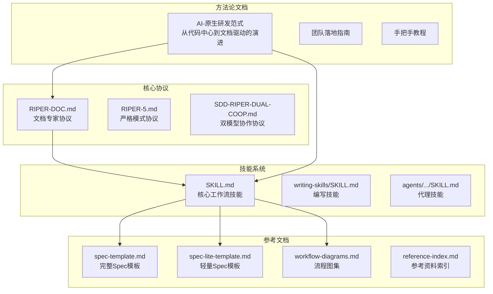
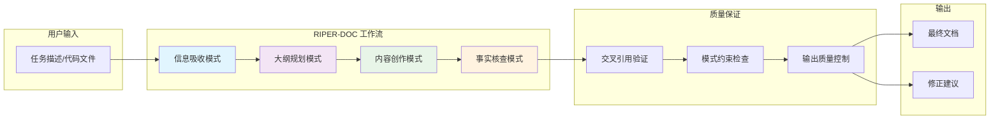
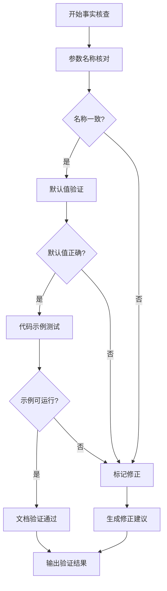
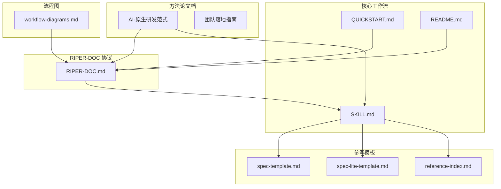
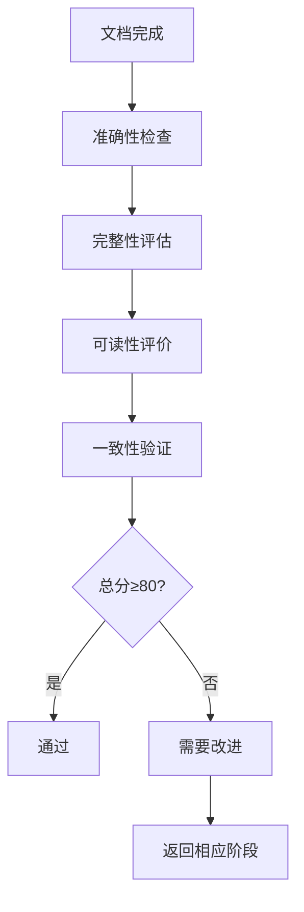

# RIPER-DOC 文档专家协议

<cite>
**本文引用的文件**
- [RIPER-DOC.md](file://altas-workflow/protocols/RIPER-DOC.md)
- [SKILL.md](file://altas-workflow/SKILL.md)
- [reference-index.md](file://altas-workflow/reference-index.md)
- [workflow-diagrams.md](file://altas-workflow/workflow-diagrams.md)
- [README.md](file://altas-workflow/README.md)
- [QUICKSTART.md](file://altas-workflow/QUICKSTART.md)
- [AI-原生研发范式-从代码中心到文档驱动的演进.md](file://altas-workflow/docs/AI-原生研发范式-从代码中心到文档驱动的演进.md)
- [spec-template.md](file://altas-workflow/references/spec-driven-development/spec-template.md)
- [spec-lite-template.md](file://altas-workflow/references/checkpoint-driven/spec-lite-template.md)
</cite>

## 目录
1. [简介](#简介)
2. [项目结构](#项目结构)
3. [核心组件](#核心组件)
4. [架构总览](#架构总览)
5. [详细组件分析](#详细组件分析)
6. [依赖分析](#依赖分析)
7. [性能考虑](#性能考虑)
8. [故障排除指南](#故障排除指南)
9. [结论](#结论)
10. [附录](#附录)

## 简介

RIPER-DOC 是 ALTAS Workflow 中专门针对文档撰写的专家协议，旨在将代码逻辑转化为清晰、可读性强的技术文档。该协议通过标准化的四阶段工作流程，确保文档的质量、准确性和可追溯性。

协议的核心理念是"文档即协议"，将 Markdown 作为人与 AI 之间的中间语言，既是人类可读的文档，也是机器可执行的指令。通过严格的模式划分和质量控制机制，RIPER-DOC 为 AI 原生研发范式的落地提供了坚实的文档基础。

## 项目结构

ALTAS Workflow 采用模块化设计，将不同的工作流模式和技能分别组织在相应的目录中：



**图表来源**
- [README.md:1-133](file://altas-workflow/README.md#L1-L133)
- [reference-index.md:1-210](file://altas-workflow/reference-index.md#L1-L210)

**章节来源**
- [README.md:1-133](file://altas-workflow/README.md#L1-L133)
- [reference-index.md:1-210](file://altas-workflow/reference-index.md#L1-L210)

## 核心组件

### 文档专家协议的四大模式

RIPER-DOC 协议定义了四个相互关联的文档撰写模式，每个模式都有明确的目标、约束和输出要求：

#### 模式1：信息吸收 (Absorb)
- **目标**：从代码文件中提取上下文信息
- **动作**：阅读代码文件以理解参数、返回类型和逻辑流程
- **输出**：技术细节摘要（输入/输出/边界情况），不生成正文
- **约束**：不得猜测代码实现，必须验证事实

#### 模式2：大纲规划 (Outline)
- **目标**：制定文档结构
- **动作**：为文档提出目录结构（H1、H2、H3）
- **约束**：确保结构符合项目的现有文档风格
- **输出**：完整的文档大纲

#### 模式3：内容创作 (Author)
- **目标**：生成实际文档内容
- **动作**：使用 Markdown/LaTeX 编写文档
- **约束**：使用在 Absorb 模式中收集的技术细节
- **风格**：清晰、简洁、专业

#### 模式4：事实核查 (Fact-Check)
- **目标**：验证准确性
- **动作**：将生成的文本与实际代码交叉引用
- **检查清单**：
  1. 参数名称是否与代码完全相同
  2. 默认值是否准确
  3. 代码示例是否可运行
- **输出**：`✅ DOCS VERIFIED` 或 `⚠️ CORRECTION MADE`

**章节来源**
- [RIPER-DOC.md:1-66](file://altas-workflow/protocols/RIPER-DOC.md#L1-L66)

### 协议约束与纪律

RIPER-DOC 协议建立了严格的约束机制，确保文档质量：

- **模式声明**：每次响应必须以当前模式格式开头
- **事实优先**：不得猜测代码实现，必须基于实际代码验证
- **交叉引用**：每个细节都必须对照实际代码验证
- **质量标准**：文档必须准确、完整、可追溯

**章节来源**
- [RIPER-DOC.md:5-66](file://altas-workflow/protocols/RIPER-DOC.md#L5-L66)

## 架构总览

RIPER-DOC 协议在整个 ALTAS Workflow 体系中扮演着文档专家的角色，与其他工作流模式协同工作：



**图表来源**
- [RIPER-DOC.md:9-66](file://altas-workflow/protocols/RIPER-DOC.md#L9-L66)
- [SKILL.md:249-256](file://altas-workflow/SKILL.md#L249-L256)

## 详细组件分析

### 信息吸收模式 (Absorb)

信息吸收是文档撰写的基础阶段，要求文档专家深入理解代码逻辑：

#### 核心职责
- **代码分析**：仔细阅读代码文件，理解函数签名、参数类型、返回值
- **逻辑提取**：识别算法流程、控制结构、异常处理
- **边界识别**：标注输入输出边界、性能限制、安全考虑
- **事实记录**：收集可验证的技术细节，避免主观臆测

#### 输出规范
- 技术摘要必须基于实际代码
- 包含完整的输入输出规范
- 标注所有重要的边界条件
- 提供可验证的实现细节

**章节来源**
- [RIPER-DOC.md:11-20](file://altas-workflow/protocols/RIPER-DOC.md#L11-L20)

### 大纲规划模式 (Outline)

大纲规划阶段将技术细节转化为结构化的文档框架：

#### 结构设计原则
- **层次清晰**：H1-H3 的层级关系明确
- **逻辑连贯**：章节顺序符合读者认知习惯
- **内容完整**：涵盖所有重要技术要点
- **风格统一**：与项目现有文档保持一致

#### 规划要素
- **章节标题**：准确反映内容主题
- **子章节安排**：合理分解复杂概念
- **交叉引用**：建立章节间的逻辑联系
- **可扩展性**：为后续内容留有空间

**章节来源**
- [RIPER-DOC.md:21-30](file://altas-workflow/protocols/RIPER-DOC.md#L21-L30)

### 内容创作模式 (Author)

内容创作是将技术细节转化为可读文档的过程：

#### 写作规范
- **清晰表达**：使用简洁明了的语言
- **逻辑结构**：遵循适当的叙述顺序
- **技术准确性**：确保所有技术陈述正确
- **实用导向**：关注读者的实际需求

#### 内容组织
- **引言部分**：概述文档目的和范围
- **主体内容**：详细阐述技术实现
- **示例说明**：提供具体的使用示例
- **总结回顾**：提炼关键要点

**章节来源**
- [RIPER-DOC.md:31-42](file://altas-workflow/protocols/RIPER-DOC.md#L31-L42)

### 事实核查模式 (Fact-Check)

事实核查确保文档与实际代码的一致性：

#### 验证流程


**图表来源**
- [RIPER-DOC.md:43-66](file://altas-workflow/protocols/RIPER-DOC.md#L43-L66)

#### 质量标准
- **完整性**：所有技术细节都得到验证
- **准确性**：参数、类型、默认值完全正确
- **可执行性**：示例代码能够正常运行
- **一致性**：文档与代码保持同步

**章节来源**
- [RIPER-DOC.md:43-66](file://altas-workflow/protocols/RIPER-DOC.md#L43-L66)

## 依赖分析

RIPER-DOC 协议与 ALTAS Workflow 的其他组件存在密切的依赖关系：



**图表来源**
- [SKILL.md:278-300](file://altas-workflow/SKILL.md#L278-L300)
- [reference-index.md:109-173](file://altas-workflow/reference-index.md#L109-L173)

### 依赖关系详解

#### 与核心工作流的集成
- **触发机制**：通过 `DOC` 触发词激活文档专家模式
- **工作流衔接**：与 ALTAS 的其他模式无缝集成
- **资源访问**：可按需访问相关参考文档和模板

#### 与参考模板的配合
- **Spec 模板**：为复杂文档提供结构化框架
- **轻量模板**：适用于简单文档的快速撰写
- **命名约定**：确保文档产物的一致性

#### 与方法论的呼应
- **文档驱动理念**：与 AI 原生研发范式保持一致
- **质量标准**：遵循相同的质量控制原则
- **最佳实践**：体现团队的文档编写经验

**章节来源**
- [SKILL.md:249-256](file://altas-workflow/SKILL.md#L249-L256)
- [reference-index.md:101-106](file://altas-workflow/reference-index.md#L101-L106)

## 性能考虑

RIPER-DOC 协议在设计时充分考虑了性能和效率因素：

### 时间效率优化
- **阶段化处理**：将复杂任务分解为四个独立阶段
- **渐进式验证**：每个阶段都有明确的输出和检查点
- **并行可能性**：不同阶段可以在不同时间点进行

### 资源利用优化
- **按需加载**：只在需要时访问相关参考文档
- **增量更新**：支持文档的部分更新和修订
- **缓存机制**：利用项目现有的文档结构和模板

### 质量保证机制
- **交叉验证**：通过多阶段验证确保准确性
- **约束检查**：严格的模式和输出约束
- **回溯能力**：支持文档的版本管理和变更追踪

## 故障排除指南

### 常见问题及解决方案

#### 问题1：文档与代码不一致
**症状**：事实核查阶段发现参数名称或默认值错误
**解决方案**：
- 重新执行信息吸收阶段
- 仔细核对代码实现细节
- 更新相关文档段落

#### 问题2：大纲结构不合理
**症状**：大纲规划阶段发现章节组织不当
**解决方案**：
- 重新分析代码逻辑
- 调整章节层级关系
- 优化内容组织方式

#### 问题3：内容质量不达标
**症状**：内容创作阶段发现表达不清或技术错误
**解决方案**：
- 返回信息吸收阶段补充细节
- 参考相关模板和最佳实践
- 进行多轮修订和完善

### 质量评估指标

#### 文档质量评分标准
- **准确性**：技术细节的正确性 (权重：40%)
- **完整性**：内容覆盖的全面性 (权重：25%)
- **可读性**：表达的清晰度 (权重：20%)
- **一致性**：与代码和上下文的匹配度 (权重：15%)

#### 评估流程


**章节来源**
- [RIPER-DOC.md:43-66](file://altas-workflow/protocols/RIPER-DOC.md#L43-L66)

## 结论

RIPER-DOC 文档专家协议为 AI 原生研发范式的落地提供了系统化的文档解决方案。通过标准化的四阶段工作流程，该协议确保了文档的质量、准确性和可追溯性。

协议的核心价值体现在：

1. **规范化流程**：通过明确的阶段划分和约束机制，确保文档质量
2. **质量保证**：多阶段验证和交叉引用机制，最大限度减少错误
3. **效率提升**：阶段化处理和渐进式验证，提高文档撰写效率
4. **团队协作**：统一的文档标准和模板，促进团队知识共享

随着 ALTAS Workflow 的不断发展，RIPER-DOC 协议将继续演进，为团队提供更加完善的技术文档解决方案。

## 附录

### 适用场景

#### 代码文档
- API 接口文档
- 函数和类的详细说明
- 算法实现的技术说明

#### 项目文档
- 架构设计文档
- 开发指南和最佳实践
- 测试和部署说明

#### 知识管理
- 技术决策记录
- 项目经验总结
- 团队知识沉淀

### 模板格式

#### 标准文档模板
```markdown
# 文档标题

## 概述
简要说明文档的目的和范围

## 技术细节
详细描述实现原理和技术要点

## 使用示例
提供具体的使用示例和代码片段

## 注意事项
列出重要的注意事项和限制条件
```

#### 专题文档模板
```markdown
# 专题标题

## 背景介绍
说明专题的背景和重要性

## 核心内容
详细阐述专题的主要内容

## 实践应用
提供实际应用场景和案例

## 总结展望
总结要点并展望未来发展
```

### 审核标准

#### 技术准确性审核
- 代码实现与文档描述的一致性
- 技术参数和配置的正确性
- 示例代码的可运行性

#### 内容完整性审核
- 文档覆盖范围的完整性
- 关键信息的准确性
- 逻辑结构的合理性

#### 表达质量审核
- 语言表达的清晰度
- 术语使用的规范性
- 格式排版的美观性

**章节来源**
- [AI-原生研发范式-从代码中心到文档驱动的演进.md:400-586](file://altas-workflow/docs/AI-原生研发范式-从代码中心到文档驱动的演进.md#L400-L586)