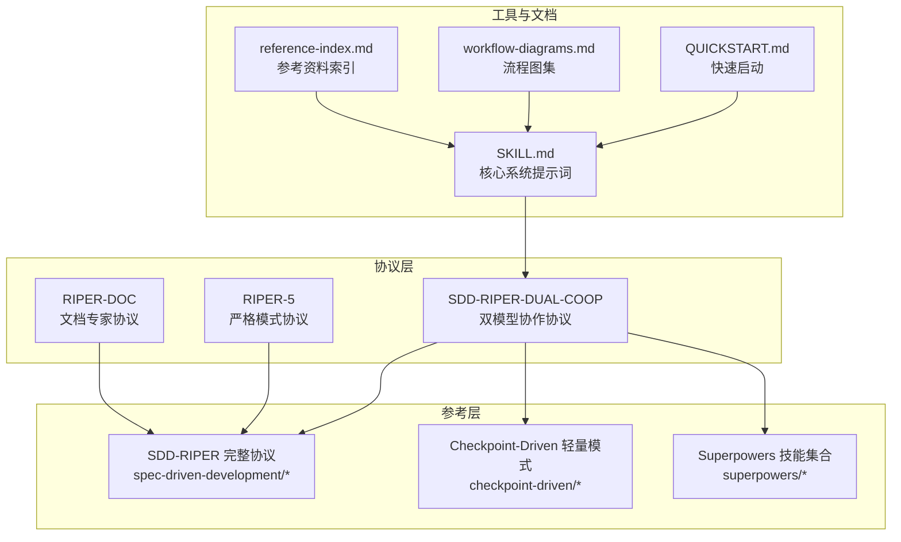
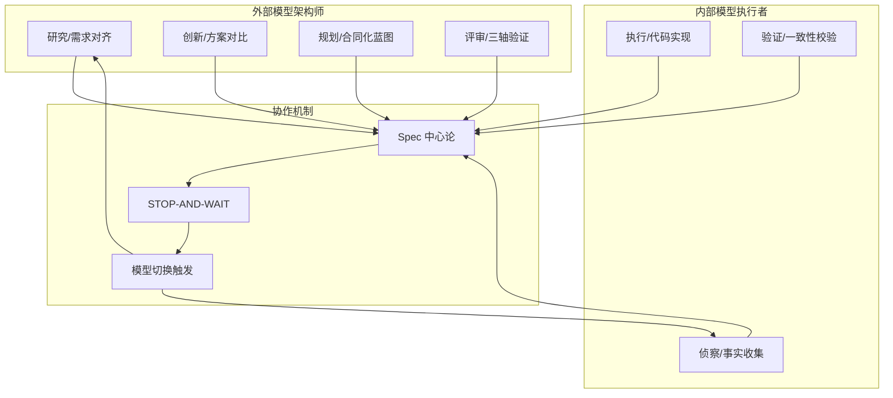
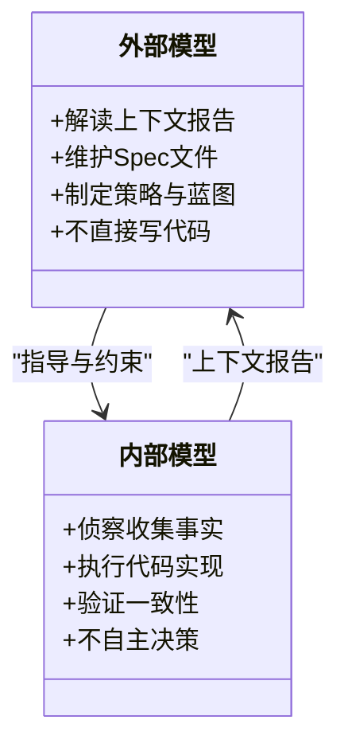
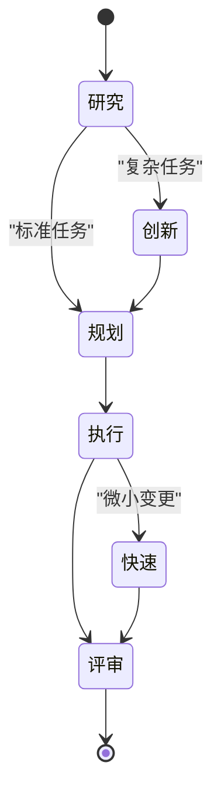
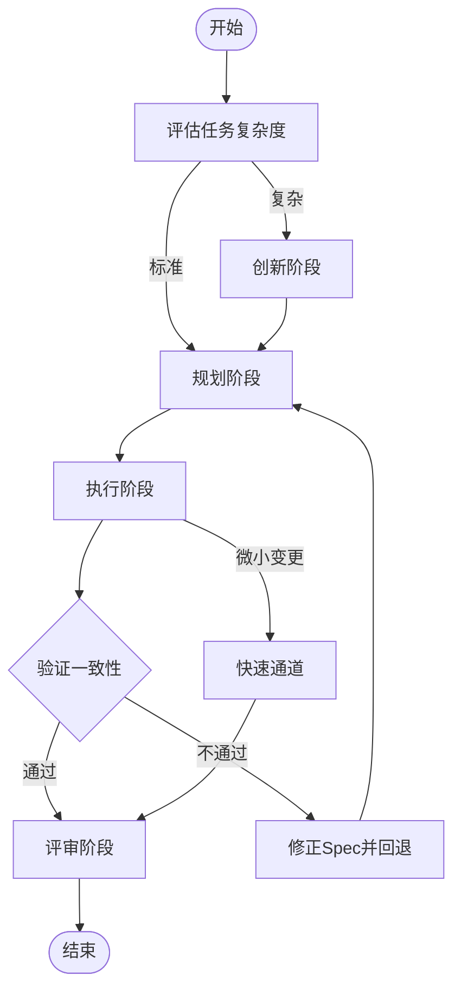
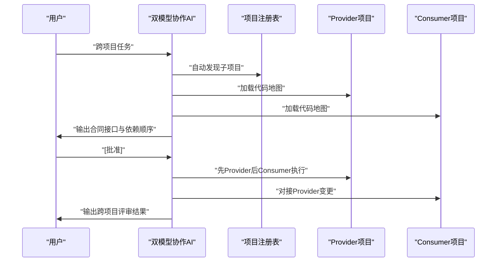
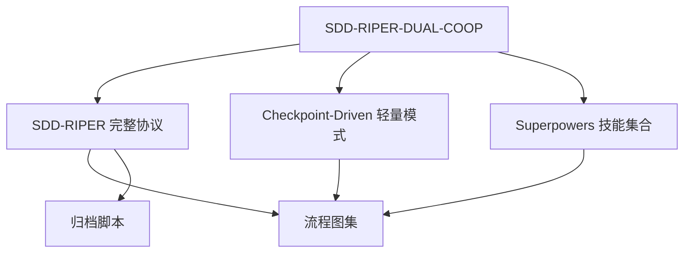

# SDD-RIPER-DUAL-COOP 双模型协作协议

<cite>
**本文引用的文件**
- [SDD-RIPER-DUAL-COOP.md](file://altas-workflow/protocols/SDD-RIPER-DUAL-COOP.md)
- [RIPER-5.md](file://altas-workflow/protocols/RIPER-5.md)
- [RIPER-DOC.md](file://altas-workflow/protocols/RIPER-DOC.md)
- [sdd-riper-one-protocol.md](file://altas-workflow/references/spec-driven-development/sdd-riper-one-protocol.md)
- [spec-template.md](file://altas-workflow/references/spec-driven-development/spec-template.md)
- [modules.md](file://altas-workflow/references/checkpoint-driven/modules.md)
- [systematic-debugging/SKILL.md](file://altas-workflow/references/superpowers/systematic-debugging/SKILL.md)
- [SKILL.md](file://altas-workflow/SKILL.md)
- [QUICKSTART.md](file://altas-workflow/QUICKSTART.md)
- [workflow-diagrams.md](file://altas-workflow/workflow-diagrams.md)
- [reference-index.md](file://altas-workflow/reference-index.md)
- [README.md](file://altas-workflow/README.md)
</cite>

## 目录
1. [简介](#简介)
2. [项目结构](#项目结构)
3. [核心组件](#核心组件)
4. [架构总览](#架构总览)
5. [详细组件分析](#详细组件分析)
6. [依赖关系分析](#依赖关系分析)
7. [性能考量](#性能考量)
8. [故障排除指南](#故障排除指南)
9. [结论](#结论)
10. [附录](#附录)

## 简介
本文件系统性阐述 SDD-RIPER-DUAL-COOP 双模型协作协议，深入解析规范驱动开发（SDD）与 RIPER 工作流的协同机制，阐明两种模型的优势互补与整合策略。协议以“外部架构师-内部执行者”的双角色分工为核心，结合严格的 Spec 中心论、STOP-AND-WAIT 协作机制与模型切换触发条件，形成可扩展、可审计、可复用的工程化协作范式。文档同时提供复杂项目的协作模式、资源分配方案、风险管理措施、性能优化建议、监控指标与调试方法，并给出部署指南、团队协作规范与效果评估标准。

## 项目结构
该仓库围绕 ALTAS Workflow 提供了三大来源的知识体系与协议：
- SDD-RIPER（规范驱动与 RIPER 状态机）
- SDD-RIPER-Optimized（Checkpoint-Driven 轻量模式）
- Superpowers（TDD、系统化调试、Subagent 并行）

协议与参考文件的组织结构如下：
- protocols/：专用协议（严格模式、双模型协作、文档专家）
- references/：按需加载的参考资料（SDD-RIPER、Checkpoint-Driven、Superpowers）
- docs/：方法论文档（范式转换、团队落地、入门教程）
- scripts/：自动化工具（归档构建器）
- SKILL.md：核心系统提示词（供 AI 读取）
- QUICKSTART.md：快速启动与典型场景
- workflow-diagrams.md：流程图集
- reference-index.md：参考资料索引

**图表来源**
- [SDD-RIPER-DUAL-COOP.md:1-210](file://altas-workflow/protocols/SDD-RIPER-DUAL-COOP.md#L1-L210)
- [RIPER-5.md:1-187](file://altas-workflow/protocols/RIPER-5.md#L1-L187)
- [RIPER-DOC.md:1-66](file://altas-workflow/protocols/RIPER-DOC.md#L1-L66)
- [sdd-riper-one-protocol.md:1-696](file://altas-workflow/references/spec-driven-development/sdd-riper-one-protocol.md#L1-L696)
- [modules.md:1-57](file://altas-workflow/references/checkpoint-driven/modules.md#L1-L57)
- [systematic-debugging/SKILL.md:1-297](file://altas-workflow/references/superpowers/systematic-debugging/SKILL.md#L1-L297)
- [SKILL.md:1-351](file://altas-workflow/SKILL.md#L1-L351)
- [QUICKSTART.md:1-182](file://altas-workflow/QUICKSTART.md#L1-L182)
- [workflow-diagrams.md:1-338](file://altas-workflow/workflow-diagrams.md#L1-L338)
- [reference-index.md:1-210](file://altas-workflow/reference-index.md#L1-L210)

**章节来源**
- [README.md:1-133](file://altas-workflow/README.md#L1-L133)
- [reference-index.md:1-210](file://altas-workflow/reference-index.md#L1-L210)

## 核心组件
- 双角色模型
  - 外部模型（架构师/指挥官）：负责需求解读、Spec 维护、策略制定与评审，不直接写代码。
  - 内部模型（执行者/侦察兵）：负责文件探索、事实收集、代码实现与即时验证。
- 核心定律：Spec 中心宇宙（Spec 是唯一真相源，无 Spec 不写代码，逆向同步，持久化保存）。
- 语言内核：强制中文沟通，确保工程表达的专业性与一致性。
- 元指令：强制输出角色/模式/状态/文档路径头，便于协作追踪与审计。
- RIPER 状态机：Research/Innovate/Plan/Execute/Review/Fast 六阶段自适应流转。
- STOP-AND-WAIT 协作协议：行动→持久化→展示→阻塞检查→等待指令，确保每步可反馈、可回溯。

**章节来源**
- [SDD-RIPER-DUAL-COOP.md:11-74](file://altas-workflow/protocols/SDD-RIPER-DUAL-COOP.md#L11-L74)
- [SDD-RIPER-DUAL-COOP.md:32-49](file://altas-workflow/protocols/SDD-RIPER-DUAL-COOP.md#L32-L49)
- [SDD-RIPER-DUAL-COOP.md:53-74](file://altas-workflow/protocols/SDD-RIPER-DUAL-COOP.md#L53-L74)
- [SDD-RIPER-DUAL-COOP.md:76-154](file://altas-workflow/protocols/SDD-RIPER-DUAL-COOP.md#L76-L154)
- [SDD-RIPER-DUAL-COOP.md:192-198](file://altas-workflow/protocols/SDD-RIPER-DUAL-COOP.md#L192-L198)

## 架构总览
双模型协作架构以“外部架构师-内部执行者”为双引擎，结合 SDD 的 Spec 中心论与 RIPER 的严格状态机，形成“研究-创新-规划-执行-评审-快速通道”的闭环。协议通过强制元指令与 STOP-AND-WAIT，确保协作过程可追踪、可审计、可回滚。

**图表来源**
- [SDD-RIPER-DUAL-COOP.md:76-154](file://altas-workflow/protocols/SDD-RIPER-DUAL-COOP.md#L76-L154)
- [sdd-riper-one-protocol.md:17-42](file://altas-workflow/references/spec-driven-development/sdd-riper-one-protocol.md#L17-L42)

## 详细组件分析

### 组件A：双角色分工与信任边界
- 外部模型职责
  - 解读上下文报告，维护 Spec 文件，制定策略与蓝图，不直接写代码。
  - 保持“大图思维”，避免陷入技术细节与代码实现陷阱。
- 内部模型职责
  - 在执行前进行侦察，收集真实文件路径、函数签名与技术栈，形成上下文报告。
  - 在执行阶段严格遵循 Spec，逐项实现并验证一致性。
- 信任边界
  - 外部模型对代码库“盲视”，完全依赖内部模型的上下文报告。
  - 内部模型“弱推理”，易产生幻觉，必须受外部模型指导与约束。

**图表来源**
- [SDD-RIPER-DUAL-COOP.md:13-29](file://altas-workflow/protocols/SDD-RIPER-DUAL-COOP.md#L13-L29)

**章节来源**
- [SDD-RIPER-DUAL-COOP.md:11-29](file://altas-workflow/protocols/SDD-RIPER-DUAL-COOP.md#L11-L29)

### 组件B：RIPER 状态机与双模型协同
- 研究阶段（协作起点）
  - 内部模型侦察：收集文件、函数签名、技术栈与潜在冲突。
  - 外部模型规划：基于真实事实制定 Spec，区分复杂与标准任务。
- 创新阶段（可选）
  - 外部模型权衡不同方案的优劣与风险，形成决策依据。
- 规划阶段（合同化蓝图）
  - 外部模型输出详细的文件变更、签名与原子清单，形成可评审的合同。
- 执行阶段（Builder）
  - 内部模型严格遵循 Spec，逐项实现并验证。
- 评审阶段（Inspector）
  - 外部模型从三个维度验证 Spec 与代码的一致性与质量。
- 快速通道（Write-Through Cache）
  - 针对微小变更，内部模型可直接执行并同步 Spec，避免冗余流程。

**图表来源**
- [SDD-RIPER-DUAL-COOP.md:76-154](file://altas-workflow/protocols/SDD-RIPER-DUAL-COOP.md#L76-L154)
- [sdd-riper-one-protocol.md:71-79](file://altas-workflow/references/spec-driven-development/sdd-riper-one-protocol.md#L71-L79)

**章节来源**
- [SDD-RIPER-DUAL-COOP.md:76-154](file://altas-workflow/protocols/SDD-RIPER-DUAL-COOP.md#L76-L154)

### 组件C：模型切换触发条件与同步点
- 触发条件
  - 复杂度阈值：当任务涉及跨模块、架构级改动或存在不确定性时，进入创新与规划阶段。
  - 微小变更：当任务仅涉及 UI 调整、配置修改、单文件逻辑或拼写错误时，进入快速通道。
  - 用户指令：明确的“全部/All”、“FAST/快速”等触发词。
- 同步点设置
  - 每次行动后必须持久化 Spec 或代码，确保真相源一致。
  - 在关键节点（如完成研究、完成规划、完成执行）进行阻塞检查，汇总未决事项并等待指令。
- 冲突解决策略
  - 规则优先：Spec 优先于历史对话与实现；出现偏差时先修正 Spec 再修正代码。
  - 评审驱动：通过三轴评审发现并纠正偏差，必要时回退到研究或规划阶段。

**图表来源**
- [SDD-RIPER-DUAL-COOP.md:100-154](file://altas-workflow/protocols/SDD-RIPER-DUAL-COOP.md#L100-L154)
- [sdd-riper-one-protocol.md:25-42](file://altas-workflow/references/spec-driven-development/sdd-riper-one-protocol.md#L25-L42)

**章节来源**
- [SDD-RIPER-DUAL-COOP.md:100-154](file://altas-workflow/protocols/SDD-RIPER-DUAL-COOP.md#L100-L154)
- [sdd-riper-one-protocol.md:25-42](file://altas-workflow/references/spec-driven-development/sdd-riper-one-protocol.md#L25-L42)

### 组件D：复杂项目协作模式与资源分配
- 多项目自动发现与作用域隔离
  - 自动扫描工作区识别子项目，生成项目注册表与代码地图。
  - 默认本地作用域，跨项目需显式声明并记录受影响项目。
- 资源分配方案
  - 以项目为单位进行资源划分：每个子项目分配专门的执行者或子代理。
  - 优先 Provider（接口/API 提供方）后 Consumer（调用方），确保依赖顺序正确。
- 风险管理措施
  - 合同接口文档化，明确破坏性变更与迁移计划。
  - 三轴评审覆盖跨项目一致性与回归风险评估。
  - 对孤儿变更与越界修改进行严格审计与阻断。

**图表来源**
- [sdd-riper-one-protocol.md:389-528](file://altas-workflow/references/spec-driven-development/sdd-riper-one-protocol.md#L389-L528)

**章节来源**
- [sdd-riper-one-protocol.md:389-528](file://altas-workflow/references/spec-driven-development/sdd-riper-one-protocol.md#L389-L528)

### 组件E：性能优化建议与监控指标
- 性能优化
  - 按需加载：仅在命中场景时加载参考文档，避免上下文膨胀。
  - 渐进式披露：对话中仅呈现摘要与高危风险，细节写入磁盘。
  - 批量执行：在获得用户批准后使用“全部/All”进行批量执行，减少交互成本。
- 监控指标
  - 规模分布：XS/S/M/L 任务比例与平均耗时。
  - 协作效率：每阶段平均检查点数量、阻塞检查命中率、评审通过率。
  - 质量指标：三轴评审通过率、回归风险统计、缺陷密度。
- 调试方法
  - 系统化调试：遵循四阶段根因调查，避免盲目修复。
  - 日志三角定位：日志证据×Spec 预期×实际代码逻辑交叉验证。

**章节来源**
- [SKILL.md:318-351](file://altas-workflow/SKILL.md#L318-L351)
- [systematic-debugging/SKILL.md:1-297](file://altas-workflow/references/superpowers/systematic-debugging/SKILL.md#L1-L297)

## 依赖关系分析
双模型协作协议在多个层面形成依赖关系：
- 协议依赖：双模型协作协议依赖 SDD-RIPER 的 Spec 中心论与 RIPER 状态机，以及 Superpowers 的 TDD 与系统化调试。
- 参考依赖：按需加载的参考文件在不同阶段被调用，避免常驻上下文。
- 工具依赖：归档脚本用于沉淀知识资产，流程图用于可视化理解。

**图表来源**
- [reference-index.md:109-172](file://altas-workflow/reference-index.md#L109-L172)
- [workflow-diagrams.md:1-338](file://altas-workflow/workflow-diagrams.md#L1-L338)

**章节来源**
- [reference-index.md:1-210](file://altas-workflow/reference-index.md#L1-L210)
- [workflow-diagrams.md:1-338](file://altas-workflow/workflow-diagrams.md#L1-L338)

## 性能考量
- 上下文装配策略
  - Hot：每轮对话加载阶段、审批状态、Spec 路径、目标范围与活跃 Checklist。
  - Warm：阶段切换时加载研究发现、Plan 文件/签名、验证结果。
  - Cold：冲突/不确定时从磁盘重读完整 Spec。
- 执行纪律
  - 默认逐步执行，遇到编译错误可自动修复；逻辑变更必须回到规划阶段。
  - 偏差暴露时先更新 Spec 再修正代码，确保真相源一致。
- 规模评估与自动升降级
  - 执行中发现复杂度超出预期立即暂停，提议升级；用户可随时调整规模。

**章节来源**
- [SKILL.md:318-351](file://altas-workflow/SKILL.md#L318-L351)
- [sdd-riper-one-protocol.md:185-220](file://altas-workflow/references/spec-driven-development/sdd-riper-one-protocol.md#L185-L220)

## 故障排除指南
- 常见问题
  - AI 一次性输出过多代码：强调检查点机制，要求每次只推进一步。
  - 测试优先策略引发的等待：解释 Evidence First 与 TDD 铁律的重要性。
  - 多人协作中的分歧：以 Spec 为唯一真相源，通过评审与修订达成共识。
- 调试流程
  - 系统化调试四阶段：根因调查→模式分析→假设与测试→实施修复。
  - 日志三角定位：日志证据×Spec 预期×实际代码逻辑交叉验证。
- 退出与重启
  - 使用“EXIT ALTAS”退出协议，再次使用“START ALTAS”重启。

**章节来源**
- [QUICKSTART.md:119-152](file://altas-workflow/QUICKSTART.md#L119-L152)
- [systematic-debugging/SKILL.md:1-297](file://altas-workflow/references/superpowers/systematic-debugging/SKILL.md#L1-L297)
- [SKILL.md:612-627](file://altas-workflow/SKILL.md#L612-L627)

## 结论
SDD-RIPER-DUAL-COOP 双模型协作协议通过“外部架构师-内部执行者”的角色分工与 Spec 中心论，实现了复杂项目中的人机协同与工程化治理。协议以 RIPER 状态机为骨架，结合 STOP-AND-WAIT 协作机制与模型切换触发条件，确保每一步都可追踪、可审计、可回滚。通过多项目自动发现、作用域隔离与三轴评审，协议在保证质量的同时提升了协作效率。配合系统化调试与归档沉淀，形成了可持续改进的工程闭环。

## 附录

### A. 双模型部署指南
- 环境配置
  - 安装 Skill/Prompt 至 Cursor/Trae、Claude/OpenAI Agent、Qoder 等平台。
  - 在项目根目录创建 mydocs/ 目录，包含 codemap/context/specs/micro_specs/archive 子目录。
- 一键执行命令
  - 极速修改：`>> 修复 [文件] 中 [内容]`
  - 小任务：`FAST: [任务描述]`
  - 标准开发：`sdd_bootstrap: task=[任务], goal=[目标]`
  - 架构重构：`DEEP: [架构改造描述]`
  - 项目理解：`MAP: scope=[范围]`
  - 项目总图：`PROJECT MAP: scope=[项目]`
  - 排查 Bug：`DEBUG: [报错/日志路径]`
  - 多项目：`MULTI: task=[跨项目任务]`
  - 归档沉淀：`ARCHIVE: targets=[文件列表]`

**章节来源**
- [QUICKSTART.md:7-49](file://altas-workflow/QUICKSTART.md#L7-L49)

### B. 团队协作规范
- 角色职责
  - 外部模型：负责 Spec 维护与策略制定，不直接参与代码实现。
  - 内部模型：负责事实收集与代码实现，严格遵循 Spec。
- 审批流程
  - 规划阶段必须获得明确批准才能进入执行阶段。
  - 评审阶段必须通过三轴评审方可关闭任务。
- 知识沉淀
  - 任务完成后建议执行归档，生成双视角文档（人类汇报视角 + LLM 开发参考视角）。

**章节来源**
- [SDD-RIPER-DUAL-COOP.md:117-154](file://altas-workflow/protocols/SDD-RIPER-DUAL-COOP.md#L117-L154)
- [sdd-riper-one-protocol.md:286-342](file://altas-workflow/references/spec-driven-development/sdd-riper-one-protocol.md#L286-L342)

### C. 效果评估标准
- 规模分布与效率
  - 统计 XS/S/M/L 任务比例与平均耗时，评估流程适配度。
- 质量与风险
  - 三轴评审通过率、回归风险统计、缺陷密度。
- 协作与可维护性
  - 检查点命中率、阻塞检查有效性、Spec 与代码一致性比率。

**章节来源**
- [SKILL.md:105-135](file://altas-workflow/SKILL.md#L105-L135)
- [sdd-riper-one-protocol.md:221-260](file://altas-workflow/references/spec-driven-development/sdd-riper-one-protocol.md#L221-L260)