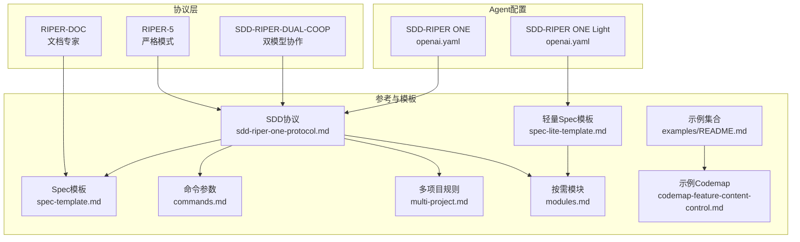
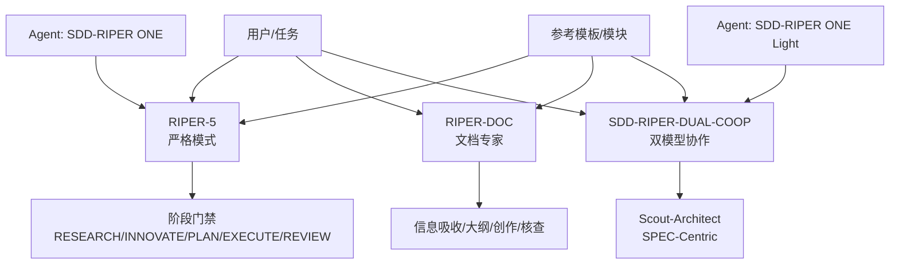
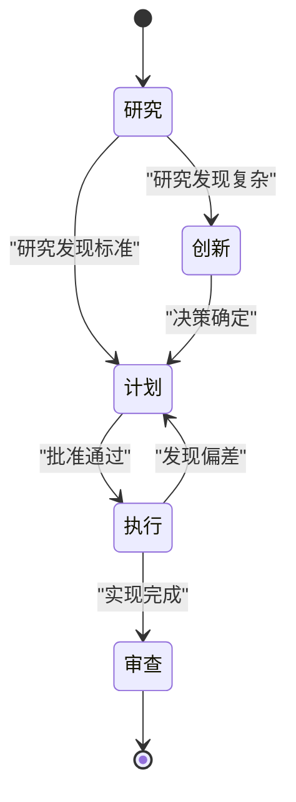
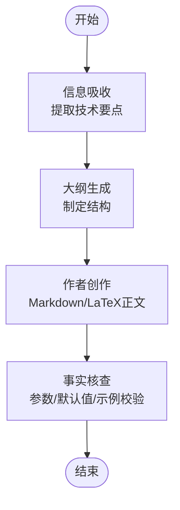
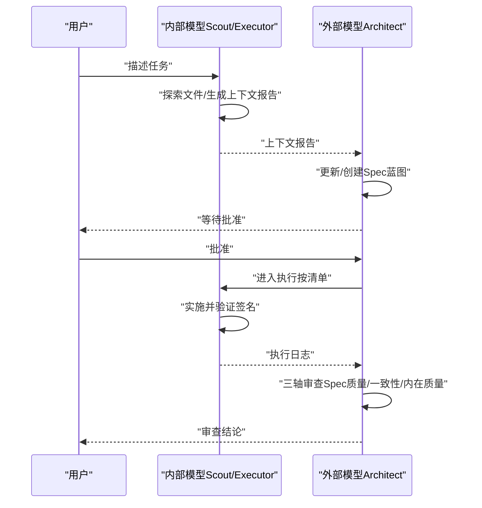
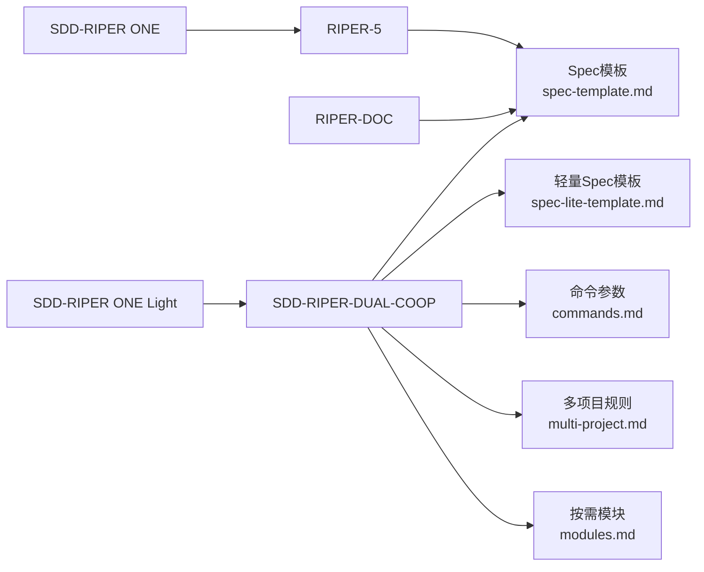

# 专用协议

<cite>
**本文引用的文件**
- [RIPER-5.md](file://altas-workflow/protocols/RIPER-5.md)
- [RIPER-DOC.md](file://altas-workflow/protocols/RIPER-DOC.md)
- [SDD-RIPER-DUAL-COOP.md](file://altas-workflow/protocols/SDD-RIPER-DUAL-COOP.md)
- [openai.yaml（SDD-RIPER ONE）](file://altas-workflow/references/agents/sdd-riper-one/agents/openai.yaml)
- [openai.yaml（SDD-RIPER ONE Light）](file://altas-workflow/references/agents/sdd-riper-one-light/agents/openai.yaml)
- [reference-index.md](file://altas-workflow/reference-index.md)
- [QUICKSTART.md](file://altas-workflow/QUICKSTART.md)
- [sdd-riper-one-protocol.md](file://altas-workflow/references/agents/sdd-riper-one/references/sdd-riper-one-protocol.md)
- [spec-template.md](file://altas-workflow/references/spec-driven-development/spec-template.md)
- [spec-lite-template.md](file://altas-workflow/references/checkpoint-driven/spec-lite-template.md)
- [commands.md](file://altas-workflow/references/spec-driven-development/commands.md)
- [multi-project.md](file://altas-workflow/references/spec-driven-development/multi-project.md)
- [modules.md](file://altas-workflow/references/checkpoint-driven/modules.md)
- [README.md（示例集合）](file://altas-workflow/references/agents/sdd-riper-one-light/examples/README.md)
- [codemap-feature-content-control.md](file://altas-workflow/references/agents/sdd-riper-one-light/examples/codemap/codemap-feature-content-control.md)
</cite>

## 目录
1. [简介](#简介)
2. [项目结构](#项目结构)
3. [核心组件](#核心组件)
4. [架构总览](#架构总览)
5. [详细组件分析](#详细组件分析)
6. [依赖分析](#依赖分析)
7. [性能考量](#性能考量)
8. [故障排查指南](#故障排查指南)
9. [结论](#结论)
10. [附录](#附录)

## 简介
本文件为 ALTAS Workflow 专用协议的综合文档，聚焦三大协议：
- RIPER-5 严格模式协议：面向高风险项目场景的阶段门禁与安全控制
- RIPER-DOC 文档专家协议：文档撰写全流程（信息吸收、大纲生成、作者创作、事实核查）
- SDD-RIPER-DUAL-COOP 双模型协作协议：外部架构师与内部执行者（Scout/Executor）的多模型协同机制

文档同时提供每种协议的触发方式、适用场景、配置参数与最佳实践，阐明协议间协作关系、切换条件与性能考量，并给出高级用户的使用指南与扩展开发建议。

## 项目结构
ALTAS Workflow 将协议与参考材料分层组织，便于按需加载与渐进式披露：
- protocols/：专用协议定义
- references/agents/：Agent 配置与技能定义
- references/spec-driven-development/ 与 references/checkpoint-driven/：SDD 与轻量工作流的参考模板与模块
- scripts/：自动化工具（如归档构建器）
- docs/：方法论与团队落地指南
- QUICKSTART.md 与 reference-index.md：快速上手与参考索引

**图表来源**
- [RIPER-5.md:1-187](file://altas-workflow/protocols/RIPER-5.md#L1-L187)
- [RIPER-DOC.md:1-66](file://altas-workflow/protocols/RIPER-DOC.md#L1-L66)
- [SDD-RIPER-DUAL-COOP.md:1-210](file://altas-workflow/protocols/SDD-RIPER-DUAL-COOP.md#L1-L210)
- [openai.yaml（SDD-RIPER ONE）:1-8](file://altas-workflow/references/agents/sdd-riper-one/agents/openai.yaml#L1-L8)
- [openai.yaml（SDD-RIPER ONE Light）:1-5](file://altas-workflow/references/agents/sdd-riper-one-light/agents/openai.yaml#L1-L5)
- [sdd-riper-one-protocol.md:1-696](file://altas-workflow/references/agents/sdd-riper-one/references/sdd-riper-one-protocol.md#L1-L696)
- [spec-template.md:1-297](file://altas-workflow/references/spec-driven-development/spec-template.md#L1-L297)
- [spec-lite-template.md:1-85](file://altas-workflow/references/checkpoint-driven/spec-lite-template.md#L1-L85)
- [commands.md:1-97](file://altas-workflow/references/spec-driven-development/commands.md#L1-L97)
- [multi-project.md:1-57](file://altas-workflow/references/spec-driven-development/multi-project.md#L1-L57)
- [modules.md:1-57](file://altas-workflow/references/checkpoint-driven/modules.md#L1-L57)
- [README.md（示例集合）:1-16](file://altas-workflow/references/agents/sdd-riper-one-light/examples/README.md#L1-L16)
- [codemap-feature-content-control.md:1-136](file://altas-workflow/references/agents/sdd-riper-one-light/examples/codemap/codemap-feature-content-control.md#L1-L136)

**章节来源**
- [reference-index.md:1-210](file://altas-workflow/reference-index.md#L1-L210)
- [QUICKSTART.md:1-182](file://altas-workflow/QUICKSTART.md#L1-L182)

## 核心组件
- RIPER-5 严格模式协议：以“模式声明 + 阶段门禁 + 严苛偏差处理”为核心，适用于高风险变更，确保实现与计划 100% 一致
- RIPER-DOC 文档专家协议：以“信息吸收 → 大纲生成 → 作者创作 → 事实核查”为主线，保证技术文档的准确性与一致性
- SDD-RIPER-DUAL-COOP 双模型协作协议：外部架构师（战略/规划/审查）与内部执行者（Scout/Executor/Builder）的角色分工与状态机流转，强调 Spec 为中心与即时落盘

**章节来源**
- [RIPER-5.md:1-187](file://altas-workflow/protocols/RIPER-5.md#L1-L187)
- [RIPER-DOC.md:1-66](file://altas-workflow/protocols/RIPER-DOC.md#L1-L66)
- [SDD-RIPER-DUAL-COOP.md:1-210](file://altas-workflow/protocols/SDD-RIPER-DUAL-COOP.md#L1-L210)

## 架构总览
三种协议在 ALTAS Workflow 中的协作关系如下：
- RIPER-5 与 SDD-RIPER-DUAL-COOP 共同遵循“Spec 为中心”的核心定律，强调“无 Spec 不编码、无批准不执行”
- RIPER-DOC 作为文档专家协议，贯穿各阶段，确保知识沉淀与可审计性
- Agent 配置文件（openai.yaml）为两种工作流提供默认提示词与能力边界

**图表来源**
- [RIPER-5.md:1-187](file://altas-workflow/protocols/RIPER-5.md#L1-L187)
- [RIPER-DOC.md:1-66](file://altas-workflow/protocols/RIPER-DOC.md#L1-L66)
- [SDD-RIPER-DUAL-COOP.md:1-210](file://altas-workflow/protocols/SDD-RIPER-DUAL-COOP.md#L1-L210)
- [openai.yaml（SDD-RIPER ONE）:1-8](file://altas-workflow/references/agents/sdd-riper-one/agents/openai.yaml#L1-L8)
- [openai.yaml（SDD-RIPER ONE Light）:1-5](file://altas-workflow/references/agents/sdd-riper-one-light/agents/openai.yaml#L1-L5)

## 详细组件分析

### RIPER-5 严格模式协议
- 适用场景
  - 高风险变更（破坏性逻辑、关键路径、安全敏感）
  - 需要“零偏差”实现的强约束任务
  - 对模型自主性高度敏感的项目
- 触发方式
  - 通过明确的模式进入信号启动：ENTER RESEARCH/INNOVATE/PLAN/EXECUTE/REVIEW
  - 退出：EXIT RIPER MODE 或 EXIT MODE
- 阶段门禁与安全控制
  - 模式声明：每次响应必须以当前模式头开始
  - 无许可不越界：严格禁止在未进入相应阶段时进行实现或规划
  - 执行零偏差：执行阶段必须严格遵循已批准的计划清单
  - 偏差即回退：发现任何偏差立即返回 PLAN 修正
- 配置参数与最佳实践
  - 明确的模式切换信号与退出命令
  - 计划阶段必须输出“逐项原子化检查清单”
  - 执行阶段不得擅自扩展或优化，仅限于清单条目
  - 建议在 REVIEW 阶段进行“逐条比对 + 明确结论”

**图表来源**
- [RIPER-5.md:25-125](file://altas-workflow/protocols/RIPER-5.md#L25-L125)

**章节来源**
- [RIPER-5.md:1-187](file://altas-workflow/protocols/RIPER-5.md#L1-L187)

### RIPER-DOC 文档专家协议
- 适用场景
  - 技术文档撰写、API 文档、设计说明、评审材料
  - 需要严谨的事实核查与风格一致性
- 触发方式
  - 从 ABSORB 模式开始，按序进入 OUTLINE、AUTHOR、FACT-CHECK
- 流程说明
  - ABSORB：提取参数、返回类型、逻辑流，形成技术要点摘要
  - OUTLINE：制定 H1/H2/H3 结构，贴合项目既有风格
  - AUTHOR：按摘要生成正文，保持清晰简洁的专业风格
  - FACT-CHECK：对照代码核对参数名、默认值、示例可运行性
- 配置参数与最佳实践
  - 严格区分“技术摘要”与“正文写作”
  - 事实核查清单必须覆盖参数一致性、默认值、示例有效性
  - 建议在完成后输出“✅ DOCS VERIFIED”或“⚠️ CORRECTION MADE”

**图表来源**
- [RIPER-DOC.md:9-61](file://altas-workflow/protocols/RIPER-DOC.md#L9-L61)

**章节来源**
- [RIPER-DOC.md:1-66](file://altas-workflow/protocols/RIPER-DOC.md#L1-L66)

### SDD-RIPER-DUAL-COOP 双模型协作协议
- 适用场景
  - 复杂系统重构、跨模块/跨项目任务
  - 需要外部架构师统筹与内部执行者高速落地的协同
- 角色与职责
  - 外部模型（架构师/指挥官）：负责解读上下文、维护 Spec、制定蓝图、审查质量
  - 内部模型（执行者/侦察兵）：负责文件探索、上下文采集、按 Spec 实施
- 状态机与流程
  - RESEARCH（协作开始）：内部 Scout 先行探索，输出 Context Report；外部 Architect 基于报告写 Spec
  - INNOVATE（可选，复杂任务）：外部 Architect 提出方案权衡，等待用户选择
  - PLAN（合同级蓝图）：外部 Architect 写入详细设计与原子检查清单
  - EXECUTE（建造者）：内部执行者严格按 Spec 清单实施，验证签名一致性
  - REVIEW（检查员）：外部 Architect 校验代码与 Spec 的一致性
  - FAST（写通缓存）：针对微小改动绕过 Research/Plan，直接执行并同步 Spec
- 语言与输出约定
  - 强制中文输出（除协议头、代码、变量名、文件路径）
  - 每次响应必须包含角色、模式、状态、文档路径头
- 配置参数与最佳实践
  - 明确的 STOP-AND-WAIT 协议：ACT → PERSIST → DISPLAY → BATCH BLOCKERS → STOP
  - Spec 必须即时落盘，冲突时以 Spec 为准
  - 多项目场景下，Provider 优先于 Consumer 执行，记录契约接口与受影响项目

**图表来源**
- [SDD-RIPER-DUAL-COOP.md:76-153](file://altas-workflow/protocols/SDD-RIPER-DUAL-COOP.md#L76-L153)

**章节来源**
- [SDD-RIPER-DUAL-COOP.md:1-210](file://altas-workflow/protocols/SDD-RIPER-DUAL-COOP.md#L1-L210)

## 依赖分析
- 协议与参考模板的耦合
  - RIPER-5 与 SDD-RIPER-DUAL-COOP 共同依赖“Spec 为中心”的核心定律与“无 Spec 不编码、无批准不执行”的门禁
  - 文档专家协议与 Spec 模板存在强耦合：文档内容必须基于 Spec/代码事实
- Agent 配置与协议边界
  - SDD-RIPER ONE 与 SDD-RIPER ONE Light 的默认提示词明确了工作流边界与语言规则
- 按需模块与触发词
  - 多项目、Debug、Review、Deep Planning 等模块在命中场景时才加载，避免上下文膨胀

**图表来源**
- [sdd-riper-one-protocol.md:1-696](file://altas-workflow/references/agents/sdd-riper-one/references/sdd-riper-one-protocol.md#L1-L696)
- [spec-template.md:1-297](file://altas-workflow/references/spec-driven-development/spec-template.md#L1-L297)
- [spec-lite-template.md:1-85](file://altas-workflow/references/checkpoint-driven/spec-lite-template.md#L1-L85)
- [commands.md:1-97](file://altas-workflow/references/spec-driven-development/commands.md#L1-L97)
- [multi-project.md:1-57](file://altas-workflow/references/spec-driven-development/multi-project.md#L1-L57)
- [modules.md:1-57](file://altas-workflow/references/checkpoint-driven/modules.md#L1-L57)
- [openai.yaml（SDD-RIPER ONE）:1-8](file://altas-workflow/references/agents/sdd-riper-one/agents/openai.yaml#L1-L8)
- [openai.yaml（SDD-RIPER ONE Light）:1-5](file://altas-workflow/references/agents/sdd-riper-one-light/agents/openai.yaml#L1-L5)

**章节来源**
- [reference-index.md:1-210](file://altas-workflow/reference-index.md#L1-L210)

## 性能考量
- 上下文管理
  - 采用“按需加载”策略，仅在命中场景加载对应参考文件，降低 token 消耗
  - Spec 为中心的设计减少上下文漂移，避免重复加载全量历史
- 执行节奏
  - RIPER-5 的“零偏差”与“偏差回退”机制降低返工成本
  - SDD-RIPER-DUAL-COOP 的 STOP-AND-WAIT 协议确保每步可验证、可回溯
- 资产沉淀
  - ARCHIVE 协议将中间产物转化为可复用知识，提升后续任务效率

[本节为通用性能讨论，无需特定文件来源]

## 故障排查指南
- 常见问题与对策
  - AI 暴走或一次性输出过多：ALTAS 内置检查点机制，必须“ACT → PERSIST → DISPLAY → BATCH BLOCKERS → STOP”。如遇异常，回复“请停止，严格执行检查点机制”
  - 测试优先导致速度慢：这是 Evidence First + TDD 铁律；极简任务可用“>>”触发 XS 模式跳过 TDD
  - 中途干预计划：可在检查点回复“[修改] …”，AI 会据此调整 Plan 后重新请求 Approve
  - 多人协作：Spec 是团队共享真相源，核心开发者只需 Review Plan，不必 Review 全部代码
- 协议级错误定位
  - RIPER-5：若执行阶段出现偏差，立即返回 PLAN 修正；REVIEW 阶段必须逐条比对
  - RIPER-DOC：事实核查清单必须覆盖参数名、默认值、示例可运行性
  - SDD-RIPER-DUAL-COOP：冲突以 Spec 为准；多项目场景必须记录契约接口与受影响项目

**章节来源**
- [QUICKSTART.md:119-151](file://altas-workflow/QUICKSTART.md#L119-L151)
- [sdd-riper-one-protocol.md:630-650](file://altas-workflow/references/agents/sdd-riper-one/references/sdd-riper-one-protocol.md#L630-L650)

## 结论
RIPER-5、RIPER-DOC 与 SDD-RIPER-DUAL-COOP 三者互补：前者强调“零偏差”的高风险控制，后者保障“可审计”的知识沉淀，前者则实现“外部统筹 + 内部高效”的双模型协同。结合 Agent 配置与参考模板，ALTAS Workflow 为复杂研发提供了可落地、可扩展、可复用的工程化范式。

[本节为总结性内容，无需特定文件来源]

## 附录

### 协议触发方式与适用场景速查
- RIPER-5
  - 触发：ENTER RESEARCH/INNOVATE/PLAN/EXECUTE/REVIEW；退出：EXIT RIPER MODE/EXIT MODE
  - 适用：高风险变更、强约束实现、安全敏感任务
- RIPER-DOC
  - 触发：从 ABSORB 开始，依次进入 OUTLINE/AUTHOR/FACT-CHECK
  - 适用：技术文档、API 文档、设计说明、评审材料
- SDD-RIPER-DUAL-COOP
  - 触发：描述任务 → Scout → Architect 写 Spec → 批准 → 执行/审查/快速执行
  - 适用：复杂重构、跨模块/跨项目、需要外部统筹的任务

**章节来源**
- [RIPER-5.md:144-175](file://altas-workflow/protocols/RIPER-5.md#L144-L175)
- [RIPER-DOC.md:63-66](file://altas-workflow/protocols/RIPER-DOC.md#L63-L66)
- [SDD-RIPER-DUAL-COOP.md:201-210](file://altas-workflow/protocols/SDD-RIPER-DUAL-COOP.md#L201-L210)

### 配置参数与最佳实践清单
- RIPER-5
  - 模式声明：每次响应必须包含当前模式头
  - 计划阶段输出“逐项原子化检查清单”
  - 执行阶段零偏差，发现偏差立即回退 PLAN
- RIPER-DOC
  - 严格事实核查：参数名、默认值、示例可运行性
  - 先摘要后正文，先结构后内容
- SDD-RIPER-DUAL-COOP
  - 每次响应包含角色/模式/状态/文档路径头
  - STOP-AND-WAIT：ACT → PERSIST → DISPLAY → BATCH BLOCKERS → STOP
  - Spec 即时落盘，冲突以 Spec 为准
  - 多项目 Provider 优先，记录契约接口与受影响项目

**章节来源**
- [RIPER-5.md:128-142](file://altas-workflow/protocols/RIPER-5.md#L128-L142)
- [RIPER-DOC.md:43-61](file://altas-workflow/protocols/RIPER-DOC.md#L43-L61)
- [SDD-RIPER-DUAL-COOP.md:53-74](file://altas-workflow/protocols/SDD-RIPER-DUAL-COOP.md#L53-L74)
- [sdd-riper-one-protocol.md:630-650](file://altas-workflow/references/agents/sdd-riper-one/references/sdd-riper-one-protocol.md#L630-L650)

### 协议间协作关系与切换条件
- 协作关系
  - 三者均以 Spec 为中心，强调“无 Spec 不编码、无批准不执行”
  - 文档专家协议贯穿各阶段，确保知识沉淀与可审计性
- 切换条件
  - RIPER-5：必须收到明确的模式进入信号；执行阶段发现偏差退回 PLAN
  - SDD-RIPER-DUAL-COOP：Scout 完成 Context Report 后交由 Architect 写 Spec；批准后进入执行
  - RIPER-DOC：按 ABSORB → OUTLINE → AUTHOR → FACT-CHECK 顺序推进

**章节来源**
- [sdd-riper-one-protocol.md:17-42](file://altas-workflow/references/agents/sdd-riper-one/references/sdd-riper-one-protocol.md#L17-L42)
- [SDD-RIPER-DUAL-COOP.md:76-153](file://altas-workflow/protocols/SDD-RIPER-DUAL-COOP.md#L76-L153)
- [RIPER-DOC.md:9-61](file://altas-workflow/protocols/RIPER-DOC.md#L9-L61)

### 示例与参考
- 示例集合与公开示例 Codemap 展示了真实任务中的写法与排查方法
- 示例 README 指导如何在脱敏前提下保留问题形态、推理过程与修复思路

**章节来源**
- [README.md（示例集合）:1-16](file://altas-workflow/references/agents/sdd-riper-one-light/examples/README.md#L1-L16)
- [codemap-feature-content-control.md:1-136](file://altas-workflow/references/agents/sdd-riper-one-light/examples/codemap/codemap-feature-content-control.md#L1-L136)