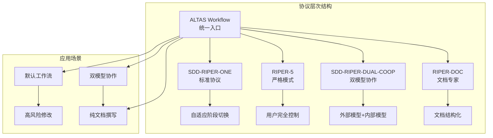
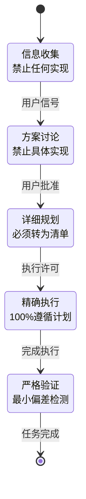
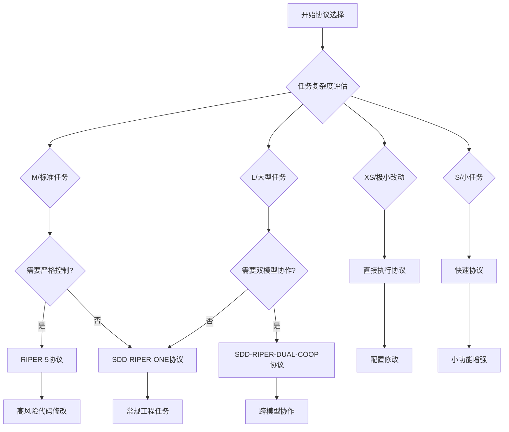
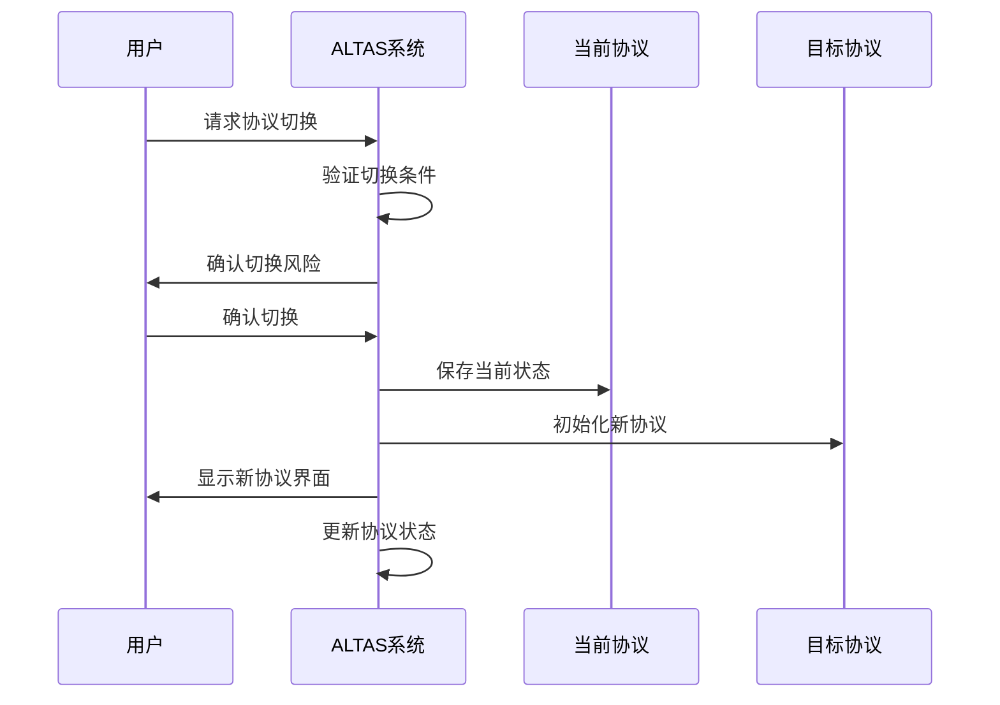
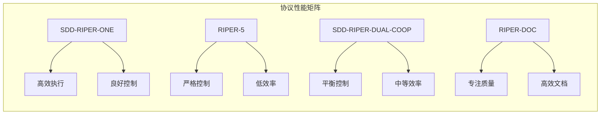

# 协议选择指南

<cite>
**本文档引用的文件**
- [PROTOCOL-SELECTION.md](file://altas-workflow/protocols/PROTOCOL-SELECTION.md)
- [RIPER-5.md](file://altas-workflow/protocols/RIPER-5.md)
- [RIPER-DOC.md](file://altas-workflow/protocols/RIPER-DOC.md)
- [SDD-RIPER-DUAL-COOP.md](file://altas-workflow/protocols/SDD-RIPER-DUAL-COOP.md)
- [SKILL.md](file://altas-workflow/SKILL.md)
- [QUICKSTART.md](file://altas-workflow/QUICKSTART.md)
- [reference-index.md](file://altas-workflow/reference-index.md)
- [workflow-diagrams.md](file://altas-workflow/workflow-diagrams.md)
</cite>

## 目录
1. [简介](#简介)
2. [协议体系概览](#协议体系概览)
3. [核心协议详解](#核心协议详解)
4. [协议选择决策树](#协议选择决策树)
5. [协议切换机制](#协议切换机制)
6. [使用场景匹配](#使用场景匹配)
7. [协议对比分析](#协议对比分析)
8. [最佳实践建议](#最佳实践建议)
9. [故障排除指南](#故障排除指南)
10. [总结](#总结)

## 简介

协议选择指南是ALTAS Workflow生态系统中的核心决策框架，旨在帮助用户在多种专业协议之间做出明智的选择。该指南基于SDD-RIPER（Spec-Driven Development）方法论，结合了严格的阶段控制、文档驱动开发和双模型协作等先进理念。

ALTAS Workflow通过统一的协议选择机制，确保用户能够在不同复杂度和风险级别的工程任务中，选择最适合的执行协议，从而最大化开发效率和代码质量。

## 协议体系概览

ALTAS Workflow建立了多层次的协议体系，从基础的快速执行协议到复杂的双模型协作协议，形成了完整的协议矩阵：

**图表来源**
- [PROTOCOL-SELECTION.md:1-26](file://altas-workflow/protocols/PROTOCOL-SELECTION.md#L1-L26)
- [SKILL.md:45-50](file://altas-workflow/SKILL.md#L45-L50)

## 核心协议详解

### SDD-RIPER-ONE（默认协议）

SDD-RIPER-ONE是ALTAS Workflow的默认协议，采用自适应阶段切换机制，适用于大多数工程任务。其核心特点包括：

- **自适应性**：根据任务复杂度自动调整阶段深度
- **渐进式披露**：研究阶段只讨论逻辑约束，规划阶段只讨论接口签名
- **阶段门禁**：严格的阶段转换控制机制

### RIPER-5（严格模式协议）

RIPER-5协议专为高风险代码修改场景设计，提供十级严格控制：

**图表来源**
- [RIPER-5.md:27-125](file://altas-workflow/protocols/RIPER-5.md#L27-L125)

### SDD-RIPER-DUAL-COOP（双模型协作协议）

双模型协作协议解决了外部模型无法直接读取代码库的问题，通过外部模型（架构师）和内部模型（侦察员/执行者）的分工合作：

- **外部模型（架构师）**：负责战略思考、规格编写和总体把控
- **内部模型（侦察员/执行者）**：负责文件读取、上下文收集和代码实现
- **信任边界管理**：通过SPEC文件建立唯一的真相源

### RIPER-DOC（文档专家协议）

专门针对文档撰写场景的协议，采用四阶段文档专家模式：

- **吸收阶段**：提取技术上下文和关键细节
- **大纲阶段**：规划文档结构和层次
- **创作阶段**：生成高质量的技术文档
- **事实核查阶段**：交叉验证文档准确性

**章节来源**
- [RIPER-DOC.md:9-65](file://altas-workflow/protocols/RIPER-DOC.md#L9-L65)

## 协议选择决策树

协议选择是一个多维度的决策过程，需要综合考虑任务复杂度、风险水平、协作需求等因素：

**图表来源**
- [PROTOCOL-SELECTION.md:3-26](file://altas-workflow/protocols/PROTOCOL-SELECTION.md#L3-L26)
- [QUICKSTART.md:78-90](file://altas-workflow/QUICKSTART.md#L78-L90)

## 协议切换机制

ALTAS Workflow提供了灵活的协议切换机制，允许用户在会话过程中根据需要调整协议：

### 协议切换矩阵

| 当前协议 | 目标协议 | 触发条件 | 使用场景 |
|---------|---------|---------|---------|
| SDD-RIPER-ONE | RIPER-5 | 用户要求手动审批每个阶段 | 高风险修改、严格审计需求 |
| SDD-RIPER-ONE | SDD-RIPER-DUAL-COOP | 用户激活双模型模式 | 外部模型无法直接读取代码库 |
| RIPER-5 | SDD-RIPER-ONE | 用户要求自主执行 | 风险降低、信任度提升 |
| SDD-RIPER-DUAL-COOP | SDD-RIPER-ONE | 双模型协作结束 | 回归常规开发流程 |

### 切换流程控制

协议切换遵循严格的控制流程，确保切换的安全性和可控性：

**图表来源**
- [PROTOCOL-SELECTION.md:19-26](file://altas-workflow/protocols/PROTOCOL-SELECTION.md#L19-L26)

## 使用场景匹配

### 默认工作流场景

SDD-RIPER-ONE协议适用于绝大多数工程任务，特别是：

- **常规功能开发**：新增接口、模块重构、业务逻辑实现
- **代码优化**：性能改进、代码重构、架构优化
- **集成测试**：系统集成、接口联调、数据迁移

### 高风险修改场景

当任务涉及高风险代码修改时，推荐使用RIPER-5协议：

- **核心系统修改**：数据库schema变更、关键算法调整
- **安全敏感代码**：认证授权、数据加密、访问控制
- **生产环境部署**：热修复、紧急补丁、生产回滚

### 双模型协作场景

SDD-RIPER-DUAL-COOP协议适用于需要外部模型和内部模型协作的场景：

- **架构设计**：系统架构规划、技术选型、设计模式应用
- **复杂重构**：大规模代码重构、模块解耦、技术债务偿还
- **知识传递**：经验丰富的架构师指导新手开发者

### 文档撰写场景

RIPER-DOC协议专门用于技术文档的结构化撰写：

- **API文档**：接口规范、参数说明、使用示例
- **架构文档**：系统设计、组件关系、数据流图
- **用户手册**：功能说明、操作指南、故障排除

**章节来源**
- [PROTOCOL-SELECTION.md:5-17](file://altas-workflow/protocols/PROTOCOL-SELECTION.md#L5-L17)

## 协议对比分析

### 协议特性对比表

| 协议名称 | 风险级别 | 控制程度 | 适用场景 | 复杂度要求 | 学习成本 |
|---------|---------|---------|---------|---------|---------|
| SDD-RIPER-ONE | 低 | 自适应 | 常规开发 | 中等 | 低 |
| RIPER-5 | 极高 | 严格 | 高风险修改 | 低 | 中等 |
| SDD-RIPER-DUAL-COOP | 中高 | 双模型 | 复杂协作 | 高 | 中等 |
| RIPER-DOC | 低 | 结构化 | 文档撰写 | 低 | 低 |

### 协议性能特征

**图表来源**
- [PROTOCOL-SELECTION.md:12-17](file://altas-workflow/protocols/PROTOCOL-SELECTION.md#L12-L17)

## 最佳实践建议

### 协议选择最佳实践

1. **默认选择SDD-RIPER-ONE**：除非有特殊需求，否则优先选择默认协议
2. **风险评估驱动**：根据任务风险级别选择相应协议
3. **团队能力匹配**：考虑团队成员对协议的熟悉程度
4. **项目生命周期**：根据项目阶段调整协议严格程度

### 协议使用技巧

- **渐进式披露**：在对话中只呈现必要的细节
- **阶段门禁**：严格遵守阶段转换条件
- **证据驱动**：所有决策都需要可验证的证据
- **回溯机制**：建立完善的错误恢复和回溯机制

### 团队协作建议

- **协议培训**：确保团队成员掌握所选协议
- **工具支持**：提供相应的自动化工具支持
- **监督机制**：建立协议执行的监督和反馈机制
- **持续改进**：定期评估协议效果并进行优化

## 故障排除指南

### 常见协议选择错误

| 错误类型 | 症状表现 | 解决方案 |
|---------|---------|---------|
| 协议过于宽松 | 代码质量问题频发 | 切换到RIPER-5协议 |
| 协议过于严格 | 开发效率低下 | 回退到SDD-RIPER-ONE协议 |
| 协议不匹配 | 团队协作困难 | 评估团队能力和项目需求 |
| 协议执行不当 | 项目延期或失败 | 建立监督机制和纠正措施 |

### 协议切换故障处理

当协议切换出现问题时，可以采取以下措施：

1. **立即回退**：使用`EXIT ALTAS`指令退出当前协议
2. **状态恢复**：重新初始化目标协议
3. **数据备份**：确保重要数据和进度的完整性
4. **团队沟通**：及时通知团队成员协议状态变化

### 性能监控和优化

建立协议执行的监控指标：

- **执行效率**：代码修改速度和质量
- **错误率**：代码缺陷和回归测试失败率
- **团队满意度**：开发体验和协作效果
- **项目进度**：里程碑达成和交付质量

## 总结

协议选择指南为ALTAS Workflow生态系统提供了科学、系统的协议选择框架。通过深入理解各种协议的特点、适用场景和切换机制，用户可以在不同复杂度和风险级别的工程任务中，做出最优的协议选择。

关键要点包括：

1. **以任务为中心**：根据具体任务需求选择最适合的协议
2. **风险为导向**：高风险任务需要更严格的协议控制
3. **团队能力匹配**：协议选择需要考虑团队的实际能力
4. **持续优化**：根据项目进展和团队反馈调整协议策略

通过合理运用协议选择指南，可以显著提升软件开发的质量和效率，降低项目风险，确保团队协作的一致性和有效性。