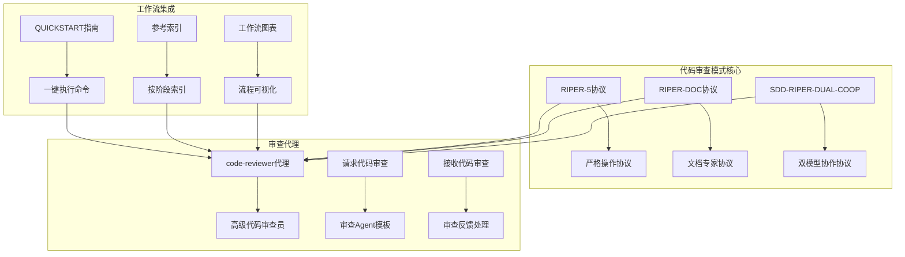
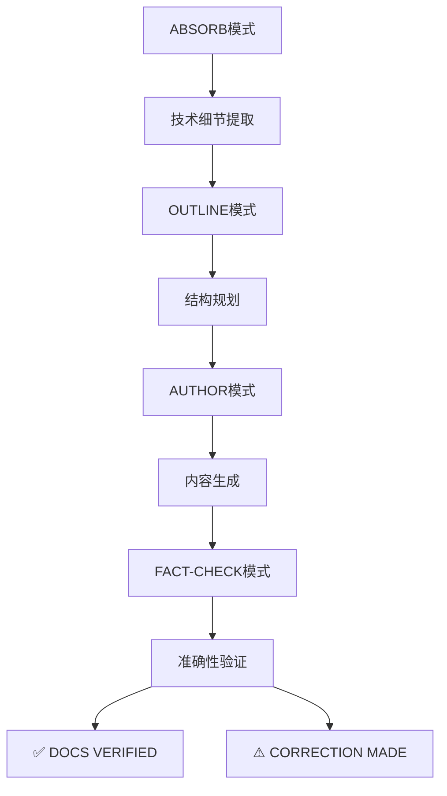
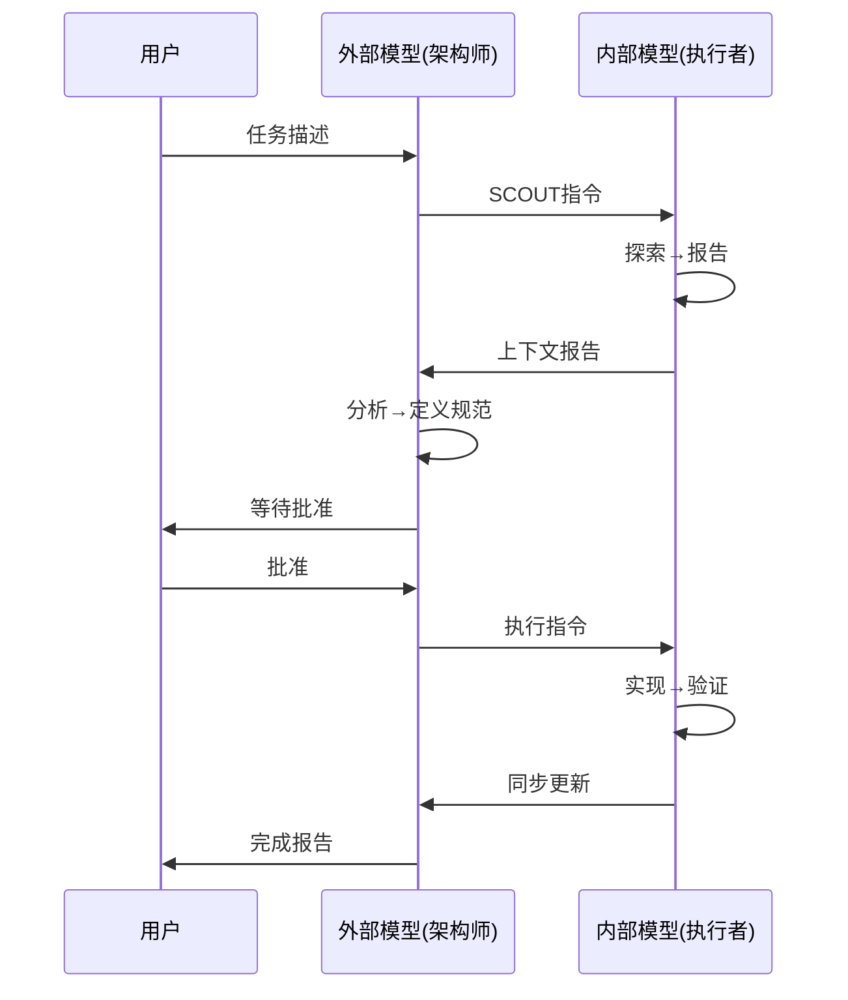
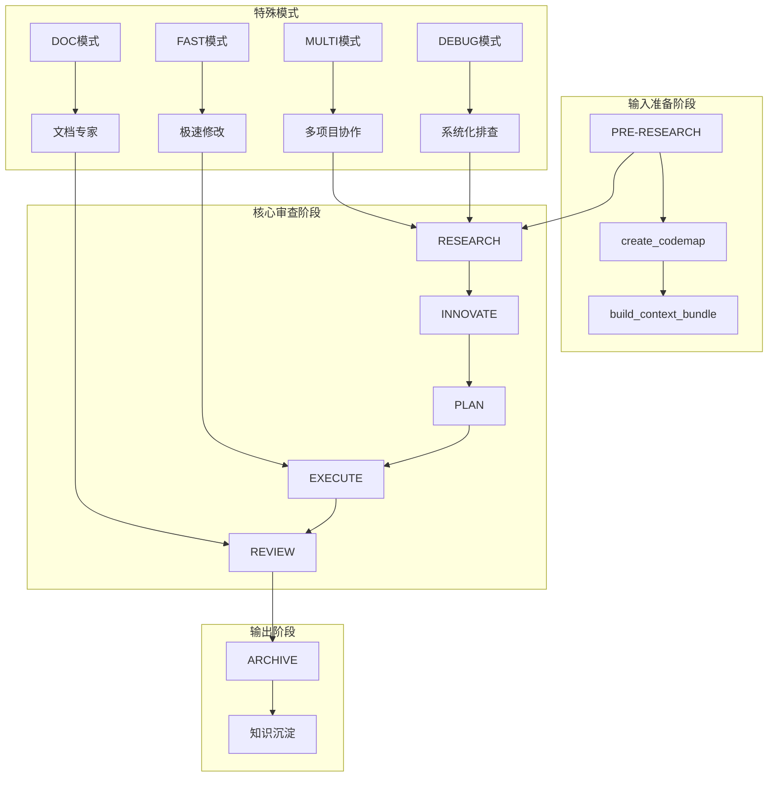
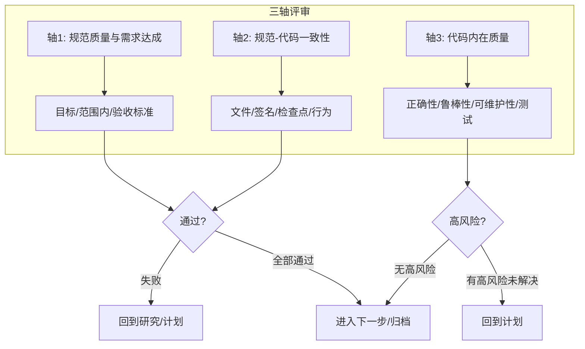
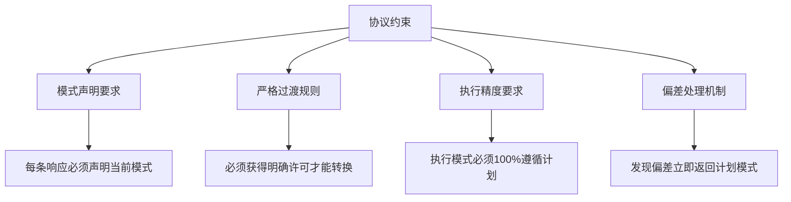
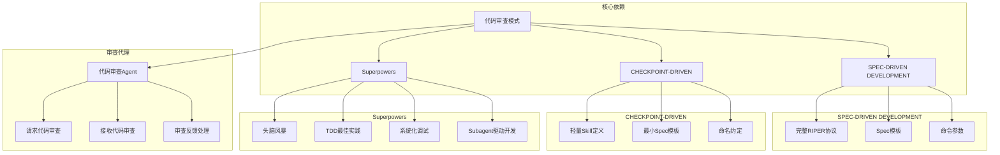
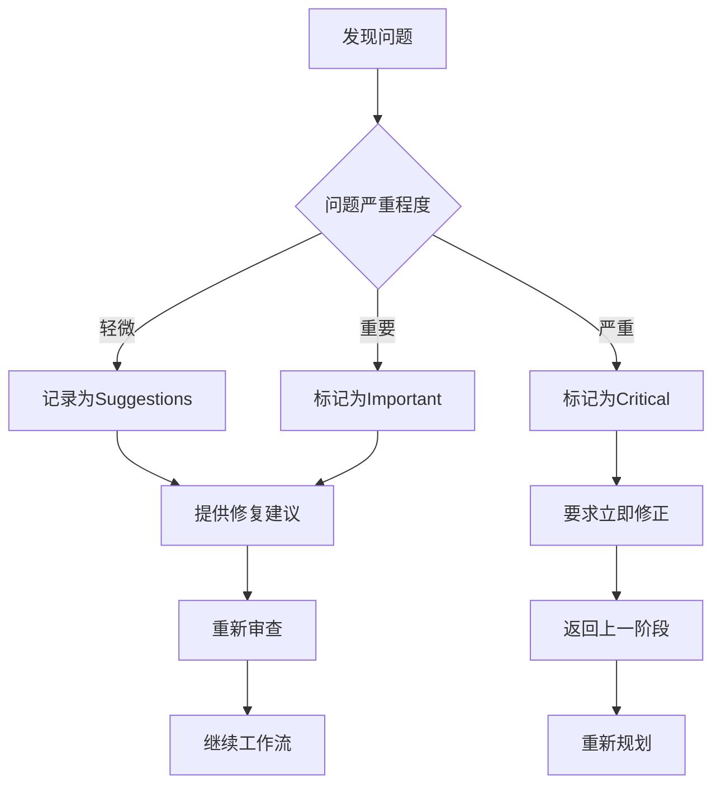

# 代码审查模式

<cite>
**本文档引用的文件**
- [RIPER-5.md](file://altas-workflow/protocols/RIPER-5.md)
- [RIPER-DOC.md](file://altas-workflow/protocols/RIPER-DOC.md)
- [SDD-RIPER-DUAL-COOP.md](file://altas-workflow/protocols/SDD-RIPER-DUAL-COOP.md)
- [code-reviewer.md](file://altas-workflow/references/agents/code-reviewer.md)
- [QUICKSTART.md](file://altas-workflow/QUICKSTART.md)
- [reference-index.md](file://altas-workflow/reference-index.md)
- [workflow-diagrams.md](file://altas-workflow/workflow-diagrams.md)
</cite>

## 目录
1. [简介](#简介)
2. [项目结构](#项目结构)
3. [核心组件](#核心组件)
4. [架构概览](#架构概览)
5. [详细组件分析](#详细组件分析)
6. [依赖关系分析](#依赖关系分析)
7. [性能考虑](#性能考虑)
8. [故障排除指南](#故障排除指南)
9. [结论](#结论)

## 简介

代码审查模式是ALTAS工作流中的一个关键组成部分，它提供了一套系统化的代码质量保证机制。该模式基于严格的协议框架，结合SPEC-DRIVEN DEVELOPMENT（规范驱动开发）和CHECKPOINT-DRIVEN（检查点驱动）理念，确保代码变更的质量和一致性。

代码审查模式的核心目标是在软件开发生命周期的各个阶段提供持续的质量控制，通过多维度的审查标准确保代码符合既定的规范和最佳实践。该模式特别强调"三轴评审"机制，从规范质量、代码一致性到代码内在质量三个维度进行全面评估。

## 项目结构

ALTAS工作流采用模块化的设计理念，将代码审查模式与其他工作流组件有机结合：



**图表来源**
- [RIPER-5.md:1-187](file://altas-workflow/protocols/RIPER-5.md#L1-L187)
- [RIPER-DOC.md:1-66](file://altas-workflow/protocols/RIPER-DOC.md#L1-L66)
- [SDD-RIPER-DUAL-COOP.md:1-210](file://altas-workflow/protocols/SDD-RIPER-DUAL-COOP.md#L1-L210)
- [code-reviewer.md:1-49](file://altas-workflow/references/agents/code-reviewer.md#L1-L49)

**章节来源**
- [RIPER-5.md:1-187](file://altas-workflow/protocols/RIPER-5.md#L1-L187)
- [RIPER-DOC.md:1-66](file://altas-workflow/protocols/RIPER-DOC.md#L1-L66)
- [SDD-RIPER-DUAL-COOP.md:1-210](file://altas-workflow/protocols/SDD-RIPER-DUAL-COOP.md#L1-L210)
- [code-reviewer.md:1-49](file://altas-workflow/references/agents/code-reviewer.md#L1-L49)

## 核心组件

### RIPER-5严格操作协议

RIPER-5协议定义了五个严格的操作模式，确保代码变更的可控性和可追溯性：

| 模式 | 目的 | 关键特征 | 输出格式 |
|------|------|----------|----------|
| Research | 信息收集 | 仅限阅读文件、询问澄清问题 | 观察和问题 |
| Innovate | 创意构思 | 讨论潜在方案、优缺点分析 | 可能性与考量 |
| Plan | 详细规划 | 创建详尽技术规范 | 原子行动清单 |
| Execute | 精确执行 | 严格按照计划实施 | 实施匹配计划 |
| Review | 严格验证 | 对比计划与实现 | 明确偏差标记 |

### 文档专家协议（RIPER-DOC）

文档专家协议专门用于将代码逻辑转换为清晰的人类可读文档：



**图表来源**
- [RIPER-DOC.md:11-66](file://altas-workflow/protocols/RIPER-DOC.md#L11-L66)

### 双模型协作协议（SDD-RIPER-DUAL-COOP）

双模型协作协议实现了外部模型（架构师）和内部模型（执行者）的协同工作：



**图表来源**
- [SDD-RIPER-DUAL-COOP.md:76-153](file://altas-workflow/protocols/SDD-RIPER-DUAL-COOP.md#L76-L153)

**章节来源**
- [RIPER-5.md:25-125](file://altas-workflow/protocols/RIPER-5.md#L25-L125)
- [RIPER-DOC.md:9-66](file://altas-workflow/protocols/RIPER-DOC.md#L9-L66)
- [SDD-RIPER-DUAL-COOP.md:13-73](file://altas-workflow/protocols/SDD-RIPER-DUAL-COOP.md#L13-L73)

## 架构概览

代码审查模式在整个ALTAS工作流中扮演着质量控制枢纽的角色：



**图表来源**
- [workflow-diagrams.md:7-41](file://altas-workflow/workflow-diagrams.md#L7-L41)
- [workflow-diagrams.md:45-67](file://altas-workflow/workflow-diagrams.md#L45-L67)
- [workflow-diagrams.md:172-197](file://altas-workflow/workflow-diagrams.md#L172-L197)

### 三轴评审机制

代码审查模式的核心是"三轴评审"机制，确保从多个维度评估代码质量：



**图表来源**
- [workflow-diagrams.md:108-125](file://altas-workflow/workflow-diagrams.md#L108-L125)

**章节来源**
- [workflow-diagrams.md:108-125](file://altas-workflow/workflow-diagrams.md#L108-L125)

## 详细组件分析

### 代码审查代理（code-reviewer）

代码审查代理是一个专门的智能体，负责对已完成的项目步骤进行审查：

#### 审查维度

| 审查维度 | 具体内容 | 评估标准 |
|----------|----------|----------|
| 计划一致性分析 | 实现与原始规划文档对比 | 是否偏离计划、改进是否合理 |
| 代码质量评估 | 遵循模式和约定、错误处理 | 组织性、命名约定、可维护性 |
| 架构设计审查 | 遵循SOLID原则、关注点分离 | 耦合度、扩展性考虑 |
| 文档标准检查 | 注释、文档完整性 | 准确性、项目特定标准 |

#### 问题分类体系

```mermaid
flowchart LR
A[问题识别] --> B[分类处理]
B --> C[Critical(必须修复)]
B --> D[Important(应该修复)]
B --> E[Suggestions(建议)]
C --> F[具体示例+修复建议]
D --> F
E --> G[可选改进]
F --> H[沟通协议遵循]
G --> H
```

**图表来源**
- [code-reviewer.md:36-47](file://altas-workflow/references/agents/code-reviewer.md#L36-L47)

**章节来源**
- [code-reviewer.md:8-49](file://altas-workflow/references/agents/code-reviewer.md#L8-L49)

### 严格模式协议（RIPER-5）

RIPER-5协议提供了严格的操作约束，防止LLM在代码审查过程中产生不可控的变更：

#### 模式转换信号

| 模式 | 转换信号 | 触发条件 |
|------|----------|----------|
| Research | ENTER RESEARCH MODE | 开始信息收集 |
| Innovate | ENTER INNOVATE MODE | 进入创意构思 |
| Plan | ENTER PLAN MODE | 需要详细规划 |
| Execute | ENTER EXECUTE MODE | 获得计划批准 |
| Review | ENTER REVIEW MODE | 实施完成后验证 |

#### 协议约束



**图表来源**
- [RIPER-5.md:128-141](file://altas-workflow/protocols/RIPER-5.md#L128-L141)

**章节来源**
- [RIPER-5.md:11-187](file://altas-workflow/protocols/RIPER-5.md#L11-L187)

### 文档审查流程

文档专家协议确保技术文档的准确性和一致性：

#### ABSORB阶段

在ABSORB阶段，文档专家专注于：
- 代码文件的技术细节提取
- 参数、返回类型、边缘情况识别
- 逻辑流程验证
- 技术术语准确性

#### OUTLINE阶段

OUTLINE阶段重点关注：
- 文档结构规划（H1, H2, H3层次）
- 与现有文档风格的一致性
- 内容组织逻辑
- 导航结构合理性

#### FACT-CHECK阶段

准确性验证包括：
- 参数名称与代码完全一致
- 默认值准确性核对
- 代码示例实际可运行性
- 技术细节准确性验证

**章节来源**
- [RIPER-DOC.md:11-66](file://altas-workflow/protocols/RIPER-DOC.md#L11-L66)

## 依赖关系分析

代码审查模式与其他工作流组件存在紧密的依赖关系：



**图表来源**
- [reference-index.md:150-214](file://altas-workflow/reference-index.md#L150-L214)

### 工作流集成点

代码审查模式在不同规模的工作流中有不同的集成方式：

| 工作流规模 | 集成方式 | 审查频率 | 审查重点 |
|------------|----------|----------|----------|
| Size XS | 直接执行后简单验证 | 低频 | 快速回归测试 |
| Size S | micro-spec批准后审查 | 中等 | 功能完整性验证 |
| Size M | TDD循环后三轴评审 | 高频 | 规范一致性、代码质量 |
| Size L | 多阶段审查+知识沉淀 | 最高频 | 架构质量、可扩展性 |

**章节来源**
- [reference-index.md:216-243](file://altas-workflow/reference-index.md#L216-L243)

## 性能考虑

### 审查效率优化

代码审查模式在设计时充分考虑了性能因素：

1. **渐进式披露**：只在需要时加载相关文档，避免不必要的计算开销
2. **检查点机制**：每个阶段完成后暂停等待确认，防止资源浪费
3. **并行处理**：在L规模工作流中，Subagent可以并行执行多个任务
4. **缓存策略**：利用CodeMap和上下文缓存减少重复工作

### 资源管理

- **内存使用**：通过模块化设计，按需加载文档内容
- **计算开销**：严格限制LLM的自主决策，减少无效思考
- **存储优化**：mydocs目录结构清晰，便于版本控制和检索

## 故障排除指南

### 常见问题及解决方案

| 问题类型 | 症状表现 | 解决方案 |
|----------|----------|----------|
| 审查过度 | AI生成过多代码但未执行 | 使用"请停止，严格执行检查点机制"指令 |
| 规划偏差 | 发现计划与实现不符 | 立即返回PLAN模式，重新制定检查点清单 |
| 模式混淆 | 不确定当前处于哪个模式 | 明确发出模式转换信号，如"ENTER REVIEW MODE" |
| 文档不一致 | 代码与文档描述不符 | 启动RIPER-DOC协议进行文档专家审查 |

### 错误处理流程



**章节来源**
- [QUICKSTART.md:119-152](file://altas-workflow/QUICKSTART.md#L119-L152)

## 结论

代码审查模式作为ALTAS工作流的核心质量保证机制，通过严格的协议约束、多维度的审查标准和智能化的代理协作，确保了代码变更的质量和一致性。该模式不仅提高了代码质量，还建立了完整的知识沉淀和传承机制。

其主要优势包括：
- **严格的质量控制**：通过RIPER-5协议确保变更的可控性
- **全面的审查覆盖**：三轴评审机制从多个维度评估代码质量
- **高效的协作机制**：双模型协作协议优化了人机配合效率
- **可持续的知识管理**：完整的归档机制确保经验传承

对于团队而言，正确理解和应用代码审查模式能够显著提升软件开发质量和团队协作效率，是实现AI原生研发范式的重要保障。