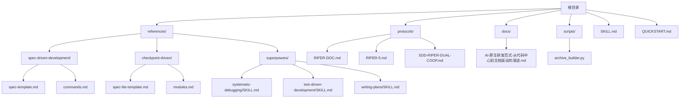
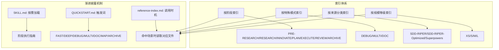
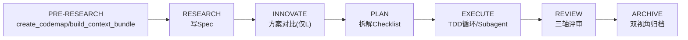
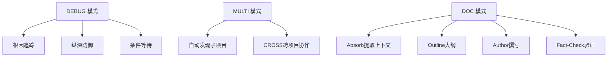
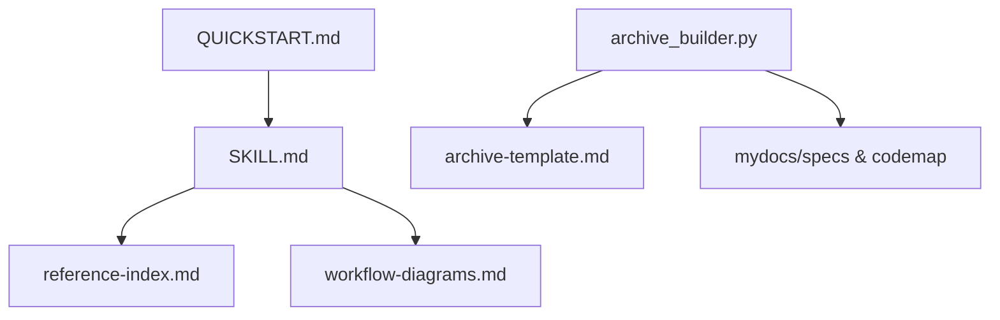

# 参考资料索引

<cite>
**本文引用的文件**
- [reference-index.md](file://altas-workflow/reference-index.md)
- [SKILL.md](file://altas-workflow/SKILL.md)
- [QUICKSTART.md](file://altas-workflow/QUICKSTART.md)
- [workflow-diagrams.md](file://altas-workflow/workflow-diagrams.md)
- [archive_builder.py](file://altas-workflow/scripts/archive_builder.py)
- [RIPER-DOC.md](file://altas-workflow/protocols/RIPER-DOC.md)
- [RIPER-5.md](file://altas-workflow/protocols/RIPER-5.md)
- [SDD-RIPER-DUAL-COOP.md](file://altas-workflow/protocols/SDD-RIPER-DUAL-COOP.md)
- [AI-原生研发范式-从代码中心到文档驱动的演进.md](file://altas-workflow/docs/AI-原生研发范式-从代码中心到文档驱动的演进.md)
- [spec-template.md](file://altas-workflow/references/spec-driven-development/spec-template.md)
- [spec-lite-template.md](file://altas-workflow/references/checkpoint-driven/spec-lite-template.md)
- [SKILL.md（系统化调试）](file://altas-workflow/references/superpowers/systematic-debugging/SKILL.md)
- [SKILL.md（测试驱动开发）](file://altas-workflow/references/superpowers/test-driven-development/SKILL.md)
- [SKILL.md（写计划）](file://altas-workflow/references/superpowers/writing-plans/SKILL.md)
</cite>

## 目录
1. [简介](#简介)
2. [项目结构](#项目结构)
3. [核心组件](#核心组件)
4. [架构总览](#架构总览)
5. [详细组件分析](#详细组件分析)
6. [依赖分析](#依赖分析)
7. [性能考虑](#性能考虑)
8. [故障排查指南](#故障排查指南)
9. [结论](#结论)
10. [附录](#附录)

## 简介
本文件为 ALTAS Workflow 的参考资料索引导航文档，旨在帮助用户快速定位所需技能与模板，实现“按需加载、渐进披露”的高效使用体验。索引体系涵盖：
- 按工作流阶段索引：从输入准备到知识沉淀的全流程参考
- 按特殊模式索引：DEBUG/MULTI/DOC 等模式的专用参考
- 按来源分类索引：SDD-RIPER、SDD-RIPER-Optimized、Superpowers 等来源的权威参考
- 按规模等级索引：XS/S/M/L 的参考加载建议
- 参考资料搜索与筛选技巧：基于触发场景、调用时机与主题的检索方法

## 项目结构
ALTAS Workflow 的参考资料主要分布在以下目录：
- references/：三大来源的参考文件与模板
- protocols/：协议与模式定义
- docs/：方法论与团队落地指南
- scripts/：自动化工具（如归档生成器）
- 根目录 SKILL.md 与 QUICKSTART.md：工作流总纲与快速启动指南



图表来源
- [reference-index.md:1-210](file://altas-workflow/reference-index.md#L1-L210)
- [SKILL.md:1-351](file://altas-workflow/SKILL.md#L1-L351)
- [QUICKSTART.md:1-182](file://altas-workflow/QUICKSTART.md#L1-L182)

章节来源
- [reference-index.md:1-210](file://altas-workflow/reference-index.md#L1-L210)
- [SKILL.md:1-351](file://altas-workflow/SKILL.md#L1-L351)
- [QUICKSTART.md:1-182](file://altas-workflow/QUICKSTART.md#L1-L182)

## 核心组件
- 参考资料总索引：统一发现入口，按阶段、模式、来源与规模提供参考清单与调用时机
- 工作流技能（SKILL.md）：整合 SDD-RIPER、Checkpoint-Driven 与 Superpowers 的核心能力，定义阶段执行指南与铁律约束
- 快速启动（QUICKSTART.md）：环境配置、一键命令、典型场景与 FAQ
- 流程图集（workflow-diagrams.md）：架构总览、阶段流程、铁律与门禁、Review 三轴、TDD 循环、特殊模式总览等可视化参考
- 归档脚本（archive_builder.py）：从 Spec/Codemap 生成双视角归档（human/llm）

章节来源
- [reference-index.md:1-210](file://altas-workflow/reference-index.md#L1-L210)
- [SKILL.md:1-351](file://altas-workflow/SKILL.md#L1-L351)
- [workflow-diagrams.md:1-338](file://altas-workflow/workflow-diagrams.md#L1-L338)
- [archive_builder.py:1-505](file://altas-workflow/scripts/archive_builder.py#L1-L505)

## 架构总览
下图展示了 ALTAS Workflow 的三层索引与渐进披露机制：阶段索引（PRE-RESEARCH/RESEARCH/INNOVATE/PLAN/EXECUTE/REVIEW/ARCHIVE）、模式索引（DEBUG/MULTI/DOC）、来源索引（SDD-RIPER/SDD-RIPER-Optimized/Superpowers）与规模索引（XS/S/M/L）协同工作，配合 SKILL.md 的“按需加载”与 QUICKSTART.md 的触发词，实现按需加载与检查点推进。



图表来源
- [SKILL.md:278-300](file://altas-workflow/SKILL.md#L278-L300)
- [reference-index.md:16-210](file://altas-workflow/reference-index.md#L16-L210)
- [QUICKSTART.md:36-49](file://altas-workflow/QUICKSTART.md#L36-L49)

章节来源
- [SKILL.md:278-300](file://altas-workflow/SKILL.md#L278-L300)
- [reference-index.md:16-210](file://altas-workflow/reference-index.md#L16-L210)
- [QUICKSTART.md:36-49](file://altas-workflow/QUICKSTART.md#L36-L49)

## 详细组件分析

### 按工作流阶段索引
- PRE-RESEARCH：输入准备阶段，读取命令参数与上下文打包
- RESEARCH：研究对齐，写 Spec（M/L 与 S 的模板不同）
- INNOVATE：方案对比（仅 L）
- PLAN：详细规划，写 Plan 与 Checklist
- EXECUTE：执行实现，TDD 循环与 Subagent 驱动
- REVIEW：三轴评审（Spec-代码-质量）
- ARCHIVE：知识沉淀，双视角归档



图表来源
- [SKILL.md:140-218](file://altas-workflow/SKILL.md#L140-L218)
- [reference-index.md:16-81](file://altas-workflow/reference-index.md#L16-L81)

章节来源
- [SKILL.md:140-218](file://altas-workflow/SKILL.md#L140-L218)
- [reference-index.md:16-81](file://altas-workflow/reference-index.md#L16-L81)

### 按特殊模式索引
- DEBUG 模式：系统化排查，根因追踪、纵深防御、条件等待
- MULTI 模式：多项目协作，自动发现与作用域隔离
- DOC 模式：文档专家，Absorb→Outline→Author→Fact-Check
- 其他模式：FAST（极速通道）、MAP（链路梳理）、ARCHIVE（知识沉淀）



图表来源
- [SKILL.md:221-275](file://altas-workflow/SKILL.md#L221-L275)
- [reference-index.md:83-107](file://altas-workflow/reference-index.md#L83-L107)
- [RIPER-DOC.md:1-66](file://altas-workflow/protocols/RIPER-DOC.md#L1-L66)

章节来源
- [SKILL.md:221-275](file://altas-workflow/SKILL.md#L221-L275)
- [reference-index.md:83-107](file://altas-workflow/reference-index.md#L83-L107)
- [RIPER-DOC.md:1-66](file://altas-workflow/protocols/RIPER-DOC.md#L1-L66)

### 按来源分类索引
- SDD-RIPER：Spec 驱动开发，包含完整协议、模板与方法论
- SDD-RIPER-Optimized：Checkpoint 驱动轻量模式，提供最小 Spec 与按需模块
- Superpowers：TDD、系统化调试、Subagent 驱动、并行 Agent、验证等能力

```mermaid
mindmap
root((来源))
SDD-RIPER
协议
模板
方法论
SDD-RIPER-Optimized
轻量Spec
按需模块
命名约定
Superpowers
TDD
系统化调试
Subagent驱动
并行Agent
验证
```

图表来源
- [reference-index.md:109-173](file://altas-workflow/reference-index.md#L109-L173)
- [AI-原生研发范式-从代码中心到文档驱动的演进.md:1-800](file://altas-workflow/docs/AI-原生研发范式-从代码中心到文档驱动的演进.md#L1-L800)

章节来源
- [reference-index.md:109-173](file://altas-workflow/reference-index.md#L109-L173)
- [AI-原生研发范式-从代码中心到文档驱动的演进.md:1-800](file://altas-workflow/docs/AI-原生研发范式-从代码中心到文档驱动的演进.md#L1-L800)

### 按规模等级索引
- XS：无需加载任何参考
- S：按需加载最小 Spec 与命名约定
- M：标准加载（Spec 模板、命令参数、写 Plan、TDD、完成前验证、Review 模块）
- L：完整加载（M 的基础上增加 Innovate、Subagent、并行 Agent、多项目、归档、完成分支）

章节来源
- [reference-index.md:175-202](file://altas-workflow/reference-index.md#L175-L202)
- [SKILL.md:47-54](file://altas-workflow/SKILL.md#L47-L54)

### 参考资料搜索与筛选技巧
- 基于触发场景：在 SKILL.md 的“参考资料索引（按需加载）”中查找对应文件
- 基于调用时机：参考 reference-index.md 的“调用时机”列，命中场景时再读取
- 基于主题：在按来源分类索引中按主题检索（如“写 Spec”“TDD”“Debug”）
- 基于规模：根据规模等级选择参考清单，避免不必要的加载

章节来源
- [SKILL.md:278-300](file://altas-workflow/SKILL.md#L278-L300)
- [reference-index.md:16-210](file://altas-workflow/reference-index.md#L16-L210)

## 依赖分析
- SKILL.md 依赖 reference-index.md 的调用时机指引与来源索引
- QUICKSTART.md 与 SKILL.md 协同定义触发词与规模评估
- workflow-diagrams.md 为 SKILL.md 的阶段执行提供可视化参考
- archive_builder.py 依赖 references/spec-driven-development/archive-template.md 与 mydocs 下的 Spec/Codemap 产物



图表来源
- [SKILL.md:278-300](file://altas-workflow/SKILL.md#L278-L300)
- [reference-index.md:1-210](file://altas-workflow/reference-index.md#L1-L210)
- [workflow-diagrams.md:1-338](file://altas-workflow/workflow-diagrams.md#L1-L338)
- [archive_builder.py:1-505](file://altas-workflow/scripts/archive_builder.py#L1-L505)

章节来源
- [SKILL.md:278-300](file://altas-workflow/SKILL.md#L278-L300)
- [reference-index.md:1-210](file://altas-workflow/reference-index.md#L1-L210)
- [workflow-diagrams.md:1-338](file://altas-workflow/workflow-diagrams.md#L1-L338)
- [archive_builder.py:1-505](file://altas-workflow/scripts/archive_builder.py#L1-L505)

## 性能考虑
- 渐进披露：仅在命中场景时按需加载参考文件，避免一次性加载全部内容
- 规模评估：根据任务复杂度自动选择 XS/S/M/L，减少不必要的上下文与模板加载
- 检查点推进：每步完成后输出检查点，便于中断与恢复，降低无效计算

## 故障排查指南
- 常见问题（FAQ）：关于一次性输出过多、TDD 速度、中途干预、提交 Git、规模选择、参考资料按需加载、多人协作、模型选择等
- 铁律与门禁：No Spec No Code、No Approval No Execute、Evidence First、Root Cause 必须等
- 特殊模式：DEBUG 模式下的系统化排查流程与技巧

章节来源
- [QUICKSTART.md:119-152](file://altas-workflow/QUICKSTART.md#L119-L152)
- [SKILL.md:90-102](file://altas-workflow/SKILL.md#L90-L102)
- [SKILL.md:230-240](file://altas-workflow/SKILL.md#L230-L240)

## 结论
通过“阶段索引 + 模式索引 + 来源索引 + 规模索引”的四维索引体系，结合 SKILL.md 的渐进披露与 QUICKSTART.md 的触发词，用户可以在不同复杂度的任务中快速定位所需参考，实现“按需加载、检查点推进、铁律约束”的高效开发流程。

## 附录
- 触发词速查：FAST/DEEP/DEBUG/MULTI/DOC/MAP/ARCHIVE 等
- 规模评估速查：XS/S/M/L 的推荐触发条件与工作流
- 产物命名约定：Spec、Codemap、Context、Archive 的统一命名规范

章节来源
- [SKILL.md:61-73](file://altas-workflow/SKILL.md#L61-L73)
- [SKILL.md:47-54](file://altas-workflow/SKILL.md#L47-L54)
- [SKILL.md:302-315](file://altas-workflow/SKILL.md#L302-L315)