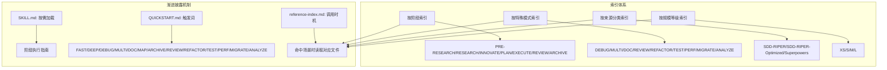
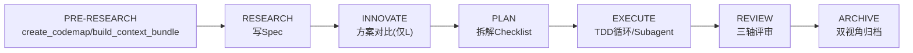
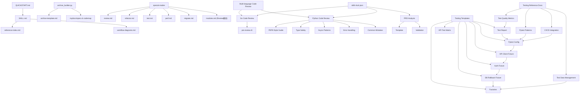

# 参考资料索引

<cite>
**本文引用的文件**
- [reference-index.md](file://altas-workflow/reference-index.md)
- [SKILL.md](file://altas-workflow/SKILL.md)
- [QUICKSTART.md](file://altas-workflow/QUICKSTART.md)
- [workflow-diagrams.md](file://altas-workflow/workflow-diagrams.md)
- [archive_builder.py](file://altas-workflow/scripts/archive_builder.py)
- [RIPER-DOC.md](file://altas-workflow/protocols/RIPER-DOC.md)
- [RIPER-5.md](file://altas-workflow/protocols/RIPER-5.md)
- [SDD-RIPER-DUAL-COOP.md](file://altas-workflow/protocols/SDD-RIPER-DUAL-COOP.md)
- [AI-原生研发范式-从代码中心到文档驱动的演进.md](file://altas-workflow/docs/AI-原生研发范式-从代码中心到文档驱动的演进.md)
- [spec-template.md](file://altas-workflow/references/spec-driven-development/spec-template.md)
- [spec-lite-template.md](file://altas-workflow/references/checkpoint-driven/spec-lite-template.md)
- [modules.md](file://altas-workflow/references/checkpoint-driven/modules.md)
- [sources.md](file://altas-workflow/references/entry/sources.md)
- [review.md](file://altas-workflow/references/special-modes/review.md)
- [refactor.md](file://altas-workflow/references/special-modes/refactor.md)
- [test.md](file://altas-workflow/references/special-modes/test.md)
- [perf.md](file://altas-workflow/references/special-modes/perf.md)
- [migrate.md](file://altas-workflow/references/special-modes/migrate.md)
- [go-code-review/SKILL.md](file://.agents/skills/go-code-review/SKILL.md)
- [python-code-review/SKILL.md](file://.agents/skills/python-code-review/SKILL.md)
- [specify-requirements/SKILL.md](file://.agents/skills/specify-requirements/SKILL.md)
- [go-code-review/assets/review-template.md](file://.agents/skills/go-code-review/assets/review-template.md)
- [go-code-review/references/WEB-SERVER.md](file://.agents/skills/go-code-review/references/WEB-SERVER.md)
- [go-code-review/scripts/pre-review.sh](file://.agents/skills/go-code-review/scripts/pre-review.sh)
- [python-code-review/references/pep8-style.md](file://.agents/skills/python-code-review/references/pep8-style.md)
- [python-code-review/references/type-safety.md](file://.agents/skills/python-code-review/references/type-safety.md)
- [python-code-review/references/async-patterns.md](file://.agents/skills/python-code-review/references/async-patterns.md)
- [python-code-review/references/error-handling.md](file://.agents/skills/python-code-review/references/error-handling.md)
- [python-code-review/references/common-mistakes.md](file://.agents/skills/python-code-review/references/common-mistakes.md)
- [specify-requirements/template.md](file://.agents/skills/specify-requirements/template.md)
- [specify-requirements/validation.md](file://.agents/skills/specify-requirements/validation.md)
- [skills-lock.json](file://skills-lock.json)
- [ci-cd-integration.md](file://altas-workflow/references/testing/ci-cd-integration.md)
- [pytest-patterns.md](file://altas-workflow/references/testing/pytest-patterns.md)
- [test-data-management.md](file://altas-workflow/references/testing/test-data-management.md)
- [test-quality-metrics.md](file://altas-workflow/references/testing/test-quality-metrics.md)
- [test_report.md](file://altas-workflow/references/testing/templates/test_report.md)
- [conftest.py](file://altas-workflow/references/testing/templates/conftest.py)
- [api_test_matrix.md](file://altas-workflow/references/testing/templates/api_test_matrix.md)
- [api_client_fixture.py](file://altas-workflow/references/testing/templates/api_client_fixture.py)
- [auth_fixture.py](file://altas-workflow/references/testing/templates/auth_fixture.py)
- [db_rollback_fixture.py](file://altas-workflow/references/testing/templates/db_rollback_fixture.py)
- [factories.py](file://altas-workflow/references/testing/templates/factories.py)
</cite>

## 更新摘要
**变更内容**
- 新增完整的测试模板体系，包含测试报告、pytest配置、API测试矩阵、客户端fixture、认证fixture、数据库回滚fixture和数据工厂
- 扩展测试参考文档，完善CI/CD集成、pytest模式、测试数据管理和质量度量体系
- 增强参考资料的完整性，支持从测试模板到质量度量的全链路测试参考

## 目录
1. [简介](#简介)
2. [项目结构](#项目结构)
3. [核心组件](#核心组件)
4. [架构总览](#架构总览)
5. [详细组件分析](#详细组件分析)
6. [依赖分析](#依赖分析)
7. [性能考虑](#性能考虑)
8. [故障排查指南](#故障排查指南)
9. [结论](#结论)
10. [附录](#附录)

## 简介
本文件为 ALTAS Workflow 的参考资料索引导航文档，旨在帮助用户快速定位所需技能与模板，实现"按需加载、渐进披露"的高效使用体验。索引体系涵盖：
- 按工作流阶段索引：从输入准备到知识沉淀的全流程参考
- 按特殊模式索引：DEBUG/MULTI/DOC/REVIEW/REFACTOR/TEST/PERF/MIGRATE/ANALYZE 等模式的专用参考
- 按来源分类索引：SDD-RIPER、SDD-RIPER-Optimized、Superpowers 等来源的权威参考
- 按规模等级索引：XS/S/M/L 的参考加载建议
- 多语言代码审查支持：Go和Python的专用审查技能
- PRD分析工作流：产品需求文档的结构化创建和验证
- 测试模板体系：完整的测试基础设施模板和最佳实践
- 参考资料搜索与筛选技巧：基于触发场景、调用时机与主题的检索方法

## 项目结构
ALTAS Workflow 的参考资料主要分布在以下目录：
- references/：三大来源的参考文件与模板
- protocols/：协议与模式定义
- docs/：方法论与团队落地指南
- scripts/：自动化工具（如归档生成器）
- .agents/skills/：新增的专业技能集合，包含代码审查和PRD分析
- references/testing/templates/：新增的完整测试模板体系
- 根目录 SKILL.md 与 QUICKSTART.md：工作流总纲与快速启动指南

```mermaid
graph TB
A["根目录"] --> B["references/"]
A --> C["protocols/"]
A --> D["docs/"]
A --> E["scripts/"]
A --> F["SKILL.md"]
A --> G["QUICKSTART.md"]
A --> H[".agents/skills/"]
B --> B1["spec-driven-development/"]
B --> B2["checkpoint-driven/"]
B --> B3["superpowers/"]
B --> B4["special-modes/"]
B --> B5["testing/"]
H --> H1["go-code-review/"]
H --> H2["python-code-review/"]
H --> H3["specify-requirements/"]
B5 --> B5a["templates/"]
B5 --> B5b["pytest-patterns.md"]
B5 --> B5c["test-data-management.md"]
B5 --> B5d["test-quality-metrics.md"]
B5 --> B5e["ci-cd-integration.md"]
B5a --> B5a1["test_report.md"]
B5a --> B5a2["conftest.py"]
B5a --> B5a3["api_test_matrix.md"]
B5a --> B5a4["api_client_fixture.py"]
B5a --> B5a5["auth_fixture.py"]
B5a --> B5a6["db_rollback_fixture.py"]
B5a --> B5a7["factories.py"]
H1 --> H1a["SKILL.md"]
H1 --> H1b["assets/"]
H1 --> H1c["references/"]
H1 --> H1d["scripts/"]
H2 --> H2a["SKILL.md"]
H2 --> H2b["references/"]
H3 --> H3a["SKILL.md"]
H3 --> H3b["template.md"]
H3 --> H3c["validation.md"]
C --> C1["RIPER-DOC.md"]
C --> C2["RIPER-5.md"]
C --> C3["SDD-RIPER-DUAL-COOP.md"]
D --> D1["AI-原生研发范式-从代码中心到文档驱动的演进.md"]
E --> E1["archive_builder.py"]
```



**图表来源**
- [reference-index.md:1-275](file://altas-workflow/reference-index.md#L1-L275)
- [SKILL.md:1-277](file://altas-workflow/SKILL.md#L1-L277)
- [QUICKSTART.md:1-193](file://altas-workflow/QUICKSTART.md#L1-L193)

**章节来源**
- [reference-index.md:1-275](file://altas-workflow/reference-index.md#L1-L275)
- [SKILL.md:1-277](file://altas-workflow/SKILL.md#L1-L277)
- [QUICKSTART.md:1-193](file://altas-workflow/QUICKSTART.md#L1-L193)

## 核心组件
- 参考资料总索引：统一发现入口，按阶段、模式、来源与规模提供参考清单与调用时机
- 工作流技能（SKILL.md）：整合 SDD-RIPER、Checkpoint-Driven 与 Superpowers 的核心能力，定义阶段执行指南与铁律约束
- 快速启动（QUICKSTART.md）：环境配置、一键命令、典型场景与 FAQ
- 流程图集（workflow-diagrams.md）：架构总览、阶段流程、铁律与门禁、Review 三轴、TDD 循环、特殊模式总览等可视化参考
- 归档脚本（archive_builder.py）：从 Spec/Codemap 生成双视角归档（human/llm）
- 特殊模式协议：新增的五种专业模式协议，覆盖代码审查、重构、测试、性能优化、数据迁移等专业场景
- **新增**：多语言代码审查技能，支持Go和Python的自动化代码质量检查
- **新增**：PRD分析工作流，提供产品需求文档的结构化创建和验证流程
- **新增**：完整的测试模板体系，包含测试报告、pytest配置、API测试矩阵、客户端fixture、认证fixture、数据库回滚fixture和数据工厂
- **新增**：测试参考文档，完善CI/CD集成、pytest模式、测试数据管理和质量度量体系

**章节来源**
- [reference-index.md:1-275](file://altas-workflow/reference-index.md#L1-L275)
- [SKILL.md:1-277](file://altas-workflow/SKILL.md#L1-L277)
- [workflow-diagrams.md:1-338](file://altas-workflow/workflow-diagrams.md#L1-L338)
- [archive_builder.py:1-505](file://altas-workflow/scripts/archive_builder.py#L1-L505)

## 架构总览
下图展示了 ALTAS Workflow 的三层索引与渐进披露机制：阶段索引（PRE-RESEARCH/RESEARCH/INNOVATE/PLAN/EXECUTE/REVIEW/ARCHIVE）、模式索引（DEBUG/MULTI/DOC/REVIEW/REFACTOR/TEST/PERF/MIGRATE/ANALYZE）、来源索引（SDD-RIPER/SDD-RIPER-Optimized/Superpowers）与规模索引（XS/S/M/L）协同工作，配合 SKILL.md 的"按需加载"与 QUICKSTART.md 的触发词，实现按需加载与检查点推进。



**图表来源**
- [SKILL.md:278-300](file://altas-workflow/SKILL.md#L278-L300)
- [reference-index.md:16-251](file://altas-workflow/reference-index.md#L16-L251)
- [QUICKSTART.md:36-49](file://altas-workflow/QUICKSTART.md#L36-L49)

**章节来源**
- [SKILL.md:278-300](file://altas-workflow/SKILL.md#L278-L300)
- [reference-index.md:16-251](file://altas-workflow/reference-index.md#L16-L251)
- [QUICKSTART.md:36-49](file://altas-workflow/QUICKSTART.md#L36-L49)

## 详细组件分析

### 按需加载指南

**更新** 新增详细的按需加载三层查找路径和优先级策略

当 `SKILL.md` 将任务路由到某一模式或阶段后，按以下顺序查找参考文件：

1. **最快路径**：从"按特殊模式索引"或"按工作流阶段索引"直接定位对应章节
2. **完整扫描**：需要了解全貌时，从"按来源分类索引"查看方法论来源  
3. **规模规划**：需要规划完整加载集时，从"按规模等级索引"确认所需文件

**优先级**：
- "按特殊模式"和"按工作流阶段"对 AI 来说最直观，是日常使用的主要入口
- "按来源"和"按规模"主要在需要了解方法论背景或规划完整加载集时使用

若路径读取失败，先使用全局搜索定位；若文件确实缺失，则按标准模式继续，并明确提醒用户依赖不完整。

**章节来源**
- [reference-index.md:6-19](file://altas-workflow/reference-index.md#L6-L19)

### 按工作流阶段索引

**更新** 改进了工作流阶段索引，增加了更多来源说明和调用时机

- PRE-RESEARCH：输入准备阶段，读取命令参数与上下文打包
- RESEARCH：研究对齐，写 Spec（M/L 与 S 的模板不同）
- INNOVATE：方案对比（仅 L）
- PLAN：详细规划，写 Plan 与 Checklist
- EXECUTE：执行实现，TDD 循环与 Subagent 驱动
- REVIEW：三轴评审（Spec-代码-质量）
- ARCHIVE：知识沉淀，双视角归档



**图表来源**
- [SKILL.md:140-218](file://altas-workflow/SKILL.md#L140-L218)
- [reference-index.md:39-103](file://altas-workflow/reference-index.md#L39-L103)

**章节来源**
- [SKILL.md:140-218](file://altas-workflow/SKILL.md#L140-L218)
- [reference-index.md:39-103](file://altas-workflow/reference-index.md#L39-L103)

### 按特殊模式索引

**更新** 新增了五种专业特殊模式协议，提供更精细的工作流控制

- DEBUG 模式：系统化排查，根因追踪、纵深防御、条件等待
- MULTI 模式：多项目协作，自动发现与作用域隔离
- DOC 模式：文档专家，Absorb→Outline→Author→Fact-Check
- REVIEW 模式：代码审查，三轴评审（Spec质量、一致性、代码质量）
- REFACTOR 模式：重构优化，CodeMap先行、坏味道识别、小步验证
- TEST 模式：测试补全，覆盖率分析、优先级排序、测试报告
- PERF 模式：性能优化，基准测试、Profile定位、优化验证
- MIGRATE 模式：数据迁移，风险评估、回滚方案、预演验证
- **新增** ANALYZE 模式：需求分析，PRD创建与验证，多角度评审

```mermaid
flowchart TB
D["DEBUG 模式"] --> D1["根因追踪"]
D --> D2["纵深防御"]
D --> D3["条件等待"]
M["MULTI 模式"] --> M1["自动发现子项目"]
M --> M2["CROSS跨项目协作"]
DC["DOC 模式"] --> DC1["Absorb提取上下文"]
DC --> DC2["Outline大纲"]
DC --> DC3["Author撰写"]
DC --> DC4["Fact-Check验证"]
R["REVIEW 模式"] --> R1["三轴评审"]
R --> R2["问题分级"]
R --> R3["审查报告"]
RF["REFACTOR 模式"] --> RF1["CodeMap先行"]
RF --> RF2["坏味道识别"]
RF --> RF3["小步重构"]
T["TEST 模式"] --> T1["覆盖率分析"]
T --> T2["优先级排序"]
T --> T3["测试报告"]
P["PERF 模式"] --> P1["基准测试"]
P --> P2["Profile定位"]
P --> P3["优化验证"]
MG["MIGRATE 模式"] --> MG1["风险评估"]
MG --> MG2["回滚方案"]
MG --> MG3["预演验证"]
A["ANALYZE 模式"] --> A1["PRD创建"]
A --> A2["需求分析"]
A --> A3["多角度验证"]
```



**图表来源**
- [SKILL.md:221-275](file://altas-workflow/SKILL.md#L221-L275)
- [reference-index.md:106-170](file://altas-workflow/reference-index.md#L106-L170)
- [RIPER-DOC.md:1-66](file://altas-workflow/protocols/RIPER-DOC.md#L1-L66)

**章节来源**
- [SKILL.md:221-275](file://altas-workflow/SKILL.md#L221-L275)
- [reference-index.md:106-170](file://altas-workflow/reference-index.md#L106-L170)
- [RIPER-DOC.md:1-66](file://altas-workflow/protocols/RIPER-DOC.md#L1-L66)

### 按来源分类索引

**更新** 改进了来源分类索引，增加了特殊模式的来源说明

- SDD-RIPER：Spec 驱动开发，包含完整协议、模板与方法论
- SDD-RIPER-Optimized：Checkpoint 驱动轻量模式，提供最小 Spec 与按需模块
- Superpowers：TDD、系统化调试、Subagent 驱动、并行 Agent、验证等能力
- Special Modes：新增的专项模式协议，涵盖代码审查、重构、测试、性能优化、数据迁移等专业场景
- **新增** Multi-language Code Review：支持Go和Python的多语言代码审查技能
- **新增** PRD Analysis Workflows：产品需求文档的结构化分析和创建工作流
- **新增** Testing Templates：完整的测试基础设施模板体系，包含测试报告、pytest配置、API测试矩阵、客户端fixture、认证fixture、数据库回滚fixture和数据工厂
- **新增** Testing Reference Documents：测试相关的参考文档，包括pytest模式、测试数据管理、质量度量和CI/CD集成

```mermaid
mindmap
root((来源))
SDD-RIPER
协议
模板
方法论
SDD-RIPER-Optimized
轻量Spec
按需模块
命名约定
Superpowers
TDD
系统化调试
Subagent驱动
并行Agent
验证
Special Modes
REVIEW
REFACTOR
TEST
PERF
MIGRATE
ANALYZE
专项协议
触发词
协作关系
Multi-language Code Review
Go Code Review
Python Code Review
自动化检查
PRD Analysis Workflows
PRD创建
需求分析
验证流程
Testing Templates
测试报告
pytest配置
API测试矩阵
客户端fixture
认证fixture
数据库回滚fixture
数据工厂
Testing Reference Documents
pytest模式
测试数据管理
质量度量
CI/CD集成
```

**图表来源**
- [reference-index.md:173-237](file://altas-workflow/reference-index.md#L173-L237)
- [AI-原生研发范式-从代码中心到文档驱动的演进.md:1-800](file://altas-workflow/docs/AI-原生研发范式-从代码中心到文档驱动的演进.md#L1-L800)

**章节来源**
- [reference-index.md:173-237](file://altas-workflow/reference-index.md#L173-L237)
- [AI-原生研发范式-从代码中心到文档驱动的演进.md:1-800](file://altas-workflow/docs/AI-原生研发范式-从代码中心到文档驱动的演进.md#L1-L800)

### 按规模等级索引

**更新** 改进了规模等级索引，提供了更详细的加载清单

- XS：无需加载任何参考
- S：按需加载最小 Spec 与命名约定
- M：标准加载（Spec 模板、命令参数、写 Plan、TDD、完成前验证、Review 模块）
- L：完整加载（M 的基础上增加 Innovate、Subagent、并行 Agent、多项目、归档、完成分支）

**章节来源**
- [reference-index.md:239-266](file://altas-workflow/reference-index.md#L239-L266)
- [SKILL.md:47-54](file://altas-workflow/SKILL.md#L47-L54)

### 多语言代码审查技能

**新增** 完整的多语言代码审查支持体系

#### Go 代码审查技能
- **自动化预审查**：集成gofmt、go vet、golangci-lint的预检查脚本
- **全面检查清单**：格式化、文档注释、错误处理、命名规范、并发安全、接口设计、数据结构、安全性、声明初始化、函数设计、风格规范、日志记录、导入管理、泛型使用、测试实践等
- **集成示例**：Web服务器综合示例，展示多种Go技能的实际应用
- **审查模板**：标准化的审查报告格式，支持Must Fix/Should Fix/Nits分级

#### Python 代码审查技能
- **PEP8风格指南**：缩进、行长、空行、导入分组、空白字符、命名约定、注释规范
- **类型安全检查**：类型注解、Any类型的合理使用、Union语法、泛型类型、TypedDict使用
- **异步模式审查**：阻塞调用检测、await使用、并发模式、异步上下文管理器、同步I/O处理
- **错误处理规范**：裸except检查、异常链保持、错误信息上下文、日志替代print
- **常见错误识别**：可变默认参数、print使用、字符串格式化、未使用变量、导入顺序、魔法数字、嵌套条件等

**章节来源**
- [.agents/skills/go-code-review/SKILL.md:1-184](file://.agents/skills/go-code-review/SKILL.md#L1-L184)
- [.agents/skills/python-code-review/SKILL.md:1-88](file://.agents/skills/python-code-review/SKILL.md#L1-L88)
- [.agents/skills/specify-requirements/SKILL.md:1-128](file://.agents/skills/specify-requirements/SKILL.md#L1-L128)

### PRD 分析工作流

**新增** 结构化的PRD创建和验证流程

#### 核心功能
- **需求文档创建**：基于模板的PRD结构化创建，包含愿景、问题陈述、价值主张等
- **用户画像构建**：主用户画像和次要用户画像的详细描述
- **用户旅程映射**：主要和次要用户旅程的端到端流程
- **功能需求定义**：Must Have/Should Have/Could Have/Won't Have的MoSCoW分类
- **验收标准制定**：Gherkin格式的可测试验收标准
- **成功指标设定**：关键绩效指标和跟踪要求
- **约束和假设管理**：项目约束、假设条件和风险缓解

#### 工作流程
1. **头脑风暴**：理解问题本质、约束条件和成功标准
2. **发现阶段**：识别模板要求的缺失信息
3. **文档阶段**：基于发现结果更新PRD内容
4. **评审阶段**：向用户展示所有发现和需要澄清的问题
5. **验证阶段**：运行验证清单和多角度最终验证

**章节来源**
- [.agents/skills/specify-requirements/SKILL.md:1-128](file://.agents/skills/specify-requirements/SKILL.md#L1-L128)
- [.agents/skills/specify-requirements/template.md:1-220](file://.agents/skills/specify-requirements/template.md#L1-L220)
- [.agents/skills/specify-requirements/validation.md:1-70](file://.agents/skills/specify-requirements/validation.md#L1-L70)

### 测试模板体系

**新增** 完整的测试基础设施模板体系

#### 测试报告模板
- **标准化格式**：包含测试范围、契约来源、测试框架、运行命令、执行环境等基本信息
- **策略摘要**：测试级别、风险优先级矩阵、需求/契约追溯性、Mock/Stub/Fake策略、测试数据策略、质量门禁
- **结果统计**：总测试数、通过、失败、跳过等关键指标
- **质量度量**：覆盖率、通过率、易碎性风险、慢测试、Mock比例等核心指标
- **问题跟踪**：新增测试清单、失败测试与归因、剩余缺口等

#### Pytest 配置模板
- **共享引导模板**：包含markers注册、API基础URL、默认超时、测试运行元数据等
- **环境隔离**：集中化API基础URL、HTTP超时、运行环境、构建ID等配置
- **自动重置**：测试环境变量自动重置、确定性默认值设置

#### API 测试矩阵
- **契约来源**：OpenAPI规范、GraphQL schema、gRPC定义等
- **测试矩阵**：契约条目、源引用、优先级、Happy Path、验证、认证、幂等性、错误路径、Schema、数据/Fixture、状态、备注等
- **缺口管理**：P0/P1剩余缺口、延期项目管理

#### 客户端与认证模板
- **API 客户端**：requests封装、会话管理、超时控制、请求方法抽象
- **认证夹具**：测试凭证管理、访问令牌获取、认证头注入、管理员权限处理
- **数据库回滚**：SQLAlchemy事务包装、测试后自动回滚、依赖注入替换

#### 数据工厂模板
- **Factory Boy 集成**：用户、管理员、订单等核心实体工厂
- **Faker 集成**：真实感数据生成、本地化支持、自定义Provider
- **批量创建**：测试数据池、关联对象创建、惰性求值优化

**章节来源**
- [test_report.md:1-59](file://altas-workflow/references/testing/templates/test_report.md#L1-L59)
- [conftest.py:1-49](file://altas-workflow/references/testing/templates/conftest.py#L1-L49)
- [api_test_matrix.md:1-29](file://altas-workflow/references/testing/templates/api_test_matrix.md#L1-L29)
- [api_client_fixture.py:1-57](file://altas-workflow/references/testing/templates/api_client_fixture.py#L1-L57)
- [auth_fixture.py:1-51](file://altas-workflow/references/testing/templates/auth_fixture.py#L1-L51)
- [db_rollback_fixture.py:1-43](file://altas-workflow/references/testing/templates/db_rollback_fixture.py#L1-L43)
- [factories.py:1-50](file://altas-workflow/references/testing/templates/factories.py#L1-L50)

### 测试参考文档

**新增** 完整的测试参考文档体系

#### Pytest 模式参考
- **核心原则**：AAA模式、单一职责、独立执行、纯assert断言
- **Fixture 模式**：基本fixture、作用域管理、依赖链、工厂模式、autouse自动执行
- **参数化测试**：基本参数化、带ID参数化、多个参数组合、参数化fixture
- **Mock 与 Monkeypatch**：monkeypatch自动恢复、unittest.mock使用、副作用处理
- **测试组织**：目录结构、conftest共享、markers分类、测试类组织
- **常用内置fixture**：tmp_path、capsys、caplog、monkeypatch等
- **异常测试**：异常捕获、自定义异常、异常信息验证
- **异步测试**：asyncio支持、超时处理、并发测试
- **覆盖率**：运行覆盖率、配置管理、排除代码
- **常用命令**：pytest命令行选项、过滤器、调试器
- **最佳实践**：一测试一行为、描述性命名、AAA模式、独立执行、适当作用域、关注行为而非实现、80%+覆盖率
- **常用插件**：pytest-cov、pytest-xdist、pytest-asyncio、pytest-mock、pytest-timeout、pytest-html、pytest-benchmark、hypothesis、factory-boy、faker

#### 测试数据管理策略
- **核心原则**：数据独立性、可重复性、真实性、最小化、自清理
- **测试数据层次架构**：Unit（纯内存）、Component（SQLite内存/ Mock）、Integration（Test Container）、E2E（Docker Compose环境）
- **Factory Boy 集成**：声明式定义、链式创建、惰性求值、可覆盖、批量生成
- **Faker 库深度使用**：常用Provider速查、本地化支持、自定义Provider
- **测试数据隔离策略**：事务回滚、物理删除、Schema重建、并发测试数据处理
- **测试数据版本管理**：Seed数据与迁移同步、敏感数据脱敏规则、测试数据配置管理
- **性能优化技巧**：惰性加载、批量预生成、数据库级别优化
- **最佳实践清单**：数据质量、数据隔离、性能考量、维护性检查项
- **常见反模式**：硬编码测试数据、共享可变全局状态、测试间依赖顺序、清理逻辑遗漏、过度Mock真实数据、使用真实PII数据

#### 测试质量度量体系
- **核心原则**：可量化、可比较、可行动、自动化、分层级
- **一级指标**：测试覆盖率、测试通过率、Flaky Rate、测试执行时间
- **二级指标**：断言密度、Mock比例、测试复杂度、代码-测试比
- **三级指标**：缺陷检出率、MTTD、回归防护度、测试维护成本
- **详细指标定义与测量**：覆盖率配置、通过率门禁、Flaky检测、执行时间监控、断言密度分析、Mock比例控制
- **综合质量评分卡**：评分算法、权重分配、等级划分、报告生成
- **质量门禁配置**：CI/CD门禁示例、严格检查规则、自动化验证

#### CI/CD 测试集成指南
- **核心原则**：快速反馈、稳定可靠、全面覆盖、清晰报告、成本可控
- **GitHub Actions 完整模板**：基础模板、高级模板（并行化和缓存优化）、服务容器配置
- **GitLab CI 模板**：阶段定义、缓存策略、测试报告、覆盖率集成
- **测试优化策略**：并行化执行、缓存策略、测试分片、超时控制、Flaky测试重试机制
- **覆盖率报告与门禁**：Codecov集成、覆盖率门禁检查、覆盖率趋势监控
- **测试结果通知**：Slack通知、Jira集成、邮件通知

**章节来源**
- [pytest-patterns.md:1-741](file://altas-workflow/references/testing/pytest-patterns.md#L1-L741)
- [test-data-management.md:1-769](file://altas-workflow/references/testing/test-data-management.md#L1-L769)
- [test-quality-metrics.md:1-900](file://altas-workflow/references/testing/test-quality-metrics.md#L1-L900)
- [ci-cd-integration.md:1-1144](file://altas-workflow/references/testing/ci-cd-integration.md#L1-L1144)

### 参考资料搜索与筛选技巧

**更新** 增强了搜索与筛选技巧，增加了特殊模式的专业检索方法

- 基于触发场景：在 SKILL.md 的"参考资料索引（按需加载）"中查找对应文件
- 基于调用时机：参考 reference-index.md 的"调用时机"列，命中场景时再读取
- 基于主题：在按来源分类索引中按主题检索（如"写 Spec""TDD""Debug""Review""Refactor""Test""Perf""Migrate""Analyze""Testing"）
- 基于规模：根据规模等级选择参考清单，避免不必要的加载
- 基于模式：通过特殊模式索引快速定位专业场景的参考文件
- **新增**：多语言代码审查的按语言筛选，支持Go和Python的差异化审查
- **新增**：PRD分析的按阶段筛选，支持需求文档创建的完整流程
- **新增**：测试模板的按功能筛选，支持测试报告、pytest配置、API测试矩阵、客户端fixture、认证fixture、数据库回滚fixture和数据工厂的快速定位
- **新增**：测试参考文档的按主题筛选，支持pytest模式、测试数据管理、质量度量和CI/CD集成的专业检索
- **新增**：使用三层查找路径（最快路径→完整扫描→规模规划）提高检索效率

**章节来源**
- [SKILL.md:278-300](file://altas-workflow/SKILL.md#L278-L300)
- [reference-index.md:6-19](file://altas-workflow/reference-index.md#L6-L19)

## 依赖分析

**更新** 增加了特殊模式协议的相互协作关系

- SKILL.md 依赖 reference-index.md 的调用时机指引与来源索引
- QUICKSTART.md 与 SKILL.md 协同定义触发词与规模评估
- workflow-diagrams.md 为 SKILL.md 的阶段执行提供可视化参考
- archive_builder.py 依赖 references/spec-driven-development/archive-template.md 与 mydocs 下的 Spec/Codemap 产物
- special-modes 模块相互协作，形成完整的开发工作流闭环
- **新增**：多语言代码审查技能与自动化工具的集成依赖
- **新增**：PRD分析工作流与模板验证系统的协作关系
- **新增**：skills-lock.json管理外部技能源的版本控制
- **新增**：测试模板体系与测试参考文档的依赖关系，形成完整的测试基础设施
- **新增**：测试模板之间的协作关系，如conftest.py与各种fixture的集成使用



**图表来源**
- [SKILL.md:278-300](file://altas-workflow/SKILL.md#L278-L300)
- [reference-index.md:1-275](file://altas-workflow/reference-index.md#L1-L275)
- [workflow-diagrams.md:1-338](file://altas-workflow/workflow-diagrams.md#L1-L338)
- [archive_builder.py:1-505](file://altas-workflow/scripts/archive_builder.py#L1-L505)
- [skills-lock.json:1-20](file://skills-lock.json#L1-L20)

**章节来源**
- [SKILL.md:278-300](file://altas-workflow/SKILL.md#L278-L300)
- [reference-index.md:1-275](file://altas-workflow/reference-index.md#L1-L275)
- [workflow-diagrams.md:1-338](file://altas-workflow/workflow-diagrams.md#L1-L338)
- [archive_builder.py:1-505](file://altas-workflow/scripts/archive_builder.py#L1-L505)
- [skills-lock.json:1-20](file://skills-lock.json#L1-L20)

## 性能考虑

**更新** 增加了特殊模式的专业性能考虑

- 渐进披露：仅在命中场景时按需加载参考文件，避免一次性加载全部内容
- 规模评估：根据任务复杂度自动选择 XS/S/M/L，减少不必要的上下文与模板加载
- 检查点推进：每步完成后输出检查点，便于中断与恢复，降低无效计算
- 模式专业化：通过专门的模式文件提供针对性指导，提高特定场景的执行效率
- **新增**：多语言代码审查的按需模块（Deep/Debug/Review/Multi）支持 Hot/Warm/Cold 上下文策略，进一步优化性能
- **新增**：PRD分析的迭代式工作流，支持并行代理处理不同需求领域的分析任务
- **新增**：自动化预审查工具的批量处理能力，支持大规模代码库的快速质量检查
- **新增**：测试模板体系的性能优化，包括惰性加载、批量预生成、数据库级别优化等策略
- **新增**：测试数据管理的性能考量，支持不同测试层级的数据隔离策略

## 故障排查指南

**更新** 增加了特殊模式的故障排查指导

- 常见问题（FAQ）：关于一次性输出过多、TDD 速度、中途干预、提交 Git、规模选择、参考资料按需加载、多人协作、模型选择等
- 铁律与门禁：No Spec No Code、No Approval No Execute、Evidence First、Root Cause 必须等
- 特殊模式：DEBUG 模式下的系统化排查流程与技巧，REVIEW 模式的三轴评审标准，REFACTOR 模式的重构纪律
- 模式协作：各模式间的协作关系与触发条件，如 REVIEW → REFACTOR/DEBUG/TEST 的决策流程
- **新增**：多语言代码审查的常见问题排查，包括工具安装、配置问题、审查标准争议等
- **新增**：PRD分析的协作问题处理，包括需求澄清、多方评审、版本控制等
- **新增**：特殊模式的门禁逻辑和异常处理，如 REVIEW 模式的 P0-P3 问题分级、REFACTOR 模式的回滚方案、TEST 模式的覆盖率验证
- **新增**：测试模板体系的故障排查，包括pytest配置问题、fixture冲突、测试数据隔离失败等
- **新增**：测试参考文档的使用指导，包括pytest命令行选项、覆盖率配置、质量度量指标解释等

**章节来源**
- [QUICKSTART.md:130-163](file://altas-workflow/QUICKSTART.md#L130-L163)
- [SKILL.md:90-102](file://altas-workflow/SKILL.md#L90-L102)
- [SKILL.md:230-240](file://altas-workflow/SKILL.md#L230-L240)

## 结论

**更新** 增加了特殊模式对工作流完整性的贡献

通过"阶段索引 + 模式索引 + 来源索引 + 规模索引"的四维索引体系，结合 SKILL.md 的渐进披露与 QUICKSTART.md 的触发词，用户可以在不同复杂度的任务中快速定位所需参考，实现"按需加载、检查点推进、铁律约束"的高效开发流程。新增的五种特殊模式（REVIEW、REFACTOR、TEST、PERF、MIGRATE）进一步完善了 ALTAS Workflow 的专业能力矩阵，覆盖了从基础开发到专业优化的完整生命周期。

**新增**：多语言代码审查技能和PRD分析工作流的加入，使 ALTAS Workflow 能够支持更广泛的软件开发生命周期场景，从代码质量保证到产品需求分析，为用户提供从技术实现到业务理解的全方位支持。

**新增**：完整的测试模板体系和测试参考文档的完善，为用户提供了从测试基础设施搭建到质量度量的全链路支持，确保测试工作的标准化和自动化。

## 附录

**更新** 增加了特殊模式的触发词和协作关系

- 触发词速查：FAST/DEEP/DEBUG/MULTI/DOC/MAP/ARCHIVE/REVIEW/REFACTOR/TEST/PERF/MIGRATE/ANALYZE 等
- 规模评估速查：XS/S/M/L 的推荐触发条件与工作流
- 产物命名约定：Spec、Codemap、Context、Archive 的统一命名规范
- 模式协作速查：各特殊模式间的协作关系与触发条件
- **新增**：多语言代码审查技能的触发词，包括Go和Python的差异化应用场景
- **新增**：PRD分析工作流的协作关系，包括头脑风暴、发现、文档、评审、验证的完整流程
- **新增**：测试模板体系的触发词，包括测试报告、pytest配置、API测试矩阵、客户端fixture、认证fixture、数据库回滚fixture和数据工厂的应用场景
- **新增**：测试参考文档的协作关系，包括pytest模式、测试数据管理、质量度量和CI/CD集成的配合使用
- **新增**：skills-lock.json中的外部技能源管理，包括go-code-review、python-code-review、specify-requirements的版本控制

**章节来源**
- [SKILL.md:61-73](file://altas-workflow/SKILL.md#L61-L73)
- [SKILL.md:47-54](file://altas-workflow/SKILL.md#L47-L54)
- [SKILL.md:302-315](file://altas-workflow/SKILL.md#L302-L315)
- [skills-lock.json:1-20](file://skills-lock.json#L1-L20)