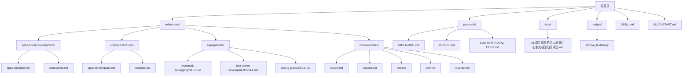
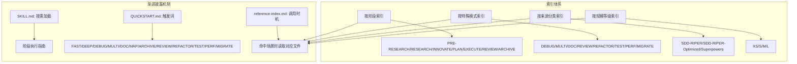
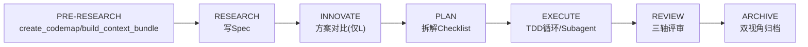
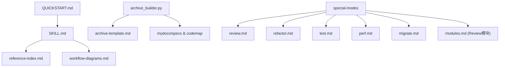

# 参考资料索引

<cite>
**本文引用的文件**
- [reference-index.md](file://altas-workflow/reference-index.md)
- [SKILL.md](file://altas-workflow/SKILL.md)
- [QUICKSTART.md](file://altas-workflow/QUICKSTART.md)
- [workflow-diagrams.md](file://altas-workflow/workflow-diagrams.md)
- [archive_builder.py](file://altas-workflow/scripts/archive_builder.py)
- [RIPER-DOC.md](file://altas-workflow/protocols/RIPER-DOC.md)
- [RIPER-5.md](file://altas-workflow/protocols/RIPER-5.md)
- [SDD-RIPER-DUAL-COOP.md](file://altas-workflow/protocols/SDD-RIPER-DUAL-COOP.md)
- [AI-原生研发范式-从代码中心到文档驱动的演进.md](file://altas-workflow/docs/AI-原生研发范式-从代码中心到文档驱动的演进.md)
- [spec-template.md](file://altas-workflow/references/spec-driven-development/spec-template.md)
- [spec-lite-template.md](file://altas-workflow/references/checkpoint-driven/spec-lite-template.md)
- [SKILL.md（系统化调试）](file://altas-workflow/references/superpowers/systematic-debugging/SKILL.md)
- [SKILL.md（测试驱动开发）](file://altas-workflow/references/superpowers/test-driven-development/SKILL.md)
- [SKILL.md（写计划）](file://altas-workflow/references/superpowers/writing-plans/SKILL.md)
- [review.md](file://altas-workflow/references/special-modes/review.md)
- [refactor.md](file://altas-workflow/references/special-modes/refactor.md)
- [test.md](file://altas-workflow/references/special-modes/test.md)
- [perf.md](file://altas-workflow/references/special-modes/perf.md)
- [migrate.md](file://altas-workflow/references/special-modes/migrate.md)
- [modules.md](file://altas-workflow/references/checkpoint-driven/modules.md)
- [sources.md](file://altas-workflow/references/entry/sources.md)
</cite>

## 更新摘要
**变更内容**
- 新增特殊模式索引系统，包含 REVIEW、REFACTOR、TEST、PERF、MIGRATE 五种专业模式
- 增强按需加载指南，提供三层查找路径和优先级策略
- 改进工作流阶段索引，增加更多来源说明和调用时机
- 完善参考资料搜索与筛选技巧，支持多维度检索

## 目录
1. [简介](#简介)
2. [项目结构](#项目结构)
3. [核心组件](#核心组件)
4. [架构总览](#架构总览)
5. [详细组件分析](#详细组件分析)
6. [依赖分析](#依赖分析)
7. [性能考虑](#性能考虑)
8. [故障排查指南](#故障排查指南)
9. [结论](#结论)
10. [附录](#附录)

## 简介
本文件为 ALTAS Workflow 的参考资料索引导航文档，旨在帮助用户快速定位所需技能与模板，实现"按需加载、渐进披露"的高效使用体验。索引体系涵盖：
- 按工作流阶段索引：从输入准备到知识沉淀的全流程参考
- 按特殊模式索引：DEBUG/MULTI/DOC/REVIEW/REFACTOR/TEST/PERF/MIGRATE 等模式的专用参考
- 按来源分类索引：SDD-RIPER、SDD-RIPER-Optimized、Superpowers 等来源的权威参考
- 按规模等级索引：XS/S/M/L 的参考加载建议
- 参考资料搜索与筛选技巧：基于触发场景、调用时机与主题的检索方法

## 项目结构
ALTAS Workflow 的参考资料主要分布在以下目录：
- references/：三大来源的参考文件与模板
- protocols/：协议与模式定义
- docs/：方法论与团队落地指南
- scripts/：自动化工具（如归档生成器）
- 根目录 SKILL.md 与 QUICKSTART.md：工作流总纲与快速启动指南



**图表来源**
- [reference-index.md:1-274](file://altas-workflow/reference-index.md#L1-L274)
- [SKILL.md:1-277](file://altas-workflow/SKILL.md#L1-L277)
- [QUICKSTART.md:1-193](file://altas-workflow/QUICKSTART.md#L1-L193)

**章节来源**
- [reference-index.md:1-274](file://altas-workflow/reference-index.md#L1-L274)
- [SKILL.md:1-277](file://altas-workflow/SKILL.md#L1-L277)
- [QUICKSTART.md:1-193](file://altas-workflow/QUICKSTART.md#L1-L193)

## 核心组件
- 参考资料总索引：统一发现入口，按阶段、模式、来源与规模提供参考清单与调用时机
- 工作流技能（SKILL.md）：整合 SDD-RIPER、Checkpoint-Driven 与 Superpowers 的核心能力，定义阶段执行指南与铁律约束
- 快速启动（QUICKSTART.md）：环境配置、一键命令、典型场景与 FAQ
- 流程图集（workflow-diagrams.md）：架构总览、阶段流程、铁律与门禁、Review 三轴、TDD 循环、特殊模式总览等可视化参考
- 归档脚本（archive_builder.py）：从 Spec/Codemap 生成双视角归档（human/llm）
- 特殊模式协议：新增的五种专业模式协议，覆盖代码审查、重构、测试、性能优化、数据迁移等专业场景

**章节来源**
- [reference-index.md:1-274](file://altas-workflow/reference-index.md#L1-L274)
- [SKILL.md:1-277](file://altas-workflow/SKILL.md#L1-L277)
- [workflow-diagrams.md:1-338](file://altas-workflow/workflow-diagrams.md#L1-L338)
- [archive_builder.py:1-505](file://altas-workflow/scripts/archive_builder.py#L1-L505)

## 架构总览
下图展示了 ALTAS Workflow 的三层索引与渐进披露机制：阶段索引（PRE-RESEARCH/RESEARCH/INNOVATE/PLAN/EXECUTE/REVIEW/ARCHIVE）、模式索引（DEBUG/MULTI/DOC/REVIEW/REFACTOR/TEST/PERF/MIGRATE）、来源索引（SDD-RIPER/SDD-RIPER-Optimized/Superpowers）与规模索引（XS/S/M/L）协同工作，配合 SKILL.md 的"按需加载"与 QUICKSTART.md 的触发词，实现按需加载与检查点推进。



**图表来源**
- [SKILL.md:278-300](file://altas-workflow/SKILL.md#L278-L300)
- [reference-index.md:16-251](file://altas-workflow/reference-index.md#L16-L251)
- [QUICKSTART.md:36-49](file://altas-workflow/QUICKSTART.md#L36-L49)

**章节来源**
- [SKILL.md:278-300](file://altas-workflow/SKILL.md#L278-L300)
- [reference-index.md:16-251](file://altas-workflow/reference-index.md#L16-L251)
- [QUICKSTART.md:36-49](file://altas-workflow/QUICKSTART.md#L36-L49)

## 详细组件分析

### 按需加载指南

**更新** 新增详细的按需加载三层查找路径和优先级策略

当 `SKILL.md` 将任务路由到某一模式或阶段后，按以下顺序查找参考文件：

1. **最快路径**：从"按特殊模式索引"或"按工作流阶段索引"直接定位对应章节
2. **完整扫描**：需要了解全貌时，从"按来源分类索引"查看方法论来源  
3. **规模规划**：需要规划完整加载集时，从"按规模等级索引"确认所需文件

**优先级**：
- "按特殊模式"和"按工作流阶段"对 AI 来说最直观，是日常使用的主要入口
- "按来源"和"按规模"主要在需要了解方法论背景或规划完整加载集时使用

若路径读取失败，先使用全局搜索定位；若文件确实缺失，则按标准模式继续，并明确提醒用户依赖不完整。

**章节来源**
- [reference-index.md:6-19](file://altas-workflow/reference-index.md#L6-L19)

### 按工作流阶段索引

**更新** 改进了工作流阶段索引，增加了更多来源说明和调用时机

- PRE-RESEARCH：输入准备阶段，读取命令参数与上下文打包
- RESEARCH：研究对齐，写 Spec（M/L 与 S 的模板不同）
- INNOVATE：方案对比（仅 L）
- PLAN：详细规划，写 Plan 与 Checklist
- EXECUTE：执行实现，TDD 循环与 Subagent 驱动
- REVIEW：三轴评审（Spec-代码-质量）
- ARCHIVE：知识沉淀，双视角归档



**图表来源**
- [SKILL.md:140-218](file://altas-workflow/SKILL.md#L140-L218)
- [reference-index.md:39-103](file://altas-workflow/reference-index.md#L39-L103)

**章节来源**
- [SKILL.md:140-218](file://altas-workflow/SKILL.md#L140-L218)
- [reference-index.md:39-103](file://altas-workflow/reference-index.md#L39-L103)

### 按特殊模式索引

**更新** 新增了五种专业特殊模式协议，提供更精细的工作流控制

- DEBUG 模式：系统化排查，根因追踪、纵深防御、条件等待
- MULTI 模式：多项目协作，自动发现与作用域隔离
- DOC 模式：文档专家，Absorb→Outline→Author→Fact-Check
- REVIEW 模式：代码审查，三轴评审（Spec质量、一致性、代码质量）
- REFACTOR 模式：重构优化，CodeMap先行、坏味道识别、小步验证
- TEST 模式：测试补全，覆盖率分析、优先级排序、测试报告
- PERF 模式：性能优化，基准测试、Profile定位、优化验证
- MIGRATE 模式：数据迁移，风险评估、回滚方案、预演验证

```mermaid
flowchart TB
D["DEBUG 模式"] --> D1["根因追踪"]
D --> D2["纵深防御"]
D --> D3["条件等待"]
M["MULTI 模式"] --> M1["自动发现子项目"]
M --> M2["CROSS跨项目协作"]
DC["DOC 模式"] --> DC1["Absorb提取上下文"]
DC --> DC2["Outline大纲"]
DC --> DC3["Author撰写"]
DC --> DC4["Fact-Check验证"]
R["REVIEW 模式"] --> R1["三轴评审"]
R --> R2["问题分级"]
R --> R3["审查报告"]
RF["REFACTOR 模式"] --> RF1["CodeMap先行"]
RF --> RF2["坏味道识别"]
RF --> RF3["小步重构"]
T["TEST 模式"] --> T1["覆盖率分析"]
T --> T2["优先级排序"]
T --> T3["测试报告"]
P["PERF 模式"] --> P1["基准测试"]
P --> P2["Profile定位"]
P --> P3["优化验证"]
MG["MIGRATE 模式"] --> MG1["风险评估"]
MG --> MG2["回滚方案"]
MG --> MG3["预演验证"]
```



**图表来源**
- [SKILL.md:221-275](file://altas-workflow/SKILL.md#L221-L275)
- [reference-index.md:106-170](file://altas-workflow/reference-index.md#L106-L170)
- [RIPER-DOC.md:1-66](file://altas-workflow/protocols/RIPER-DOC.md#L1-L66)

**章节来源**
- [SKILL.md:221-275](file://altas-workflow/SKILL.md#L221-L275)
- [reference-index.md:106-170](file://altas-workflow/reference-index.md#L106-L170)
- [RIPER-DOC.md:1-66](file://altas-workflow/protocols/RIPER-DOC.md#L1-L66)

### 按来源分类索引

**更新** 改进了来源分类索引，增加了特殊模式的来源说明

- SDD-RIPER：Spec 驱动开发，包含完整协议、模板与方法论
- SDD-RIPER-Optimized：Checkpoint 驱动轻量模式，提供最小 Spec 与按需模块
- Superpowers：TDD、系统化调试、Subagent 驱动、并行 Agent、验证等能力
- Special Modes：新增的专项模式协议，涵盖代码审查、重构、测试、性能优化、数据迁移等专业场景

```mermaid
mindmap
root((来源))
SDD-RIPER
协议
模板
方法论
SDD-RIPER-Optimized
轻量Spec
按需模块
命名约定
Superpowers
TDD
系统化调试
Subagent驱动
并行Agent
验证
Special Modes
REVIEW
REFACTOR
TEST
PERF
MIGRATE
专项协议
触发词
协作关系
```

**图表来源**
- [reference-index.md:173-237](file://altas-workflow/reference-index.md#L173-L237)
- [AI-原生研发范式-从代码中心到文档驱动的演进.md:1-800](file://altas-workflow/docs/AI-原生研发范式-从代码中心到文档驱动的演进.md#L1-L800)

**章节来源**
- [reference-index.md:173-237](file://altas-workflow/reference-index.md#L173-L237)
- [AI-原生研发范式-从代码中心到文档驱动的演进.md:1-800](file://altas-workflow/docs/AI-原生研发范式-从代码中心到文档驱动的演进.md#L1-L800)

### 按规模等级索引

**更新** 改进了规模等级索引，提供了更详细的加载清单

- XS：无需加载任何参考
- S：按需加载最小 Spec 与命名约定
- M：标准加载（Spec 模板、命令参数、写 Plan、TDD、完成前验证、Review 模块）
- L：完整加载（M 的基础上增加 Innovate、Subagent、并行 Agent、多项目、归档、完成分支）

**章节来源**
- [reference-index.md:239-266](file://altas-workflow/reference-index.md#L239-L266)
- [SKILL.md:47-54](file://altas-workflow/SKILL.md#L47-L54)

### 参考资料搜索与筛选技巧

**更新** 增强了搜索与筛选技巧，增加了特殊模式的专业检索方法

- 基于触发场景：在 SKILL.md 的"参考资料索引（按需加载）"中查找对应文件
- 基于调用时机：参考 reference-index.md 的"调用时机"列，命中场景时再读取
- 基于主题：在按来源分类索引中按主题检索（如"写 Spec""TDD""Debug""Review""Refactor""Test""Perf""Migrate"）
- 基于规模：根据规模等级选择参考清单，避免不必要的加载
- 基于模式：通过特殊模式索引快速定位专业场景的参考文件
- **新增**：使用三层查找路径（最快路径→完整扫描→规模规划）提高检索效率

**章节来源**
- [SKILL.md:278-300](file://altas-workflow/SKILL.md#L278-L300)
- [reference-index.md:6-19](file://altas-workflow/reference-index.md#L6-L19)

## 依赖分析

**更新** 增加了特殊模式协议的相互协作关系

- SKILL.md 依赖 reference-index.md 的调用时机指引与来源索引
- QUICKSTART.md 与 SKILL.md 协同定义触发词与规模评估
- workflow-diagrams.md 为 SKILL.md 的阶段执行提供可视化参考
- archive_builder.py 依赖 references/spec-driven-development/archive-template.md 与 mydocs 下的 Spec/Codemap 产物
- special-modes 模块相互协作，形成完整的开发工作流闭环
- **新增**：special-modes 模块之间存在协作关系，如 REVIEW → REFACTOR/DEBUG/TEST 的决策流程



**图表来源**
- [SKILL.md:278-300](file://altas-workflow/SKILL.md#L278-L300)
- [reference-index.md:1-274](file://altas-workflow/reference-index.md#L1-L274)
- [workflow-diagrams.md:1-338](file://altas-workflow/workflow-diagrams.md#L1-L338)
- [archive_builder.py:1-505](file://altas-workflow/scripts/archive_builder.py#L1-L505)

**章节来源**
- [SKILL.md:278-300](file://altas-workflow/SKILL.md#L278-L300)
- [reference-index.md:1-274](file://altas-workflow/reference-index.md#L1-L274)
- [workflow-diagrams.md:1-338](file://altas-workflow/workflow-diagrams.md#L1-L338)
- [archive_builder.py:1-505](file://altas-workflow/scripts/archive_builder.py#L1-L505)

## 性能考虑

**更新** 增加了特殊模式的专业性能考虑

- 渐进披露：仅在命中场景时按需加载参考文件，避免一次性加载全部内容
- 规模评估：根据任务复杂度自动选择 XS/S/M/L，减少不必要的上下文与模板加载
- 检查点推进：每步完成后输出检查点，便于中断与恢复，降低无效计算
- 模式专业化：通过专门的模式文件提供针对性指导，提高特定场景的执行效率
- **新增**：特殊模式的按需模块（Deep/Debug/Review/Multi）支持 Hot/Warm/Cold 上下文策略，进一步优化性能

## 故障排查指南

**更新** 增加了特殊模式的故障排查指导

- 常见问题（FAQ）：关于一次性输出过多、TDD 速度、中途干预、提交 Git、规模选择、参考资料按需加载、多人协作、模型选择等
- 铁律与门禁：No Spec No Code、No Approval No Execute、Evidence First、Root Cause 必须等
- 特殊模式：DEBUG 模式下的系统化排查流程与技巧，REVIEW 模式的三轴评审标准，REFACTOR 模式的重构纪律
- 模式协作：各模式间的协作关系与触发条件，如 REVIEW → REFACTOR/DEBUG/TEST 的决策流程
- **新增**：特殊模式的门禁逻辑和异常处理，如 REVIEW 模式的 P0-P3 问题分级、REFACTOR 模式的回滚方案、TEST 模式的覆盖率验证

**章节来源**
- [QUICKSTART.md:130-163](file://altas-workflow/QUICKSTART.md#L130-L163)
- [SKILL.md:90-102](file://altas-workflow/SKILL.md#L90-L102)
- [SKILL.md:230-240](file://altas-workflow/SKILL.md#L230-L240)

## 结论

**更新** 增加了特殊模式对工作流完整性的贡献

通过"阶段索引 + 模式索引 + 来源索引 + 规模索引"的四维索引体系，结合 SKILL.md 的渐进披露与 QUICKSTART.md 的触发词，用户可以在不同复杂度的任务中快速定位所需参考，实现"按需加载、检查点推进、铁律约束"的高效开发流程。新增的五种特殊模式（REVIEW、REFACTOR、TEST、PERF、MIGRATE）进一步完善了 ALTAS Workflow 的专业能力矩阵，覆盖了从基础开发到专业优化的完整生命周期，为用户提供从代码审查到性能优化的全方位支持。

## 附录

**更新** 增加了特殊模式的触发词和协作关系

- 触发词速查：FAST/DEEP/DEBUG/MULTI/DOC/MAP/ARCHIVE/REVIEW/REFACTOR/TEST/PERF/MIGRATE 等
- 规模评估速查：XS/S/M/L 的推荐触发条件与工作流
- 产物命名约定：Spec、Codemap、Context、Archive 的统一命名规范
- 模式协作速查：各特殊模式间的协作关系与触发条件
- **新增**：特殊模式触发词速查表，包含 REVIEW、REFACTOR、TEST、PERF、MIGRATE 的具体触发词和使用场景
- **新增**：特殊模式协作关系图，展示各模式间的决策流程和触发条件

**章节来源**
- [SKILL.md:61-73](file://altas-workflow/SKILL.md#L61-L73)
- [SKILL.md:47-54](file://altas-workflow/SKILL.md#L47-L54)
- [SKILL.md:302-315](file://altas-workflow/SKILL.md#L302-L315)