# 工作流图表

<cite>
**本文引用的文件**   
- [workflow-diagrams.md](file://altas-workflow/workflow-diagrams.md)
- [SKILL.md](file://altas-workflow/SKILL.md)
- [QUICKSTART.md](file://altas-workflow/QUICKSTART.md)
- [modules.md](file://altas-workflow/references/checkpoint-driven/modules.md)
- [spec-lite-template.md](file://altas-workflow/references/checkpoint-driven/spec-lite-template.md)
- [graphviz-conventions.dot](file://altas-workflow/references/superpowers/writing-skills/graphviz-conventions.dot)
- [render-graphs.js](file://altas-workflow/references/superpowers/writing-skills/render-graphs.js)
- [subagent-driven-development/SKILL.md](file://altas-workflow/references/superpowers/subagent-driven-development/SKILL.md)
- [dispatching-parallel-agents/SKILL.md](file://altas-workflow/references/superpowers/dispatching-parallel-agents/SKILL.md)
- [root-cause-tracing.md](file://altas-workflow/references/superpowers/systematic-debugging/root-cause-tracing.md)
</cite>

## 目录
1. [简介](#简介)
2. [项目结构](#项目结构)
3. [核心组件](#核心组件)
4. [架构总览](#架构总览)
5. [详细组件分析](#详细组件分析)
6. [依赖关系分析](#依赖关系分析)
7. [性能考量](#性能考量)
8. [故障排查指南](#故障排查指南)
9. [结论](#结论)
10. [附录](#附录)

## 简介
本文件面向 ALTAS Workflow 的工作流图表可视化，系统化说明流程图、状态图与数据流图的绘制规范，给出标准工作流（Size M 与 Size L）的流程差异，解释检查点机制在图表中的体现方式，以及用户反馈与调整的可视化表示。文档还涵盖工作流状态转换、决策节点与并行处理的图表规范，帮助读者建立对 ALTAS Workflow 执行逻辑与控制机制的直观理解。

## 项目结构
与工作流图表相关的核心文件集中在以下位置：
- 工作流图表集合：altas-workflow/workflow-diagrams.md
- 工作流技能定义与触发词：altas-workflow/SKILL.md
- 快速启动与规模速查：altas-workflow/QUICKSTART.md
- 检查点驱动模块与轻量 Spec 模板：altas-workflow/references/checkpoint-driven/modules.md、spec-lite-template.md
- 图形化工具与规范：altas-workflow/references/superpowers/writing-skills/graphviz-conventions.dot、render-graphs.js
- 并行与子代理相关：altas-workflow/references/superpowers/subagent-driven-development/SKILL.md、dispatching-parallel-agents/SKILL.md
- 系统化调试与根因追踪：altas-workflow/references/superpowers/systematic-debugging/root-cause-tracing.md

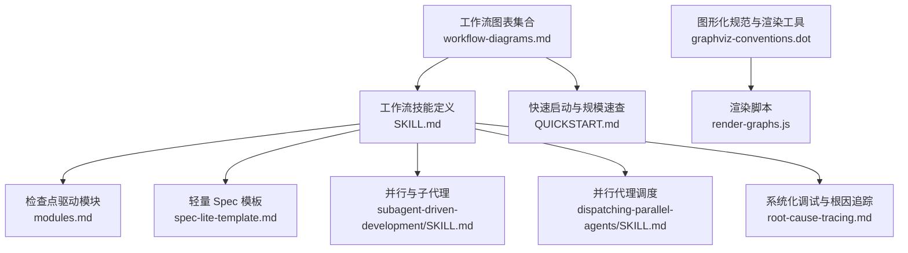

**章节来源**
- [workflow-diagrams.md:1-338](file://altas-workflow/workflow-diagrams.md#L1-L338)
- [SKILL.md:1-351](file://altas-workflow/SKILL.md#L1-L351)
- [QUICKSTART.md:1-182](file://altas-workflow/QUICKSTART.md#L1-L182)
- [modules.md:1-57](file://altas-workflow/references/checkpoint-driven/modules.md#L1-L57)
- [spec-lite-template.md:1-85](file://altas-workflow/references/checkpoint-driven/spec-lite-template.md#L1-L85)
- [graphviz-conventions.dot:1-172](file://altas-workflow/references/superpowers/writing-skills/graphviz-conventions.dot#L1-L172)
- [render-graphs.js:1-169](file://altas-workflow/references/superpowers/writing-skills/render-graphs.js#L1-L169)
- [subagent-driven-development/SKILL.md:1-278](file://altas-workflow/references/superpowers/subagent-driven-development/SKILL.md#L1-L278)
- [dispatching-parallel-agents/SKILL.md:1-183](file://altas-workflow/references/superpowers/dispatching-parallel-agents/SKILL.md#L1-L183)
- [root-cause-tracing.md:1-170](file://altas-workflow/references/superpowers/systematic-debugging/root-cause-tracing.md#L1-L170)

## 核心组件
- 规模评估与工作流深度选择：根据任务复杂度自动选择 XS/S/M/L，并在执行中支持动态升降级。
- 阶段化流程：PRE-RESEARCH → RESEARCH → INNOVATE（仅 L）→ PLAN → EXECUTE（含 TDD 循环）→ REVIEW（三轴）→ ARCHIVE（推荐 L）。
- 检查点机制：每阶段完成后输出标准化检查点，等待用户确认/修改/升级/降级/加载参考。
- 门禁与铁律：No Spec, No Code；No Approval, No Execute；Spec is Truth；Reverse Sync；Evidence First；No Root Cause, No Fix；TDD Iron Law；Resume Ready。
- 特殊模式：FAST（极速）、DEBUG（系统化排查）、MULTI（多项目）、DOC（文档专家）、MAP（代码链路梳理）、ARCHIVE（知识沉淀）。
- 并行与子代理：在 L 规模下，EXECUTE 阶段可结合 Subagent 并行实现与两阶段 Review。

**章节来源**
- [SKILL.md:45-218](file://altas-workflow/SKILL.md#L45-L218)
- [QUICKSTART.md:36-182](file://altas-workflow/QUICKSTART.md#L36-L182)
- [workflow-diagrams.md:7-41](file://altas-workflow/workflow-diagrams.md#L7-L41)

## 架构总览
下图展示 ALTAS Workflow 的整体架构与阶段划分，以及 Size M 与 Size L 的主要差异。

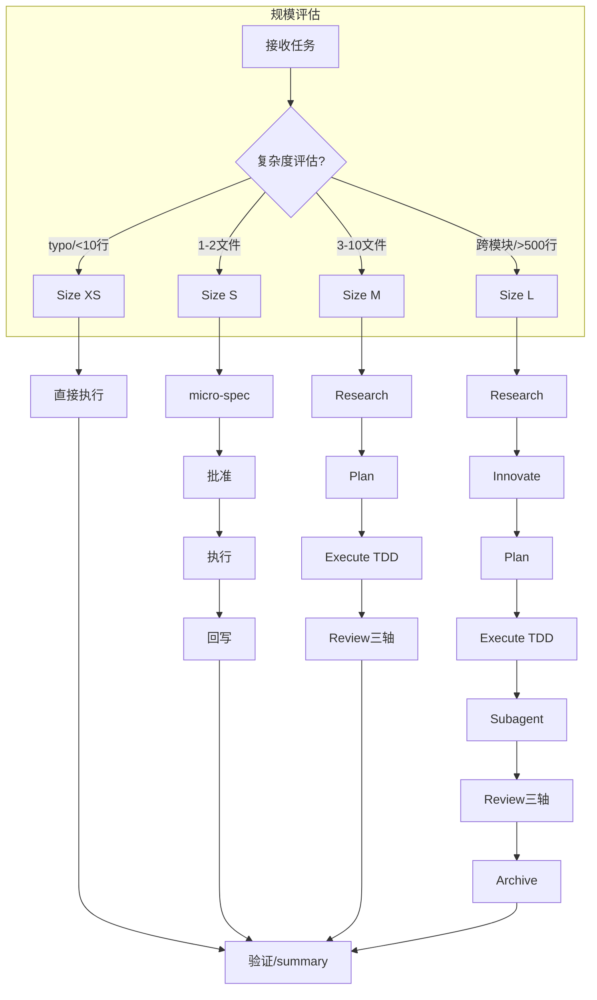

**图表来源**
- [workflow-diagrams.md:9-41](file://altas-workflow/workflow-diagrams.md#L9-L41)

**章节来源**
- [workflow-diagrams.md:7-41](file://altas-workflow/workflow-diagrams.md#L7-L41)

## 详细组件分析

### 流程图规范与标准工作流（Size M 与 Size L）
- Size M（标准）：PRE-RESEARCH（可选）→ RESEARCH → PLAN → EXECUTE（TDD 循环）→ REVIEW（三轴）。
- Size L（深度）：在 M 基础上增加 INNOVATE（方案对比），并在 EXECUTE 阶段引入 Subagent 并行与两阶段 Review，最后 ARCHIVE 沉淀。

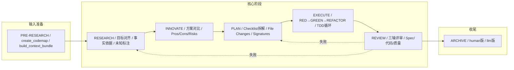

**图表来源**
- [workflow-diagrams.md:47-67](file://altas-workflow/workflow-diagrams.md#L47-L67)

**章节来源**
- [workflow-diagrams.md:45-67](file://altas-workflow/workflow-diagrams.md#L45-L67)
- [SKILL.md:138-218](file://altas-workflow/SKILL.md#L138-L218)

### 铁律与门禁图
- 铁律：No Spec, No Code；No Approval, No Execute；Spec is Truth；Reverse Sync；Evidence First；No Root Cause, No Fix；TDD Iron Law；Resume Ready。
- 门禁：RESEARCH 完成后需满足“事实有据、未知已标”；PLAN 完成后需获得明确批准；EXECUTE 完成后需通过三轴评审；评审失败时按轴退回相应阶段。

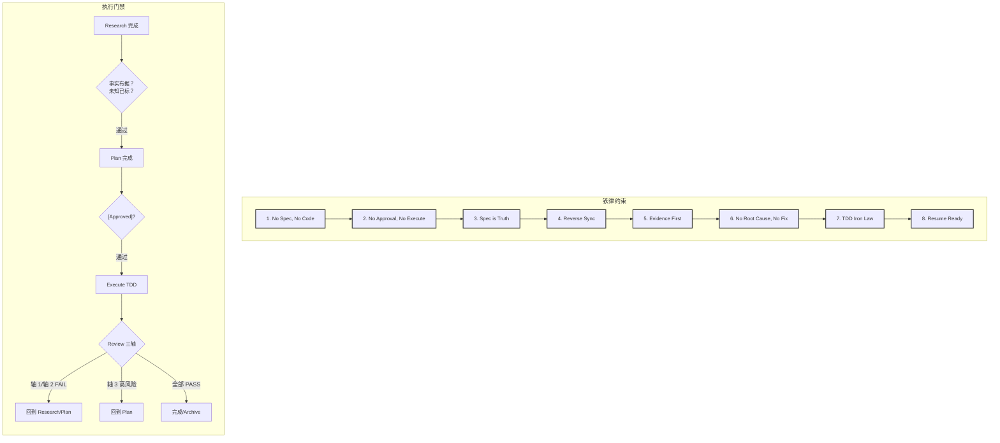

**图表来源**
- [workflow-diagrams.md:73-104](file://altas-workflow/workflow-diagrams.md#L73-L104)

**章节来源**
- [workflow-diagrams.md:71-104](file://altas-workflow/workflow-diagrams.md#L71-L104)
- [SKILL.md:90-102](file://altas-workflow/SKILL.md#L90-L102)

### Review 三轴评审图
- 轴1：Spec 质量与需求达成（Goal/In-Scope/Acceptance）
- 轴2：Spec-代码一致性（文件/签名/Checklist/行为）
- 轴3：代码内在质量（正确性/鲁棒性/可维护性/测试）

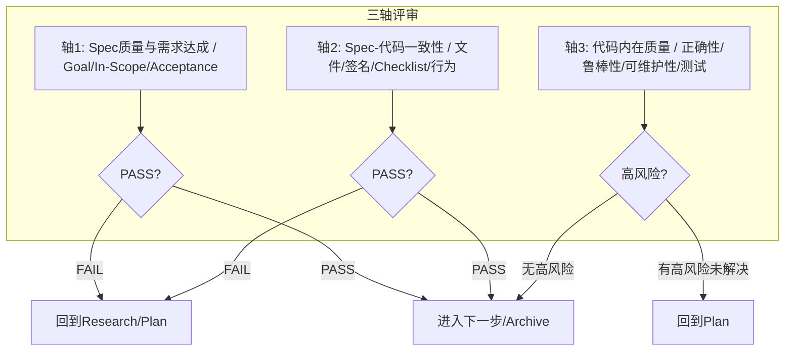

**图表来源**
- [workflow-diagrams.md:110-125](file://altas-workflow/workflow-diagrams.md#L110-L125)

**章节来源**
- [workflow-diagrams.md:108-125](file://altas-workflow/workflow-diagrams.md#L108-L125)
- [SKILL.md:194-209](file://altas-workflow/SKILL.md#L194-L209)

### Size L 工作流甘特图
- 展示 PRE-RESEARCH、核心阶段（Research、Innovate、Plan、Execute TDD、Subagent 驱动）、Review 三轴与 Archive 的时间分布与阶段关系。

```mermaid
gantt
title ALTAS Workflow Size L 阶段规划
dateFormat X
axisFormat %s
section PRE-RESEARCH
create_codemap :done, p1, 0, 5
build_context_bundle :done, p2, 3, 8
section 核心阶段
Research :active, r1, 8, 25
Innovate方案对比 :active, i1, 20, 35
Plan :active, pl1, 30, 45
Execute TDD循环 :active, e1, 45, 120
Subagent驱动 :active, s1, 60, 110
Review三轴评审 :active, rv1, 115, 130
section 收尾
Archive知识沉淀 :active, a1, 125, 140
```

**图表来源**
- [workflow-diagrams.md:131-151](file://altas-workflow/workflow-diagrams.md#L131-L151)

**章节来源**
- [workflow-diagrams.md:129-151](file://altas-workflow/workflow-diagrams.md#L129-L151)

### TDD 执行循环图
- RED→GREEN→REFACTOR 的持续循环，逐步或批量执行，最终验证与总结。

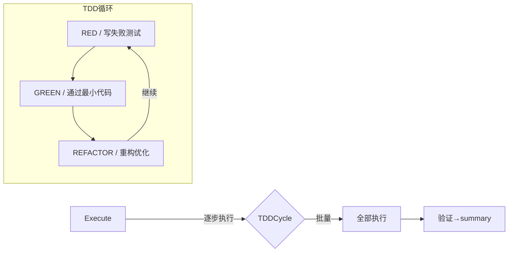

**图表来源**
- [workflow-diagrams.md:157-168](file://altas-workflow/workflow-diagrams.md#L157-L168)

**章节来源**
- [workflow-diagrams.md:155-168](file://altas-workflow/workflow-diagrams.md#L155-L168)
- [SKILL.md:176-192](file://altas-workflow/SKILL.md#L176-L192)

### 特殊模式总览图
- FAST（极速通道）：跳过 Research/Plan，直接执行，事后同步 Spec。
- DEBUG（系统化排查）：诊断模式（日志+Spec+代码三角定位）与验证模式（日志证据 vs Spec 验收）。
- MULTI（多项目）：自动发现子项目，按 local/CROSS 作用域协作。
- DOC（文档专家）：Absorb→Outline→Author→Fact-Check。
- MAP（代码链路梳理）：只读分析，不改代码，必要时升级为标准流程。
- ARCHIVE（知识沉淀）：双视角归档。

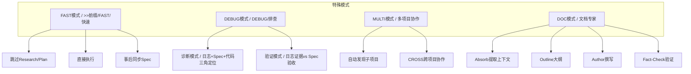

**图表来源**
- [workflow-diagrams.md:174-197](file://altas-workflow/workflow-diagrams.md#L174-L197)

**章节来源**
- [workflow-diagrams.md:172-197](file://altas-workflow/workflow-diagrams.md#L172-L197)
- [SKILL.md:221-275](file://altas-workflow/SKILL.md#L221-L275)

### 触发词与模式映射图
- FAST/快速/>> → 极速通道
- DEEP → Size L 深度
- MAP/链路梳理 → 功能级 CodeMap
- PROJECT MAP → 项目级 CodeMap
- MULTI/多项目 → 多项目模式
- DEBUG/排查 → DEBUG 系统化排查
- REVIEW SPEC → 计划评审
- REVIEW EXECUTE → 代码评审
- ARCHIVE/归档 → 知识沉淀
- DOC/写文档 → DOC 文档专家

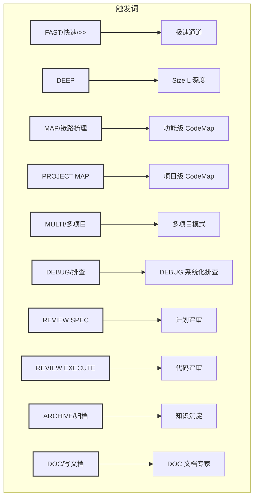

**图表来源**
- [workflow-diagrams.md:263-287](file://altas-workflow/workflow-diagrams.md#L263-L287)

**章节来源**
- [workflow-diagrams.md:261-287](file://altas-workflow/workflow-diagrams.md#L261-L287)
- [SKILL.md:61-73](file://altas-workflow/SKILL.md#L61-L73)

### 完整工作流时序图
- 展示从任务输入到完成的端到端时序，包含 XS/S/M/L 的不同路径与 TDD 循环、Subagent 并行与三轴评审。

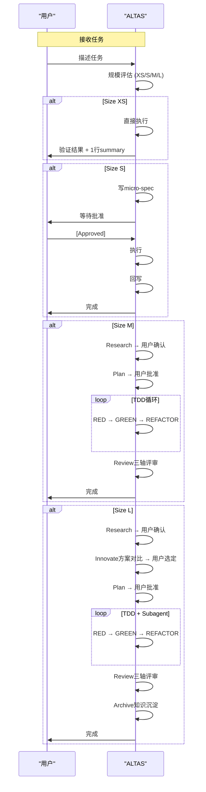

**图表来源**
- [workflow-diagrams.md:293-337](file://altas-workflow/workflow-diagrams.md#L293-L337)

**章节来源**
- [workflow-diagrams.md:291-337](file://altas-workflow/workflow-diagrams.md#L291-L337)

### 检查点机制与用户反馈
- 每阶段完成后输出标准化检查点，包含“当前成果”“预期产出”“下一步操作”，支持用户在任一点进行“继续/Approved”“修改”“升级/降级”“加载参考”等操作。
- 轻量模式（S）使用 micro-spec，完整模式（M/L）使用完整检查点模板。
- 用户反馈与调整通过“修改”“升级为X/降级为X”“加载参考”等交互实现。

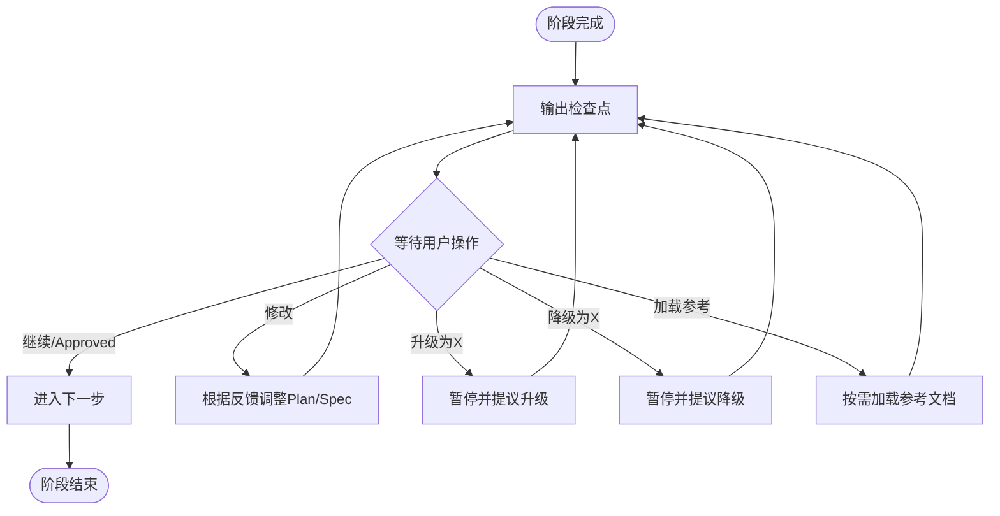

**图表来源**
- [SKILL.md:105-135](file://altas-workflow/SKILL.md#L105-L135)
- [spec-lite-template.md:1-85](file://altas-workflow/references/checkpoint-driven/spec-lite-template.md#L1-L85)
- [modules.md:1-57](file://altas-workflow/references/checkpoint-driven/modules.md#L1-L57)

**章节来源**
- [SKILL.md:105-135](file://altas-workflow/SKILL.md#L105-L135)
- [spec-lite-template.md:1-85](file://altas-workflow/references/checkpoint-driven/spec-lite-template.md#L1-L85)
- [modules.md:1-57](file://altas-workflow/references/checkpoint-driven/modules.md#L1-L57)

### 并行处理与子代理（Subagent）
- Size L 的 EXECUTE 阶段可结合 Subagent 并行实现，每个任务派发 fresh subagent，两阶段 Review（Spec 合规 → 代码质量）。
- 与“并行代理调度”相比，Subagent 更强调在同一会话内的任务隔离与自动 Review。

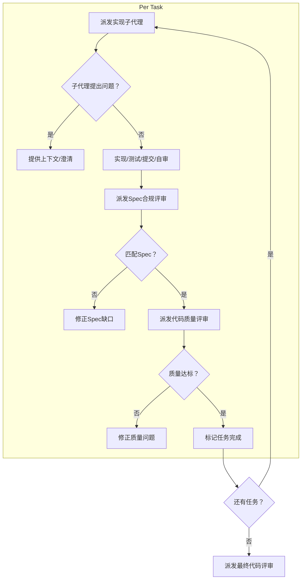

**图表来源**
- [subagent-driven-development/SKILL.md:42-84](file://altas-workflow/references/superpowers/subagent-driven-development/SKILL.md#L42-L84)

**章节来源**
- [subagent-driven-development/SKILL.md:1-278](file://altas-workflow/references/superpowers/subagent-driven-development/SKILL.md#L1-L278)
- [SKILL.md:176-192](file://altas-workflow/SKILL.md#L176-L192)

### 决策节点与状态图
- 决策节点用于表达“是否满足门禁”“是否退回相应阶段”“是否进入下一阶段”等逻辑。
- 状态图可用于描述上下文装配层级（Hot/Warm/Cold）与门禁触发时的重读行为。

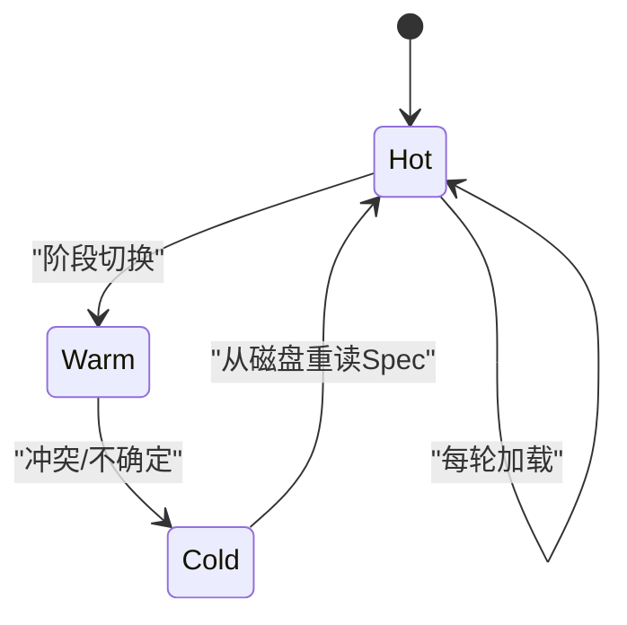

**图表来源**
- [workflow-diagrams.md:243-257](file://altas-workflow/workflow-diagrams.md#L243-L257)

**章节来源**
- [workflow-diagrams.md:241-257](file://altas-workflow/workflow-diagrams.md#L241-L257)
- [SKILL.md:318-333](file://altas-workflow/SKILL.md#L318-L333)

### 数据流图（上下文装配与产物）
- 上下文装配：Hot（每轮）→ Warm（阶段切换）→ Cold（按需），冲突/不确定时从磁盘重读完整 Spec。
- 产物命名：CodeMap、Context Bundle、Spec、Micro-spec、Archive（human/llm）。

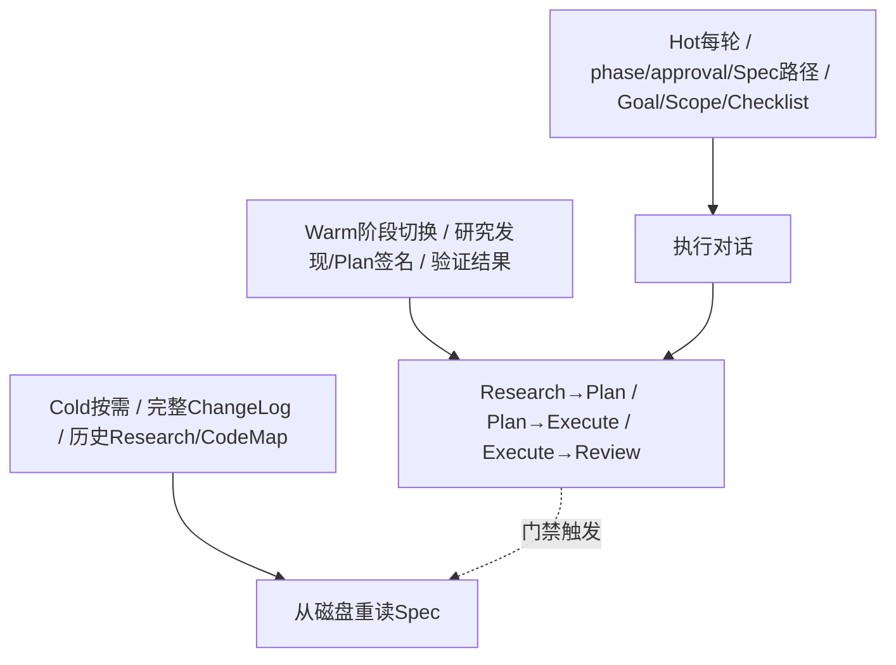

**图表来源**
- [workflow-diagrams.md:243-257](file://altas-workflow/workflow-diagrams.md#L243-L257)

**章节来源**
- [workflow-diagrams.md:241-257](file://altas-workflow/workflow-diagrams.md#L241-L257)
- [SKILL.md:302-315](file://altas-workflow/SKILL.md#L302-L315)

## 依赖关系分析
- 工作流图表集合依赖 SKILL.md 中的阶段与门禁规则，QUICKSTART.md 提供规模速查与典型场景。
- 检查点驱动模块与轻量 Spec 模板为 XS/S/M/L 的检查点输出提供模板与约束。
- 并行与子代理相关文件为 Size L 的并行执行提供流程与质量门禁。
- 图形化规范与渲染工具用于将 Graphviz/DOT 流程图渲染为 SVG。

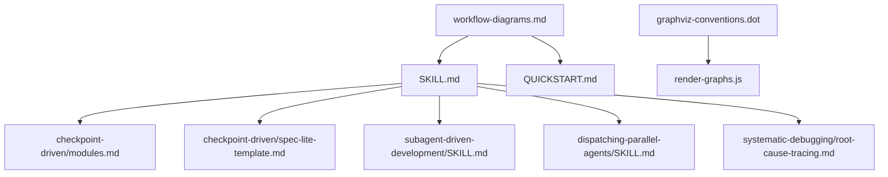

**图表来源**
- [workflow-diagrams.md:1-338](file://altas-workflow/workflow-diagrams.md#L1-L338)
- [SKILL.md:1-351](file://altas-workflow/SKILL.md#L1-L351)
- [graphviz-conventions.dot:1-172](file://altas-workflow/references/superpowers/writing-skills/graphviz-conventions.dot#L1-L172)
- [render-graphs.js:1-169](file://altas-workflow/references/superpowers/writing-skills/render-graphs.js#L1-L169)

**章节来源**
- [workflow-diagrams.md:1-338](file://altas-workflow/workflow-diagrams.md#L1-L338)
- [SKILL.md:1-351](file://altas-workflow/SKILL.md#L1-L351)
- [graphviz-conventions.dot:1-172](file://altas-workflow/references/superpowers/writing-skills/graphviz-conventions.dot#L1-L172)
- [render-graphs.js:1-169](file://altas-workflow/references/superpowers/writing-skills/render-graphs.js#L1-L169)

## 性能考量
- 按需加载：只在命中场景时读取对应参考文档，避免常驻消耗 token。
- 并行执行：在 L 规模下通过 Subagent 并行实现与两阶段 Review 提升效率。
- 渐进式披露：Hot/Warm/Cold 上下文装配减少不必要的上下文加载。
- 规模评估：自动选择工作流深度，避免过度工程化。

[本节为通用指导，不直接分析具体文件]

## 故障排查指南
- 评审失败退回：轴1/轴2 FAIL → 回到 Research/Plan；轴3高风险未解决 → 回到 Plan。
- 门禁触发：冲突/缺失/不确定时立即从磁盘重读完整 Spec。
- 根因追踪：系统化追溯调用链，定位原始触发点，避免仅修复症状。
- 调试模式：诊断模式与验证模式分别用于三角定位与证据对比。

**章节来源**
- [workflow-diagrams.md:71-125](file://altas-workflow/workflow-diagrams.md#L71-L125)
- [SKILL.md:90-102](file://altas-workflow/SKILL.md#L90-L102)
- [root-cause-tracing.md:1-170](file://altas-workflow/references/superpowers/systematic-debugging/root-cause-tracing.md#L1-L170)

## 结论
通过上述图表与规范，ALTAS Workflow 的执行逻辑与控制机制得以清晰呈现。工作流图表不仅帮助用户理解不同规模的任务处理方式，也为检查点机制、用户反馈与调整、决策节点与并行处理提供了可视化的参考。建议在实际使用中结合触发词与规模速查，配合门禁与铁律，确保流程可控、可审计、可恢复。

[本节为总结性内容，不直接分析具体文件]

## 附录
- 图形化工具与规范：graphviz-conventions.dot 提供节点形状、边标签与命名规范；render-graphs.js 支持从 Markdown 中提取 DOT 块并渲染为 SVG。
- 参考资料索引：SKILL.md 中的“参考资料索引（按需加载）”明确了各场景下的参考文件与调用时机。

**章节来源**
- [graphviz-conventions.dot:1-172](file://altas-workflow/references/superpowers/writing-skills/graphviz-conventions.dot#L1-L172)
- [render-graphs.js:1-169](file://altas-workflow/references/superpowers/writing-skills/render-graphs.js#L1-L169)
- [SKILL.md:278-299](file://altas-workflow/SKILL.md#L278-L299)