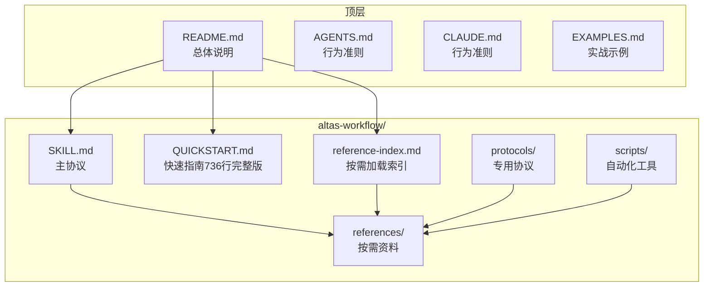
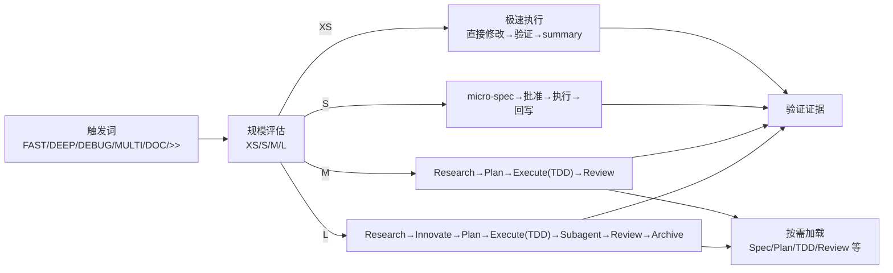
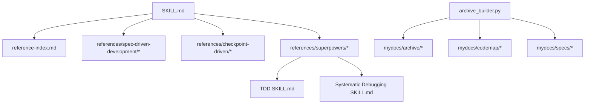

# 快速开始

<cite>
**本文引用的文件**
- [README.md](file://README.md)
- [QUICKSTART.md](file://altas-workflow/QUICKSTART.md)
- [SKILL.md](file://altas-workflow/SKILL.md)
- [reference-index.md](file://altas-workflow/reference-index.md)
- [RIPER-5.md](file://altas-workflow/protocols/RIPER-5.md)
- [SDD-RIPER-ONE Light SKILL.md](file://altas-workflow/references/agents/sdd-riper-one-light/SKILL.md)
- [TDD SKILL.md](file://altas-workflow/references/superpowers/test-driven-development/SKILL.md)
- [Systematic Debugging SKILL.md](file://altas-workflow/references/superpowers/systematic-debugging/SKILL.md)
- [archive_builder.py](file://altas-workflow/scripts/archive_builder.py)
- [AGENTS.md](file://AGENTS.md)
- [CLAUDE.md](file://CLAUDE.md)
- [EXAMPLES.md](file://EXAMPLES.md)
</cite>

## 更新摘要
**所做更改**
- 重大重构：QUICKSTART.md从约50行扩展到736行，新增7个主要章节
- 新增"先用起来"、"如何使用"、"典型使用场景"、"常见问题"、"规模评估速查"、"从旧工作流迁移"等完整内容结构
- 扩展了触发词使用指南，包含详细的命令格式和示例
- 增加了环境配置、mydocs目录结构、平台适配方法
- 新增7个典型使用场景的实战示例
- 完善了故障排除指南和FAQ

## 目录
1. [简介](#简介)
2. [项目结构](#项目结构)
3. [核心组件](#核心组件)
4. [架构总览](#架构总览)
5. [详细组件分析](#详细组件分析)
6. [依赖关系分析](#依赖关系分析)
7. [性能考虑](#性能考虑)
8. [故障排除指南](#故障排除指南)
9. [结论](#结论)
10. [附录](#附录)

## 简介
ALTAS Workflow 是一套融合 Spec-Driven Development、Checkpoint-Driven 与 Superpowers 的 AI 原生研发工作流规范。它通过"智能深度适配（XS/S/M/L）""进度可视化（检查点）""按需加载（渐进式披露）""核心铁律（No Spec No Code、TDD 铁律等）"四大支柱，帮助团队在不同 AI 平台上高效落地结构化开发流程，降低上下文腐烂、审查瘫痪、代码不信任与维护困难等工程痛点。

本快速入门指南面向新手，提供 30 秒安装配置、平台适配方法、mydocs 目录结构、四种基本使用场景实战示例，以及常见问题与故障排除建议，确保你能最短时间内上手并稳定运行。

**更新** 本次更新反映了QUICKSTART.md的重大重构，新增了7个主要章节，提供了更完整和实用的使用指南。

## 项目结构
仓库采用"主协议 + 参考资料 + 专用协议 + 脚本"的分层组织方式：
- altas-workflow/：核心工作流与资料
  - SKILL.md：ALTAS 主协议（AI 读取）
  - QUICKSTART.md：30 秒上手指南（现已扩展为736行的完整指南）
  - reference-index.md：参考资料总索引（按需加载）
  - protocols/：专用协议（如 RIPER-5、RIPER-DOC、DUAL-COOP）
  - references/：按需加载的资料（Spec 驱动、Checkpoint、Superpowers、Agents）
  - scripts/：自动化工具（如 archive_builder.py）
- 顶层文档：README.md、AGENTS.md、CLAUDE.md、EXAMPLES.md 等



**图表来源**
- [README.md:46-82](file://README.md#L46-L82)
- [reference-index.md:109-173](file://altas-workflow/reference-index.md#L109-L173)

**章节来源**
- [README.md:46-82](file://README.md#L46-L82)
- [README.md:351-396](file://README.md#L351-L396)

## 核心组件
- 主协议 SKILL.md：定义触发词、规模评估、阶段执行、铁律约束、进度输出策略与按需加载机制
- 参考资料索引 reference-index.md：按阶段/模式/来源/规模提供精确加载指引
- 专用协议 protocols/：如 RIPER-5（严格模式）、RIPER-DOC（文档专家）、DUAL-COOP（双模型协作）
- 轻量 Agent SDD-RIPER-ONE Light：Checkpoint-Driven 轻量模式，强调"Spec is Truth""Done by Evidence"
- Superpowers 子技能：TDD 铁律、系统化 Debug、Subagent 驱动、并行 Agent、完成前验证等
- 归档脚本 archive_builder.py：自动生成 human/llm 双视角 Archive

**章节来源**
- [SKILL.md:1-200](file://altas-workflow/SKILL.md#L1-L200)
- [reference-index.md:1-210](file://altas-workflow/reference-index.md#L1-L210)
- [SDD-RIPER-ONE Light SKILL.md:1-84](file://altas-workflow/references/agents/sdd-riper-one-light/SKILL.md#L1-L84)
- [TDD SKILL.md:1-200](file://altas-workflow/references/superpowers/test-driven-development/SKILL.md#L1-L200)
- [Systematic Debugging SKILL.md:1-200](file://altas-workflow/references/superpowers/systematic-debugging/SKILL.md#L1-L200)
- [archive_builder.py:1-505](file://altas-workflow/scripts/archive_builder.py#L1-L505)

## 架构总览
ALTAS 的工作流由"触发词 → 规模评估 → 阶段推进 → 检查点 → 按需加载 → 铁律约束 → 产出沉淀"构成。不同规模（XS/S/M/L）在阶段深度、输出格式与加载资源上差异化，XS/S 跳过 Research/Plan，M/L 强制 TDD 与三轴评审。



**图表来源**
- [SKILL.md:47-73](file://altas-workflow/SKILL.md#L47-L73)
- [SKILL.md:105-134](file://altas-workflow/SKILL.md#L105-L134)
- [reference-index.md:175-202](file://altas-workflow/reference-index.md#L175-L202)

## 详细组件分析

### 30 秒安装与配置
- 安装 Skill/Prompt
  - Cursor/Trae：将 SKILL.md 内容复制到 .cursorrules 或全局 AI Rules
  - Claude/OpenAI Agent：将 SKILL.md 内容作为 System Prompt 注入
  - Qoder：将 SKILL.md 放入项目 .qoder/skills/ 目录
- 项目配置
  - 在项目根目录创建 mydocs/ 目录（结构见下节）
  - 确保项目具备一键测试能力（npm test / pytest / go test）

**章节来源**
- [QUICKSTART.md:9-16](file://altas-workflow/QUICKSTART.md#L9-L16)
- [QUICKSTART.md:17-28](file://altas-workflow/QUICKSTART.md#L17-L28)
- [QUICKSTART.md:30-33](file://altas-workflow/QUICKSTART.md#L30-L33)
- [README.md:100-121](file://README.md#L100-L121)
- [README.md:109-112](file://README.md#L109-L112)

### mydocs 目录结构
mydocs 用于沉淀 Spec、CodeMap、上下文与 Archive，推荐结构如下：
- codemap：长期代码索引资产
- context：一次性需求整理
- specs：核心 Spec（组织记忆）
- micro_specs：轻量 Spec
- archive：知识沉淀

**章节来源**
- [QUICKSTART.md:17-28](file://altas-workflow/QUICKSTART.md#L17-L28)
- [README.md:109-112](file://README.md#L109-L112)

### 四种基本使用场景实战示例
- 极速修改（Size XS）
  - 触发词：>>
  - 示例：将 src/config.ts 中的 MAX_RETRIES 从 3 改为 5
  - 行为：直接修改→运行验证→1 行 summary
- 快速功能添加（Size S）
  - 触发词：FAST:
  - 示例：为登录接口添加图形验证码
  - 行为：micro-spec→批准→执行→回写
- 标准开发（Size M）
  - 触发词：sdd_bootstrap:
  - 示例：为用户注册接口添加图形验证码防刷功能，目标：安全性提升
  - 行为：Research→Plan→Execute（TDD）→Review
- 架构重构（Size L）
  - 触发词：DEEP:
  - 示例：重构认证模块拆分为独立微服务
  - 行为：create_codemap→Research→Innovate→Plan→Execute（TDD+Subagent）→Review→Archive

**章节来源**
- [QUICKSTART.md:52-116](file://altas-workflow/QUICKSTART.md#L52-L116)
- [README.md:419-517](file://README.md#L419-L517)

### 平台适配方法
- Cursor/Trae：复制 SKILL.md 内容到 .cursorrules 或全局 AI Rules
- Claude/OpenAI Agent：将 SKILL.md 内容作为 System Prompt 注入
- Qoder：将 SKILL.md 放入项目 .qoder/skills/ 目录

**章节来源**
- [QUICKSTART.md:9-16](file://altas-workflow/QUICKSTART.md#L9-L16)
- [README.md:114-121](file://README.md#L114-L121)

### 智能深度适配与检查点机制
- 规模评估速查：根据改动范围、影响面与复杂度自动选择 XS/S/M/L
- 检查点输出：XS 1 行 summary；S 短 checkpoint；M/L 完整检查点（进度、当前成果、预期产出、下一步操作）
- 自动升降级：执行中发现复杂度超出预期时可升级；用户可随时"升级为 M/降级为 S"

**章节来源**
- [SKILL.md:47-73](file://altas-workflow/SKILL.md#L47-L73)
- [SKILL.md:105-134](file://altas-workflow/SKILL.md#L105-L134)
- [README.md:235-266](file://README.md#L235-L266)

### 按需加载与参考索引
- 按阶段/模式/来源/规模提供精确加载指引，AI 只在命中场景时读取对应文件
- 参考索引文件列出了各阶段可用的参考文档与调用时机

**章节来源**
- [reference-index.md:1-210](file://altas-workflow/reference-index.md#L1-L210)
- [SKILL.md:76-86](file://altas-workflow/SKILL.md#L76-L86)

### 核心铁律与质量保障
- No Spec, No Code：未形成最小 Spec 前不写代码（Size XS 豁免）
- No Approval, No Execute：Plan 阶段人类不点头，绝不写代码
- Spec is Truth：Spec 与代码冲突时，代码是错的
- Reverse Sync：执行中发现偏差→先更新 Spec→再修代码
- Evidence First：完成由验证结果证明，非模型自宣布
- No Root Cause, No Fix：Bug 修复前必须有根因分析，禁止盲改
- TDD Iron Law：Size M/L 无失败测试不写生产代码（Size XS/S 豁免）
- Resume Ready：长任务暂停前在 Spec 中留恢复锚点

**章节来源**
- [SKILL.md:90-102](file://altas-workflow/SKILL.md#L90-L102)
- [README.md:269-281](file://README.md#L269-L281)

### TDD 与系统化 Debug
- TDD：先写失败测试→实现→验证→重构，严格遵循 RED-GREEN-REFACTOR 循环
- Systematic Debug：四阶段根因调查→模式分析→假设与测试→实现修复，禁止症状修复

**章节来源**
- [TDD SKILL.md:1-200](file://altas-workflow/references/superpowers/test-driven-development/SKILL.md#L1-L200)
- [Systematic Debugging SKILL.md:1-200](file://altas-workflow/references/superpowers/systematic-debugging/SKILL.md#L1-L200)

### 归档沉淀与双视角输出
- archive_builder.py：从 spec/codemap 生成 human/llm 双视角 Archive，支持 snapshot/thematic 模式
- 产出：Executive Summary、Key Decisions、Outcomes & Business Impact、Risks & Follow-ups、Trace to Sources

**章节来源**
- [archive_builder.py:1-505](file://altas-workflow/scripts/archive_builder.py#L1-L505)

### 新增：完整使用指南与触发词详解

**更新** 基于QUICKSTART.md的重大扩展，新增了完整的使用指南章节。

#### 1. 先用起来（如何使用）
如果你只想先用起来，不想先读原理，**直接复制下面的命令格式发给 AI 即可**。

**最短上手：照着发**
你发给 AI 的内容，最好长这样：
```text
[触发词]: [具体任务]
目标: [想达成的结果]
范围: [限制改哪里；不限制可省略]
限制: [不能改什么、必须兼容什么；可省略]
验证: [希望运行哪些测试/命令；可省略]
参考资料: [要先读的 Spec、日志、接口文档、原型、截图]
```

**不会选触发词时，用这个判断：**
1. 改一个点、改动非常明确，用 `>>`
2. 小功能、小 bug、小范围增强，用 `FAST:`
3. 正常新增功能或跨多个文件实现，用 `sdd_bootstrap:`
4. 架构调整、大范围重构、迁移，用 `DEEP:`
5. 先理解代码，用 `MAP:` 或 `PROJECT MAP:`
6. 先排查问题，用 `DEBUG:`
7. 必须跨前后端或跨仓库一起改，用 `MULTI:` 或 `CROSS:`

#### 2. 如何使用（展开说明）

**2.1 核心原则：直接把任务写成命令发给 AI**
你不需要先解释工作流原理，先发命令即可。

**基本格式：**
```
[触发词]: [具体任务描述]
```

**最短上手路径：**
1. 判断任务大小，选一个触发词。
2. 把目标、范围、限制条件写清楚。
3. 如果有 Spec、日志、接口文档、原型图，在同一条消息中列出并明确要求 AI 先读。
4. AI 进入对应流程后，在检查点回复 `继续`、`批准`、`修改` 即可。

**2.2 触发词速查与调用时机**
| 触发词 | 规模 | 什么时候用 | 典型场景 |
|--------|------|-----------|----------|
| `>>` | XS | 改一个常量、修 typo、改文案、删文件 | 改配置、修文案、删废弃文件 |
| `FAST:` | S | 加参数校验、加分页、修定位明确的小问题 | 加验证、修小 bug、补小功能 |
| `sdd_bootstrap:` | M | 新增接口/模块、跨文件功能、需要完整流程 | 新增 CRUD、重构模块 |
| `DEEP:` | L | 架构重构、大范围迁移、跨模块改造 | 微服务拆分、数据库迁移 |
| `MAP:` / `PROJECT MAP:` | - | 刚接手项目、不确定入口在哪 | 了解项目结构 |
| `DEBUG:` | - | 线上报错、日志分析、性能异常 | 排查线上问题 |
| `MULTI:` / `CROSS:` | L | 前后端联动、跨仓库接口联调 | 多项目协作 |

**2.3 各触发词的详细使用指南**

##### `>>`：极小改动，直接做
**什么时候用：** 任务一眼能看出改哪、改什么，预计改动不超过 5 行代码。

**AI 行为：**
1. 识别为 Size XS（极速）
2. 直接修改代码
3. 运行最小必要验证
4. 输出 1 行结果总结

##### `FAST:`：小任务，先给计划再做
**什么时候用：** 任务需要改几处代码、加一些逻辑，但不需要大规模重构，预计改动在 1~3 个文件内。

**AI 行为：**
1. 识别为 Size S（小任务）
2. 生成 micro-spec
3. 在检查点等你确认
4. 执行实现并验证
5. 回写总结

##### `sdd_bootstrap:`：标准开发，适合大多数新功能
**什么时候用：** 需要新增一个完整功能、接口或模块，涉及多个文件，需要明确 Research / Plan / Execute / Review 流程。

**AI 行为：**
1. 自动评估规模，通常为 Size M
2. 先做 Research，理解现有实现和依赖
3. 输出 Plan 和 Checklist，等你批准
4. 进入 Execute，默认按 TDD 推进
5. 完成后做 Review

##### `DEEP:`：架构级任务，明确要求深度分析
**什么时候用：** 需要大规模重构、架构调整、数据库迁移、跨模块改造，需要多方案对比、风险识别、分阶段实施。

**AI 行为：**
1. 识别为 Size L（深度）
2. 生成 codemap，梳理现状和依赖
3. 给出多种方案和风险对比
4. 输出原子化计划与分阶段实施方案
5. 按 TDD + Review 推进

##### `DEBUG:`：先查原因，再决定改不改
**什么时候用：** 线上报错排查、日志分析、性能异常定位、用户反馈"偶发失败""数据不一致""接口超时"。

**AI 行为：**
1. 进入 Debug 模式（默认只读分析）
2. 结合日志、代码、Spec 做根因定位
3. 输出症状、预期行为、根因候选、建议修复
4. 如需落地修复，再切换到 FAST 或 sdd_bootstrap

##### `MAP:` / `PROJECT MAP:`：先理解项目，再决定动手
**什么时候用：** 刚接手项目、不确定改动入口在哪、想先拿到模块结构和依赖关系。

**AI 行为：**
1. 只读分析指定范围
2. 输出模块结构、依赖关系、关键入口
3. 不修改任何代码

##### `MULTI:` / `CROSS:`：允许跨项目协作
**什么时候用：** 前后端联动、跨仓库接口联调、一个任务必须同时改多个项目。

**AI 行为：**
1. 自动扫描工作区并识别多个项目
2. 输出 Project Registry 等你确认
3. 按项目拆分计划与执行顺序
4. 记录接口契约和联动影响

#### 3. 环境配置

**3.1 安装 Skill/Prompt**
| 平台 | 安装方式 |
|------|----------|
| **Cursor / Trae** | 将 `SKILL.md` 内容复制到 `.cursorrules` 或全局 AI Rules |
| **Claude / OpenAI Agent** | 将 `SKILL.md` 内容作为 System Prompt 注入 |
| **Qoder** | 将 `SKILL.md` 放入项目 `.qoder/skills/` 目录 |

**3.2 项目配置**
在项目根目录创建 `mydocs/` 文件夹（AI也会在需要时自动创建）：

```
mydocs/
├── codemap/       # 长期代码索引资产
├── context/       # 一次性需求整理
├── specs/         # 核心Spec（组织记忆）
├── micro_specs/   # 轻量Spec
└── archive/       # 知识沉淀
```

**3.3 测试框架**
由于ALTAS强调TDD，确保项目能一键运行测试：`npm test` / `pytest` / `go test`

#### 4. 典型使用场景（详细示例）

**场景一：日常功能迭代 (Size M)**
```
你输入:
sdd_bootstrap: task=为用户注册接口添加图形验证码防刷功能, goal=安全性提升
范围: src/api/auth, src/services/auth, src/routes
限制: 保持现有 Redis 方案，不改短信验证码流程
验证: 补充注册接口测试
参考资料:
- mydocs/specs/register-captcha.md
- docs/auth-api.yaml
- docs/security-baseline.md

AI行为:
1. 自动评估规模 → Size M (Standard)
2. Research → 读取现有注册接口，发现没有图形库依赖 → 输出检查点
3. Plan → 列出Checklist（引入库→改接口→加测试）→ 输出检查点等 [Approved]
4. Execute → TDD: 先写失败测试→实现逻辑→验证通过
5. Review → 三轴评审 → 确认通过
```

**场景二：紧急修复线上配置 (Size XS)**
```
你输入:
>> 将 src/config.ts 中的 MAX_RETRIES 从 3 改为 5，并运行相关测试或校验命令

AI行为:
1. 识别为 Size XS (极速)
2. 直接修改代码→运行验证→1行summary
```

**场景三：架构重构 (Size L)**
```
你输入:
DEEP: 重构认证模块拆分为独立微服务
目标: 支持 OAuth2.0 和 JWT 双模式，并保留回滚路径
范围: auth-service, api-gateway, 用户登录链路
限制: 第一阶段不改前端登录页交互
参考资料:
- mydocs/specs/auth-service-split.md
- docs/current-auth-architecture.md
- docs/rollback-plan-template.md

AI行为:
1. 识别为 Size L (深度)
2. create_codemap → 生成认证模块代码索引
3. Research → 梳理现状链路，标识风险
4. Innovate → 给出3种方案（服务化/模块化/网关层）对比
5. Plan → 原子Checklist + Subagent分配
6. Execute → TDD驱动 + Subagent并行实现 + 两阶段Review
7. Review → 三轴评审 + Archive沉淀
```

**场景四：Bug排查**
```
你输入:
DEBUG: log_path=./logs/error.log, issue=审批通过后未获得授权
目标: 先定位根因候选，不要直接改代码
参考资料:
- mydocs/specs/approval-flow.md
- docs/permission-sync.md

AI行为:
1. 进入Debug模式（只读分析）
2. 读取日志+Spec+CodeMap → 三角定位
3. 输出: 症状/预期行为/根因候选/建议修复
4. 如需修复 → 进入RIPER流程或FAST
```

**场景五：多项目协作**
```
你输入:
MULTI: task=前后端联动发布功能
目标: 后端补发布接口，前端接入列表页和详情页
参考资料:
- ../api-service/docs/publish-api.yaml
- ../web-console/docs/publish-page.md
要求: 先输出 Project Registry 和联动顺序

AI行为:
1. 自动扫描workdir → 发现web-console + api-service
2. 输出Project Registry请确认
3. 生成双项目codemap
4. Plan按项目分组: api-service(Provider)→web-console(Consumer)
5. 执行按依赖顺序，记录Contract Interfaces
```

**场景六：性能优化**
```
你输入:
PERF: 优化首页加载速度，目标从3秒降到1秒以内
范围: 首屏请求、静态资源、关键渲染路径
参考资料:
- docs/perf-baseline-homepage.md
- ./logs/web-vitals-home.json

AI行为:
1. 建立基线 → 测量当前加载时间
2. 定位瓶颈 → 分析网络请求、资源大小、渲染性能
3. 优化方案 → 图片压缩、代码分割、缓存策略
4. 验证效果 → 确认达到目标
```

**场景七：测试补充**
```
你输入:
TEST: 为 src/utils/validator.ts 补充单元测试，覆盖率目标80%
范围: 仅补测试，不改现有业务行为
参考资料:
- mydocs/specs/input-validation.md
- docs/validator-edge-cases.md

AI行为:
1. 分析现有测试覆盖情况
2. 识别未覆盖的边界情况
3. 编写测试用例
4. 验证覆盖率达到目标
```

#### 5. 常见问题 (FAQ)

**Q: AI一次性输出太多代码，跑完所有步骤怎么办？**
A: ALTAS内置检查点机制，AI完成一步后**必须**暂停等确认。如果AI暴走，回复："请停止，严格执行检查点机制，每次只推进一步。"

**Q: 为什么AI总是先写测试？太慢了。**
A: 这是Evidence First + TDD铁律。没有失败测试，AI生成的代码可能没被执行过。如果任务极简，用 `>>` 触发XS模式跳过TDD。

**Q: 如何中途干预AI的计划？**
A: 在任意检查点回复 `[修改] 请不要使用Redis，改为内存缓存`，AI会根据反馈调整Plan后重新请求Approve。

**Q: mydocs/下太多md文件，要提交Git吗？**
A: 强烈建议提交。Spec和Archive是项目的唯一真相源，防止上下文腐烂，帮助新人接手。

**Q: 如何选择XS/S/M/L？**
A: ALTAS会自动评估。你也可以强制指定：`>>`=XS, `FAST`=S, 默认=M, `DEEP`=L。执行中可随时 `[升级为M]` 或 `[降级为S]`。

**Q: 参考资料 (references/) 太多，AI每次都要全部读取吗？**
A: 不需要。ALTAS采用渐进式披露，只在命中场景时按需读取对应文件。SKILL.md中的参考索引表明确了每个文件的调用时机。

**Q: 多人团队如何协作？**
A: Spec是团队共享的真相源。每个人创建自己的Spec文件，通过Git协作。核心开发者只需Review Plan，不必Review全部代码。

**Q: 什么模型适合用ALTAS？**
A: 任何模型都能使用标准模式(M/L)。轻量模式(S/XS)特别适合强模型（Claude Opus/GPT-4+）高频多轮场景。新团队建议从标准模式开始。

#### 6. 规模评估速查
| 信号 | 推荐规模 | 触发词 |
|------|----------|--------|
| "改个typo" | XS | `>>` |
| "加个配置项" | XS | `>>` |
| "改个按钮文案" | XS/S | `>>` 或 `FAST:` |
| "这个接口加个参数" | S | `FAST:` |
| "给这个函数加错误处理" | S | `FAST:` |
| "新增一个CRUD接口" | M | `sdd_bootstrap:` |
| "重构这个模块" | M/L | `sdd_bootstrap:` 或 `DEEP:` |
| "跨模块改数据模型" | L | `DEEP:` |
| "架构级重构" | L | `DEEP:` |
| "前后端联动" | L (MULTI) | `MULTI:` |

#### 7. 从旧工作流迁移
| 旧工作流 | ALTAS对应 |
|----------|-----------|
| SDD-RIPER 标准模式 | Size M/L + `references/spec-driven-development/` |
| SDD-RIPER-ONE Light | Size S/M + `references/checkpoint-driven/` |
| Superpowers brainstorming | Size L Innovate阶段 + `references/superpowers/brainstorming/` |
| Superpowers TDD | Size M/L Execute阶段 + `references/superpowers/test-driven-development/` |
| Superpowers Debug | DEBUG模式 + `references/superpowers/systematic-debugging/` |
| Superpowers Subagent | Size L Execute阶段 + `references/superpowers/subagent-driven-development/` |

## 依赖关系分析
- 主协议 SKILL.md 依赖 reference-index.md 提供的按需加载地图
- 不同规模（XS/S/M/L）在阶段深度、加载资源与输出格式上差异化
- Superpowers 子技能（TDD、Debug、Subagent）在 M/L 执行阶段被按需加载
- archive_builder.py 依赖 mydocs 下的 spec/codemap 文档进行归档



**图表来源**
- [SKILL.md:76-86](file://altas-workflow/SKILL.md#L76-L86)
- [reference-index.md:175-202](file://altas-workflow/reference-index.md#L175-L202)
- [archive_builder.py:1-505](file://altas-workflow/scripts/archive_builder.py#L1-L505)

**章节来源**
- [reference-index.md:175-202](file://altas-workflow/reference-index.md#L175-L202)
- [archive_builder.py:1-505](file://altas-workflow/scripts/archive_builder.py#L1-L505)

## 性能考虑
- 渐进式披露：AI 只在命中场景时按需加载参考文档，避免上下文污染与 token 消耗
- 轻量模式（S/XS）：通过 micro-spec 与短 checkpoint 提升高频多轮效率
- 自动化归档：使用 archive_builder.py 自动生成双视角 Archive，减少重复劳动
- 检查点机制：每步完成后暂停确认，避免一次性输出过多导致的资源浪费

**章节来源**
- [README.md:235-266](file://README.md#L235-L266)
- [archive_builder.py:1-505](file://altas-workflow/scripts/archive_builder.py#L1-L505)

## 故障排除指南
- AI 一次性输出太多代码，跑完所有步骤怎么办？
  - ALTAS 内置检查点机制，AI 完成一步后必须暂停等确认。若 AI 暴走，回复"请停止，严格执行检查点机制，每次只推进一步。"
- 如何中途干预 AI 的计划？
  - 在任意检查点回复"修改 请不要使用 Redis，改为内存缓存"，AI 会根据反馈调整 Plan 后重新请求 Approve。
- 为什么 AI 总是先写测试？太慢了。
  - 这是 Evidence First + TDD 铁律。没有失败测试，AI 生成的代码可能没被执行过。若任务极简，用 ">>" 触发 XS 模式跳过 TDD。
- mydocs/ 下太多 md 文件，要提交 Git 吗？
  - 强烈建议提交。Spec 和 Archive 是项目的唯一真相源，防止上下文腐烂，帮助新人接手。
- 什么模型适合用 ALTAS？
  - 任何模型都能使用标准模式（M/L）。轻量模式（S/XS）特别适合强模型（Claude Opus/GPT-4+）高频多轮场景。新团队建议从标准模式开始。

**章节来源**
- [QUICKSTART.md:119-151](file://altas-workflow/QUICKSTART.md#L119-L151)
- [README.md:537-607](file://README.md#L537-L607)

## 结论
ALTAS Workflow 通过"智能深度适配 + 进度可视化 + 按需加载 + 铁律约束"，为不同规模的任务提供了可落地、可扩展、可复用的 AI 原生开发范式。结合 mydocs 目录结构与 archive_builder.py，团队可以在保证质量的前提下快速迭代，同时沉淀知识资产，降低维护成本。建议新手从 README 的快速启动指南与 QUICKSTART 的实战示例入手，逐步掌握 SKILL.md 的触发词与阶段流程，再深入参考索引与 Superpowers 子技能，最终形成稳定的团队工作流。

**更新** 本次更新全面反映了QUICKSTART.md的重大重构，新增了7个主要章节，提供了更完整和实用的使用指南，包括详细的触发词使用方法、环境配置、典型使用场景和故障排除等内容。

## 附录
- 快速导航
  - 新手入门：快速启动指南、从传统编程转向大模型编程、手把手教程
  - 快速参考：核心命令、规模评估、参考资料索引、详细文档
  - 高级用法：RIPER-5 严格模式、Subagent 驱动开发、系统化 Debug
- 平台行为准则
  - AGENTS.md 与 CLAUDE.md 提供通用行为准则，减少 LLM 常见错误（先思考再编码、简洁优先、手术式改动、目标驱动执行）

**章节来源**
- [README.md:647-667](file://README.md#L647-L667)
- [AGENTS.md:1-65](file://AGENTS.md#L1-L65)
- [CLAUDE.md:1-65](file://CLAUDE.md#L1-L65)
- [EXAMPLES.md:1-522](file://EXAMPLES.md#L1-L522)