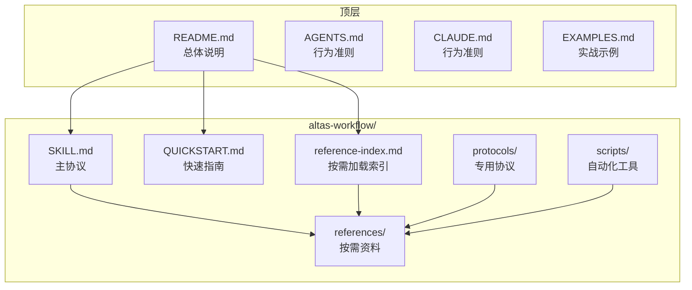
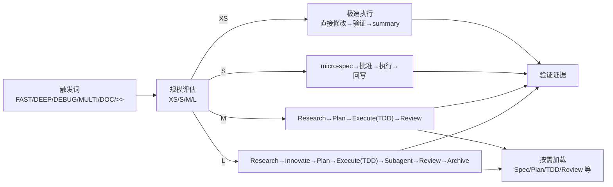
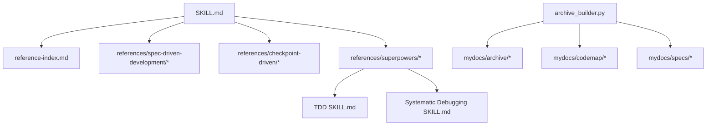

# 快速开始

<cite>
**本文引用的文件**
- [README.md](file://README.md)
- [QUICKSTART.md](file://altas-workflow/QUICKSTART.md)
- [SKILL.md](file://altas-workflow/SKILL.md)
- [reference-index.md](file://altas-workflow/reference-index.md)
- [RIPER-5.md](file://altas-workflow/protocols/RIPER-5.md)
- [SDD-RIPER-ONE Light SKILL.md](file://altas-workflow/references/agents/sdd-riper-one-light/SKILL.md)
- [TDD SKILL.md](file://altas-workflow/references/superpowers/test-driven-development/SKILL.md)
- [Systematic Debugging SKILL.md](file://altas-workflow/references/superpowers/systematic-debugging/SKILL.md)
- [archive_builder.py](file://altas-workflow/scripts/archive_builder.py)
- [AGENTS.md](file://AGENTS.md)
- [CLAUDE.md](file://CLAUDE.md)
- [EXAMPLES.md](file://EXAMPLES.md)
</cite>

## 目录
1. [简介](#简介)
2. [项目结构](#项目结构)
3. [核心组件](#核心组件)
4. [架构总览](#架构总览)
5. [详细组件分析](#详细组件分析)
6. [依赖关系分析](#依赖关系分析)
7. [性能考虑](#性能考虑)
8. [故障排除指南](#故障排除指南)
9. [结论](#结论)
10. [附录](#附录)

## 简介
ALTAS Workflow 是一套融合 Spec-Driven Development、Checkpoint-Driven 与 Superpowers 的 AI 原生研发工作流规范。它通过“智能深度适配（XS/S/M/L）”“进度可视化（检查点）”“按需加载（渐进式披露）”“核心铁律（No Spec No Code、TDD 铁律等）”四大支柱，帮助团队在不同 AI 平台上高效落地结构化开发流程，降低上下文腐烂、审查瘫痪、代码不信任与维护困难等工程痛点。

本快速入门指南面向新手，提供 30 秒安装配置、平台适配方法、mydocs 目录结构、四种基本使用场景实战示例，以及常见问题与故障排除建议，确保你能最短时间内上手并稳定运行。

## 项目结构
仓库采用“主协议 + 参考资料 + 专用协议 + 脚本”的分层组织方式：
- altas-workflow/：核心工作流与资料
  - SKILL.md：ALTAS 主协议（AI 读取）
  - QUICKSTART.md：30 秒上手指南
  - reference-index.md：参考资料总索引（按需加载）
  - protocols/：专用协议（如 RIPER-5、RIPER-DOC、DUAL-COOP）
  - references/：按需加载的资料（Spec 驱动、Checkpoint、Superpowers、Agents）
  - scripts/：自动化工具（如 archive_builder.py）
- 顶层文档：README.md、AGENTS.md、CLAUDE.md、EXAMPLES.md 等

图表来源
- [README.md:46-82](file://README.md#L46-L82)
- [reference-index.md:109-173](file://altas-workflow/reference-index.md#L109-L173)

章节来源
- [README.md:46-82](file://README.md#L46-L82)
- [README.md:351-396](file://README.md#L351-L396)

## 核心组件
- 主协议 SKILL.md：定义触发词、规模评估、阶段执行、铁律约束、进度输出策略与按需加载机制
- 参考资料索引 reference-index.md：按阶段/模式/来源/规模提供精确加载指引
- 专用协议 protocols/：如 RIPER-5（严格模式）、RIPER-DOC（文档专家）、DUAL-COOP（双模型协作）
- 轻量 Agent SDD-RIPER-ONE Light：Checkpoint-Driven 轻量模式，强调“Spec is Truth”“Done by Evidence”
- Superpowers 子技能：TDD 铁律、系统化 Debug、Subagent 驱动、并行 Agent、完成前验证等
- 归档脚本 archive_builder.py：自动生成 human/llm 双视角 Archive

章节来源
- [SKILL.md:1-200](file://altas-workflow/SKILL.md#L1-L200)
- [reference-index.md:1-210](file://altas-workflow/reference-index.md#L1-L210)
- [SDD-RIPER-ONE Light SKILL.md:1-84](file://altas-workflow/references/agents/sdd-riper-one-light/SKILL.md#L1-L84)
- [TDD SKILL.md:1-200](file://altas-workflow/references/superpowers/test-driven-development/SKILL.md#L1-L200)
- [Systematic Debugging SKILL.md:1-200](file://altas-workflow/references/superpowers/systematic-debugging/SKILL.md#L1-L200)
- [archive_builder.py:1-505](file://altas-workflow/scripts/archive_builder.py#L1-L505)

## 架构总览
ALTAS 的工作流由“触发词 → 规模评估 → 阶段推进 → 检查点 → 按需加载 → 铁律约束 → 产出沉淀”构成。不同规模（XS/S/M/L）在阶段深度、输出格式与加载资源上差异化，XS/S 跳过 Research/Plan，M/L 强制 TDD 与三轴评审。

图表来源
- [SKILL.md:47-73](file://altas-workflow/SKILL.md#L47-L73)
- [SKILL.md:105-134](file://altas-workflow/SKILL.md#L105-L134)
- [reference-index.md:175-202](file://altas-workflow/reference-index.md#L175-L202)

## 详细组件分析

### 30 秒安装与配置
- 安装 Skill/Prompt
  - Cursor/Trae：将 SKILL.md 内容复制到 .cursorrules 或全局 AI Rules
  - Claude/OpenAI Agent：将 SKILL.md 内容作为 System Prompt 注入
  - Qoder：将 SKILL.md 放入项目 .qoder/skills/ 目录
- 项目配置
  - 在项目根目录创建 mydocs/ 目录（结构见下节）
  - 确保项目具备一键测试能力（npm test / pytest / go test）

章节来源
- [QUICKSTART.md:9-16](file://altas-workflow/QUICKSTART.md#L9-L16)
- [QUICKSTART.md:17-28](file://altas-workflow/QUICKSTART.md#L17-L28)
- [QUICKSTART.md:30-33](file://altas-workflow/QUICKSTART.md#L30-L33)
- [README.md:100-121](file://README.md#L100-L121)
- [README.md:109-112](file://README.md#L109-L112)

### mydocs 目录结构
mydocs 用于沉淀 Spec、CodeMap、上下文与 Archive，推荐结构如下：
- codemap：长期代码索引资产
- context：一次性需求整理
- specs：核心 Spec（组织记忆）
- micro_specs：轻量 Spec
- archive：知识沉淀

章节来源
- [QUICKSTART.md:17-28](file://altas-workflow/QUICKSTART.md#L17-L28)
- [README.md:109-112](file://README.md#L109-L112)

### 四种基本使用场景实战示例
- 极速修改（Size XS）
  - 触发词：>>
  - 示例：将 src/config.ts 中的 MAX_RETRIES 从 3 改为 5
  - 行为：直接修改→运行验证→1 行 summary
- 快速功能添加（Size S）
  - 触发词：FAST
  - 示例：为登录接口添加图形验证码
  - 行为：micro-spec→批准→执行→回写
- 标准开发（Size M）
  - 触发词：sdd_bootstrap
  - 示例：为用户注册接口添加图形验证码防刷功能，目标：安全性提升
  - 行为：Research→Plan→Execute（TDD）→Review
- 架构重构（Size L）
  - 触发词：DEEP
  - 示例：重构认证模块拆分为独立微服务
  - 行为：create_codemap→Research→Innovate→Plan→Execute（TDD+Subagent）→Review→Archive

章节来源
- [QUICKSTART.md:52-116](file://altas-workflow/QUICKSTART.md#L52-L116)
- [README.md:419-517](file://README.md#L419-L517)

### 平台适配方法
- Cursor/Trae：复制 SKILL.md 内容到 .cursorrules 或全局 AI Rules
- Claude/OpenAI Agent：将 SKILL.md 内容作为 System Prompt 注入
- Qoder：将 SKILL.md 放入项目 .qoder/skills/ 目录

章节来源
- [QUICKSTART.md:9-16](file://altas-workflow/QUICKSTART.md#L9-L16)
- [README.md:114-121](file://README.md#L114-L121)

### 智能深度适配与检查点机制
- 规模评估速查：根据改动范围、影响面与复杂度自动选择 XS/S/M/L
- 检查点输出：XS 1 行 summary；S 短 checkpoint；M/L 完整检查点（进度、当前成果、预期产出、下一步操作）
- 自动升降级：执行中发现复杂度超出预期时可升级；用户可随时“升级为 M/降级为 S”

章节来源
- [SKILL.md:47-73](file://altas-workflow/SKILL.md#L47-L73)
- [SKILL.md:105-134](file://altas-workflow/SKILL.md#L105-L134)
- [README.md:235-266](file://README.md#L235-L266)

### 按需加载与参考索引
- 按阶段/模式/来源/规模提供精确加载指引，AI 只在命中场景时读取对应文件
- 参考索引文件列出了各阶段可用的参考文档与调用时机

章节来源
- [reference-index.md:1-210](file://altas-workflow/reference-index.md#L1-L210)
- [SKILL.md:76-86](file://altas-workflow/SKILL.md#L76-L86)

### 核心铁律与质量保障
- No Spec, No Code：未形成最小 Spec 前不写代码（Size XS 豁免）
- No Approval, No Execute：Plan 阶段人类不点头，绝不写代码
- Spec is Truth：Spec 与代码冲突时，代码是错的
- Reverse Sync：执行中发现偏差→先更新 Spec→再修代码
- Evidence First：完成由验证结果证明，非模型自宣布
- No Root Cause, No Fix：Bug 修复前必须有根因分析，禁止盲改
- TDD Iron Law：Size M/L 无失败测试不写生产代码（Size XS/S 豁免）
- Resume Ready：长任务暂停前在 Spec 中留恢复锚点

章节来源
- [SKILL.md:90-102](file://altas-workflow/SKILL.md#L90-L102)
- [README.md:269-281](file://README.md#L269-L281)

### TDD 与系统化 Debug
- TDD：先写失败测试→实现→验证→重构，严格遵循 RED-GREEN-REFACTOR 循环
- Systematic Debug：四阶段根因调查→模式分析→假设与测试→实现修复，禁止症状修复

章节来源
- [TDD SKILL.md:1-200](file://altas-workflow/references/superpowers/test-driven-development/SKILL.md#L1-L200)
- [Systematic Debugging SKILL.md:1-200](file://altas-workflow/references/superpowers/systematic-debugging/SKILL.md#L1-L200)

### 归档沉淀与双视角输出
- archive_builder.py：从 spec/codemap 生成 human/llm 双视角 Archive，支持 snapshot/thematic 模式
- 产出：Executive Summary、Key Decisions、Outcomes & Business Impact、Risks & Follow-ups、Trace to Sources

章节来源
- [archive_builder.py:1-505](file://altas-workflow/scripts/archive_builder.py#L1-L505)

## 依赖关系分析
- 主协议 SKILL.md 依赖 reference-index.md 提供的按需加载地图
- 不同规模（XS/S/M/L）在阶段深度、加载资源与输出格式上差异化
- Superpowers 子技能（TDD、Debug、Subagent）在 M/L 执行阶段被按需加载
- archive_builder.py 依赖 mydocs 下的 spec/codemap 文档进行归档

图表来源
- [SKILL.md:76-86](file://altas-workflow/SKILL.md#L76-L86)
- [reference-index.md:175-202](file://altas-workflow/reference-index.md#L175-L202)
- [archive_builder.py:1-505](file://altas-workflow/scripts/archive_builder.py#L1-L505)

章节来源
- [reference-index.md:175-202](file://altas-workflow/reference-index.md#L175-L202)
- [archive_builder.py:1-505](file://altas-workflow/scripts/archive_builder.py#L1-L505)

## 性能考虑
- 渐进式披露：AI 只在命中场景时按需加载参考文档，避免上下文污染与 token 消耗
- 轻量模式（S/XS）：通过 micro-spec 与短 checkpoint 提升高频多轮效率
- 自动化归档：使用 archive_builder.py 自动生成双视角 Archive，减少重复劳动
- 检查点机制：每步完成后暂停确认，避免一次性输出过多导致的资源浪费

章节来源
- [README.md:235-266](file://README.md#L235-L266)
- [archive_builder.py:1-505](file://altas-workflow/scripts/archive_builder.py#L1-L505)

## 故障排除指南
- AI 一次性输出太多代码，跑完所有步骤怎么办？
  - ALTAS 内置检查点机制，AI 完成一步后必须暂停等确认。若 AI 暴走，回复“请停止，严格执行检查点机制，每次只推进一步。”
- 如何中途干预 AI 的计划？
  - 在任意检查点回复“[修改] 请不要使用 Redis，改为内存缓存”，AI 会根据反馈调整 Plan 后重新请求 Approve。
- 为什么 AI 总是先写测试？太慢了。
  - 这是 Evidence First + TDD 铁律。没有失败测试，AI 生成的代码可能没被执行过。若任务极简，用 “>>” 触发 XS 模式跳过 TDD。
- mydocs/ 下太多 md 文件，要提交 Git 吗？
  - 强烈建议提交。Spec 和 Archive 是项目的唯一真相源，防止上下文腐烂，帮助新人接手。
- 什么模型适合用 ALTAS？
  - 任何模型都能使用标准模式（M/L）。轻量模式（S/XS）特别适合强模型（Claude Opus/GPT-4+）高频多轮场景。新团队建议从标准模式开始。

章节来源
- [QUICKSTART.md:119-151](file://altas-workflow/QUICKSTART.md#L119-L151)
- [README.md:537-607](file://README.md#L537-L607)

## 结论
ALTAS Workflow 通过“智能深度适配 + 进度可视化 + 按需加载 + 铁律约束”，为不同规模的任务提供了可落地、可扩展、可复用的 AI 原生开发范式。结合 mydocs 目录结构与 archive_builder.py，团队可以在保证质量的前提下快速迭代，同时沉淀知识资产，降低维护成本。建议新手从 README 的快速启动指南与 QUICKSTART 的实战示例入手，逐步掌握 SKILL.md 的触发词与阶段流程，再深入参考索引与 Superpowers 子技能，最终形成稳定的团队工作流。

## 附录
- 快速导航
  - 新手入门：快速启动指南、从传统编程转向大模型编程、手把手教程
  - 快速参考：核心命令、规模评估、参考资料索引、详细文档
  - 高级用法：RIPER-5 严格模式、Subagent 驱动开发、系统化 Debug
- 平台行为准则
  - AGENTS.md 与 CLAUDE.md 提供通用行为准则，减少 LLM 常见错误（先思考再编码、简洁优先、手术式改动、目标驱动执行）

章节来源
- [README.md:647-667](file://README.md#L647-L667)
- [AGENTS.md:1-65](file://AGENTS.md#L1-L65)
- [CLAUDE.md:1-65](file://CLAUDE.md#L1-L65)
- [EXAMPLES.md:1-522](file://EXAMPLES.md#L1-L522)