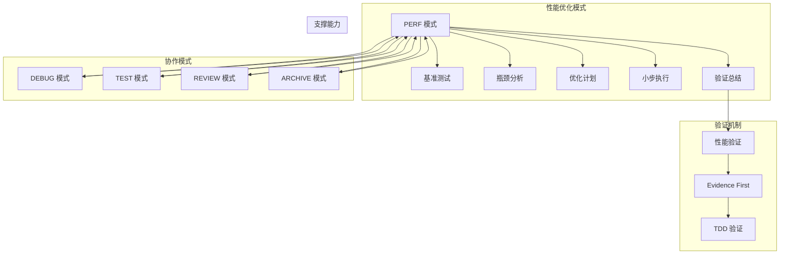
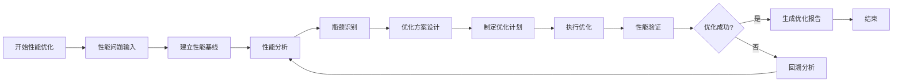
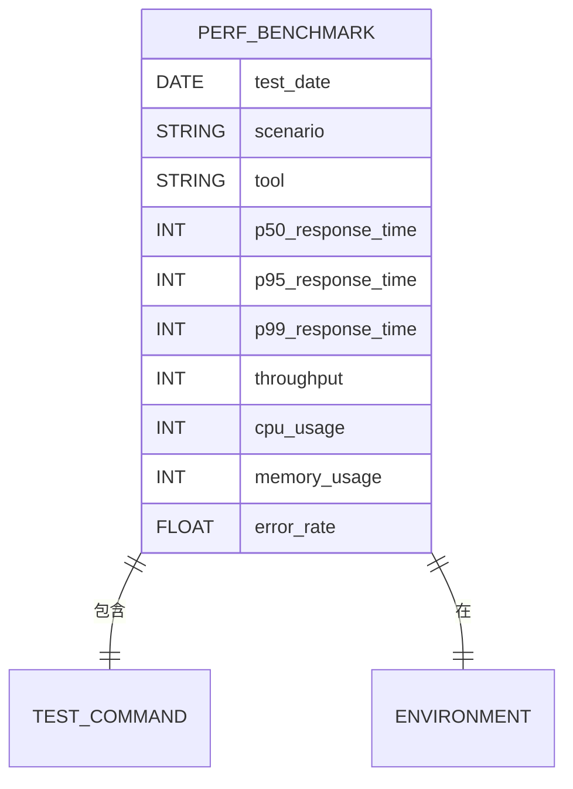
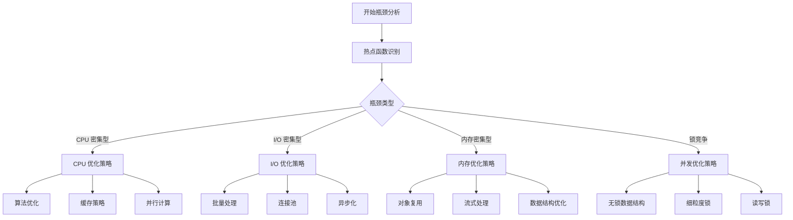
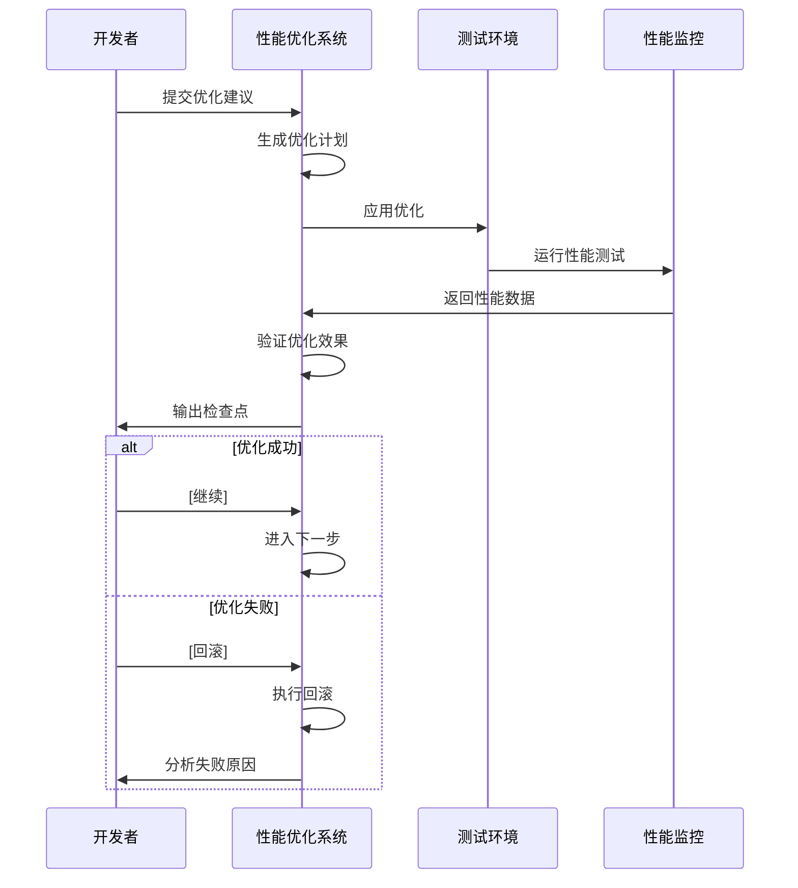
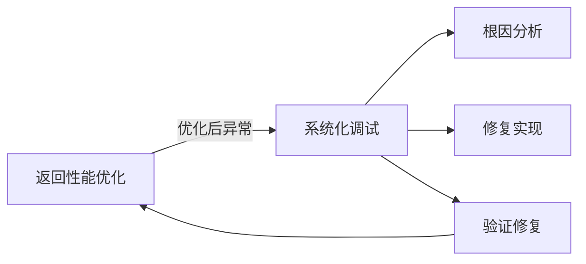
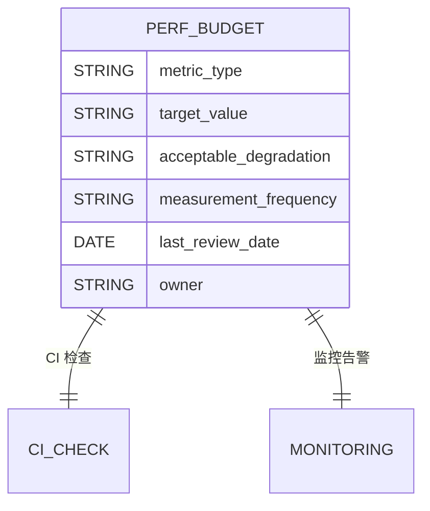
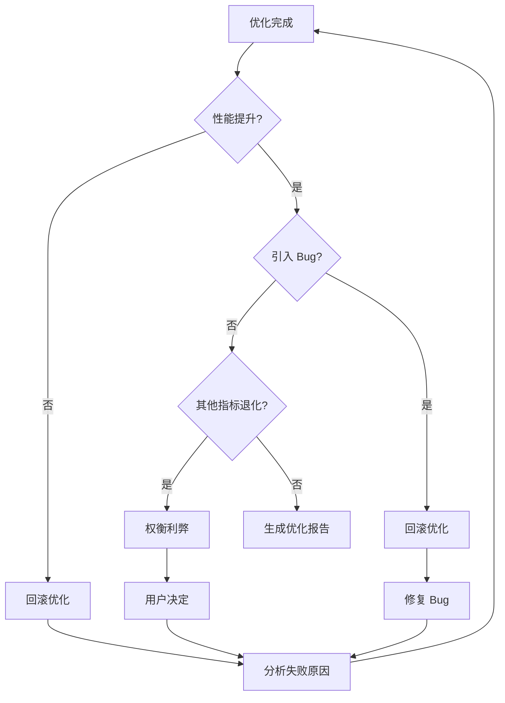

# 性能优化模式

<cite>
**本文档引用的文件**
- [SKILL.md](file://altas-workflow/SKILL.md)
- [perf.md](file://altas-workflow/references/special-modes/perf.md)
- [reference-index.md](file://altas-workflow/reference-index.md)
- [verification-before-completion/SKILL.md](file://altas-workflow/references/superpowers/verification-before-completion/SKILL.md)
- [systematic-debugging/SKILL.md](file://altas-workflow/references/superpowers/systematic-debugging/SKILL.md)
- [test.md](file://altas-workflow/references/special-modes/test.md)
- [review.md](file://altas-workflow/references/special-modes/review.md)
- [RIPER-5.md](file://altas-workflow/protocols/RIPER-5.md)
</cite>

## 目录
1. [简介](#简介)
2. [性能优化模式概述](#性能优化模式概述)
3. [核心组件分析](#核心组件分析)
4. [架构设计](#架构设计)
5. [详细流程分析](#详细流程分析)
6. [与其他模式的协作关系](#与其他模式的协作关系)
7. [性能优化最佳实践](#性能优化最佳实践)
8. [故障排除指南](#故障排除指南)
9. [总结](#总结)

## 简介

性能优化模式是 ALTAS Workflow 中专门用于处理性能相关问题的工作流协议。该模式专注于系统性的性能问题诊断、优化和验证，确保在不牺牲代码质量和功能正确性的前提下提升系统性能。

## 性能优化模式概述

性能优化模式是一个完整的、结构化的性能改进工作流程，适用于各种性能问题的诊断和解决。该模式强调科学的方法论和严格的验证过程，确保每一次性能优化都是可追踪、可验证和可持续的。

### 模式特点

- **系统性方法**：从基准测试到优化验证的完整闭环
- **数据驱动**：基于实际性能数据而非假设
- **可验证性**：每个优化步骤都有明确的验证标准
- **可回滚性**：优化失败时能够快速回退到原始状态
- **可重复性**：优化过程可被其他开发者复现

**章节来源**
- [perf.md:1-234](file://altas-workflow/references/special-modes/perf.md#L1-L234)

## 核心组件分析

### 性能优化流程阶段

性能优化模式包含六个核心阶段，每个阶段都有明确的目标、输出和验证标准：

#### 1. 基准测试阶段
建立性能基线，定义性能指标和测试场景，为后续优化提供量化标准。

#### 2. 瓶颈定位阶段
使用专业的性能分析工具识别系统中的性能瓶颈，包括热点函数、内存使用模式和并发问题。

#### 3. 方案设计阶段
针对识别出的瓶颈制定多种优化方案，进行成本效益分析和风险评估。

#### 4. 计划制定阶段
将优化方案转化为具体的实施计划，包含原子化的优化步骤和验证策略。

#### 5. 小步执行阶段
按照计划逐步实施优化，每个步骤都进行严格的性能验证和功能测试。

#### 6. 验证总结阶段
对整体优化效果进行全面评估，输出详细的性能优化报告。

**章节来源**
- [perf.md:33-184](file://altas-workflow/references/special-modes/perf.md#L33-L184)

### 性能指标体系

性能优化模式建立了全面的性能指标体系，涵盖响应时间、吞吐量、资源使用等多个维度：

| 指标类别 | 具体指标 | 测量单位 | 重要性 |
|---------|---------|---------|--------|
| 响应时间 | P50、P95、P99 响应时间 | 毫秒(ms) | 高 |
| 吞吐量 | QPS、请求处理速率 | 请求/秒 | 高 |
| 资源使用 | CPU 使用率、内存占用 | 百分比(%)、MB | 中 |
| 错误率 | 业务错误率、系统错误率 | 百分比(%) | 高 |
| 并发性能 | 并发用户数、连接数 | 人数、连接数 | 中 |

**章节来源**
- [perf.md:44-66](file://altas-workflow/references/special-modes/perf.md#L44-L66)

## 架构设计

### 模式集成架构

性能优化模式与 ALTAS Workflow 的其他模式形成了有机的协作关系，通过明确的边界和接口实现无缝集成。

**图表来源**
- [perf.md:198-202](file://altas-workflow/references/special-modes/perf.md#L198-L202)
- [verification-before-completion/SKILL.md:16-38](file://altas-workflow/references/superpowers/verification-before-completion/SKILL.md#L16-L38)

### 数据流架构

性能优化模式的数据流遵循严格的输入-处理-输出模式，确保每个环节都有明确的数据传递和验证机制。

**图表来源**
- [perf.md:129-145](file://altas-workflow/references/special-modes/perf.md#L129-L145)

## 详细流程分析

### 基准测试流程

基准测试是性能优化的基础，必须建立可靠的性能基线才能进行有效的优化。

#### 基准测试要素

| 要素 | 内容 | 重要性 |
|------|------|--------|
| 性能指标 | P50、P95、P99 响应时间，吞吐量，CPU 使用率，内存占用 | 高 |
| 测试场景 | 并发用户数、持续时间、负载模式 | 高 |
| 测试工具 | wrk、k6、JMeter 等专业工具 | 中 |
| 测试环境 | 与生产环境一致的测试环境 | 高 |

#### 基准测试报告模板

**图表来源**
- [perf.md:46-66](file://altas-workflow/references/special-modes/perf.md#L46-L66)

**章节来源**
- [perf.md:35-66](file://altas-workflow/references/special-modes/perf.md#L35-L66)

### 瓶颈分析流程

瓶颈分析是性能优化的核心环节，需要使用专业的分析工具和技术手段。

#### 分析工具矩阵

| 编程语言 | 推荐工具 | 分析类型 |
|----------|----------|----------|
| JavaScript/Node.js | Chrome DevTools, clinic.js, 0x | CPU 分析、内存泄漏检测 |
| Python | cProfile, py-spy, line_profiler | 函数调用分析、内存分析 |
| Go | pprof, trace | CPU 分析、goroutine 分析 |
| Java | VisualVM, JProfiler, async-profiler | JVM 分析、堆分析 |
| Rust | perf, flamegraph | 系统级性能分析 |

#### 瓶颈类型识别

**图表来源**
- [perf.md:70-99](file://altas-workflow/references/special-modes/perf.md#L70-L99)

**章节来源**
- [perf.md:68-99](file://altas-workflow/references/special-modes/perf.md#L68-L99)

### 优化实施流程

优化实施采用小步快跑的策略，确保每个优化都能带来可验证的改进。

#### 优化实施原则

| 原则 | 说明 | 实施要点 |
|------|------|----------|
| 单一优化原则 | 每次只应用一个优化 | 防止多个优化相互干扰 |
| 可量化原则 | 每个优化必须有可量化的收益 | 明确的性能指标改善 |
| 正确性原则 | 不允许以牺牲正确性为代价 | 功能测试必须通过 |
| 可回滚原则 | 优化失败时能够快速回退 | 完善的回滚机制 |

#### 小步执行循环

**图表来源**
- [perf.md:129-145](file://altas-workflow/references/special-modes/perf.md#L129-L145)

**章节来源**
- [perf.md:119-145](file://altas-workflow/references/special-modes/perf.md#L119-L145)

## 与其他模式的协作关系

### 与 DEBUG 模式的协作

当性能优化后出现异常行为时，需要立即转入 DEBUG 模式进行系统化排查。

**图表来源**
- [perf.md:200](file://altas-workflow/references/special-modes/perf.md#L200)

### 与 TEST 模式的协作

性能优化需要与测试模式紧密结合，确保优化不会破坏现有功能。

#### 测试协作流程

| 阶段 | 测试重点 | 测试类型 |
|------|----------|----------|
| 优化前 | 确认测试完整性 | 功能测试、回归测试 |
| 优化中 | 验证功能正确性 | 单元测试、集成测试 |
| 优化后 | 验证性能提升 | 性能测试、压力测试 |

**章节来源**
- [perf.md:146-150](file://altas-workflow/references/special-modes/perf.md#L146-L150)

### 与 REVIEW 模式的协作

性能优化完成后需要进行质量审查，确保优化方案符合项目标准。

#### 审查关注点

| 审查维度 | 关注重点 | 评估标准 |
|----------|----------|----------|
| 性能指标 | 指标改善程度 | 达到或超过目标值 |
| 代码质量 | 代码可读性和可维护性 | 符合编码规范 |
| 影响范围 | 对其他模块的影响 | 无负面影响 |
| 文档完整性 | 优化说明和测试报告 | 完整可追溯 |

**章节来源**
- [perf.md:201](file://altas-workflow/references/special-modes/perf.md#L201)

## 性能优化最佳实践

### 性能优化策略矩阵

针对不同类型的性能瓶颈，采用相应的优化策略：

#### CPU 密集型优化

| 优化策略 | 实施方法 | 预期收益 | 实施难度 |
|----------|----------|----------|----------|
| 算法优化 | 选择更高效的算法 | 50-80% 性能提升 | 中等 |
| 缓存策略 | 实现结果缓存 | 30-60% 性能提升 | 低 |
| 并行计算 | 利用多核并行 | 2-8x 性能提升 | 高 |
| WebAssembly | JIT 编译优化 | 2-10x 性能提升 | 高 |

#### I/O 密集型优化

| 优化策略 | 实施方法 | 预期收益 | 实施难度 |
|----------|----------|----------|----------|
| 批量请求 | 合并多个请求 | 50-90% 性能提升 | 低 |
| 连接池 | 复用网络连接 | 30-70% 性能提升 | 中等 |
| 缓存策略 | 缓存常用数据 | 40-80% 性能提升 | 低 |
| 异步化 | 非阻塞 I/O | 2-5x 性能提升 | 中等 |

#### 内存密集型优化

| 优化策略 | 实施方法 | 预期收益 | 实施难度 |
|----------|----------|----------|----------|
| 对象复用 | 复用内存对象 | 60-90% 内存节省 | 中等 |
| 流式处理 | 按需处理数据 | 50-80% 内存节省 | 中等 |
| 数据结构优化 | 选择更高效的数据结构 | 30-70% 内存节省 | 低 |
| 垃圾回收优化 | 调整 GC 参数 | 20-50% 性能提升 | 高 |

#### 并发瓶颈优化

| 优化策略 | 实施方法 | 预期收益 | 实施难度 |
|----------|----------|----------|----------|
| 无锁数据结构 | 使用原子操作 | 2-10x 并发提升 | 高 |
| 细粒度锁 | 减少锁竞争 | 3-8x 并发提升 | 中等 |
| 读写锁 | 优化读多写少场景 | 2-5x 并发提升 | 中等 |
| 任务分解 | 并行化处理 | 2-∞x 并发提升 | 高 |

### 性能预算管理

建立性能预算机制，防止性能退化：

#### 性能预算模板

**图表来源**
- [perf.md:180-183](file://altas-workflow/references/special-modes/perf.md#L180-L183)

### 监控和告警机制

建立完善的性能监控和告警体系：

#### 监控指标体系

| 指标类型 | 监控频率 | 告警阈值 | 处理流程 |
|----------|----------|----------|----------|
| 响应时间 | 实时监控 | P95 > 500ms | 自动告警 |
| 吞吐量 | 实时监控 | QPS < 80% | 自动告警 |
| 错误率 | 实时监控 | 错误率 > 1% | 自动告警 |
| 资源使用 | 5分钟采样 | CPU > 80% | 手动检查 |
| 并发连接 | 5分钟采样 | 连接数 > 90% | 手动检查 |

**章节来源**
- [perf.md:206-226](file://altas-workflow/references/special-modes/perf.md#L206-L226)

## 故障排除指南

### 常见性能问题及解决方案

#### 场景1：性能问题偶发（难以复现）

**问题特征**：性能问题只在特定条件下出现，难以稳定复现。

**解决方案**：
1. 建立稳定的复现环境
2. 使用 APM 工具持续监控
3. 收集环境差异信息
4. 实施概率性测试策略

#### 场景2：性能瓶颈在外部依赖

**问题特征**：性能瓶颈出现在数据库、第三方 API 或 CDN 等外部依赖。

**解决方案**：
1. 缓存外部依赖结果
2. 批量请求减少网络往返
3. 异步化不阻塞主流程
4. 与外部依赖提供方协商优化

#### 场景3：性能优化与代码可读性冲突

**问题特征**：为了性能优化导致代码可读性严重下降。

**解决方案**：
1. 添加详细注释说明优化原因
2. 提议替代方案（提取为独立函数）
3. 保持代码结构清晰
4. 文档化性能优化决策

### 门禁逻辑

性能优化过程中设置了严格的门禁逻辑，确保优化质量和系统稳定性：

#### 门禁决策树

**图表来源**
- [perf.md:187-195](file://altas-workflow/references/special-modes/perf.md#L187-L195)

**章节来源**
- [perf.md:187-195](file://altas-workflow/references/special-modes/perf.md#L187-L195)

### 特殊场景处理

#### 大规模性能优化

对于涉及多个模块或系统的性能优化，需要采用分阶段、分模块的策略：

1. **模块化分析**：将系统分解为独立的功能模块
2. **优先级排序**：根据影响程度和实现难度排序
3. **渐进式实施**：分批次实施优化，每批都进行验证
4. **风险控制**：建立完善的风险评估和回滚机制

#### 复杂系统性能优化

对于分布式系统、微服务架构等复杂系统，需要考虑系统间的相互影响：

1. **依赖关系分析**：识别系统间的关键依赖
2. **影响范围评估**：评估优化对其他服务的影响
3. **协调优化策略**：与其他团队协调优化计划
4. **全链路测试**：进行端到端的性能测试

## 总结

性能优化模式是 ALTAS Workflow 中不可或缺的重要组成部分，它提供了一套系统化、可验证的性能改进方法论。通过基准测试、瓶颈分析、方案设计、计划实施、验证总结的完整流程，确保每一次性能优化都是有据可依、有迹可循的。

### 核心价值

1. **系统性方法**：提供从问题识别到解决方案验证的完整方法论
2. **数据驱动**：基于实际性能数据而非主观臆断
3. **可验证性**：每个优化步骤都有明确的验证标准
4. **可回滚性**：优化失败时能够快速恢复到原始状态
5. **可持续性**：优化经验可以沉淀为知识资产

### 实施建议

1. **建立完善的监控体系**：实时监控关键性能指标
2. **制定性能预算**：设定合理的性能目标和容忍度
3. **培养性能意识**：在日常开发中融入性能考量
4. **持续优化文化**：将性能优化作为持续改进的一部分
5. **知识传承**：将优化经验和最佳实践文档化

通过遵循性能优化模式的方法论和最佳实践，团队可以系统地提升系统性能，在保证功能正确性和代码质量的前提下实现显著的性能改进。