# 数据迁移模式

<cite>
**本文档引用的文件**
- [MIGRATE 模式 - 数据/版本迁移专项协议](file://altas-workflow/references/special-modes/migrate.md)
- [ALTAS Workflow](file://altas-workflow/SKILL.md)
- [参考资料总索引](file://altas-workflow/reference-index.md)
- [工作流流程图集](file://altas-workflow/workflow-diagrams.md)
- [RIPER-5 严格模式协议](file://altas-workflow/protocols/RIPER-5.md)
- [SDD-RIPER-DUAL-COOP 双模型协作协议](file://altas-workflow/protocols/SDD-RIPER-DUAL-COOP.md)
- [RIPER-DOC 文档专家协议](file://altas-workflow/protocols/RIPER-DOC.md)
- [性能优化模式](file://altas-workflow/references/special-modes/perf.md)
- [重构模式](file://altas-workflow/references/special-modes/refactor.md)
- [测试模式](file://altas-workflow/references/special-modes/test.md)
</cite>

## 目录
1. [简介](#简介)
2. [项目结构](#项目结构)
3. [核心组件](#核心组件)
4. [架构概览](#架构概览)
5. [详细组件分析](#详细组件分析)
6. [依赖关系分析](#依赖关系分析)
7. [性能考虑](#性能考虑)
8. [故障排除指南](#故障排除指南)
9. [结论](#结论)

## 简介

数据迁移模式是 ALTAS Workflow 中专门用于处理数据迁移、版本升级和系统迁移的专项工作流。该模式采用严格的风险控制和标准化流程，确保在复杂的系统迁移过程中能够保持数据完整性、系统稳定性和业务连续性。

该模式适用于以下场景：
- 数据库迁移和数据结构变更
- 依赖版本升级（包含破坏性变更）
- API 接口版本升级
- 基础设施迁移（数据库、云服务等）

## 项目结构

ALTAS Workflow 采用模块化设计，将不同的工作流模式分离到独立的参考文件中：

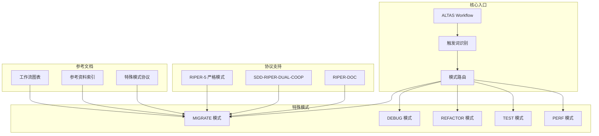

**图表来源**
- [ALTAS Workflow:13-267](file://altas-workflow/SKILL.md#L13-L267)
- [参考资料总索引:1-251](file://altas-workflow/reference-index.md#L1-L251)

**章节来源**
- [ALTAS Workflow:13-267](file://altas-workflow/SKILL.md#L13-L267)
- [参考资料总索引:1-251](file://altas-workflow/reference-index.md#L1-L251)

## 核心组件

### 触发词和路由机制

数据迁移模式通过特定的触发词激活，包括：
- `MIGRATE` / `迁移`
- `数据迁移` / `版本升级`

系统会根据触发词自动路由到相应的特殊模式处理器。

### 规模评估体系

数据迁移模式默认为 L 级规模，表示高风险操作，需要完整的计划和回滚方案。规模评估考虑因素包括：
- 影响范围（跨模块、跨系统）
- 数据量大小
- 业务影响程度
- 技术复杂度

### 严格控制机制

为了确保迁移过程的安全性，系统实施了多重控制机制：

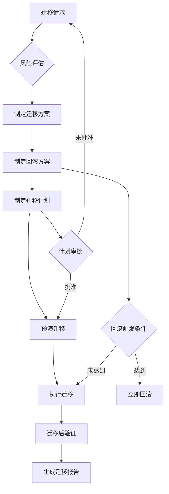

**图表来源**
- [MIGRATE 模式 - 数据/版本迁移专项协议:36-228](file://altas-workflow/references/special-modes/migrate.md#L36-L228)

**章节来源**
- [MIGRATE 模式 - 数据/版本迁移专项协议:1-306](file://altas-workflow/references/special-modes/migrate.md#L1-L306)

## 架构概览

数据迁移模式在整个 ALTAS Workflow 体系中占据重要地位，其架构设计体现了以下特点：

### 多层防护架构

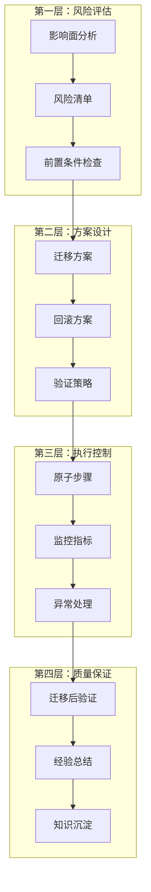

**图表来源**
- [MIGRATE 模式 - 数据/版本迁移专项协议:38-228](file://altas-workflow/references/special-modes/migrate.md#L38-L228)

### 协作模式集成

数据迁移模式可以与其他工作流模式无缝协作：

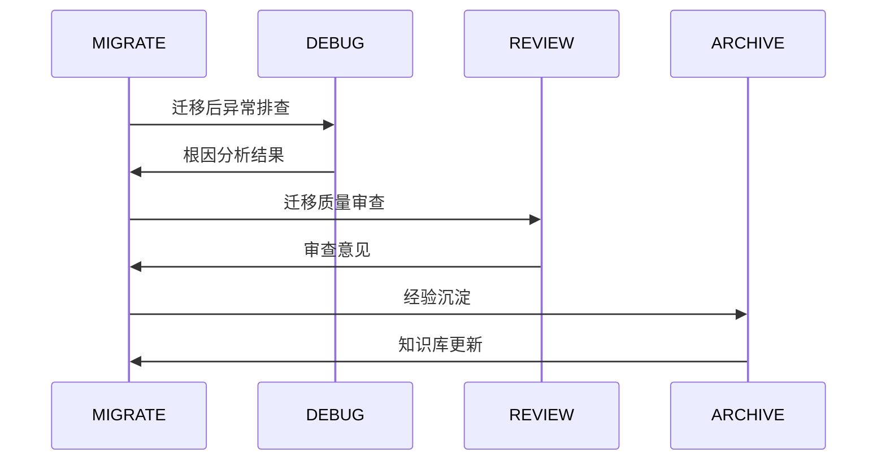

**图表来源**
- [MIGRATE 模式 - 数据/版本迁移专项协议:244-248](file://altas-workflow/references/special-modes/migrate.md#L244-L248)

**章节来源**
- [MIGRATE 模式 - 数据/版本迁移专项协议:244-248](file://altas-workflow/references/special-modes/migrate.md#L244-L248)

## 详细组件分析

### 风险评估组件

风险评估是数据迁移模式的核心组件，确保在迁移前充分识别和评估潜在风险。

#### 风险评估报告模板

系统提供了标准化的风险评估报告模板，包含以下关键要素：

| 评估维度 | 内容要点 | 评估标准 |
|---------|---------|---------|
| 迁移目标 | 迁移的具体内容和范围 | 明确、可量化 |
| 影响面分析 | 涉及的系统、模块、数据量 | 全面、准确 |
| 风险清单 | 数据丢失、服务中断、性能下降等 | 完整、分级 |
| 缓解措施 | 针对每个风险的应对策略 | 具体、可执行 |

#### 影响面分析矩阵

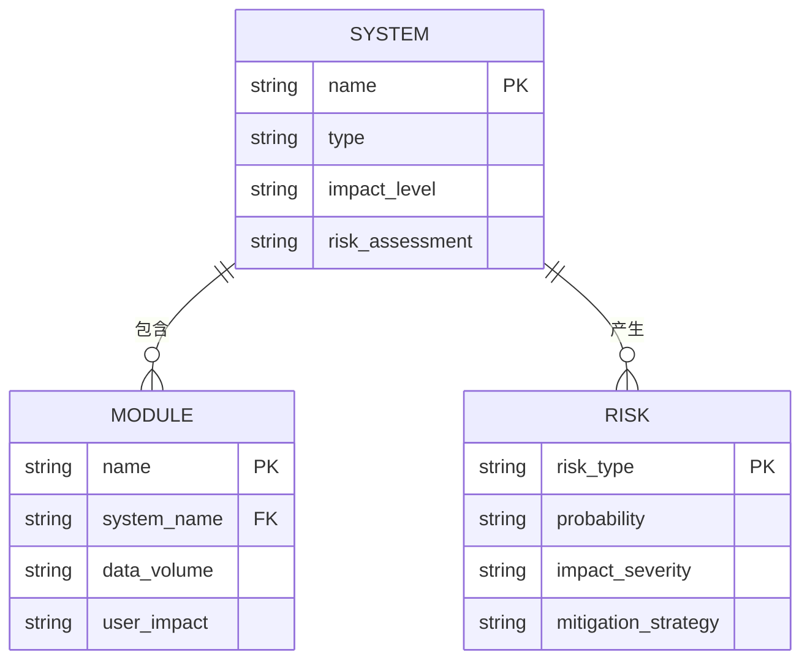

**图表来源**
- [MIGRATE 模式 - 数据/版本迁移专项协议:42-67](file://altas-workflow/references/special-modes/migrate.md#L42-L67)

**章节来源**
- [MIGRATE 模式 - 数据/版本迁移专项协议:38-67](file://altas-workflow/references/special-modes/migrate.md#L38-L67)

### 迁移方案设计组件

#### 方案对比矩阵

系统根据不同迁移类型提供多种迁移方案，并进行对比分析：

| 方案类型 | 适用场景 | 优点 | 缺点 | 推荐度 |
|---------|---------|------|------|--------|
| 一次性迁移 | 小数据量、允许停机 | 简单快速 | 停机时间长、风险集中 | ⭐⭐ |
| 渐进式迁移 | 大数据量、不能停机 | 风险分散 | 复杂度高、需要双写 | ⭐⭐⭐⭐ |
| 蓝绿迁移 | 关键业务、零容忍停机 | 可快速回滚 | 资源成本高 | ⭐⭐⭐⭐⭐ |

#### 方案选择决策树

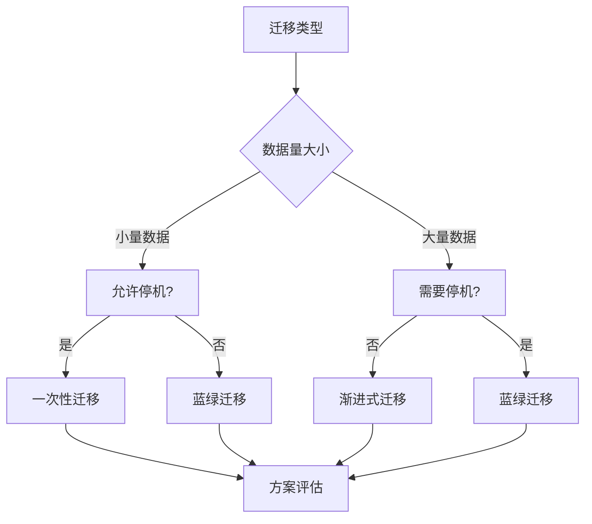

**图表来源**
- [MIGRATE 模式 - 数据/版本迁移专项协议:73-89](file://altas-workflow/references/special-modes/migrate.md#L73-L89)

**章节来源**
- [MIGRATE 模式 - 数据/版本迁移专项协议:69-89](file://altas-workflow/references/special-modes/migrate.md#L69-L89)

### 回滚方案组件

#### 回滚触发条件

系统定义了明确的回滚触发条件，确保在出现问题时能够及时响应：

| 触发条件类别 | 具体条件 | 触发阈值 | 响应时间 |
|-------------|---------|---------|---------|
| 错误率 | 错误率超过阈值 | >5% | 5分钟 |
| 性能指标 | P95响应时间异常 | >1000ms | 10分钟 |
| 数据一致性 | 数据不一致数量 | >100条 | 实时监控 |
| 业务可用性 | 核心功能不可用 | 业务中断 | 立即响应 |

#### 回滚步骤模板

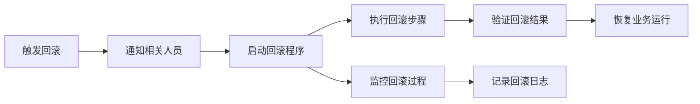

**图表来源**
- [MIGRATE 模式 - 数据/版本迁移专项协议:104-123](file://altas-workflow/references/special-modes/migrate.md#L104-L123)

**章节来源**
- [MIGRATE 模式 - 数据/版本迁移专项协议:89-123](file://altas-workflow/references/special-modes/migrate.md#L89-L123)

### 迁移计划组件

#### 原子步骤设计

迁移计划采用原子化设计，确保每一步都是独立可验证的：

| 步骤类型 | 设计原则 | 验证方法 |
|---------|---------|---------|
| 数据备份 | 完整性验证 | 校验和对比 |
| 结构变更 | 兼容性测试 | 单元测试 |
| 数据转换 | 业务逻辑验证 | 业务用例 |
| 系统切换 | 功能回归测试 | 端到端测试 |
| 监控验证 | 指标达标 | 性能监控 |

#### 人员分工矩阵

| 角色职责 | 具体任务 | 责任范围 | 验证标准 |
|---------|---------|---------|---------|
| 项目经理 | 整体协调 | 进度控制 | 按时完成 |
| 开发工程师 | 代码实现 | 功能正确 | 代码质量 |
| 测试工程师 | 质量验证 | 测试覆盖 | 通过率100% |
| 运维工程师 | 环境准备 | 系统稳定 | 无故障 |
| 业务代表 | 业务验证 | 需求满足 | 业务验收 |

**章节来源**
- [MIGRATE 模式 - 数据/版本迁移专项协议:125-134](file://altas-workflow/references/special-modes/migrate.md#L125-L134)

### 预演迁移组件

#### 预演环境配置

预演迁移是确保正式迁移成功的重要环节：

```mermaid
gantt
title 预演迁移执行计划
dateFormat X
axisFormat %s
section 环境准备
预演环境搭建 :p1, 0, 2
数据准备 :p2, 2, 4
section 执行阶段
预演执行 :p3, 4, 12
回滚验证 :p4, 12, 16
section 总结阶段
问题记录 :p5, 16, 18
改进建议 :p6, 18, 20
```

**图表来源**
- [MIGRATE 模式 - 数据/版本迁移专项协议:136-168](file://altas-workflow/references/special-modes/migrate.md#L136-L168)

#### 预演报告模板

预演报告包含以下关键内容：
- 预演环境配置和数据规模
- 实际执行时间和计划时间对比
- 遇到的问题和解决方案
- 与计划的差异分析
- 改进建议

**章节来源**
- [MIGRATE 模式 - 数据/版本迁移专项协议:136-168](file://altas-workflow/references/special-modes/migrate.md#L136-L168)

### 执行控制组件

#### 执行纪律规范

迁移执行过程严格遵循既定纪律：

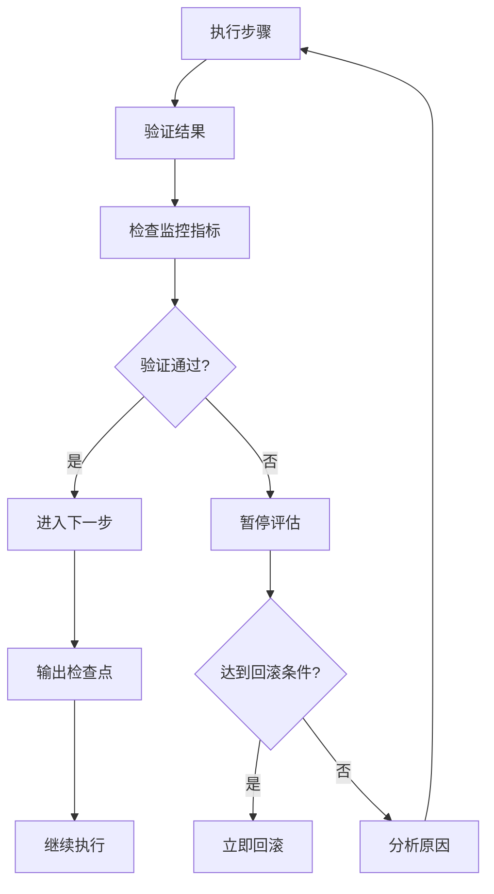

**图表来源**
- [MIGRATE 模式 - 数据/版本迁移专项协议:170-186](file://altas-workflow/references/special-modes/migrate.md#L170-L186)

#### 监控指标体系

迁移过程中需要监控的关键指标：

| 指标类别 | 具体指标 | 正常范围 | 监控频率 |
|---------|---------|---------|---------|
| 业务指标 | 错误率、吞吐量 | <5%、>1000TPS | 实时 |
| 性能指标 | P95响应时间、CPU使用率 | <1000ms、<80% | 1分钟 |
| 数据指标 | 数据一致性、备份状态 | 100%、实时 | 5分钟 |
| 系统指标 | 内存使用率、磁盘空间 | <90%、>10GB | 10分钟 |

**章节来源**
- [MIGRATE 模式 - 数据/版本迁移专项协议:170-186](file://altas-workflow/references/special-modes/migrate.md#L170-L186)

### 质量保证组件

#### 迁移后验证清单

迁移完成后进行全面的质量验证：

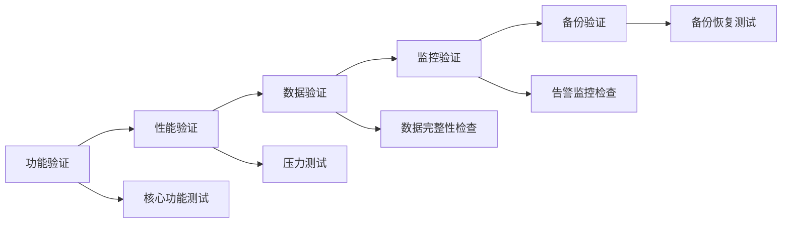

**图表来源**
- [MIGRATE 模式 - 数据/版本迁移专项协议:188-197](file://altas-workflow/references/special-modes/migrate.md#L188-L197)

#### 迁移报告模板

迁移报告包含完整的执行记录和总结：

| 报告内容 | 包含要素 | 输出时机 |
|---------|---------|---------|
| 基本信息 | 迁移日期、类型、目标 | 迁移完成后 |
| 执行结果 | 成功与否、耗时统计 | 迁移完成后 |
| 验证结果 | 各项验证通过情况 | 验证完成后 |
| 问题清单 | 发现的问题及解决方案 | 验证完成后 |
| 经验总结 | 做得好的地方、改进建议 | 迁移完成后 |

**章节来源**
- [MIGRATE 模式 - 数据/版本迁移专项协议:188-228](file://altas-workflow/references/special-modes/migrate.md#L188-L228)

## 依赖关系分析

### 内部依赖关系

数据迁移模式与其他 ALTAS Workflow 组件存在密切的依赖关系：

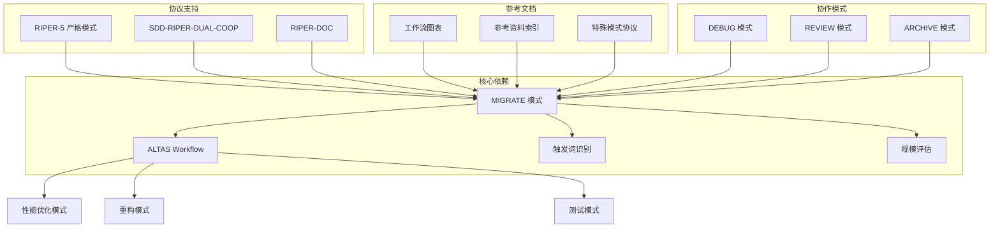

**图表来源**
- [ALTAS Workflow:220-235](file://altas-workflow/SKILL.md#L220-L235)
- [参考资料总索引:140-147](file://altas-workflow/reference-index.md#L140-L147)

### 外部依赖关系

数据迁移模式还需要依赖以下外部资源：

| 依赖类型 | 具体内容 | 用途 | 重要性 |
|---------|---------|---------|---------|
| 工具链 | Git、Docker、Kubernetes | 环境管理和容器化 | 高 |
| 监控系统 | Prometheus、Grafana、ELK | 性能监控和日志分析 | 高 |
| 数据库 | MySQL、PostgreSQL、MongoDB | 数据存储和迁移 | 高 |
| 云服务 | AWS、Azure、GCP | 基础设施支持 | 中 |
| 测试框架 | JUnit、pytest、Jest | 质量保证 | 中 |

**章节来源**
- [ALTAS Workflow:220-235](file://altas-workflow/SKILL.md#L220-L235)
- [参考资料总索引:140-147](file://altas-workflow/reference-index.md#L140-L147)

## 性能考虑

### 性能影响评估

数据迁移对系统性能的影响需要在迁移前进行充分评估：

#### 性能基线建立

迁移前需要建立完整的性能基线，包括：
- 响应时间分布（P50、P95、P99）
- 吞吐量指标
- 资源使用率（CPU、内存、磁盘、网络）
- 并发用户数

#### 迁移期间性能监控

```mermaid
gantt
title 迁移期间性能监控
dateFormat X
axisFormat %s
section 预热阶段
环境准备 :p1, 0, 2
基线测试 :p2, 2, 4
section 迁移执行
数据备份 :p3, 4, 6
结构变更 :p4, 6, 10
数据转换 :p5, 10, 16
系统切换 :p6, 16, 18
section 验证阶段
功能测试 :p7, 18, 20
性能回归 :p8, 20, 22
```

**图表来源**
- [MIGRATE 模式 - 数据/版本迁移专项协议:188-197](file://altas-workflow/references/special-modes/migrate.md#L188-L197)

### 性能优化策略

针对不同类型的迁移，采用相应的性能优化策略：

| 迁移类型 | 性能挑战 | 优化策略 | 预期效果 |
|---------|---------|---------|---------|
| 数据库迁移 | 查询性能下降 | 索引重建、查询优化 | 恢复到迁移前水平 |
| API升级 | 接口延迟增加 | 缓存策略、异步处理 | 延迟降低50% |
| 基础设施迁移 | 网络抖动 | 连接池优化、重试机制 | 稳定性提升 |
| 依赖升级 | 兼容性问题 | 渐进式升级、兼容层 | 零停机升级 |

**章节来源**
- [性能优化模式:33-183](file://altas-workflow/references/special-modes/perf.md#L33-L183)

## 故障排除指南

### 常见问题及解决方案

#### 迁移失败处理

当迁移过程中出现失败时，按照以下流程处理：

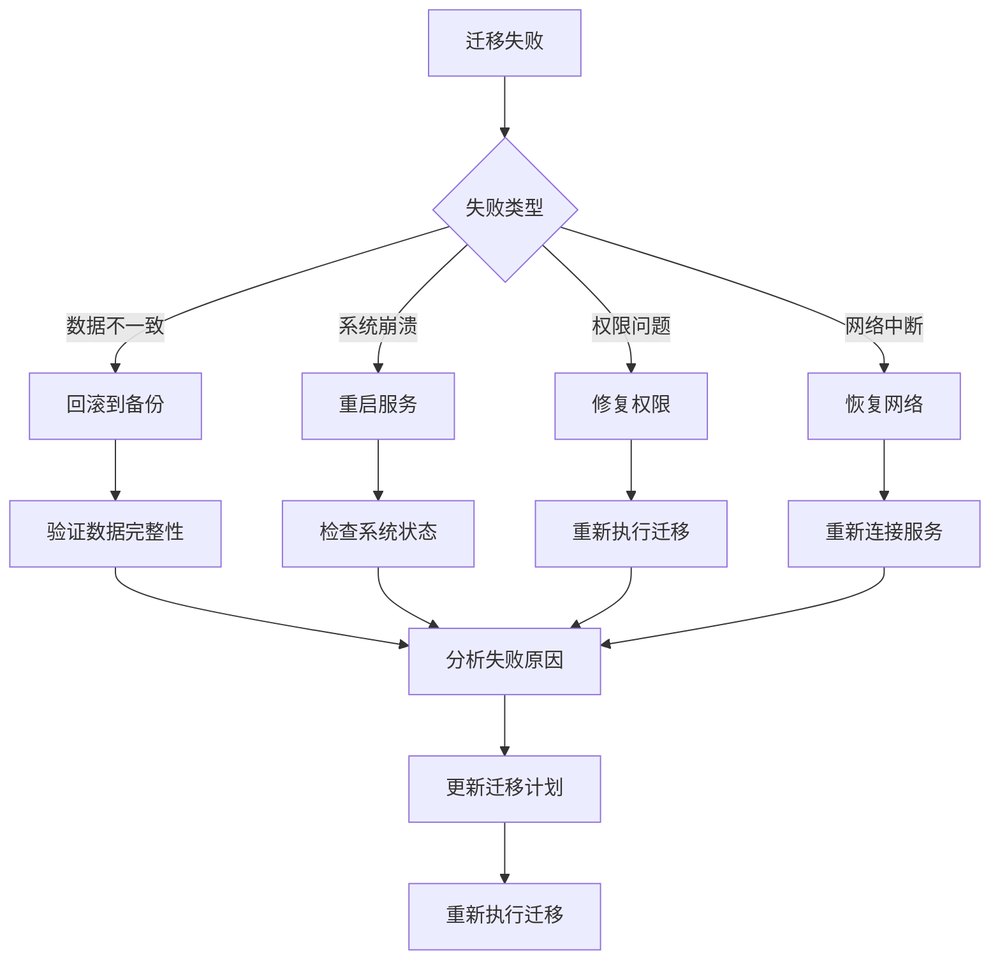

**图表来源**
- [MIGRATE 模式 - 数据/版本迁移专项协议:232-241](file://altas-workflow/references/special-modes/migrate.md#L232-L241)

#### 回滚执行流程

当达到回滚触发条件时，严格按照回滚流程执行：

1. **立即响应**：监控系统触发回滚条件时，立即启动回滚程序
2. **通知相关人员**：通过邮件、短信等方式通知所有相关人员
3. **执行回滚步骤**：按照预设的回滚步骤逐一执行
4. **验证回滚结果**：确认系统恢复正常运行状态
5. **记录回滚过程**：详细记录回滚过程和结果

#### 预演发现问题处理

在预演阶段发现的问题需要及时处理：

| 问题类型 | 处理方式 | 时间要求 |
|---------|---------|---------|
| 数据质量问题 | 修复数据或更换数据源 | 24小时内 |
| 环境配置问题 | 重新配置环境 | 4小时内 |
| 代码缺陷 | 修复代码并重新测试 | 8小时内 |
| 流程设计问题 | 优化流程并重新评估 | 48小时内 |

**章节来源**
- [MIGRATE 模式 - 数据/版本迁移专项协议:232-241](file://altas-workflow/references/special-modes/migrate.md#L232-L241)

### 质量控制措施

#### 多层次验证

数据迁移采用多层次的质量控制措施：

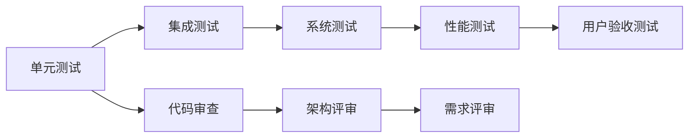

#### 持续监控

迁移完成后需要持续监控系统状态：

| 监控类型 | 监控内容 | 监控频率 | 响应时间 |
|---------|---------|---------|---------|
| 业务监控 | 错误率、用户数、收入 | 实时 | 1分钟 |
| 性能监控 | 响应时间、吞吐量、资源使用 | 1分钟 | 5分钟 |
| 安全监控 | 登录尝试、访问日志、异常行为 | 5分钟 | 10分钟 |
| 基础设施监控 | 服务器状态、网络连通性、存储空间 | 10分钟 | 30分钟 |

**章节来源**
- [MIGRATE 模式 - 数据/版本迁移专项协议:188-197](file://altas-workflow/references/special-modes/migrate.md#L188-L197)

## 结论

数据迁移模式作为 ALTAS Workflow 的重要组成部分，通过严格的风险控制、标准化的流程设计和完善的质量保证体系，为复杂系统的数据迁移提供了可靠的解决方案。

### 核心优势

1. **全面的风险评估**：通过系统化的风险评估，确保在迁移前充分识别和评估潜在风险
2. **灵活的迁移方案**：针对不同场景提供多种迁移方案，满足各种业务需求
3. **严格的回滚机制**：建立完善的回滚触发条件和执行流程，确保问题发生时能够及时响应
4. **完整的质量保证**：从预演到正式执行再到迁移后验证，形成完整的质量保证体系
5. **高效的协作机制**：与其他工作流模式无缝集成，提高整体开发效率

### 最佳实践建议

1. **充分的准备工作**：在迁移前进行充分的准备工作，包括环境准备、数据备份、人员培训等
2. **严格的流程执行**：严格按照既定的流程执行，不得随意更改或跳过任何步骤
3. **持续的监控验证**：在迁移过程中持续监控各项指标，及时发现和解决问题
4. **完善的文档记录**：详细记录迁移过程中的所有操作和结果，为后续审计和问题排查提供依据
5. **经验总结沉淀**：每次迁移完成后都要进行经验总结，不断优化迁移流程和方法

通过遵循这些最佳实践，可以最大程度地降低数据迁移的风险，确保迁移过程的顺利进行，最终实现业务目标。