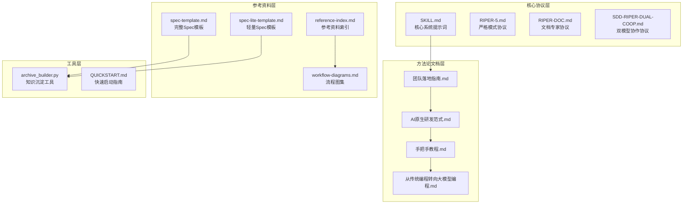
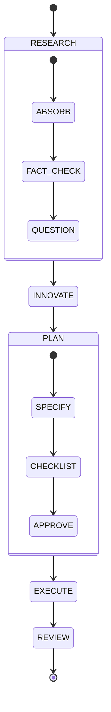
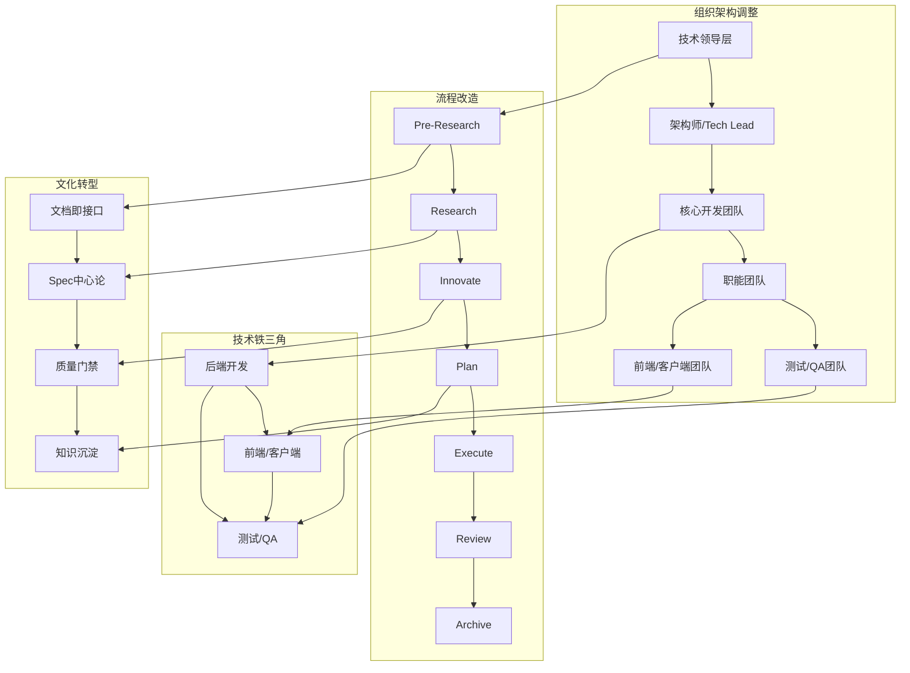
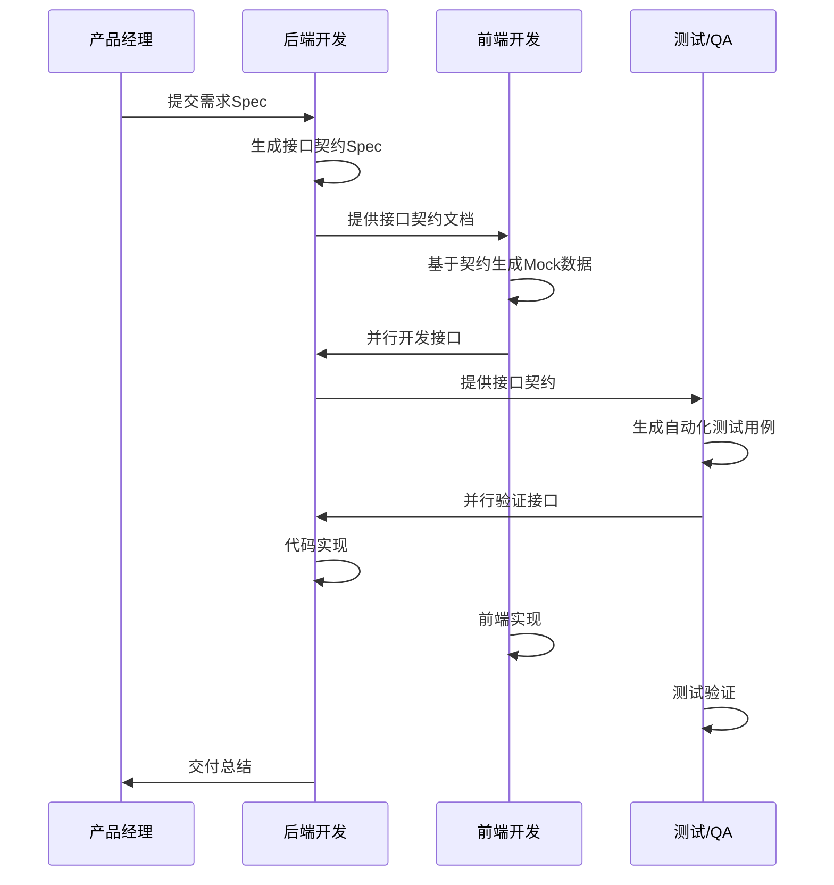
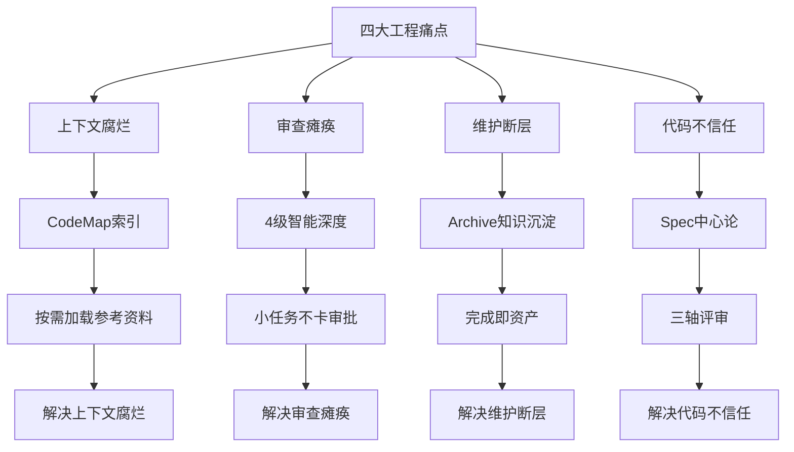
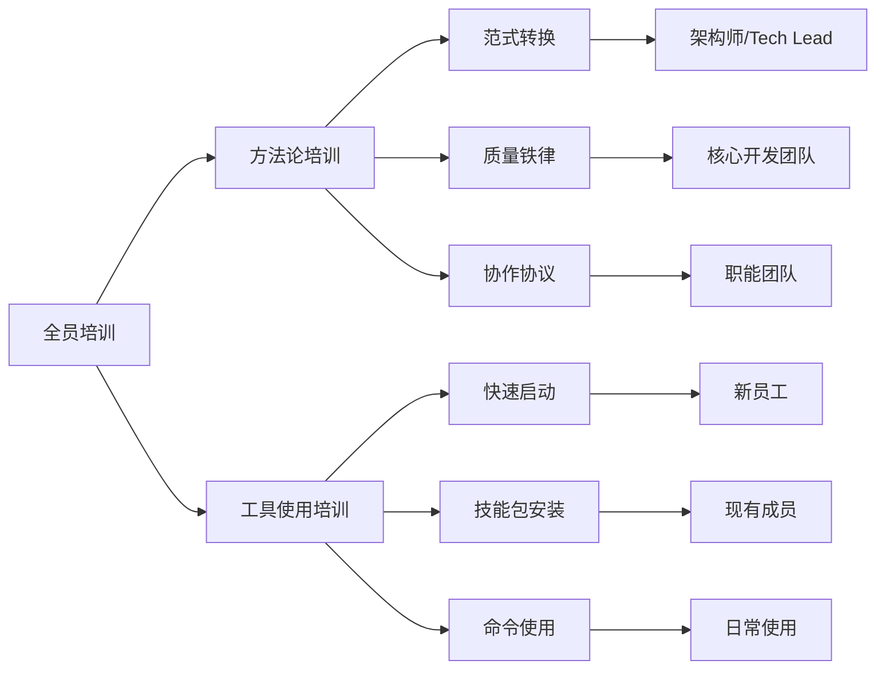
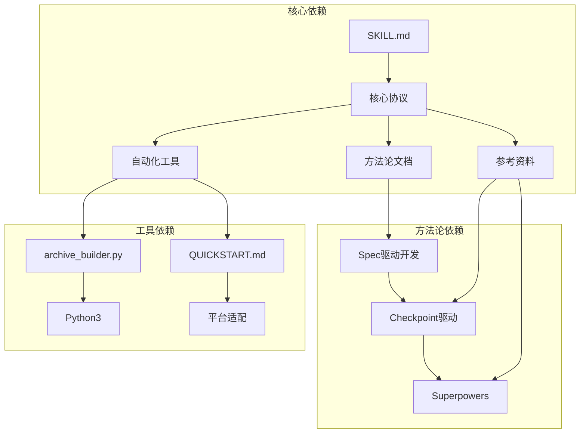
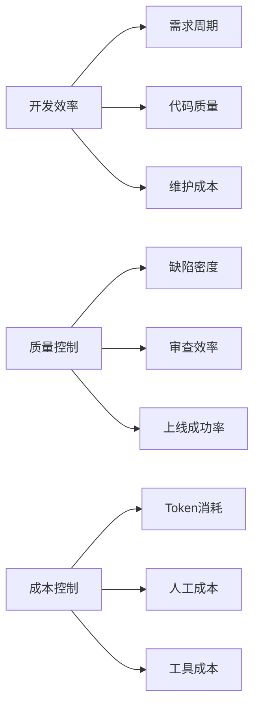
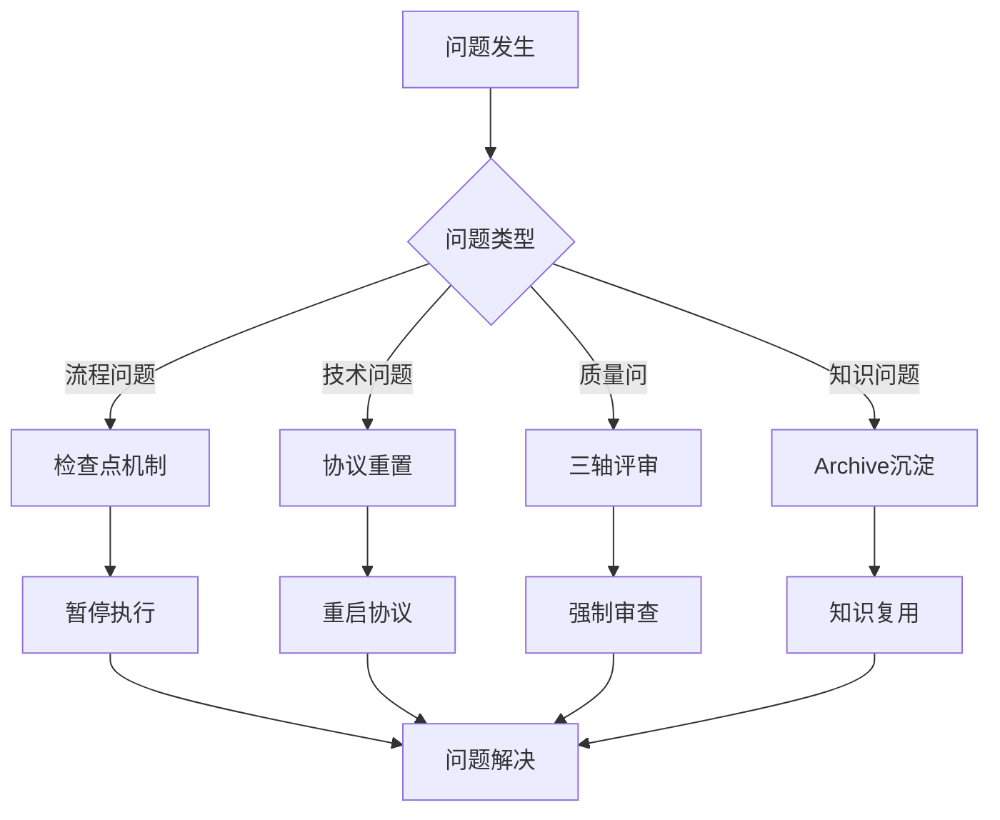

# 团队落地指南

<cite>
**本文引用的文件**
- [团队落地指南.md](file://altas-workflow/docs/团队落地指南.md)
- [AI-原生研发范式-从代码中心到文档驱动的演进.md](file://altas-workflow/docs/AI-原生研发范式-从代码中心到文档驱动的演进.md)
- [如何快速从零开始落地大模型编程 -- 手把手教程.md](file://altas-workflow/docs/如何快速从零开始落地大模型编程 -- 手把手教程.md)
- [ALTAS Workflow 快速启动方案.md](file://altas-workflow/QUICKSTART.md)
- [ALTAS Workflow.md](file://README.md)
- [SKILL.md](file://altas-workflow/SKILL.md)
- [RIPER-5.md](file://altas-workflow/protocols/RIPER-5.md)
- [RIPER-DOC.md](file://altas-workflow/protocols/RIPER-DOC.md)
- [SDD-RIPER-DUAL-COOP.md](file://altas-workflow/protocols/SDD-RIPER-DUAL-COOP.md)
- [reference-index.md](file://altas-workflow/reference-index.md)
- [workflow-diagrams.md](file://altas-workflow/workflow-diagrams.md)
- [archive_builder.py](file://altas-workflow/scripts/archive_builder.py)
- [spec-template.md](file://altas-workflow/references/spec-driven-development/spec-template.md)
- [spec-lite-template.md](file://altas-workflow/references/checkpoint-driven/spec-lite-template.md)
</cite>

## 目录
1. [引言](#引言)
2. [项目结构](#项目结构)
3. [核心组件](#核心组件)
4. [架构总览](#架构总览)
5. [详细组件分析](#详细组件分析)
6. [依赖关系分析](#依赖关系分析)
7. [性能考虑](#性能考虑)
8. [故障排除指南](#故障排除指南)
9. [结论](#结论)
10. [附录](#附录)

## 引言

本指南旨在为团队提供系统性的AI原生研发范式落地实施方案。基于ALTAS Workflow项目，我们将详细介绍如何从传统开发模式转型为AI原生开发模式，包括组织架构调整、流程改造、人员培训和文化转型的完整蓝图。

### 项目背景

AI原生研发范式的核心理念是"文档即接口"，通过规范驱动开发（Spec-Driven Development）实现人机协作的标准化流程。该项目提供了完整的理论体系、实践指南和工具支持，帮助团队建立可持续的AI编程能力。

### 核心价值主张

- **消除上下文腐烂**：通过文档锚点锁定任务上下文，避免AI编程中的注意力分散
- **解决审查瘫痪**：从海量代码审查转向文档和契约审查
- **建立知识资产**：将文档作为团队知识资产，而非一次性产物
- **实现可维护性**：通过规范化的流程确保代码可维护性和可追溯性

## 项目结构

ALTAS Workflow项目采用模块化设计，包含核心协议、方法论文档、参考资料和自动化工具四个主要部分：

**图表来源**
- [ALTAS Workflow.md:48-82](file://README.md#L48-L82)
- [SKILL.md:1-10](file://altas-workflow/SKILL.md#L1-L10)

**章节来源**
- [ALTAS Workflow.md:48-82](file://README.md#L48-L82)
- [ALTAS Workflow 快速启动方案.md:1-50](file://altas-workflow/QUICKSTART.md#L1-L50)

## 核心组件

### 1. ALTAS Workflow核心协议

ALTAS Workflow是融合SDD-RIPER、Checkpoint-Driven和Superpowers三大工作流精华的综合性AI原生研发规范。其核心特征包括：

#### 四级任务深度适配
- **XS (极速)**：纯机械性改动，跳过Spec直接执行
- **S (快速)**：micro-spec + 批准 + 执行 + 回写
- **M (标准)**：Research → Plan → Execute(TDD) → Review
- **L (深度)**：Research → Innovate → Plan → Execute(TDD) → Subagent → Review → Archive

#### 八大质量铁律
1. **No Spec, No Code** - 未形成最小Spec前不写代码
2. **No Approval, No Execute** - Plan阶段人类不点头，绝不写代码
3. **Spec is Truth** - Spec与代码冲突时，代码是错的
4. **Reverse Sync** - 执行中发现偏差→先更新Spec→再修代码
5. **Evidence First** - 完成由验证结果证明，非模型自宣布
6. **No Root Cause, No Fix** - Bug修复前必须有根因分析
7. **TDD Iron Law** - Size M/L: 无失败测试不写生产代码
8. **Resume Ready** - 长任务暂停前在Spec中留恢复锚点

**章节来源**
- [ALTAS Workflow.md:31-41](file://README.md#L31-L41)
- [ALTAS Workflow.md:235-281](file://README.md#L235-L281)

### 2. 文档驱动开发体系

#### Spec模板标准化
项目提供两种Spec模板以适应不同规模的任务：

**完整Spec模板**（适用于M/L规模）
- 0. Open Questions - 未决问题清单
- 1. Requirements - 需求规格
- 2. Research Findings - 研究发现
- 3. Innovate - 方案设计
- 4. Plan - 详细规划
- 5. Execute Log - 执行日志
- 6. Review Verdict - 审查结论
- 7. Plan-Execution Diff - 计划执行差异
- 8. Archive Record - 知识沉淀记录

**轻量Spec模板**（适用于S规模）
- Goal - 核心目标
- Done Contract - 完成定义
- Scope - 作用范围
- Facts/Constraints - 已确认事实
- Checkpoint Summary - 检查点摘要
- Validation - 验证结果
- Resume/Handoff - 恢复/交接

**章节来源**
- [spec-template.md:9-115](file://altas-workflow/references/spec-driven-development/spec-template.md#L9-L115)
- [spec-lite-template.md:5-69](file://altas-workflow/references/checkpoint-driven/spec-lite-template.md#L5-L69)

### 3. 协作协议体系

#### RIPER-5严格模式
为高风险项目提供严格的阶段门禁控制：

**图表来源**
- [RIPER-5.md:25-125](file://altas-workflow/protocols/RIPER-5.md#L25-L125)

#### 双模型协作协议
针对复杂架构设计的多模型协作模式：

- **外部模型（架构师/指挥官）**：负责策略制定、Spec编写、全局协调
- **内部模型（执行者/侦察兵）**：负责代码实现、文件读取、终端操作
- **Fluid Identity**：根据上下文动态切换角色身份

**章节来源**
- [SDD-RIPER-DUAL-COOP.md:11-30](file://altas-workflow/protocols/SDD-RIPER-DUAL-COOP.md#L11-L30)

## 架构总览

### 团队转型架构图

**图表来源**
- [团队落地指南.md:629-750](file://altas-workflow/docs/团队落地指南.md#L629-L750)
- [AI-原生研发范式-从代码中心到文档驱动的演进.md:671-716](file://altas-workflow/docs/AI-原生研发范式-从代码中心到文档驱动的演进.md#L671-L716)

### 四层质量保障体系

| 层级 | 机制 | 解决问题 | 实施方式 |
|------|------|----------|----------|
| **第一层** | Plan前置审查 | 配合review_spec预审，避免盲目执行 | 建立Spec审查流程，强制预审 |
| **第二层** | 执行及验收闭环 | 三轴评审，Spec+日志+代码交叉验证 | 实施review_execute命令，强制三轴评审 |
| **第三层** | Spec回写闭环 | 发现偏差先修文档再修代码 | 建立Reverse Sync机制，强制文档优先 |
| **第四层** | RIPER阶段门禁 | 每个阶段都有检查点，早期发现问题 | 实施标准化检查点机制 |

**章节来源**
- [团队落地指南.md:110-123](file://altas-workflow/docs/团队落地指南.md#L110-L123)

## 详细组件分析

### 团队协作SOP设计

#### 技术铁三角协作闭环

**图表来源**
- [团队落地指南.md:671-716](file://altas-workflow/docs/团队落地指南.md#L671-L716)

#### 责任分工矩阵

| 角色 | 责任范围 | Owner | Sign-off |
|------|----------|-------|----------|
| `01_requirement.md` | 需求规格书 | 需求/产品或需求提出人 | 业务Owner + TL |
| `02_interface.md` | 接口契约文档 | 接口提供方（后端） | 接口消费者（前端/客户端）+ QA |
| `03_implementation.md` | 实施细节文档 | 实现负责人 | TL/核心评审人 |
| `04_test_spec.md` | 测试策略文档 | QA（或测试Owner） | 实现负责人 + QA |

**章节来源**
- [团队落地指南.md:675-680](file://altas-workflow/docs/团队落地指南.md#L675-L680)

### 风险管理机制

#### 四大工程痛点解决方案

**图表来源**
- [ALTAS Workflow.md:22-29](file://README.md#L22-L29)

#### 风险识别与缓解

| 风险类型 | 风险描述 | 缓解措施 | 监控指标 |
|----------|----------|----------|----------|
| **上下文腐烂** | AI对话越长越容易遗忘前文约束 | CodeMap索引 + 渐进式披露 | 上下文命中率、Spec更新频率 |
| **审查瘫痪** | AI秒生成500行代码，人无法逐行审查 | 4级智能深度 + 三轴评审 | 审查通过率、缺陷密度 |
| **维护断层** | 全是AI生成的陌生代码，两周后不敢动 | Archive知识沉淀 + TDD铁律 | 维护成本、修复时间 |
| **代码不信任** | 不知道AI为什么这么写，不敢上线 | Spec is Truth + 反向同步 | 上线成功率、回归测试通过率 |

**章节来源**
- [团队落地指南.md:59-81](file://altas-workflow/docs/团队落地指南.md#L59-L81)

### 团队培训体系

#### 分层培训路径

**图表来源**
- [团队落地指南.md:29-47](file://altas-workflow/docs/团队落地指南.md#L29-L47)

#### 培训内容矩阵

| 培训层级 | 培训内容 | 培训时长 | 培训方式 | 评估标准 |
|----------|----------|----------|----------|----------|
| **全员** | 从传统编程转向大模型编程 | 2小时 | 在线课程 + 案例分析 | 理论测试 + 案例分析 |
| **核心团队** | AI原生研发范式 | 4小时 | 工作坊 + 实践演练 | 实操测试 + 项目应用 |
| **架构师/Tech Lead** | 团队落地指南 | 6小时 | 深度工作坊 | 方案设计 + 实施效果 |
| **新员工** | 快速从零开始 | 3小时 | 导师制 + 实践 | 任务完成度 + 质量评估 |

**章节来源**
- [团队落地指南.md:167-253](file://altas-workflow/docs/团队落地指南.md#L167-L253)

## 依赖关系分析

### 技术依赖关系

**图表来源**
- [ALTAS Workflow.md:44-94](file://README.md#L44-L94)
- [reference-index.md:1-20](file://altas-workflow/reference-index.md#L1-L20)

### 团队协作依赖

| 依赖关系 | 依赖方向 | 影响程度 | 依赖说明 |
|----------|----------|----------|----------|
| **Spec模板** | 方法论 → 实践 | 高 | 为团队提供标准化的文档模板 |
| **参考资料索引** | 工具 → 方法论 | 中 | 支撑按需加载机制 |
| **自动化工具** | 实践 → 工具 | 高 | 提供知识沉淀和归档支持 |
| **平台适配** | 工具 → 平台 | 低 | 支持多种AI助手平台 |
| **协议定义** | 核心 → 协作 | 高 | 规范团队协作流程 |

**章节来源**
- [reference-index.md:1-20](file://altas-workflow/reference-index.md#L1-L20)

## 性能考虑

### 成本效益分析

| 优化维度 | 改进措施 | 预期收益 | 实施难度 |
|----------|----------|----------|----------|
| **Token成本优化** | CodeMap索引 + 渐进式披露 | 降低输出Token消耗 | 中等 |
| **开发效率提升** | 并行开发 + 知识复用 | 缩短需求周期 | 高 |
| **质量控制** | 三轴评审 + TDD铁律 | 降低缺陷率 | 中等 |
| **维护成本** | Archive知识沉淀 | 降低维保成本 | 低 |

### 性能监控指标

**图表来源**
- [团队落地指南.md:29-55](file://altas-workflow/docs/团队落地指南.md#L29-L55)

## 故障排除指南

### 常见问题及解决方案

#### 流程控制问题

| 问题类型 | 问题描述 | 解决方案 | 预防措施 |
|----------|----------|----------|----------|
| **AI暴走** | AI一次性输出过多代码 | 实施检查点机制，强制每步暂停 | 建立检查点标准流程 |
| **计划变更** | 执行中发现计划不合理 | 实施Reverse Sync机制 | 建立计划变更审批流程 |
| **质量不达标** | 代码质量不符合要求 | 实施三轴评审机制 | 建立质量门禁标准 |
| **文档漂移** | Spec与代码不一致 | 实施Spec is Truth原则 | 建立文档更新跟踪机制 |

#### 技术实现问题

| 问题类型 | 问题描述 | 解决方案 | 预防措施 |
|----------|----------|----------|----------|
| **上下文丢失** | AI忘记前文约束 | 实施CodeMap索引机制 | 建立上下文管理规范 |
| **审查困难** | 代码量过大无法审查 | 实施4级智能深度 | 建立分级审查机制 |
| **知识流失** | 人员流动导致知识丢失 | 实施Archive知识沉淀 | 建立知识管理制度 |

**章节来源**
- [ALTAS Workflow 快速启动方案.md:119-151](file://altas-workflow/QUICKSTART.md#L119-L151)

### 应急响应流程

**图表来源**
- [团队落地指南.md:159-164](file://altas-workflow/docs/团队落地指南.md#L159-L164)

## 结论

ALTAS Workflow项目为团队AI原生研发范式的落地提供了完整的解决方案。通过建立"文档即接口"的通信协议、构建去噪音化的协作流程、实现技术铁三角的协作闭环，团队可以有效解决AI编程中的四大工程痛点。

### 关键成功因素

1. **领导层支持**：技术领导层必须理解并支持范式转换
2. **标准化流程**：建立统一的工作流程和质量标准
3. **持续培训**：分层培训确保团队成员掌握新技能
4. **工具支持**：提供完善的工具链支持
5. **文化转型**：培养以文档为中心的协作文化

### 实施建议

1. **分阶段推进**：从试点团队开始，逐步扩大范围
2. **建立度量体系**：建立关键绩效指标跟踪进展
3. **持续改进**：根据实施效果不断优化流程
4. **知识管理**：重视知识沉淀和经验分享
5. **风险控制**：建立完善的风险识别和缓解机制

通过系统性的实施方案和持续的改进优化，团队可以成功实现从传统开发模式向AI原生开发模式的转型，获得可持续的竞争优势。

## 附录

### 可操作的落地工具

#### 1. 快速启动工具
- **安装指南**：支持多种AI助手平台的安装方式
- **环境配置**：项目配置和依赖安装
- **测试框架**：确保项目能一键运行测试

#### 2. 自动化工具
- **知识沉淀工具**：archive_builder.py自动归档生成
- **检查点管理**：标准化的进度检查点机制
- **质量监控**：关键指标的自动收集和报告

#### 3. 培训资源
- **方法论文档**：完整的理论体系和实践指南
- **案例教程**：手把手的教学案例
- **参考资料索引**：按需加载的参考资料地图

**章节来源**
- [ALTAS Workflow 快速启动方案.md:1-50](file://altas-workflow/QUICKSTART.md#L1-L50)
- [archive_builder.py:1-50](file://altas-workflow/scripts/archive_builder.py#L1-L50)

### 检查清单

#### 团队落地检查清单

| 检查类别 | 检查项目 | 完成标准 | 负责人 | 截止日期 |
|----------|----------|----------|--------|----------|
| **组织准备** | 领导层培训 | 完成范式转换培训 | 技术领导层 | 2周内 |
| **流程建立** | 工作流程制定 | 完成标准化流程文档 | 架构师 | 3周内 |
| **工具部署** | 系统安装配置 | 完成所有工具安装 | IT部门 | 1周内 |
| **人员培训** | 团队培训完成 | 所有成员完成培训 | 培训负责人 | 4周内 |
| **试点实施** | 试点项目启动 | 完成第一个试点项目 | 试点团队 | 6周内 |
| **效果评估** | 试点效果评估 | 完成试点评估报告 | 项目经理 | 8周内 |
| **全面推广** | 全面推广实施 | 完成全团队推广 | 技术领导层 | 12周内 |

#### 质量控制检查清单

| 检查类别 | 检查项目 | 评估标准 | 检查频率 | 负责人 |
|----------|----------|----------|----------|--------|
| **流程质量** | 流程执行情况 | 符合标准化流程 | 每月 | 质量经理 |
| **代码质量** | 代码审查结果 | 通过三轴评审 | 每次发布 | 架构师 |
| **文档质量** | Spec完整性 | 完整的文档记录 | 每次迭代 | 技术负责人 |
| **工具使用** | 工具使用情况 | 工具使用率达到90% | 每月 | IT经理 |
| **团队协作** | 协作效果评估 | 团队满意度≥4.5分 | 季度 | HR经理 |
| **成本控制** | 成本效益分析 | ROI≥200% | 季度 | 财务经理 |

#### 风险管理检查清单

| 风险类别 | 风险识别 | 风险评估 | 缓解措施 | 监控频率 |
|----------|----------|----------|----------|----------|
| **技术风险** | AI模型不稳定 | 高风险 | 多模型备份 + 严格门禁 | 每日 |
| **流程风险** | 流程执行偏差 | 中等风险 | 定期检查 + 培训强化 | 每周 |
| **人员风险** | 团队成员流失 | 中等风险 | 知识沉淀 + 多人备份 | 持续 |
| **工具风险** | 工具故障 | 低风险 | 备份方案 + 快速恢复 | 每日 |
| **业务风险** | 业务需求变更 | 高风险 | 灵活流程 + 快速响应 | 持续 |
| **合规风险** | 法律法规变化 | 低风险 | 定期合规检查 | 季度 |

通过建立完善的检查清单和监控机制，团队可以有效管理转型过程中的各种风险，确保项目按计划顺利推进。