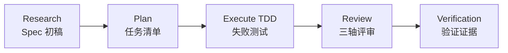
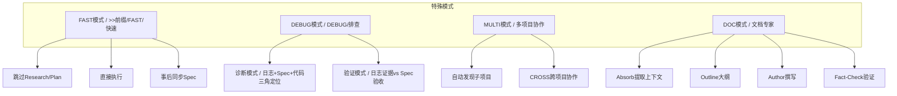
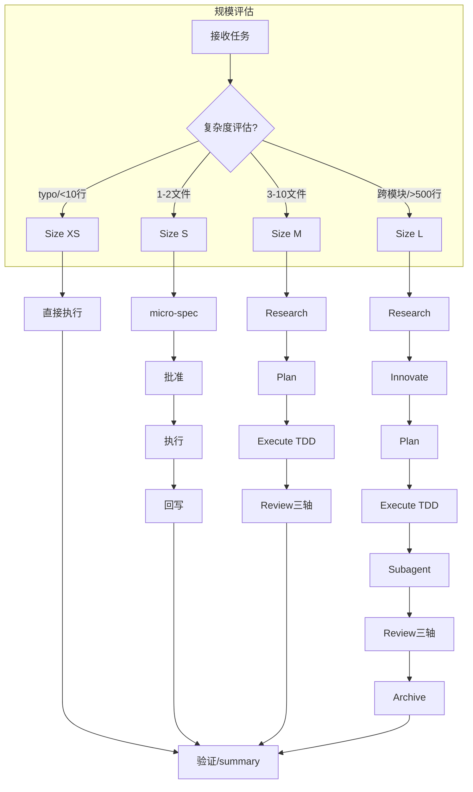
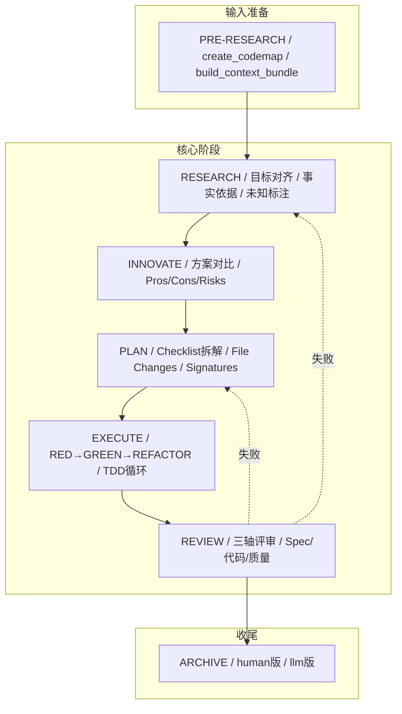

# 手把手教程

<cite>
**本文引用的文件**
- [README.md](file://README.md)
- [QUICKSTART.md](file://altas-workflow/QUICKSTART.md)
- [SKILL.md](file://altas-workflow/SKILL.md)
- [reference-index.md](file://altas-workflow/reference-index.md)
- [workflow-diagrams.md](file://altas-workflow/workflow-diagrams.md)
- [手把手教程.md](file://altas-workflow/docs/如何快速从零开始落地大模型编程 -- 手把手教程.md)
- [RIPER-5.md](file://altas-workflow/protocols/RIPER-5.md)
- [SDD-RIPER-DUAL-COOP.md](file://altas-workflow/protocols/SDD-RIPER-DUAL-COOP.md)
- [sdd-riper-one-light/SKILL.md](file://altas-workflow/references/agents/sdd-riper-one-light/SKILL.md)
- [archive_builder.py](file://altas-workflow/scripts/archive_builder.py)
- [spec-template.md](file://altas-workflow/references/spec-driven-development/spec-template.md)
- [spec-lite-template.md](file://altas-workflow/references/checkpoint-driven/spec-lite-template.md)
- [CLAUDE_MD_TESTING.md](file://altas-workflow/references/superpowers/writing-skills/examples/CLAUDE_MD_TESTING.md)
</cite>

## 目录
1. [简介](#简介)
2. [项目结构](#项目结构)
3. [核心组件](#核心组件)
4. [架构概览](#架构概览)
5. [详细组件分析](#详细组件分析)
6. [依赖分析](#依赖分析)
7. [性能考虑](#性能考虑)
8. [故障排除指南](#故障排除指南)
9. [结论](#结论)
10. [附录](#附录)

## 简介

ALTAS Workflow 是一套综合性 AI 原生研发工作流规范，融合了 SDD-RIPER、SDD-RIPER-Optimized (Checkpoint-Driven) 与 Superpowers 三大优秀工作流的精华。本教程旨在为读者提供从零开始落地大模型编程的完整实践指南，包括理论学习、实践演练、效果评估和持续改进的全过程。

### 核心使命

致力于解决 AI 编程中的四大工程痛点：
- **上下文腐烂**：CodeMap 索引 + 渐进式披露，按需加载参考资料
- **审查瘫痪**：4 级智能深度 (XS/S/M/L)，小任务不卡审批
- **代码不信任**：Spec 中心论 + 三轴评审，Spec is Truth
- **难以维护**：Archive 知识沉淀 + TDD 铁律，完成即资产

### 核心铁律

1. **No Spec, No Code** — 未形成最小 Spec 前不写代码 (Size XS 豁免)
2. **No Approval, No Execute** — Plan 阶段人类不点头，绝不写代码
3. **Spec is Truth** — Spec 与代码冲突时，代码是错的
4. **Reverse Sync** — 执行中发现偏差→先更新 Spec→再修代码
5. **Evidence First** — 完成由验证结果证明，非模型自宣布
6. **No Root Cause, No Fix** — Bug 修复前必须有根因分析，禁止盲改
7. **TDD Iron Law** — Size M/L: 无失败测试不写生产代码
8. **Resume Ready** — 长任务暂停前在 Spec 中留恢复锚点

## 项目结构

ALTAS Workflow 仓库采用模块化设计，包含以下主要目录结构：

```
altas/
├── altas-workflow/              # 主协议目录 (2.2M, 86 个文件)
│   ├── SKILL.md                 # ⭐ 核心系统提示词 (AI 读取)
│   ├── README.md                # ALTAS 详细说明
│   ├── QUICKSTART.md            # 场景化快速指南
│   ├── reference-index.md       # 参考资料总索引
│   ├── protocols/               # 专用协议 (3 个)
│   ├── docs/                    # 方法论文档 (4 篇)
│   ├── references/              # 按需加载的参考资料 (70 个文件)
│   ├── scripts/                 # 自动化工具
│   └── workflow-diagrams.md     # 工作流图表
├── AGENTS.md                    # 通用 AI 行为准则
├── CLAUDE.md                    # 通用 AI 行为准则
└── EXAMPLES.md                  # 四大原则代码示例
```

### 核心资产统计

| 类别 | 数量 | 说明 |
|------|------|------|
| **核心协议** | 1 个 | SKILL.md (ALTAS Workflow 主协议) |
| **专用协议** | 3 个 | RIPER-5 / RIPER-DOC / DUAL-COOP |
| **方法论** | 4 篇 | 从传统到大模型 / AI 原生范式 / 团队落地 / 手把手教程 |
| **参考资料** | 70 个 | Spec 驱动 (7) / Checkpoint (4) / Superpowers (37) / Agents (22) |
| **独立 Agent** | 2 个 | SDD-RIPER-ONE (标准版/轻量版) |
| **代码示例** | 1 个 | EXAMPLES.md (四大原则实战示例) |
| **自动化工具** | 1 个 | archive_builder.py (Archive 构建器) |

## 核心组件

### 1. 核心工作流协议

ALTAS Workflow 提供了完整的四阶段工作流，适用于不同规模的任务：



**流程说明**:
- **Research**: 研究对齐，形成 Spec（Goal, In-Scope, Out-of-Scope, Facts, Risks, Open Questions）
- **Plan**: 详细规划，拆解为原子 Checklist，明确 File Changes + Signatures + Done Contract
- **Execute**: TDD 驱动实现（RED→GREEN→REFACTOR）
- **Review**: 三轴评审（Spec 质量 / Spec-代码一致性 / 代码内在质量）
- **Verification**: 验证证据，确保测试通过

### 2. 四级任务深度适配

| 规模 | 触发条件 | Spec 要求 | 工作流 | 典型场景 |
|------|----------|----------|--------|----------|
| **XS (极速)** | typo、配置值、<10 行 | 跳过，事后 1 行 summary | 直接执行→验证→summary | 改配置、修 typo、日志 |
| **S (快速)** | 1-2 文件，逻辑清晰 | micro-spec (1-3 句) | micro-spec→批准→执行→回写 | 加参数、简单功能 |
| **M (标准)** | 3-10 文件，模块内 | 轻量 Spec 落盘 | Research→Plan→Execute(TDD)→Review | 新增接口、模块重构 |
| **L (深度)** | 跨模块、>500 行、架构级 | 完整 Spec + Innovate + Archive | Research→Innovate→Plan→Execute→Subagent→Review→Archive | 架构拆分、跨团队改造 |

### 3. 特殊模式

ALTAS Workflow 提供多种特殊模式以适应不同的开发场景：



## 架构概览

ALTAS Workflow 采用模块化架构设计，通过按需加载机制实现高效的上下文管理：



### 上下文装配策略

ALTAS Workflow 采用三层上下文装配策略：

| 层级 | 加载时机 | 内容 |
|------|----------|------|
| **Hot** (每轮) | 所有对话 | phase, approval状态, Spec路径, Goal, Scope, 活跃Checklist |
| **Warm** (阶段切换) | Research→Plan / Plan→Execute / Execute→Review | 研究发现, Plan文件/签名, 验证结果 |
| **Cold** (按需) | 冲突/不确定时 | 完整ChangeLog, 历史Research详情, 完整CodeMap |

## 详细组件分析

### 1. 手把手教程实践指南

#### 30 分钟快速上手教程

**第一步：环境配置**
1. 创建 `mydocs/` 目录结构
2. 安装并配置 AI 助手
3. 准备测试框架

**第二步：最小闭环实践**
1. 选择一个简单的配置修改任务
2. 使用 `>>` 前缀触发极速模式
3. 直接执行并验证结果
4. 生成 1 行 summary

**第三步：标准开发流程**
1. 使用 `sdd_bootstrap` 启动标准流程
2. 完成 Research 阶段
3. 进行 Plan 阶段
4. 执行 TDD 循环
5. 进行 Review 阶段

#### 单 Spec 主线操作指南

**Step 0: Pre-Research（输入准备与启动）**
1. `create_codemap`: 生成项目级 CodeMap
2. `build_context_bundle`: 整理需求上下文
3. `sdd_bootstrap`: 启动 RIPER 流程

**Step 1: Research（调研与意图锁定）**
1. 基于 CodeMap 核查现有实现
2. 确认入口、链路、边界
3. 识别潜在风险和未知项

**Step 2: Innovate（设计与推演）**
1. 提出 2-3 种可行方案
2. 对比 Pros/Cons/Risks
3. 做出最终决策

**Step 3: Plan（规划与契约）**
1. 列出原子级实施清单
2. 明确文件变更和签名
3. 建立 Done Contract

**Step 4: Execute（执行与编码）**
1. 按 Checklist 逐步执行
2. 遵循 TDD 循环
3. 处理编译错误

**Step 5: Review（审查与验收）**
1. 进行三轴评审
2. 反向同步 Spec
3. 修复发现的问题

### 2. 端到端闭环实践示例

#### 场景：为用户注册接口添加图形验证码

**输入**:
```
sdd_bootstrap: task=为用户注册接口添加图形验证码防刷功能，goal=安全性提升
```

**AI 行为**:
1. ✅ 自动评估规模 → Size M (Standard)
2. ✅ **Research** → 读取现有注册接口，发现没有图形库依赖 → 输出检查点
3. ✅ **Plan** → 列出 Checklist（引入库→改接口→加测试）→ 输出检查点等 [Approved]
4. ✅ **Execute** → TDD: 先写失败测试→实现逻辑→验证通过
5. ✅ **Review** → 三轴评审 → 确认通过

**产出**:
- Spec 文档：`mydocs/specs/YYYY-MM-DD_hh-mm_用户注册图形验证码.md`
- 代码改动：`src/api/auth.ts`, `src/utils/captcha.ts`
- 测试文件：`src/api/auth.test.ts`

### 3. 特殊模式详解

#### FAST 模式（极速通道）

**触发条件**: `>>` 前缀 / `FAST` / `快速`

**执行流程**:
- 跳过 Research 和 Plan → 直接执行 → 事后同步 Spec
- 适用于 UI 微调、配置修改、单文件逻辑、typo、日志

**升级机制**: 触及 >2 核心文件或架构 → 暂停，提议切换到标准模式

#### DEBUG 模式（系统化排查）

**触发条件**: `DEBUG` / `排查` / `日志分析`

**执行策略**:
- 诊断模式: 日志+Spec+代码三角定位→根因候选
- 验证模式: 日志证据 vs Spec 验收标准→PASS/FAIL/INCONCLUSIVE
- 约束: 只读分析；代码修改需进入 RIPER 或 FAST

#### MULTI 模式（多项目协作）

**触发条件**: `MULTI` / `多项目`

**自动发现**: 扫描 workdir 识别子项目（package.json/pom.xml/go.mod等）

**作用域**: 默认 `local`（仅改当前项目）；`CROSS`/`跨项目`→允许跨项目

## 依赖分析

### 1. 工作流阶段依赖关系



### 2. 参考资料依赖图

```mermaid
mindmap
root((参考资料))
Spec驱动开发
spec-template.md
commands.md
workflow-quickref.md
usage-examples.md
multi-project.md
archive-template.md
sdd-riper-one-protocol.md
Checkpoint驱动
modules.md
conventions.md
spec-lite-template.md
Superpowers
brainstorming
writing-plans
test-driven-development
systematic-debugging
subagent-driven-development
verification-before-completion
executing-plans
requesting-code-review
receiving-code-review
协议
RIPER-5
SDD-RIPER-DUAL-COOP
RIPER-DOC
方法论
从传统到大模型
团队落地指南
手把手教程
AI原生研发范式
```

### 3. 依赖关系矩阵

| 组件 | 直接依赖 | 间接依赖 | 外部依赖 |
|------|----------|----------|----------|
| SKILL.md | reference-index.md | workflow-diagrams.md | AI 平台 API |
| Spec 模板 | 命名约定 | 检查点机制 | 文档渲染工具 |
| Agent | 按需模块 | 参考资料索引 | 文件系统 |
| Archive 构建器 | 源文档 | 关键词提取 | Python 库 |

## 性能考虑

### 1. 上下文管理优化

ALTAS Workflow 通过三层上下文装配策略优化性能：

- **Hot Context**: 每轮对话加载，包含当前阶段状态和关键信息
- **Warm Context**: 阶段切换时加载，包含研究发现和验证结果
- **Cold Context**: 按需加载，包含完整历史和详细信息

### 2. 按需加载机制

- 参考资料只在命中场景时加载
- 避免上下文污染和 token 消耗
- 提高响应速度和准确性

### 3. 并行执行优化

- Subagent 驱动开发支持并行实现
- 两阶段 Review 确保质量
- 批量执行选项提高效率

## 故障排除指南

### 1. 常见问题解答

**Q: AI 一次性输出太多代码，跑完所有步骤怎么办？**
A: ALTAS 内置检查点机制，AI 完成一步后**必须**暂停等确认。如果 AI 暴走，回复："请停止，严格执行检查点机制，每次只推进一步。"

**Q: 如何中途干预 AI 的计划？**
A: 在任意检查点回复 `[修改] 请不要使用 Redis，改为内存缓存`，AI 会根据反馈调整 Plan 后重新请求 Approve。

**Q: 如何选择 XS/S/M/L？**
A: ALTAS 会自动评估。你也可以强制指定：`>>`=XS, `FAST`=S, 默认=M, `DEEP`=L。执行中可随时 `[升级为 M]` 或 `[降级为 S]`。

### 2. 错误处理策略

**TDD 相关问题**:
- **问题**: 为什么 AI 总是先写测试？太慢了。
- **解决方案**: 这是 Evidence First + TDD 铁律。没有失败测试，AI 生成的代码可能没被执行过。如果任务极简，用 `>>` 触发 XS 模式跳过 TDD。

**文档管理问题**:
- **问题**: mydocs/下太多 md 文件，要提交 Git 吗？
- **解决方案**: **强烈建议提交**。Spec 和 Archive 是项目的唯一真相源，防止上下文腐烂，帮助新人接手。

**参考资料问题**:
- **问题**: 参考资料 (references/) 太多，AI 每次都要全部读取吗？
- **解决方案**: **不需要**。ALTAS 采用渐进式披露，只在命中场景时按需读取对应文件。SKILL.md 中的参考索引表明确了每个文件的调用时机。

### 3. 调试技巧

**系统化 Debug 四阶段**:
1. 诊断模式: 日志+Spec+代码三角定位→根因候选
2. 验证模式: 日志证据 vs Spec 验收标准→PASS/FAIL/INCONCLUSIVE
3. 根因追踪: 深入分析问题根源
4. 纵深防御: 建立多层防护机制

## 结论

ALTAS Workflow 为大模型编程提供了完整的工程化解决方案。通过四阶段工作流、四级任务深度适配和特殊模式设计，它能够适应从简单配置修改到复杂架构重构的各种开发场景。

### 核心优势

1. **工程化保障**: 通过检查点机制和铁律约束，确保开发质量和可追溯性
2. **灵活适配**: 支持从小任务到架构级重构的全场景覆盖
3. **知识沉淀**: 通过 Archive 机制实现团队知识的有效传承
4. **团队协作**: 以 Spec 为中心的协作模式，降低沟通成本

### 实践建议

1. **从最小闭环开始**: 先用 30 分钟教程掌握基本流程
2. **渐进式深入**: 逐步学习高级模式和特殊场景
3. **持续改进**: 基于实际项目经验不断完善工作流
4. **团队推广**: 建立标准化的团队协作规范

ALTAS Workflow 不仅是一个技术工具，更是一种工程思维的体现。它教会我们如何在 AI 时代保持工程的严谨性和可维护性。

## 附录

### 1. 快速参考清单

**必备工具**:
- AI 助手（支持文件读写）
- 测试框架（npm test / pytest / go test）
- 文档编辑器
- Git 版本控制系统

**推荐目录结构**:
```
mydocs/
├── codemap/       # 长期代码索引资产
├── context/       # 一次性需求整理
├── specs/         # 核心Spec（组织记忆）
├── micro_specs/   # 轻量Spec
└── archive/       # 知识沉淀
```

### 2. 学习路径建议

**新手入门**:
1. 阅读《手把手教程》完整版
2. 完成 30 分钟快速上手
3. 实践单 Spec 主线操作
4. 探索特殊模式应用

**进阶提升**:
1. 学习 RIPER-5 严格模式
2. 掌握双模型协作协议
3. 研究 Subagent 驱动开发
4. 深入理解系统化 Debug

### 3. 最佳实践

**质量控制**:
- 始终遵循 No Spec, No Code 铁律
- 严格执行检查点机制
- 建立完善的测试体系
- 及时进行知识沉淀

**团队协作**:
- 以 Spec 为核心沟通工具
- 建立标准化的评审流程
- 培养团队的工程意识
- 持续优化工作流程

通过系统性地学习和实践 ALTAS Workflow，读者将能够建立起稳定的大模型编程流程，提高开发效率和代码质量，为团队创造可持续的竞争优势。