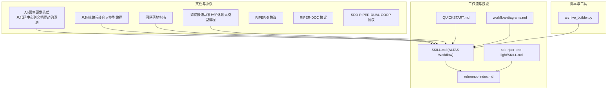
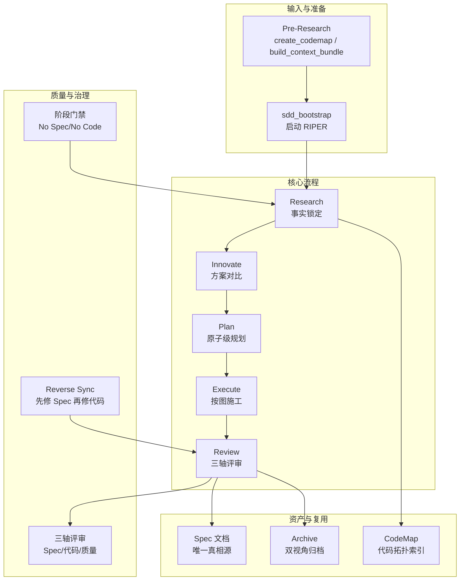
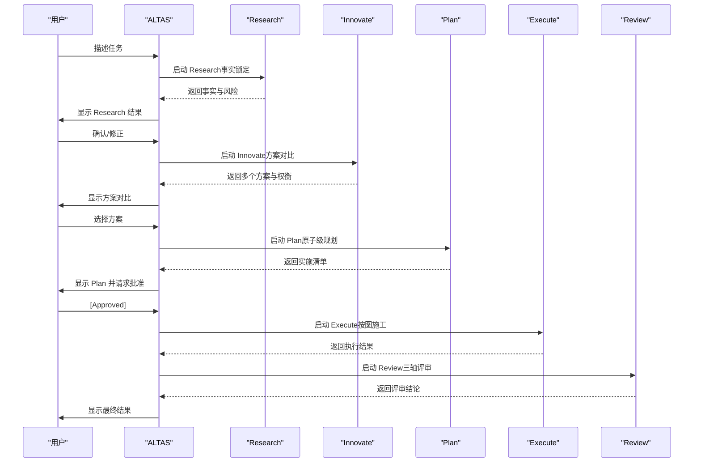
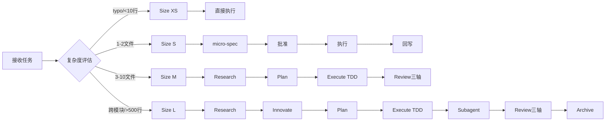
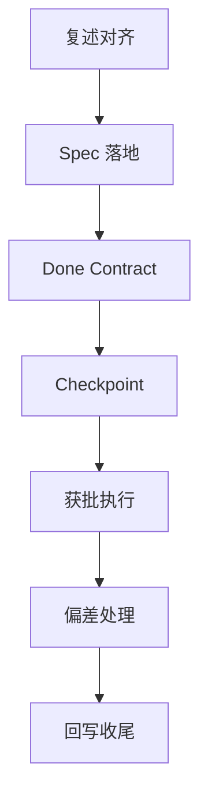
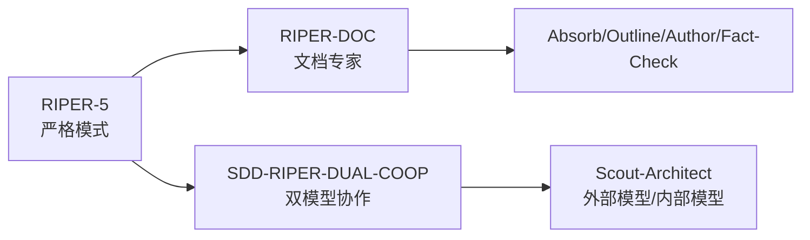
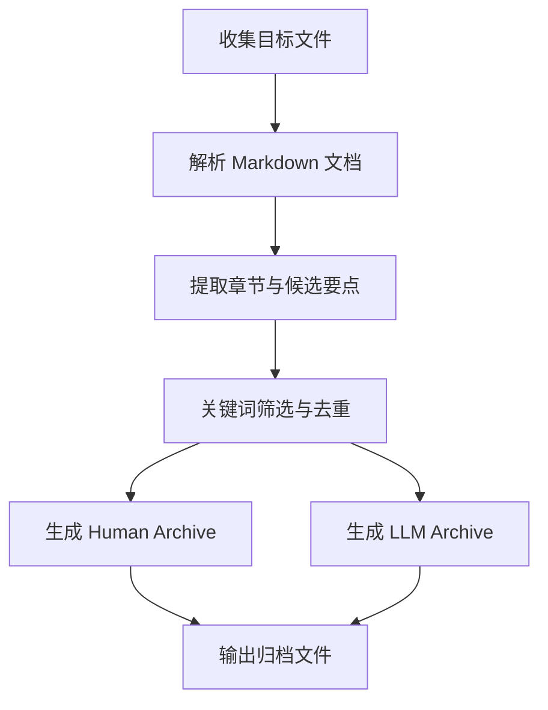
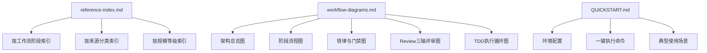

# 方法论文档

<cite>
**本文引用的文件**
- [AI-原生研发范式-从代码中心到文档驱动的演进.md](file://altas-workflow/docs/AI-原生研发范式-从代码中心到文档驱动的演进.md)
- [从传统编程转向大模型编程.md](file://altas-workflow/docs/从传统编程转向大模型编程.md)
- [团队落地指南.md](file://altas-workflow/docs/团队落地指南.md)
- [如何快速从零开始落地大模型编程 -- 手把手教程.md](file://altas-workflow/docs/如何快速从零开始落地大模型编程 -- 手把手教程.md)
- [QUICKSTART.md](file://altas-workflow/QUICKSTART.md)
- [SKILL.md](file://altas-workflow/SKILL.md)
- [reference-index.md](file://altas-workflow/reference-index.md)
- [workflow-diagrams.md](file://altas-workflow/workflow-diagrams.md)
- [RIPER-5.md](file://altas-workflow/protocols/RIPER-5.md)
- [RIPER-DOC.md](file://altas-workflow/protocols/RIPER-DOC.md)
- [SDD-RIPER-DUAL-COOP.md](file://altas-workflow/protocols/SDD-RIPER-DUAL-COOP.md)
- [sdd-riper-one-light/SKILL.md](file://altas-workflow/references/agents/sdd-riper-one-light/SKILL.md)
- [archive_builder.py](file://altas-workflow/scripts/archive_builder.py)
</cite>

## 目录
1. [引言](#引言)
2. [项目结构](#项目结构)
3. [核心组件](#核心组件)
4. [架构总览](#架构总览)
5. [详细组件分析](#详细组件分析)
6. [依赖分析](#依赖分析)
7. [性能考虑](#性能考虑)
8. [故障排除指南](#故障排除指南)
9. [结论](#结论)
10. [附录](#附录)

## 引言
本方法论文档面向 ALTAS Workflow 的 AI 原生研发范式，系统阐述从传统代码中心模式向文档驱动模式的演进历程，解析从传统编程转向大模型编程的核心理念与实践方法，并提供团队落地指南、组织架构调整、流程改造、人员培训与文化转型的完整方案。文档以理论指导与实操教程相结合的方式，为管理者、架构师与开发者提供可复制、可推广的方法论与实施建议。

## 项目结构
ALTAS Workflow 以“文档即协议”的理念为核心，围绕 Spec-Driven Development（SDD）、Checkpoint-Driven 与 Superpowers（TDD+Subagent）三大范式，构建了从个人到团队的全栈工作流体系。项目采用模块化与按需加载的设计，通过 Skill/Prompt、参考索引与脚本工具，实现流程的可迁移与可复用。

**图表来源**
- [AI-原生研发范式-从代码中心到文档驱动的演进.md:1-1165](file://altas-workflow/docs/AI-原生研发范式-从代码中心到文档驱动的演进.md#L1-L1165)
- [SKILL.md:1-351](file://altas-workflow/SKILL.md#L1-L351)
- [sdd-riper-one-light/SKILL.md:1-84](file://altas-workflow/references/agents/sdd-riper-one-light/SKILL.md#L1-L84)
- [QUICKSTART.md:1-182](file://altas-workflow/QUICKSTART.md#L1-L182)
- [reference-index.md:1-210](file://altas-workflow/reference-index.md#L1-L210)
- [workflow-diagrams.md:1-338](file://altas-workflow/workflow-diagrams.md#L1-L338)
- [RIPER-5.md:1-187](file://altas-workflow/protocols/RIPER-5.md#L1-L187)
- [RIPER-DOC.md:1-66](file://altas-workflow/protocols/RIPER-DOC.md#L1-L66)
- [SDD-RIPER-DUAL-COOP.md:1-210](file://altas-workflow/protocols/SDD-RIPER-DUAL-COOP.md#L1-L210)
- [archive_builder.py:1-505](file://altas-workflow/scripts/archive_builder.py#L1-L505)

**章节来源**
- [AI-原生研发范式-从代码中心到文档驱动的演进.md:1-1165](file://altas-workflow/docs/AI-原生研发范式-从代码中心到文档驱动的演进.md#L1-L1165)
- [QUICKSTART.md:1-182](file://altas-workflow/QUICKSTART.md#L1-L182)
- [SKILL.md:1-351](file://altas-workflow/SKILL.md#L1-L351)
- [reference-index.md:1-210](file://altas-workflow/reference-index.md#L1-L210)
- [workflow-diagrams.md:1-338](file://altas-workflow/workflow-diagrams.md#L1-L338)

## 核心组件
- 文档驱动开发（SDD）：以 Spec 为唯一真相源，贯穿需求、设计、实施、审查与归档的全生命周期，解决上下文腐烂、审查瘫痪与维护断层等工程痛点。
- RIPER 工作流：R（Research）-I（Innovate）-P（Plan）-E（Execute）-R（Review）的闭环状态机，配合阶段门禁与三轴评审，确保交付质量与可追溯性。
- ALTAS Workflow：融合 SDD、Checkpoint-Driven 与 Superpowers 的综合性工作流规范，支持 XS/S/M/L 四级任务规模评估与自动分流，提供进度可视化与检查点机制。
- 轻量 Skill（sdd-riper-one-light）：适用于强模型高频多轮场景，以最小 Spec 与关键锚点为核心，其余按需加载，降低常驻 Token 成本。
- 脚本与工具：archive_builder.py 实现双视角归档（human/llm），沉淀团队知识资产；参考索引与工作流图提供可视化理解与快速查阅。

**章节来源**
- [AI-原生研发范式-从代码中心到文档驱动的演进.md:184-356](file://altas-workflow/docs/AI-原生研发范式-从代码中心到文档驱动的演进.md#L184-L356)
- [SKILL.md:1-351](file://altas-workflow/SKILL.md#L1-L351)
- [sdd-riper-one-light/SKILL.md:1-84](file://altas-workflow/references/agents/sdd-riper-one-light/SKILL.md#L1-L84)
- [archive_builder.py:1-505](file://altas-workflow/scripts/archive_builder.py#L1-L505)

## 架构总览
ALTAS Workflow 的架构以“文档即协议”为基石，通过 Skill/Prompt 与参考索引实现流程的可迁移与可复用；通过按需加载与阶段门禁，平衡强模型能力与工程约束；通过归档脚本与工作流图，实现知识沉淀与可视化理解。

**图表来源**
- [AI-原生研发范式-从代码中心到文档驱动的演进.md:358-626](file://altas-workflow/docs/AI-原生研发范式-从代码中心到文档驱动的演进.md#L358-L626)
- [SKILL.md:138-218](file://altas-workflow/SKILL.md#L138-L218)
- [workflow-diagrams.md:45-67](file://altas-workflow/workflow-diagrams.md#L45-L67)

**章节来源**
- [AI-原生研发范式-从代码中心到文档驱动的演进.md:358-626](file://altas-workflow/docs/AI-原生研发范式-从代码中心到文档驱动的演进.md#L358-L626)
- [workflow-diagrams.md:1-338](file://altas-workflow/workflow-diagrams.md#L1-L338)

## 详细组件分析

### 组件 A：RIPER 工作流（研究-创新-规划-执行-审查）
RIPER 是 ALTAS Workflow 的核心闭环，通过阶段门禁与三轴评审，确保交付质量与可追溯性。每个阶段都有明确的产出与验收标准，执行中发现偏差必须先修 Spec 再修代码，形成“反向同步”。

**图表来源**
- [AI-原生研发范式-从代码中心到文档驱动的演进.md:305-323](file://altas-workflow/docs/AI-原生研发范式-从代码中心到文档驱动的演进.md#L305-L323)
- [如何快速从零开始落地大模型编程 -- 手把手教程.md:88-111](file://altas-workflow/docs/如何快速从零开始落地大模型编程 -- 手把手教程.md#L88-L111)

**章节来源**
- [AI-原生研发范式-从代码中心到文档驱动的演进.md:234-356](file://altas-workflow/docs/AI-原生研发范式-从代码中心到文档驱动的演进.md#L234-L356)
- [如何快速从零开始落地大模型编程 -- 手把手教程.md:88-134](file://altas-workflow/docs/如何快速从零开始落地大模型编程 -- 手把手教程.md#L88-L134)

### 组件 B：ALTAS Workflow（四尺度工作流与进度可视化）
ALTAS Workflow 以 XS/S/M/L 四级任务规模评估为基础，自动选择工作流深度与门禁约束，提供进度可视化与检查点机制，确保复杂任务的可控推进。

**图表来源**
- [workflow-diagrams.md:7-41](file://altas-workflow/workflow-diagrams.md#L7-L41)
- [SKILL.md:47-60](file://altas-workflow/SKILL.md#L47-L60)

**章节来源**
- [SKILL.md:1-351](file://altas-workflow/SKILL.md#L1-L351)
- [workflow-diagrams.md:1-338](file://altas-workflow/workflow-diagrams.md#L1-L338)

### 组件 C：轻量 Skill（sdd-riper-one-light）
sdd-riper-one-light 适用于强模型高频多轮场景，以最小 Spec 与关键锚点为核心，其余按需加载，降低常驻 Token 成本，同时保持严格的门禁与检查点机制。

**图表来源**
- [sdd-riper-one-light/SKILL.md:48-56](file://altas-workflow/references/agents/sdd-riper-one-light/SKILL.md#L48-L56)

**章节来源**
- [sdd-riper-one-light/SKILL.md:1-84](file://altas-workflow/references/agents/sdd-riper-one-light/SKILL.md#L1-L84)

### 组件 D：协议与专家模式
- RIPER-5：严格操作协议，强制模式声明与检查点机制，防止模型“先斩后奏”。
- RIPER-DOC：文档专家协议，将代码逻辑转化为清晰、可读的文档，确保准确性与可追溯性。
- SDD-RIPER-DUAL-COOP：双模型协作协议，明确外部模型（架构师）与内部模型（执行者）的角色边界与协作流程。

**图表来源**
- [RIPER-5.md:1-187](file://altas-workflow/protocols/RIPER-5.md#L1-L187)
- [RIPER-DOC.md:1-66](file://altas-workflow/protocols/RIPER-DOC.md#L1-L66)
- [SDD-RIPER-DUAL-COOP.md:1-210](file://altas-workflow/protocols/SDD-RIPER-DUAL-COOP.md#L1-L210)

**章节来源**
- [RIPER-5.md:1-187](file://altas-workflow/protocols/RIPER-5.md#L1-L187)
- [RIPER-DOC.md:1-66](file://altas-workflow/protocols/RIPER-DOC.md#L1-L66)
- [SDD-RIPER-DUAL-COOP.md:1-210](file://altas-workflow/protocols/SDD-RIPER-DUAL-COOP.md#L1-L210)

### 组件 E：归档与知识沉淀（archive_builder.py）
archive_builder.py 实现双视角归档（human/llm），将 Spec、CodeMap 等中间产物沉淀为可汇报版本与可复用上下文，支持主题化与快照化两种归档模式。

**图表来源**
- [archive_builder.py:122-154](file://altas-workflow/scripts/archive_builder.py#L122-L154)
- [archive_builder.py:227-248](file://altas-workflow/scripts/archive_builder.py#L227-L248)
- [archive_builder.py:318-443](file://altas-workflow/scripts/archive_builder.py#L318-L443)

**章节来源**
- [archive_builder.py:1-505](file://altas-workflow/scripts/archive_builder.py#L1-L505)

## 依赖分析
- 参考索引（reference-index.md）提供统一的参考资料发现入口，按工作流阶段与来源分类索引，支持按需加载与规模等级索引。
- 工作流图（workflow-diagrams.md）提供流程可视化参考，包括架构总览、阶段流程、铁律与门禁、三轴评审与 TDD 循环等。
- 快速启动（QUICKSTART.md）提供环境配置、一键执行命令与典型使用场景，帮助团队快速落地。

**图表来源**
- [reference-index.md:16-202](file://altas-workflow/reference-index.md#L16-L202)
- [workflow-diagrams.md:1-338](file://altas-workflow/workflow-diagrams.md#L1-L338)
- [QUICKSTART.md:1-182](file://altas-workflow/QUICKSTART.md#L1-L182)

**章节来源**
- [reference-index.md:1-210](file://altas-workflow/reference-index.md#L1-L210)
- [workflow-diagrams.md:1-338](file://altas-workflow/workflow-diagrams.md#L1-L338)
- [QUICKSTART.md:1-182](file://altas-workflow/QUICKSTART.md#L1-L182)

## 性能考虑
- Token 成本优化：Pre-Research（CodeMap/Context）与 Spec 作为缓存输入，显著降低输出 Token 消耗与对话轮次。
- 按需加载：参考索引与模块化 Skill，仅在命中场景时加载对应文件，减少常驻 Token。
- 阶段门禁：No Spec/No Code、No Approval/No Execute、Spec is Truth 等铁律，避免无效输出与返工。
- 归档复用：archive_builder.py 生成双视角归档，沉淀团队知识资产，降低后续任务的上下文成本。

## 故障排除指南
- 上下文腐烂：通过 Spec 文档作为外部状态锁，必要时 New Chat 后“重喂 Spec”。
- 审查瘫痪：先审 Plan 再写 Code，辅以三轴强制验收审查，避免人肉逐行 Review。
- 维护断层：修 Bug 先修文档，代码随时可以重新生成；通过 ChangeLog 与归档沉淀留痕。
- 多项目协作：使用 MULTI 模式自动发现子项目，强制锁定契约一致性与作用域隔离。
- 模型边界：RIPER-5 强制模式声明与检查点机制，防止模型“先斩后奏”。

**章节来源**
- [AI-原生研发范式-从代码中心到文档驱动的演进.md:208-241](file://altas-workflow/docs/AI-原生研发范式-从代码中心到文档驱动的演进.md#L208-L241)
- [团队落地指南.md:59-82](file://altas-workflow/docs/团队落地指南.md#L59-L82)
- [RIPER-5.md:1-187](file://altas-workflow/protocols/RIPER-5.md#L1-L187)

## 结论
ALTAS Workflow 通过“文档即协议”的工程体系，将大模型编程从“灵感爆发”转变为“工业化生产”。以 SDD 为核心，结合 RIPER 工作流、ALTAS Workflow 与轻量 Skill，实现从个人到团队的可复制、可推广方法论。通过阶段门禁、三轴评审与归档沉淀，解决上下文腐烂、审查瘫痪与维护断层等工程痛点，为管理者、架构师与开发者提供系统的方法论指导与实施建议。

## 附录
- 快速启动：参考 [QUICKSTART.md:1-182](file://altas-workflow/QUICKSTART.md#L1-L182) 完成环境配置与一键执行命令。
- 方法论体系：参考 [AI-原生研发范式-从代码中心到文档驱动的演进.md:1-1165](file://altas-workflow/docs/AI-原生研发范式-从代码中心到文档驱动的演进.md#L1-L1165) 与 [从传统编程转向大模型编程.md:1-420](file://altas-workflow/docs/从传统编程转向大模型编程.md#L1-L420)。
- 团队落地：参考 [团队落地指南.md:1-1050](file://altas-workflow/docs/团队落地指南.md#L1-L1050) 与 [如何快速从零开始落地大模型编程 -- 手把手教程.md:1-696](file://altas-workflow/docs/如何快速从零开始落地大模型编程 -- 手把手教程.md#L1-L696)。
- 协议与专家模式：参考 [RIPER-5.md:1-187](file://altas-workflow/protocols/RIPER-5.md#L1-L187)、[RIPER-DOC.md:1-66](file://altas-workflow/protocols/RIPER-DOC.md#L1-L66) 与 [SDD-RIPER-DUAL-COOP.md:1-210](file://altas-workflow/protocols/SDD-RIPER-DUAL-COOP.md#L1-L210)。
- 可视化与索引：参考 [workflow-diagrams.md:1-338](file://altas-workflow/workflow-diagrams.md#L1-L338) 与 [reference-index.md:1-210](file://altas-workflow/reference-index.md#L1-L210)。
- 归档工具：参考 [archive_builder.py:1-505](file://altas-workflow/scripts/archive_builder.py#L1-L505)。