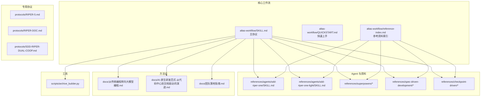
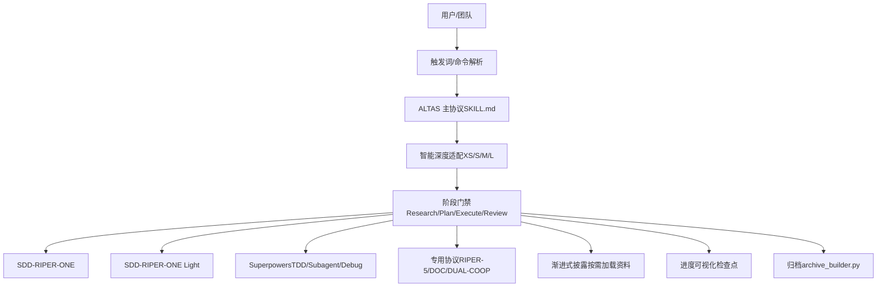
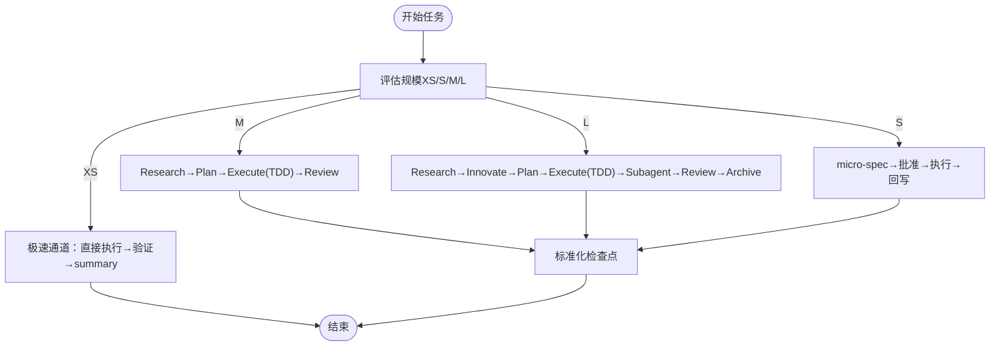
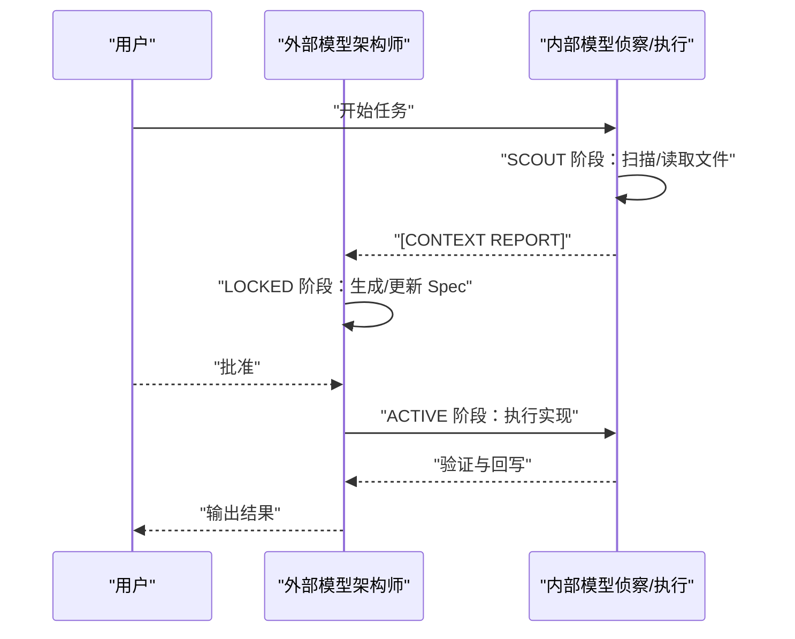
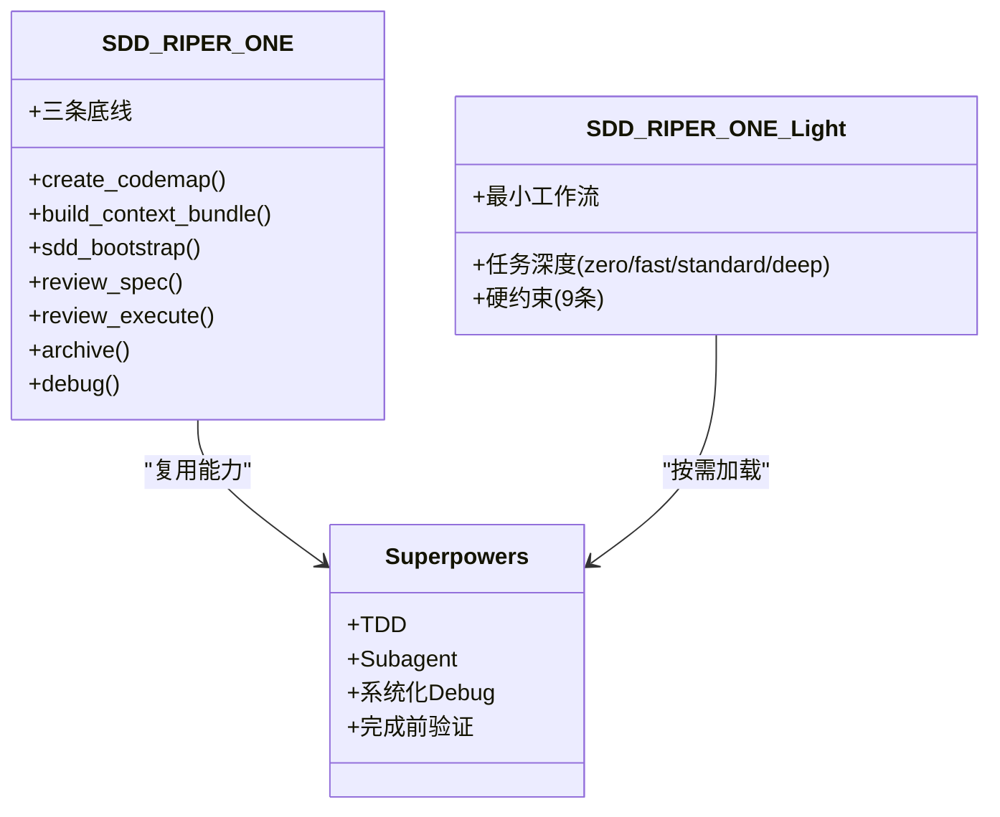
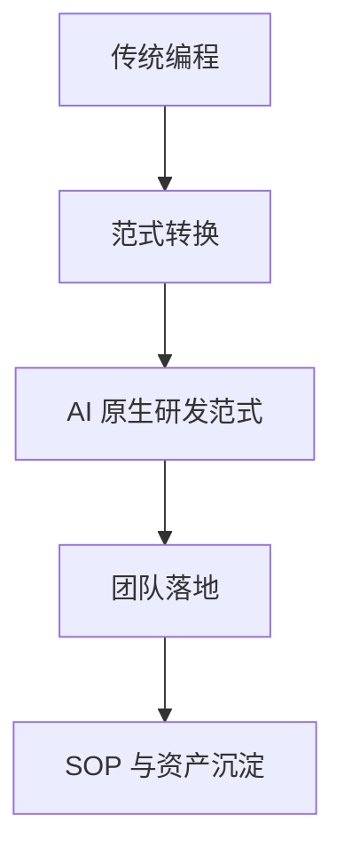
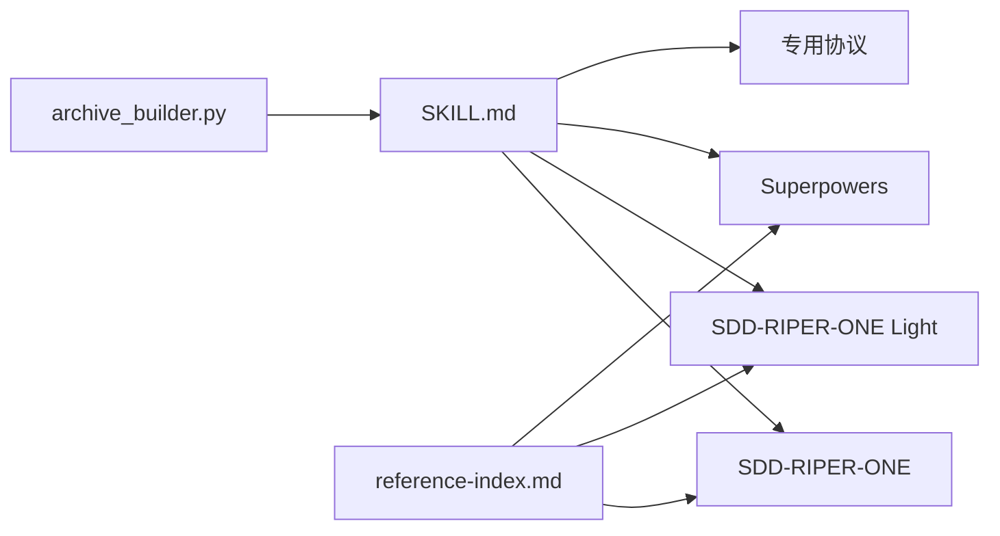

# 编程范式转换

<cite>
**本文引用的文件**
- [README.md](file://README.md)
- [altas-workflow/SKILL.md](file://altas-workflow/SKILL.md)
- [altas-workflow/QUICKSTART.md](file://altas-workflow/QUICKSTART.md)
- [altas-workflow/reference-index.md](file://altas-workflow/reference-index.md)
- [altas-workflow/protocols/RIPER-5.md](file://altas-workflow/protocols/RIPER-5.md)
- [altas-workflow/protocols/RIPER-DOC.md](file://altas-workflow/protocols/RIPER-DOC.md)
- [altas-workflow/protocols/SDD-RIPER-DUAL-COOP.md](file://altas-workflow/protocols/SDD-RIPER-DUAL-COOP.md)
- [altas-workflow/references/agents/sdd-riper-one/SKILL.md](file://altas-workflow/references/agents/sdd-riper-one/SKILL.md)
- [altas-workflow/references/agents/sdd-riper-one-light/SKILL.md](file://altas-workflow/references/agents/sdd-riper-one-light/SKILL.md)
- [altas-workflow/scripts/archive_builder.py](file://altas-workflow/scripts/archive_builder.py)
- [AGENTS.md](file://AGENTS.md)
- [altas-workflow/docs/从传统编程转向大模型编程.md](file://altas-workflow/docs/从传统编程转向大模型编程.md)
- [altas-workflow/docs/AI-原生研发范式-从代码中心到文档驱动的演进.md](file://altas-workflow/docs/AI-原生研发范式-从代码中心到文档驱动的演进.md)
- [altas-workflow/docs/团队落地指南.md](file://altas-workflow/docs/团队落地指南.md)
</cite>

## 目录
1. [简介](#简介)
2. [项目结构](#项目结构)
3. [核心组件](#核心组件)
4. [架构总览](#架构总览)
5. [详细组件分析](#详细组件分析)
6. [依赖分析](#依赖分析)
7. [性能考虑](#性能考虑)
8. [故障排除指南](#故障排除指南)
9. [结论](#结论)
10. [附录](#附录)

## 简介
本指南面向从传统编程向大模型编程转型的工程团队，系统阐述如何以 ALTAS Workflow 为核心，完成范式转换、建立可规模化的 AI 工程方法，并将个人技巧沉淀为团队 SOP。文档聚焦解决三大现实问题：
- 工具选择过载导致协作割裂
- 过度关注“锤子”忽视“房子”的质量指标
- 使用方式停留在“Chatbot 助手”的局限

通过“文档即真相源”的 Spec-Driven Development（SDD）与 RIPER 工作流，配合 Checkpoint-Driven 与 Superpowers（TDD、Subagent、系统化 Debug 等）能力，形成“智能深度适配 + 进度可视化 + 渐进式披露 + 铁律约束”的闭环，实现从“代码产出者”到“意图定义者”的角色跃迁。

## 项目结构
仓库采用“协议 + 方法论 + 资料 + Agent + 工具”的分层组织：
- altas-workflow：核心工作流与方法论
  - SKILL.md：主协议（ALTAS Workflow）
  - QUICKSTART.md：快速上手
  - docs：方法论文档（范式转换、AI 原生研发、团队落地、教程）
  - protocols：专用协议（RIPER-5、RIPER-DOC、双模型协作）
  - references：按需加载的参考资料（Spec 驱动、Checkpoint、Superpowers、Agents）
  - scripts：自动化工具（archive_builder.py）
- 顶层文档：AGENTS.md（通用 AI 行为准则）、EXAMPLES.md（四大原则示例）

图表来源
- [README.md:48-82](file://README.md#L48-L82)
- [altas-workflow/SKILL.md:1-351](file://altas-workflow/SKILL.md#L1-L351)
- [altas-workflow/reference-index.md:1-210](file://altas-workflow/reference-index.md#L1-L210)

章节来源
- [README.md:48-82](file://README.md#L48-L82)
- [altas-workflow/reference-index.md:1-210](file://altas-workflow/reference-index.md#L1-L210)

## 核心组件
- 主协议（ALTAS Workflow）
  - 智能深度适配（XS/S/M/L 四级）
  - 进度可视化（标准化检查点）
  - 渐进式披露（按需加载参考资料）
  - 铁律约束（No Spec, No Code；Spec is Truth；Evidence First；TDD 铁律等）
- 专用协议
  - RIPER-5：严格模式，强制模式声明与阶段门禁
  - RIPER-DOC：文档专家模式（Absorb→Outline→Author→Fact-Check）
  - SDD-RIPER-DUAL-COOP：双模型协作（Scout-Architect）
- Agent 与 Superpowers
  - SDD-RIPER-ONE / Light：标准与轻量两种执行形态
  - Superpowers：TDD、系统化 Debug、Subagent 驱动、并行 Agent、完成前验证等
- 自动化工具
  - archive_builder.py：生成 human/llm 双视角归档

章节来源
- [altas-workflow/SKILL.md:1-351](file://altas-workflow/SKILL.md#L1-L351)
- [altas-workflow/protocols/RIPER-5.md:1-187](file://altas-workflow/protocols/RIPER-5.md#L1-L187)
- [altas-workflow/protocols/RIPER-DOC.md:1-66](file://altas-workflow/protocols/RIPER-DOC.md#L1-L66)
- [altas-workflow/protocols/SDD-RIPER-DUAL-COOP.md:1-210](file://altas-workflow/protocols/SDD-RIPER-DUAL-COOP.md#L1-L210)
- [altas-workflow/references/agents/sdd-riper-one/SKILL.md:1-208](file://altas-workflow/references/agents/sdd-riper-one/SKILL.md#L1-L208)
- [altas-workflow/references/agents/sdd-riper-one-light/SKILL.md:1-84](file://altas-workflow/references/agents/sdd-riper-one-light/SKILL.md#L1-L84)
- [altas-workflow/scripts/archive_builder.py:1-505](file://altas-workflow/scripts/archive_builder.py#L1-L505)

## 架构总览
ALTAS 的系统架构以“协议 + Agent + 资料 + 工具”为核心，通过触发词与命令驱动不同模式（FAST/DEBUG/MULTI/DOC/MAP/ARCHIVE），在 XS/S/M/L 四级深度间自动升降级，配合 Checkpoint 与三轴评审，形成“定义→计划→执行→验证→归档”的闭环。

图表来源
- [altas-workflow/SKILL.md:138-275](file://altas-workflow/SKILL.md#L138-L275)
- [altas-workflow/QUICKSTART.md:36-49](file://altas-workflow/QUICKSTART.md#L36-L49)
- [altas-workflow/reference-index.md:16-202](file://altas-workflow/reference-index.md#L16-L202)

章节来源
- [altas-workflow/SKILL.md:138-275](file://altas-workflow/SKILL.md#L138-L275)
- [altas-workflow/QUICKSTART.md:36-49](file://altas-workflow/QUICKSTART.md#L36-L49)
- [altas-workflow/reference-index.md:16-202](file://altas-workflow/reference-index.md#L16-L202)

## 详细组件分析

### 组件一：主协议（ALTAS Workflow）
- 核心原则
  - Spec is Truth：文档是唯一真相源
  - No Approval, No Execute：Plan 阶段人类不点头，绝不写代码
  - Evidence First：完成由验证结果证明
- 智能深度适配
  - XS：typo/配置值，事后 1 行 summary
  - S：micro-spec → 批准 → 执行 → 回写
  - M：Research → Plan → Execute(TDD) → Review
  - L：Research → Innovate → Plan → Execute(TDD) → Subagent → Review → Archive
- 进度可视化
  - XS：1 行 summary
  - S：短 checkpoint
  - M/L：完整检查点（当前成果/预期产出/下一步操作）
- 渐进式披露
  - 按需加载资料，避免上下文污染
  - 参考索引表明确各阶段加载文件
- 铁律约束
  - No Spec, No Code；Spec is Truth；Reverse Sync；Evidence First；No Fixes Without Root Cause；TDD Iron Law；Resume Ready

图表来源
- [altas-workflow/SKILL.md:47-134](file://altas-workflow/SKILL.md#L47-L134)
- [altas-workflow/SKILL.md:138-218](file://altas-workflow/SKILL.md#L138-L218)

章节来源
- [altas-workflow/SKILL.md:1-351](file://altas-workflow/SKILL.md#L1-L351)

### 组件二：专用协议
- RIPER-5：严格模式，强制模式声明与阶段门禁，防止模型擅自实现
- RIPER-DOC：文档专家模式，四阶段（Absorb→Outline→Author→Fact-Check）
- SDD-RIPER-DUAL-COOP：双模型协作，外部模型（Architect）负责 Spec，内部模型（Scout/Executor）负责上下文收集与实现

图表来源
- [altas-workflow/protocols/SDD-RIPER-DUAL-COOP.md:76-153](file://altas-workflow/protocols/SDD-RIPER-DUAL-COOP.md#L76-L153)

章节来源
- [altas-workflow/protocols/RIPER-5.md:1-187](file://altas-workflow/protocols/RIPER-5.md#L1-L187)
- [altas-workflow/protocols/RIPER-DOC.md:1-66](file://altas-workflow/protocols/RIPER-DOC.md#L1-L66)
- [altas-workflow/protocols/SDD-RIPER-DUAL-COOP.md:1-210](file://altas-workflow/protocols/SDD-RIPER-DUAL-COOP.md#L1-L210)

### 组件三：Agent 与 Superpowers
- SDD-RIPER-ONE（标准版）
  - 全流程门禁：No Spec, No Code；No Approval, No Execute；Spec is Truth；Reverse Sync
  - 原生命令：create_codemap、build_context_bundle、sdd_bootstrap、review_spec、review_execute、archive、debug
- SDD-RIPER-ONE Light（轻量版）
  - Checkpoint-Driven：只常驻最小锚点，其余按需加载
  - 任务深度：zero/fast/standard/deep，自动升降级
  - 硬约束：9 条核心约束（含 Done by Evidence、Resume Ready 等）
- Superpowers
  - TDD 铁律：Size M/L 无失败测试不写生产代码
  - Subagent 驱动：并行实现 + 两阶段 Review
  - 系统化 Debug：四阶段根因分析
  - 完成前验证：三轴评审与验收

图表来源
- [altas-workflow/references/agents/sdd-riper-one/SKILL.md:1-208](file://altas-workflow/references/agents/sdd-riper-one/SKILL.md#L1-L208)
- [altas-workflow/references/agents/sdd-riper-one-light/SKILL.md:1-84](file://altas-workflow/references/agents/sdd-riper-one-light/SKILL.md#L1-L84)

章节来源
- [altas-workflow/references/agents/sdd-riper-one/SKILL.md:1-208](file://altas-workflow/references/agents/sdd-riper-one/SKILL.md#L1-L208)
- [altas-workflow/references/agents/sdd-riper-one-light/SKILL.md:1-84](file://altas-workflow/references/agents/sdd-riper-one-light/SKILL.md#L1-L84)

### 组件四：方法论与范式转换
- 从传统编程转向大模型编程
  - 从“砌砖的工匠”进化为“画图纸的建筑师”
  - 以“定义问题的清晰度、验收结果的敏锐度、架构设计的掌控力”为核心
  - 解决上下文腐烂、审查瘫痪、维护断层等工程痛点
- AI 原生研发范式
  - “文档/规范”成为任务的唯一事实来源
  - 以 Spec 为中心的协作协议 + 可验证门禁
  - 通过“文档即太阳”的心法，让 AI 围绕规范执行与互审
- 团队落地指南
  - 五大场景：研发提效、人力解耦、知识不随人走、跨团队协作、安全合规
  - 四层质量保障：Plan 前置审查、执行及验收闭环、Spec 回写闭环、RIPER 阶段门禁
  - 三条铁律：No Spec, No Code；Spec is Truth；Reverse Sync

图表来源
- [altas-workflow/docs/从传统编程转向大模型编程.md:1-420](file://altas-workflow/docs/从传统编程转向大模型编程.md#L1-L420)
- [altas-workflow/docs/AI-原生研发范式-从代码中心到文档驱动的演进.md:1-800](file://altas-workflow/docs/AI-原生研发范式-从代码中心到文档驱动的演进.md#L1-L800)
- [altas-workflow/docs/团队落地指南.md:1-800](file://altas-workflow/docs/团队落地指南.md#L1-L800)

章节来源
- [altas-workflow/docs/从传统编程转向大模型编程.md:1-420](file://altas-workflow/docs/从传统编程转向大模型编程.md#L1-L420)
- [altas-workflow/docs/AI-原生研发范式-从代码中心到文档驱动的演进.md:1-800](file://altas-workflow/docs/AI-原生研发范式-从代码中心到文档驱动的演进.md#L1-L800)
- [altas-workflow/docs/团队落地指南.md:1-800](file://altas-workflow/docs/团队落地指南.md#L1-L800)

## 依赖分析
- 协议与 Agent 的耦合
  - ALTAS 主协议统一调度 SDD-RIPER-ONE 与 Light，按规模自动选择执行形态
  - Superpowers 能力按需注入，避免常驻上下文膨胀
- 资料与 Agent 的解耦
  - reference-index.md 提供统一发现入口，Agent 仅在命中场景时按需加载
- 工具与流程的集成
  - archive_builder.py 与主协议的 Archive 阶段无缝衔接，生成 human/llm 双视角归档

图表来源
- [altas-workflow/SKILL.md:278-300](file://altas-workflow/SKILL.md#L278-L300)
- [altas-workflow/reference-index.md:16-202](file://altas-workflow/reference-index.md#L16-L202)
- [altas-workflow/scripts/archive_builder.py:1-505](file://altas-workflow/scripts/archive_builder.py#L1-L505)

章节来源
- [altas-workflow/SKILL.md:278-300](file://altas-workflow/SKILL.md#L278-L300)
- [altas-workflow/reference-index.md:16-202](file://altas-workflow/reference-index.md#L16-L202)
- [altas-workflow/scripts/archive_builder.py:1-505](file://altas-workflow/scripts/archive_builder.py#L1-L505)

## 性能考虑
- 上下文装配策略
  - Hot/Warm/Cold 三层装配：热上下文每轮必带，温上下文阶段切换加载，冷上下文按需加载
  - 冲突/缺失/不确定时硬门：立即从磁盘重读完整 Spec
- 渐进式披露
  - 参考资料仅在命中场景加载，避免上下文污染与 Token 消耗
- 自动升降级
  - 执行中发现复杂度超出预期 → 立即暂停，提议升级
  - 用户可随时 `[升级为M]/[降级为S]` 调整
- 工具化归档
  - archive_builder.py 支持 snapshot/thematic 模式，按主题或快照生成归档，减少重复劳动

章节来源
- [altas-workflow/SKILL.md:318-334](file://altas-workflow/SKILL.md#L318-L334)
- [altas-workflow/SKILL.md:278-299](file://altas-workflow/SKILL.md#L278-L299)
- [altas-workflow/scripts/archive_builder.py:1-505](file://altas-workflow/scripts/archive_builder.py#L1-L505)

## 故障排除指南
- AI 一次性输出过多代码
  - ALTAS 内置检查点机制，AI 完成一步后必须暂停等确认
  - 若暴走，回复：“请停止，严格执行检查点机制，每次只推进一步”
- 中途干预计划
  - 在任意检查点回复 `[修改] 请不要使用 Redis，改为内存缓存`，AI 会根据反馈调整 Plan 后重新请求 Approve
- 规模选择困惑
  - ALTAS 会自动评估；也可强制指定：`>>`=XS, `FAST`=S, 默认=M, `DEEP`=L
  - 执行中可随时 `[升级为M]` 或 `[降级为S]`
- 资料加载过多
  - 不需要全部读取，按需加载；参考 reference-index.md 的调用时机
- 多人协作
  - Spec 是团队共享的真相源；每个人创建自己的 Spec 文件，通过 Git 协作
  - 核心开发者只需 Review Plan，不必 Review 全部代码

章节来源
- [altas-workflow/QUICKSTART.md:119-152](file://altas-workflow/QUICKSTART.md#L119-L152)
- [altas-workflow/reference-index.md:16-202](file://altas-workflow/reference-index.md#L16-L202)

## 结论
ALTAS Workflow 以“文档即真相源”为核心，通过智能深度适配、进度可视化、渐进式披露与铁律约束，将个人技巧升级为团队 SOP，构建可规模化的 AI 工程方法。通过范式转换，团队可摆脱工具选择过载、纠偏“锤子”与“房子”的质量指标失衡、突破“Chatbot 助手”的使用局限，最终实现“代码是消耗品，上下文是核心资产”的工程目标。

## 附录
- 快速导航
  - 新手入门：快速启动指南、范式转换、手把手教程
  - 快速参考：核心命令、规模评估、参考资料索引、详细文档
  - 高级用法：RIPER-5 严格模式、Subagent 驱动开发、系统化 Debug
- 通用 AI 行为准则
  - AGENTS.md：行为准则（思考在编码前、简洁优先、手术式改动、目标驱动执行）

章节来源
- [README.md:647-673](file://README.md#L647-L673)
- [AGENTS.md:1-65](file://AGENTS.md#L1-L65)