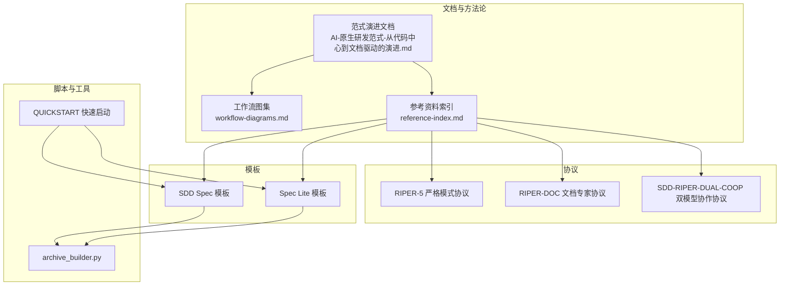
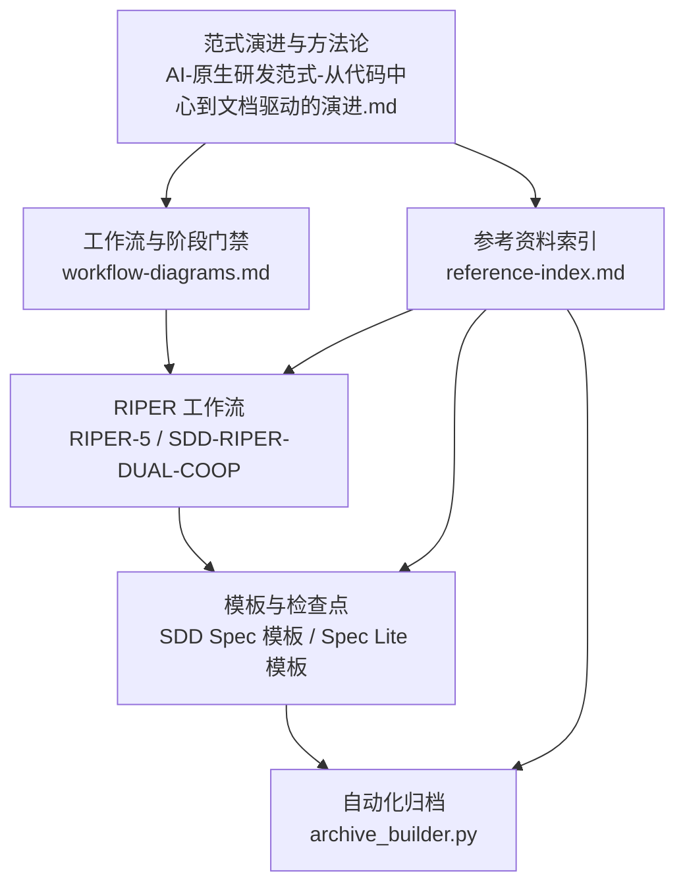
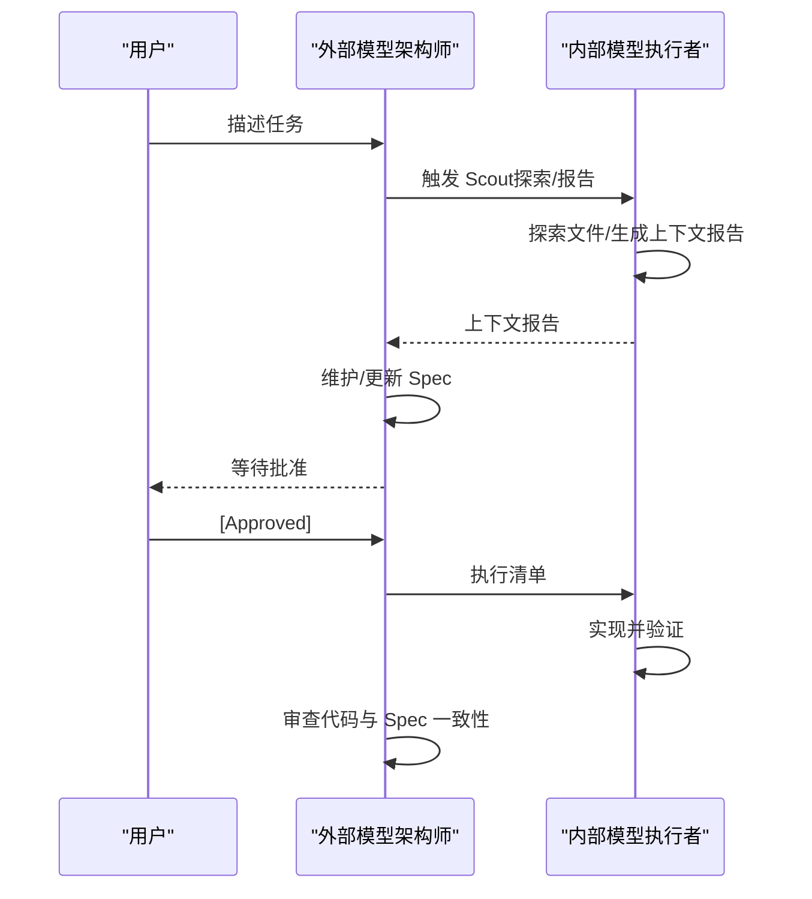
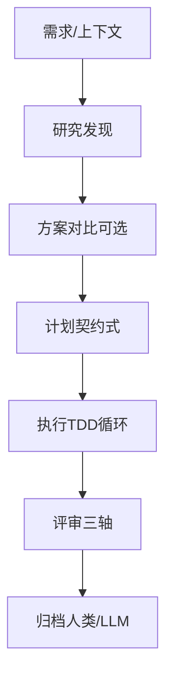
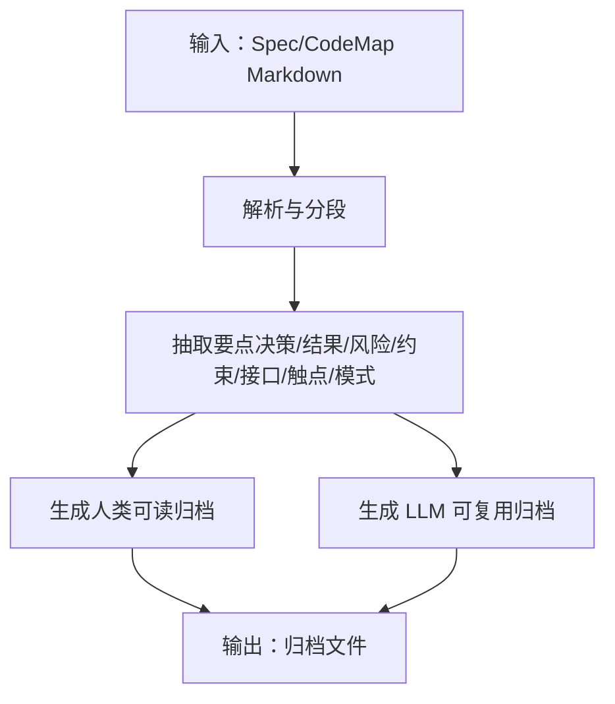
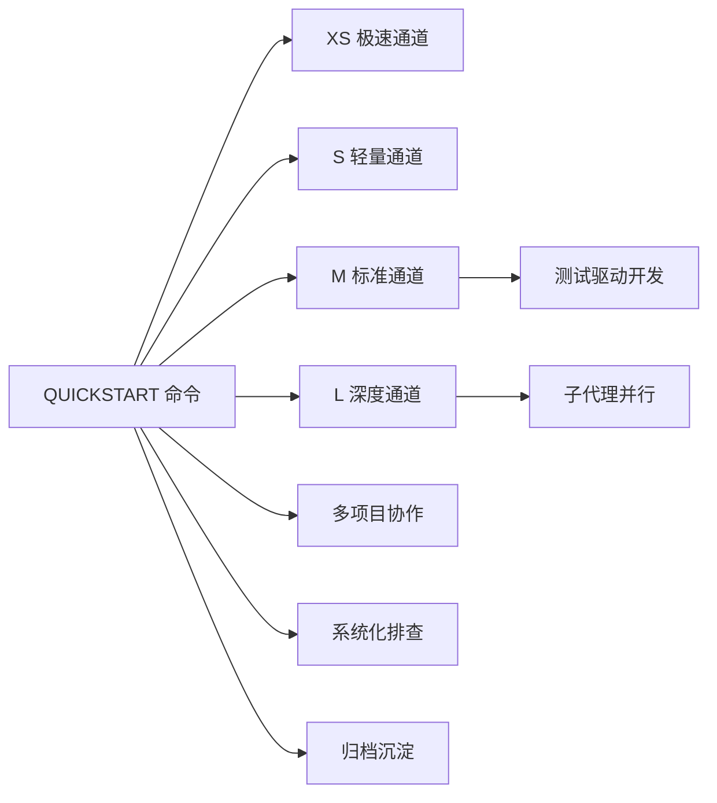
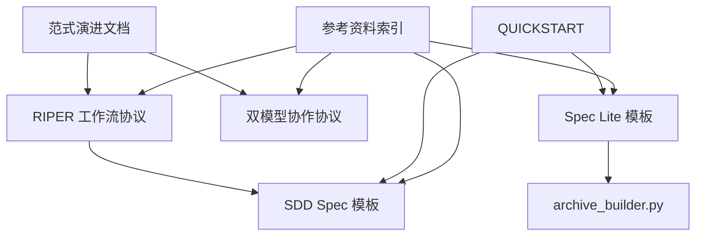

# 范式演进历程

<cite>
**本文引用的文件**
- [AI-原生研发范式-从代码中心到文档驱动的演进.md](file://altas-workflow/docs/AI-原生研发范式-从代码中心到文档驱动的演进.md)
- [RIPER-5.md](file://altas-workflow/protocols/RIPER-5.md)
- [RIPER-DOC.md](file://altas-workflow/protocols/RIPER-DOC.md)
- [SDD-RIPER-DUAL-COOP.md](file://altas-workflow/protocols/SDD-RIPER-DUAL-COOP.md)
- [QUICKSTART.md](file://altas-workflow/QUICKSTART.md)
- [reference-index.md](file://altas-workflow/reference-index.md)
- [workflow-diagrams.md](file://altas-workflow/workflow-diagrams.md)
- [SDD Spec 模板.md](file://altas-workflow/references/spec-driven-development/spec-template.md)
- [Spec Lite 模板.md](file://altas-workflow/references/checkpoint-driven/spec-lite-template.md)
- [Superpowers：头脑风暴 SKILL.md](file://altas-workflow/references/superpowers/brainstorming/SKILL.md)
- [Superpowers：测试驱动开发 SKILL.md](file://altas-workflow/references/superpowers/test-driven-development/SKILL.md)
- [archive_builder.py](file://altas-workflow/scripts/archive_builder.py)
- [SDD-RIPER-ONE README.md](file://altas-workflow/references/agents/sdd-riper-one/README.md)
- [SDD-RIPER-ONE Light README.md](file://altas-workflow/references/agents/sdd-riper-one-light/README.md)
</cite>

## 目录
1. [引言](#引言)
2. [项目结构](#项目结构)
3. [核心组件](#核心组件)
4. [架构总览](#架构总览)
5. [详细组件分析](#详细组件分析)
6. [依赖分析](#依赖分析)
7. [性能考量](#性能考量)
8. [故障排查指南](#故障排查指南)
9. [结论](#结论)
10. [附录](#附录)

## 引言
本文件系统化阐述 AI 原生研发范式的演进历程，围绕从“代码中心”到“文档驱动”的根本性转变，深入剖析四大工程痛点（上下文腐烂、审查瘫痪、维护断层、代码不信任）及其对应的 SDD（Spec-Driven Development，规范驱动开发）解决方案。SDD 以“文档锚点”锁定上下文，使 AI 编程具备可回溯、可审查、可维护的特性；并通过 RIPER 工作流、严格模式协议、双模型协作协议与归档沉淀机制，构建可复制、可审计、可复用的工程能力。

## 项目结构
该项目以“方法论文档 + 协议 + 模板 + 脚本 + 快速启动指南”为核心，形成“理论—协议—实践—工具”的闭环：
- 文档层：系统化阐述范式与方法论
- 协议层：RIPER-5、RIPER-DOC、SDD-RIPER-DUAL-COOP 等严格模式与协作协议
- 模板层：SDD Spec 模板、Spec Lite 模板，支撑不同规模任务
- 脚本层：archive_builder.py 自动化归档，沉淀知识
- 快速启动：QUICKSTART 提供命令与场景化示例

图表来源
- [AI-原生研发范式-从代码中心到文档驱动的演进.md:1-1165](file://altas-workflow/docs/AI-原生研发范式-从代码中心到文档驱动的演进.md#L1-L1165)
- [workflow-diagrams.md:1-338](file://altas-workflow/workflow-diagrams.md#L1-L338)
- [reference-index.md:1-210](file://altas-workflow/reference-index.md#L1-L210)
- [RIPER-5.md:1-187](file://altas-workflow/protocols/RIPER-5.md#L1-L187)
- [RIPER-DOC.md:1-66](file://altas-workflow/protocols/RIPER-DOC.md#L1-L66)
- [SDD-RIPER-DUAL-COOP.md:1-210](file://altas-workflow/protocols/SDD-RIPER-DUAL-COOP.md#L1-L210)
- [SDD Spec 模板.md:1-297](file://altas-workflow/references/spec-driven-development/spec-template.md#L1-L297)
- [Spec Lite 模板.md:1-85](file://altas-workflow/references/checkpoint-driven/spec-lite-template.md#L1-L85)
- [archive_builder.py:1-505](file://altas-workflow/scripts/archive_builder.py#L1-L505)
- [QUICKSTART.md:1-182](file://altas-workflow/QUICKSTART.md#L1-L182)

章节来源
- [AI-原生研发范式-从代码中心到文档驱动的演进.md:1-1165](file://altas-workflow/docs/AI-原生研发范式-从代码中心到文档驱动的演进.md#L1-L1165)
- [reference-index.md:1-210](file://altas-workflow/reference-index.md#L1-L210)

## 核心组件
- 文档锚点与 Spec-Driven Development（SDD）
  - 文档作为“唯一事实来源”，在 AI 时代承担“契约”角色，驱动 AI 围绕规范执行与互审，使人回归设计、决策与验收。
  - 价值：可回溯、可审查、可维护；将“文档/规范”升华为“可执行指令集”。

- RIPER 工作流（Research → Innovate → Plan → Execute → Review）
  - 以阶段门禁与硬性检查（Lint/Compile/Tests/接口契约）保障质量与一致性。
  - LAFR（定位-分析-修复-留痕）作为故障排查协议，强调“先改文档，再改代码”。

- 严格模式与协作协议
  - RIPER-5：严格模式下的五阶段与模式声明、偏差处理与评审结论。
  - RIPER-DOC：文档专家模式的吸收-大纲-作者-事实核查四阶段。
  - SDD-RIPER-DUAL-COOP：双模型协作（外部架构师/内部执行者）的“规范中心宇宙”。

- 模板与脚本
  - SDD Spec 模板与 Spec Lite 模板：覆盖需求、接口、实施、测试与归档。
  - archive_builder.py：自动化生成“人类可读 + LLM 可复用”的归档文档。

章节来源
- [AI-原生研发范式-从代码中心到文档驱动的演进.md:106-356](file://altas-workflow/docs/AI-原生研发范式-从代码中心到文档驱动的演进.md#L106-L356)
- [RIPER-5.md:1-187](file://altas-workflow/protocols/RIPER-5.md#L1-L187)
- [RIPER-DOC.md:1-66](file://altas-workflow/protocols/RIPER-DOC.md#L1-L66)
- [SDD-RIPER-DUAL-COOP.md:1-210](file://altas-workflow/protocols/SDD-RIPER-DUAL-COOP.md#L1-L210)
- [SDD Spec 模板.md:1-297](file://altas-workflow/references/spec-driven-development/spec-template.md#L1-L297)
- [Spec Lite 模板.md:1-85](file://altas-workflow/references/checkpoint-driven/spec-lite-template.md#L1-L85)
- [archive_builder.py:1-505](file://altas-workflow/scripts/archive_builder.py#L1-L505)

## 架构总览
从“范式演进”到“工作流执行”，再到“归档沉淀”，形成“理论—流程—工具—资产”的闭环：

图表来源
- [AI-原生研发范式-从代码中心到文档驱动的演进.md:1-1165](file://altas-workflow/docs/AI-原生研发范式-从代码中心到文档驱动的演进.md#L1-L1165)
- [workflow-diagrams.md:1-338](file://altas-workflow/workflow-diagrams.md#L1-L338)
- [reference-index.md:1-210](file://altas-workflow/reference-index.md#L1-L210)
- [RIPER-5.md:1-187](file://altas-workflow/protocols/RIPER-5.md#L1-L187)
- [SDD-RIPER-DUAL-COOP.md:1-210](file://altas-workflow/protocols/SDD-RIPER-DUAL-COOP.md#L1-L210)
- [SDD Spec 模板.md:1-297](file://altas-workflow/references/spec-driven-development/spec-template.md#L1-L297)
- [Spec Lite 模板.md:1-85](file://altas-workflow/references/checkpoint-driven/spec-lite-template.md#L1-L85)
- [archive_builder.py:1-505](file://altas-workflow/scripts/archive_builder.py#L1-L505)

## 详细组件分析

### 组件一：范式演进与四大工程痛点
- 上下文腐烂：对话记忆衰减、注意力分散、换会话丢失上下文，导致 Feature 偏离与质量下降。
- 审查瘫痪：AI 生成海量 Diff，人类无法逐行 Review，导致“心里没底”不敢合并或盲目合并。
- 维护断层：两个月后回看全是 AI 生成的陌生代码且无文档，无法接手，形成“能跑但不敢动”。
- 代码不信任：缺乏可追溯与可验证的契约，代码与 Spec 不一致，导致信任危机。

SDD 的核心价值在于：以“文档锚点”锁定上下文，使 AI 编程具备可回溯、可审查、可维护的特性；Spec 成为“存档点”，在“重随优于调试”时提供稳定种子。

章节来源
- [AI-原生研发范式-从代码中心到文档驱动的演进.md:5-31](file://altas-workflow/docs/AI-原生研发范式-从代码中心到文档驱动的演进.md#L5-L31)

### 组件二：RIPER 工作流与阶段门禁
- Research：反向复述、澄清边界、查证现状、产出首版 Spec。
- Innovate：生成草案、互问互答、引入外部智慧，产出设计 Spec。
- Plan：明确物理路径、Mock 数据、契约式计划，产出 Implementation Spec。
- Execute：分步指令、实时自检、硬性门禁（Lint/Compile/Tests/接口契约）。
- Review：New Chat/New Model 审查 Spec 与 Diff，三轴评审（Spec 质量×一致性×内在质量）。

图表来源
- [AI-原生研发范式-从代码中心到文档驱动的演进.md:234-323](file://altas-workflow/docs/AI-原生研发范式-从代码中心到文档驱动的演进.md#L234-L323)

章节来源
- [AI-原生研发范式-从代码中心到文档驱动的演进.md:184-356](file://altas-workflow/docs/AI-原生研发范式-从代码中心到文档驱动的演进.md#L184-L356)

### 组件三：严格模式与协作协议
- RIPER-5：五阶段严格模式，强制模式声明、计划检查清单、偏差处理与评审结论，防止模型擅自变更。
- RIPER-DOC：文档专家模式，四阶段确保事实核查与准确性。
- SDD-RIPER-DUAL-COOP：双模型协作，外部架构师维护 Spec，内部执行者负责事实收集与实现，Spec 为中心。

图表来源
- [SDD-RIPER-DUAL-COOP.md:76-153](file://altas-workflow/protocols/SDD-RIPER-DUAL-COOP.md#L76-L153)

章节来源
- [RIPER-5.md:1-187](file://altas-workflow/protocols/RIPER-5.md#L1-L187)
- [RIPER-DOC.md:1-66](file://altas-workflow/protocols/RIPER-DOC.md#L1-L66)
- [SDD-RIPER-DUAL-COOP.md:1-210](file://altas-workflow/protocols/SDD-RIPER-DUAL-COOP.md#L1-L210)

### 组件四：模板体系与质量门禁
- SDD Spec 模板：覆盖需求、上下文、研究发现、方案对比、计划、执行日志、评审、归档记录。
- Spec Lite 模板：面向轻量任务，强调“目标-完成定义-范围-事实-检查点-变更日志-验证-交接”。
- 门禁与硬性检查：Lint/Compile/Tests/接口契约/证据优先/TDD 铁律/逆向同步。

图表来源
- [SDD Spec 模板.md:1-297](file://altas-workflow/references/spec-driven-development/spec-template.md#L1-L297)
- [Spec Lite 模板.md:1-85](file://altas-workflow/references/checkpoint-driven/spec-lite-template.md#L1-L85)

章节来源
- [SDD Spec 模板.md:1-297](file://altas-workflow/references/spec-driven-development/spec-template.md#L1-L297)
- [Spec Lite 模板.md:1-85](file://altas-workflow/references/checkpoint-driven/spec-lite-template.md#L1-L85)

### 组件五：自动化归档与知识沉淀
archive_builder.py 自动从 Spec 与 CodeMap 中抽取要点，生成两类归档：
- 人类可读归档：高层结论、业务影响、风险与跟进
- LLM 可复用归档：稳定事实与约束、接口契约、代码触点、接受模式与拒绝路径

图表来源
- [archive_builder.py:1-505](file://altas-workflow/scripts/archive_builder.py#L1-L505)

章节来源
- [archive_builder.py:1-505](file://altas-workflow/scripts/archive_builder.py#L1-L505)

### 组件六：快速启动与场景化实践
- QUICKSTART 提供命令与场景：极速修改（XS）、小任务（S）、标准开发（M）、深度重构（L）、多项目协作、系统化排查、归档沉淀。
- Superpowers：头脑风暴、编写计划、测试驱动开发、系统化调试、子代理驱动开发、并行派发等，与 RIPER 协同。

图表来源
- [QUICKSTART.md:1-182](file://altas-workflow/QUICKSTART.md#L1-L182)
- [Superpowers：测试驱动开发 SKILL.md:1-372](file://altas-workflow/references/superpowers/test-driven-development/SKILL.md#L1-L372)
- [Superpowers：头脑风暴 SKILL.md:1-165](file://altas-workflow/references/superpowers/brainstorming/SKILL.md#L1-L165)

章节来源
- [QUICKSTART.md:1-182](file://altas-workflow/QUICKSTART.md#L1-L182)
- [SDD-RIPER-ONE README.md:1-69](file://altas-workflow/references/agents/sdd-riper-one/README.md#L1-L69)
- [SDD-RIPER-ONE Light README.md:1-64](file://altas-workflow/references/agents/sdd-riper-one-light/README.md#L1-L64)

## 依赖分析
- 方法论与协议的耦合：范式演进文档为 RIPER 工作流提供理论基础；RIPER-5/RIPER-DOC/SDD-RIPER-DUAL-COOP 为执行提供严格约束与协作范式。
- 模板与脚本的耦合：SDD Spec 模板与 Spec Lite 模板为 archive_builder.py 提供结构化输入，保证归档质量。
- 快速启动与参考资料索引：QUICKSTART 与 reference-index 为不同规模任务提供“按需加载”的参考文件发现机制。

图表来源
- [AI-原生研发范式-从代码中心到文档驱动的演进.md:1-1165](file://altas-workflow/docs/AI-原生研发范式-从代码中心到文档驱动的演进.md#L1-L1165)
- [reference-index.md:1-210](file://altas-workflow/reference-index.md#L1-L210)
- [SDD Spec 模板.md:1-297](file://altas-workflow/references/spec-driven-development/spec-template.md#L1-L297)
- [Spec Lite 模板.md:1-85](file://altas-workflow/references/checkpoint-driven/spec-lite-template.md#L1-L85)
- [archive_builder.py:1-505](file://altas-workflow/scripts/archive_builder.py#L1-L505)
- [QUICKSTART.md:1-182](file://altas-workflow/QUICKSTART.md#L1-L182)

章节来源
- [reference-index.md:1-210](file://altas-workflow/reference-index.md#L1-L210)

## 性能考量
- 规模评估与渐进式披露：根据任务复杂度选择 XS/S/M/L，避免一次性加载全部参考文件，降低上下文成本。
- TDD 铁律与门禁：通过“证据优先 + 硬性门禁”减少返工，提高单位时间产出质量。
- 自动化归档：归档脚本按关键词抽取要点，避免重复劳动，加速知识沉淀与复用。

## 故障排查指南
- LAFR 流程：定位（Spec + 代码 + 日志）→ 分析（执行层 vs 设计层）→ 修复（先改文档，再改代码）→ 留痕（更新技能与文档补丁）。
- RIPER-5 偏差处理：任何偏差必须显式标记并回退至 Plan，确保实现与计划一致。
- 三轴评审：Spec 质量、Spec-代码一致性、代码内在质量，任一轴未通过均需回退至 Research/Plan。

章节来源
- [AI-原生研发范式-从代码中心到文档驱动的演进.md:336-356](file://altas-workflow/docs/AI-原生研发范式-从代码中心到文档驱动的演进.md#L336-L356)
- [RIPER-5.md:128-141](file://altas-workflow/protocols/RIPER-5.md#L128-L141)

## 结论
从“代码中心”到“文档驱动”的范式演进，核心在于以“文档锚点”锁定上下文，将 Spec 升华为“可执行指令集”。通过 RIPER 工作流、严格模式协议、双模型协作与自动化归档，SDD 将 AI 的能力转化为组织可复制的工程能力，解决上下文腐烂、审查瘫痪、维护断层与代码不信任等工程痛点，实现可回溯、可审查、可维护的 AI 原生研发范式。

## 附录
- 参考资料索引：按工作流阶段、特殊模式、来源分类与规模等级，提供“按需加载”的参考文件发现机制。
- Superpowers：头脑风暴、测试驱动开发、系统化调试、子代理驱动开发、并行派发等，与 RIPER 协同提升研发效率与质量。

章节来源
- [reference-index.md:1-210](file://altas-workflow/reference-index.md#L1-L210)
- [Superpowers：测试驱动开发 SKILL.md:1-372](file://altas-workflow/references/superpowers/test-driven-development/SKILL.md#L1-L372)
- [Superpowers：头脑风暴 SKILL.md:1-165](file://altas-workflow/references/superpowers/brainstorming/SKILL.md#L1-L165)