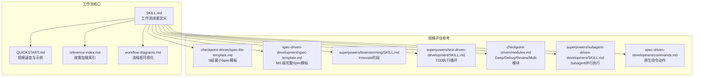
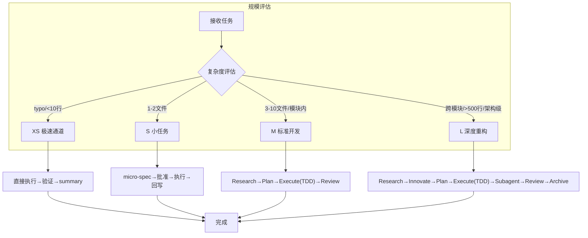
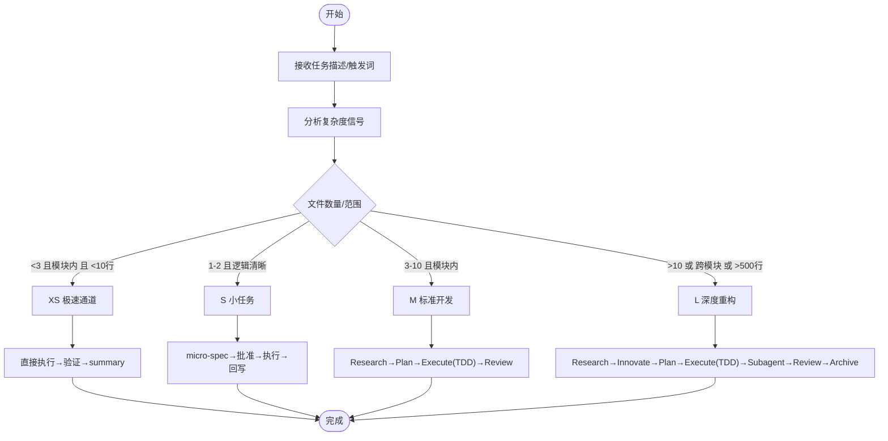
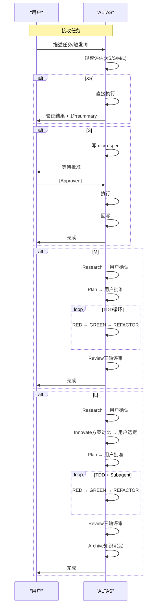
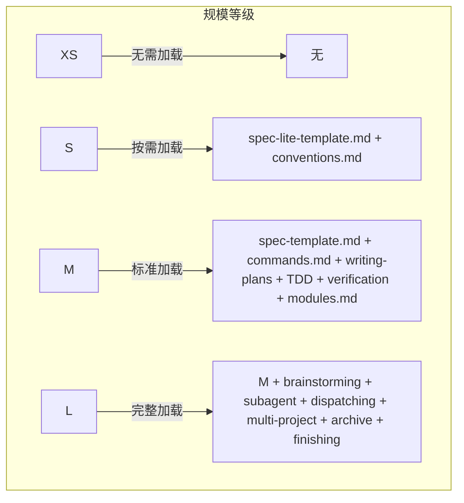

# 4级任务深度评估

<cite>
**本文引用的文件**
- [altas-workflow/QUICKSTART.md](file://altas-workflow/QUICKSTART.md)
- [altas-workflow/SKILL.md](file://altas-workflow/SKILL.md)
- [altas-workflow/reference-index.md](file://altas-workflow/reference-index.md)
- [altas-workflow/workflow-diagrams.md](file://altas-workflow/workflow-diagrams.md)
- [altas-workflow/references/checkpoint-driven/spec-lite-template.md](file://altas-workflow/references/checkpoint-driven/spec-lite-template.md)
- [altas-workflow/references/spec-driven-development/spec-template.md](file://altas-workflow/references/spec-driven-development/spec-template.md)
- [altas-workflow/references/superpowers/brainstorming/SKILL.md](file://altas-workflow/references/superpowers/brainstorming/SKILL.md)
- [altas-workflow/references/superpowers/test-driven-development/SKILL.md](file://altas-workflow/references/superpowers/test-driven-development/SKILL.md)
- [altas-workflow/references/checkpoint-driven/modules.md](file://altas-workflow/references/checkpoint-driven/modules.md)
- [altas-workflow/references/superpowers/subagent-driven-development/SKILL.md](file://altas-workflow/references/superpowers/subagent-driven-development/SKILL.md)
- [altas-workflow/references/spec-driven-development/commands.md](file://altas-workflow/references/spec-driven-development/commands.md)
</cite>

## 目录
1. [简介](#简介)
2. [项目结构](#项目结构)
3. [核心组件](#核心组件)
4. [架构总览](#架构总览)
5. [详细组件分析](#详细组件分析)
6. [依赖分析](#依赖分析)
7. [性能考虑](#性能考虑)
8. [故障排除指南](#故障排除指南)
9. [结论](#结论)
10. [附录](#附录)

## 简介
本文件面向 ALTAS Workflow 的 4 级任务深度评估机制，系统阐述 XS/S/M/L 四级评估标准、触发条件与适用场景，解释各等级复杂度特征、文件数量范围、代码行数阈值与工作流深度选择逻辑；详述自动升降级机制与执行过程中的复杂度发现处理流程；提供评估示例与决策树，帮助开发者正确判断任务规模，并给出升级为 M 或降级为 S 的触发条件与操作方法。文档同时为不同经验水平的开发者提供清晰的任务评估指南。

## 项目结构
ALTAS Workflow 将工作流能力整合为统一 Skill，围绕“规模评估 → 逐步推进 → 按需加载 → 铁律约束”的主线展开。核心文件包括：
- 快速入门与规模速查：QUICKSTART.md
- 工作流技能定义与规则：SKILL.md
- 参考资料索引与按需加载：reference-index.md
- 流程图与可视化：workflow-diagrams.md
- 规模评估与执行阶段的参考模板与模块：checkpoint-driven/spec-lite-template.md、spec-driven-development/spec-template.md、superpowers/brainstorming/SKILL.md、superpowers/test-driven-development/SKILL.md、checkpoint-driven/modules.md、superpowers/subagent-driven-development/SKILL.md、spec-driven-development/commands.md

**图表来源**
- [altas-workflow/SKILL.md:1-351](file://altas-workflow/SKILL.md#L1-L351)
- [altas-workflow/QUICKSTART.md:1-182](file://altas-workflow/QUICKSTART.md#L1-L182)
- [altas-workflow/reference-index.md:1-210](file://altas-workflow/reference-index.md#L1-L210)
- [altas-workflow/workflow-diagrams.md:1-338](file://altas-workflow/workflow-diagrams.md#L1-L338)

**章节来源**
- [altas-workflow/SKILL.md:1-351](file://altas-workflow/SKILL.md#L1-L351)
- [altas-workflow/QUICKSTART.md:1-182](file://altas-workflow/QUICKSTART.md#L1-L182)
- [altas-workflow/reference-index.md:1-210](file://altas-workflow/reference-index.md#L1-L210)
- [altas-workflow/workflow-diagrams.md:1-338](file://altas-workflow/workflow-diagrams.md#L1-L338)

## 核心组件
- 规模评估器：基于任务描述与触发词，结合复杂度信号（文件数量、代码行数、跨模块影响、架构级改动）自动判定 XS/S/M/L。
- 执行控制器：根据规模选择工作流深度，输出阶段性检查点，遵循“无 Spec 不写代码、无批准不执行、证据优先”等铁律。
- 自动升降级机制：执行中发现复杂度超出预期时暂停，提供“升级为M/降级为S”的调整选项。
- 按需加载模块：仅在命中场景时读取对应参考文件，避免常驻上下文带来的 token 消耗。
- 触发词与模式映射：FAST/DEEP/DEBUG/MULTI/DOC/MAP/ARCHIVE 等触发词映射到相应模式与工作流阶段。

**章节来源**
- [altas-workflow/SKILL.md:47-73](file://altas-workflow/SKILL.md#L47-L73)
- [altas-workflow/SKILL.md:56-60](file://altas-workflow/SKILL.md#L56-L60)
- [altas-workflow/reference-index.md:175-202](file://altas-workflow/reference-index.md#L175-L202)

## 架构总览
下图展示了基于复杂度评估的 XS/S/M/L 选择与工作流深度的关系，以及各规模下的典型产出与流程差异。

**图表来源**
- [altas-workflow/workflow-diagrams.md:7-41](file://altas-workflow/workflow-diagrams.md#L7-L41)
- [altas-workflow/SKILL.md:47-54](file://altas-workflow/SKILL.md#L47-L54)

**章节来源**
- [altas-workflow/workflow-diagrams.md:7-41](file://altas-workflow/workflow-diagrams.md#L7-L41)
- [altas-workflow/SKILL.md:47-54](file://altas-workflow/SKILL.md#L47-L54)

## 详细组件分析

### 4级评估标准与触发条件
- XS（极速通道）
  - 触发条件：typo、配置值修改、<10行改动
  - 规模特征：无需 Spec，事后1行 summary
  - 适用场景：UI微调、配置项、单文件逻辑、typo、日志
  - 工作流：直接执行→验证→summary
- S（小任务）
  - 触发条件：1-2文件，逻辑清晰
  - 规模特征：micro-spec（1-3句），文件/模块内改动
  - 适用场景：新增字段、简单接口参数、错误处理增强
  - 工作流：micro-spec→批准→执行→回写
- M（标准开发）
  - 触发条件：3-10文件，模块内
  - 规模特征：轻量Spec落盘，TDD驱动
  - 适用场景：新增CRUD接口、模块功能迭代
  - 工作流：Research→Plan→Execute(TDD)→Review
- L（深度重构）
  - 触发条件：跨模块、>500行、架构级改动
  - 规模特征：完整Spec+Innovate+Archive，Subagent并行
  - 适用场景：认证模块拆分、微服务化、跨项目联动
  - 工作流：Research→Innovate→Plan→Execute(TDD)→Subagent→Review→Archive

**章节来源**
- [altas-workflow/SKILL.md:47-54](file://altas-workflow/SKILL.md#L47-L54)
- [altas-workflow/QUICKSTART.md:155-169](file://altas-workflow/QUICKSTART.md#L155-L169)

### 自动升降级机制
- 执行中发现复杂度超出预期：立即暂停，提议升级为 M 或降级为 S
- 用户随时可用“[升级为M]/[降级为S]”调整规模
- 升降级触发条件
  - 升级为M：触及>2核心文件或架构改动，或执行中暴露跨模块依赖
  - 降级为S：任务过于简单，无需Research/Plan，或执行中发现可简化路径
- 操作方法
  - 在检查点输出后，用户回复“[升级为M]”或“[降级为S]”
  - AI根据用户意图切换工作流深度，并更新阶段与产出格式

**章节来源**
- [altas-workflow/SKILL.md:56-60](file://altas-workflow/SKILL.md#L56-L60)
- [altas-workflow/QUICKSTART.md:137-139](file://altas-workflow/QUICKSTART.md#L137-L139)

### 工作流深度选择逻辑
- 文件数量范围
  - XS：<10行
  - S：1-2文件
  - M：3-10文件（模块内）
  - L：>10文件（跨模块）
- 代码行数阈值
  - XS：<10行
  - S：若干行（逻辑清晰）
  - M：中等规模（需TDD）
  - L：>500行（架构级）
- 复杂度特征
  - XS：单文件、UI微调、配置值
  - S：单模块、简单接口、错误处理
  - M：模块内功能、接口新增、TDD
  - L：跨模块、架构重构、Subagent并行

**章节来源**
- [altas-workflow/SKILL.md:47-54](file://altas-workflow/SKILL.md#L47-L54)
- [altas-workflow/QUICKSTART.md:155-169](file://altas-workflow/QUICKSTART.md#L155-L169)

### 规模评估决策树

**图表来源**
- [altas-workflow/SKILL.md:47-54](file://altas-workflow/SKILL.md#L47-L54)
- [altas-workflow/QUICKSTART.md:155-169](file://altas-workflow/QUICKSTART.md#L155-L169)

**章节来源**
- [altas-workflow/SKILL.md:47-54](file://altas-workflow/SKILL.md#L47-L54)
- [altas-workflow/QUICKSTART.md:155-169](file://altas-workflow/QUICKSTART.md#L155-L169)

### XS/S/M/L 各级工作流时序

**图表来源**
- [altas-workflow/workflow-diagrams.md:291-337](file://altas-workflow/workflow-diagrams.md#L291-L337)
- [altas-workflow/SKILL.md:176-218](file://altas-workflow/SKILL.md#L176-L218)

**章节来源**
- [altas-workflow/workflow-diagrams.md:291-337](file://altas-workflow/workflow-diagrams.md#L291-L337)
- [altas-workflow/SKILL.md:176-218](file://altas-workflow/SKILL.md#L176-L218)

### 规模评估示例
- 示例1：typo 修改
  - 触发词：>>
  - 规模：XS
  - 处理：直接修改→验证→1行summary
- 示例2：新增CRUD接口
  - 触发词：默认
  - 规模：M
  - 处理：Research→Plan→Execute(TDD)→Review
- 示例3：认证模块拆分为独立微服务
  - 触发词：DEEP
  - 规模：L
  - 处理：Research→Innovate→Plan→Execute(TDD)→Subagent→Review→Archive

**章节来源**
- [altas-workflow/QUICKSTART.md:52-116](file://altas-workflow/QUICKSTART.md#L52-L116)

### 触发词与模式映射
- FAST/快速/>>：极速通道（XS/S）
- DEEP：深度模式（L）
- DEBUG/排查：系统化Debug
- MULTI/多项目：多项目协作
- DOC/写文档：文档专家
- MAP/链路梳理：功能级CodeMap
- ARCHIVE/归档：知识沉淀
- 全部/all：批量执行

**章节来源**
- [altas-workflow/SKILL.md:61-72](file://altas-workflow/SKILL.md#L61-L72)
- [altas-workflow/QUICKSTART.md:36-49](file://altas-workflow/QUICKSTART.md#L36-L49)

### 规模评估速查表
- XS：typo/配置值，<10行，跳过Spec，事后1行summary
- S：1-2文件，逻辑清晰，micro-spec（1-3句）
- M：3-10文件，模块内，轻量Spec落盘
- L：跨模块，>500行，架构级，完整Spec+Innovate+Archive

**章节来源**
- [altas-workflow/SKILL.md:47-54](file://altas-workflow/SKILL.md#L47-L54)
- [altas-workflow/QUICKSTART.md:155-169](file://altas-workflow/QUICKSTART.md#L155-L169)

## 依赖分析
- 规模评估依赖的参考文件
  - XS：无需加载任何参考
  - S：checkpoint-driven/spec-lite-template.md、checkpoint-driven/conventions.md
  - M：spec-driven-development/spec-template.md、spec-driven-development/commands.md、superpowers/writing-plans/SKILL.md、superpowers/test-driven-development/SKILL.md、superpowers/verification-before-completion/SKILL.md、checkpoint-driven/modules.md
  - L：在M基础上增加superpowers/brainstorming/SKILL.md、superpowers/subagent-driven-development/SKILL.md、superpowers/dispatching-parallel-agents/SKILL.md、spec-driven-development/multi-project.md、spec-driven-development/archive-template.md、superpowers/finishing-a-development-branch/SKILL.md
- 按需加载模块
  - Deep Planning、Debug、Review、Multi-project模块在命中场景时才加载，避免常驻上下文

**图表来源**
- [altas-workflow/reference-index.md:175-202](file://altas-workflow/reference-index.md#L175-L202)

**章节来源**
- [altas-workflow/reference-index.md:175-202](file://altas-workflow/reference-index.md#L175-L202)

## 性能考虑
- 按需加载策略：仅在命中场景时读取对应参考文件，减少 token 消耗与上下文膨胀
- 上下文层级：Hot（每轮）、Warm（阶段切换）、Cold（按需）三层装配，冲突/不确定时从磁盘重读完整Spec
- 执行纪律：逐步执行（1个Checklist项→检查点），必要时使用“全部/execute all”批量执行
- 模型选择：机械实现任务用便宜模型，集成与判断用标准模型，架构/设计/评审用最强大模型

**章节来源**
- [altas-workflow/SKILL.md:318-333](file://altas-workflow/SKILL.md#L318-L333)
- [altas-workflow/SKILL.md:185-192](file://altas-workflow/SKILL.md#L185-L192)
- [altas-workflow/SKILL.md:87-101](file://altas-workflow/SKILL.md#L87-L101)

## 故障排除指南
- 常见问题
  - AI一次性输出过多代码：ALTAS内置检查点机制，AI完成一步后必须暂停等确认；如AI暴走，回复“请停止，严格执行检查点机制，每次只推进一步”
  - 为什么AI总是先写测试：这是Evidence First + TDD铁律；任务极简可用“>>”触发XS模式跳过TDD
  - 如何中途干预AI的计划：在任意检查点回复“[修改] 请不要使用Redis，改为内存缓存”，AI会根据反馈调整Plan后重新请求Approve
- 铁律与门禁
  - No Spec, No Code；No Approval, No Execute；Spec is Truth；Reverse Sync；Evidence First；No Fixes Without Root Cause；TDD Iron Law；Resume Ready
  - Review三轴：Spec质量与需求达成、Spec-代码一致性、代码内在质量；轴1或轴2 FAIL→回到Research/Plan；轴3高风险未解决→回到Plan

**章节来源**
- [altas-workflow/QUICKSTART.md:119-152](file://altas-workflow/QUICKSTART.md#L119-L152)
- [altas-workflow/SKILL.md:90-102](file://altas-workflow/SKILL.md#L90-L102)
- [altas-workflow/SKILL.md:194-208](file://altas-workflow/SKILL.md#L194-L208)

## 结论
ALTAS Workflow 的 4 级任务深度评估机制以“规模评估 → 逐步推进 → 按需加载 → 铁律约束”为核心，通过 XS/S/M/L 四级标准与自动升降级机制，确保任务在合适的复杂度层级上执行，既避免过度工程化，又防止遗漏关键环节。开发者可依据文件数量、代码行数、跨模块影响与架构级改动等信号进行判断，并在执行中灵活调整规模。配合按需加载与上下文层级策略，可在保证质量的同时提升效率与可维护性。

## 附录
- 触发词与模式映射图
  - FAST/快速/>>：极速通道
  - DEEP：深度模式
  - MAP/链路梳理：功能级CodeMap
  - MULTI/多项目：多项目协作
  - DEBUG/排查：系统化Debug
  - DOC/写文档：文档专家
  - ARCHIVE/归档：知识沉淀
  - 全部/all：批量执行

**章节来源**
- [altas-workflow/workflow-diagrams.md:261-287](file://altas-workflow/workflow-diagrams.md#L261-L287)