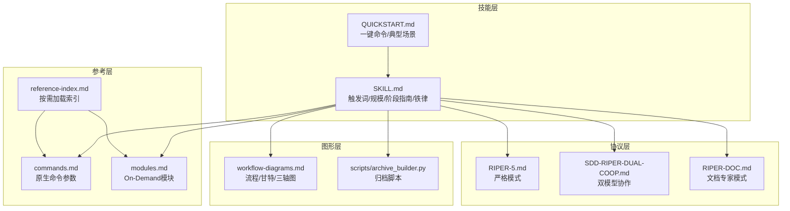
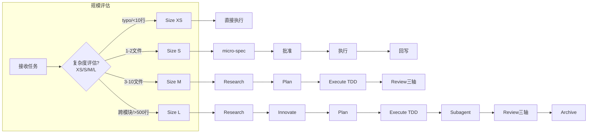
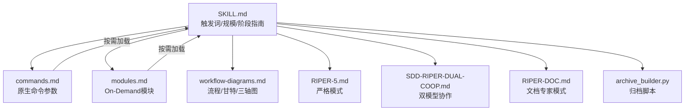
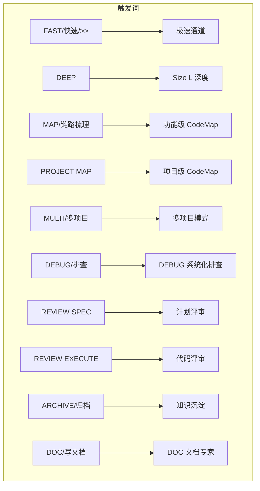
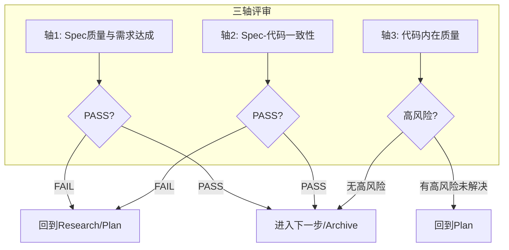
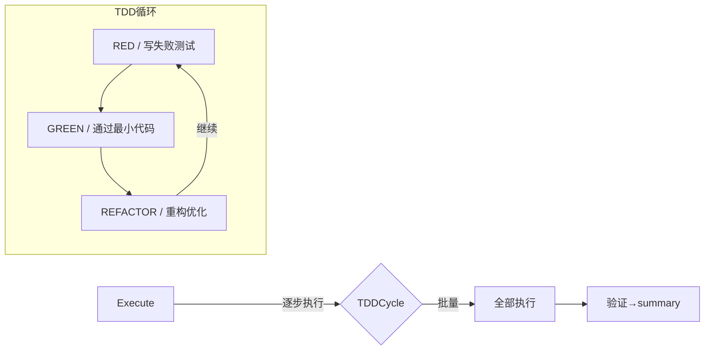
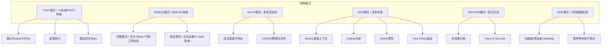

# 工作流状态机控制

<cite>
**本文引用的文件**
- [altas-workflow/SKILL.md](file://altas-workflow/SKILL.md)
- [altas-workflow/QUICKSTART.md](file://altas-workflow/QUICKSTART.md)
- [altas-workflow/workflow-diagrams.md](file://altas-workflow/workflow-diagrams.md)
- [altas-workflow/reference-index.md](file://altas-workflow/reference-index.md)
- [altas-workflow/references/spec-driven-development/commands.md](file://altas-workflow/references/spec-driven-development/commands.md)
- [altas-workflow/references/checkpoint-driven/modules.md](file://altas-workflow/references/checkpoint-driven/modules.md)
- [altas-workflow/scripts/archive_builder.py](file://altas-workflow/scripts/archive_builder.py)
- [altas-workflow/protocols/RIPER-5.md](file://altas-workflow/protocols/RIPER-5.md)
- [altas-workflow/protocols/SDD-RIPER-DUAL-COOP.md](file://altas-workflow/protocols/SDD-RIPER-DUAL-COOP.md)
- [altas-workflow/protocols/RIPER-DOC.md](file://altas-workflow/protocols/RIPER-DOC.md)
</cite>

## 目录
1. [简介](#简介)
2. [项目结构](#项目结构)
3. [核心组件](#核心组件)
4. [架构总览](#架构总览)
5. [详细阶段分析](#详细阶段分析)
6. [依赖关系分析](#依赖关系分析)
7. [性能考量](#性能考量)
8. [故障排查指南](#故障排查指南)
9. [结论](#结论)
10. [附录](#附录)

## 简介
本文件面向 ALTAS Workflow 的工作流状态机控制机制，系统化解析 RIPER 工作流的六个阶段（PRE-RESEARCH、RESEARCH、INNOVATE、PLAN、EXECUTE、REVIEW、ARCHIVE）及其转换规则。文档聚焦以下目标：
- 明确每个阶段的动作要求、产出物与门禁条件
- 解释状态转换的触发机制、前置条件与后置检查
- 提供状态机图与转换流程图，帮助开发者理解整体架构
- 覆盖特殊模式（FAST、DEBUG、MULTI、DOC、MAP、ARCHIVE）的状态处理逻辑
- 提供完整的工作流执行指南与状态管理最佳实践

## 项目结构
ALTAS Workflow 采用“技能 + 参考 + 协议”的分层组织方式：
- 技能层（SKILL.md）：定义触发词、规模评估、阶段执行指南与铁律约束
- 参考层（references/*）：按阶段与模式提供模板、模块与工具使用说明
- 协议层（protocols/*）：定义严格模式与双模型协作协议
- 图形层（workflow-diagrams.md）：提供流程图、甘特图、三轴评审图等可视化

图表来源
- [altas-workflow/SKILL.md:1-351](file://altas-workflow/SKILL.md#L1-L351)
- [altas-workflow/QUICKSTART.md:1-182](file://altas-workflow/QUICKSTART.md#L1-L182)
- [altas-workflow/workflow-diagrams.md:1-338](file://altas-workflow/workflow-diagrams.md#L1-L338)
- [altas-workflow/reference-index.md:1-210](file://altas-workflow/reference-index.md#L1-L210)
- [altas-workflow/references/spec-driven-development/commands.md:1-97](file://altas-workflow/references/spec-driven-development/commands.md#L1-L97)
- [altas-workflow/references/checkpoint-driven/modules.md:1-57](file://altas-workflow/references/checkpoint-driven/modules.md#L1-L57)
- [altas-workflow/scripts/archive_builder.py:1-505](file://altas-workflow/scripts/archive_builder.py#L1-L505)
- [altas-workflow/protocols/RIPER-5.md:1-187](file://altas-workflow/protocols/RIPER-5.md#L1-L187)
- [altas-workflow/protocols/SDD-RIPER-DUAL-COOP.md:1-210](file://altas-workflow/protocols/SDD-RIPER-DUAL-COOP.md#L1-L210)
- [altas-workflow/protocols/RIPER-DOC.md:1-66](file://altas-workflow/protocols/RIPER-DOC.md#L1-L66)

章节来源
- [altas-workflow/SKILL.md:1-351](file://altas-workflow/SKILL.md#L1-L351)
- [altas-workflow/QUICKSTART.md:1-182](file://altas-workflow/QUICKSTART.md#L1-L182)
- [altas-workflow/reference-index.md:1-210](file://altas-workflow/reference-index.md#L1-L210)

## 核心组件
- 触发词与规模评估：通过关键词自动判定任务规模（XS/S/M/L），并选择相应工作流深度
- 阶段执行指南：定义 PRE-RESEARCH、RESEARCH、INNOVATE、PLAN、EXECUTE、REVIEW、ARCHIVE 的动作、产出与门禁
- 铁律约束：No Spec, No Code；No Approval, No Execute；Spec is Truth；Reverse Sync；Evidence First；No Fixes Without Root Cause；TDD Iron Law；Resume Ready
- 特殊模式：FAST、DEBUG、MULTI、DOC、MAP、ARCHIVE 的触发条件、流程与限制
- 检查点与回写：M/L 规模的完整检查点模板，XS/S 的短检查点与1行summary
- 原生命令：create_codemap、build_context_bundle、sdd_bootstrap、review_spec、review_execute、archive 的参数与约束

章节来源
- [altas-workflow/SKILL.md:45-102](file://altas-workflow/SKILL.md#L45-L102)
- [altas-workflow/SKILL.md:138-275](file://altas-workflow/SKILL.md#L138-L275)
- [altas-workflow/references/spec-driven-development/commands.md:1-97](file://altas-workflow/references/spec-driven-development/commands.md#L1-L97)

## 架构总览
工作流采用“自适应深度”的状态机，结合 Spec-Driven、Checkpoint-Driven 与 Superpowers（TDD+Subagent）能力，按规模动态启用不同阶段与模块。

图表来源
- [altas-workflow/workflow-diagrams.md:45-67](file://altas-workflow/workflow-diagrams.md#L45-L67)
- [altas-workflow/SKILL.md:47-54](file://altas-workflow/SKILL.md#L47-L54)

章节来源
- [altas-workflow/workflow-diagrams.md:1-338](file://altas-workflow/workflow-diagrams.md#L1-L338)
- [altas-workflow/SKILL.md:45-60](file://altas-workflow/SKILL.md#L45-L60)

## 详细阶段分析

### 阶段一：PRE-RESEARCH（输入准备，M/L）
- 触发条件：进入 M/L 规模时，或用户明确要求生成 CodeMap/上下文
- 动作要求：
  - create_codemap：生成功能级或项目级代码索引地图
  - build_context_bundle：整理需求上下文，产出上下文包
  - sdd_bootstrap：启动 RIPER，产出首版 Spec
- 产出物：
  - CodeMap（功能/项目）
  - Context Bundle
  - 首版 Spec（含 Context Sources、Codemap Used、Research Findings、Open Questions、Next Actions）
- 门禁条件：
  - 仅在必要时加载参考文件（如 commands.md）
  - 产出需落盘，便于后续阶段复用

章节来源
- [altas-workflow/SKILL.md:140-148](file://altas-workflow/SKILL.md#L140-L148)
- [altas-workflow/references/spec-driven-development/commands.md:5-36](file://altas-workflow/references/spec-driven-development/commands.md#L5-L36)

### 阶段二：RESEARCH（研究对齐，M/L）
- 动作要求：复述任务目标，梳理代码现状，形成事实依据，标识未知项
- 产出物：在 Spec 中建立/更新 Goal、In-Scope、Out-of-Scope、Facts、Risks、Open Questions
- 门禁条件：
  - 事实有证据支撑，未知项已标注
  - 铁律 #1：未形成最小 Spec 前不写代码（Size XS 豁免）
- 完成后输出检查点，等待用户确认

章节来源
- [altas-workflow/SKILL.md:150-156](file://altas-workflow/SKILL.md#L150-L156)
- [altas-workflow/references/spec-driven-development/commands.md:27-36](file://altas-workflow/references/spec-driven-development/commands.md#L27-L36)

### 阶段三：INNOVATE（方案对比，仅 L）
- 动作要求：给出2-3种方案，对比 Pros/Cons/Risks/Effort
- 产出物：在 Spec 中记录 Decision 和 Trade-offs
- 完成后输出检查点，等待用户选定方案

章节来源
- [altas-workflow/SKILL.md:159-165](file://altas-workflow/SKILL.md#L159-L165)

### 阶段四：PLAN（详细规划，M/L）
- 动作要求：将任务拆解为原子 Checklist，明确 File Changes + Signatures + Done Contract
- 产出物：Spec 中更新 Plan 部分
- 门禁条件：
  - 铁律 #2：Plan 阶段人类不点头，绝不写代码
  - 必须获得明确 `[Approved]` 才能进入 Execute
- 完成后输出检查点，含完整 Checklist 摘要，等待 `[Approved]`

章节来源
- [altas-workflow/SKILL.md:167-173](file://altas-workflow/SKILL.md#L167-L173)

### 阶段五：EXECUTE（执行实现，XS/S/M/L）
- 规模策略：
  - XS：直接修改→验证→1行 summary
  - S：micro-spec→批准→执行→回写
  - M：TDD 循环（RED→GREEN→REFACTOR），逐步或批量
  - L：TDD + Subagent 驱动 + 两阶段 Review
- 执行纪律：
  - 默认逐步执行（1个 Checklist 项→检查点）
  - `全部`/`all`/`execute all` → 批量执行剩余项
  - 编译错误可自动修正；逻辑变更必须回到 Plan
  - 偏差暴露→铁律 #4：先更新 Spec→再修代码→重对齐核心目标

章节来源
- [altas-workflow/SKILL.md:176-192](file://altas-workflow/SKILL.md#L176-L192)

### 阶段六：REVIEW（审查，M/L；S 规模简单回写验证）
- 三轴评审（M/L 必须全部输出）：
  - 轴1：Spec 质量与需求达成（Goal/In-Scope/Acceptance）
  - 轴2：Spec-代码一致性（文件、签名、Checklist、行为）
  - 轴3：代码内在质量（正确性、鲁棒性、可维护性、测试、关键风险）
- 门禁逻辑：
  - 轴1 或 轴2 = FAIL → Review FAIL，回到 Research/Plan
  - 轴3 有高风险未解决 → Review FAIL，回到 Plan

章节来源
- [altas-workflow/SKILL.md:194-208](file://altas-workflow/SKILL.md#L194-L208)
- [altas-workflow/references/spec-driven-development/commands.md:60-76](file://altas-workflow/references/spec-driven-development/commands.md#L60-L76)

### 阶段七：ARCHIVE（知识沉淀，推荐 L，M 也可按需使用）
- 动作：生成双视角文档（human版汇报视角 + llm版开发参考视角）
- 产出：mydocs/archive/YYYY-MM-DD_hh-mm_<topic>_{human,llm}.md
- 自动化：python3 scripts/archive_builder.py --targets ... --kind mixed --audience both
- 门禁：有活跃执行中的 spec（未完成 Review）时，禁止归档该 spec

章节来源
- [altas-workflow/SKILL.md:210-217](file://altas-workflow/SKILL.md#L210-L217)
- [altas-workflow/scripts/archive_builder.py:1-505](file://altas-workflow/scripts/archive_builder.py#L1-L505)

## 依赖关系分析
- 触发词与规模评估：SKILL.md 定义 trigger_keywords，自动判定 XS/S/M/L
- 阶段依赖：PRE-RESEARCH → RESEARCH → INNOVATE? → PLAN → EXECUTE → REVIEW → ARCHIVE
- 模块按需加载：仅在命中场景时读取对应参考文件（如 commands.md、modules.md）
- 铁律约束贯穿全流程：No Spec, No Code；No Approval, No Execute；Spec is Truth；Reverse Sync；Evidence First；No Fixes Without Root Cause；TDD Iron Law；Resume Ready

图表来源
- [altas-workflow/SKILL.md:1-351](file://altas-workflow/SKILL.md#L1-L351)
- [altas-workflow/references/spec-driven-development/commands.md:1-97](file://altas-workflow/references/spec-driven-development/commands.md#L1-L97)
- [altas-workflow/references/checkpoint-driven/modules.md:1-57](file://altas-workflow/references/checkpoint-driven/modules.md#L1-L57)
- [altas-workflow/workflow-diagrams.md:1-338](file://altas-workflow/workflow-diagrams.md#L1-L338)
- [altas-workflow/protocols/RIPER-5.md:1-187](file://altas-workflow/protocols/RIPER-5.md#L1-L187)
- [altas-workflow/protocols/SDD-RIPER-DUAL-COOP.md:1-210](file://altas-workflow/protocols/SDD-RIPER-DUAL-COOP.md#L1-L210)
- [altas-workflow/protocols/RIPER-DOC.md:1-66](file://altas-workflow/protocols/RIPER-DOC.md#L1-L66)
- [altas-workflow/scripts/archive_builder.py:1-505](file://altas-workflow/scripts/archive_builder.py#L1-L505)

章节来源
- [altas-workflow/reference-index.md:1-210](file://altas-workflow/reference-index.md#L1-L210)

## 性能考量
- 渐进式披露：仅在命中场景时按需加载参考文件，减少 token 消耗
- 批量执行：M/L 规模支持 `全部`/`all` 批量执行，提高效率
- 自动化归档：使用 archive_builder.py 生成双视角归档，降低重复劳动
- 上下文装配：Hot/Warm/Cold 三层上下文，避免全仓扫描

## 故障排查指南
- 常见问题
  - AI 一次性输出太多代码：ALTAS 内置检查点机制，必须暂停等待确认
  - 为什么总是先写测试：Evidence First + TDD 铁律；极简任务可用 `>>` 跳过 TDD
  - 如何中途干预计划：回复 `[修改] 请不要使用Redis，改为内存缓存`，AI 会调整 Plan 后重新请求 Approve
- Debug 模式
  - 诊断模式：日志+Spec+代码三角定位→根因候选
  - 验证模式：日志证据 vs Spec 验收标准→PASS/FAIL/INCONCLUSIVE
  - 铁律：无根因不修复；只读分析；代码修改需进入 RIPER 或 FAST
- MULTI 模式
  - 自动发现子项目；默认 local 作用域；跨项目需 CROSS
- DOC 模式
  - Absorb→Outline→Author→Fact-Check；不猜测实现，必须对照实际代码验证

章节来源
- [altas-workflow/QUICKSTART.md:119-151](file://altas-workflow/QUICKSTART.md#L119-L151)
- [altas-workflow/SKILL.md:221-275](file://altas-workflow/SKILL.md#L221-L275)

## 结论
ALTAS Workflow 的工作流状态机以“Spec is Truth”为核心，通过严格的铁律约束与按需加载的模块化参考体系，实现了从 XS 到 L 的自适应深度工作流。开发者可通过触发词快速选择模式，借助检查点与三轴评审保障质量，并利用自动化工具提升效率。建议在团队内统一触发词与命名约定，确保上下文稳定与可复用。

## 附录

### 触发词与模式映射

图表来源
- [altas-workflow/workflow-diagrams.md:261-287](file://altas-workflow/workflow-diagrams.md#L261-L287)

### Review 三轴评审流程

图表来源
- [altas-workflow/workflow-diagrams.md:108-125](file://altas-workflow/workflow-diagrams.md#L108-L125)

### TDD 执行循环

图表来源
- [altas-workflow/workflow-diagrams.md:155-168](file://altas-workflow/workflow-diagrams.md#L155-L168)

### 特殊模式总览

图表来源
- [altas-workflow/workflow-diagrams.md:172-197](file://altas-workflow/workflow-diagrams.md#L172-L197)
- [altas-workflow/SKILL.md:221-275](file://altas-workflow/SKILL.md#L221-L275)