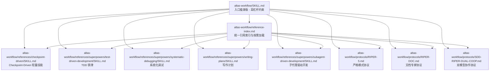
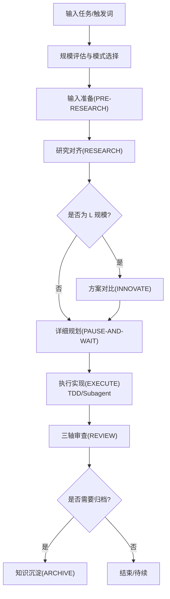
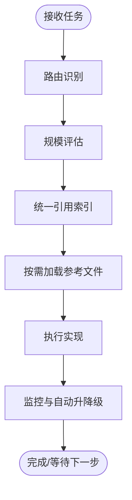
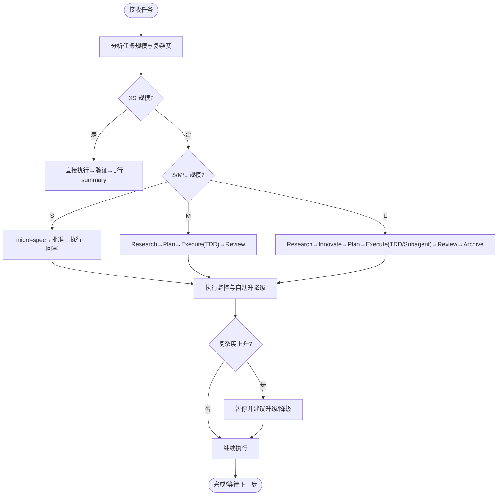
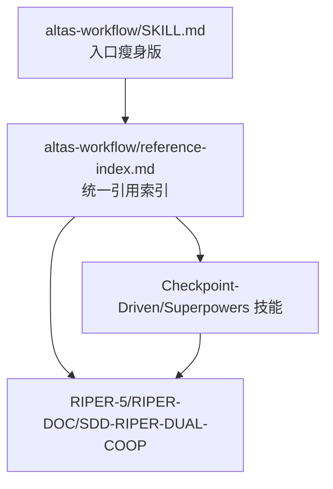

# 核心协议

<cite>
**本文引用的文件**   
- [altas-workflow/SKILL.md](file://altas-workflow/SKILL.md)
- [altas-workflow/reference-index.md](file://altas-workflow/reference-index.md)
- [altas-workflow/protocols/RIPER-5.md](file://altas-workflow/protocols/RIPER-5.md)
- [altas-workflow/protocols/RIPER-DOC.md](file://altas-workflow/protocols/RIPER-DOC.md)
- [altas-workflow/protocols/SDD-RIPER-DUAL-COOP.md](file://altas-workflow/protocols/SDD-RIPER-DUAL-COOP.md)
- [altas-workflow/references/checkpoint-driven/SKILL.md](file://altas-workflow/references/checkpoint-driven/SKILL.md)
- [altas-workflow/references/superpowers/test-driven-development/SKILL.md](file://altas-workflow/references/superpowers/test-driven-development/SKILL.md)
- [altas-workflow/references/superpowers/systematic-debugging/SKILL.md](file://altas-workflow/references/superpowers/systematic-debugging/SKILL.md)
- [altas-workflow/references/superpowers/writing-plans/SKILL.md](file://altas-workflow/references/superpowers/writing-plans/SKILL.md)
- [altas-workflow/references/superpowers/subagent-driven-development/SKILL.md](file://altas-workflow/references/superpowers/subagent-driven-development/SKILL.md)
- [altas-workflow/references/special-modes/review.md](file://altas-workflow/references/special-modes/review.md)
</cite>

## 更新摘要
**所做更改**   
- 更新了入口简化机制的说明，反映 SKILL.md 4.1 版本的架构变化
- 新增了统一引用索引结构的详细说明
- 更新了模块化实现的概念，强调按需加载机制
- 修订了检查点机制、渐进式披露机制的实现方式
- 更新了协议配置选项和参数说明，反映新的模块化结构

## 目录
1. [简介](#简介)
2. [项目结构](#项目结构)
3. [核心组件](#核心组件)
4. [架构总览](#架构总览)
5. [详细组件分析](#详细组件分析)
6. [依赖关系分析](#依赖关系分析)
7. [性能考量](#性能考量)
8. [故障排查指南](#故障排查指南)
9. [结论](#结论)
10. [附录](#附录)

## 简介
本文件面向 ALTAS Workflow 的核心协议，系统化解析 SKILL.md 4.1 版本的简化架构，重点阐述：
- 入口简化机制与统一引用索引结构的工作原理与应用场景
- 4 级任务深度评估机制（XS/S/M/L）的模块化实现
- 工作流状态机控制逻辑与铁律约束执行机制
- 检查点标准化输出格式与进度可视化系统
- 渐进式披露机制与按需加载参考资料的策略
- 协议配置选项、参数说明与返回值规范
- 实际代码示例展示协议在不同场景下的应用与与其他组件的集成方式

**更新** 本版本引入了入口瘦身理念，将详细实现从主协议文件转移到统一的引用索引结构中，实现了更好的模块化和可维护性。

## 项目结构
ALTAS Workflow 采用"主协议 + 统一引用索引 + 按需模块"的组织方式：
- 主协议位于顶层 SKILL.md，定义整体流程、触发词、规模评估、铁律与输出规范，但不再包含详细实现
- 统一引用索引 reference-index.md 提供完整的参考资料发现入口，指导按需加载
- 子协议（如 RIPER-5、RIPER-DOC、SDD-RIPER-DUAL-COOP）提供严格模式、文档专家与双模型协作的范式
- 分层技能（Checkpoint-Driven、Superpowers）分别覆盖轻量检查点与测试驱动、系统化调试、子代理驱动等能力

**图表来源**
- [altas-workflow/SKILL.md](file://altas-workflow/SKILL.md)
- [altas-workflow/reference-index.md](file://altas-workflow/reference-index.md)
- [altas-workflow/protocols/RIPER-5.md](file://altas-workflow/protocols/RIPER-5.md)
- [altas-workflow/protocols/RIPER-DOC.md](file://altas-workflow/protocols/RIPER-DOC.md)
- [altas-workflow/protocols/SDD-RIPER-DUAL-COOP.md](file://altas-workflow/protocols/SDD-RIPER-DUAL-COOP.md)
- [altas-workflow/references/checkpoint-driven/SKILL.md](file://altas-workflow/references/checkpoint-driven/SKILL.md)
- [altas-workflow/references/superpowers/test-driven-development/SKILL.md](file://altas-workflow/references/superpowers/test-driven-development/SKILL.md)
- [altas-workflow/references/superpowers/systematic-debugging/SKILL.md](file://altas-workflow/references/superpowers/systematic-debugging/SKILL.md)
- [altas-workflow/references/superpowers/writing-plans/SKILL.md](file://altas-workflow/references/superpowers/writing-plans/SKILL.md)
- [altas-workflow/references/superpowers/subagent-driven-development/SKILL.md](file://altas-workflow/references/superpowers/subagent-driven-development/SKILL.md)

**章节来源**
- [altas-workflow/SKILL.md](file://altas-workflow/SKILL.md)
- [altas-workflow/reference-index.md](file://altas-workflow/reference-index.md)

## 核心组件
- **入口简化**：主协议只保留高杠杆约束，详细实现转移到 reference-index.md 与 references/ 按需读取
- **触发词与模式选择**：通过关键词自动判定工作流深度与模式（FAST/DEEP/DEBUG/MULTI/DOC/MAP/ARCHIVE）
- **统一引用索引**：提供 50+ 参考文件的分类索引，支持按工作流阶段、特殊模式、来源分类和规模等级查找
- **模块化实现**：检查点机制、渐进式披露机制、铁律约束等核心概念通过独立模块实现
- **按需加载策略**：Hot/Warm/Cold 三层上下文，冲突/不确定时强制重读完整 Spec
- **规模评估与自动升降级**：根据任务复杂度与文件/行数阈值选择 XS/S/M/L，并支持执行中动态调整

**更新** 新版本通过统一引用索引实现了更好的模块化，开发者只需关注高杠杆约束，具体实现细节通过索引按需获取。

**章节来源**
- [altas-workflow/SKILL.md](file://altas-workflow/SKILL.md)
- [altas-workflow/reference-index.md](file://altas-workflow/reference-index.md)

## 架构总览
ALTAS Workflow 将 Spec-Driven、Checkpoint-Driven 与 Superpowers 融合，形成"输入准备 → 研究对齐 → 方案对比（L）→ 详细规划 → 执行实现（TDD/Subagent）→ 三轴审查 → 知识沉淀"的闭环。新版本通过统一引用索引实现模块化，入口只保留必要的约束和门禁。

**图表来源**
- [altas-workflow/SKILL.md](file://altas-workflow/SKILL.md)
- [altas-workflow/reference-index.md](file://altas-workflow/reference-index.md)

## 详细组件分析

### 入口简化与统一引用索引结构
**更新** SKILL.md 4.1 版本引入了入口瘦身理念，主协议文件现在只保留高杠杆约束，详细实现转移到统一引用索引结构中。

- **入口瘦身**：主协议只定义路由、规模评估、铁律约束和基本门禁，不包含具体实现细节
- **统一索引**：reference-index.md 提供完整的参考资料发现入口，支持按阶段、模式、来源和规模等级查找
- **按需加载**：AI Agent 无需常驻全部内容，只需在命中场景时按需加载对应文件
- **模块化实现**：检查点机制、渐进式披露机制、铁律约束等核心概念通过独立模块实现

**图表来源**
- [altas-workflow/SKILL.md](file://altas-workflow/SKILL.md)
- [altas-workflow/reference-index.md](file://altas-workflow/reference-index.md)

**章节来源**
- [altas-workflow/SKILL.md](file://altas-workflow/SKILL.md)
- [altas-workflow/reference-index.md](file://altas-workflow/reference-index.md)

### 4 级任务深度评估机制（XS/S/M/L）
- **XS（极小）**：typo/配置值，<10 行，跳过 micro-spec，事后一行 summary
- **S（小）**：1-2 文件，逻辑清晰，micro-spec（1-3 句），批准后执行
- **M（中）**：3-10 文件，模块内，轻量 Spec 落盘，Research→Plan→Execute（TDD）→Review
- **L（大）**：跨模块，>500 行，架构级，完整 Spec+Innovate+Archive，Research→Innovate→Plan→Execute（TDD/Subagent）→Review→Archive

自动升降级：执行中若复杂度超出预期，立即暂停并建议升级；用户可随时选择"升级为M/降级为S"。

**图表来源**
- [altas-workflow/SKILL.md](file://altas-workflow/SKILL.md)

**章节来源**
- [altas-workflow/SKILL.md](file://altas-workflow/SKILL.md)

### 工作流状态机控制逻辑
- **标准模式**：PRE-RESEARCH → RESEARCH → INNOVATE（L）→ PLAN → EXECUTE → REVIEW → ARCHIVE
- **FAST 模式**：跳过 Research/Plan，直接执行，事后同步 Spec
- **DEBUG 模式**：无根因不修复，诊断/验证子模式
- **MULTI 模式**：多项目协作，作用域 local/CROSS
- **DOC 模式**：Absorb→Outline→Author→Fact-Check
- **MAP 模式**：只读 CodeMap，必要时升级为标准流程
- **ARCHIVE 模式**：双视角归档（human/llm）

**章节来源**
- [altas-workflow/SKILL.md](file://altas-workflow/SKILL.md)
- [altas-workflow/protocols/RIPER-DOC.md](file://altas-workflow/protocols/RIPER-DOC.md)

### 铁律约束执行机制
- **No Spec, No Code**（Size XS 豁免）
- **No Approval, No Execute**
- **Spec is Truth**（Spec 与代码冲突时，代码是错的）
- **Reverse Sync**（偏差暴露→先更新 Spec→再修代码）
- **Evidence First**（完成由验证结果证明）
- **No Fixes Without Root Cause**（根因分析前置）
- **TDD Iron Law**（Size M/L：无失败测试不写生产代码）
- **Resume Ready**（长任务暂停前留恢复锚点）

**章节来源**
- [altas-workflow/SKILL.md](file://altas-workflow/SKILL.md)

### 检查点标准化输出格式
- **XS**：1 行 summary（完成什么 + 验证结果）
- **S**：短检查点（当前理解/核心目标/下一步）
- **M/L**：完整检查点模板（已完成/当前/下一步/后续、当前成果、预期产出、下一步操作）

**章节来源**
- [altas-workflow/SKILL.md](file://altas-workflow/SKILL.md)

### 渐进式披露与按需加载机制
**更新** 新版本通过统一引用索引实现了更高效的渐进式披露机制。

- **按阶段与规模加载**：reference-index.md 提供按工作流阶段、特殊模式、来源分类和规模等级的索引
- **Hot/Warm/Cold 三层上下文**：每轮/阶段切换/按需
- **冲突/不确定时强制重读**：完整 Spec
- **模块化实现**：检查点机制、渐进式披露机制、铁律约束等核心概念通过独立模块实现

**章节来源**
- [altas-workflow/SKILL.md](file://altas-workflow/SKILL.md)
- [altas-workflow/reference-index.md](file://altas-workflow/reference-index.md)

### 协议配置选项、参数说明与返回值规范
- **触发词与模式**：>>/FAST/快速、DEEP、DEBUG/排查、MULTI/多项目、DOC/写文档、MAP/链路梳理、ARCHIVE/归档、全部/all
- **规模评估表与自动升降级规则**
- **输出格式与检查点模板**
- **命名约定**：时间前缀 YYYY-MM-DD_hh-mm_，产物路径（CodeMap/Context/Spec/micro-spec/Archive）

**章节来源**
- [altas-workflow/SKILL.md](file://altas-workflow/SKILL.md)

### 实际应用示例与集成方式
- **示例 A**：小任务（S）——micro-spec→批准→执行→回写
- **示例 B**：中型任务（M）——Research→Plan→Execute（TDD）→Review
- **示例 C**：大型任务（L）——Research→Innovate→Plan→Execute（TDD/Subagent）→Review→Archive
- **示例 D**：系统化排查（DEBUG）——无根因不修复，诊断/验证子模式
- **示例 E**：文档专家（DOC）——Absorb→Outline→Author→Fact-Check
- **示例 F**：只读链路梳理（MAP）——生成 CodeMap 后暂停等待指示

**章节来源**
- [altas-workflow/SKILL.md](file://altas-workflow/SKILL.md)
- [altas-workflow/protocols/RIPER-DOC.md](file://altas-workflow/protocols/RIPER-DOC.md)
- [altas-workflow/references/superpowers/systematic-debugging/SKILL.md](file://altas-workflow/references/superpowers/systematic-debugging/SKILL.md)

## 依赖关系分析
**更新** 新版本通过统一引用索引实现了更清晰的依赖关系。

- **主协议依赖**：分层技能与子协议通过统一引用索引连接
- **统一索引**：提供 50+ 参考文件的分类索引，支持按阶段、模式、来源和规模等级查找
- **模块化实现**：CheckPoint-Driven、Superpowers、子协议通过独立模块实现
- **按需加载**：AI Agent 无需常驻全部内容，只需在命中场景时按需加载对应文件

**图表来源**
- [altas-workflow/SKILL.md](file://altas-workflow/SKILL.md)
- [altas-workflow/reference-index.md](file://altas-workflow/reference-index.md)
- [altas-workflow/protocols/RIPER-5.md](file://altas-workflow/protocols/RIPER-5.md)
- [altas-workflow/protocols/RIPER-DOC.md](file://altas-workflow/protocols/RIPER-DOC.md)
- [altas-workflow/protocols/SDD-RIPER-DUAL-COOP.md](file://altas-workflow/protocols/SDD-RIPER-DUAL-COOP.md)
- [altas-workflow/references/checkpoint-driven/SKILL.md](file://altas-workflow/references/checkpoint-driven/SKILL.md)
- [altas-workflow/references/superpowers/test-driven-development/SKILL.md](file://altas-workflow/references/superpowers/test-driven-development/SKILL.md)
- [altas-workflow/references/superpowers/systematic-debugging/SKILL.md](file://altas-workflow/references/superpowers/systematic-debugging/SKILL.md)
- [altas-workflow/references/superpowers/writing-plans/SKILL.md](file://altas-workflow/references/superpowers/writing-plans/SKILL.md)
- [altas-workflow/references/superpowers/subagent-driven-development/SKILL.md](file://altas-workflow/references/superpowers/subagent-driven-development/SKILL.md)

**章节来源**
- [altas-workflow/SKILL.md](file://altas-workflow/SKILL.md)
- [altas-workflow/reference-index.md](file://altas-workflow/reference-index.md)

## 性能考量
**更新** 新版本通过入口简化和统一引用索引实现了更好的性能表现。

- **入口瘦身**：通过 Hot/Warm/Cold 上下文策略降低无效 token 消耗
- **按需加载**：避免一次性加载大量参考文件导致上下文污染
- **模块化实现**：CheckPoint-Driven 轻量锚点减少常驻上下文
- **统一索引**：减少重复加载，提高查找效率
- **TDD/Subagent 驱动**：提升质量与迭代效率，减少后期调试成本

## 故障排查指南
**更新** 新版本通过统一引用索引提供了更好的故障排查机制。

- **铁律违规**：No Spec No Code、No Approval No Execute、Evidence First、Root Cause Required、TDD 铁律
- **执行偏差**：Reverse Sync（先更新 Spec→再修代码→重对齐）
- **上下文异常**：冲突/不确定时强制重读完整 Spec
- **调试流程**：系统化调试四阶段（根因调查→模式分析→假设与测试→实现），无根因不修复
- **引用索引故障**：若路径读取失败，先使用全局搜索定位；若文件确实缺失，则按标准模式继续，并明确提醒用户依赖不完整

**章节来源**
- [altas-workflow/SKILL.md](file://altas-workflow/SKILL.md)
- [altas-workflow/references/superpowers/systematic-debugging/SKILL.md](file://altas-workflow/references/superpowers/systematic-debugging/SKILL.md)

## 结论
ALTAS Workflow 通过 4 级规模评估与统一引用索引机制，将 Spec-Driven、Checkpoint-Driven 与 Superpowers 有机融合，形成可扩展、可验证、可沉淀的工程化工作流。新版本的入口简化理念通过统一引用索引实现了更好的模块化和可维护性，开发者应遵循铁律约束，按需加载参考文件，严格执行检查点输出与三轴审查，确保交付质量与可维护性。

## 附录
- **触发词速查与模式映射**
- **规模评估表与自动升降级规则**
- **完整检查点模板与命名约定**
- **统一引用索引与按需加载清单**
- **参考资料分类与来源分布**

**章节来源**
- [altas-workflow/SKILL.md](file://altas-workflow/SKILL.md)
- [altas-workflow/reference-index.md](file://altas-workflow/reference-index.md)